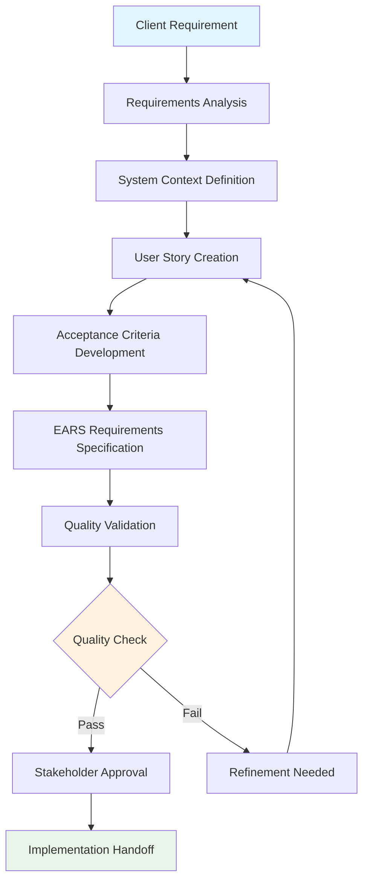
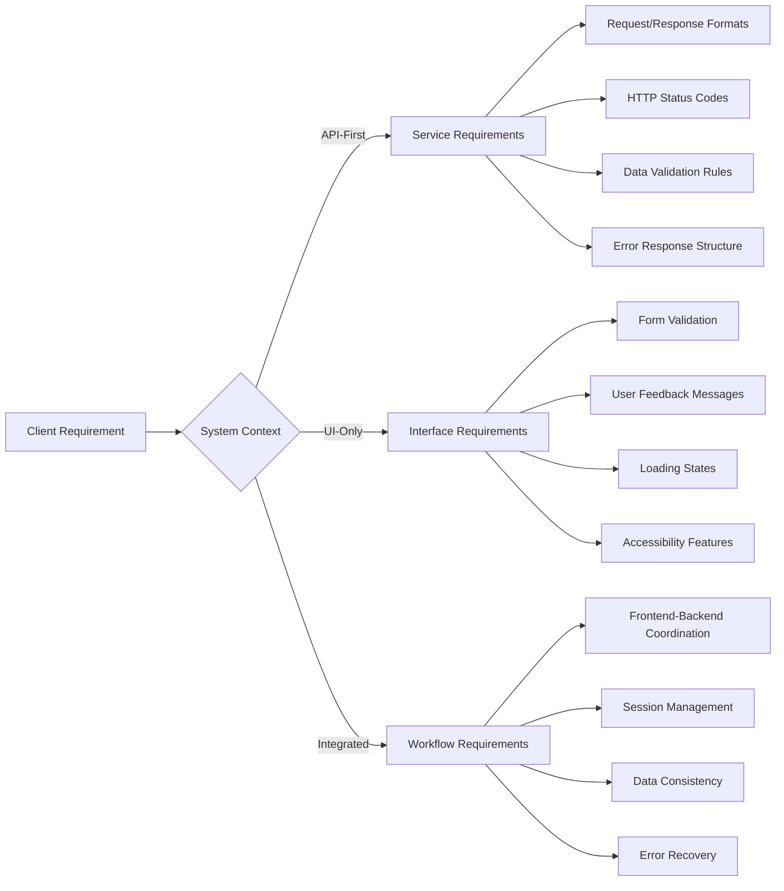
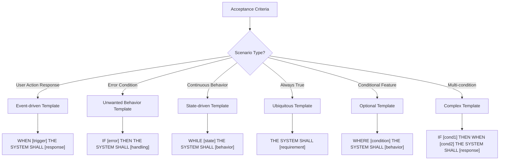
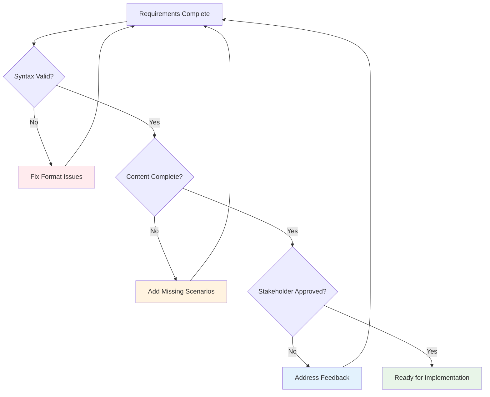
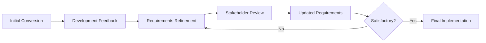

# Conversion Workflow: From Client Requirements to EARS Specifications

## 🔄 Overview

This document provides a comprehensive workflow diagram and detailed process flow for converting client requirements through user stories with acceptance criteria to precise EARS requirements. The workflow includes decision points, validation gates, and system context considerations.

## 📋 Workflow Stages Overview



## 🎯 Detailed Workflow Process

### Stage 1: Requirements Analysis

#### Input Processing
```
📥 INPUT: Raw client requirement
"I want a login feature where users can log in with email/username and password"

🔍 ANALYSIS ACTIVITIES:
├── Element Extraction
│   ├── Actor Identification: "users"
│   ├── Action Definition: "log in"
│   ├── Method Specification: "email/username and password"
│   └── Context Understanding: "authentication system"
│
├── Implicit Requirement Discovery
│   ├── Security Considerations: password protection, encryption
│   ├── Validation Needs: email format, password strength
│   ├── Error Handling: invalid credentials, account lockout
│   └── User Experience: feedback messages, loading states
│
└── Assumption Documentation
    ├── User Account Existence: assumes registration process exists
    ├── Dual Login Methods: both email and username supported
    ├── Session Management: post-login state handling required
    └── Security Standards: password hashing and secure storage
```

#### Analysis Decision Tree
```
Decision: What type of authentication requirement is this?
├── Simple Login → Basic authentication flow
├── Complex Authentication → Multi-factor, OAuth, SSO
├── Registration Integration → Combined login/register flow
└── Security-Critical → Enhanced security requirements

Decision: What are the primary user types?
├── End Users → Customer-facing requirements
├── API Consumers → Developer-facing requirements  
├── Administrators → Admin panel requirements
└── System Integrators → B2B integration requirements
```

### Stage 2: System Context Definition

#### Context Selection Matrix
```
System Context Analysis:
┌─────────────────┬──────────────┬──────────────┬─────────────────┐
│ Context Type    │ Primary Focus│ Key Outputs  │ Stakeholders    │
├─────────────────┼──────────────┼──────────────┼─────────────────┤
│ API-First       │ Data Contracts│ JSON Schemas │ Backend Devs    │
│                 │ Service Logic │ Error Codes  │ API Consumers   │
├─────────────────┼──────────────┼──────────────┼─────────────────┤
│ UI-Only         │ User Interface│ UI Components│ Frontend Devs   │
│                 │ Interactions  │ UX Flows     │ Designers       │
├─────────────────┼──────────────┼──────────────┼─────────────────┤
│ Integrated      │ End-to-End    │ Full Workflows│ Full-Stack Team │
│                 │ Coordination  │ Data Flow    │ Product Manager │
└─────────────────┴──────────────┴──────────────┴─────────────────┘
```

#### Context Impact on Requirements


### Stage 3: User Story Creation

#### Story Development Process
```yaml
User Story Development:
  Step_1_Actor_Definition:
    Process: "Identify specific user types from analysis"
    Output: "As a [specific user role]"
    Validation: "Actor must be specific, not generic 'user'"
    
  Step_2_Functionality_Specification:
    Process: "Define specific capability from client requirement"
    Output: "I want [specific functionality]"
    Validation: "Functionality must be actionable and measurable"
    
  Step_3_Benefit_Articulation:
    Process: "Connect to business value and user goals"
    Output: "So that [specific business benefit]"
    Validation: "Benefit must be verifiable and valuable"
    
  Step_4_Story_Sizing:
    Process: "Estimate complexity and effort"
    Methods: ["Planning Poker", "T-Shirt Sizing", "Fibonacci Scale"]
    Output: "Story Points: [1-13]"
    
  Step_5_Prioritization:
    Framework: "MoSCoW Method"
    Categories: ["Must Have", "Should Have", "Could Have", "Won't Have"]
    Output: "Priority: [Must/Should/Could/Won't]"
```

#### Story Quality Gates
```
Quality Gate Checklist:
✅ INVEST Criteria:
   ├── Independent: Can be developed standalone
   ├── Negotiable: Details can be discussed and refined
   ├── Valuable: Provides clear business value
   ├── Estimable: Size and effort can be determined
   ├── Small: Can be completed in one sprint
   └── Testable: Acceptance criteria can be verified

✅ Content Validation:
   ├── Actor is specific and well-defined
   ├── Functionality is clear and actionable
   ├── Business benefit is measurable
   └── Story aligns with system context
```

### Stage 4: Acceptance Criteria Development

#### Criteria Development Framework
```
Acceptance Criteria Structure:
📋 SCENARIO CATEGORIES:
├── Happy Path Scenarios (Primary Success)
│   ├── Standard user workflow
│   ├── Expected system behavior
│   ├── Success confirmation
│   └── Next steps/navigation
│
├── Error Scenarios (Exception Handling)
│   ├── Input validation failures
│   ├── System error conditions
│   ├── Network/connectivity issues
│   └── Security/authorization failures
│
├── Edge Cases (Boundary Conditions)
│   ├── Minimum/maximum values
│   ├── Unusual but valid inputs
│   ├── Race conditions
│   └── State transition boundaries
│
└── Non-Functional Scenarios
    ├── Performance requirements
    ├── Security validations
    ├── Accessibility compliance
    └── Browser/device compatibility
```

#### Given-When-Then Template Application
```
Scenario Template Structure:
┌─────────────────────────────────────────────────────────────┐
│ **Given** [Precondition - System state and context]        │
│ **When**  [Action - User or system trigger]                │
│ **Then**  [Outcome - Expected result and side effects]     │
│                                                             │
│ Optional Extensions:                                        │
│ **And**   [Additional conditions or outcomes]              │
│ **But**   [Constraints or exceptions]                      │
└─────────────────────────────────────────────────────────────┘

Example Application:
Given I am on the login page with valid account credentials
When I enter my email and password and click "Log In"  
Then I should be authenticated and redirected to my dashboard
And I should see a welcome message with my name
But I should not see any other user's personal information
```

### Stage 5: EARS Requirements Specification

#### EARS Template Selection Logic


#### System Context Application Rules

**API-First Context Rules:**
```yaml
API_Context_Patterns:
  Request_Processing:
    Template: "WHEN client sends [HTTP method] to [endpoint] with [parameters]"
    Response: "THE SYSTEM SHALL return [HTTP status] with [data structure] within [time]"
    
  Error_Handling:
    Template: "WHEN request contains [invalid condition]"
    Response: "THE SYSTEM SHALL return [error status] with [error details]"
    
  Performance:
    Template: "THE SYSTEM SHALL process [operation] within [time limit]"
    
  Security:
    Template: "THE SYSTEM SHALL validate [security requirement] for all requests"
```

**UI-Only Context Rules:**
```yaml
UI_Context_Patterns:
  User_Interaction:
    Template: "WHEN user [interaction] on [UI element]"
    Response: "THE SYSTEM SHALL [UI response] within [time]"
    
  Form_Validation:
    Template: "WHEN user [input action] with [invalid data]"
    Response: "THE SYSTEM SHALL display [validation message] near [field]"
    
  Loading_States:
    Template: "WHILE [operation] is processing"
    Response: "THE SYSTEM SHALL display [loading indicator]"
    
  Accessibility:
    Template: "THE SYSTEM SHALL support [accessibility feature] for [user type]"
```

**Integrated Context Rules:**
```yaml
Integrated_Context_Patterns:
  End_to_End_Flow:
    Template: "WHEN user completes [workflow action]"
    Response: "THE SYSTEM SHALL [frontend action] AND [backend action] within [time]"
    
  Data_Synchronization:
    Template: "WHEN [data change] occurs in [system component]"
    Response: "THE SYSTEM SHALL update [related components] within [time]"
    
  Session_Management:
    Template: "WHILE user session is [state]"
    Response: "THE SYSTEM SHALL maintain [session behavior] across [components]"
```

### Stage 6: Quality Validation

#### Multi-Level Validation Process
```
Validation Levels:
┌─ Level 1: Syntax Validation ─────────────────────────────────┐
│ ✅ EARS format compliance                                    │
│ ✅ Template pattern matching                                 │
│ ✅ Required elements present                                 │
│ ✅ Grammar and spelling check                                │
└──────────────────────────────────────────────────────────────┘

┌─ Level 2: Content Validation ────────────────────────────────┐
│ ✅ Traceability to user stories                             │
│ ✅ Completeness of scenario coverage                         │
│ ✅ Consistency across requirements                           │
│ ✅ Testability of each requirement                           │
└──────────────────────────────────────────────────────────────┘

┌─ Level 3: Stakeholder Validation ────────────────────────────┐
│ ✅ Business value alignment                                  │
│ ✅ Technical feasibility confirmation                        │
│ ✅ Integration point verification                            │
│ ✅ Implementation readiness check                            │
└──────────────────────────────────────────────────────────────┘
```

#### Validation Decision Points


### Stage 7: Implementation Handoff

#### Handoff Package Contents
```
Implementation Package:
📦 COMPLETE PACKAGE INCLUDES:
├── 📋 Original Client Requirement
│   └── Context and background information
│
├── 📖 User Stories with Acceptance Criteria
│   ├── Business value justification
│   ├── Priority and story points
│   └── Dependencies and assumptions
│
├── 🎯 EARS Requirements Specification
│   ├── Functional requirements by scenario
│   ├── Non-functional requirements
│   ├── System context considerations
│   └── Integration requirements
│
├── ✅ Quality Validation Results
│   ├── Validation checklist completion
│   ├── Stakeholder approval records
│   └── Known limitations or constraints
│
└── 🔧 Implementation Guidance
    ├── Suggested development approach
    ├── Testing strategy recommendations
    ├── Risk areas and mitigation strategies
    └── Success criteria and metrics
```

## 🔀 Alternative Workflow Paths

### Fast-Track Process (Simple Requirements)
```
Simplified Workflow for Low-Complexity Requirements:
Client Requirement → Quick Analysis → Direct EARS Conversion → Validation

Criteria for Fast-Track:
✅ Single user type
✅ Single main scenario
✅ Minimal integration needs
✅ Standard patterns

Example: "I want users to be able to change their password"
→ Direct conversion to EARS without full user story development
```

### Complex Requirement Process (Multi-Feature)
```
Extended Workflow for High-Complexity Requirements:
Client Requirement → Epic Breakdown → Multiple User Stories → Story Mapping → 
Individual EARS Conversion → Integration Analysis → Validation

Criteria for Complex Process:
⚠️ Multiple user types
⚠️ Multiple interconnected features  
⚠️ Complex business logic
⚠️ Significant integration requirements

Example: "I want a complete user management system"
→ Break into registration, login, profile, admin, etc.
```

### Iterative Refinement Process


## 📊 Workflow Metrics and KPIs

### Process Efficiency Metrics
```yaml
Workflow_Metrics:
  Conversion_Time:
    Simple_Requirements: "2-4 hours"
    Medium_Requirements: "1-2 days"
    Complex_Requirements: "3-5 days"
    
  Iteration_Count:
    Target: "≤2 iterations before approval"
    Threshold: "≥3 iterations indicates process issue"
    
  Stakeholder_Approval_Rate:
    Target: "≥90% first-time approval"
    Measurement: "Approved without major revisions"
    
  Implementation_Success_Rate:
    Target: "≥95% requirements implemented without clarification"
    Measurement: "Developer questions per requirement"
```

### Quality Indicators
```yaml
Quality_Metrics:
  Requirements_Coverage:
    Happy_Path: "100% covered"
    Error_Scenarios: "≥80% major errors covered"
    Edge_Cases: "≥60% identified edge cases covered"
    
  EARS_Compliance:
    Format_Compliance: "100% proper template usage"
    Testability_Score: "≥95% directly testable"
    Clarity_Rating: "≥4.5/5 from development teams"
    
  Traceability_Score:
    Client_to_Story: "100% traceable"
    Story_to_EARS: "100% traceable"
    EARS_to_Tests: "≥90% traceable"
```

## 🎯 Workflow Optimization Tips

### Efficiency Improvements
1. **Template Libraries**: Pre-built templates for common requirement types
2. **Automated Validation**: Scripts to check EARS format compliance
3. **Stakeholder Workshops**: Collaborative conversion sessions
4. **Tool Integration**: Connect with project management and development tools

### Common Bottlenecks and Solutions
```yaml
Bottleneck_Solutions:
  Stakeholder_Availability:
    Problem: "Delays in approval and feedback"
    Solution: "Asynchronous review processes and clear SLAs"
    
  Requirements_Complexity:
    Problem: "Unclear or changing requirements"
    Solution: "Structured analysis templates and assumption documentation"
    
  Technical_Feasibility:
    Problem: "Requirements not implementable as specified"
    Solution: "Early technical review and feasibility checkpoints"
    
  Context_Misalignment:
    Problem: "Requirements don't match implementation approach"
    Solution: "Clear context definition before conversion begins"
```

## Navigation

← [Implementation Guide](implementation-guide.md) | [Template Examples →](template-examples.md)

---

*This workflow documentation provides a comprehensive process framework for systematic requirements conversion, ensuring consistent quality and implementation readiness across all project contexts and complexity levels.*