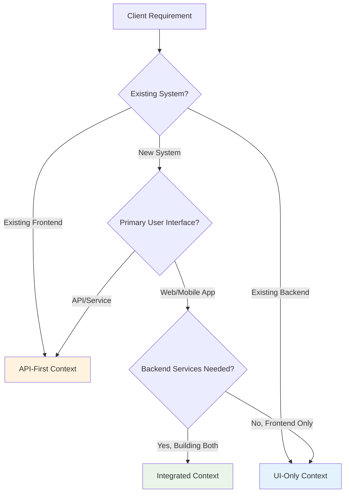

# System Context Analysis: Requirements Conversion by Implementation Approach

## 🎯 Overview

This document provides detailed analysis of how system implementation context fundamentally shapes requirements conversion from client statements to EARS specifications. Understanding the target system architecture is crucial for creating appropriate, actionable requirements that align with development approach and technical constraints.

## 🏗️ System Context Framework

### Context Definition Matrix

```yaml
System_Context_Types:
  API_First:
    Description: "Backend service implementation focusing on data contracts and business logic"
    Primary_Concerns: ["Data processing", "Service interfaces", "Business rules", "Integration contracts"]
    Development_Focus: "Server-side logic, database operations, API contracts"
    Typical_Stakeholders: ["Backend developers", "API consumers", "System integrators"]
    
  UI_Only:
    Description: "Frontend implementation consuming existing services or APIs"
    Primary_Concerns: ["User interactions", "Interface design", "User experience", "Client-side validation"]
    Development_Focus: "User interface, user experience, frontend logic"
    Typical_Stakeholders: ["Frontend developers", "UX designers", "End users"]
    
  Integrated:
    Description: "Full-stack implementation coordinating frontend and backend components"
    Primary_Concerns: ["End-to-end workflows", "Data consistency", "Performance optimization", "System coordination"]
    Development_Focus: "Complete user journeys, system integration, workflow orchestration"
    Typical_Stakeholders: ["Full-stack teams", "Product managers", "System architects"]
```

## 🔧 API-First Context Analysis

### Requirements Characteristics

**Primary Focus Areas:**
- Request/response data structures
- HTTP status codes and error handling
- Business logic and validation rules
- Performance and scalability requirements
- Security and authentication protocols

**Language and Terminology:**
- Technical precision over user experience language
- Emphasis on data contracts and service behavior
- Detailed error condition specifications
- Performance metrics and SLA requirements

### Conversion Patterns

#### Client Requirement Translation
```
Client Statement: "I want users to be able to update their profile information"

API-First Analysis:
├── Service Endpoint: PUT /api/users/{userId}/profile
├── Data Contract: Profile update request/response schemas
├── Validation Rules: Field validation and business rule enforcement
├── Error Handling: HTTP status codes for various failure scenarios
├── Security: Authentication token validation and authorization
└── Performance: Response time and throughput requirements
```

#### EARS Template Preferences
```yaml
API_First_EARS_Patterns:
  Most_Common: "Event-driven (WHEN request... THE SYSTEM SHALL respond...)"
  Secondary: "Unwanted Behavior (IF invalid data... THEN return error...)"
  Performance: "Ubiquitous (THE SYSTEM SHALL process within X seconds)"
  Security: "Ubiquitous (THE SYSTEM SHALL validate authentication)"
  
Example_Templates:
  - "WHEN client sends POST to /api/auth/login with valid credentials"
  - "THE SYSTEM SHALL return HTTP 200 with JWT token within 2 seconds"
  - "IF request body is malformed THEN return HTTP 400 with validation errors"
```

### API-First Requirements Deep Dive

#### Data Contract Focus
```markdown
# API-First: Login Feature Requirements

## Request/Response Specifications
WHEN client sends POST request to /api/auth/login with JSON body containing email and password
THE SYSTEM SHALL validate request format and return appropriate response within 2 seconds

### Request Schema Requirements:
{
  "email": "string (required, valid email format)",
  "password": "string (required, min 8 characters)"
}

### Success Response (HTTP 200):
{
  "token": "string (JWT token)",
  "user": {
    "id": "string",
    "email": "string", 
    "firstName": "string",
    "lastName": "string"
  },
  "expiresAt": "ISO 8601 timestamp"
}

### Error Response Examples:
HTTP 400 - Bad Request:
{
  "error": "VALIDATION_FAILED",
  "message": "Request validation failed",
  "details": [
    {"field": "email", "message": "Valid email address required"},
    {"field": "password", "message": "Password must be at least 8 characters"}
  ]
}

HTTP 401 - Unauthorized:
{
  "error": "INVALID_CREDENTIALS", 
  "message": "Invalid email or password"
}
```

#### Service Behavior Requirements
```markdown
## Business Logic Requirements

WHEN authentication request contains valid email and password matching database records
THE SYSTEM SHALL generate JWT token with user claims and 24-hour expiration

WHEN authentication fails due to invalid credentials
THE SYSTEM SHALL increment failed attempt counter and return generic error message without revealing which field was incorrect

WHEN account has exceeded 5 failed login attempts within 15 minutes
THE SYSTEM SHALL temporarily lock account and return locked account error

## Performance Requirements

THE SYSTEM SHALL process authentication requests within 2 seconds under normal load (100 requests/second)
THE SYSTEM SHALL support up to 1000 concurrent authentication requests without service degradation
THE SYSTEM SHALL maintain 99.9% availability for authentication endpoints

## Security Requirements

THE SYSTEM SHALL hash passwords using bcrypt with minimum 12 rounds
THE SYSTEM SHALL never log passwords or include them in error messages
THE SYSTEM SHALL require HTTPS for all authentication endpoints
THE SYSTEM SHALL validate JWT tokens on all protected endpoints
```

### API Consumer Considerations

```yaml
API_Consumer_Requirements:
  Documentation_Needs:
    - Complete API specification (OpenAPI/Swagger)
    - Example requests and responses for all scenarios
    - Error code reference with handling guidance
    - Rate limiting and throttling information
    
  Integration_Requirements:
    - Consistent error response format across all endpoints
    - Predictable HTTP status code usage
    - Clear authentication and authorization requirements
    - Versioning strategy for API evolution
    
  Developer_Experience:
    - SDK or client library availability
    - Sandbox environment for testing
    - Webhook support for real-time updates
    - Comprehensive testing and debugging tools
```

## 🖥️ UI-Only Context Analysis

### Requirements Characteristics

**Primary Focus Areas:**
- User interface interactions and workflows
- Visual feedback and user experience
- Client-side validation and error handling
- Accessibility and usability requirements
- Responsive design and device compatibility

**Language and Terminology:**
- User-centric language and scenarios
- Emphasis on visual elements and interactions
- Detailed user feedback specifications
- Accessibility and inclusive design requirements

### Conversion Patterns

#### Client Requirement Translation
```
Client Statement: "I want users to be able to update their profile information"

UI-Only Analysis:
├── Form Design: Profile editing form with appropriate fields
├── Validation: Real-time client-side validation feedback
├── User Feedback: Success/error messages and loading states
├── Navigation: How users access and exit profile editing
├── Accessibility: Screen reader support and keyboard navigation
└── Responsive Design: Mobile and desktop optimization
```

#### EARS Template Preferences
```yaml
UI_Only_EARS_Patterns:
  Most_Common: "Event-driven (WHEN user clicks/types... THE SYSTEM SHALL display...)"
  Secondary: "State-driven (WHILE form is loading... THE SYSTEM SHALL show...)"
  Validation: "Unwanted Behavior (IF field is invalid... THEN show error...)"
  Accessibility: "Ubiquitous (THE SYSTEM SHALL support screen readers)"
  
Example_Templates:
  - "WHEN user enters text in email field THE SYSTEM SHALL validate format in real-time"
  - "WHILE login request is processing THE SYSTEM SHALL display loading spinner"
  - "IF password field is empty THEN show 'Password required' message"
```

### UI-Only Requirements Deep Dive

#### User Interaction Focus
```markdown
# UI-Only: Login Feature Requirements

## Form Display and Interaction
WHEN user navigates to login page
THE SYSTEM SHALL display login form with email field, password field, and "Log In" button

WHEN user clicks or tabs into email field
THE SYSTEM SHALL set focus with visible focus indicator and cursor positioning

WHEN user types in email field
THE SYSTEM SHALL validate email format in real-time and show validation status icon

## Visual Feedback Requirements
WHEN user submits login form with valid data
THE SYSTEM SHALL disable submit button, show loading spinner, and display "Signing in..." text

WHEN login succeeds
THE SYSTEM SHALL hide loading indicator and show brief success message before redirect

WHEN login fails
THE SYSTEM SHALL display "Invalid email or password" error message in red text above form

WHEN user makes multiple failed attempts
THE SYSTEM SHALL display increasingly specific error messages and security guidance

## Accessibility Requirements
THE SYSTEM SHALL provide proper ARIA labels for all form elements
THE SYSTEM SHALL announce form validation errors to screen readers immediately
THE SYSTEM SHALL support complete keyboard navigation without mouse dependency
THE SYSTEM SHALL maintain focus management during form submission and error states
THE SYSTEM SHALL meet WCAG 2.1 AA color contrast requirements for all text and UI elements

## Responsive Design Requirements
WHEN accessed on mobile devices (viewport < 768px)
THE SYSTEM SHALL display single-column form layout with touch-optimized button sizes

WHEN virtual keyboard appears on mobile
THE SYSTEM SHALL adjust viewport to keep submit button visible and accessible

WHEN form is displayed on tablets (768px - 1024px)
THE SYSTEM SHALL maintain usable form proportions with appropriate spacing
```

#### User Experience Specifications
```markdown
## Loading and Transition States
WHILE login request is in progress
THE SYSTEM SHALL prevent form resubmission and provide clear processing feedback

WHEN transitioning between login states (idle → loading → success/error)
THE SYSTEM SHALL use smooth transitions (300ms duration) to maintain visual continuity

## Error Recovery and Guidance
WHEN user encounters login errors
THE SYSTEM SHALL provide actionable guidance such as "Forgot password?" link

WHEN user enters invalid email format
THE SYSTEM SHALL show example of valid email format: "Example: user@domain.com"

WHEN account is locked due to failed attempts
THE SYSTEM SHALL display estimated unlock time and provide alternative access options

## Performance and Responsiveness
THE SYSTEM SHALL render complete login form within 1 second on 3G connections
THE SYSTEM SHALL respond to all user input within 100 milliseconds
THE SYSTEM SHALL cache form validation logic to prevent network delays
```

### Frontend Integration Considerations

```yaml
Frontend_Integration_Requirements:
  API_Communication:
    - Handle network connectivity issues gracefully
    - Implement retry logic for failed requests
    - Cache user preferences and form state locally
    - Manage authentication state across browser sessions
    
  State_Management:
    - Maintain form state during validation errors
    - Preserve user input during network interruptions  
    - Synchronize authentication state across components
    - Handle session expiration and renewal
    
  Performance_Optimization:
    - Lazy load non-critical form elements
    - Optimize bundle size for fast initial load
    - Use progressive enhancement for advanced features
    - Implement client-side caching strategies
```

## 🔄 Integrated Context Analysis

### Requirements Characteristics

**Primary Focus Areas:**
- End-to-end user workflows and data flow
- Frontend-backend coordination and consistency
- System-wide performance and reliability
- Cross-component error handling and recovery
- Holistic security and user experience

**Language and Terminology:**
- Workflow-oriented language spanning multiple systems
- Emphasis on data consistency and coordination
- Comprehensive error scenarios across system boundaries
- Performance requirements for complete user journeys

### Conversion Patterns

#### Client Requirement Translation
```
Client Statement: "I want users to be able to update their profile information"

Integrated Analysis:
├── Complete Workflow: User journey from form display through successful update
├── Data Flow: Frontend validation → API processing → database update → UI refresh
├── Coordination: How frontend and backend maintain consistency
├── Error Recovery: How system handles failures at any stage
├── Performance: End-to-end timing for complete user experience
└── Security: Authentication and authorization across all components
```

#### EARS Template Preferences
```yaml
Integrated_EARS_Patterns:
  Most_Common: "Event-driven (WHEN user completes action... THE SYSTEM SHALL coordinate...)"
  Secondary: "Complex (IF condition THEN WHEN trigger... THE SYSTEM SHALL orchestrate...)"
  Coordination: "State-driven (WHILE operation in progress... THE SYSTEM SHALL maintain...)"
  Consistency: "Ubiquitous (THE SYSTEM SHALL ensure data consistency across...)"
  
Example_Templates:
  - "WHEN user submits profile update THE SYSTEM SHALL validate frontend, process backend, and refresh UI within 5 seconds"
  - "WHILE profile update is processing THE SYSTEM SHALL maintain consistent state across frontend and backend"
  - "IF backend update fails THEN THE SYSTEM SHALL revert frontend changes and display error message"
```

### Integrated Requirements Deep Dive

#### End-to-End Workflow Focus
```markdown
# Integrated: Login Feature Requirements

## Complete Authentication Flow
WHEN user submits login form with valid credentials
THE SYSTEM SHALL validate on frontend, authenticate via backend API, establish session, update UI state, and redirect to dashboard within 3 seconds

WHEN authentication succeeds
THE SYSTEM SHALL create secure session in backend, store authentication state in frontend, update user context across all components, and log security event

## Cross-Component Coordination
WHEN user login state changes in any part of the system
THE SYSTEM SHALL synchronize authentication status across all frontend components and maintain backend session consistency

WHILE user session is active
THE SYSTEM SHALL validate session tokens on each backend request, refresh frontend authentication state, and extend session expiration by 30 minutes

WHEN session expires due to inactivity
THE SYSTEM SHALL clear backend session data, update frontend authentication state, redirect to login page, and display "Session expired" message

## Data Consistency Requirements
WHEN user profile data changes during active session
THE SYSTEM SHALL update backend database, refresh frontend user context, invalidate relevant caches, and maintain session validity

WHEN concurrent login attempts occur for same user
THE SYSTEM SHALL handle race conditions properly, maintain data integrity, and provide consistent user experience

## Integrated Error Handling
WHEN login fails due to invalid credentials
THE SYSTEM SHALL increment backend failed attempt counter, update frontend error state, display appropriate message, and maintain secure session handling

WHEN network connectivity issues occur during login
THE SYSTEM SHALL detect connection problems, provide user feedback, implement retry logic, and maintain form state for recovery

WHEN backend services are unavailable during login attempt
THE SYSTEM SHALL detect service unavailability, display maintenance message, implement graceful degradation, and log incidents for monitoring

## Performance Integration
THE SYSTEM SHALL optimize database queries, API calls, and frontend rendering to complete login flow within 3 seconds
THE SYSTEM SHALL implement caching strategies across backend and frontend to improve response times
THE SYSTEM SHALL use connection pooling, CDN, and other optimizations to support 1000+ concurrent users
```

#### System Orchestration Requirements
```markdown
## Security Integration
THE SYSTEM SHALL encrypt authentication data in transit between frontend and backend using TLS 1.3
THE SYSTEM SHALL store session tokens securely using HTTP-only cookies with proper SameSite settings
THE SYSTEM SHALL implement CSRF protection across all authentication endpoints and forms
THE SYSTEM SHALL coordinate security events between frontend monitoring and backend audit logs

## Monitoring and Observability
WHEN authentication errors occur at any system level
THE SYSTEM SHALL correlate frontend and backend logs, track error patterns, and alert administrators

THE SYSTEM SHALL monitor end-to-end authentication performance, user experience metrics, and system health indicators
THE SYSTEM SHALL track conversion rates, abandonment points, and user satisfaction across complete login workflow

## Recovery and Resilience
WHEN any component of the login system fails
THE SYSTEM SHALL implement circuit breakers, fallback mechanisms, and graceful degradation strategies

WHEN system recovery occurs after outages
THE SYSTEM SHALL restore user sessions, maintain data consistency, and provide smooth user experience recovery
```

### Full-Stack Coordination Considerations

```yaml
Full_Stack_Coordination:
  Architecture_Alignment:
    - Consistent data models between frontend and backend
    - Shared validation logic and business rules
    - Coordinated error handling and recovery strategies
    - Unified security and authentication approach
    
  Development_Workflow:
    - API contract definition before implementation
    - Shared testing strategies and test data
    - Coordinated deployment and versioning
    - Integrated monitoring and debugging tools
    
  Operational_Concerns:
    - Health check endpoints across all components
    - Distributed tracing for complex workflows
    - Performance monitoring at each system layer
    - Incident response coordination across teams
```

## 🔍 Context Selection Guidelines

### Decision Framework



### Context Selection Checklist

```yaml
Context_Selection_Criteria:
  Choose_API_First_When:
    - Primary deliverable is a service or API
    - Multiple frontend clients will consume the service
    - Backend logic is complex and business-critical
    - Integration with other systems is primary concern
    - Developer/system-to-system communication is main use case
    
  Choose_UI_Only_When:
    - Backend services already exist and are stable
    - Focus is on user experience and interface design
    - Frontend team is separate from backend team
    - Existing APIs meet all backend requirements
    - Primary concern is user interaction and usability
    
  Choose_Integrated_When:
    - Building complete system from scratch
    - Frontend and backend must be highly coordinated
    - End-to-end user experience is primary concern
    - Data consistency across layers is critical
    - Single team responsible for entire stack
```

## 📊 Context Impact on Requirements Quality

### Comparative Analysis

```yaml
Requirements_Quality_Comparison:
  Specificity:
    API_First: "Highest - Precise data contracts and service behavior"
    UI_Only: "Medium - User interaction and interface specifics"
    Integrated: "High - Comprehensive workflow specifications"
    
  Testability:
    API_First: "Excellent - Direct API testing possible"
    UI_Only: "Good - UI automation and user testing"
    Integrated: "Excellent - End-to-end testing coverage"
    
  Implementation_Clarity:
    API_First: "High - Clear service implementation path"
    UI_Only: "Medium - Dependent on API design assumptions"
    Integrated: "High - Complete system understanding"
    
  Stakeholder_Alignment:
    API_First: "Technical stakeholders - High"
    UI_Only: "Business stakeholders - High"
    Integrated: "All stakeholders - Medium to High"
```

### Common Context Misalignment Issues

```yaml
Context_Pitfalls:
  API_First_Misused:
    Problem: "Using API-first for user-facing features without UI consideration"
    Symptom: "Requirements lack user experience specifications"
    Solution: "Include UI context or choose integrated approach"
    
  UI_Only_Misused:
    Problem: "Assuming backend behavior without proper API specifications"
    Symptom: "Requirements depend on undefined backend functionality"
    Solution: "Define API contract or choose integrated approach"
    
  Integrated_Overused:
    Problem: "Using integrated context for simple, bounded features"
    Symptom: "Over-specified requirements for straightforward implementations"
    Solution: "Choose more focused context based on primary concern"
```

## 🎯 Context-Specific Best Practices

### API-First Best Practices

1. **Data Contract First**: Define request/response schemas before writing requirements
2. **Error Scenarios**: Comprehensive HTTP status code and error response specifications
3. **Performance SLAs**: Specific timing and throughput requirements
4. **Security by Design**: Authentication, authorization, and data protection requirements
5. **Versioning Strategy**: Plan for API evolution and backward compatibility

### UI-Only Best Practices

1. **User Journey Focus**: Requirements follow natural user workflows
2. **Visual Specifications**: Detailed feedback, loading states, and error presentations
3. **Accessibility First**: Include accessibility requirements from the start
4. **Device Considerations**: Mobile, tablet, and desktop responsive requirements
5. **Performance Budget**: Frontend performance and loading time specifications

### Integrated Best Practices

1. **End-to-End Thinking**: Requirements span complete user workflows
2. **Data Flow Clarity**: How information moves between system components
3. **Error Recovery**: How system handles failures at any component level
4. **Performance Holistic**: Complete journey timing and optimization
5. **Consistency Maintenance**: How system maintains state across components

## Navigation

← [Template Examples](template-examples.md) | [Best Practices →](best-practices.md)

---

*This system context analysis provides the framework for choosing appropriate conversion approaches based on implementation architecture, ensuring requirements align with development approach and stakeholder needs.*