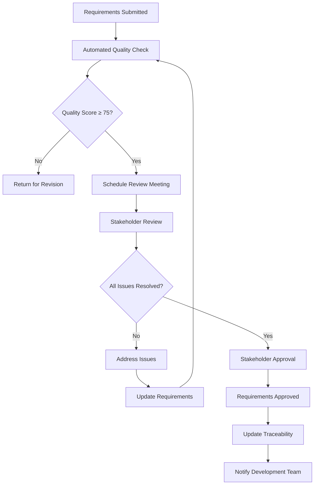

# Quality Assurance for EARS Notation

## Overview

Quality assurance for EARS (Easy Approach to Requirements Syntax) notation ensures that requirements are not only syntactically correct but also complete, testable, and valuable for development teams. This guide provides comprehensive strategies for maintaining high-quality EARS requirements throughout the software development lifecycle.

## Quality Framework

### Quality Dimensions for EARS Requirements

#### 1. Syntactic Quality
**Definition**: Adherence to EARS template patterns and syntax rules

**Measurement Criteria**:
- Template compliance (100% target)
- Proper use of trigger words (WHEN, IF, WHILE, WHERE)
- Correct subject-verb-object structure
- Consistent terminology usage

**Quality Gates**:
- ✅ **Excellent (95-100%)**: All requirements follow EARS templates correctly
- ⚠️ **Good (85-94%)**: Minor syntax variations that don't affect meaning
- ❌ **Poor (<85%)**: Significant syntax errors that create ambiguity

#### 2. Semantic Quality
**Definition**: Clarity, completeness, and unambiguous meaning of requirements

**Measurement Criteria**:
- Absence of ambiguous terms
- Specific, measurable criteria
- Clear trigger conditions
- Precise system responses

**Quality Gates**:
- ✅ **Excellent (90-100%)**: All requirements are clear and unambiguous
- ⚠️ **Good (75-89%)**: Minor ambiguities that don't significantly impact implementation
- ❌ **Poor (<75%)**: Significant ambiguities requiring clarification

#### 3. Testability Quality
**Definition**: Ability to objectively verify requirement fulfillment

**Measurement Criteria**:
- Measurable acceptance criteria
- Clear pass/fail conditions
- Objective verification methods
- Automated test generation capability

**Quality Gates**:
- ✅ **Excellent (95-100%)**: All requirements directly testable
- ⚠️ **Good (80-94%)**: Most requirements testable with minor interpretation
- ❌ **Poor (<80%)**: Significant portions require subjective assessment

#### 4. Completeness Quality
**Definition**: Coverage of all necessary scenarios and edge cases

**Measurement Criteria**:
- Happy path coverage
- Error condition handling
- Edge case identification
- Integration scenario coverage

**Quality Gates**:
- ✅ **Excellent (90-100%)**: Comprehensive scenario coverage
- ⚠️ **Good (75-89%)**: Good coverage with minor gaps
- ❌ **Poor (<75%)**: Significant coverage gaps

## Quality Assessment Methodology

### Automated Quality Scoring System

```python
# ears_quality_assessor.py
import re
import json
from typing import Dict, List, Tuple
from dataclasses import dataclass
from enum import Enum

class QualityLevel(Enum):
    EXCELLENT = "excellent"
    GOOD = "good"
    FAIR = "fair"
    POOR = "poor"

@dataclass
class QualityIssue:
    category: str
    severity: str  # error, warning, info
    message: str
    suggestion: str
    line_number: int = None

@dataclass
class QualityMetrics:
    syntactic_score: float
    semantic_score: float
    testability_score: float
    completeness_score: float
    overall_score: float
    quality_level: QualityLevel
    issues: List[QualityIssue]

class EarsQualityAssessor:
    def __init__(self):
        self.ears_templates = {
            'ubiquitous': r'^The system shall .+$',
            'event_driven': r'^WHEN .+ the system shall .+$',
            'unwanted_behavior': r'^IF .+ THEN the system shall .+$',
            'state_driven': r'^WHILE .+ the system shall .+$',
            'optional': r'^WHERE .+ the system shall .+$',
            'complex': r'^IF .+ THEN WHEN .+ the system shall .+$'
        }
        
        self.ambiguous_terms = {
            'high': ['appropriate', 'reasonable', 'adequate', 'suitable', 'proper'],
            'medium': ['efficiently', 'effectively', 'quickly', 'slowly', 'fast'],
            'low': ['often', 'sometimes', 'usually', 'generally', 'normally']
        }
        
        self.measurability_indicators = [
            r'\d+\s*(second|minute|hour|day|week|month|year)s?',
            r'\d+\s*(ms|millisecond)s?',
            r'\d+\s*(kb|mb|gb|tb)',
            r'\d+\s*(%|percent)',
            r'within\s+\d+',
            r'less\s+than\s+\d+',
            r'greater\s+than\s+\d+',
            r'exactly\s+\d+',
            r'at\s+least\s+\d+',
            r'no\s+more\s+than\s+\d+'
        ]

    def assess_requirement(self, requirement: Dict) -> QualityMetrics:
        """Assess the quality of a single EARS requirement"""
        
        issues = []
        
        # Extract requirement text
        req_text = self._extract_requirement_text(requirement)
        
        # Assess each quality dimension
        syntactic_score = self._assess_syntactic_quality(req_text, issues)
        semantic_score = self._assess_semantic_quality(req_text, issues)
        testability_score = self._assess_testability_quality(requirement, issues)
        completeness_score = self._assess_completeness_quality(requirement, issues)
        
        # Calculate overall score
        weights = {'syntactic': 0.25, 'semantic': 0.30, 'testability': 0.25, 'completeness': 0.20}
        overall_score = (
            syntactic_score * weights['syntactic'] +
            semantic_score * weights['semantic'] +
            testability_score * weights['testability'] +
            completeness_score * weights['completeness']
        )
        
        # Determine quality level
        quality_level = self._determine_quality_level(overall_score)
        
        return QualityMetrics(
            syntactic_score=syntactic_score,
            semantic_score=semantic_score,
            testability_score=testability_score,
            completeness_score=completeness_score,
            overall_score=overall_score,
            quality_level=quality_level,
            issues=issues
        )

    def _extract_requirement_text(self, requirement: Dict) -> str:
        """Extract the main requirement text from various formats"""
        if isinstance(requirement, str):
            return requirement
        
        # Try different possible fields
        for field in ['requirement', 'text', 'description', 'ears.response']:
            if '.' in field:
                # Handle nested fields like 'ears.response'
                value = requirement
                for part in field.split('.'):
                    value = value.get(part, {})
                if isinstance(value, str):
                    return value
            else:
                if field in requirement and isinstance(requirement[field], str):
                    return requirement[field]
        
        return str(requirement)

    def _assess_syntactic_quality(self, req_text: str, issues: List[QualityIssue]) -> float:
        """Assess syntactic quality of EARS requirement"""
        score = 100.0
        
        # Check template compliance
        template_match = False
        matched_template = None
        
        for template_name, pattern in self.ears_templates.items():
            if re.match(pattern, req_text.strip(), re.IGNORECASE):
                template_match = True
                matched_template = template_name
                break
        
        if not template_match:
            score -= 50
            issues.append(QualityIssue(
                category='syntactic',
                severity='error',
                message='Requirement does not match any EARS template pattern',
                suggestion='Use one of the six EARS templates: ubiquitous, event-driven, unwanted behavior, state-driven, optional, or complex'
            ))
        
        # Check for consistent subject usage
        if 'the system shall' not in req_text.lower():
            score -= 10
            issues.append(QualityIssue(
                category='syntactic',
                severity='warning',
                message='Requirement should use "the system shall" as standard subject',
                suggestion='Use consistent subject format across all requirements'
            ))
        
        # Check for proper capitalization of EARS keywords
        ears_keywords = ['WHEN', 'IF', 'THEN', 'WHILE', 'WHERE']
        for keyword in ears_keywords:
            if keyword.lower() in req_text.lower() and keyword not in req_text:
                score -= 5
                issues.append(QualityIssue(
                    category='syntactic',
                    severity='info',
                    message=f'EARS keyword "{keyword}" should be capitalized',
                    suggestion='Use uppercase for EARS template keywords'
                ))
        
        return max(0, score)

    def _assess_semantic_quality(self, req_text: str, issues: List[QualityIssue]) -> float:
        """Assess semantic quality and clarity"""
        score = 100.0
        
        # Check for ambiguous terms
        req_lower = req_text.lower()
        
        for severity, terms in self.ambiguous_terms.items():
            for term in terms:
                if term in req_lower:
                    deduction = {'high': 15, 'medium': 10, 'low': 5}[severity]
                    score -= deduction
                    issues.append(QualityIssue(
                        category='semantic',
                        severity='warning' if severity == 'high' else 'info',
                        message=f'Ambiguous term found: "{term}"',
                        suggestion='Replace with specific, measurable criteria'
                    ))
        
        # Check for measurability
        has_measurement = any(re.search(pattern, req_text, re.IGNORECASE) 
                            for pattern in self.measurability_indicators)
        
        performance_indicators = ['response', 'process', 'complete', 'execute', 'load', 'save']
        has_performance_context = any(indicator in req_lower 
                                    for indicator in performance_indicators)
        
        if has_performance_context and not has_measurement:
            score -= 20
            issues.append(QualityIssue(
                category='semantic',
                severity='warning',
                message='Performance-related requirement lacks measurable criteria',
                suggestion='Add specific metrics (time, size, percentage, etc.)'
            ))
        
        # Check for atomic nature (single behavior)
        multiple_action_indicators = [' and ', ' then ', ' also ', ' plus ']
        if any(indicator in req_lower for indicator in multiple_action_indicators):
            score -= 10
            issues.append(QualityIssue(
                category='semantic',
                severity='info',
                message='Requirement may contain multiple actions',
                suggestion='Consider splitting into separate atomic requirements'
            ))
        
        return max(0, score)

    def _assess_testability_quality(self, requirement: Dict, issues: List[QualityIssue]) -> float:
        """Assess how easily the requirement can be tested"""
        score = 100.0
        
        # Check for acceptance criteria
        acceptance_criteria = requirement.get('acceptance_criteria', [])
        
        if not acceptance_criteria:
            score -= 30
            issues.append(QualityIssue(
                category='testability',
                severity='error',
                message='No acceptance criteria defined',
                suggestion='Add specific Given-When-Then acceptance criteria'
            ))
        else:
            # Validate acceptance criteria structure
            for i, criterion in enumerate(acceptance_criteria):
                if not isinstance(criterion, dict):
                    continue
                
                required_fields = ['given', 'when', 'then']
                missing_fields = [field for field in required_fields 
                                if field not in criterion or not criterion[field].strip()]
                
                if missing_fields:
                    score -= 10
                    issues.append(QualityIssue(
                        category='testability',
                        severity='warning',
                        message=f'Acceptance criterion {i+1} missing fields: {", ".join(missing_fields)}',
                        suggestion='Ensure all acceptance criteria have Given, When, and Then clauses'
                    ))
        
        # Check for measurable outcomes
        req_text = self._extract_requirement_text(requirement)
        has_measurable_outcome = any(re.search(pattern, req_text, re.IGNORECASE) 
                                   for pattern in self.measurability_indicators)
        
        if not has_measurable_outcome:
            # Check if this type of requirement should have measurements
            if any(word in req_text.lower() for word in ['performance', 'time', 'speed', 'load', 'response']):
                score -= 15
                issues.append(QualityIssue(
                    category='testability',
                    severity='warning',
                    message='Performance requirement lacks measurable success criteria',
                    suggestion='Define specific metrics for objective verification'
                ))
        
        return max(0, score)

    def _assess_completeness_quality(self, requirement: Dict, issues: List[QualityIssue]) -> float:
        """Assess completeness of requirement specification"""
        score = 100.0
        
        required_fields = ['id', 'title', 'category', 'priority']
        missing_fields = [field for field in required_fields if field not in requirement]
        
        if missing_fields:
            score -= 10 * len(missing_fields)
            issues.append(QualityIssue(
                category='completeness',
                severity='warning',
                message=f'Missing required metadata fields: {", ".join(missing_fields)}',
                suggestion='Include all required metadata for requirement traceability'
            ))
        
        # Check for stakeholder information
        metadata = requirement.get('metadata', {})
        if not metadata.get('stakeholders'):
            score -= 10
            issues.append(QualityIssue(
                category='completeness',
                severity='info',
                message='No stakeholders identified',
                suggestion='Identify stakeholders responsible for requirement validation'
            ))
        
        # Check for related requirements
        if not metadata.get('related_requirements'):
            score -= 5
            issues.append(QualityIssue(
                category='completeness',
                severity='info',
                message='No related requirements identified',
                suggestion='Consider linking to related requirements for better traceability'
            ))
        
        # Check for business justification
        if not requirement.get('business_value') and not requirement.get('rationale'):
            score -= 10
            issues.append(QualityIssue(
                category='completeness',
                severity='info',
                message='No business justification provided',
                suggestion='Include business value or rationale for the requirement'
            ))
        
        return max(0, score)

    def _determine_quality_level(self, overall_score: float) -> QualityLevel:
        """Determine quality level based on overall score"""
        if overall_score >= 90:
            return QualityLevel.EXCELLENT
        elif overall_score >= 75:
            return QualityLevel.GOOD
        elif overall_score >= 60:
            return QualityLevel.FAIR
        else:
            return QualityLevel.POOR

    def assess_requirements_set(self, requirements: List[Dict]) -> Dict:
        """Assess quality of a complete set of requirements"""
        
        individual_assessments = []
        for req in requirements:
            assessment = self.assess_requirement(req)
            individual_assessments.append(assessment)
        
        # Calculate aggregate metrics
        total_requirements = len(requirements)
        avg_overall_score = sum(a.overall_score for a in individual_assessments) / total_requirements
        
        # Count by quality level
        quality_distribution = {level.value: 0 for level in QualityLevel}
        for assessment in individual_assessments:
            quality_distribution[assessment.quality_level.value] += 1
        
        # Analyze common issues
        all_issues = []
        for assessment in individual_assessments:
            all_issues.extend(assessment.issues)
        
        issue_frequency = {}
        for issue in all_issues:
            key = f"{issue.category}:{issue.message}"
            issue_frequency[key] = issue_frequency.get(key, 0) + 1
        
        common_issues = sorted(issue_frequency.items(), key=lambda x: x[1], reverse=True)[:10]
        
        # Calculate dimension averages
        avg_syntactic = sum(a.syntactic_score for a in individual_assessments) / total_requirements
        avg_semantic = sum(a.semantic_score for a in individual_assessments) / total_requirements
        avg_testability = sum(a.testability_score for a in individual_assessments) / total_requirements
        avg_completeness = sum(a.completeness_score for a in individual_assessments) / total_requirements
        
        return {
            'summary': {
                'total_requirements': total_requirements,
                'average_overall_score': avg_overall_score,
                'quality_distribution': quality_distribution,
                'dimension_averages': {
                    'syntactic': avg_syntactic,
                    'semantic': avg_semantic,
                    'testability': avg_testability,
                    'completeness': avg_completeness
                }
            },
            'common_issues': common_issues,
            'individual_assessments': individual_assessments,
            'recommendations': self._generate_improvement_recommendations(
                avg_overall_score, quality_distribution, common_issues
            )
        }

    def _generate_improvement_recommendations(self, avg_score: float, 
                                           quality_dist: Dict, 
                                           common_issues: List) -> List[str]:
        """Generate specific recommendations for improvement"""
        recommendations = []
        
        if avg_score < 75:
            recommendations.append("Focus on improving overall requirements quality - current average is below good threshold")
        
        if quality_dist['poor'] > 0:
            recommendations.append(f"Address {quality_dist['poor']} poor-quality requirements immediately")
        
        if quality_dist['fair'] > quality_dist['good'] + quality_dist['excellent']:
            recommendations.append("Majority of requirements need improvement - consider additional training")
        
        # Address top issues
        for issue_key, frequency in common_issues[:3]:
            category, message = issue_key.split(':', 1)
            recommendations.append(f"Address {category} issue affecting {frequency} requirements: {message}")
        
        return recommendations

# Example usage and testing
def example_usage():
    assessor = EarsQualityAssessor()
    
    # Example requirement
    requirement = {
        'id': 'REQ-AUTH-001',
        'title': 'User Authentication Response Time',
        'category': 'functional',
        'priority': 'high',
        'requirement': 'WHEN a user submits valid login credentials, the system shall authenticate within 2 seconds.',
        'acceptance_criteria': [
            {
                'given': 'A user has valid credentials',
                'when': 'The user submits the login form',
                'then': 'Authentication completes within 2 seconds'
            }
        ],
        'metadata': {
            'author': 'Requirements Analyst',
            'stakeholders': ['Product Owner', 'Development Team'],
            'created_date': '2024-01-15'
        }
    }
    
    assessment = assessor.assess_requirement(requirement)
    
    print(f"Overall Score: {assessment.overall_score:.1f}/100")
    print(f"Quality Level: {assessment.quality_level.value}")
    print(f"Syntactic: {assessment.syntactic_score:.1f}")
    print(f"Semantic: {assessment.semantic_score:.1f}")
    print(f"Testability: {assessment.testability_score:.1f}")
    print(f"Completeness: {assessment.completeness_score:.1f}")
    
    if assessment.issues:
        print("\nIssues Found:")
        for issue in assessment.issues:
            print(f"- {issue.severity.upper()}: {issue.message}")

if __name__ == "__main__":
    example_usage()
```

## Quality Review Process

### Requirement Review Checklist

```markdown
# EARS Requirement Quality Review Checklist

## Pre-Review Preparation
- [ ] All requirements follow consistent ID naming convention
- [ ] Requirements are grouped by functional area or user story
- [ ] Review materials distributed 24 hours in advance
- [ ] Automated quality assessment completed

## Template Compliance Review
- [ ] Each requirement uses appropriate EARS template
- [ ] EARS keywords (WHEN, IF, WHILE, WHERE) properly capitalized
- [ ] "The system shall" used consistently as subject
- [ ] No mixing of multiple templates in single requirement

## Clarity and Precision Review
- [ ] No ambiguous terms (appropriate, reasonable, efficient, etc.)
- [ ] Specific, measurable criteria included where applicable
- [ ] Clear trigger conditions defined
- [ ] Precise system responses specified
- [ ] Consistent terminology used throughout

## Testability Review
- [ ] Each requirement has corresponding acceptance criteria
- [ ] Acceptance criteria follow Given-When-Then format
- [ ] Success/failure conditions clearly defined
- [ ] Objective verification methods possible
- [ ] Performance criteria quantified (time, size, percentage)

## Completeness Review
- [ ] All scenarios covered (happy path, error conditions, edge cases)
- [ ] Non-functional requirements addressed
- [ ] Integration points identified
- [ ] Security considerations included where relevant
- [ ] Business rules properly captured

## Stakeholder Validation
- [ ] Business value clearly articulated
- [ ] User needs accurately represented
- [ ] Technical feasibility confirmed
- [ ] Regulatory/compliance requirements addressed
- [ ] Dependencies identified and documented

## Quality Gates
- [ ] Overall quality score ≥ 75/100
- [ ] No critical (error-level) issues remaining
- [ ] Warning-level issues justified or resolved
- [ ] Stakeholder sign-off obtained
- [ ] Requirements traceability established

## Post-Review Actions
- [ ] Issues logged and assigned for resolution
- [ ] Updated requirements distributed to team
- [ ] Quality metrics updated in tracking system
- [ ] Lessons learned captured for process improvement
```

### Review Process Workflow



## Quality Metrics and KPIs

### Primary Quality Indicators

#### 1. Requirements Quality Index (RQI)
**Formula**: `RQI = (Σ Individual Quality Scores) / Number of Requirements`

**Targets**:
- Excellent: RQI ≥ 90
- Good: RQI 75-89
- Fair: RQI 60-74
- Poor: RQI < 60

#### 2. Template Compliance Rate
**Formula**: `TCR = (Requirements with Valid EARS Templates) / Total Requirements × 100`

**Target**: ≥ 95%

#### 3. Testability Index
**Formula**: `TI = (Requirements with Complete Acceptance Criteria) / Total Requirements × 100`

**Target**: ≥ 90%

#### 4. Ambiguity Reduction Rate
**Formula**: `ARR = (Requirements without Ambiguous Terms) / Total Requirements × 100`

**Target**: ≥ 85%

### Quality Trending Dashboard

```python
# quality_dashboard.py
import matplotlib.pyplot as plt
import pandas as pd
from datetime import datetime, timedelta
import json

class QualityTrendDashboard:
    def __init__(self, quality_data_file):
        self.quality_data = self._load_quality_data(quality_data_file)
    
    def _load_quality_data(self, file_path):
        """Load historical quality data"""
        with open(file_path, 'r') as f:
            return json.load(f)
    
    def generate_trend_charts(self, output_dir='quality_reports'):
        """Generate quality trend visualizations"""
        
        # Convert data to DataFrame
        df = pd.DataFrame(self.quality_data)
        df['date'] = pd.to_datetime(df['date'])
        df = df.sort_values('date')
        
        # Create figure with subplots
        fig, axes = plt.subplots(2, 2, figsize=(15, 10))
        fig.suptitle('EARS Requirements Quality Trends', fontsize=16)
        
        # 1. Overall Quality Score Trend
        axes[0, 0].plot(df['date'], df['average_quality_score'], 'b-', linewidth=2)
        axes[0, 0].axhline(y=75, color='orange', linestyle='--', label='Good Threshold')
        axes[0, 0].axhline(y=90, color='green', linestyle='--', label='Excellent Threshold')
        axes[0, 0].set_title('Average Quality Score Trend')
        axes[0, 0].set_ylabel('Quality Score')
        axes[0, 0].legend()
        axes[0, 0].grid(True)
        
        # 2. Template Compliance Rate
        axes[0, 1].plot(df['date'], df['template_compliance_rate'], 'g-', linewidth=2)
        axes[0, 1].axhline(y=95, color='red', linestyle='--', label='Target: 95%')
        axes[0, 1].set_title('Template Compliance Rate')
        axes[0, 1].set_ylabel('Compliance Rate (%)')
        axes[0, 1].legend()
        axes[0, 1].grid(True)
        
        # 3. Quality Distribution (Latest)
        latest_data = df.iloc[-1]
        quality_dist = [
            latest_data['excellent_count'],
            latest_data['good_count'], 
            latest_data['fair_count'],
            latest_data['poor_count']
        ]
        colors = ['green', 'yellow', 'orange', 'red']
        axes[1, 0].pie(quality_dist, labels=['Excellent', 'Good', 'Fair', 'Poor'], 
                      colors=colors, autopct='%1.1f%%')
        axes[1, 0].set_title('Current Quality Distribution')
        
        # 4. Testability Index Trend
        axes[1, 1].plot(df['date'], df['testability_index'], 'purple', linewidth=2)
        axes[1, 1].axhline(y=90, color='red', linestyle='--', label='Target: 90%')
        axes[1, 1].set_title('Testability Index Trend')
        axes[1, 1].set_ylabel('Testability Index (%)')
        axes[1, 1].legend()
        axes[1, 1].grid(True)
        
        plt.tight_layout()
        plt.savefig(f'{output_dir}/quality_trends.png', dpi=300, bbox_inches='tight')
        plt.close()
        
        return f'{output_dir}/quality_trends.png'
    
    def generate_quality_report(self):
        """Generate comprehensive quality report"""
        latest = self.quality_data[-1]
        
        report = f"""
# EARS Requirements Quality Report
Generated: {datetime.now().strftime('%Y-%m-%d %H:%M:%S')}

## Executive Summary
- **Overall Quality Index**: {latest['average_quality_score']:.1f}/100
- **Template Compliance**: {latest['template_compliance_rate']:.1f}%
- **Testability Index**: {latest['testability_index']:.1f}%
- **Total Requirements**: {latest['total_requirements']}

## Quality Distribution
- **Excellent (90-100)**: {latest['excellent_count']} requirements
- **Good (75-89)**: {latest['good_count']} requirements  
- **Fair (60-74)**: {latest['fair_count']} requirements
- **Poor (<60)**: {latest['poor_count']} requirements

## Trend Analysis
- Quality score trend: {'Improving' if self._is_improving('average_quality_score') else 'Declining'}
- Template compliance trend: {'Improving' if self._is_improving('template_compliance_rate') else 'Stable'}
- Testability trend: {'Improving' if self._is_improving('testability_index') else 'Declining'}

## Recommendations
{self._generate_recommendations(latest)}
        """
        
        return report
    
    def _is_improving(self, metric):
        """Check if metric is improving over last 3 measurements"""
        if len(self.quality_data) < 3:
            return False
        
        recent_values = [item[metric] for item in self.quality_data[-3:]]
        return recent_values[-1] > recent_values[0]
    
    def _generate_recommendations(self, latest_data):
        """Generate specific recommendations based on current quality state"""
        recommendations = []
        
        if latest_data['average_quality_score'] < 75:
            recommendations.append("- **Priority**: Improve overall quality - below acceptable threshold")
        
        if latest_data['template_compliance_rate'] < 95:
            recommendations.append("- **Template Compliance**: Focus on EARS template training and validation")
        
        if latest_data['testability_index'] < 90:
            recommendations.append("- **Testability**: Improve acceptance criteria definition and completeness")
        
        if latest_data['poor_count'] > 0:
            recommendations.append(f"- **Critical**: Address {latest_data['poor_count']} poor-quality requirements immediately")
        
        if not recommendations:
            recommendations.append("- **Excellent**: Continue current practices and consider advanced optimization")
        
        return '\n'.join(recommendations)
```

## Continuous Improvement Framework

### Quality Improvement Cycle

#### 1. Measure Phase
**Activities**:
- Automated quality assessment execution
- Manual review completion tracking
- Stakeholder satisfaction surveys
- Development team feedback collection

**Metrics Collection**:
- Quality scores by requirement type
- Review cycle time analysis
- Defect attribution to requirements quality
- Rework frequency due to unclear requirements

#### 2. Analyze Phase
**Activities**:
- Root cause analysis of quality issues
- Pattern identification in common problems
- Correlation analysis between quality metrics and development outcomes
- Benchmarking against industry standards

**Analysis Outputs**:
- Quality trend reports
- Issue category analysis
- Process bottleneck identification
- Training need assessment

#### 3. Improve Phase
**Activities**:
- Process refinement based on analysis
- Tool enhancement and automation
- Training program updates
- Template and guideline improvements

**Improvement Initiatives**:
- Enhanced validation rules
- Additional quality checkpoints
- Automated issue detection
- Stakeholder feedback integration

#### 4. Control Phase
**Activities**:
- Quality gate enforcement
- Ongoing monitoring implementation
- Standard operating procedure updates
- Change management coordination

**Control Mechanisms**:
- Automated quality gates in CI/CD
- Regular quality audits
- Performance tracking dashboards
- Continuous feedback loops

### Quality Improvement Action Plan Template

```yaml
# Quality Improvement Action Plan
improvement_plan:
  id: "QIP-2024-Q1"
  title: "EARS Requirements Quality Enhancement"
  period: "2024 Q1"
  
  current_state:
    average_quality_score: 72.3
    template_compliance: 88.5
    testability_index: 75.2
    major_issues:
      - "High frequency of ambiguous terms in requirements"
      - "Inconsistent acceptance criteria formatting"
      - "Missing measurable criteria in performance requirements"
  
  target_state:
    average_quality_score: 85.0
    template_compliance: 95.0
    testability_index: 90.0
    success_criteria:
      - "Zero requirements with ambiguous terms"
      - "100% acceptance criteria in BDD format"
      - "All performance requirements have quantified metrics"
  
  improvement_actions:
    - action: "Implement enhanced EARS validation rules"
      owner: "Development Tools Team"
      due_date: "2024-02-15"
      resources_required: "40 hours development"
      
    - action: "Conduct EARS writing workshop for business analysts"
      owner: "Training Coordinator"
      due_date: "2024-02-28"
      resources_required: "16 hours training delivery"
      
    - action: "Update requirements templates with better examples"
      owner: "Requirements Team Lead"
      due_date: "2024-03-15"
      resources_required: "24 hours documentation"
      
    - action: "Establish peer review process for all requirements"
      owner: "Quality Assurance Manager"
      due_date: "2024-03-31"
      resources_required: "Process design and rollout"
  
  monitoring:
    review_frequency: "Weekly"
    metrics_tracking:
      - quality_score_trend
      - action_completion_rate
      - training_attendance
      - stakeholder_satisfaction
    
    checkpoints:
      - date: "2024-02-29"
        milestone: "Mid-quarter assessment"
      - date: "2024-03-31" 
        milestone: "Final quarter evaluation"
```

## Quality Assurance Best Practices

### 1. Early Quality Integration

**Principle**: Build quality into the requirements creation process rather than inspecting it afterward.

**Implementation**:
- Real-time validation during requirements writing
- Template-guided requirement creation
- Automated quality feedback loops
- Progressive quality gates

### 2. Stakeholder-Centric Quality

**Principle**: Quality is defined by stakeholder value and usability, not just technical compliance.

**Implementation**:
- Regular stakeholder feedback collection
- User story alignment validation
- Business value impact assessment
- Acceptance criteria stakeholder review

### 3. Continuous Quality Improvement

**Principle**: Quality practices evolve based on lessons learned and changing project needs.

**Implementation**:
- Regular retrospectives on requirements quality
- Process adaptation based on feedback
- Tool enhancement and automation
- Knowledge sharing across teams

### 4. Risk-Based Quality Focus

**Principle**: Apply more rigorous quality practices to high-risk, high-impact requirements.

**Implementation**:
- Risk assessment integration
- Tiered quality review processes
- Enhanced validation for critical requirements
- Accelerated improvement for quality gaps

## Navigation

← [Tools and Automation](tools-automation.md) | [EARS Overview](README.md)

---

*Quality assurance framework based on industry best practices and proven methodologies for maintaining high-quality EARS requirements throughout the software development lifecycle.*