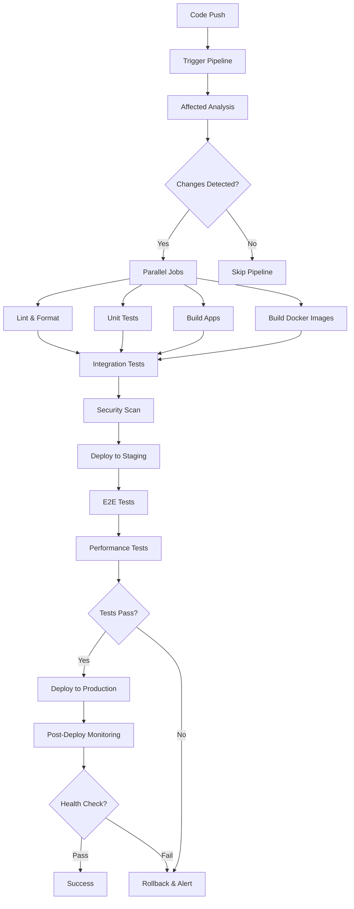

# CI/CD Implementation for Monorepo

## Overview

Comprehensive CI/CD implementation for monorepo architecture requires intelligent build optimization, parallel testing, automated deployments, and robust rollback mechanisms while maintaining fast feedback loops.

## CI/CD Architecture

### Pipeline Strategy



## GitHub Actions Implementation

### Main Workflow

```yaml
# .github/workflows/ci-cd.yml
name: CI/CD Pipeline

on:
  push:
    branches: [main, develop]
  pull_request:
    branches: [main, develop]

env:
  NODE_VERSION: '18'
  DOCKER_REGISTRY: 'ghcr.io'
  DOCKER_IMAGE_PREFIX: 'expense-tracker'

jobs:
  setup:
    runs-on: ubuntu-latest
    outputs:
      affected-apps: ${{ steps.affected.outputs.apps }}
      affected-libs: ${{ steps.affected.outputs.libs }}
      has-changes: ${{ steps.affected.outputs.hasChanges }}
      matrix-apps: ${{ steps.matrix.outputs.apps }}
      matrix-libs: ${{ steps.matrix.outputs.libs }}
    steps:
      - name: Checkout
        uses: actions/checkout@v4
        with:
          fetch-depth: 0

      - name: Setup Node.js
        uses: actions/setup-node@v4
        with:
          node-version: ${{ env.NODE_VERSION }}
          cache: 'npm'

      - name: Install dependencies
        run: npm ci

      - name: Get affected projects
        id: affected
        run: |
          AFFECTED_APPS=$(npx nx print-affected --type=app --select=projects --base=origin/main~1 --head=HEAD)
          AFFECTED_LIBS=$(npx nx print-affected --type=lib --select=projects --base=origin/main~1 --head=HEAD)
          
          echo "apps=$AFFECTED_APPS" >> $GITHUB_OUTPUT
          echo "libs=$AFFECTED_LIBS" >> $GITHUB_OUTPUT
          
          if [[ -n "$AFFECTED_APPS" || -n "$AFFECTED_LIBS" ]]; then
            echo "hasChanges=true" >> $GITHUB_OUTPUT
          else
            echo "hasChanges=false" >> $GITHUB_OUTPUT
          fi

      - name: Create test matrix
        id: matrix
        run: |
          APPS_JSON=$(echo '${{ steps.affected.outputs.apps }}' | jq -R -s -c 'split(" ") | map(select(length > 0))')
          LIBS_JSON=$(echo '${{ steps.affected.outputs.libs }}' | jq -R -s -c 'split(" ") | map(select(length > 0))')
          
          echo "apps=$APPS_JSON" >> $GITHUB_OUTPUT
          echo "libs=$LIBS_JSON" >> $GITHUB_OUTPUT

  lint-and-format:
    needs: setup
    if: needs.setup.outputs.has-changes == 'true'
    runs-on: ubuntu-latest
    
    steps:
      - name: Checkout
        uses: actions/checkout@v4
        with:
          fetch-depth: 0

      - name: Setup Node.js
        uses: actions/setup-node@v4
        with:
          node-version: ${{ env.NODE_VERSION }}
          cache: 'npm'

      - name: Install dependencies
        run: npm ci

      - name: Lint affected projects
        run: npx nx affected:lint --base=origin/main~1 --head=HEAD --parallel=3

      - name: Check formatting
        run: npx prettier --check .

      - name: Type check
        run: npx nx affected --target=typecheck --base=origin/main~1 --head=HEAD --parallel=3

  unit-tests:
    needs: setup
    if: needs.setup.outputs.has-changes == 'true'
    runs-on: ubuntu-latest
    
    strategy:
      matrix:
        project: ${{ fromJson(needs.setup.outputs.matrix-apps) }}
      fail-fast: false

    steps:
      - name: Checkout
        uses: actions/checkout@v4
        with:
          fetch-depth: 0

      - name: Setup Node.js
        uses: actions/setup-node@v4
        with:
          node-version: ${{ env.NODE_VERSION }}
          cache: 'npm'

      - name: Install dependencies
        run: npm ci

      - name: Run unit tests
        run: npx nx test ${{ matrix.project }} --coverage --watchAll=false

      - name: Upload coverage
        uses: codecov/codecov-action@v3
        with:
          file: ./coverage/${{ matrix.project }}/lcov.info
          flags: ${{ matrix.project }}

  build-apps:
    needs: [setup, lint-and-format, unit-tests]
    if: needs.setup.outputs.has-changes == 'true'
    runs-on: ubuntu-latest
    
    strategy:
      matrix:
        app: ${{ fromJson(needs.setup.outputs.matrix-apps) }}
      fail-fast: false

    steps:
      - name: Checkout
        uses: actions/checkout@v4
        with:
          fetch-depth: 0

      - name: Setup Node.js
        uses: actions/setup-node@v4
        with:
          node-version: ${{ env.NODE_VERSION }}
          cache: 'npm'

      - name: Install dependencies
        run: npm ci

      - name: Build application
        run: npx nx build ${{ matrix.app }} --configuration=production

      - name: Upload build artifacts
        uses: actions/upload-artifact@v4
        with:
          name: build-${{ matrix.app }}
          path: dist/apps/${{ matrix.app }}
          retention-days: 7

  build-docker:
    needs: [setup, build-apps]
    if: needs.setup.outputs.has-changes == 'true' && github.ref == 'refs/heads/main'
    runs-on: ubuntu-latest
    
    strategy:
      matrix:
        service: ['api-gateway', 'user-service', 'expense-service']
      fail-fast: false

    steps:
      - name: Checkout
        uses: actions/checkout@v4

      - name: Set up Docker Buildx
        uses: docker/setup-buildx-action@v3

      - name: Login to Container Registry
        uses: docker/login-action@v3
        with:
          registry: ${{ env.DOCKER_REGISTRY }}
          username: ${{ github.actor }}
          password: ${{ secrets.GITHUB_TOKEN }}

      - name: Extract metadata
        id: meta
        uses: docker/metadata-action@v5
        with:
          images: ${{ env.DOCKER_REGISTRY }}/${{ github.repository }}/${{ matrix.service }}
          tags: |
            type=ref,event=branch
            type=ref,event=pr
            type=sha,prefix={{branch}}-
            type=raw,value=latest,enable={{is_default_branch}}

      - name: Download build artifacts
        uses: actions/download-artifact@v4
        with:
          name: build-${{ matrix.service }}
          path: dist/apps/${{ matrix.service }}

      - name: Build and push Docker image
        uses: docker/build-push-action@v5
        with:
          context: .
          file: apps/microservices/${{ matrix.service }}/Dockerfile
          push: true
          tags: ${{ steps.meta.outputs.tags }}
          labels: ${{ steps.meta.outputs.labels }}
          cache-from: type=gha
          cache-to: type=gha,mode=max

  integration-tests:
    needs: [setup, build-apps]
    if: needs.setup.outputs.has-changes == 'true'
    runs-on: ubuntu-latest
    
    services:
      mongodb:
        image: mongo:6.0
        ports:
          - 27017:27017
        options: >-
          --health-cmd "mongosh --eval 'db.runCommand(\"ping\").ok'"
          --health-interval 10s
          --health-timeout 5s
          --health-retries 5

      redis:
        image: redis:7.0-alpine
        ports:
          - 6379:6379
        options: >-
          --health-cmd "redis-cli ping"
          --health-interval 10s
          --health-timeout 5s
          --health-retries 5

    steps:
      - name: Checkout
        uses: actions/checkout@v4
        with:
          fetch-depth: 0

      - name: Setup Node.js
        uses: actions/setup-node@v4
        with:
          node-version: ${{ env.NODE_VERSION }}
          cache: 'npm'

      - name: Install dependencies
        run: npm ci

      - name: Download build artifacts
        uses: actions/download-artifact@v4
        with:
          path: dist/apps

      - name: Start services
        run: |
          docker-compose -f docker-compose.ci.yml up -d
          sleep 30

      - name: Run integration tests
        run: npx nx affected --target=test:integration --base=origin/main~1 --head=HEAD
        env:
          DATABASE_URL: mongodb://localhost:27017/test
          REDIS_URL: redis://localhost:6379

      - name: Stop services
        if: always()
        run: docker-compose -f docker-compose.ci.yml down

  security-scan:
    needs: [setup, build-docker]
    if: needs.setup.outputs.has-changes == 'true' && github.ref == 'refs/heads/main'
    runs-on: ubuntu-latest
    
    strategy:
      matrix:
        service: ['api-gateway', 'user-service', 'expense-service']

    steps:
      - name: Run Trivy vulnerability scanner
        uses: aquasecurity/trivy-action@master
        with:
          image-ref: ${{ env.DOCKER_REGISTRY }}/${{ github.repository }}/${{ matrix.service }}:${{ github.sha }}
          format: 'sarif'
          output: 'trivy-results-${{ matrix.service }}.sarif'

      - name: Upload Trivy scan results
        uses: github/codeql-action/upload-sarif@v2
        if: always()
        with:
          sarif_file: 'trivy-results-${{ matrix.service }}.sarif'

  deploy-staging:
    needs: [setup, integration-tests, security-scan]
    if: needs.setup.outputs.has-changes == 'true' && github.ref == 'refs/heads/main'
    runs-on: ubuntu-latest
    environment: staging
    
    steps:
      - name: Checkout
        uses: actions/checkout@v4

      - name: Configure AWS credentials
        uses: aws-actions/configure-aws-credentials@v4
        with:
          aws-access-key-id: ${{ secrets.AWS_ACCESS_KEY_ID }}
          aws-secret-access-key: ${{ secrets.AWS_SECRET_ACCESS_KEY }}
          aws-region: us-east-1

      - name: Deploy to staging
        run: |
          # Update Kubernetes deployments
          kubectl set image deployment/api-gateway-staging api-gateway=${{ env.DOCKER_REGISTRY }}/${{ github.repository }}/api-gateway:${{ github.sha }}
          kubectl set image deployment/user-service-staging user-service=${{ env.DOCKER_REGISTRY }}/${{ github.repository }}/user-service:${{ github.sha }}
          kubectl set image deployment/expense-service-staging expense-service=${{ env.DOCKER_REGISTRY }}/${{ github.repository }}/expense-service:${{ github.sha }}
          
          # Wait for rollout
          kubectl rollout status deployment/api-gateway-staging --timeout=300s
          kubectl rollout status deployment/user-service-staging --timeout=300s
          kubectl rollout status deployment/expense-service-staging --timeout=300s

      - name: Verify deployment
        run: |
          # Health check
          timeout 300 bash -c 'until curl -f https://staging.expense-tracker.com/health; do sleep 10; done'

  e2e-tests:
    needs: deploy-staging
    runs-on: ubuntu-latest
    
    steps:
      - name: Checkout
        uses: actions/checkout@v4

      - name: Setup Node.js
        uses: actions/setup-node@v4
        with:
          node-version: ${{ env.NODE_VERSION }}
          cache: 'npm'

      - name: Install dependencies
        run: npm ci

      - name: Install Playwright
        run: npx playwright install --with-deps

      - name: Run E2E tests
        run: npx nx e2e web-pwa-e2e --configuration=staging
        env:
          BASE_URL: https://staging.expense-tracker.com

      - name: Upload E2E artifacts
        uses: actions/upload-artifact@v4
        if: failure()
        with:
          name: e2e-artifacts
          path: |
            apps/web-pwa-e2e/test-results/
            apps/web-pwa-e2e/playwright-report/

  performance-tests:
    needs: deploy-staging
    runs-on: ubuntu-latest
    
    steps:
      - name: Checkout
        uses: actions/checkout@v4

      - name: Setup Node.js
        uses: actions/setup-node@v4
        with:
          node-version: ${{ env.NODE_VERSION }}
          cache: 'npm'

      - name: Install dependencies
        run: npm ci

      - name: Run performance tests
        run: npx nx run performance-tests:k6 --configuration=staging
        env:
          TARGET_URL: https://staging.expense-tracker.com

      - name: Upload performance results
        uses: actions/upload-artifact@v4
        with:
          name: performance-results
          path: performance-results/

  deploy-production:
    needs: [e2e-tests, performance-tests]
    if: github.ref == 'refs/heads/main'
    runs-on: ubuntu-latest
    environment: production
    
    steps:
      - name: Checkout
        uses: actions/checkout@v4

      - name: Configure AWS credentials
        uses: aws-actions/configure-aws-credentials@v4
        with:
          aws-access-key-id: ${{ secrets.AWS_ACCESS_KEY_ID }}
          aws-secret-access-key: ${{ secrets.AWS_SECRET_ACCESS_KEY }}
          aws-region: us-east-1

      - name: Blue-Green deployment
        run: |
          # Deploy to green environment
          kubectl set image deployment/api-gateway-green api-gateway=${{ env.DOCKER_REGISTRY }}/${{ github.repository }}/api-gateway:${{ github.sha }}
          kubectl set image deployment/user-service-green user-service=${{ env.DOCKER_REGISTRY }}/${{ github.repository }}/user-service:${{ github.sha }}
          kubectl set image deployment/expense-service-green expense-service=${{ env.DOCKER_REGISTRY }}/${{ github.repository }}/expense-service:${{ github.sha }}
          
          # Wait for rollout
          kubectl rollout status deployment/api-gateway-green --timeout=300s
          kubectl rollout status deployment/user-service-green --timeout=300s
          kubectl rollout status deployment/expense-service-green --timeout=300s

      - name: Smoke tests
        run: |
          # Wait for services to be ready
          sleep 60
          
          # Run smoke tests against green environment
          npx nx run smoke-tests:test --configuration=production-green

      - name: Switch traffic
        run: |
          # Update ingress to point to green services
          kubectl patch ingress expense-tracker-ingress -p '{"spec":{"rules":[{"host":"api.expense-tracker.com","http":{"paths":[{"path":"/","pathType":"Prefix","backend":{"service":{"name":"api-gateway-green-service","port":{"number":3000}}}}]}}]}}'

      - name: Monitor deployment
        run: |
          # Monitor for 5 minutes
          for i in {1..30}; do
            if curl -f https://api.expense-tracker.com/health; then
              echo "Health check $i/30 passed"
              sleep 10
            else
              echo "Health check failed, rolling back"
              kubectl patch ingress expense-tracker-ingress -p '{"spec":{"rules":[{"host":"api.expense-tracker.com","http":{"paths":[{"path":"/","pathType":"Prefix","backend":{"service":{"name":"api-gateway-blue-service","port":{"number":3000}}}}]}}]}}'
              exit 1
            fi
          done

      - name: Cleanup blue environment
        run: |
          # Scale down blue deployments
          kubectl scale deployment api-gateway-blue --replicas=0
          kubectl scale deployment user-service-blue --replicas=0
          kubectl scale deployment expense-service-blue --replicas=0

  notify:
    needs: [deploy-production]
    if: always()
    runs-on: ubuntu-latest
    
    steps:
      - name: Notify Slack
        uses: 8398a7/action-slack@v3
        with:
          status: ${{ job.status }}
          channel: '#deployments'
          webhook_url: ${{ secrets.SLACK_WEBHOOK }}
        env:
          SLACK_WEBHOOK_URL: ${{ secrets.SLACK_WEBHOOK }}
```

## Advanced Pipeline Features

### Nx Cloud Integration

```yaml
# .github/workflows/nx-cloud.yml
name: Nx Cloud CI

on:
  push:
    branches: [main, develop]
  pull_request:
    branches: [main]

jobs:
  main:
    runs-on: ubuntu-latest
    steps:
      - uses: actions/checkout@v4
        with:
          fetch-depth: 0

      - uses: actions/setup-node@v4
        with:
          node-version: '18'
          cache: 'npm'

      - run: npm ci

      - uses: nrwl/nx-set-shas@v4

      - run: npx nx-cloud start-ci-run --stop-agents-after="build" --agent-count=3

      - run: npx nx-cloud record -- npx nx format:check
      - run: npx nx affected --target=lint --parallel=3 --ci
      - run: npx nx affected --target=test --parallel=3 --ci --coverage
      - run: npx nx affected --target=build --parallel=3 --ci
      - run: npx nx affected --target=e2e --parallel=1 --ci

      - run: npx nx-cloud stop-all-agents
```

### Custom Pipeline Scripts

```typescript
// tools/scripts/pipeline-utils.ts
import { execSync } from 'child_process';

export class PipelineUtils {
  static getAffectedProjects(base: string = 'origin/main~1'): {
    apps: string[];
    libs: string[];
  } {
    const appsOutput = execSync(
      `npx nx print-affected --type=app --select=projects --base=${base} --head=HEAD`,
      { encoding: 'utf8' }
    );
    
    const libsOutput = execSync(
      `npx nx print-affected --type=lib --select=projects --base=${base} --head=HEAD`,
      { encoding: 'utf8' }
    );

    return {
      apps: appsOutput.split('\n').filter(Boolean),
      libs: libsOutput.split('\n').filter(Boolean)
    };
  }

  static async runParallelTests(projects: string[], maxConcurrency: number = 3): Promise<void> {
    const chunks = this.chunkArray(projects, maxConcurrency);
    
    for (const chunk of chunks) {
      const promises = chunk.map(project => 
        this.runCommand(`npx nx test ${project} --coverage`)
      );
      
      await Promise.all(promises);
    }
  }

  static async deploymentHealthCheck(url: string, timeout: number = 300000): Promise<boolean> {
    const start = Date.now();
    
    while (Date.now() - start < timeout) {
      try {
        const response = await fetch(`${url}/health`);
        if (response.ok) {
          return true;
        }
      } catch (error) {
        console.log('Health check failed, retrying...');
      }
      
      await new Promise(resolve => setTimeout(resolve, 10000));
    }
    
    return false;
  }

  private static chunkArray<T>(array: T[], size: number): T[][] {
    const chunks: T[][] = [];
    for (let i = 0; i < array.length; i += size) {
      chunks.push(array.slice(i, i + size));
    }
    return chunks;
  }

  private static runCommand(command: string): Promise<void> {
    return new Promise((resolve, reject) => {
      try {
        execSync(command, { stdio: 'inherit' });
        resolve();
      } catch (error) {
        reject(error);
      }
    });
  }
}
```

## Alternative CI/CD Platforms

### GitLab CI Configuration

```yaml
# .gitlab-ci.yml
stages:
  - setup
  - test
  - build
  - security
  - deploy-staging
  - e2e
  - deploy-production

variables:
  NODE_VERSION: "18"
  DOCKER_DRIVER: overlay2
  DOCKER_TLS_CERTDIR: "/certs"

cache:
  key:
    files:
      - package-lock.json
  paths:
    - node_modules/
    - .nx/cache/

setup:
  stage: setup
  image: node:$NODE_VERSION
  script:
    - npm ci
    - npx nx affected --target=build --base=$CI_MERGE_REQUEST_TARGET_BRANCH_SHA --head=HEAD --dry-run > affected.txt
  artifacts:
    paths:
      - affected.txt
    expire_in: 1 hour

lint:
  stage: test
  image: node:$NODE_VERSION
  script:
    - npm ci
    - npx nx affected:lint --base=$CI_MERGE_REQUEST_TARGET_BRANCH_SHA --head=HEAD --parallel=3
  needs: ["setup"]

test:
  stage: test
  image: node:$NODE_VERSION
  script:
    - npm ci
    - npx nx affected:test --base=$CI_MERGE_REQUEST_TARGET_BRANCH_SHA --head=HEAD --parallel=3 --coverage
  coverage: '/Lines\s*:\s*(\d+\.\d+)%/'
  artifacts:
    reports:
      coverage_report:
        coverage_format: cobertura
        path: coverage/cobertura-coverage.xml
  needs: ["setup"]

build:
  stage: build
  image: node:$NODE_VERSION
  script:
    - npm ci
    - npx nx affected:build --base=$CI_MERGE_REQUEST_TARGET_BRANCH_SHA --head=HEAD --parallel=3 --configuration=production
  artifacts:
    paths:
      - dist/
    expire_in: 1 hour
  needs: ["lint", "test"]

docker:
  stage: build
  image: docker:latest
  services:
    - docker:dind
  before_script:
    - echo $CI_REGISTRY_PASSWORD | docker login -u $CI_REGISTRY_USER --password-stdin $CI_REGISTRY
  script:
    - |
      for service in api-gateway user-service expense-service; do
        docker build -t $CI_REGISTRY_IMAGE/$service:$CI_COMMIT_SHA -f apps/microservices/$service/Dockerfile .
        docker push $CI_REGISTRY_IMAGE/$service:$CI_COMMIT_SHA
      done
  needs: ["build"]
  only:
    - main

security:
  stage: security
  image: docker:latest
  services:
    - docker:dind
  script:
    - |
      for service in api-gateway user-service expense-service; do
        docker run --rm -v /var/run/docker.sock:/var/run/docker.sock \
          aquasec/trivy image --exit-code 1 --severity HIGH,CRITICAL \
          $CI_REGISTRY_IMAGE/$service:$CI_COMMIT_SHA
      done
  needs: ["docker"]
  only:
    - main

deploy-staging:
  stage: deploy-staging
  image: bitnami/kubectl:latest
  script:
    - kubectl config use-context $KUBE_CONTEXT_STAGING
    - |
      for service in api-gateway user-service expense-service; do
        kubectl set image deployment/$service-staging $service=$CI_REGISTRY_IMAGE/$service:$CI_COMMIT_SHA
        kubectl rollout status deployment/$service-staging --timeout=300s
      done
  environment:
    name: staging
    url: https://staging.expense-tracker.com
  needs: ["security"]
  only:
    - main

e2e:
  stage: e2e
  image: mcr.microsoft.com/playwright:v1.40.0-focal
  script:
    - npm ci
    - npx playwright install
    - npx nx e2e web-pwa-e2e --configuration=staging
  artifacts:
    when: on_failure
    paths:
      - apps/web-pwa-e2e/test-results/
      - apps/web-pwa-e2e/playwright-report/
    expire_in: 1 week
  needs: ["deploy-staging"]
  only:
    - main

deploy-production:
  stage: deploy-production
  image: bitnami/kubectl:latest
  script:
    - kubectl config use-context $KUBE_CONTEXT_PRODUCTION
    - |
      # Blue-green deployment
      for service in api-gateway user-service expense-service; do
        kubectl set image deployment/$service-green $service=$CI_REGISTRY_IMAGE/$service:$CI_COMMIT_SHA
        kubectl rollout status deployment/$service-green --timeout=300s
      done
      
      # Health check
      sleep 60
      curl -f https://api.expense-tracker.com/health
      
      # Switch traffic
      kubectl patch ingress expense-tracker-ingress -p '{"spec":{"rules":[{"host":"api.expense-tracker.com","http":{"paths":[{"path":"/","pathType":"Prefix","backend":{"service":{"name":"api-gateway-green-service","port":{"number":3000}}}}]}}]}}'
  environment:
    name: production
    url: https://api.expense-tracker.com
  when: manual
  needs: ["e2e"]
  only:
    - main
```

### Azure DevOps Pipeline

```yaml
# azure-pipelines.yml
trigger:
  branches:
    include:
      - main
      - develop

pr:
  branches:
    include:
      - main

pool:
  vmImage: 'ubuntu-latest'

variables:
  nodeVersion: '18.x'
  dockerRegistryServiceConnection: 'expense-tracker-registry'
  containerRegistry: 'expensetracker.azurecr.io'

stages:
- stage: Build
  displayName: 'Build and Test'
  jobs:
  - job: Setup
    displayName: 'Setup and Analyze'
    steps:
    - task: NodeTool@0
      inputs:
        versionSpec: $(nodeVersion)
      displayName: 'Install Node.js'

    - script: |
        npm ci
      displayName: 'Install dependencies'

    - script: |
        npx nx affected --target=build --base=origin/main~1 --head=HEAD --dry-run
      displayName: 'Analyze affected projects'

  - job: Test
    displayName: 'Lint and Test'
    dependsOn: Setup
    steps:
    - task: NodeTool@0
      inputs:
        versionSpec: $(nodeVersion)
      displayName: 'Install Node.js'

    - script: npm ci
      displayName: 'Install dependencies'

    - script: |
        npx nx affected:lint --base=origin/main~1 --head=HEAD --parallel=3
      displayName: 'Lint affected projects'

    - script: |
        npx nx affected:test --base=origin/main~1 --head=HEAD --parallel=3 --coverage
      displayName: 'Test affected projects'

    - task: PublishTestResults@2
      inputs:
        testResultsFormat: 'JUnit'
        testResultsFiles: '**/junit.xml'
        mergeTestResults: true
      displayName: 'Publish test results'

    - task: PublishCodeCoverageResults@1
      inputs:
        codeCoverageTool: 'Cobertura'
        summaryFileLocation: '**/cobertura-coverage.xml'
      displayName: 'Publish code coverage'

  - job: Build
    displayName: 'Build Applications'
    dependsOn: Test
    steps:
    - task: NodeTool@0
      inputs:
        versionSpec: $(nodeVersion)
      displayName: 'Install Node.js'

    - script: npm ci
      displayName: 'Install dependencies'

    - script: |
        npx nx affected:build --base=origin/main~1 --head=HEAD --parallel=3 --configuration=production
      displayName: 'Build affected applications'

    - task: PublishBuildArtifacts@1
      inputs:
        pathToPublish: 'dist'
        artifactName: 'build-artifacts'
      displayName: 'Publish build artifacts'

- stage: Deploy
  displayName: 'Deploy to Staging'
  dependsOn: Build
  condition: and(succeeded(), eq(variables['Build.SourceBranch'], 'refs/heads/main'))
  jobs:
  - deployment: DeployStaging
    displayName: 'Deploy to Staging'
    environment: 'staging'
    strategy:
      runOnce:
        deploy:
          steps:
          - task: Docker@2
            displayName: 'Build and push Docker images'
            inputs:
              containerRegistry: $(dockerRegistryServiceConnection)
              repository: 'expense-tracker'
              command: 'buildAndPush'
              Dockerfile: '**/Dockerfile'
              tags: |
                $(Build.BuildId)
                latest

          - task: HelmDeploy@0
            displayName: 'Deploy to staging'
            inputs:
              connectionType: 'Kubernetes Service Connection'
              kubernetesServiceConnection: 'staging-k8s'
              namespace: 'staging'
              command: 'upgrade'
              chartType: 'FilePath'
              chartPath: 'helm/expense-tracker'
              releaseName: 'expense-tracker-staging'
              arguments: '--set image.tag=$(Build.BuildId)'

- stage: Production
  displayName: 'Deploy to Production'
  dependsOn: Deploy
  condition: and(succeeded(), eq(variables['Build.SourceBranch'], 'refs/heads/main'))
  jobs:
  - deployment: DeployProduction
    displayName: 'Deploy to Production'
    environment: 'production'
    strategy:
      runOnce:
        deploy:
          steps:
          - task: HelmDeploy@0
            displayName: 'Deploy to production'
            inputs:
              connectionType: 'Kubernetes Service Connection'
              kubernetesServiceConnection: 'production-k8s'
              namespace: 'production'
              command: 'upgrade'
              chartType: 'FilePath'
              chartPath: 'helm/expense-tracker'
              releaseName: 'expense-tracker-production'
              arguments: '--set image.tag=$(Build.BuildId) --set environment=production'
```

## Monitoring and Alerting

### Pipeline Monitoring

```typescript
// tools/scripts/pipeline-monitor.ts
import { WebhookClient } from 'discord.js';

export class PipelineMonitor {
  private discord: WebhookClient;

  constructor() {
    this.discord = new WebhookClient({ url: process.env.DISCORD_WEBHOOK_URL! });
  }

  async notifyDeploymentStart(environment: string, version: string) {
    await this.discord.send({
      content: `🚀 **Deployment Started**\n**Environment:** ${environment}\n**Version:** ${version}\n**Time:** ${new Date().toISOString()}`
    });
  }

  async notifyDeploymentSuccess(environment: string, version: string) {
    await this.discord.send({
      content: `✅ **Deployment Successful**\n**Environment:** ${environment}\n**Version:** ${version}\n**Time:** ${new Date().toISOString()}`
    });
  }

  async notifyDeploymentFailure(environment: string, version: string, error: string) {
    await this.discord.send({
      content: `❌ **Deployment Failed**\n**Environment:** ${environment}\n**Version:** ${version}\n**Error:** ${error}\n**Time:** ${new Date().toISOString()}`
    });
  }

  async notifyTestFailure(testSuite: string, failedTests: string[]) {
    await this.discord.send({
      content: `🧪 **Test Failures**\n**Suite:** ${testSuite}\n**Failed Tests:**\n${failedTests.map(test => `• ${test}`).join('\n')}`
    });
  }
}
```

This comprehensive CI/CD implementation provides robust automation, parallel execution, security scanning, and reliable deployment strategies while maintaining fast feedback loops and high confidence in releases.
