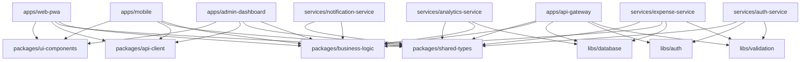

# Expense Tracker Monorepo Architecture Design

## Project Overview

This document outlines the complete monorepo architecture for the Expense Tracker MVP, designed to maximize code reusability, development efficiency, and AI coding agent effectiveness while maintaining clear service boundaries and scalability.

## High-Level Architecture

### System Components

```
Expense Tracker Monorepo
├── Frontend Applications
│   ├── Web PWA (React/Next.js)
│   ├── Mobile App (React Native)
│   └── Admin Dashboard (React)
├── Backend Services
│   ├── API Gateway (Express.js)
│   ├── Auth Service (Express.js)
│   ├── Expense Service (Express.js)
│   └── Notification Service (AWS Lambda)
├── Shared Libraries
│   ├── Business Logic
│   ├── Type Definitions
│   ├── UI Components
│   └── API Client
└── Supporting Infrastructure
    ├── Database Schemas
    ├── E2E Testing
    └── DevOps Tools
```

### Technology Stack

| Component | Technology | Rationale |
|-----------|------------|-----------|
| **Monorepo Tool** | Nx | Advanced TypeScript support, build optimization |
| **Frontend Framework** | React 18 + Next.js 14 | SSR/SSG, performance, developer experience |
| **Mobile Framework** | React Native + Expo | Code sharing with web, rapid development |
| **Backend Framework** | Express.js + TypeScript | Familiar, lightweight, microservice-ready |
| **Database** | PostgreSQL + Prisma | ACID compliance, type-safe ORM |
| **Authentication** | AWS Cognito + JWT | Managed service, scalable |
| **State Management** | Zustand + React Query | Simple, powerful, type-safe |
| **UI Library** | shadcn/ui + Tailwind | Modern, customizable, consistent |
| **Testing** | Jest + Playwright + Cypress | Unit, integration, E2E coverage |
| **Build Tool** | Vite + SWC | Fast builds, excellent DX |

## Detailed Monorepo Structure

```
expense-tracker/
├── apps/                           # Deployable applications
│   ├── web-pwa/                   # Main React PWA
│   │   ├── src/
│   │   │   ├── pages/             # Next.js pages
│   │   │   ├── components/        # App-specific components
│   │   │   ├── hooks/             # App-specific hooks
│   │   │   ├── stores/            # App-specific state
│   │   │   └── styles/            # App-specific styles
│   │   ├── public/                # Static assets
│   │   ├── next.config.js
│   │   ├── package.json
│   │   └── tsconfig.json
│   │
│   ├── mobile/                    # React Native app
│   │   ├── src/
│   │   │   ├── screens/           # App screens
│   │   │   ├── navigation/        # Navigation setup
│   │   │   ├── components/        # Mobile-specific components
│   │   │   └── hooks/             # Mobile-specific hooks
│   │   ├── app.json               # Expo configuration
│   │   ├── package.json
│   │   └── tsconfig.json
│   │
│   ├── admin-dashboard/           # Admin interface
│   │   ├── src/
│   │   │   ├── pages/             # Admin pages
│   │   │   ├── components/        # Admin components
│   │   │   └── hooks/             # Admin hooks
│   │   ├── package.json
│   │   └── tsconfig.json
│   │
│   └── api-gateway/               # Main Express.js backend
│       ├── src/
│       │   ├── routes/            # API routes
│       │   ├── middleware/        # Express middleware
│       │   ├── controllers/       # Request handlers
│       │   └── services/          # Business logic
│       ├── package.json
│       └── tsconfig.json
│
├── services/                      # Microservices
│   ├── auth-service/              # Authentication microservice
│   │   ├── src/
│   │   │   ├── controllers/       # Auth controllers
│   │   │   ├── middleware/        # Auth middleware
│   │   │   ├── services/          # Auth business logic
│   │   │   └── utils/             # Auth utilities
│   │   ├── package.json
│   │   └── tsconfig.json
│   │
│   ├── expense-service/           # Core expense management
│   │   ├── src/
│   │   │   ├── controllers/       # Expense controllers
│   │   │   ├── services/          # Expense business logic
│   │   │   ├── models/            # Data models
│   │   │   └── validators/        # Input validation
│   │   ├── package.json
│   │   └── tsconfig.json
│   │
│   ├── notification-service/      # Notification handling (Lambda)
│   │   ├── src/
│   │   │   ├── handlers/          # Lambda handlers
│   │   │   ├── services/          # Notification logic
│   │   │   └── templates/         # Message templates
│   │   ├── serverless.yml         # Serverless config
│   │   ├── package.json
│   │   └── tsconfig.json
│   │
│   └── analytics-service/         # Data analytics
│       ├── src/
│       │   ├── controllers/       # Analytics controllers
│       │   ├── processors/        # Data processors
│       │   └── aggregators/       # Data aggregation
│       ├── package.json
│       └── tsconfig.json
│
├── packages/                      # Shared libraries
│   ├── shared-types/              # TypeScript definitions
│   │   ├── src/
│   │   │   ├── entities/          # Domain entities
│   │   │   ├── api/               # API types
│   │   │   ├── events/            # Event types
│   │   │   └── common/            # Common types
│   │   ├── package.json
│   │   └── tsconfig.json
│   │
│   ├── business-logic/            # Core domain logic
│   │   ├── src/
│   │   │   ├── expenses/          # Expense domain logic
│   │   │   ├── users/             # User domain logic
│   │   │   ├── categories/        # Category domain logic
│   │   │   ├── budgets/           # Budget domain logic
│   │   │   └── calculations/      # Financial calculations
│   │   ├── package.json
│   │   └── tsconfig.json
│   │
│   ├── ui-components/             # Shared UI library
│   │   ├── src/
│   │   │   ├── components/        # Reusable components
│   │   │   ├── hooks/             # Shared hooks
│   │   │   ├── utils/             # UI utilities
│   │   │   └── styles/            # Shared styles
│   │   ├── package.json
│   │   └── tsconfig.json
│   │
│   ├── api-client/                # API client library
│   │   ├── src/
│   │   │   ├── clients/           # Service clients
│   │   │   ├── interceptors/      # Request/response interceptors
│   │   │   ├── hooks/             # React Query hooks
│   │   │   └── types/             # API-specific types
│   │   ├── package.json
│   │   └── tsconfig.json
│   │
│   └── config/                    # Shared configurations
│       ├── src/
│       │   ├── eslint/            # ESLint configurations
│       │   ├── prettier/          # Prettier configurations
│       │   ├── tsconfig/          # TypeScript configurations
│       │   └── jest/              # Jest configurations
│       ├── package.json
│       └── tsconfig.json
│
├── libs/                          # Supporting libraries
│   ├── database/                  # Database schemas and migrations
│   │   ├── src/
│   │   │   ├── schema/            # Prisma schema
│   │   │   ├── migrations/        # Database migrations
│   │   │   ├── seeds/             # Seed data
│   │   │   └── utils/             # Database utilities
│   │   ├── package.json
│   │   └── tsconfig.json
│   │
│   ├── auth/                      # Authentication utilities
│   │   ├── src/
│   │   │   ├── jwt/               # JWT utilities
│   │   │   ├── cognito/           # AWS Cognito integration
│   │   │   ├── middleware/        # Auth middleware
│   │   │   └── guards/            # Authorization guards
│   │   ├── package.json
│   │   └── tsconfig.json
│   │
│   └── validation/                # Shared validation logic
│       ├── src/
│       │   ├── schemas/           # Validation schemas
│       │   ├── validators/        # Custom validators
│       │   └── middleware/        # Validation middleware
│       ├── package.json
│       └── tsconfig.json
│
├── tools/                         # Development tools
│   ├── generators/                # Code generators
│   │   ├── component/             # Component generator
│   │   ├── service/               # Service generator
│   │   └── api-endpoint/          # API endpoint generator
│   │
│   ├── scripts/                   # Build and deployment scripts
│   │   ├── build.js               # Build script
│   │   ├── deploy.js              # Deployment script
│   │   ├── migrate.js             # Migration script
│   │   └── seed.js                # Seeding script
│   │
│   └── eslint-config/             # Shared ESLint configuration
│       ├── base.js                # Base configuration
│       ├── react.js               # React-specific rules
│       └── node.js                # Node.js-specific rules
│
├── e2e/                           # End-to-end testing
│   ├── playwright/                # Playwright tests
│   │   ├── tests/                 # Test scenarios
│   │   ├── fixtures/              # Test fixtures
│   │   ├── page-objects/          # Page object models
│   │   └── utils/                 # Test utilities
│   │
│   ├── cypress/                   # Cypress tests (alternative)
│   │   ├── integration/           # Integration tests
│   │   ├── fixtures/              # Test data
│   │   └── support/               # Support files
│   │
│   └── api-tests/                 # API integration tests
│       ├── auth/                  # Authentication tests
│       ├── expenses/              # Expense API tests
│       └── users/                 # User API tests
│
├── docs/                          # Documentation
│   ├── architecture/              # Architecture documentation
│   ├── api/                       # API documentation
│   ├── deployment/                # Deployment guides
│   └── development/               # Development guides
│
├── .github/                       # GitHub workflows
│   ├── workflows/                 # CI/CD workflows
│   └── templates/                 # Issue/PR templates
│
├── docker/                        # Docker configurations
│   ├── development/               # Development containers
│   ├── production/                # Production containers
│   └── docker-compose.yml         # Compose configuration
│
├── infrastructure/                # Infrastructure as Code
│   ├── terraform/                 # Terraform configurations
│   ├── cloudformation/            # CloudFormation templates
│   └── kubernetes/                # K8s manifests
│
├── package.json                   # Root package.json
├── nx.json                        # Nx configuration
├── tsconfig.base.json             # Base TypeScript config
├── .eslintrc.json                 # ESLint configuration
├── .prettierrc                    # Prettier configuration
└── README.md                      # Project documentation
```

## Package Dependencies and Relationships

### Dependency Graph



### Internal Package Versioning

```json
{
  "dependencies": {
    "@expense-tracker/shared-types": "*",
    "@expense-tracker/business-logic": "*",
    "@expense-tracker/ui-components": "*",
    "@expense-tracker/api-client": "*",
    "@expense-tracker/database": "*",
    "@expense-tracker/auth": "*",
    "@expense-tracker/validation": "*",
    "@expense-tracker/config": "*"
  }
}
```

## Shared Code Strategy

### 1. Business Logic Sharing

#### Core Domain Models

```typescript
// packages/shared-types/src/entities/expense.ts
export interface Expense {
  id: string;
  userId: string;
  amount: number;
  currency: string;
  category: Category;
  description: string;
  date: Date;
  tags: string[];
  receipt?: Receipt;
  createdAt: Date;
  updatedAt: Date;
}

// packages/business-logic/src/expenses/expense-calculator.ts
export class ExpenseCalculator {
  static calculateTotal(expenses: Expense[]): number {
    return expenses.reduce((total, expense) => total + expense.amount, 0);
  }
  
  static groupByCategory(expenses: Expense[]): Record<string, Expense[]> {
    return expenses.reduce((groups, expense) => {
      const categoryId = expense.category.id;
      groups[categoryId] = groups[categoryId] || [];
      groups[categoryId].push(expense);
      return groups;
    }, {} as Record<string, Expense[]>);
  }
}
```

#### Validation Rules

```typescript
// packages/validation/src/schemas/expense.ts
import { z } from 'zod';

export const expenseSchema = z.object({
  amount: z.number().positive('Amount must be positive'),
  currency: z.enum(['USD', 'EUR', 'GBP']),
  categoryId: z.string().uuid('Invalid category ID'),
  description: z.string().min(1, 'Description is required').max(255),
  date: z.date(),
  tags: z.array(z.string()).optional(),
});

export type CreateExpenseDto = z.infer<typeof expenseSchema>;
```

### 2. UI Component Sharing

#### Shared Component Library

```typescript
// packages/ui-components/src/components/expense-card.tsx
import React from 'react';
import { Expense } from '@expense-tracker/shared-types';
import { formatCurrency } from '@expense-tracker/business-logic';

interface ExpenseCardProps {
  expense: Expense;
  onEdit?: (expense: Expense) => void;
  onDelete?: (expenseId: string) => void;
}

export const ExpenseCard: React.FC<ExpenseCardProps> = ({
  expense,
  onEdit,
  onDelete,
}) => {
  return (
    <div className="expense-card">
      <div className="expense-amount">
        {formatCurrency(expense.amount, expense.currency)}
      </div>
      <div className="expense-details">
        <h3>{expense.description}</h3>
        <p>{expense.category.name}</p>
        <span>{expense.date.toLocaleDateString()}</span>
      </div>
      {onEdit && (
        <button onClick={() => onEdit(expense)}>Edit</button>
      )}
      {onDelete && (
        <button onClick={() => onDelete(expense.id)}>Delete</button>
      )}
    </div>
  );
};
```

### 3. API Client Sharing

#### Unified API Client

```typescript
// packages/api-client/src/clients/expense-client.ts
import { ApiClient } from './base-client';
import { Expense, CreateExpenseDto } from '@expense-tracker/shared-types';

export class ExpenseClient extends ApiClient {
  async getExpenses(userId: string): Promise<Expense[]> {
    return this.get(`/users/${userId}/expenses`);
  }
  
  async createExpense(data: CreateExpenseDto): Promise<Expense> {
    return this.post('/expenses', data);
  }
  
  async updateExpense(id: string, data: Partial<CreateExpenseDto>): Promise<Expense> {
    return this.put(`/expenses/${id}`, data);
  }
  
  async deleteExpense(id: string): Promise<void> {
    return this.delete(`/expenses/${id}`);
  }
}

// packages/api-client/src/hooks/use-expenses.ts
import { useQuery, useMutation, useQueryClient } from '@tanstack/react-query';
import { ExpenseClient } from '../clients/expense-client';

export const useExpenses = (userId: string) => {
  return useQuery({
    queryKey: ['expenses', userId],
    queryFn: () => new ExpenseClient().getExpenses(userId),
  });
};

export const useCreateExpense = () => {
  const queryClient = useQueryClient();
  
  return useMutation({
    mutationFn: (data: CreateExpenseDto) => new ExpenseClient().createExpense(data),
    onSuccess: () => {
      queryClient.invalidateQueries({ queryKey: ['expenses'] });
    },
  });
};
```

## Service Communication Patterns

### 1. API Gateway Pattern

The API Gateway acts as the single entry point for all client requests, routing them to appropriate microservices.

```typescript
// apps/api-gateway/src/routes/expenses.ts
import express from 'express';
import { ExpenseService } from '@expense-tracker/business-logic';
import { authMiddleware } from '@expense-tracker/auth';
import { validateRequest } from '@expense-tracker/validation';
import { expenseSchema } from '@expense-tracker/validation';

const router = express.Router();

router.get('/expenses', authMiddleware, async (req, res) => {
  const userId = req.user.id;
  const expenses = await ExpenseService.getUserExpenses(userId);
  res.json(expenses);
});

router.post('/expenses', 
  authMiddleware, 
  validateRequest(expenseSchema),
  async (req, res) => {
    const userId = req.user.id;
    const expense = await ExpenseService.createExpense(userId, req.body);
    res.status(201).json(expense);
  }
);

export default router;
```

### 2. Event-Driven Communication

Services communicate through events for loose coupling and scalability.

```typescript
// packages/shared-types/src/events/expense-events.ts
export interface ExpenseCreatedEvent {
  type: 'EXPENSE_CREATED';
  payload: {
    expenseId: string;
    userId: string;
    amount: number;
    category: string;
    timestamp: Date;
  };
}

export interface ExpenseDeletedEvent {
  type: 'EXPENSE_DELETED';
  payload: {
    expenseId: string;
    userId: string;
    timestamp: Date;
  };
}

// services/notification-service/src/handlers/expense-events.ts
import { ExpenseCreatedEvent } from '@expense-tracker/shared-types';
import { NotificationService } from '@expense-tracker/business-logic';

export const handleExpenseCreated = async (event: ExpenseCreatedEvent) => {
  const { userId, amount, category } = event.payload;
  
  // Send notification
  await NotificationService.sendExpenseCreatedNotification(userId, {
    amount,
    category,
  });
  
  // Update analytics
  await AnalyticsService.trackExpenseCreated(event.payload);
};
```

## Development Workflow

### 1. Local Development Setup

```bash
# Clone and setup
git clone <repository>
cd expense-tracker
npm install

# Start all services in development mode
npm run dev

# Start specific services
npm run dev:web
npm run dev:mobile
npm run dev:api
npm run dev:services
```

### 2. Code Generation

```bash
# Generate new component
nx generate @expense-tracker/generators:component --name=expense-form --project=ui-components

# Generate new service
nx generate @expense-tracker/generators:service --name=budget-service

# Generate new API endpoint
nx generate @expense-tracker/generators:api-endpoint --name=budgets --service=api-gateway
```

### 3. Testing Strategy

```bash
# Run all tests
npm run test

# Run tests for affected packages only
npm run test:affected

# Run E2E tests
npm run e2e

# Run specific package tests
nx test shared-types
nx test business-logic
nx test ui-components
```

### 4. Build and Deployment

```bash
# Build all packages
npm run build

# Build only affected packages
npm run build:affected

# Deploy to staging
npm run deploy:staging

# Deploy to production
npm run deploy:production
```

## AI Coding Agent Optimization

### 1. Complete Project Context

The monorepo structure provides AI coding agents with complete visibility into:

- **Business Logic**: Understanding of domain models and calculations
- **API Contracts**: Full API surface and data flow
- **UI Patterns**: Consistent component usage and styling
- **Service Dependencies**: Inter-service relationships and communication
- **Testing Patterns**: Test structure and coverage expectations

### 2. Consistent Patterns and Conventions

- **Naming Conventions**: Consistent naming across all packages
- **File Organization**: Predictable structure for components, services, and utilities
- **Type Definitions**: Shared types ensure consistency
- **Error Handling**: Standardized error patterns
- **Configuration**: Unified configuration management

### 3. Enhanced Code Generation

AI agents can generate more accurate code by understanding:

- **Full Context**: Complete understanding of project architecture
- **Shared Dependencies**: Knowledge of available shared libraries
- **Business Rules**: Understanding of domain-specific logic
- **UI Patterns**: Consistent component structure and styling
- **Testing Requirements**: Appropriate test generation based on patterns

## Next Steps

1. **Tool Setup**: Implement Nx workspace configuration
2. **Package Creation**: Set up core shared packages
3. **Service Implementation**: Build core services with shared libraries
4. **Testing Infrastructure**: Implement comprehensive testing strategy
5. **CI/CD Pipeline**: Set up automated build and deployment
6. **Documentation**: Create development and deployment guides

This architecture provides a solid foundation for the Expense Tracker MVP while enabling future scaling and feature development with maximum code reusability and AI coding agent effectiveness.
