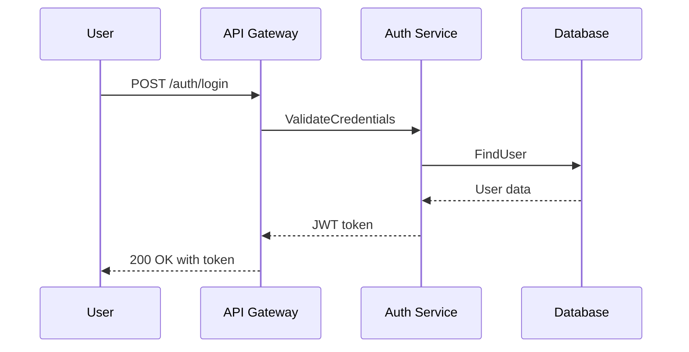

# AWS Kiro Specification Analysis

## 📋 Overview

AWS Kiro represents the state-of-the-art in spec-driven development with coding agents. This analysis examines Kiro's methodology, file structures, and best practices to understand how to implement similar workflows with other coding agents like Claude Code and GitHub Copilot.

## 🎯 Kiro's Core Philosophy

### The Specification-First Approach

Kiro's fundamental insight is that **specifications bridge the gap between conceptual product requirements and technical implementation details**. Rather than jumping directly from user stories to code, Kiro enforces a structured three-phase workflow:

1. **Requirements Phase**: Structured user stories with acceptance criteria
2. **Design Phase**: Technical architecture and implementation planning  
3. **Implementation Phase**: Task-based execution with progress tracking

### Key Innovation: Agent-Friendly Specifications

Unlike traditional documentation written for human consumption, Kiro's specifications are designed to be **machine-readable and actionable by AI agents**. This enables autonomous code generation while maintaining human oversight and control.

## 🏗️ Kiro's Three-Phase Workflow

### Phase 1: Requirements Definition

**File**: `.kiro/specs/feature-name/requirements.md`

**Purpose**: Transform vague feature requests into structured, testable requirements using EARS notation.

**Key Characteristics**:
- Every requirement follows EARS format: `WHEN [condition] THE SYSTEM SHALL [behavior]`
- User stories include clear acceptance criteria
- Edge cases and error conditions explicitly covered
- Requirements are independently testable

**Example Structure from Kiro**:
```markdown
# Feature Requirements

## User Story: User Authentication

### US-001: User Login
**As a** registered user  
**I want** to log into the system with my credentials  
**So that** I can access my personalized dashboard

#### Acceptance Criteria
WHEN a user enters valid email and password
THE SYSTEM SHALL authenticate the user and redirect to dashboard

WHEN a user enters invalid credentials  
THE SYSTEM SHALL display "Invalid email or password" and retain the email field

WHEN a user fails authentication 3 times consecutively
THE SYSTEM SHALL lock the account for 15 minutes and display lockout message
```

### Phase 2: Design Documentation

**File**: `.kiro/specs/feature-name/design.md`

**Purpose**: Translate requirements into technical architecture and implementation strategy.

**Key Characteristics**:
- Architecture diagrams using Mermaid syntax
- Data model specifications with relationships
- API endpoint definitions with request/response formats
- Sequence diagrams for complex interactions
- Security and performance considerations

**Example Structure from Kiro**:
```markdown
# Authentication Design

## Architecture Overview


## Data Model
- User entity with email, password hash, lockout fields
- Session tracking for failed attempts
- JWT token structure and claims

## Security Implementation
- bcrypt password hashing with salt
- JWT token with 15-minute expiration
- Rate limiting: 5 attempts per IP per minute
```

### Phase 3: Implementation Planning

**File**: `.kiro/specs/feature-name/tasks.md`

**Purpose**: Break down the design into discrete, executable tasks for coding agents.

**Key Characteristics**:
- Tasks are granular (1-2 days maximum)
- Clear acceptance criteria for each task
- Dependencies between tasks identified
- Progress tracking with completion status

**Example Structure from Kiro**:
```markdown
# Authentication Implementation Tasks

## Task Breakdown

### TASK-001: User Entity and Database Schema
**Description**: Create User model with authentication fields
**Acceptance Criteria**: 
- User table with id, email, password_hash, failed_attempts, locked_until fields
- Unique constraint on email
- Migration script created and tested

**Dependencies**: None
**Estimated Effort**: 4 hours
**Status**: ⏳ Pending

### TASK-002: Password Hashing Service
**Description**: Implement secure password hashing
**Acceptance Criteria**:
- bcrypt implementation with configurable salt rounds
- Hash password method with validation
- Verify password method with timing attack protection

**Dependencies**: TASK-001
**Estimated Effort**: 6 hours  
**Status**: ⏳ Pending
```

## 📊 Kiro's Best Practices Analysis

### Requirements Best Practices

**Structured Format Enforcement**:
- Kiro enforces EARS notation for all functional requirements
- Every requirement must be independently testable
- Edge cases and error conditions are mandatory, not optional
- Examples and test scenarios provided for complex requirements

**Quality Metrics**:
- Requirements completeness score (all user workflows covered)
- Testability score (requirements to test case ratio)
- Clarity score (no ambiguous language)

**Anti-Patterns Prevented**:
- Vague requirements like "system should work well"
- Missing error handling specifications  
- Untestable acceptance criteria
- Requirements that can't be validated

### Design Best Practices

**Visual Documentation**:
- Mermaid diagrams for architecture, sequence flows, and data models
- Every major component has a clear purpose and interface
- Integration points explicitly documented
- Performance and security considerations included

**Implementation Readiness**:
- Sufficient technical detail for autonomous implementation
- All external dependencies identified
- Configuration and deployment considerations
- Error handling and monitoring strategies

**Consistency Standards**:
- Standardized API response formats
- Consistent naming conventions
- Unified error handling patterns
- Common security and performance patterns

### Implementation Best Practices

**Task Granularity**:
- Tasks sized for 1-2 day completion maximum
- Clear definition of "done" for each task
- Atomic tasks that can be independently verified
- Proper dependency sequencing

**Progress Tracking**:
- Real-time task completion status
- Automatic detection of completed tasks
- Integration with version control for traceability
- Rollback capabilities for failed tasks

**Quality Assurance**:
- Each task includes validation criteria
- Automated testing integration
- Code review requirements
- Performance benchmark validation

## 🔄 Kiro's Iterative Refinement Process

### Specification Evolution

**Continuous Improvement**:
- Specifications evolve based on implementation feedback
- Requirements can be updated without breaking the workflow
- Design changes trigger task list regeneration
- Version control tracks all specification changes

**Feedback Loops**:
- Implementation challenges update design documentation
- New edge cases discovered during development update requirements
- Performance issues trigger architecture revisions
- User feedback influences requirement priorities

### Multi-Project Learning

**Pattern Recognition**:
- Successful patterns become reusable templates
- Common architectural decisions documented as standards
- Error patterns identified and prevented in future projects
- Performance optimizations captured as best practices

**Knowledge Sharing**:
- Specifications can be shared across teams via Git submodules
- Central pattern library for common requirements
- Architecture decision records (ADRs) capture rationale
- Team-specific customizations while maintaining consistency

## 🛠️ Kiro's Tool Integration Strategy

### Version Control Integration

**Git-Native Approach**:
- Specifications stored in `.kiro/specs/` directory
- Each feature gets its own subdirectory
- Version control provides collaboration and history
- Branch strategies align with specification evolution

**Collaboration Features**:
- Pull request reviews for specification changes
- Issue linking for requirement traceability  
- Automated validation of specification completeness
- Integration with project management tools

### Coding Agent Integration

**Structured Handoffs**:
- Specifications provide complete context for agents
- Task-level granularity enables autonomous execution
- Clear acceptance criteria prevent misinterpretation
- Progress tracking enables human oversight

**Agent Capabilities**:
- Parse EARS notation into executable requirements
- Generate code from technical design specifications
- Create comprehensive test suites from acceptance criteria
- Update task status and provide implementation feedback

## 📈 Kiro's Success Metrics

### Development Efficiency

**Specification ROI**:
- Target: 1-2 hours specification for 8 hours implementation
- Measure: Time spent on requirement clarification
- Goal: <10% of development time spent on ambiguity resolution

**Implementation Accuracy**:
- Target: <5% of requirements change during implementation
- Measure: Specification stability throughout development
- Goal: Coding agents can execute without human clarification

### Quality Outcomes

**Defect Reduction**:
- Target: 50% reduction in requirement-related bugs
- Measure: Bug categorization and root cause analysis
- Goal: Clear specifications prevent misunderstandings

**Test Coverage**:
- Target: 1:1 ratio between requirements and test cases
- Measure: Requirements traceability to automated tests
- Goal: Complete requirement validation through testing

### Team Productivity

**Collaboration Improvement**:
- Target: Reduced back-and-forth between product and engineering
- Measure: Communication volume and requirement clarification requests
- Goal: Self-service specification understanding

**Delivery Predictability**:
- Target: <20% variance from estimated delivery dates
- Measure: Actual vs. estimated implementation timelines
- Goal: Specifications enable accurate effort estimation

## 💡 Kiro Innovation Insights

### Agent-First Design Philosophy

**Machine-Readable Specifications**:
- EARS notation provides structured format for AI parsing
- Mermaid diagrams enable visual architecture understanding
- JSON-like task structures facilitate automated processing
- Standardized formats reduce agent interpretation errors

**Human-AI Collaboration**:
- Humans define requirements and review implementations
- AI agents handle routine implementation tasks
- Clear handoff points between human and machine responsibility
- Continuous feedback improves both specifications and implementations

### Scalability Through Standardization

**Template-Based Approach**:
- Consistent specification formats across projects
- Reusable patterns and architectural decisions
- Standardized quality gates and review processes
- Automated validation of specification completeness

**Cross-Team Knowledge Sharing**:
- Specifications as reusable assets
- Central repositories for common patterns
- Team-specific customizations within standard frameworks
- Learning organization through specification evolution

## 🔧 Implementation Lessons for Other Tools

### Claude Code Integration

**Specification Creation Phase**:
```text
Analyze this feature request and create Kiro-style specifications:

[Feature Description]

Generate:
1. requirements.md with EARS notation
2. design.md with architecture diagrams  
3. tasks.md with implementation breakdown

Follow Kiro patterns:
- Structured, testable requirements
- Visual technical design
- Granular task definitions
```

### GitHub Copilot Integration

**Implementation Phase**:
```text
Execute these tasks based on Kiro specifications:

Requirements: [Link to requirements.md]
Design: [Link to design.md]  
Current Task: [Specific task from tasks.md]

Implementation Guidelines:
- Follow design architecture exactly
- Implement all acceptance criteria
- Include error handling as specified
- Update task status upon completion
```

---

## 🔗 Navigation

### Previous: [Executive Summary](./executive-summary.md)

### Next: [EARS Notation Guide](./ears-notation-guide.md)

---

*AWS Kiro Analysis completed on July 20, 2025*  
*Based on official Kiro documentation and specification best practices*
