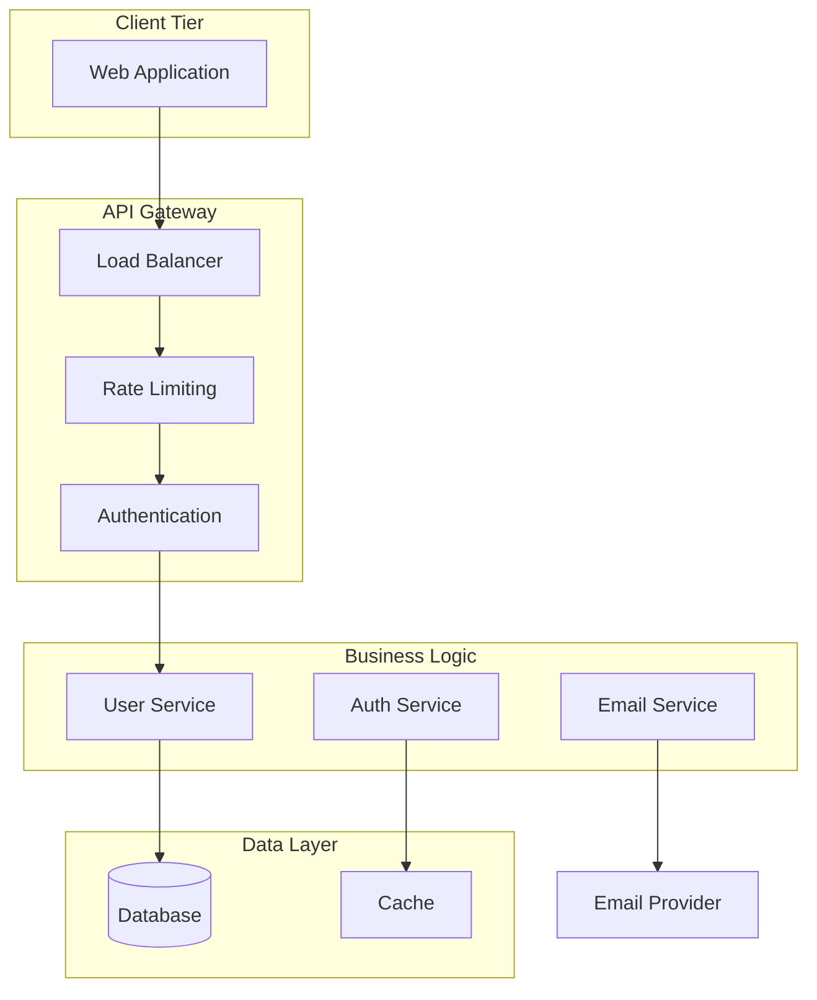

# Best Practices and Patterns

## 📋 Overview

This guide consolidates proven best practices, patterns, and anti-patterns for successful spec-driven development with coding agents. These practices are derived from extensive analysis of successful implementations and common pitfalls to avoid.

## 🎯 Purpose

**Goal**: Provide actionable best practices that ensure high-quality, efficient spec-driven development workflows with consistent, predictable results.

**Key Benefits**:

- **Quality Assurance**: Established patterns that prevent common issues
- **Efficiency Optimization**: Proven workflows that maximize development speed
- **Consistency Standards**: Uniform approaches across projects and teams
- **Risk Mitigation**: Early identification and prevention of potential problems

## 🏆 Specification Quality Best Practices

### Requirements Excellence

#### ✅ Best Practices

**Clear and Specific Language:**
```markdown
// ✅ GOOD: Specific and measurable
WHEN a user submits a registration form with valid email and strong password
THE SYSTEM SHALL create a user account, send verification email, and return 201 status with account ID

// ❌ POOR: Vague and unmeasurable  
The system should handle user registration properly
```

**Complete Edge Case Coverage:**
```markdown
// ✅ GOOD: Comprehensive edge cases
WHEN a user submits registration with email that already exists
THE SYSTEM SHALL return 409 status with error message "Email address already in use"

WHEN a user submits registration with invalid email format
THE SYSTEM SHALL return 400 status with validation error details

WHEN registration service is temporarily unavailable
THE SYSTEM SHALL return 503 status with retry-after header
```

**Testable Acceptance Criteria:**

- **Measurable Outcomes**: Every criterion must be verifiable through testing
- **Specific Values**: Use exact numbers, timeframes, and response codes
- **Observable Behaviors**: Focus on system outputs that can be tested
- **Error Scenarios**: Include failure cases with expected responses

#### ❌ Anti-Patterns to Avoid

**Ambiguous Requirements:**
```markdown
// ❌ AVOID: Unclear expectations
The system should be fast and secure

// ✅ PREFER: Specific requirements
Authentication requests SHALL complete within 200ms for 95% of requests
Password hashing SHALL use bcrypt with minimum 12 salt rounds
```

**Missing Error Handling:**
```markdown
// ❌ AVOID: Only happy path
User can create an account with email and password

// ✅ PREFER: Complete scenarios
User registration handles valid data, duplicate emails, invalid formats, and service errors
```

### Design Documentation Excellence

#### ✅ Architecture Best Practices

**Comprehensive Component Mapping:**


**Detailed API Specifications:**
```yaml
# ✅ GOOD: Complete OpenAPI specification
paths:
  /api/auth/register:
    post:
      summary: User Registration
      requestBody:
        required: true
        content:
          application/json:
            schema:
              type: object
              required: [email, password, name]
              properties:
                email:
                  type: string
                  format: email
                  example: "user@example.com"
                password:
                  type: string
                  minLength: 8
                  pattern: "^(?=.*[a-z])(?=.*[A-Z])(?=.*\\d)(?=.*[@$!%*?&])[A-Za-z\\d@$!%*?&]"
                name:
                  type: string
                  minLength: 1
                  maxLength: 100
      responses:
        201:
          description: Account created successfully
          content:
            application/json:
              schema:
                $ref: '#/components/schemas/SuccessResponse'
        400:
          description: Validation error
          content:
            application/json:
              schema:
                $ref: '#/components/schemas/ValidationError'
```

#### ✅ Database Design Patterns

**Proper Relationship Modeling:**
```sql
-- ✅ GOOD: Clear relationships and constraints
CREATE TABLE users (
    id UUID PRIMARY KEY DEFAULT gen_random_uuid(),
    email VARCHAR(255) UNIQUE NOT NULL,
    password_hash VARCHAR(255) NOT NULL,
    name VARCHAR(100) NOT NULL,
    email_verified BOOLEAN DEFAULT FALSE,
    created_at TIMESTAMP WITH TIME ZONE DEFAULT NOW(),
    updated_at TIMESTAMP WITH TIME ZONE DEFAULT NOW()
);

CREATE TABLE login_attempts (
    id UUID PRIMARY KEY DEFAULT gen_random_uuid(),
    user_id UUID REFERENCES users(id) ON DELETE CASCADE,
    ip_address INET NOT NULL,
    success BOOLEAN DEFAULT FALSE,
    attempted_at TIMESTAMP WITH TIME ZONE DEFAULT NOW()
);

-- Indexes for performance
CREATE INDEX idx_users_email ON users(email);
CREATE INDEX idx_login_attempts_user_time ON login_attempts(user_id, attempted_at);
CREATE INDEX idx_login_attempts_ip_time ON login_attempts(ip_address, attempted_at);
```

### Implementation Planning Best Practices

#### ✅ Task Breakdown Patterns

**Appropriate Task Sizing:**

- **Small Tasks (2-4 hours)**: Single function or endpoint implementation
- **Medium Tasks (4-8 hours)**: Complete feature with multiple components
- **Large Tasks (8+ hours)**: Complex integrations or major architectural changes

**Clear Dependency Management:**
```markdown
### TASK-003: User Authentication Service
**Dependencies**: 
- TASK-001: Database Schema (provides user table)
- TASK-002: Password Hashing Service (provides hash functions)

**Blocking Tasks**: 
- TASK-004: Protected Endpoints (needs authentication middleware)
- TASK-005: User Profile Management (needs user identification)
```

**Comprehensive Acceptance Criteria:**
```markdown
**Acceptance Criteria**:
- [ ] Authentication middleware validates JWT tokens
- [ ] Invalid tokens return 401 with RFC 7807 error format
- [ ] Expired tokens trigger automatic refresh flow
- [ ] User context available in request object
- [ ] Rate limiting applied per user ID
- [ ] Comprehensive unit tests with >90% coverage
- [ ] Integration tests with mock and real JWT scenarios
- [ ] Performance meets <100ms response time requirement
```

## 🤖 Coding Agent Integration Patterns

### GitHub Copilot Optimization

#### ✅ Effective Issue Templates

**Context-Rich Descriptions:**
```markdown
# User Authentication Implementation

## Complete Context Package

### Requirements Section
[Paste relevant requirements with EARS notation]

### Design Specifications  
[Include API specs, data models, error formats]

### Technical Implementation Details
- Use Express.js with TypeScript
- JWT tokens with 15-minute expiration
- bcrypt password hashing (12 salt rounds)
- PostgreSQL with UUID primary keys
- Jest for testing with Supertest
- Rate limiting with express-rate-limit

### File Structure Expected
```
src/
├── controllers/authController.ts
├── services/authService.ts
├── middleware/authMiddleware.ts
├── models/User.ts
├── utils/passwordUtils.ts
└── __tests__/auth.test.ts
```

### Success Criteria
[Detailed acceptance criteria matching requirements]
```

#### ✅ Progressive Enhancement Strategy

**Phase 1: Core Implementation**
```markdown
## Phase 1 Focus
Implement basic authentication flow:
- User registration endpoint
- Login endpoint with JWT issuance
- Basic password validation
- Database integration

**Success Criteria**: Basic auth flow working
**Estimated Time**: 6-8 hours
```

**Phase 2: Security Hardening**
```markdown
## Phase 2 Focus  
Add security measures:
- Rate limiting implementation
- Account lockout mechanisms
- Enhanced password validation
- Security headers and CORS

**Success Criteria**: Production-ready security
**Estimated Time**: 4-6 hours  
```

### Claude Code Integration Patterns

#### ✅ Iterative Specification Development

**Initial Draft Creation:**
```text
Create initial requirements for user authentication system including:
- User registration with email verification
- Login/logout with JWT tokens  
- Password reset functionality
- Account security measures

Focus on core user journeys and basic security requirements.
```

**Specification Refinement:**
```text
Review and enhance these requirements for production readiness:

[Paste initial requirements]

Add comprehensive coverage for:
- Edge cases and error scenarios
- Security hardening requirements  
- Performance and scalability needs
- Integration with external services
- Monitoring and observability

Ensure every requirement uses EARS notation and is testable.
```

#### ✅ Design Validation Process

**Architecture Review:**
```text
Validate this technical design for implementation readiness:

[Paste design document]

Evaluate:
1. Component separation and responsibilities
2. Data model completeness and relationships
3. API contract clarity and REST compliance
4. Security measure adequacy
5. Error handling comprehensiveness  
6. Performance optimization opportunities
7. Testing strategy effectiveness

Provide specific recommendations for any gaps.
```

## 📊 Quality Assurance Patterns

### Testing Strategy Best Practices

#### ✅ Requirements-Driven Testing

**Test Case Generation from EARS:**
```typescript
// Requirement: WHEN user submits valid registration data 
//              THE SYSTEM SHALL create account and send verification email

describe('User Registration - Valid Data', () => {
  it('creates account and sends verification email', async () => {
    const validUser = {
      email: 'test@example.com',
      password: 'SecureP@ss1',
      name: 'Test User'
    };

    const response = await request(app)
      .post('/api/auth/register')
      .send(validUser);

    expect(response.status).toBe(201);
    expect(response.body.success).toBe(true);
    expect(response.body.data.message).toBe('Please check your email to verify your account');
    
    // Verify account created in database
    const user = await User.findOne({ email: validUser.email });
    expect(user).toBeDefined();
    expect(user.email_verified).toBe(false);
    
    // Verify verification email sent
    expect(emailService.sendVerificationEmail).toHaveBeenCalledWith(user);
  });
});
```

#### ✅ API Contract Testing

**Specification Compliance Verification:**
```typescript
// Verify exact API contract adherence
describe('API Contract Compliance', () => {
  it('registration endpoint matches OpenAPI specification', async () => {
    const response = await request(app)
      .post('/api/auth/register')
      .send(validRegistrationData);

    // Validate response structure matches specification exactly
    expect(response.body).toMatchSchema({
      type: 'object',
      required: ['success', 'data', 'meta'],
      properties: {
        success: { type: 'boolean' },
        data: {
          type: 'object',
          required: ['message', 'email'],
          properties: {
            message: { type: 'string' },
            email: { type: 'string', format: 'email' }
          }
        },
        meta: {
          type: 'object',
          required: ['timestamp', 'request_id']
        }
      }
    });
  });
});
```

### Performance Optimization Patterns

#### ✅ Requirements-Based Performance Testing

**Load Testing Strategy:**
```javascript
// Performance Requirement: Authentication requests complete within 200ms for 95% of requests

describe('Authentication Performance', () => {
  it('meets response time requirements under load', async () => {
    const requests = [];
    const responseTimes = [];

    // Simulate 100 concurrent login requests
    for (let i = 0; i < 100; i++) {
      requests.push(
        request(app)
          .post('/api/auth/login')
          .send(validCredentials)
          .then(response => {
            responseTimes.push(response.duration);
            return response;
          })
      );
    }

    await Promise.all(requests);

    // Verify 95th percentile under 200ms
    const sorted = responseTimes.sort((a, b) => a - b);
    const p95 = sorted[Math.floor(sorted.length * 0.95)];
    
    expect(p95).toBeLessThan(200);
  });
});
```

## 🚨 Common Anti-Patterns and Solutions

### Requirements Anti-Patterns

#### ❌ Vague Language
```markdown
// ❌ AVOID
The system should be user-friendly and secure

// ✅ REPLACE WITH
WHEN a user attempts login with invalid credentials 
THE SYSTEM SHALL return error message within 200ms and log attempt for security monitoring

WHEN a user successfully authenticates
THE SYSTEM SHALL issue JWT token with 15-minute expiration and redirect to dashboard
```

#### ❌ Missing Error Scenarios
```markdown
// ❌ INCOMPLETE
User can register with email and password

// ✅ COMPLETE
User registration handles:
- Valid data: creates account and sends verification
- Duplicate email: returns 409 with clear error message
- Invalid email format: returns 400 with validation details
- Weak password: returns 400 with strength requirements
- Service unavailable: returns 503 with retry guidance
```

### Design Anti-Patterns

#### ❌ Insufficient API Documentation
```markdown
// ❌ AVOID
POST /register - Creates user account

// ✅ PREFER  
POST /api/auth/register
Purpose: Create new user account with email verification
Request: JSON with email (RFC 5322), password (8+ chars, complexity), name (1-100 chars)
Success Response (201): {success: true, data: {message, email}, meta: {timestamp, request_id}}
Error Responses: 400 (validation), 409 (duplicate), 500 (server error)
```

### Implementation Anti-Patterns

#### ❌ Oversized Tasks
```markdown
// ❌ AVOID: Too broad
Implement complete user management system

// ✅ PREFER: Appropriately sized
TASK-001: Implement user registration endpoint
- Registration form validation
- Password hashing and storage  
- Verification email sending
- Success/error response handling
```

## 📈 Continuous Improvement Patterns

### Feedback Loop Implementation

#### ✅ Post-Implementation Review

**Specification Quality Assessment:**
```markdown
## Implementation Review Checklist

### Specification Effectiveness
- [ ] Requirements were clear and unambiguous
- [ ] Design provided sufficient implementation detail
- [ ] Tasks were appropriately sized and scoped
- [ ] Dependencies were correctly identified
- [ ] Acceptance criteria were testable and complete

### Coding Agent Performance
- [ ] First-pass implementation success rate >80%
- [ ] Clarification requests <2 per task
- [ ] Code quality met established standards
- [ ] Test coverage achieved target thresholds
- [ ] Performance requirements met

### Process Improvements Identified
- [ ] Template enhancements needed
- [ ] Workflow optimizations possible  
- [ ] Best practices to document
- [ ] Anti-patterns to avoid
```

#### ✅ Template Evolution

**Iterative Improvement Process:**
1. **Collect Implementation Feedback**: What caused confusion or delays?
2. **Analyze Pattern Success**: Which approaches worked consistently?  
3. **Update Templates**: Incorporate lessons learned
4. **Test Improvements**: Validate template changes with new implementations
5. **Document Best Practices**: Share successful patterns

### Success Metrics Tracking

#### ✅ Key Performance Indicators

**Quality Metrics:**
- **Specification Adherence**: 95%+ of requirements implemented exactly as specified
- **First-Pass Success**: 80%+ of tasks completed without rework
- **Test Coverage**: 90%+ automated test coverage for critical paths
- **Security Compliance**: Zero security vulnerabilities in implemented code

**Efficiency Metrics:**
- **Implementation Speed**: 50%+ reduction in specification-to-working-code time
- **Clarification Frequency**: <2 clarification requests per task
- **Rework Rate**: <20% of implementations requiring significant changes
- **Integration Success**: 95%+ of components integrate successfully on first attempt

---

## 🔗 Navigation

### Previous: [GitHub Copilot Coding Agent Workflow](./github-copilot-coding-agent-workflow.md)

### Next: [Project Templates and Examples](./project-templates-examples.md)

---

*Best Practices and Patterns completed on July 20, 2025*  
*Comprehensive guide to proven patterns for successful spec-driven development*
