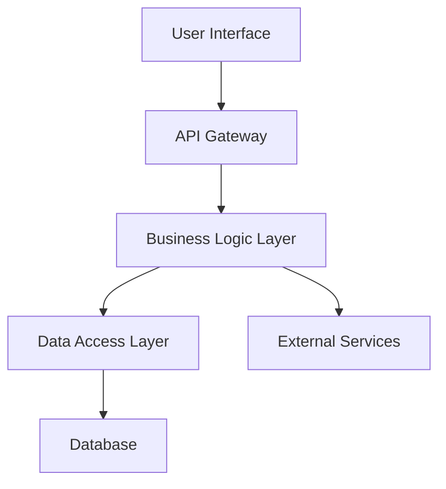
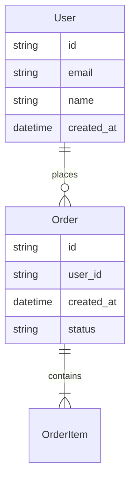
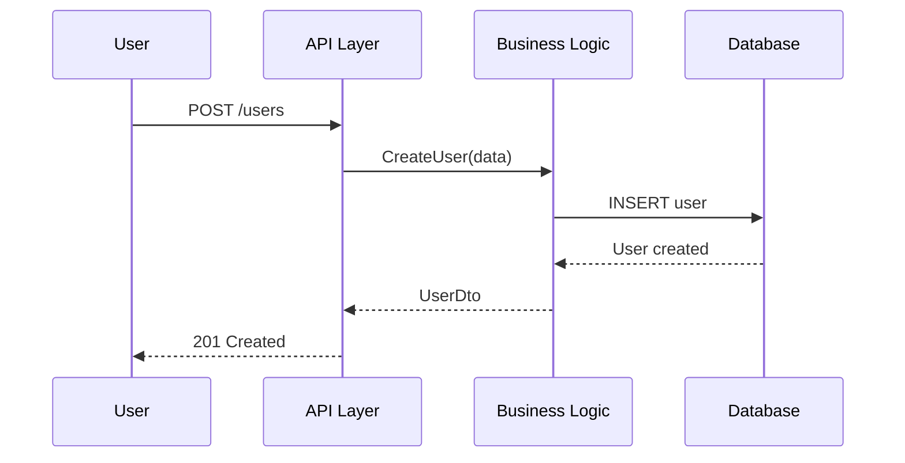
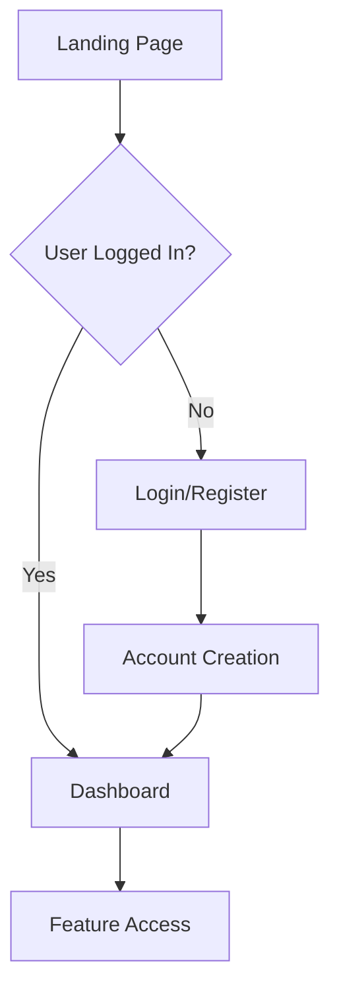
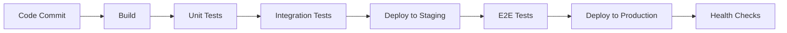
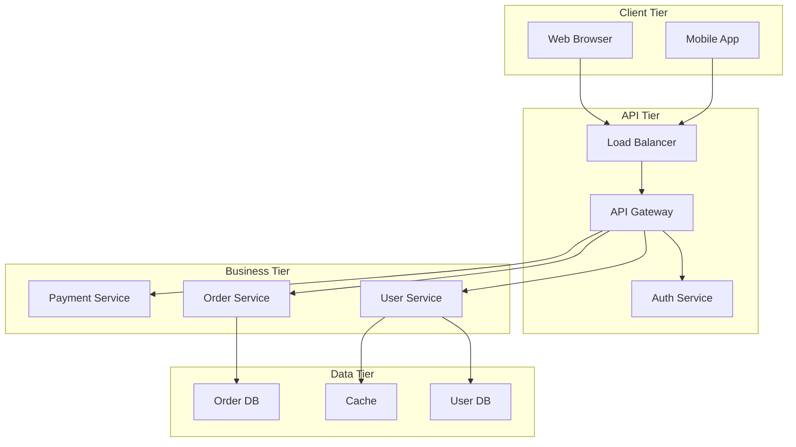
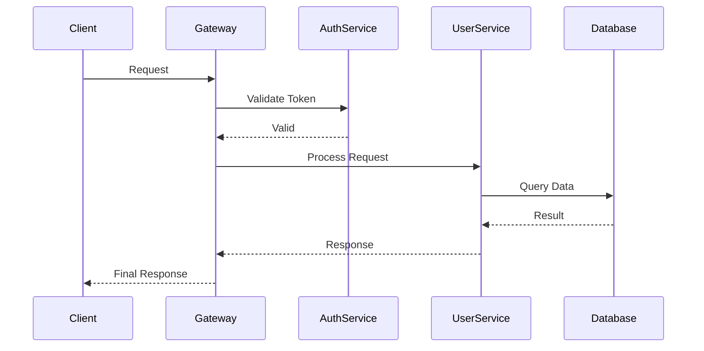

# Design Documentation Template for Spec-Driven Development

## 📋 Overview

This template provides a comprehensive structure for creating `design.md` files that complement requirements.md and enable effective handoff to coding agents. The template follows AWS Kiro's design documentation patterns and includes all technical details needed for implementation.

## 🎯 Template Structure

### Complete Design.md Template

```markdown
# [Feature/Project Name] Design Document

## Design Overview

### Architecture Summary
High-level description of the system architecture and design approach.

### Design Principles
- **Principle 1**: Description and rationale
- **Principle 2**: Description and rationale  
- **Principle 3**: Description and rationale

### Key Design Decisions
- **Decision 1**: What was decided and why
- **Decision 2**: Alternative considered and rationale for choice
- **Decision 3**: Trade-offs made and implications

## System Architecture

### High-Level Architecture Diagram


### Component Overview
- **Component Name**: Purpose, responsibilities, and key interfaces
- **Component Name**: Purpose, responsibilities, and key interfaces
- **Component Name**: Purpose, responsibilities, and key interfaces

### Technology Stack
- **Frontend**: Framework/library choices and rationale
- **Backend**: Runtime, framework, and key libraries
- **Database**: Database type, version, and key features used
- **Infrastructure**: Hosting, deployment, and scaling approach
- **External Services**: Third-party integrations and APIs

## Data Design

### Data Model


### Entity Specifications

#### User Entity
- **Purpose**: Represents system users
- **Fields**:
  - `id`: Unique identifier (UUID)
  - `email`: User email address (unique, indexed)
  - `name`: Display name (varchar 100)
  - `created_at`: Account creation timestamp
  - `updated_at`: Last modification timestamp
- **Constraints**:
  - Email must be unique
  - Email format validation required
  - Name cannot be empty
- **Indexes**:
  - Primary: `id`
  - Unique: `email`
  - Standard: `created_at`

### Data Flow Diagrams


### Database Design Considerations
- **Performance**: Indexing strategy and query optimization
- **Scalability**: Partitioning and sharding considerations
- **Consistency**: Transaction boundaries and ACID requirements
- **Backup/Recovery**: Data backup and disaster recovery approach

## API Design

### API Architecture
- **Style**: REST / GraphQL / gRPC
- **Authentication**: JWT / OAuth2 / API Keys
- **Versioning**: URL versioning / Header versioning
- **Rate Limiting**: Strategy and limits

### Endpoint Specifications

#### User Management Endpoints

**GET /api/v1/users**
- **Purpose**: Retrieve list of users with pagination
- **Parameters**:
  - `page`: Page number (default: 1)
  - `limit`: Items per page (default: 20, max: 100)
  - `search`: Optional search term
- **Response**: 200 OK with user list
- **Error Cases**: 401 Unauthorized, 500 Internal Error

**POST /api/v1/users**
- **Purpose**: Create new user account
- **Request Body**:
  ```json
  {
    "email": "user@example.com",
    "name": "John Doe",
    "password": "secure_password"
  }
  ```
- **Response**: 201 Created with user details
- **Error Cases**: 400 Bad Request, 409 Conflict (email exists)

**GET /api/v1/users/{id}**
- **Purpose**: Retrieve specific user by ID
- **Parameters**: `id` (UUID in path)
- **Response**: 200 OK with user details
- **Error Cases**: 404 Not Found, 401 Unauthorized

### Request/Response Formats

#### Standard Response Structure
```json
{
  "success": true,
  "data": {},
  "meta": {
    "timestamp": "2025-07-20T10:30:00Z",
    "request_id": "req-123456",
    "version": "1.0.0"
  }
}
```

#### Error Response Structure  
```json
{
  "success": false,
  "error": {
    "type": "https://api.example.com/problems/validation-error",
    "title": "Validation Failed",
    "status": 400,
    "detail": "Email address is invalid",
    "instance": "/api/v1/users"
  },
  "meta": {
    "timestamp": "2025-07-20T10:30:00Z",
    "request_id": "req-123456"
  }
}
```

## User Interface Design

### User Experience Flow


### Component Architecture
- **Design System**: Component library and style guide used
- **State Management**: State management approach (Redux, Context, etc.)
- **Routing**: Client-side routing strategy
- **Forms**: Form handling and validation approach

### Key UI Components

#### Navigation Component
- **Purpose**: Primary site navigation
- **Props**: User state, current page, navigation items
- **Behavior**: Responsive collapse, active state indication
- **Accessibility**: ARIA labels, keyboard navigation

#### Form Components
- **Input Fields**: Validation, error display, accessibility
- **Buttons**: Loading states, disabled states, variants
- **Form Layout**: Grid system, responsive behavior

### Responsive Design Strategy
- **Breakpoints**: Mobile (320px), Tablet (768px), Desktop (1024px)
- **Layout Adaptation**: Grid changes, navigation collapse
- **Touch Interactions**: Button sizes, gesture handling

## Security Design

### Authentication Strategy
- **Method**: JWT with refresh tokens
- **Token Lifecycle**: Access token (15 min), Refresh token (7 days)
- **Storage**: Secure HTTP-only cookies for web, secure storage for mobile
- **Session Management**: Concurrent session handling

### Authorization Model
- **Approach**: Role-based access control (RBAC)
- **Roles**: User, Admin, SuperAdmin
- **Permissions**: Resource-based permissions matrix
- **Enforcement**: API gateway and application-level checks

### Data Protection
- **Encryption at Rest**: AES-256 for sensitive data
- **Encryption in Transit**: TLS 1.3 for all communications
- **PII Handling**: Data anonymization and retention policies
- **Password Security**: bcrypt with salt, complexity requirements

### Security Headers and Policies
- **Content Security Policy**: Strict CSP configuration
- **CORS**: Restricted origin policy
- **Rate Limiting**: Per-user and per-IP limits
- **Input Validation**: Comprehensive sanitization and validation

## Performance Design

### Performance Requirements
- **Response Time**: 95% of requests under 200ms
- **Throughput**: 1000 concurrent users
- **Availability**: 99.9% uptime SLA
- **Scalability**: Horizontal scaling capability

### Optimization Strategies

#### Backend Optimization
- **Database**: Query optimization, connection pooling, indexing
- **Caching**: Redis for session data, API response caching
- **Load Balancing**: Application load balancer configuration
- **CDN**: Static asset delivery optimization

#### Frontend Optimization
- **Bundle Optimization**: Code splitting, tree shaking, compression
- **Asset Optimization**: Image compression, lazy loading
- **Caching Strategy**: Browser caching, service workers
- **Performance Monitoring**: Core Web Vitals tracking

### Monitoring and Observability
- **Application Monitoring**: APM tool integration
- **Infrastructure Monitoring**: Server and database metrics
- **User Experience Monitoring**: Real user monitoring (RUM)
- **Alert Configuration**: Performance degradation alerts

## Error Handling Design

### Error Classification
- **Client Errors (4xx)**: User input errors, authentication failures
- **Server Errors (5xx)**: System failures, service unavailability
- **Business Logic Errors**: Domain-specific validation failures
- **External Service Errors**: Third-party service failures

### Error Recovery Strategies
- **Retry Logic**: Exponential backoff for transient failures
- **Circuit Breaker**: Prevent cascade failures
- **Graceful Degradation**: Fallback functionality
- **User Communication**: Clear error messages and guidance

### Logging Strategy
- **Log Levels**: ERROR, WARN, INFO, DEBUG
- **Structured Logging**: JSON format with consistent fields
- **Correlation IDs**: Request tracing across services
- **Log Retention**: 30 days for DEBUG, 1 year for ERROR

## Integration Design

### External Service Integration

#### Third-Party APIs
- **Service Name**: Purpose, authentication method, rate limits
- **Error Handling**: Timeout configuration, retry logic
- **Data Mapping**: Request/response transformation
- **Monitoring**: Health checks and alerting

#### Event Processing
- **Message Queue**: Technology choice and configuration
- **Event Schema**: Event structure and versioning
- **Error Handling**: Dead letter queues, retry policies
- **Monitoring**: Queue depth and processing metrics

### Internal Service Communication
- **Communication Pattern**: Synchronous vs. asynchronous
- **Service Discovery**: How services find each other
- **Load Balancing**: Distribution strategy
- **Fault Tolerance**: Timeout, retry, and fallback strategies

## Deployment Design

### Infrastructure Architecture
- **Environment Strategy**: Development, Staging, Production
- **Container Strategy**: Docker containerization approach
- **Orchestration**: Kubernetes configuration
- **Service Mesh**: Istio/Envoy configuration if applicable

### Deployment Pipeline


### Rollout Strategy
- **Blue-Green Deployment**: Zero-downtime deployment approach
- **Feature Flags**: Gradual rollout and quick rollback
- **Database Migrations**: Backward-compatible migration strategy
- **Monitoring**: Deployment health and rollback triggers

## Testing Strategy

### Testing Pyramid
- **Unit Tests**: 70% coverage target, fast feedback
- **Integration Tests**: API and database integration
- **End-to-End Tests**: Critical user journeys
- **Performance Tests**: Load and stress testing

### Test Data Strategy
- **Test Data Creation**: Factory patterns, fixtures
- **Data Isolation**: Test database per environment
- **Data Cleanup**: Automated cleanup between tests
- **Sensitive Data**: Mock or anonymized test data

### Quality Gates
- **Code Coverage**: Minimum 80% line coverage
- **Performance Benchmarks**: Response time thresholds
- **Security Scanning**: Automated vulnerability scanning
- **Code Quality**: Static analysis and linting

## Implementation Guidelines

### Development Standards
- **Code Style**: Linting rules and formatting standards
- **Documentation**: Code comments and API documentation
- **Version Control**: Branch strategy and commit conventions
- **Code Review**: Review process and approval requirements

### Technology-Specific Considerations

#### Frontend (React/Next.js Example)
- **State Management**: Redux Toolkit configuration
- **Component Structure**: Atomic design methodology
- **Testing**: Jest and React Testing Library setup
- **Performance**: React.memo usage and optimization

#### Backend (Node.js/Express Example)
- **Project Structure**: Layered architecture organization
- **Dependency Injection**: Container configuration
- **Error Handling**: Global error handler middleware
- **Database**: ORM configuration and migrations

### Configuration Management
- **Environment Variables**: Configuration externalization
- **Secrets Management**: Secure credential storage
- **Feature Flags**: Runtime configuration management
- **Deployment Configuration**: Environment-specific settings

## Assumptions and Constraints

### Technical Assumptions
- **Browser Support**: Modern browsers (Chrome 90+, Firefox 88+)
- **Mobile Support**: iOS 14+, Android API 26+
- **Internet Connectivity**: Reliable high-speed internet
- **Third-Party Services**: External service availability

### Technical Constraints
- **Budget Constraints**: Infrastructure cost limitations
- **Timeline Constraints**: Delivery deadline requirements
- **Resource Constraints**: Team size and skill limitations
- **Legacy System Constraints**: Integration requirements

### Risk Mitigation
- **Technical Risks**: Performance bottlenecks, scalability limits
- **Integration Risks**: External service dependencies
- **Security Risks**: Data breaches, authentication failures
- **Operational Risks**: Deployment failures, system outages

## Future Considerations

### Scalability Planning
- **Horizontal Scaling**: Load balancer and auto-scaling configuration
- **Database Scaling**: Read replicas and sharding strategy
- **Cache Strategy**: Distributed caching implementation
- **CDN Expansion**: Global content delivery optimization

### Technology Evolution
- **Framework Updates**: Upgrade path and compatibility
- **New Features**: Extension points and plugin architecture
- **Performance Improvements**: Optimization opportunities
- **Security Enhancements**: Ongoing security improvements

---

*Design version: 1.0*  
*Last updated: [Date]*  
*Reviewed by: [Technical Lead]*  
*Approved by: [Architecture Team]*
```

## 🎭 Template Variants by Architecture Pattern

### Microservices Architecture Template

```markdown
# Microservices Design Additions

## Service Boundaries
- **Service A**: Domain responsibilities and data ownership
- **Service B**: API contracts and communication patterns
- **Service C**: Deployment and scaling considerations

## Inter-Service Communication
- **Synchronous**: REST API calls with circuit breakers
- **Asynchronous**: Event-driven messaging patterns
- **Data Consistency**: Eventual consistency strategies

## Service Discovery and Routing
- **Service Registry**: Discovery mechanism and health checks
- **API Gateway**: Request routing and cross-cutting concerns
- **Load Balancing**: Traffic distribution and failover
```

### Monolithic Architecture Template

```markdown
# Monolithic Design Additions

## Module Organization
- **Module Structure**: Clear separation of concerns
- **Dependency Management**: Module interfaces and boundaries
- **Code Organization**: Package structure and naming

## Scaling Strategy
- **Vertical Scaling**: Resource optimization approach
- **Horizontal Scaling**: Load balancer configuration
- **Database Scaling**: Connection pooling and optimization
```

### Event-Driven Architecture Template

```markdown
# Event-Driven Design Additions

## Event Design
- **Event Schema**: Event structure and versioning
- **Event Store**: Event persistence and replay
- **Event Processing**: Stream processing patterns

## Message Patterns
- **Command Query Separation**: CQRS implementation
- **Event Sourcing**: Event log and state reconstruction
- **Saga Patterns**: Distributed transaction coordination
```

## 🔧 Tools Integration

### Mermaid Diagram Templates

**System Architecture:**


**Data Flow:**


### Claude Code Integration

**Architecture Analysis Prompt:**
```text
Analyze this feature requirements and create a technical design:

[Requirements Document Section]

Generate:
1. High-level architecture diagram (Mermaid)
2. Data model with relationships
3. API endpoint specifications
4. Security considerations
5. Performance requirements
6. Integration points

Focus on:
- Scalability and maintainability
- Security best practices
- Clear separation of concerns
- Testability and observability
```

**Design Review Prompt:**
```text
Review this technical design for completeness:

[Design Document Section]

Evaluate:
1. Architecture clarity and feasibility
2. Data model correctness and normalization
3. API design consistency and REST compliance
4. Security measures adequacy
5. Performance and scalability considerations
6. Error handling and monitoring coverage

Provide specific recommendations for improvement.
```

## 📊 Quality Assurance Checklist

### Architecture Design Quality

**✅ System Architecture**
- [ ] High-level architecture diagram included
- [ ] Component responsibilities clearly defined
- [ ] Technology stack justified with rationale
- [ ] Integration points identified and specified

**✅ Data Design**
- [ ] Data model diagram with relationships
- [ ] Entity specifications with constraints
- [ ] Database performance considerations
- [ ] Data consistency and integrity rules

**✅ API Design**
- [ ] All endpoints documented with examples
- [ ] Request/response formats standardized
- [ ] Error handling patterns consistent
- [ ] Authentication and authorization specified

### Implementation Readiness

**✅ Technical Specifications**
- [ ] Sufficient detail for independent implementation
- [ ] No ambiguous technical requirements
- [ ] All external dependencies identified
- [ ] Configuration requirements specified

**✅ Non-Functional Requirements**
- [ ] Performance benchmarks defined
- [ ] Security measures comprehensive
- [ ] Error handling strategies complete
- [ ] Monitoring and logging specified

**✅ Operational Considerations**
- [ ] Deployment strategy defined
- [ ] Testing approach comprehensive
- [ ] Infrastructure requirements clear
- [ ] Maintenance procedures documented

## 🎯 Success Metrics

### Design Quality Metrics

**Completeness Score**
- Target: All major architecture components documented
- Measure: Coverage of architecture, data, API, security, performance
- Goal: 100% coverage of implementation-critical areas

**Clarity Score**
- Target: Developers can implement without design clarification
- Measure: Number of design questions during implementation
- Goal: <3 design clarifications per major component

**Consistency Score**
- Target: All design patterns consistent across components
- Measure: Adherence to established patterns and standards
- Goal: 100% compliance with design standards

### Implementation Success

**Development Velocity**
- Target: Predictable development timeline
- Measure: Actual vs. estimated implementation time
- Goal: <20% variance from estimates

**Defect Rate**
- Target: Minimize design-related bugs
- Measure: Bugs attributed to incomplete or incorrect design
- Goal: <5% of bugs due to design issues

## 📋 Template Usage Guide

### Design Document Creation Process

1. **Architecture First**: Start with high-level system design
2. **Detail Progressively**: Add detailed specifications for each component
3. **Review and Validate**: Technical review with stakeholders
4. **Update Requirements**: Ensure alignment between requirements and design
5. **Implementation Handoff**: Provide complete specifications to coding agents

### Collaboration Workflow

1. **Initial Design**: Technical lead creates first draft
2. **Team Review**: Architecture and security reviews
3. **Stakeholder Approval**: Business and product team sign-off
4. **Version Control**: Commit design.md alongside requirements.md
5. **Maintenance**: Update design based on implementation feedback

---

## 🔗 Navigation

### Previous: [Requirements Template](./requirements-template.md)

### Next: [Implementation Planning Template](./implementation-planning-template.md)

---

*Design Template completed on July 20, 2025*  
*Based on AWS Kiro design documentation patterns and software architecture best practices*
