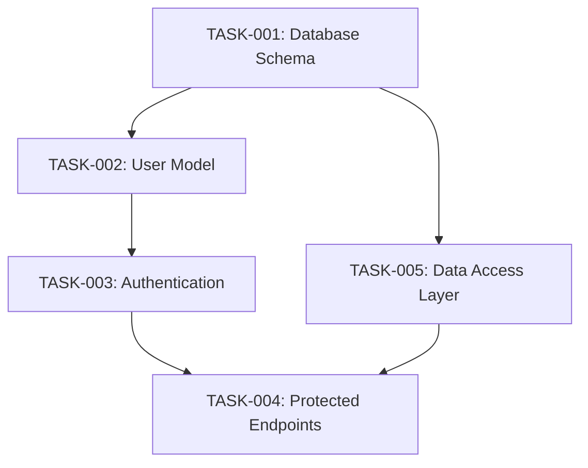

# Implementation Planning Template

## 📋 Overview

This template provides a structured approach to breaking down requirements and design specifications into actionable implementation tasks optimized for coding agents. The planning template bridges the gap between high-level specifications and granular development work.

## 🎯 Purpose

**Goal**: Transform requirements and design documents into detailed task lists that coding agents can execute autonomously with minimal clarification.

**Key Benefits**:
- **Task Clarity**: Each task has clear acceptance criteria and definition of done
- **Dependency Tracking**: Explicit dependencies between tasks enable proper sequencing
- **Progress Monitoring**: Structured format enables automated progress tracking
- **Agent Optimization**: Tasks formatted for optimal handoff to coding agents

## 📝 Template Structure

### Project Header

```markdown
# [Project Name] Implementation Tasks

## Task Overview

### Phase 1: [Phase Name] (Week X)
Brief description of phase objectives

### Phase 2: [Phase Name] (Week X)
Brief description of phase objectives

### Phase 3: [Phase Name] (Week X)
Brief description of phase objectives

## Detailed Task Breakdown
```

### Individual Task Format

```markdown
### TASK-XXX: [Task Title]
**Description**: Clear description of what needs to be implemented
**Priority**: Must Have | Should Have | Could Have | Won't Have
**Estimated Effort**: X hours

**Acceptance Criteria**:
- [ ] Specific, measurable outcome 1
- [ ] Specific, measurable outcome 2
- [ ] Specific, measurable outcome 3
- [ ] Unit tests written and passing
- [ ] Integration tests written and passing
- [ ] Code review completed
- [ ] Documentation updated

**Dependencies**: TASK-XXX, TASK-XXX
**Status**: ⏳ Pending | 🚧 In Progress | ✅ Complete | ❌ Blocked

**Implementation Details**:
- Technical approach or architecture notes
- Specific libraries or tools to use
- Performance or security considerations
- Any special handling required

---
```

## 🏗️ Task Categories

### Foundation Tasks
- Database schema setup
- Core models and entities
- Basic infrastructure setup
- Configuration management

### Feature Development Tasks
- API endpoint implementation
- Business logic development
- Data validation and processing
- Integration with external services

### Security Tasks
- Authentication implementation
- Authorization rules
- Input validation and sanitization
- Security testing

### Quality Assurance Tasks
- Unit test development
- Integration test implementation
- End-to-end test scenarios
- Performance testing

### Documentation Tasks
- API documentation
- User guides
- Developer documentation
- Deployment guides

## 📊 Task Prioritization Framework

### Priority Levels

#### Must Have (P0)
- **Criteria**: Core functionality required for MVP
- **Examples**: User authentication, basic CRUD operations, critical security features
- **Timeline**: Must be completed in current phase

#### Should Have (P1)
- **Criteria**: Important features that significantly enhance user experience
- **Examples**: Advanced search, notifications, user preferences
- **Timeline**: Should be completed in current release if time permits

#### Could Have (P2)
- **Criteria**: Nice-to-have features that add value but aren't essential
- **Examples**: Advanced analytics, integration with non-critical services
- **Timeline**: Can be deferred to future releases

#### Won't Have (P3)
- **Criteria**: Features explicitly out of scope for current release
- **Examples**: Future enhancements, advanced features requiring more research
- **Timeline**: Not planned for current development cycle

## 🔗 Dependency Management

### Dependency Types

#### Technical Dependencies
```markdown
**Technical Dependencies**: 
- Database schema (TASK-001) must be completed before model implementation (TASK-002)
- Authentication service (TASK-003) required before protected endpoints (TASK-004)
```

#### Resource Dependencies
```markdown
**Resource Dependencies**:
- External API keys and configuration required
- Third-party service setup (SendGrid, Stripe, etc.)
- Infrastructure provisioning and deployment setup
```

#### Knowledge Dependencies
```markdown
**Knowledge Dependencies**:
- Research into specific technology or approach needed
- Design decisions pending stakeholder approval
- Performance benchmarking results required
```

### Dependency Visualization

```markdown
## Task Dependencies Visualization


```

## 📈 Progress Tracking

### Status Categories

#### ⏳ Pending
- Task is defined and ready to start
- All dependencies are identified
- Acceptance criteria are clear

#### 🚧 In Progress
- Task is actively being worked on
- Developer or coding agent is assigned
- Regular progress updates expected

#### ✅ Complete
- All acceptance criteria met
- Code review completed
- Tests passing
- Documentation updated

#### ❌ Blocked
- Cannot proceed due to external dependency
- Waiting for clarification or decision
- Technical impediment identified

### Progress Summary Template

```markdown
## Progress Tracking

### Current Status Summary
- **Total Tasks**: X
- **Completed**: X ✅
- **In Progress**: X 🚧  
- **Pending**: X ⏳
- **Blocked**: X ❌

### Phase Completion
- [ ] **Phase 1**: Foundation (Tasks 1-X)
- [ ] **Phase 2**: Core Features (Tasks X-Y)
- [ ] **Phase 3**: Integration (Tasks Y-Z)
- [ ] **Phase 4**: Quality Assurance (Tasks Z+)
```

## 🤖 Coding Agent Integration

### Task Assignment Format

#### For GitHub Copilot Coding Agent
```markdown
## GitHub Copilot Issue Template

### Context
This task implements [feature/component] based on specifications in:
- **Requirements**: [Link to requirements.md]
- **Design**: [Link to design.md]

### Current Task: TASK-XXX [Task Title]

#### Task Description
[Copy exact description from implementation plan]

#### Acceptance Criteria
[Copy checklist items from implementation plan]

#### Implementation Guidelines
1. Follow the exact API specification in design.md
2. Use the error response format specified
3. Implement all validation rules from requirements.md
4. Include comprehensive error handling
5. Add unit and integration tests

#### Definition of Done
- [ ] Code implemented and passes all tests
- [ ] API matches specification exactly
- [ ] All error scenarios handled properly
- [ ] Integration tests pass
- [ ] Code review completed
- [ ] Documentation updated

/cc @copilot Please implement this task following the specifications exactly.
```

#### For Claude Code Planning
```markdown
## Claude Code Planning Prompt

Analyze the following task and create a detailed implementation plan:

**Task**: TASK-XXX [Task Title]
**Requirements Reference**: [Paste relevant sections from requirements.md]
**Design Reference**: [Paste relevant sections from design.md]

Please provide:
1. Detailed step-by-step implementation approach
2. File structure and code organization
3. Key functions and their signatures
4. Error handling strategy
5. Testing approach
6. Potential edge cases to consider

Focus on creating code that exactly matches the specifications provided.
```

## 🎯 Best Practices

### Task Definition Guidelines

#### Clear and Specific
- ✅ **Good**: "Implement user registration endpoint with email validation, password hashing, and verification email sending"
- ❌ **Bad**: "Add user signup functionality"

#### Testable Outcomes
- ✅ **Good**: "API returns 201 status code with user ID when valid data provided"
- ❌ **Bad**: "Registration works correctly"

#### Appropriately Sized
- ✅ **Good**: Single feature or component (4-8 hours work)
- ❌ **Bad**: Entire module or system (20+ hours work)

#### Implementation-Ready
- ✅ **Good**: Includes specific technical requirements and constraints
- ❌ **Bad**: Vague descriptions requiring interpretation

### Estimation Guidelines

#### Effort Estimation Factors
- **Complexity**: How difficult is the implementation?
- **Dependencies**: How many other components are involved?
- **Testing**: How much test coverage is required?
- **Documentation**: What documentation needs to be created/updated?

#### Time Allocation Guidelines
- **Simple CRUD**: 2-4 hours
- **Complex Business Logic**: 4-8 hours  
- **External Integration**: 6-12 hours
- **Security Implementation**: 8-16 hours
- **Testing Suite**: 25-50% of implementation time
- **Documentation**: 10-20% of implementation time

## 📋 Quality Checklist

### Task Definition Quality
- [ ] Clear, specific description
- [ ] Measurable acceptance criteria
- [ ] Appropriate effort estimation
- [ ] Dependencies clearly identified
- [ ] Priority level assigned
- [ ] Implementation approach outlined

### Planning Completeness
- [ ] All requirements covered by tasks
- [ ] All design components addressed
- [ ] Dependencies properly sequenced
- [ ] Resource requirements identified
- [ ] Risk factors considered

### Agent Readiness
- [ ] Tasks sized appropriately for autonomous execution
- [ ] Technical specifications detailed enough
- [ ] Error handling requirements specified
- [ ] Testing expectations clear
- [ ] Documentation requirements defined

---

## 🔗 Navigation

### Previous: [Design Documentation Template](./design-template.md)

### Next: [Claude Code Integration Guide](./claude-code-integration-guide.md)

---

*Implementation Planning Template completed on July 20, 2025*  
*Structured approach to breaking down specifications into actionable tasks for coding agents*
