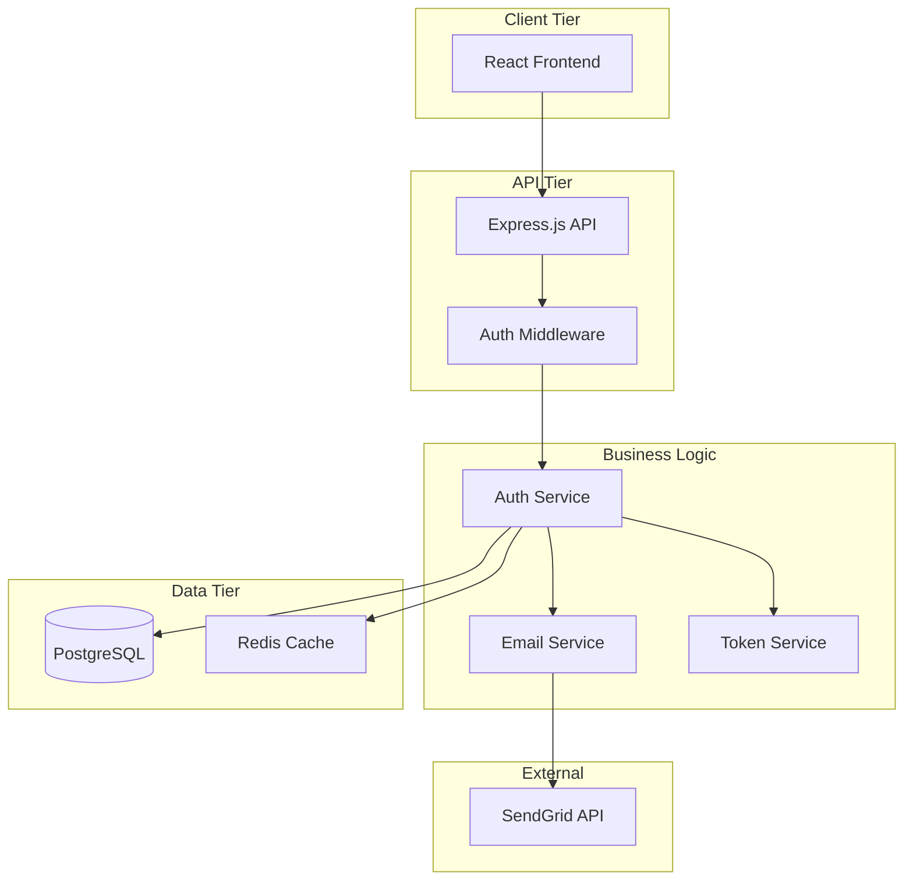
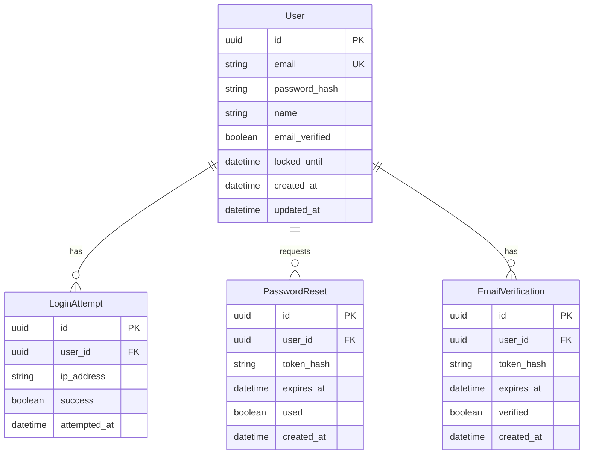
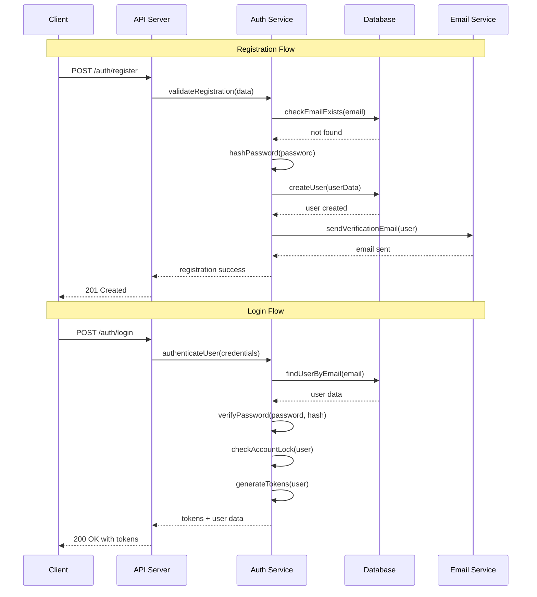
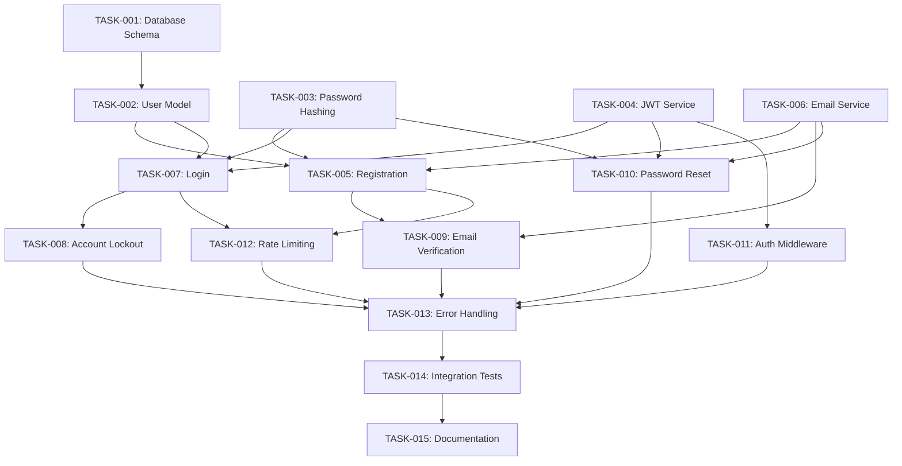

# Project Templates and Examples

## 📋 Overview

This document provides complete, working examples of spec-driven development using the templates and methodologies outlined in this research. Each example demonstrates the full workflow from requirements through implementation planning.

## 🎯 Complete Example: User Authentication System

### Step 1: Requirements.md

```markdown
# User Authentication System Requirements

## Project Overview

### Purpose
Implement secure user authentication with email verification, password reset, and account lockout protection for a web application.

### Scope
**Included:**
- User registration with email verification
- User login/logout with JWT tokens
- Password reset functionality
- Account lockout after failed attempts
- Basic user profile management

**Excluded:**
- Social media authentication (OAuth)
- Multi-factor authentication (MFA)
- Admin user management
- Advanced user roles and permissions

### Success Criteria
- 100% of users can register and verify accounts
- Login response time under 200ms for 95% of requests
- Zero security vulnerabilities in authentication flow
- 99.9% system availability

## User Stories and Requirements

### Epic: User Registration

#### US-001: User Account Creation
**As a** new user  
**I want** to create an account with email and password  
**So that** I can access personalized features

##### Acceptance Criteria (EARS Format)

**Happy Path:**
WHEN a user submits valid registration data (unique email, strong password, name)
THE SYSTEM SHALL create a new account, send verification email, and display "Please check your email to verify your account"

**Email Validation:**
WHEN a user submits an email that is already registered
THE SYSTEM SHALL display "This email address is already in use" below the email field

WHEN a user submits an invalid email format
THE SYSTEM SHALL display "Please enter a valid email address" below the email field

**Password Validation:**
WHEN a user submits a password shorter than 8 characters
THE SYSTEM SHALL display "Password must be at least 8 characters long"

WHEN a user submits a password without uppercase, lowercase, number, and special character
THE SYSTEM SHALL display "Password must contain uppercase, lowercase, number, and special character"

##### Examples
- Valid registration: john@example.com, "SecureP@ss1", "John Doe"
- Invalid email: "not-an-email", should show format error
- Weak password: "password", should show complexity error

#### US-002: Email Verification
**As a** new user  
**I want** to verify my email address  
**So that** I can activate my account and prove email ownership

##### Acceptance Criteria

**Verification Process:**
WHEN a user clicks a valid verification link in their email
THE SYSTEM SHALL mark the account as verified and redirect to login with "Email verified successfully"

WHEN a user clicks an expired verification link (older than 24 hours)
THE SYSTEM SHALL display "Verification link expired" and provide option to resend verification

WHEN a user attempts to login with unverified email
THE SYSTEM SHALL block login and display "Please verify your email address" with resend option

### Epic: User Authentication

#### US-003: User Login
**As a** registered user  
**I want** to log in with my credentials  
**So that** I can access my account and personalized features

##### Acceptance Criteria

**Successful Login:**
WHEN a user enters correct email and password for verified account
THE SYSTEM SHALL authenticate user, create JWT session, and redirect to dashboard

**Failed Authentication:**
WHEN a user enters incorrect email or password
THE SYSTEM SHALL display "Invalid email or password" and retain email field value

WHEN a user enters correct credentials for unverified account
THE SYSTEM SHALL block login and display "Please verify your email address first"

**Account Lockout:**
WHEN a user fails authentication 5 times within 15 minutes
THE SYSTEM SHALL lock the account for 30 minutes and display "Account temporarily locked due to multiple failed login attempts"

#### US-004: Password Reset
**As a** user who forgot my password  
**I want** to reset my password via email  
**So that** I can regain access to my account

##### Acceptance Criteria

**Password Reset Request:**
WHEN a user requests password reset with valid email address
THE SYSTEM SHALL send password reset email and display "Password reset instructions sent to your email"

WHEN a user requests password reset with non-existent email
THE SYSTEM SHALL display same success message (security measure to prevent email enumeration)

**Password Reset Process:**
WHEN a user clicks valid reset link and submits new strong password
THE SYSTEM SHALL update password, invalidate existing sessions, and display "Password updated successfully"

WHEN a user clicks expired reset link (older than 1 hour)
THE SYSTEM SHALL display "Reset link expired" and redirect to password reset request

## Technical Requirements

### Performance Requirements
WHEN the system handles normal load (up to 100 concurrent users)
THE SYSTEM SHALL respond to authentication requests within 200ms for 95% of requests

WHEN the system processes password hashing operations
THE SYSTEM SHALL complete bcrypt hashing within 500ms per operation

### Security Requirements
WHEN storing user passwords
THE SYSTEM SHALL hash passwords using bcrypt with minimum 12 salt rounds

WHEN issuing JWT tokens
THE SYSTEM SHALL use secure random secrets and set 15-minute expiration for access tokens

WHEN handling failed login attempts
THE SYSTEM SHALL implement exponential backoff and account lockout to prevent brute force attacks

### Data Requirements
WHEN creating user records
THE SYSTEM SHALL store: id (UUID), email (unique index), password_hash, name, email_verified (boolean), created_at, updated_at

WHEN tracking failed attempts
THE SYSTEM SHALL store: user_id, attempt_time, ip_address, success (boolean)

## Assumptions and Constraints

### Assumptions
- Users have reliable email access for verification
- Modern browsers with JavaScript enabled
- HTTPS available for all authentication endpoints

### Constraints
- Must comply with GDPR for EU users
- Password storage must meet OWASP guidelines
- Email delivery depends on third-party service (SendGrid)

---

*Requirements version: 1.0*  
*Last updated: July 20, 2025*
```

### Step 2: Design.md

```markdown
# User Authentication System Design

## Architecture Overview

### High-Level Architecture


### Component Responsibilities

- **Auth Service**: Core authentication logic, password validation
- **Email Service**: Email template generation and delivery
- **Token Service**: JWT creation, validation, and refresh
- **Auth Middleware**: Request authentication and authorization

## Data Design

### User Data Model



### Database Schema Specifications

#### User Table

```sql
CREATE TABLE users (
    id UUID PRIMARY KEY DEFAULT gen_random_uuid(),
    email VARCHAR(255) UNIQUE NOT NULL,
    password_hash VARCHAR(255) NOT NULL,
    name VARCHAR(100) NOT NULL,
    email_verified BOOLEAN DEFAULT FALSE,
    locked_until TIMESTAMP WITH TIME ZONE,
    created_at TIMESTAMP WITH TIME ZONE DEFAULT NOW(),
    updated_at TIMESTAMP WITH TIME ZONE DEFAULT NOW()
);

CREATE INDEX idx_users_email ON users(email);
CREATE INDEX idx_users_locked_until ON users(locked_until) WHERE locked_until IS NOT NULL;
```

## API Design

### Authentication Endpoints

#### POST /api/auth/register

**Purpose**: Create new user account and send verification email

**Request:**

```json
{
  "email": "user@example.com",
  "password": "SecureP@ss1",
  "name": "John Doe"
}
```

**Response (201 Created):**

```json
{
  "success": true,
  "data": {
    "message": "Please check your email to verify your account",
    "email": "user@example.com"
  },
  "meta": {
    "timestamp": "2025-07-20T10:30:00Z",
    "request_id": "req-123456"
  }
}
```

#### POST /api/auth/login

**Purpose**: Authenticate user and return JWT tokens

**Request:**

```json
{
  "email": "user@example.com",
  "password": "SecureP@ss1"
}
```

**Response (200 OK):**

```json
{
  "success": true,
  "data": {
    "access_token": "eyJhbGciOiJIUzI1NiIs...",
    "refresh_token": "eyJhbGciOiJIUzI1NiIs...",
    "user": {
      "id": "123e4567-e89b-12d3-a456-426614174000",
      "email": "user@example.com",
      "name": "John Doe",
      "email_verified": true
    }
  }
}
```

### Authentication Flow



## Security Implementation

### Password Security

- **Hashing**: bcrypt with 12 salt rounds minimum
- **Validation**: 8+ characters, uppercase, lowercase, number, special character
- **Storage**: Never store plaintext passwords

### JWT Token Strategy

- **Access Token**: 15-minute expiration, contains user ID and email
- **Refresh Token**: 7-day expiration, stored in HTTP-only cookie
- **Secret Management**: Environment variable with strong random secret

### Rate Limiting

- **Login Attempts**: 5 attempts per 15 minutes per IP
- **Account Lockout**: 30 minutes after 5 failed attempts
- **API Rate Limiting**: 100 requests per minute per IP

### Input Validation

- **Email Format**: RFC 5322 compliant validation
- **SQL Injection**: Parameterized queries only
- **XSS Prevention**: Input sanitization and Content Security Policy

## Error Handling

### Authentication Errors

```json
{
  "success": false,
  "error": {
    "type": "https://api.example.com/problems/authentication-failed",
    "title": "Authentication Failed",
    "status": 401,
    "detail": "Invalid email or password",
    "instance": "/api/auth/login"
  }
}
```

### Validation Errors

```json
{
  "success": false,
  "error": {
    "type": "https://api.example.com/problems/validation-error", 
    "title": "Validation Failed",
    "status": 400,
    "detail": "Request validation failed",
    "violations": [
      {
        "field": "email",
        "message": "Please enter a valid email address"
      },
      {
        "field": "password", 
        "message": "Password must be at least 8 characters long"
      }
    ]
  }
}
```

## Performance Considerations

### Database Optimization

- **Connection Pooling**: Max 20 connections, 30-second timeout
- **Query Optimization**: Indexed email lookups, efficient failed attempt queries
- **Caching**: Redis for rate limiting counters and session data

### Response Time Targets

- Registration: <500ms (includes password hashing)
- Login: <200ms (cached rate limit checks)
- Token refresh: <100ms
- Password reset request: <300ms (includes email queue)

---

*Design version: 1.0*  
*Last updated: July 20, 2025*

```markdown

### Step 3: Tasks.md (Implementation Planning)

```markdown
# User Authentication System Implementation Tasks

## Task Overview

### Phase 1: Foundation (Week 1)
Database setup, core models, and basic API structure

### Phase 2: Authentication Core (Week 2)  
Registration, login, and JWT implementation

### Phase 3: Security Features (Week 3)
Email verification, password reset, account lockout

### Phase 4: Testing & Polish (Week 4)
Comprehensive testing, error handling, performance optimization

## Detailed Task Breakdown

### TASK-001: Database Schema Setup
**Description**: Create PostgreSQL database schema for user authentication
**Priority**: Must Have
**Estimated Effort**: 4 hours

**Acceptance Criteria**:
- [ ] User table created with all specified fields and constraints
- [ ] LoginAttempt table for tracking failed attempts
- [ ] PasswordReset table for reset token management
- [ ] EmailVerification table for account verification
- [ ] All appropriate indexes created
- [ ] Migration scripts created and tested

**Dependencies**: None
**Status**: ⏳ Pending

**Implementation Details**:
- Use UUID primary keys for all tables
- Implement proper foreign key constraints
- Add database connection pooling configuration
- Create rollback migration scripts

---

### TASK-002: User Model and Repository
**Description**: Implement User entity and data access layer
**Priority**: Must Have
**Estimated Effort**: 6 hours

**Acceptance Criteria**:
- [ ] User model with all fields and validation
- [ ] UserRepository with CRUD operations
- [ ] Email uniqueness validation
- [ ] Password hash field handling
- [ ] Created/updated timestamp management
- [ ] Unit tests for all repository methods

**Dependencies**: TASK-001
**Status**: ⏳ Pending

**Implementation Details**:
- Use TypeScript interfaces for type safety
- Implement repository pattern for data access
- Add email format validation
- Include soft delete capability

---

### TASK-003: Password Hashing Service
**Description**: Implement secure password hashing and verification
**Priority**: Must Have
**Estimated Effort**: 4 hours

**Acceptance Criteria**:
- [ ] bcrypt implementation with configurable salt rounds (minimum 12)
- [ ] hashPassword method with input validation
- [ ] verifyPassword method with timing attack protection
- [ ] Password strength validation
- [ ] Error handling for hashing failures
- [ ] Unit tests with various password scenarios

**Dependencies**: None
**Status**: ⏳ Pending

**Implementation Details**:
- Use bcrypt library for password hashing
- Implement constant-time comparison
- Add password complexity validation
- Include comprehensive error handling

---

### TASK-004: JWT Token Service
**Description**: Implement JWT token creation, validation, and refresh
**Priority**: Must Have
**Estimated Effort**: 6 hours

**Acceptance Criteria**:
- [ ] JWT access token generation with 15-minute expiration
- [ ] JWT refresh token generation with 7-day expiration
- [ ] Token validation with signature verification
- [ ] Token refresh endpoint implementation
- [ ] Secure secret key management
- [ ] Token blacklisting capability
- [ ] Comprehensive unit tests

**Dependencies**: TASK-002
**Status**: ⏳ Pending

**Implementation Details**:
- Use jsonwebtoken library
- Implement token payload structure
- Add token expiration handling
- Create refresh token rotation

---

### TASK-005: User Registration Endpoint
**Description**: Implement user registration with validation and email verification
**Priority**: Must Have
**Estimated Effort**: 8 hours

**Acceptance Criteria**:
- [ ] POST /api/auth/register endpoint
- [ ] Input validation for email, password, and name
- [ ] Duplicate email detection
- [ ] Password strength validation
- [ ] Email verification token generation
- [ ] Verification email sending
- [ ] Proper error responses with validation details
- [ ] Integration tests for all scenarios

**Dependencies**: TASK-002, TASK-003, TASK-006
**Status**: ⏳ Pending

**Implementation Details**:
- Use express-validator for input validation
- Implement async email sending
- Add rate limiting for registration attempts
- Create comprehensive error responses

---

### TASK-006: Email Service Integration
**Description**: Implement email service for verification and password reset
**Priority**: Must Have  
**Estimated Effort**: 6 hours

**Acceptance Criteria**:
- [ ] SendGrid API integration
- [ ] Email template system for verification and reset emails
- [ ] Async email queue implementation
- [ ] Email delivery tracking
- [ ] Error handling for email failures
- [ ] Configuration for different environments
- [ ] Unit tests with mocked email service

**Dependencies**: None
**Status**: ⏳ Pending

**Implementation Details**:
- Configure SendGrid with API key
- Create reusable email templates
- Implement email queue with Bull
- Add email delivery confirmation

---

### TASK-007: User Login Endpoint
**Description**: Implement user authentication and token issuance
**Priority**: Must Have
**Estimated Effort**: 6 hours

**Acceptance Criteria**:
- [ ] POST /api/auth/login endpoint
- [ ] Email and password validation
- [ ] Account verification check
- [ ] Account lockout check
- [ ] Failed attempt logging
- [ ] JWT token issuance on success
- [ ] Rate limiting implementation
- [ ] Comprehensive error handling and testing

**Dependencies**: TASK-002, TASK-003, TASK-004
**Status**: ⏳ Pending

**Implementation Details**:
- Implement failed attempt tracking
- Add IP-based rate limiting
- Create comprehensive logging
- Handle all authentication edge cases

---

### TASK-008: Account Lockout System
**Description**: Implement account lockout after failed login attempts
**Priority**: Must Have
**Estimated Effort**: 5 hours

**Acceptance Criteria**:
- [ ] Failed attempt tracking per user and IP
- [ ] Account lockout after 5 failed attempts in 15 minutes
- [ ] 30-minute lockout duration
- [ ] Lockout status check in login flow
- [ ] Automatic lockout expiration
- [ ] Clear error messages for locked accounts
- [ ] Admin unlock capability
- [ ] Comprehensive testing of lockout scenarios

**Dependencies**: TASK-007
**Status**: ⏳ Pending

**Implementation Details**:
- Use Redis for attempt counting
- Implement exponential backoff
- Add lockout notification emails
- Create admin override functionality

---

### TASK-009: Email Verification System
**Description**: Implement email verification with secure tokens
**Priority**: Must Have
**Estimated Effort**: 6 hours

**Acceptance Criteria**:
- [ ] Email verification token generation and storage
- [ ] GET /api/auth/verify/:token endpoint
- [ ] Token expiration handling (24 hours)
- [ ] Account activation on successful verification
- [ ] Resend verification email endpoint
- [ ] Protection against account enumeration
- [ ] Clear user feedback on verification status
- [ ] Integration tests for verification flow

**Dependencies**: TASK-005, TASK-006
**Status**: ⏳ Pending

**Implementation Details**:
- Generate secure random tokens
- Implement token hashing for database storage
- Add verification status tracking
- Create user-friendly verification pages

---

### TASK-010: Password Reset System
**Description**: Implement secure password reset via email
**Priority**: Must Have
**Estimated Effort**: 7 hours

**Acceptance Criteria**:
- [ ] POST /api/auth/reset-request endpoint
- [ ] Password reset token generation with 1-hour expiration
- [ ] Reset email sending with secure link
- [ ] GET /api/auth/reset-verify/:token endpoint for token validation
- [ ] POST /api/auth/reset-confirm endpoint for password update
- [ ] Session invalidation on password change
- [ ] Protection against token enumeration
- [ ] Comprehensive testing of reset flow

**Dependencies**: TASK-006, TASK-003, TASK-004
**Status**: ⏳ Pending

**Implementation Details**:
- Generate cryptographically secure reset tokens
- Implement token-based reset flow
- Add session invalidation
- Create secure reset form handling

---

### TASK-011: Authentication Middleware
**Description**: Implement JWT authentication middleware for protected routes
**Priority**: Must Have
**Estimated Effort**: 4 hours

**Acceptance Criteria**:
- [ ] JWT token extraction from Authorization header
- [ ] Token validation and signature verification
- [ ] User data injection into request context
- [ ] Proper error responses for invalid/expired tokens
- [ ] Optional vs required authentication handling
- [ ] Token refresh handling
- [ ] Unit tests for middleware functionality

**Dependencies**: TASK-004
**Status**: ⏳ Pending

**Implementation Details**:
- Extract bearer tokens from headers
- Implement token validation logic
- Add user context to request object
- Handle token refresh requirements

---

### TASK-012: Rate Limiting Implementation
**Description**: Implement comprehensive rate limiting for authentication endpoints
**Priority**: Should Have
**Estimated Effort**: 5 hours

**Acceptance Criteria**:
- [ ] IP-based rate limiting for all auth endpoints
- [ ] User-based rate limiting for authenticated endpoints
- [ ] Redis-based rate limit storage
- [ ] Configurable rate limit values
- [ ] Proper HTTP 429 responses with retry headers
- [ ] Rate limit bypass for testing
- [ ] Monitoring and alerting for rate limit violations

**Dependencies**: TASK-005, TASK-007
**Status**: ⏳ Pending

**Implementation Details**:
- Use express-rate-limit with Redis store
- Implement sliding window rate limiting
- Add rate limit headers in responses
- Create rate limit monitoring

---

### TASK-013: Comprehensive Error Handling
**Description**: Implement standardized error handling across all authentication endpoints
**Priority**: Must Have
**Estimated Effort**: 4 hours

**Acceptance Criteria**:
- [ ] Global error handler middleware
- [ ] RFC 7807 Problem Details error format
- [ ] Consistent error response structure
- [ ] Error logging with correlation IDs
- [ ] Security-aware error messages (no sensitive data exposure)
- [ ] Error categorization and monitoring
- [ ] Unit tests for error scenarios

**Dependencies**: All previous tasks
**Status**: ⏳ Pending

**Implementation Details**:
- Implement RFC 7807 compliant errors
- Add request correlation IDs
- Create comprehensive error logging
- Sanitize error messages for security

---

### TASK-014: Integration Testing Suite
**Description**: Create comprehensive integration tests for authentication system
**Priority**: Must Have
**Estimated Effort**: 8 hours

**Acceptance Criteria**:
- [ ] End-to-end registration flow tests
- [ ] Complete login/logout flow tests
- [ ] Email verification flow tests
- [ ] Password reset flow tests
- [ ] Account lockout scenario tests
- [ ] Rate limiting tests
- [ ] Error handling tests
- [ ] Performance benchmark tests

**Dependencies**: TASK-013
**Status**: ⏳ Pending

**Implementation Details**:
- Use Jest and Supertest for API testing
- Create test database setup and teardown
- Mock external email service
- Add performance assertions

---

### TASK-015: API Documentation
**Description**: Create comprehensive API documentation for authentication endpoints
**Priority**: Should Have
**Estimated Effort**: 4 hours

**Acceptance Criteria**:
- [ ] OpenAPI 3.0 specification document
- [ ] Interactive Swagger UI setup
- [ ] Request/response examples for all endpoints
- [ ] Error response documentation
- [ ] Authentication flow diagrams
- [ ] Rate limiting documentation
- [ ] Getting started guide

**Dependencies**: TASK-014
**Status**: ⏳ Pending

**Implementation Details**:
- Generate OpenAPI spec from code
- Set up Swagger UI endpoint
- Create comprehensive examples
- Add authentication flow documentation

---

## Task Dependencies Visualization



## Progress Tracking

### Current Status Summary

- **Total Tasks**: 15
- **Completed**: 0 ✅
- **In Progress**: 0 🚧  
- **Pending**: 15 ⏳

### Completion Checklist

- [ ] **Phase 1**: Database and models (Tasks 1-3)
- [ ] **Phase 2**: Core authentication (Tasks 4-7)
- [ ] **Phase 3**: Security features (Tasks 8-12)
- [ ] **Phase 4**: Testing and documentation (Tasks 13-15)

---

*Tasks version: 1.0*  
*Last updated: July 20, 2025*  
*Estimated total effort: 83 hours (approximately 2.5 weeks for one developer)*

## 🎯 Usage Examples for Claude Code

### Requirements Generation Prompt

```text
Create spec-driven development documents for this feature request:

"I need a simple task management system where users can create, edit, and delete tasks. Tasks should have a title, description, due date, and completion status. Users should be able to filter tasks by status and sort by due date."

Generate:
1. Complete requirements.md using EARS notation
2. Technical design.md with architecture diagrams
3. Implementation tasks.md with detailed breakdown

Follow the format and style from the authentication system example above. Include:
- All user stories with proper acceptance criteria
- Error handling and edge cases
- Database design with relationships
- API specifications
- Security considerations
- Performance requirements
- Complete task breakdown with dependencies

Make the specifications detailed enough for autonomous implementation by coding agents.
```

### Design Review Prompt

```text
Review this technical design for completeness and quality:

[Paste design.md content]

Evaluate against these criteria:
1. Architecture clarity and feasibility
2. Data model correctness and relationships
3. API design consistency and REST compliance
4. Security measures adequacy
5. Error handling comprehensiveness
6. Performance and scalability considerations
7. Implementation readiness for coding agents

Provide specific feedback and recommendations for improvement. Identify any gaps that would require clarification during implementation.
```

## 🔧 GitHub Copilot Coding Agent Integration

### Issue Template for Copilot

```markdown
# Authentication System Implementation

## Context
This issue implements the user authentication system based on the specifications in our `/spec` directory.

## Requirements Reference
- **Requirements**: [View requirements.md](./spec/requirements.md)
- **Design**: [View design.md](./spec/design.md)  
- **Tasks**: [View tasks.md](./spec/tasks.md)

## Current Task: TASK-005 User Registration Endpoint

### Task Description
Implement user registration with validation and email verification

### Acceptance Criteria
- [ ] POST /api/auth/register endpoint
- [ ] Input validation for email, password, and name
- [ ] Duplicate email detection
- [ ] Password strength validation
- [ ] Email verification token generation
- [ ] Verification email sending
- [ ] Proper error responses with validation details
- [ ] Integration tests for all scenarios

### Implementation Guidelines
1. Follow the exact API specification in design.md
2. Use the error response format specified in the design
3. Implement all validation rules from requirements.md
4. Include comprehensive error handling
5. Add unit and integration tests

### Dependencies
- Database schema (completed in previous tasks)
- User model and repository (completed)
- Password hashing service (completed)
- Email service integration (completed)

### Definition of Done
- [ ] Code implemented and passes all tests
- [ ] API matches specification exactly
- [ ] All error scenarios handled properly
- [ ] Integration tests pass
- [ ] Code review completed
- [ ] Documentation updated

/cc @copilot Please implement this task following the specifications exactly.
```

---

## 🔗 Navigation

### Previous: [Best Practices and Patterns](./best-practices-patterns.md)

### Next: [Research Summary](./README.md)

---

*Project Templates and Examples completed on July 20, 2025*  
*Complete working example of spec-driven development workflow*
