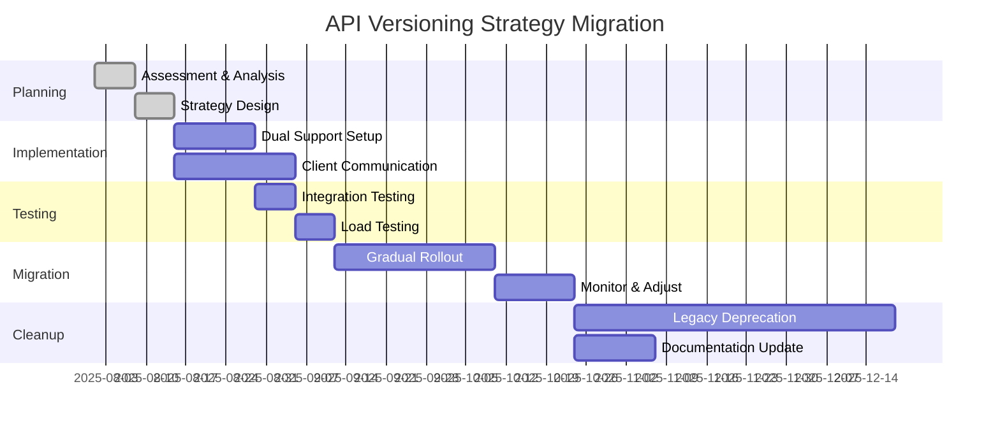

# Migration Strategy - API Versioning Implementation

## 🎯 Overview

This guide provides comprehensive strategies for migrating to API versioning systems, whether implementing versioning for the first time or transitioning between versioning approaches. It includes practical timelines, risk mitigation strategies, and automated tools for different scenarios.

## 🚀 Migration Scenarios

### Scenario 1: Implementing Versioning for First Time

**Common Situation**: Existing API without version management needs structured versioning approach.

#### Phase 1: Assessment and Planning (Week 1-2)

```bash
# API Analysis Script
#!/bin/bash

echo "=== API Endpoint Analysis ==="
echo "Analyzing existing API structure..."

# Count endpoints
echo "Total endpoints:" $(grep -r "app\.\(get\|post\|put\|delete\)" . | wc -l)

# Identify response formats
echo "Response format analysis:"
grep -r "res\.json\|res\.send" . | head -5

# Check for breaking changes potential
echo "Potential breaking changes:"
grep -r "TODO\|FIXME\|deprecated" . | wc -l

# Dependencies that might affect versioning
echo "Dependencies analysis:"
npm list --depth=0 | grep -E "(express|fastify|koa)"
```

**Assessment Checklist:**
```markdown
API Analysis:
- [ ] Document all existing endpoints
- [ ] Identify response formats and schemas
- [ ] Catalog client integrations
- [ ] Assess breaking change potential
- [ ] Review authentication/authorization patterns

Technical Preparation:
- [ ] Backup current API codebase
- [ ] Set up version control branching strategy  
- [ ] Prepare testing environment
- [ ] Document current API behavior
- [ ] Identify critical integration points
```

#### Phase 2: Architecture Setup (Week 3-4)

```javascript
// migration/setupVersioning.js
const express = require('express');
const semver = require('semver');

class VersioningMigrationTool {
  constructor(app) {
    this.app = app;
    this.supportedVersions = ['1.0.0']; // Start with current as v1.0.0
    this.defaultVersion = '1.0.0';
  }
  
  // Wrap existing routes with version handling
  addVersioningToExistingRoutes() {
    // Store original routes
    const originalRoutes = this.extractExistingRoutes();
    
    // Add version middleware
    this.app.use(this.createVersionMiddleware());
    
    // Re-register routes with version handling
    originalRoutes.forEach(route => {
      this.wrapRouteWithVersioning(route);
    });
  }
  
  extractExistingRoutes() {
    // Extract routes from Express app
    const routes = [];
    this.app._router.stack.forEach(layer => {
      if (layer.route) {
        routes.push({
          method: Object.keys(layer.route.methods)[0],
          path: layer.route.path,
          handler: layer.route.stack[0].handle
        });
      }
    });
    return routes;
  }
  
  createVersionMiddleware() {
    return (req, res, next) => {
      // Extract version from various sources
      let version = this.extractVersion(req);
      
      // Validate and default
      if (!version || !this.isVersionSupported(version)) {
        version = this.defaultVersion;
      }
      
      req.apiVersion = version;
      res.set('API-Version', version);
      
      next();
    };
  }
  
  extractVersion(req) {
    // Multiple extraction strategies
    return req.headers['accept-version'] ||
           req.headers['api-version'] ||
           req.query.version ||
           this.parseContentNegotiation(req.headers.accept) ||
           this.parseUriVersion(req.path);
  }
  
  parseContentNegotiation(acceptHeader) {
    if (!acceptHeader) return null;
    const match = acceptHeader.match(/version=(\d+\.\d+\.\d+)/);
    return match ? match[1] : null;
  }
  
  parseUriVersion(path) {
    const match = path.match(/^\/api\/v(\d+(?:\.\d+)?)/);
    if (match) {
      // Convert short version to full semver
      const shortVersion = match[1];
      return shortVersion.includes('.') ? shortVersion + '.0' : shortVersion + '.0.0';
    }
    return null;
  }
  
  isVersionSupported(version) {
    return this.supportedVersions.some(supportedVersion => 
      semver.satisfies(version, supportedVersion)
    );
  }
  
  wrapRouteWithVersioning(route) {
    this.app[route.method](route.path, (req, res, next) => {
      // Add version context to route handler
      const versionedHandler = this.createVersionedHandler(route.handler, route.path);
      versionedHandler(req, res, next);
    });
  }
  
  createVersionedHandler(originalHandler, path) {
    return async (req, res, next) => {
      try {
        // Store original json method
        const originalJson = res.json.bind(res);
        
        // Override json method to add version metadata
        res.json = (data) => {
          const versionedResponse = this.addVersionMetadata(data, req.apiVersion, path);
          return originalJson(versionedResponse);
        };
        
        // Call original handler
        await originalHandler(req, res, next);
      } catch (error) {
        this.handleVersionedError(error, req, res, next);
      }
    };
  }
  
  addVersionMetadata(data, version, endpoint) {
    // Decide whether to wrap response based on version
    if (semver.gte(version, '2.0.0')) {
      return {
        data: data,
        meta: {
          api_version: version,
          endpoint: endpoint,
          timestamp: new Date().toISOString()
        }
      };
    }
    
    // Return original format for v1.x
    return data;
  }
  
  handleVersionedError(error, req, res, next) {
    const version = req.apiVersion;
    
    if (semver.gte(version, '2.0.0')) {
      res.status(error.status || 500).json({
        error: {
          code: error.code || 'INTERNAL_ERROR',
          message: error.message,
          api_version: version
        }
      });
    } else {
      res.status(error.status || 500).json({
        error: error.message
      });
    }
  }
}

// Usage
const migrationTool = new VersioningMigrationTool(app);
migrationTool.addVersioningToExistingRoutes();

module.exports = VersioningMigrationTool;
```

#### Phase 3: Gradual Implementation (Week 5-8)

```javascript
// migration/gradualMigration.js
class GradualMigrationManager {
  constructor() {
    this.migrationStatus = new Map();
    this.featureFlags = new Map();
  }
  
  // Enable versioning for specific endpoints gradually
  enableVersioningForEndpoint(endpoint, options = {}) {
    const config = {
      enabled: true,
      rolloutPercentage: options.rollout || 100,
      supportedVersions: options.versions || ['1.0.0'],
      migrationDate: new Date(),
      ...options
    };
    
    this.migrationStatus.set(endpoint, config);
    
    // Log migration step
    console.log(`Versioning enabled for ${endpoint}:`, config);
  }
  
  // Middleware to handle gradual rollout
  createGradualRolloutMiddleware() {
    return (req, res, next) => {
      const endpoint = req.path;
      const config = this.migrationStatus.get(endpoint);
      
      if (!config || !config.enabled) {
        // Skip versioning for non-migrated endpoints
        return next();
      }
      
      // Check rollout percentage
      if (Math.random() * 100 > config.rolloutPercentage) {
        // Skip versioning for this request
        req.skipVersioning = true;
        return next();
      }
      
      // Apply versioning
      req.versioningEnabled = true;
      next();
    };
  }
  
  // Generate migration report
  generateMigrationReport() {
    const report = {
      timestamp: new Date().toISOString(),
      totalEndpoints: this.migrationStatus.size,
      migratedEndpoints: 0,
      rolloutStatus: {},
      upcomingMigrations: []
    };
    
    for (const [endpoint, config] of this.migrationStatus) {
      if (config.enabled) {
        report.migratedEndpoints++;
      }
      
      report.rolloutStatus[endpoint] = {
        enabled: config.enabled,
        rollout: config.rolloutPercentage,
        migrationDate: config.migrationDate
      };
    }
    
    return report;
  }
}

// Usage example
const migrationManager = new GradualMigrationManager();

// Migrate endpoints gradually
migrationManager.enableVersioningForEndpoint('/api/users', {
  rollout: 50, // 50% of traffic
  versions: ['1.0.0', '2.0.0']
});

migrationManager.enableVersioningForEndpoint('/api/posts', {
  rollout: 25, // 25% of traffic
  versions: ['1.0.0']
});

app.use(migrationManager.createGradualRolloutMiddleware());
```

### Scenario 2: Migrating Between Versioning Strategies

**Common Situation**: Moving from URI versioning to header versioning for better flexibility.

#### Migration Timeline: URI → Header Versioning



#### Implementation: Dual Support Strategy

```javascript
// migration/dualVersioningSupport.js
class DualVersioningSupport {
  constructor(options = {}) {
    this.legacyStrategy = options.from || 'uri';
    this.newStrategy = options.to || 'header';
    this.migrationPhase = options.phase || 'preparation';
    this.rolloutPercentage = options.rollout || 0;
  }
  
  createDualSupportMiddleware() {
    return (req, res, next) => {
      let version = null;
      let strategy = null;
      
      // Try new strategy first
      if (this.newStrategy === 'header') {
        version = this.extractHeaderVersion(req);
        if (version) strategy = 'header';
      }
      
      // Fallback to legacy strategy
      if (!version && this.legacyStrategy === 'uri') {
        version = this.extractUriVersion(req);
        if (version) strategy = 'uri';
      }
      
      // Default version
      version = version || '1.0';
      strategy = strategy || this.legacyStrategy;
      
      // Apply rollout logic for new strategy
      if (strategy === this.newStrategy && this.shouldUseNewStrategy()) {
        req.versionStrategy = this.newStrategy;
      } else {
        req.versionStrategy = this.legacyStrategy;
        // Rewrite request for legacy handling if needed
        if (this.legacyStrategy === 'uri' && strategy !== 'uri') {
          req.url = `/api/v${version.split('.')[0]}${req.path}`;
        }
      }
      
      req.apiVersion = version;
      
      // Add migration tracking headers
      res.set({
        'API-Version': version,
        'Version-Strategy': req.versionStrategy,
        'Migration-Phase': this.migrationPhase
      });
      
      // Log strategy usage for analytics
      this.logStrategyUsage(req, strategy);
      
      next();
    };
  }
  
  extractHeaderVersion(req) {
    return req.headers['accept-version'] || 
           req.headers['api-version'] ||
           req.headers['x-api-version'];
  }
  
  extractUriVersion(req) {
    const match = req.path.match(/^\/api\/v(\d+)/);
    return match ? `${match[1]}.0` : null;
  }
  
  shouldUseNewStrategy() {
    return Math.random() * 100 < this.rolloutPercentage;
  }
  
  logStrategyUsage(req, strategy) {
    // Analytics logging
    console.log(`Version Strategy Usage: ${strategy} for ${req.path}`);
    
    // Could integrate with analytics service
    // analytics.track('version_strategy_usage', {
    //   strategy,
    //   endpoint: req.path,
    //   version: req.apiVersion,
    //   timestamp: new Date()
    // });
  }
  
  // Method to update rollout percentage during migration
  updateRolloutPercentage(percentage) {
    this.rolloutPercentage = Math.max(0, Math.min(100, percentage));
    console.log(`Migration rollout updated to ${this.rolloutPercentage}%`);
  }
  
  // Migration phase management
  setMigrationPhase(phase) {
    const validPhases = ['preparation', 'dual-support', 'migration', 'cleanup'];
    if (validPhases.includes(phase)) {
      this.migrationPhase = phase;
      console.log(`Migration phase set to: ${phase}`);
    }
  }
}

// Usage during migration
const dualSupport = new DualVersioningSupport({
  from: 'uri',
  to: 'header',
  phase: 'dual-support',
  rollout: 25 // Start with 25% traffic
});

app.use(dualSupport.createDualSupportMiddleware());

// Gradually increase rollout over time
setTimeout(() => dualSupport.updateRolloutPercentage(50), 7 * 24 * 60 * 60 * 1000); // 1 week
setTimeout(() => dualSupport.updateRolloutPercentage(75), 14 * 24 * 60 * 60 * 1000); // 2 weeks
setTimeout(() => dualSupport.updateRolloutPercentage(100), 21 * 24 * 60 * 60 * 1000); // 3 weeks
```

### Scenario 3: Version Deprecation and Sunset

**Common Situation**: Removing support for older API versions while maintaining service continuity.

#### Deprecation Timeline Management

```javascript
// migration/deprecationManager.js
class DeprecationManager {
  constructor() {
    this.deprecationSchedule = new Map();
    this.warningThresholds = [180, 90, 30, 7]; // Days before sunset
  }
  
  scheduleDeprecation(version, sunsetDate, successorVersion) {
    const deprecationInfo = {
      version,
      sunsetDate: new Date(sunsetDate),
      successorVersion,
      announcementDate: new Date(),
      warningsSent: new Set(),
      usageTracking: {
        dailyRequests: [],
        uniqueClients: new Set(),
        lastRequestTime: null
      }
    };
    
    this.deprecationSchedule.set(version, deprecationInfo);
    
    console.log(`Deprecation scheduled for version ${version}, sunset: ${sunsetDate}`);
    return deprecationInfo;
  }
  
  createDeprecationMiddleware() {
    return (req, res, next) => {
      const version = req.apiVersion;
      const deprecationInfo = this.deprecationSchedule.get(version);
      
      if (deprecationInfo) {
        this.handleDeprecatedVersion(req, res, deprecationInfo);
      }
      
      next();
    };
  }
  
  handleDeprecatedVersion(req, res, deprecationInfo) {
    const { version, sunsetDate, successorVersion } = deprecationInfo;
    const daysUntilSunset = Math.ceil((sunsetDate - new Date()) / (1000 * 60 * 60 * 24));
    
    // Update usage tracking
    this.updateUsageTracking(deprecationInfo, req);
    
    // Set deprecation headers
    res.set({
      'Sunset': sunsetDate.toUTCString(),
      'Deprecation': 'true',
      'Link': `</api/${successorVersion}>; rel="successor-version"`,
      'Warning': `299 - "API version ${version} is deprecated. Sunset on ${sunsetDate.toISOString()}. Please migrate to version ${successorVersion}."`
    });
    
    // Send progressive warnings
    this.sendProgressiveWarnings(deprecationInfo, daysUntilSunset);
    
    // Block requests if past sunset date
    if (daysUntilSunset <= 0) {
      res.status(410).json({
        error: {
          code: 'VERSION_SUNSET',
          message: `API version ${version} has been sunset. Please use version ${successorVersion}.`,
          sunset_date: sunsetDate.toISOString(),
          successor_version: successorVersion,
          migration_guide: `/docs/migration/${version}-to-${successorVersion}`
        }
      });
      return;
    }
    
    // Add urgency indicators for final warning period
    if (daysUntilSunset <= 7) {
      res.set('X-Deprecation-Warning', `URGENT: ${daysUntilSunset} days until sunset`);
    }
  }
  
  updateUsageTracking(deprecationInfo, req) {
    const today = new Date().toDateString();
    const clientId = this.generateClientId(req);
    
    // Track daily requests
    const todayUsage = deprecationInfo.usageTracking.dailyRequests.find(d => d.date === today);
    if (todayUsage) {
      todayUsage.requests++;
    } else {
      deprecationInfo.usageTracking.dailyRequests.push({
        date: today,
        requests: 1
      });
    }
    
    // Track unique clients
    deprecationInfo.usageTracking.uniqueClients.add(clientId);
    deprecationInfo.usageTracking.lastRequestTime = new Date();
    
    // Clean old usage data (keep 30 days)
    deprecationInfo.usageTracking.dailyRequests = 
      deprecationInfo.usageTracking.dailyRequests.slice(-30);
  }
  
  generateClientId(req) {
    // Generate unique client identifier
    const userAgent = req.get('User-Agent') || 'unknown';
    const authorization = req.get('Authorization') || 'anonymous';
    const ip = req.ip || 'unknown';
    
    return require('crypto')
      .createHash('sha256')
      .update(`${userAgent}:${authorization}:${ip}`)
      .digest('hex')
      .substring(0, 16);
  }
  
  sendProgressiveWarnings(deprecationInfo, daysUntilSunset) {
    const { version, warningsSent } = deprecationInfo;
    
    for (const threshold of this.warningThresholds) {
      if (daysUntilSunset <= threshold && !warningsSent.has(threshold)) {
        this.sendDeprecationNotification(version, threshold, daysUntilSunset);
        warningsSent.add(threshold);
      }
    }
  }
  
  sendDeprecationNotification(version, threshold, actualDays) {
    // This would integrate with your notification system
    console.log(`DEPRECATION WARNING: Version ${version} sunset in ${actualDays} days (${threshold} day threshold reached)`);
    
    // Example integrations:
    // - Email notifications to registered developers
    // - Webhook notifications
    // - Dashboard alerts
    // - Slack/Teams notifications
  }
  
  generateDeprecationReport() {
    const report = {
      timestamp: new Date().toISOString(),
      versions: {}
    };
    
    for (const [version, info] of this.deprecationSchedule) {
      const daysUntilSunset = Math.ceil((info.sunsetDate - new Date()) / (1000 * 60 * 60 * 24));
      const recentUsage = info.usageTracking.dailyRequests.slice(-7)
        .reduce((sum, day) => sum + day.requests, 0);
      
      report.versions[version] = {
        sunset_date: info.sunsetDate.toISOString(),
        days_until_sunset: daysUntilSunset,
        successor_version: info.successorVersion,
        unique_clients: info.usageTracking.uniqueClients.size,
        recent_usage: recentUsage,
        last_request: info.usageTracking.lastRequestTime,
        warnings_sent: Array.from(info.warningsSent),
        status: daysUntilSunset <= 0 ? 'sunset' : 
                daysUntilSunset <= 30 ? 'critical' : 
                daysUntilSunset <= 90 ? 'warning' : 'announced'
      };
    }
    
    return report;
  }
}

// Usage example
const deprecationManager = new DeprecationManager();

// Schedule deprecation for version 1.0
deprecationManager.scheduleDeprecation(
  '1.0',
  '2026-01-31T23:59:59Z',
  '2.0'
);

app.use(deprecationManager.createDeprecationMiddleware());

// Generate weekly deprecation reports
setInterval(() => {
  const report = deprecationManager.generateDeprecationReport();
  console.log('Deprecation Report:', JSON.stringify(report, null, 2));
}, 7 * 24 * 60 * 60 * 1000); // Weekly
```

## 🔧 Automated Migration Tools

### Database Schema Migration

```javascript
// tools/schemaMigration.js
class SchemaMigrationTool {
  constructor(db) {
    this.db = db;
    this.migrationHistory = [];
  }
  
  async createVersionedViews() {
    // Create database views for different API versions
    const migrations = [
      {
        version: '1.0',
        description: 'Create v1 user view with simplified structure',
        up: `
          CREATE VIEW users_v1 AS
          SELECT 
            id,
            CONCAT(first_name, ' ', last_name) as name,
            email,
            created_at
          FROM users;
        `,
        down: 'DROP VIEW IF EXISTS users_v1;'
      },
      {
        version: '2.0',
        description: 'Create v2 user view with enhanced structure',
        up: `
          CREATE VIEW users_v2 AS
          SELECT 
            id,
            first_name,
            last_name,
            email,
            avatar_url,
            bio,
            created_at,
            updated_at
          FROM users;
        `,
        down: 'DROP VIEW IF EXISTS users_v2;'
      }
    ];
    
    for (const migration of migrations) {
      try {
        await this.db.query(migration.up);
        this.migrationHistory.push({
          ...migration,
          executed_at: new Date(),
          status: 'success'
        });
        console.log(`✅ Migration ${migration.version}: ${migration.description}`);
      } catch (error) {
        this.migrationHistory.push({
          ...migration,
          executed_at: new Date(),
          status: 'failed',
          error: error.message
        });
        console.error(`❌ Migration ${migration.version} failed:`, error.message);
      }
    }
  }
  
  async rollbackMigration(version) {
    const migration = this.migrationHistory
      .reverse()
      .find(m => m.version === version && m.status === 'success');
    
    if (!migration) {
      throw new Error(`No successful migration found for version ${version}`);
    }
    
    try {
      await this.db.query(migration.down);
      console.log(`✅ Rolled back migration ${version}`);
    } catch (error) {
      console.error(`❌ Rollback failed for ${version}:`, error.message);
      throw error;
    }
  }
}
```

### Client Code Generation

```javascript
// tools/clientCodeGenerator.js
class ClientCodeGenerator {
  constructor(apiSpec) {
    this.apiSpec = apiSpec;
  }
  
  generateTypeScriptClient(version) {
    const versionSpec = this.apiSpec.versions[version];
    
    let clientCode = `
// Generated TypeScript client for API version ${version}
// Generated on: ${new Date().toISOString()}

export interface ApiClientConfig {
  baseUrl: string;
  version: '${version}';
  headers?: Record<string, string>;
}

export class ApiClient {
  private config: ApiClientConfig;
  
  constructor(config: ApiClientConfig) {
    this.config = config;
  }
  
  private async request<T>(
    method: string,
    endpoint: string,
    data?: any
  ): Promise<T> {
    const url = \`\${this.config.baseUrl}\${endpoint}\`;
    const headers = {
      'Content-Type': 'application/json',
      'Accept-Version': this.config.version,
      ...this.config.headers
    };
    
    const response = await fetch(url, {
      method,
      headers,
      body: data ? JSON.stringify(data) : undefined
    });
    
    if (!response.ok) {
      throw new Error(\`API Error: \${response.status}\`);
    }
    
    return response.json();
  }
`;
    
    // Generate methods for each endpoint
    for (const [path, methods] of Object.entries(versionSpec.paths)) {
      for (const [method, spec] of Object.entries(methods)) {
        const methodName = this.generateMethodName(method, path);
        const paramTypes = this.generateParameterTypes(spec.parameters);
        const responseType = this.generateResponseType(spec.responses);
        
        clientCode += `
  async ${methodName}(${paramTypes}): Promise<${responseType}> {
    return this.request<${responseType}>('${method.toUpperCase()}', '${path}', data);
  }
`;
      }
    }
    
    clientCode += '}\n';
    
    return clientCode;
  }
  
  generateMethodName(method, path) {
    // Convert /api/users/{id} to getUserById
    const cleanPath = path.replace(/\/api\//, '').replace(/\{.*?\}/g, 'ById');
    const pathParts = cleanPath.split('/').filter(Boolean);
    
    return method.toLowerCase() + pathParts.map(part => 
      part.charAt(0).toUpperCase() + part.slice(1)
    ).join('');
  }
  
  generateParameterTypes(parameters = []) {
    if (parameters.length === 0) return '';
    
    const params = parameters.map(param => 
      `${param.name}${param.required ? '' : '?'}: ${this.mapType(param.type)}`
    );
    
    return `{ ${params.join(', ')} }`;
  }
  
  generateResponseType(responses) {
    const successResponse = responses['200'] || responses['201'];
    if (!successResponse) return 'any';
    
    // Simplified type mapping - in reality would need more sophisticated handling
    return 'any'; // Would generate proper TypeScript interfaces
  }
  
  mapType(schemaType) {
    const typeMap = {
      'string': 'string',
      'integer': 'number',
      'boolean': 'boolean',
      'array': 'any[]',
      'object': 'any'
    };
    
    return typeMap[schemaType] || 'any';
  }
}
```

### Migration Testing Suite

```javascript
// tools/migrationTester.js
class MigrationTester {
  constructor(apiUrl, versions) {
    this.apiUrl = apiUrl;
    this.versions = versions;
    this.testResults = new Map();
  }
  
  async runCompatibilityTests() {
    console.log('🧪 Running API version compatibility tests...');
    
    for (const version of this.versions) {
      console.log(`\n📋 Testing version ${version}...`);
      
      const testSuite = [
        this.testBasicConnectivity,
        this.testResponseFormat,
        this.testErrorHandling,
        this.testAuthentication,
        this.testBackwardCompatibility
      ];
      
      const results = [];
      
      for (const test of testSuite) {
        try {
          const result = await test.call(this, version);
          results.push({ test: test.name, status: 'passed', ...result });
          console.log(`  ✅ ${test.name}`);
        } catch (error) {
          results.push({ 
            test: test.name, 
            status: 'failed', 
            error: error.message 
          });
          console.log(`  ❌ ${test.name}: ${error.message}`);
        }
      }
      
      this.testResults.set(version, results);
    }
    
    return this.generateTestReport();
  }
  
  async testBasicConnectivity(version) {
    const response = await fetch(`${this.apiUrl}/health`, {
      headers: { 'Accept-Version': version }
    });
    
    if (!response.ok) {
      throw new Error(`Connectivity failed: ${response.status}`);
    }
    
    return { responseTime: Date.now() - startTime };
  }
  
  async testResponseFormat(version) {
    const response = await fetch(`${this.apiUrl}/users`, {
      headers: { 'Accept-Version': version }
    });
    
    const data = await response.json();
    
    // Version-specific format validation
    if (version.startsWith('1.')) {
      if (!Array.isArray(data)) {
        throw new Error('V1 should return array format');
      }
    } else if (version.startsWith('2.')) {
      if (!data.data || !data.meta) {
        throw new Error('V2 should return {data, meta} format');
      }
    }
    
    return { formatValid: true };
  }
  
  async testErrorHandling(version) {
    const response = await fetch(`${this.apiUrl}/users/nonexistent`, {
      headers: { 'Accept-Version': version }
    });
    
    if (response.status !== 404) {
      throw new Error(`Expected 404, got ${response.status}`);
    }
    
    const errorData = await response.json();
    
    // Version-specific error format validation
    if (version.startsWith('1.')) {
      if (typeof errorData.error !== 'string') {
        throw new Error('V1 errors should be simple strings');
      }
    } else if (version.startsWith('2.')) {
      if (!errorData.error || !errorData.error.code) {
        throw new Error('V2 errors should have structured format');
      }
    }
    
    return { errorFormatValid: true };
  }
  
  async testAuthentication(version) {
    // Test with invalid auth
    const response = await fetch(`${this.apiUrl}/protected`, {
      headers: { 'Accept-Version': version }
    });
    
    if (response.status !== 401) {
      throw new Error(`Expected 401, got ${response.status}`);
    }
    
    return { authenticationWorking: true };
  }
  
  async testBackwardCompatibility(version) {
    // This would test that older versions still work
    // when newer versions are deployed
    
    const endpoints = ['/users', '/health', '/version'];
    const results = [];
    
    for (const endpoint of endpoints) {
      const response = await fetch(`${this.apiUrl}${endpoint}`, {
        headers: { 'Accept-Version': version }
      });
      
      results.push({
        endpoint,
        status: response.status,
        working: response.ok
      });
    }
    
    const failedEndpoints = results.filter(r => !r.working);
    if (failedEndpoints.length > 0) {
      throw new Error(`Endpoints failed: ${failedEndpoints.map(e => e.endpoint).join(', ')}`);
    }
    
    return { compatibilityCheck: 'passed', testedEndpoints: endpoints.length };
  }
  
  generateTestReport() {
    const report = {
      timestamp: new Date().toISOString(),
      totalVersions: this.versions.length,
      summary: {
        passed: 0,
        failed: 0,
        partiallyPassed: 0
      },
      versions: {}
    };
    
    for (const [version, results] of this.testResults) {
      const passed = results.filter(r => r.status === 'passed').length;
      const total = results.length;
      
      report.versions[version] = {
        testsRun: total,
        testsPassed: passed,
        testsFailed: total - passed,
        successRate: Math.round((passed / total) * 100),
        details: results
      };
      
      if (passed === total) {
        report.summary.passed++;
      } else if (passed > 0) {
        report.summary.partiallyPassed++;
      } else {
        report.summary.failed++;
      }
    }
    
    return report;
  }
}

// Usage
const tester = new MigrationTester('https://api.example.com', ['1.0', '1.1', '2.0']);
tester.runCompatibilityTests()
  .then(report => {
    console.log('\n📊 Migration Test Report:');
    console.log(JSON.stringify(report, null, 2));
  })
  .catch(error => {
    console.error('Migration testing failed:', error);
  });
```

## 📅 Timeline Templates

### Small Team Migration (1-3 developers)

```
Week 1: Planning & Assessment
- [ ] API analysis and documentation
- [ ] Version strategy selection
- [ ] Basic implementation setup

Week 2-3: Implementation  
- [ ] Version middleware development
- [ ] Response format handling
- [ ] Basic testing setup

Week 4: Testing & Deployment
- [ ] Integration testing
- [ ] Staging deployment
- [ ] Production rollout

Week 5-6: Monitoring & Refinement
- [ ] Usage monitoring
- [ ] Bug fixes and optimizations
- [ ] Documentation updates
```

### Enterprise Migration (10+ developers)

```
Month 1: Planning & Architecture
Week 1-2: Assessment and strategy
Week 3-4: Detailed design and planning

Month 2: Core Implementation
Week 1-2: Infrastructure and middleware
Week 3-4: Endpoint migration and testing

Month 3: Integration & Testing
Week 1-2: Integration testing and QA
Week 3-4: Performance testing and security review

Month 4: Deployment & Migration
Week 1-2: Staged rollout (25%, 50%)
Week 3-4: Full rollout and monitoring

Month 5-6: Optimization & Deprecation
Week 1-4: Performance optimization
Week 5-8: Legacy version deprecation planning
```

## 🚨 Risk Mitigation

### Common Migration Risks

| Risk | Probability | Impact | Mitigation Strategy |
|------|-------------|--------|-------------------|
| **Client Breaking Changes** | High | High | Dual support + gradual rollout |
| **Performance Degradation** | Medium | High | Load testing + caching strategy |
| **Version Confusion** | Medium | Medium | Clear documentation + support |
| **Data Inconsistency** | Low | High | Database versioning + validation |
| **Security Vulnerabilities** | Low | High | Security review + version-specific controls |

### Rollback Procedures

```javascript
// tools/rollbackManager.js
class RollbackManager {
  constructor() {
    this.rollbackTriggers = [
      { metric: 'error_rate', threshold: 5 }, // 5% error rate
      { metric: 'response_time', threshold: 1000 }, // 1 second
      { metric: 'version_adoption', threshold: 10 } // 10% adoption after 1 week
    ];
  }
  
  async executeRollback(version, reason) {
    console.log(`🚨 Initiating rollback for version ${version}: ${reason}`);
    
    // 1. Disable new version
    await this.disableVersion(version);
    
    // 2. Route traffic to stable version
    await this.routeTrafficToStableVersion();
    
    // 3. Notify stakeholders
    await this.sendRollbackNotification(version, reason);
    
    // 4. Update monitoring
    await this.updateMonitoringAlerts();
    
    console.log(`✅ Rollback completed for version ${version}`);
  }
  
  async disableVersion(version) {
    // Implementation would depend on your infrastructure
    // Could involve feature flags, load balancer config, etc.
  }
  
  async routeTrafficToStableVersion() {
    // Route all traffic to the last known stable version
  }
  
  async sendRollbackNotification(version, reason) {
    // Send notifications to development team, stakeholders
    // Integration with Slack, email, PagerDuty, etc.
  }
  
  async updateMonitoringAlerts() {
    // Update monitoring dashboards and alerts
  }
}
```

---

## 🧭 Navigation

← [Comparison Analysis](./comparison-analysis.md) | **[Backward Compatibility Patterns](./backward-compatibility-patterns.md)** →

---

*Migration Strategy | API Versioning Strategies Research | July 2025*