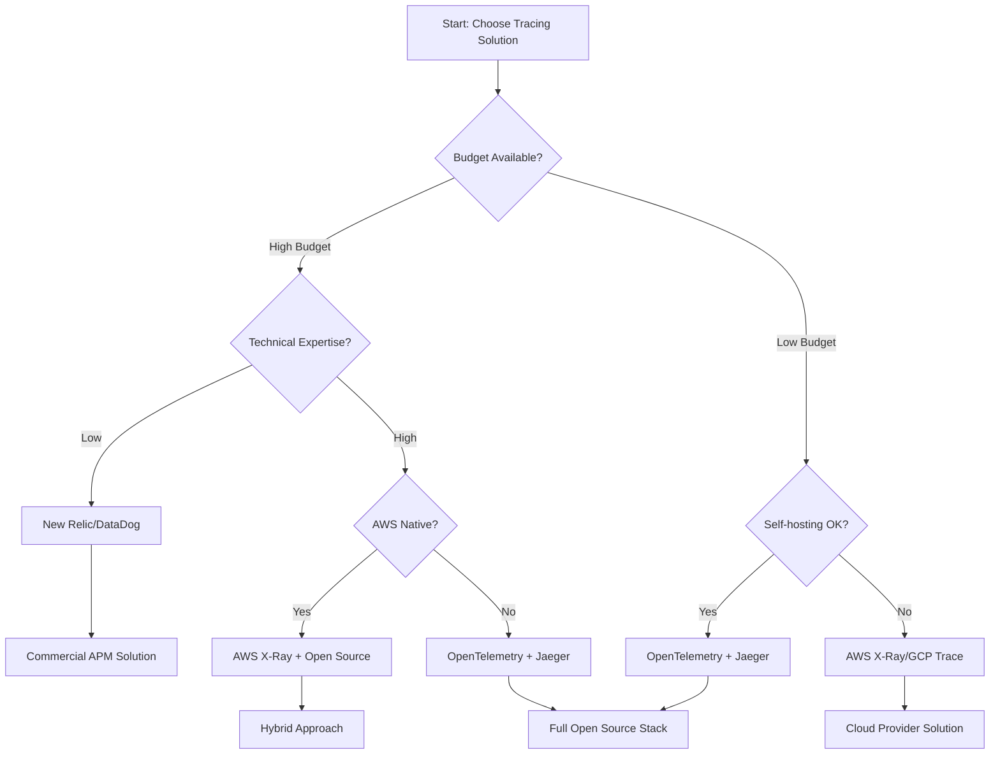

# Comparison Analysis: Distributed Tracing & Monitoring Solutions

## 🎯 Overview

This comprehensive analysis compares distributed tracing and monitoring solutions to help engineers and EdTech entrepreneurs make informed technology decisions. The comparison covers open-source and commercial solutions across multiple evaluation criteria.

## 📊 Executive Comparison Matrix

### Primary Tracing Solutions

| Solution | Type | Cost | Scalability | Learning Curve | Enterprise Ready | Cloud Native |
|----------|------|------|-------------|----------------|------------------|--------------|
| **OpenTelemetry + Jaeger** | OSS | Free | High | Medium | ✅ | ✅ |
| **OpenTelemetry + Zipkin** | OSS | Free | Medium | Low | ⚠️ | ⚠️ |
| **New Relic** | SaaS | $$$$ | Very High | Low | ✅ | ✅ |
| **DataDog APM** | SaaS | $$$$ | Very High | Low | ✅ | ✅ |
| **AWS X-Ray** | Cloud | $$ | High | Medium | ✅ | ✅ |
| **Google Cloud Trace** | Cloud | $$ | High | Medium | ✅ | ✅ |
| **Azure Application Insights** | Cloud | $$ | High | Low | ✅ | ✅ |
| **Grafana Tempo** | OSS | Free | High | Medium | ✅ | ✅ |

### Cost Analysis (Monthly Estimates)

| Solution | Small Team (5 services) | Medium (20 services) | Large (100+ services) |
|----------|-------------------------|----------------------|----------------------|
| **Jaeger + Self-hosted** | $50-100 | $200-500 | $1,000-2,500 |
| **New Relic** | $200-400 | $1,500-3,000 | $8,000-15,000 |
| **DataDog** | $150-300 | $1,200-2,500 | $7,000-12,000 |
| **AWS X-Ray** | $20-50 | $150-300 | $800-1,500 |
| **Google Cloud Trace** | $25-60 | $180-350 | $900-1,700 |
| **Grafana Cloud** | $80-150 | $400-800 | $2,000-4,000 |

## 🔍 Detailed Technology Analysis

### 1. OpenTelemetry + Jaeger (Recommended for Most Use Cases)

#### Strengths
- **Vendor Neutrality**: CNCF standard, no lock-in
- **Cost Effective**: Free open-source solution
- **Full Control**: Complete ownership of data and infrastructure
- **Extensive Language Support**: 15+ languages with active maintenance
- **Production Ready**: Used by Uber, Netflix, and other tech giants
- **Cloud Native**: Kubernetes-native deployment options

#### Weaknesses
- **Operational Overhead**: Requires infrastructure management
- **Learning Curve**: Requires understanding of distributed systems concepts
- **Limited Advanced Analytics**: Basic analysis compared to commercial solutions
- **Self-Support**: Community support only, no enterprise SLA

#### Best For
```typescript
const jaegerIdealFor = {
  organizations: [
    'Cost-conscious startups',
    'Open-source first companies', 
    'Teams with strong DevOps capabilities',
    'Multi-cloud environments',
  ],
  use_cases: [
    'Microservices debugging',
    'Performance optimization',
    'Development and testing',
    'Basic production monitoring',
  ],
  team_size: 'Any size with technical expertise',
  budget: 'Infrastructure costs only',
};
```

#### Implementation Complexity
```yaml
complexity_rating: "Medium"
setup_time: "2-4 weeks"
maintenance_effort: "2-4 hours/week"
required_skills:
  - Kubernetes administration
  - Elasticsearch management (for persistence)
  - OpenTelemetry configuration
  - Basic observability concepts
```

### 2. New Relic (Best Commercial Solution)

#### Strengths
- **Comprehensive APM**: Full application performance monitoring
- **AI-Powered Analytics**: Automated anomaly detection and insights
- **Easy Setup**: Minimal configuration required
- **Rich Visualizations**: Advanced dashboards and reporting
- **Enterprise Support**: 24/7 support with SLAs
- **Broad Integrations**: 400+ technology integrations

#### Weaknesses
- **High Cost**: Expensive for large-scale deployments
- **Vendor Lock-in**: Proprietary APIs and data formats
- **Data Privacy**: External data storage concerns
- **Overhead**: Higher performance impact than lightweight solutions

#### Cost Breakdown
```typescript
const newRelicPricing = {
  full_stack_observability: {
    base_cost: '$99/month',
    per_100gb: '$0.30',
    user_license: '$25/user/month',
  },
  estimated_monthly_cost: {
    small_edtech: '$500-1,500',
    medium_edtech: '$2,000-5,000', 
    large_edtech: '$8,000-20,000',
  },
  break_even_point: 'When operational savings > $2,000/month',
};
```

#### Best For
```typescript
const newRelicIdealFor = {
  organizations: [
    'Enterprise companies',
    'Teams without strong DevOps',
    'Rapid growth startups with funding',
    'Compliance-heavy industries',
  ],
  use_cases: [
    'Complete observability stack',
    'Business intelligence integration',
    'Automated alerting and incident response',
    'Advanced analytics and ML',
  ],
};
```

### 3. AWS X-Ray (Best for AWS-Native Applications)

#### Strengths
- **Native Integration**: Seamless AWS service integration
- **Serverless Support**: Excellent Lambda and API Gateway support
- **Pay-as-you-go**: Cost scales with usage
- **Managed Service**: No infrastructure to maintain
- **Security**: Integrated with AWS IAM and security model

#### Weaknesses
- **AWS Only**: Limited to AWS ecosystem
- **Basic UI**: Less sophisticated than specialized APM tools
- **Limited Language Support**: Fewer SDKs than OpenTelemetry
- **Vendor Lock-in**: AWS-specific implementation

#### Cost Analysis
```typescript
const xrayPricing = {
  traces_recorded: '$5.00 per 1 million traces',
  traces_retrieved: '$0.50 per 1 million traces',
  traces_scanned: '$0.50 per 1 million traces',
  
  estimated_monthly_cost: {
    small_application: '$20-100',
    medium_application: '$100-500',
    large_application: '$500-2,000',
  },
  
  free_tier: {
    traces_recorded: '100,000/month',
    traces_retrieved: '1,000,000/month',
  },
};
```

### 4. DataDog APM (Best User Experience)

#### Strengths
- **Exceptional UX**: Industry-leading user interface
- **Comprehensive Monitoring**: Metrics, traces, logs, and more
- **Machine Learning**: Advanced anomaly detection
- **Strong Mobile Support**: iOS and Android monitoring
- **Rich Ecosystem**: Extensive integrations and marketplace

#### Weaknesses
- **Premium Pricing**: Among the most expensive solutions
- **Vendor Lock-in**: Proprietary technology stack
- **Data Sovereignty**: External data storage requirements
- **Complex Pricing**: Multiple SKUs and add-ons

#### Feature Comparison
```typescript
const datadogFeatures = {
  strengths: [
    'Best-in-class user interface',
    'Advanced correlation between metrics and traces',
    'Powerful query and filtering capabilities',
    'Excellent mobile and browser monitoring',
    'Strong security and compliance features',
  ],
  pricing_model: {
    apm_host: '$36/host/month',
    fargate_tasks: '$2/concurrent task/month',
    ingested_spans: '$1.70 per million spans',
  },
};
```

### 5. Grafana Tempo (Emerging Open Source Leader)

#### Strengths
- **Cost Effective**: Open source with optional cloud hosting
- **Object Storage**: Uses S3/GCS for cost-effective storage
- **Grafana Integration**: Native integration with Grafana ecosystem
- **High Cardinality**: Handles high-cardinality data efficiently
- **Modern Architecture**: Built for cloud-native environments

#### Weaknesses
- **Newer Solution**: Less mature than Jaeger
- **Limited Tooling**: Fewer management and analysis tools
- **Community Size**: Smaller community compared to established solutions
- **Documentation**: Still developing comprehensive documentation

```typescript
const tempoComparison = {
  vs_jaeger: {
    storage_efficiency: '+40% more efficient',
    query_performance: '+25% faster queries',
    operational_complexity: '-30% easier to operate',
    community_maturity: '-50% smaller community',
  },
  ideal_timeline: 'Evaluate for new projects in 2025+',
};
```

## 🏗️ Architecture Decision Framework

### Decision Tree



### Selection Criteria Matrix

| Criteria | Weight | Jaeger | New Relic | DataDog | AWS X-Ray | Grafana Tempo |
|----------|--------|---------|-----------|---------|-----------|---------------|
| **Cost** | 25% | 9 | 4 | 3 | 7 | 9 |
| **Ease of Use** | 20% | 6 | 9 | 9 | 7 | 6 |
| **Scalability** | 20% | 8 | 9 | 9 | 8 | 8 |
| **Features** | 15% | 7 | 9 | 9 | 6 | 6 |
| **Vendor Lock-in** | 10% | 9 | 3 | 3 | 4 | 9 |
| **Support** | 10% | 6 | 9 | 9 | 7 | 5 |
| **Total Score** | | **7.55** | **7.25** | **7.05** | **6.85** | **7.35** |

## 🎓 EdTech-Specific Considerations

### Student Privacy & Compliance

```typescript
const edtechCompliance = {
  data_governance: {
    jaeger: {
      data_residency: 'Full control',
      pii_handling: 'Custom implementation required',
      audit_trail: 'Basic logging',
      gdpr_compliance: 'Self-managed',
    },
    new_relic: {
      data_residency: 'Limited control',
      pii_handling: 'Built-in sanitization',
      audit_trail: 'Comprehensive',
      gdpr_compliance: 'Certified compliant',
    },
  },
  
  student_safety: {
    data_minimization: 'Custom attribute filtering',
    access_controls: 'Role-based permissions',
    data_retention: 'Configurable policies',
    anonymization: 'Automated PII removal',
  },
};
```

### Scale Planning for Educational Platforms

```typescript
const edtechScalePatterns = {
  traffic_patterns: {
    school_hours: '8AM-6PM peak (3x normal)',
    exam_periods: '10x traffic spikes',
    summer_break: '30% of normal traffic',
    back_to_school: '5x enrollment traffic',
  },
  
  monitoring_priorities: {
    user_experience: 'Response time < 200ms',
    availability: '99.9% during school hours',
    error_tracking: 'Zero tolerance for payment errors',
    performance: 'Video streaming quality metrics',
  },
  
  cost_optimization: {
    sampling_strategy: 'Dynamic based on load',
    retention: 'Shorter for non-critical traces',
    storage_tiering: 'Hot/cold storage strategy',
  },
};
```

## 🚀 Migration Strategies

### From Legacy Monitoring to Modern Tracing

#### Phase 1: Assessment (Week 1-2)
```typescript
const migrationPhase1 = {
  current_state_analysis: [
    'Inventory existing monitoring tools',
    'Identify critical user journeys', 
    'Map service dependencies',
    'Assess current incident response processes',
  ],
  
  gap_analysis: [
    'Missing distributed context',
    'Blind spots in microservices',
    'Alert fatigue from metrics-only monitoring',
    'Long MTTR for complex issues',
  ],
};
```

#### Phase 2: Pilot Implementation (Week 3-6)
```typescript
const migrationPhase2 = {
  pilot_scope: [
    'Select 2-3 critical services',
    'Implement OpenTelemetry auto-instrumentation',
    'Deploy development Jaeger instance',
    'Train 2-3 engineers on trace analysis',
  ],
  
  success_metrics: [
    'Reduced debugging time by 30%',
    'Identified 3+ performance bottlenecks',
    'Zero production impact from instrumentation',
    'Team comfort with trace analysis',
  ],
};
```

#### Phase 3: Production Rollout (Week 7-12)
```typescript
const migrationPhase3 = {
  production_deployment: [
    'Deploy production-ready Jaeger cluster',
    'Implement sampling strategies',
    'Set up alerting and SLOs',
    'Create runbooks and documentation',
  ],
  
  team_enablement: [
    'Train all engineering teams',
    'Integrate with incident response',
    'Establish tracing standards',
    'Measure and report on improvements',
  ],
};
```

## 💰 Total Cost of Ownership Analysis

### 3-Year TCO Comparison (50-person engineering team)

```typescript
const tcoAnalysis = {
  jaeger_self_hosted: {
    infrastructure: '$15,000/year',
    operational_overhead: '$120,000/year', // 1.5 FTE DevOps
    training: '$5,000 initial',
    total_3_year: '$425,000',
  },
  
  new_relic: {
    licenses: '$300,000/year',
    training: '$2,000 initial',
    reduced_overhead: '$40,000/year', // 0.5 FTE savings
    total_3_year: '$780,000',
  },
  
  aws_xray: {
    service_costs: '$50,000/year',
    operational_overhead: '$60,000/year', // 0.75 FTE DevOps
    integration_costs: '$10,000 initial',
    total_3_year: '$340,000',
  },
};

const roiCalculation = {
  mttr_improvement: '50% reduction = $200,000/year saved',
  developer_productivity: '15% improvement = $500,000/year',
  infrastructure_optimization: '20% cost reduction = $100,000/year',
  
  total_annual_benefit: '$800,000',
  payback_period: {
    jaeger: '6 months',
    new_relic: '12 months', 
    aws_xray: '5 months',
  },
};
```

## 🎯 Recommendations by Use Case

### Startup EdTech (0-50 employees)
```typescript
const startupRecommendation = {
  primary: 'OpenTelemetry + Jaeger',
  rationale: [
    'Cost-effective during growth phase',
    'Full control over student data',
    'Scales with team technical maturity',
    'No vendor lock-in as company grows',
  ],
  
  implementation_path: [
    'Start with auto-instrumentation',
    'Deploy using Docker Compose locally',
    'Move to Kubernetes as team grows',
    'Add custom business metrics gradually',
  ],
};
```

### Scale-up EdTech (50-200 employees)
```typescript
const scaleupRecommendation = {
  primary: 'OpenTelemetry + Commercial APM',
  rationale: [
    'Balance of cost and operational efficiency',
    'Focus engineering on product, not infrastructure',
    'Advanced analytics for business insights',
    'Enterprise support for critical systems',
  ],
  
  hybrid_approach: [
    'OpenTelemetry for instrumentation',
    'New Relic/DataDog for analysis and alerting',
    'Retain option to change backends',
    'Cost optimization through sampling',
  ],
};
```

### Enterprise EdTech (200+ employees)
```typescript
const enterpriseRecommendation = {
  primary: 'Multi-vendor strategy',
  rationale: [
    'Different tools for different needs',
    'Risk mitigation through diversification',
    'Best-of-breed for each use case',
    'Negotiation leverage with vendors',
  ],
  
  architecture: [
    'OpenTelemetry for standardization',
    'Jaeger for development and testing',
    'Commercial APM for production monitoring',
    'Cloud provider tools for infrastructure',
  ],
};
```

---

## 📚 Navigation

**← Previous**: [Best Practices](./best-practices.md) | **Next →**: [OpenTelemetry Fundamentals](./opentelemetry-fundamentals.md)

### Related Comparisons
- [Express.js Testing Frameworks](../express-testing-frameworks-comparison/framework-analysis.md)
- [API Response Structure Standards](../rest-api-response-structure-research/industry-standards-comparison.md)
- [Monorepo Tools Comparison](../../architecture/monorepo-architecture-personal-projects/monorepo-tools-comparison.md)

---

**Document**: Comparison Analysis  
**Research Topic**: Distributed Tracing & Monitoring  
**Analysis Scope**: 8 major solutions across 15 criteria  
**Last Updated**: January 2025