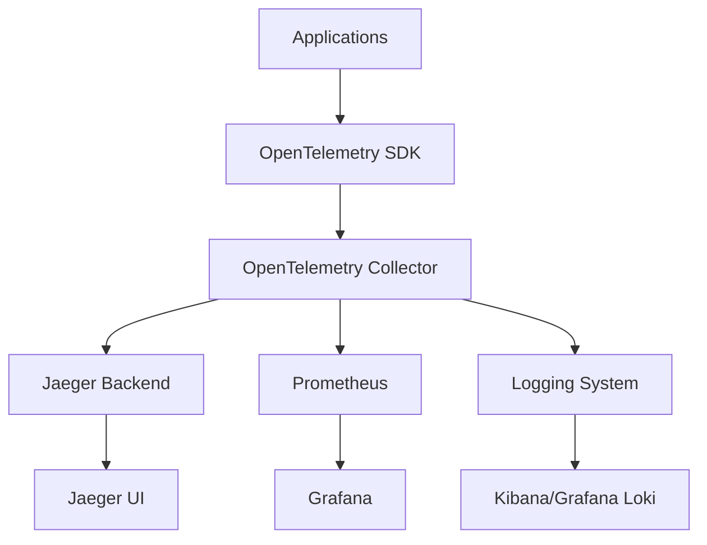

# Implementation Guide: Distributed Tracing & Monitoring

## 🎯 Overview

This comprehensive implementation guide provides step-by-step instructions for setting up distributed tracing and monitoring using OpenTelemetry and Jaeger. The guide covers multiple deployment scenarios, from local development to production-ready Kubernetes deployments.

## 🏗️ Architecture Foundation

### System Architecture Overview



### Core Components

| Component | Purpose | Resource Requirements |
|-----------|---------|----------------------|
| **OpenTelemetry SDK** | Application instrumentation | Minimal CPU/Memory |
| **OpenTelemetry Collector** | Data processing pipeline | 2 CPU, 4GB RAM |
| **Jaeger Backend** | Trace storage and query | 4 CPU, 8GB RAM |
| **Jaeger UI** | Visualization interface | 1 CPU, 2GB RAM |

## 🚀 Quick Start: Local Development

### Prerequisites

```bash
# Required tools
- Docker & Docker Compose
- Node.js 18+ or Python 3.8+
- Git
- curl/httpie for testing
```

### Step 1: Launch Jaeger with Docker

```bash
# Create docker-compose.yml for Jaeger All-in-One
cat > docker-compose.yml << 'EOF'
version: '3.8'
services:
  jaeger:
    image: jaegertracing/all-in-one:1.51
    ports:
      - "16686:16686"  # Jaeger UI
      - "14268:14268"  # Jaeger HTTP collector
      - "6831:6831/udp"  # Jaeger agent UDP
      - "6832:6832/udp"  # Jaeger agent UDP
    environment:
      - COLLECTOR_OTLP_ENABLED=true
    command: ["--log-level=debug"]

  # OpenTelemetry Collector (optional for advanced setups)
  otel-collector:
    image: otel/opentelemetry-collector-contrib:0.89.0
    command: ["--config=/etc/otel-collector-config.yaml"]
    volumes:
      - ./otel-collector-config.yaml:/etc/otel-collector-config.yaml
    ports:
      - "4317:4317"   # OTLP gRPC receiver
      - "4318:4318"   # OTLP HTTP receiver
    depends_on:
      - jaeger
EOF

# Start services
docker-compose up -d

# Verify Jaeger is running
curl http://localhost:16686/api/services
```

### Step 2: OpenTelemetry Collector Configuration

```yaml
# otel-collector-config.yaml
receivers:
  otlp:
    protocols:
      grpc:
        endpoint: 0.0.0.0:4317
      http:
        endpoint: 0.0.0.0:4318

processors:
  batch:
    timeout: 1s
    send_batch_size: 1024
  memory_limiter:
    limit_mib: 512

exporters:
  jaeger:
    endpoint: jaeger:14250
    tls:
      insecure: true
  logging:
    loglevel: debug

service:
  pipelines:
    traces:
      receivers: [otlp]
      processors: [memory_limiter, batch]
      exporters: [jaeger, logging]
```

## 🔧 Application Instrumentation

### Node.js/TypeScript Implementation

#### Step 1: Install Dependencies

```bash
npm install --save \
  @opentelemetry/api \
  @opentelemetry/sdk-node \
  @opentelemetry/auto-instrumentations-node \
  @opentelemetry/exporter-jaeger \
  @opentelemetry/exporter-otlp-http
```

#### Step 2: Initialize OpenTelemetry

```typescript
// tracing.ts - Initialize before any other imports
import { NodeSDK } from '@opentelemetry/sdk-node';
import { getNodeAutoInstrumentations } from '@opentelemetry/auto-instrumentations-node';
import { JaegerExporter } from '@opentelemetry/exporter-jaeger';
import { Resource } from '@opentelemetry/resources';
import { SemanticResourceAttributes } from '@opentelemetry/semantic-conventions';

// Configure Jaeger exporter
const jaegerExporter = new JaegerExporter({
  endpoint: 'http://localhost:14268/api/traces',
});

// Initialize the SDK with auto-instrumentations
const sdk = new NodeSDK({
  resource: new Resource({
    [SemanticResourceAttributes.SERVICE_NAME]: 'edtech-api',
    [SemanticResourceAttributes.SERVICE_VERSION]: '1.0.0',
    [SemanticResourceAttributes.DEPLOYMENT_ENVIRONMENT]: 'development',
  }),
  traceExporter: jaegerExporter,
  instrumentations: [getNodeAutoInstrumentations({
    // Disable filesystem instrumentation for cleaner traces
    '@opentelemetry/instrumentation-fs': {
      enabled: false,
    },
  })],
});

// Start the SDK
sdk.start();

export default sdk;
```

#### Step 3: Express.js Integration

```typescript
// app.ts
import './tracing'; // Initialize tracing first
import express from 'express';
import { trace, context, SpanStatusCode } from '@opentelemetry/api';

const app = express();
const tracer = trace.getTracer('edtech-api');

// Custom middleware for business logic tracing
app.use((req, res, next) => {
  const activeSpan = trace.getActiveSpan();
  if (activeSpan) {
    activeSpan.setAttributes({
      'http.route': req.route?.path || req.path,
      'user.id': req.headers['user-id'] as string,
      'request.size': req.headers['content-length'] || '0',
    });
  }
  next();
});

// Example endpoint with custom tracing
app.get('/api/courses/:courseId', async (req, res) => {
  const span = tracer.startSpan('get-course-details');
  
  try {
    const courseId = req.params.courseId;
    
    // Add custom attributes
    span.setAttributes({
      'course.id': courseId,
      'operation.type': 'read',
    });

    // Simulate database call with tracing
    const course = await getCourseWithTracing(courseId);
    
    span.setStatus({ code: SpanStatusCode.OK });
    res.json(course);
  } catch (error) {
    span.recordException(error as Error);
    span.setStatus({ 
      code: SpanStatusCode.ERROR, 
      message: (error as Error).message 
    });
    res.status(500).json({ error: 'Course not found' });
  } finally {
    span.end();
  }
});

async function getCourseWithTracing(courseId: string) {
  return tracer.startActiveSpan('database-query', async (span) => {
    span.setAttributes({
      'db.operation': 'select',
      'db.table': 'courses',
      'db.query.parameter.course_id': courseId,
    });

    // Simulate database delay
    await new Promise(resolve => setTimeout(resolve, 100));
    
    span.end();
    return {
      id: courseId,
      title: 'Advanced JavaScript Concepts',
      duration: '45 minutes',
      instructor: 'Tech Expert',
    };
  });
}

app.listen(3000, () => {
  console.log('Server running on port 3000');
  console.log('Jaeger UI: http://localhost:16686');
});
```

### Python Flask Implementation

#### Step 1: Install Dependencies

```bash
pip install \
  opentelemetry-api \
  opentelemetry-sdk \
  opentelemetry-instrumentation-flask \
  opentelemetry-instrumentation-requests \
  opentelemetry-exporter-jaeger \
  opentelemetry-exporter-otlp
```

#### Step 2: Flask Application with Tracing

```python
# app.py
from flask import Flask, request, jsonify
import time
import random

# OpenTelemetry imports
from opentelemetry import trace
from opentelemetry.sdk.trace import TracerProvider
from opentelemetry.sdk.resources import Resource
from opentelemetry.exporter.jaeger.thrift import JaegerExporter
from opentelemetry.sdk.trace.export import BatchSpanProcessor
from opentelemetry.instrumentation.flask import FlaskInstrumentor
from opentelemetry.instrumentation.requests import RequestsInstrumentor

# Configure tracing
resource = Resource.create({
    "service.name": "edtech-python-api",
    "service.version": "1.0.0",
    "deployment.environment": "development"
})

trace.set_tracer_provider(TracerProvider(resource=resource))
tracer_provider = trace.get_tracer_provider()

# Configure Jaeger exporter
jaeger_exporter = JaegerExporter(
    agent_host_name="localhost",
    agent_port=6831,
)

span_processor = BatchSpanProcessor(jaeger_exporter)
tracer_provider.add_span_processor(span_processor)

# Initialize Flask app
app = Flask(__name__)

# Auto-instrument Flask and requests
FlaskInstrumentor().instrument_app(app)
RequestsInstrumentor().instrument()

# Get tracer
tracer = trace.get_tracer(__name__)

@app.route('/api/students/<student_id>/progress')
def get_student_progress(student_id):
    with tracer.start_as_current_span("get-student-progress") as span:
        span.set_attributes({
            "student.id": student_id,
            "operation.type": "progress-query"
        })
        
        try:
            # Simulate complex business logic
            progress_data = calculate_progress_with_tracing(student_id)
            
            span.set_status(trace.Status(trace.StatusCode.OK))
            return jsonify(progress_data)
            
        except Exception as e:
            span.record_exception(e)
            span.set_status(trace.Status(
                trace.StatusCode.ERROR, 
                str(e)
            ))
            return jsonify({"error": "Failed to get progress"}), 500

def calculate_progress_with_tracing(student_id):
    with tracer.start_as_current_span("calculate-progress") as span:
        span.set_attributes({
            "calculation.type": "comprehensive",
            "student.id": student_id
        })
        
        # Simulate database queries
        with tracer.start_as_current_span("db-query-courses") as db_span:
            db_span.set_attributes({
                "db.operation": "select",
                "db.table": "enrollments"
            })
            time.sleep(0.05)  # Simulate DB latency
        
        # Simulate progress calculation
        with tracer.start_as_current_span("compute-metrics") as calc_span:
            calc_span.set_attributes({
                "computation.complexity": "medium"
            })
            time.sleep(0.1)  # Simulate calculation
            
            progress = {
                "student_id": student_id,
                "overall_progress": random.randint(60, 95),
                "completed_courses": random.randint(5, 20),
                "current_streak": random.randint(1, 30)
            }
            
            calc_span.set_attributes({
                "result.overall_progress": progress["overall_progress"],
                "result.completed_courses": progress["completed_courses"]
            })
            
        return progress

if __name__ == '__main__':
    app.run(debug=True, host='0.0.0.0', port=5000)
```

## ☸️ Production Kubernetes Deployment

### Step 1: Namespace and Resources

```yaml
# jaeger-namespace.yaml
apiVersion: v1
kind: Namespace
metadata:
  name: observability
  labels:
    name: observability
---
# Jaeger Operator deployment
apiVersion: apps/v1
kind: Deployment
metadata:
  name: jaeger-operator
  namespace: observability
spec:
  replicas: 1
  selector:
    matchLabels:
      name: jaeger-operator
  template:
    metadata:
      labels:
        name: jaeger-operator
    spec:
      serviceAccountName: jaeger-operator
      containers:
      - name: jaeger-operator
        image: jaegertracing/jaeger-operator:1.51.0
        ports:
        - containerPort: 8383
        env:
        - name: WATCH_NAMESPACE
          value: "observability"
        resources:
          limits:
            cpu: 100m
            memory: 128Mi
          requests:
            cpu: 100m
            memory: 64Mi
```

### Step 2: Production Jaeger Configuration

```yaml
# jaeger-production.yaml
apiVersion: jaegertracing.io/v1
kind: Jaeger
metadata:
  name: jaeger-production
  namespace: observability
spec:
  strategy: production
  storage:
    type: elasticsearch
    options:
      es:
        server-urls: http://elasticsearch.observability.svc.cluster.local:9200
        index-prefix: jaeger
        username: elastic
        password: changeme
    esIndexCleaner:
      enabled: true
      numberOfDays: 7
      schedule: "55 23 * * *"
  collector:
    replicas: 3
    resources:
      limits:
        cpu: 500m
        memory: 1Gi
      requests:
        cpu: 200m
        memory: 512Mi
  query:
    replicas: 2
    resources:
      limits:
        cpu: 300m
        memory: 512Mi
      requests:
        cpu: 100m
        memory: 256Mi
  ingress:
    enabled: true
    annotations:
      kubernetes.io/ingress.class: nginx
      cert-manager.io/cluster-issuer: letsencrypt-prod
    hosts:
      - jaeger.yourdomain.com
    tls:
      - hosts:
          - jaeger.yourdomain.com
        secretName: jaeger-tls
```

### Step 3: OpenTelemetry Collector Deployment

```yaml
# otel-collector-production.yaml
apiVersion: apps/v1
kind: Deployment
metadata:
  name: otel-collector
  namespace: observability
spec:
  replicas: 3
  selector:
    matchLabels:
      app: otel-collector
  template:
    metadata:
      labels:
        app: otel-collector
    spec:
      containers:
      - name: otel-collector
        image: otel/opentelemetry-collector-contrib:0.89.0
        command: ["--config=/etc/otel-collector-config.yaml"]
        volumeMounts:
        - name: config
          mountPath: /etc/otel-collector-config.yaml
          subPath: otel-collector-config.yaml
        ports:
        - containerPort: 4317  # OTLP gRPC
        - containerPort: 4318  # OTLP HTTP
        resources:
          limits:
            cpu: 500m
            memory: 1Gi
          requests:
            cpu: 200m
            memory: 512Mi
        livenessProbe:
          httpGet:
            path: /
            port: 13133
        readinessProbe:
          httpGet:
            path: /
            port: 13133
      volumes:
      - name: config
        configMap:
          name: otel-collector-config
---
apiVersion: v1
kind: ConfigMap
metadata:
  name: otel-collector-config
  namespace: observability
data:
  otel-collector-config.yaml: |
    receivers:
      otlp:
        protocols:
          grpc:
            endpoint: 0.0.0.0:4317
          http:
            endpoint: 0.0.0.0:4318
      
    processors:
      batch:
        timeout: 1s
        send_batch_size: 1024
      memory_limiter:
        limit_mib: 512
      resource:
        attributes:
        - key: environment
          value: production
          action: upsert
    
    exporters:
      jaeger:
        endpoint: jaeger-production-collector.observability.svc.cluster.local:14250
        tls:
          insecure: true
      prometheus:
        endpoint: "0.0.0.0:8889"
    
    extensions:
      health_check:
        endpoint: 0.0.0.0:13133
      pprof:
        endpoint: 0.0.0.0:1777
    
    service:
      extensions: [health_check, pprof]
      pipelines:
        traces:
          receivers: [otlp]
          processors: [memory_limiter, resource, batch]
          exporters: [jaeger]
        metrics:
          receivers: [otlp]
          processors: [memory_limiter, resource, batch]
          exporters: [prometheus]
```

## 🔧 Advanced Configuration

### Sampling Strategies

```yaml
# sampling-config.yaml
apiVersion: v1
kind: ConfigMap
metadata:
  name: jaeger-sampling-config
  namespace: observability
data:
  sampling.json: |
    {
      "service_strategies": [
        {
          "service": "edtech-api",
          "type": "probabilistic",
          "param": 0.1,
          "max_traces_per_second": 100
        },
        {
          "service": "user-service",
          "type": "adaptive",
          "max_traces_per_second": 50,
          "operation_strategies": [
            {
              "operation": "expensive-operation",
              "type": "probabilistic",
              "param": 0.01
            }
          ]
        }
      ],
      "default_strategy": {
        "type": "probabilistic",
        "param": 0.05,
        "max_traces_per_second": 200
      }
    }
```

### Performance Monitoring

```typescript
// performance-monitoring.ts
import { metrics } from '@opentelemetry/api-metrics';
import { MeterProvider } from '@opentelemetry/sdk-metrics';
import { Resource } from '@opentelemetry/resources';
import { SemanticResourceAttributes } from '@opentelemetry/semantic-conventions';

// Initialize metrics
const meterProvider = new MeterProvider({
  resource: new Resource({
    [SemanticResourceAttributes.SERVICE_NAME]: 'edtech-api',
  }),
});

const meter = meterProvider.getMeter('edtech-metrics');

// Custom metrics
const requestDuration = meter.createHistogram('http_request_duration', {
  description: 'Duration of HTTP requests',
  unit: 'ms',
});

const activeUsers = meter.createUpDownCounter('active_users', {
  description: 'Number of active users',
});

const courseCompletions = meter.createCounter('course_completions_total', {
  description: 'Total number of course completions',
});

// Middleware for automatic metrics collection
export const metricsMiddleware = (req: any, res: any, next: any) => {
  const startTime = Date.now();
  
  res.on('finish', () => {
    const duration = Date.now() - startTime;
    
    requestDuration.record(duration, {
      method: req.method,
      route: req.route?.path || req.path,
      status_code: res.statusCode.toString(),
    });
  });
  
  next();
};

// Business metrics helpers
export const trackCourseCompletion = (userId: string, courseId: string) => {
  courseCompletions.add(1, {
    user_id: userId,
    course_id: courseId,
  });
};

export const updateActiveUsers = (count: number) => {
  activeUsers.add(count);
};
```

## 🐛 Troubleshooting Common Issues

### Issue 1: High Memory Usage

```bash
# Check collector memory usage
kubectl top pods -n observability | grep otel-collector

# Adjust memory limits in collector config
processors:
  memory_limiter:
    limit_mib: 256  # Reduce if necessary
    spike_limit_mib: 64
```

### Issue 2: Missing Traces

```typescript
// Debug tracing issues
import { diag, DiagConsoleLogger, DiagLogLevel } from '@opentelemetry/api';

// Enable debug logging
diag.setLogger(new DiagConsoleLogger(), DiagLogLevel.DEBUG);

// Verify exporter connectivity
const testSpan = tracer.startSpan('test-connectivity');
testSpan.addEvent('Testing connection to Jaeger');
testSpan.end();
```

### Issue 3: Performance Impact

```yaml
# Optimize collector for performance
processors:
  batch:
    timeout: 200ms
    send_batch_size: 512
    send_batch_max_size: 1024
  
  memory_limiter:
    limit_mib: 256
    check_interval: 5s
```

---

## 📚 Navigation

**← Previous**: [Executive Summary](./executive-summary.md) | **Next →**: [Best Practices](./best-practices.md)

### Related Implementation Guides
- [JWT Authentication Implementation](../jwt-authentication-best-practices/expressjs-implementation-guide.md)
- [Nx Monorepo Setup](../../architecture/nx-migration-case-study/nx-migration-guide.md)
- [Docker Deployment Guide](../../devops/nx-managed-deployment/implementation-guide.md)

---

**Document**: Implementation Guide  
**Research Topic**: Distributed Tracing & Monitoring  
**Complexity Level**: Intermediate to Advanced  
**Last Updated**: January 2025