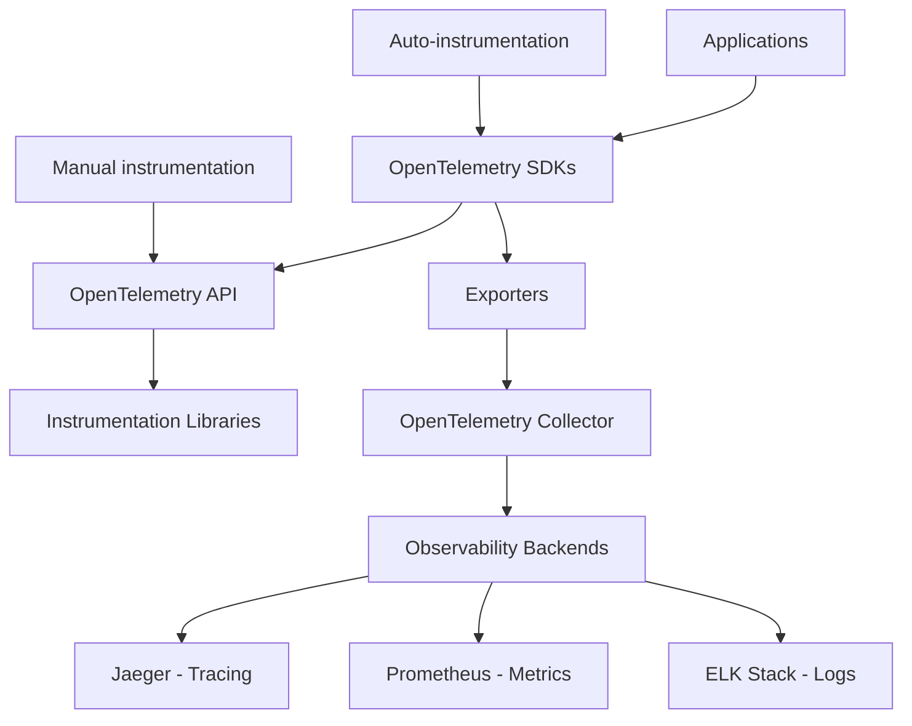

# OpenTelemetry Fundamentals

## 🎯 Overview

OpenTelemetry (OTel) is the industry-standard observability framework that provides APIs, libraries, agents, and instrumentation to enable the collection and management of telemetry data (traces, metrics, and logs) from applications and infrastructure. This document provides comprehensive coverage of OpenTelemetry fundamentals for backend engineers and EdTech entrepreneurs.

## 🏗️ Architecture & Core Concepts

### OpenTelemetry Ecosystem Overview



### Three Pillars of Observability

| Pillar | Purpose | OpenTelemetry Support | Implementation Status |
|--------|---------|----------------------|----------------------|
| **Traces** | Request flow tracking | ✅ Stable | Production Ready |
| **Metrics** | Quantitative measurements | ✅ Stable | Production Ready |
| **Logs** | Event records | 🚧 Beta | Preview/Testing |

## 📚 Core Components Deep Dive

### 1. OpenTelemetry API

The API provides the interface for creating telemetry data without being tied to a specific implementation.

```typescript
// Core API concepts
import { 
  trace, 
  metrics, 
  context, 
  propagation,
  SpanStatusCode,
  SpanKind 
} from '@opentelemetry/api';

// Get tracer instance
const tracer = trace.getTracer('edtech-course-service', '1.0.0');

// Basic span creation
const span = tracer.startSpan('process-enrollment', {
  kind: SpanKind.SERVER,
  attributes: {
    'student.id': 'student-123',
    'course.id': 'course-456',
    'operation.type': 'enrollment',
  },
});

// Span lifecycle management
try {
  // Business logic here
  const result = await processEnrollment();
  
  span.setAttributes({
    'enrollment.status': 'success',
    'enrollment.id': result.id,
  });
  
  span.setStatus({ code: SpanStatusCode.OK });
} catch (error) {
  span.recordException(error);
  span.setStatus({ 
    code: SpanStatusCode.ERROR, 
    message: error.message 
  });
  throw error;
} finally {
  span.end();
}
```

### 2. OpenTelemetry SDK

The SDK provides the implementation of the API with configuration options for resource detection, sampling, and export.

```typescript
// SDK initialization for Node.js
import { NodeSDK } from '@opentelemetry/sdk-node';
import { Resource } from '@opentelemetry/resources';
import { SemanticResourceAttributes } from '@opentelemetry/semantic-conventions';

const sdk = new NodeSDK({
  // Resource identification
  resource: new Resource({
    [SemanticResourceAttributes.SERVICE_NAME]: 'edtech-api',
    [SemanticResourceAttributes.SERVICE_VERSION]: '2.1.0',
    [SemanticResourceAttributes.DEPLOYMENT_ENVIRONMENT]: 'production',
    [SemanticResourceAttributes.SERVICE_NAMESPACE]: 'education',
    
    // Custom attributes
    'business.unit': 'platform',
    'team.responsible': 'backend-team',
    'cost.center': 'engineering',
  }),
  
  // Sampling configuration
  sampler: getSampler(),
  
  // Instrumentation
  instrumentations: [getInstrumentations()],
  
  // Exporters
  traceExporter: getTraceExporter(),
  metricReader: getMetricReader(),
});

// Start the SDK
sdk.start();

// Sampling strategies
function getSampler() {
  if (process.env.NODE_ENV === 'development') {
    return new TraceIdRatioBasedSampler(1.0); // 100% sampling
  }
  
  return new TraceIdRatioBasedSampler(0.01); // 1% sampling in production
}
```

### 3. Instrumentation Libraries

Automatic instrumentation for popular frameworks and libraries.

```typescript
// Auto-instrumentation configuration
import { getNodeAutoInstrumentations } from '@opentelemetry/auto-instrumentations-node';

function getInstrumentations() {
  return [getNodeAutoInstrumentations({
    // HTTP instrumentation
    '@opentelemetry/instrumentation-http': {
      enabled: true,
      requestHook: (span, request) => {
        span.setAttributes({
          'http.user_agent': request.headers['user-agent'],
          'http.client_ip': request.headers['x-forwarded-for'] || request.connection.remoteAddress,
        });
      },
      responseHook: (span, response) => {
        span.setAttributes({
          'http.response_size': response.headers['content-length'],
        });
      },
    },
    
    // Express.js instrumentation
    '@opentelemetry/instrumentation-express': {
      enabled: true,
      requestHook: (span, info) => {
        span.updateName(`${info.request.method} ${info.request.route?.path || info.request.url}`);
      },
    },
    
    // Database instrumentation
    '@opentelemetry/instrumentation-pg': {
      enabled: true,
      enhancedDatabaseReporting: true,
    },
    
    // Redis instrumentation
    '@opentelemetry/instrumentation-redis': {
      enabled: true,
      dbStatementSerializer: (cmdName, cmdArgs) => {
        return `${cmdName} ${cmdArgs.slice(0, 2).join(' ')}...`; // Limit argument logging
      },
    },
    
    // File system instrumentation (disabled for cleaner traces)
    '@opentelemetry/instrumentation-fs': {
      enabled: false,
    },
  })];
}
```

## 🔧 Advanced Instrumentation Patterns

### 1. Custom Span Creation

```typescript
// Business logic instrumentation
class StudentProgressService {
  private tracer = trace.getTracer('progress-service');
  
  async calculateProgress(studentId: string, courseId: string): Promise<Progress> {
    return this.tracer.startActiveSpan('calculate-student-progress', async (span) => {
      span.setAttributes({
        'student.id': studentId,
        'course.id': courseId,
        'operation.complexity': 'high',
      });
      
      try {
        // Multiple sub-operations with nested spans
        const enrollmentData = await this.getEnrollmentData(studentId, courseId);
        const completionData = await this.getCompletionData(studentId, courseId);
        const assessmentScores = await this.getAssessmentScores(studentId, courseId);
        
        // Calculate progress with timing
        const progress = await this.performCalculation(
          enrollmentData, 
          completionData, 
          assessmentScores
        );
        
        span.setAttributes({
          'progress.percentage': progress.percentage,
          'progress.lessons_completed': progress.lessonsCompleted,
          'progress.time_spent_minutes': progress.timeSpentMinutes,
        });
        
        span.addEvent('progress-calculated', {
          'calculation.duration_ms': performance.now(),
          'calculation.complexity_score': this.getComplexityScore(progress),
        });
        
        return progress;
      } catch (error) {
        span.recordException(error);
        span.setStatus({
          code: SpanStatusCode.ERROR,
          message: `Progress calculation failed: ${error.message}`,
        });
        throw error;
      }
    });
  }
  
  private async getEnrollmentData(studentId: string, courseId: string) {
    return this.tracer.startActiveSpan('db-query-enrollment', async (span) => {
      span.setAttributes({
        'db.operation': 'select',
        'db.table': 'enrollments',
        'db.query.parameters': `student_id=${studentId}, course_id=${courseId}`,
      });
      
      // Simulate database query
      const startTime = performance.now();
      const data = await this.database.getEnrollment(studentId, courseId);
      const duration = performance.now() - startTime;
      
      span.setAttributes({
        'db.query.duration_ms': duration,
        'db.query.result_count': 1,
      });
      
      return data;
    });
  }
}
```

### 2. Context Propagation

```typescript
// Manual context propagation
import { trace, context, propagation } from '@opentelemetry/api';

class MessageQueueService {
  async publishMessage(topic: string, message: any) {
    const span = trace.getActiveSpan();
    
    // Inject trace context into message headers
    const headers: Record<string, string> = {};
    propagation.inject(context.active(), headers);
    
    const messageWithContext = {
      ...message,
      headers,
      timestamp: Date.now(),
      traceId: span?.spanContext().traceId,
    };
    
    await this.messageQueue.publish(topic, messageWithContext);
  }
  
  async processMessage(message: any) {
    // Extract trace context from message
    const extractedContext = propagation.extract(context.active(), message.headers);
    
    // Continue the trace in the message handler
    context.with(extractedContext, () => {
      this.handleMessage(message);
    });
  }
  
  private handleMessage(message: any) {
    const tracer = trace.getTracer('message-processor');
    
    tracer.startActiveSpan('process-message', (span) => {
      span.setAttributes({
        'message.topic': message.topic,
        'message.type': message.type,
        'message.size_bytes': JSON.stringify(message).length,
      });
      
      // Process message with continued trace context
      this.businessLogic(message);
      
      span.end();
    });
  }
}
```

### 3. Custom Metrics Integration

```typescript
// Combining traces with metrics
import { metrics } from '@opentelemetry/api';

class CourseEngagementTracker {
  private tracer = trace.getTracer('engagement-tracker');
  private meter = metrics.getMeter('engagement-metrics');
  
  // Define metrics
  private videoPlayCounter = this.meter.createCounter('video_plays_total', {
    description: 'Total number of video plays',
  });
  
  private sessionDurationHistogram = this.meter.createHistogram('session_duration_seconds', {
    description: 'Duration of learning sessions',
    unit: 's',
  });
  
  private activeStudentsGauge = this.meter.createUpDownCounter('active_students', {
    description: 'Number of currently active students',
  });
  
  async trackVideoPlay(studentId: string, videoId: string) {
    return this.tracer.startActiveSpan('track-video-play', async (span) => {
      span.setAttributes({
        'student.id': studentId,
        'video.id': videoId,
        'engagement.type': 'video_play',
      });
      
      // Record metric
      this.videoPlayCounter.add(1, {
        'student.id': studentId,
        'video.id': videoId,
        'course.category': await this.getCourseCategory(videoId),
      });
      
      // Add trace event
      span.addEvent('video-play-started', {
        'video.duration_seconds': await this.getVideoDuration(videoId),
        'student.progress_percentage': await this.getStudentProgress(studentId),
      });
      
      // Record engagement in database with trace context
      await this.recordEngagement(studentId, videoId, 'video_play');
      
      span.end();
    });
  }
  
  async trackSessionEnd(studentId: string, sessionDuration: number) {
    // Update metrics
    this.sessionDurationHistogram.record(sessionDuration, {
      'student.id': studentId,
      'session.type': 'learning',
    });
    
    this.activeStudentsGauge.add(-1, {
      'session.ended': 'true',
    });
    
    // Create trace for session analytics
    this.tracer.startActiveSpan('session-analytics', (span) => {
      span.setAttributes({
        'student.id': studentId,
        'session.duration_seconds': sessionDuration,
        'session.engagement_score': this.calculateEngagementScore(sessionDuration),
      });
      
      span.addEvent('session-ended', {
        'analytics.processed': true,
      });
      
      span.end();
    });
  }
}
```

## 🛠️ OpenTelemetry Collector Configuration

### Basic Collector Configuration

```yaml
# otel-collector-config.yaml
receivers:
  # OTLP receiver for traces and metrics
  otlp:
    protocols:
      grpc:
        endpoint: 0.0.0.0:4317
      http:
        endpoint: 0.0.0.0:4318
        cors:
          allowed_origins:
            - http://localhost:3000
            - https://app.edtech.com
  
  # Prometheus metrics scraping
  prometheus:
    config:
      scrape_configs:
        - job_name: 'edtech-services'
          static_configs:
            - targets: ['course-service:8080', 'user-service:8080']
          scrape_interval: 30s
          metrics_path: /metrics

processors:
  # Memory limiter to prevent OOM
  memory_limiter:
    limit_mib: 512
    spike_limit_mib: 128
    check_interval: 5s
  
  # Batch processor for efficient export
  batch:
    timeout: 1s
    send_batch_size: 1024
    send_batch_max_size: 2048
  
  # Resource processor to add environment context
  resource:
    attributes:
      - key: environment
        value: production
        action: upsert
      - key: region
        value: us-east-1
        action: upsert
      - key: cluster
        value: edtech-main
        action: upsert
  
  # Attribute processor for data sanitization
  attributes:
    actions:
      # Remove PII from traces
      - key: user.email
        action: delete
      - key: user.phone
        action: delete
      # Normalize service names
      - key: service.name
        from_attribute: service.name
        action: update
        
  # Sampling processor
  probabilistic_sampler:
    sampling_percentage: 1.0 # 1% sampling

exporters:
  # Jaeger exporter
  jaeger:
    endpoint: jaeger-collector:14250
    tls:
      insecure: true
  
  # OTLP exporter (for other backends)
  otlp:
    endpoint: https://api.honeycomb.io:443
    headers:
      "x-honeycomb-team": "${HONEYCOMB_API_KEY}"
      "x-honeycomb-dataset": "edtech-traces"
  
  # Prometheus exporter
  prometheus:
    endpoint: "0.0.0.0:8889"
    namespace: edtech
    const_labels:
      environment: production
  
  # Logging exporter for debugging
  logging:
    loglevel: info

extensions:
  # Health check extension
  health_check:
    endpoint: 0.0.0.0:13133
  
  # Performance profiling
  pprof:
    endpoint: 0.0.0.0:1777
  
  # Memory ballast for stability
  memory_ballast:
    size_mib: 256

service:
  extensions: [health_check, pprof, memory_ballast]
  pipelines:
    # Trace pipeline
    traces:
      receivers: [otlp]
      processors: [memory_limiter, resource, attributes, batch]
      exporters: [jaeger, logging]
    
    # Metrics pipeline
    metrics:
      receivers: [otlp, prometheus]
      processors: [memory_limiter, resource, batch]
      exporters: [prometheus]
  
  # Telemetry configuration
  telemetry:
    logs:
      level: info
    metrics:
      address: 0.0.0.0:8888
      level: basic
```

### Advanced Collector Features

```yaml
# Advanced processing pipeline
processors:
  # Transform processor for data enrichment
  transform:
    trace_statements:
      - context: span
        statements:
          # Add business context
          - set(attributes["business.tier"], "premium") where attributes["user.subscription"] == "premium"
          - set(attributes["performance.tier"], "slow") where duration > 5000
          
          # Calculate derived metrics
          - set(attributes["request.size_category"], "large") where attributes["http.request.body.size"] > 1000000
          
  # Tail sampling processor
  tail_sampling:
    decision_wait: 10s
    num_traces: 50000
    expected_new_traces_per_sec: 10
    policies:
      # Always sample errors
      - name: error-sampling
        type: status_code
        status_code: {status_codes: [ERROR]}
      
      # Sample slow requests
      - name: latency-sampling
        type: latency
        latency: {threshold_ms: 1000}
      
      # Sample specific services
      - name: critical-service-sampling
        type: string_attribute
        string_attribute: {key: service.name, values: [payment-service, auth-service]}
      
      # Probabilistic sampling for everything else
      - name: probabilistic-sampling
        type: probabilistic
        probabilistic: {sampling_percentage: 0.5}

  # Span processor for custom logic
  span:
    name:
      # Normalize operation names
      to_attributes:
        rules:
          - ^GET /api/users/(?P<user_id>.*)$ 
          - ^POST /api/courses/(?P<course_id>.*)/enroll$
    
    # Add custom attributes based on existing ones
    include:
      match_type: regexp
      services: [".*-service"]
    exclude:
      match_type: strict
      span_names: ["health-check", "metrics"]
```

## 🔍 Observability Data Model

### Trace Structure

```typescript
// Understanding OpenTelemetry trace structure
interface Trace {
  traceId: string;           // Unique identifier for entire request
  spans: Span[];             // Collection of operations in the trace
}

interface Span {
  traceId: string;           // Links to parent trace
  spanId: string;            // Unique identifier for this operation
  parentSpanId?: string;     // Parent span relationship
  operationName: string;     // Human-readable operation name
  startTime: number;         // Start timestamp
  endTime: number;           // End timestamp
  duration: number;          // Calculated duration
  status: SpanStatus;        // OK, ERROR, or UNSET
  kind: SpanKind;           // CLIENT, SERVER, PRODUCER, CONSUMER, INTERNAL
  attributes: Attributes;    // Key-value metadata
  events: Event[];          // Timestamped log entries
  links: Link[];            // Links to other spans
}

// Example trace hierarchy for course enrollment
const enrollmentTrace = {
  traceId: "abc123def456",
  spans: [
    {
      spanId: "span-1",
      operationName: "POST /api/courses/123/enroll",
      kind: SpanKind.SERVER,
      attributes: {
        "http.method": "POST",
        "http.url": "/api/courses/123/enroll",
        "user.id": "student-456",
        "course.id": "123"
      },
      children: [
        {
          spanId: "span-2",
          parentSpanId: "span-1",
          operationName: "validate-enrollment-eligibility",
          kind: SpanKind.INTERNAL,
          attributes: {
            "validation.type": "eligibility",
            "course.prerequisites_met": true
          }
        },
        {
          spanId: "span-3",
          parentSpanId: "span-1", 
          operationName: "process-payment",
          kind: SpanKind.CLIENT,
          attributes: {
            "payment.provider": "stripe",
            "payment.amount": 99.99,
            "payment.currency": "USD"
          }
        }
      ]
    }
  ]
};
```

### Semantic Conventions

```typescript
// Standard attribute naming conventions
const SEMANTIC_CONVENTIONS = {
  // HTTP attributes
  http: {
    method: 'http.method',
    url: 'http.url', 
    status_code: 'http.status_code',
    user_agent: 'http.user_agent',
    request_size: 'http.request.body.size',
    response_size: 'http.response.body.size',
  },
  
  // Database attributes
  db: {
    system: 'db.system',          // postgresql, mysql, redis
    name: 'db.name',              // Database name
    operation: 'db.operation',    // select, insert, update
    table: 'db.sql.table',        // Table name
    statement: 'db.statement',    // SQL query (sanitized)
  },
  
  // Service attributes  
  service: {
    name: 'service.name',
    version: 'service.version',
    namespace: 'service.namespace',
    instance_id: 'service.instance.id',
  },
  
  // Custom EdTech attributes
  edtech: {
    student_id: 'edtech.student.id',
    course_id: 'edtech.course.id',
    lesson_id: 'edtech.lesson.id',
    subscription_tier: 'edtech.user.subscription',
    learning_path: 'edtech.learning.path',
    assessment_score: 'edtech.assessment.score',
  },
} as const;
```

## 🚀 Performance Optimization

### SDK Configuration Optimization

```typescript
// Optimized SDK configuration for production
import { NodeSDK } from '@opentelemetry/sdk-node';
import { BatchSpanProcessor } from '@opentelemetry/sdk-trace-base';
import { TraceIdRatioBasedSampler } from '@opentelemetry/sdk-trace-base';

const sdk = new NodeSDK({
  // Optimized span processor
  spanProcessor: new BatchSpanProcessor(
    getTraceExporter(),
    {
      // Batch configuration for performance
      maxExportBatchSize: 512,        // Reduce batch size for faster export
      exportTimeoutMillis: 2000,      // 2 second timeout
      scheduledDelayMillis: 1000,     // 1 second delay between exports
      maxQueueSize: 2048,             // Queue size limit
    }
  ),
  
  // Performance-optimized sampler
  sampler: new TraceIdRatioBasedSampler(0.01), // 1% sampling
  
  // Resource optimization
  resource: new Resource({
    [SemanticResourceAttributes.SERVICE_NAME]: process.env.SERVICE_NAME,
    [SemanticResourceAttributes.SERVICE_VERSION]: process.env.SERVICE_VERSION,
    // Minimize resource attributes for performance
  }),
});

// Memory usage monitoring
process.on('SIGUSR2', () => {
  const usage = process.memoryUsage();
  console.log('Memory usage:', {
    rss: `${Math.round(usage.rss / 1024 / 1024)} MB`,
    heapTotal: `${Math.round(usage.heapTotal / 1024 / 1024)} MB`,
    heapUsed: `${Math.round(usage.heapUsed / 1024 / 1024)} MB`,
    external: `${Math.round(usage.external / 1024 / 1024)} MB`,
  });
});
```

---

## 📚 Navigation

**← Previous**: [Comparison Analysis](./comparison-analysis.md) | **Next →**: [Jaeger Configuration Guide](./jaeger-configuration-guide.md)

### Related Fundamentals
- [Clean Architecture Fundamentals](../../architecture/clean-architecture-analysis/clean-architecture-mvvm-analysis-overview.md)
- [JWT Security Fundamentals](../jwt-authentication-best-practices/jwt-fundamentals-security.md)
- [Microservices Architecture Fundamentals](../../architecture/monorepo-architecture-personal-projects/microservices-organization.md)

---

**Document**: OpenTelemetry Fundamentals  
**Research Topic**: Distributed Tracing & Monitoring  
**Technical Depth**: Deep dive with code examples  
**Last Updated**: January 2025