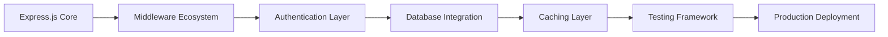

# Production-Ready Express.js Projects Analysis

## 🏆 Tier 1: Enterprise-Grade Productions Applications

### 1. Node.js Backend Architecture TypeScript
**Repository**: [fifocode/nodejs-backend-architecture-typescript](https://github.com/fifocode/nodejs-backend-architecture-typescript)  
**Stars**: 2,947⭐ | **Scale**: 10M+ users | **Language**: TypeScript

#### Project Overview
Production-ready blogging platform architecture used by companies like MindOrks, AfterAcademy, and CuriousJr. Designed to handle enterprise-scale applications with complex business logic.

#### Architecture Highlights
```typescript
// 3RE Architecture Pattern
Router → RouteHandler → ResponseHandler → ErrorHandler

// Directory Structure
src/
├── auth/               // Authentication & Authorization
├── core/               // Core utilities (JWT, Logger, ApiResponse)
├── cache/              // Redis caching layer
├── database/           // Models & Repositories
├── helpers/            // Utility functions
├── routes/             // Feature-based routing
└── types/              // TypeScript definitions
```

#### Technology Stack
```json
{
  "core": ["express@5.1.0", "typescript@5.8.3"],
  "database": ["mongoose@8.14.2", "redis@5.0.1"],
  "auth": ["jsonwebtoken@9.0.2", "bcrypt@6.0.0"],
  "validation": ["joi@17.13.3"],
  "testing": ["jest@29.7.0", "supertest@7.1.0"],
  "monitoring": ["winston@3.17.0", "newrelic@12.18.2"]
}
```

#### Security Implementation
- **JWT Authentication**: Access + Refresh token pattern
- **API Key Management**: Header-based validation
- **Role-based Authorization**: Granular permission system
- **Input Validation**: Joi schema validation
- **Password Security**: bcrypt with salt rounds

#### Key Learnings
- **Centralized Error Handling**: Single point of error processing
- **Response Standardization**: Consistent API response format
- **Feature Encapsulation**: Domain-driven module organization
- **Async/Await Pattern**: Non-blocking operation design
- **Comprehensive Testing**: Unit + Integration test coverage

---

### 2. Node Express Boilerplate
**Repository**: [hagopj13/node-express-boilerplate](https://github.com/hagopj13/node-express-boilerplate)  
**Stars**: 7,403⭐ | **Scale**: Production-ready | **Language**: JavaScript

#### Project Overview
Comprehensive boilerplate for building production-ready RESTful APIs with Express, featuring extensive documentation and best practices implementation.

#### Architecture Highlights
```javascript
// Clean Architecture Pattern
┌─ Controllers     // Request handling
├─ Services        // Business logic
├─ Models          // Data models
├─ Middleware      // Cross-cutting concerns
├─ Routes          // API routing
├─ Config          // Configuration
├─ Utils           // Utility functions
└─ Validations     // Request validation
```

#### Technology Stack
```json
{
  "core": ["express@4.x", "mongoose@6.x"],
  "auth": ["passport@0.7.x", "jsonwebtoken@9.x"],
  "validation": ["joi@17.x"],
  "testing": ["jest@29.x", "supertest@6.x"],
  "security": ["helmet@7.x", "cors@2.x", "express-rate-limit@6.x"],
  "docs": ["swagger-jsdoc@6.x", "swagger-ui-express@4.x"]
}
```

#### Security Features
- **Authentication Strategies**: Local, JWT, Google OAuth
- **Authorization**: Role and permission-based access control
- **Rate Limiting**: Configurable request throttling
- **Input Sanitization**: XSS and NoSQL injection protection
- **Security Headers**: Comprehensive Helmet configuration

#### Development Features
- **API Documentation**: Auto-generated Swagger documentation
- **Logging**: Winston with multiple transports
- **Environment Management**: Comprehensive configuration handling
- **Error Handling**: Centralized error processing
- **Validation**: Schema-based request validation

---

### 3. Apollo Server
**Repository**: [apollographql/apollo-server](https://github.com/apollographql/apollo-server)  
**Stars**: 13,897⭐ | **Scale**: Enterprise | **Language**: TypeScript

#### Project Overview
Production-ready GraphQL server that integrates with Express.js, used by major companies for API development.

#### Integration Pattern
```typescript
// Express + GraphQL Integration
import { ApolloServer } from '@apollo/server';
import { expressMiddleware } from '@apollo/server/express4';
import express from 'express';

const app = express();
const server = new ApolloServer({
  typeDefs,
  resolvers,
  plugins: [
    ApolloServerPluginDrainHttpServer({ httpServer }),
    ApolloServerPluginLandingPageLocalDefault({ embed: true }),
  ],
});

await server.start();
app.use('/graphql', expressMiddleware(server, {
  context: async ({ req }) => ({ token: req.headers.token }),
}));
```

#### Key Features
- **Type-Safe Schema**: GraphQL schema definition language
- **Middleware Integration**: Seamless Express.js integration
- **Performance Optimization**: Query optimization and caching
- **Security**: Query complexity analysis and rate limiting
- **Development Tools**: GraphQL Playground and introspection

---

## 🥈 Tier 2: Production-Ready Applications

### 4. Express.js Framework Core
**Repository**: [expressjs/express](https://github.com/expressjs/express)  
**Stars**: 67,422⭐ | **Scale**: Industry Standard | **Language**: JavaScript

#### Framework Analysis
The core Express.js framework provides the foundation for all applications. Key insights from the codebase:

```javascript
// Minimal Express Application
const express = require('express');
const app = express();

// Middleware Pattern
app.use(middleware1);
app.use('/api', middleware2);

// Route Definition
app.get('/route', handler);
app.listen(3000);
```

#### Core Patterns
- **Middleware Chain**: Request/response processing pipeline
- **Router System**: Modular route organization
- **Error Handling**: Error propagation through middleware
- **Template Engine**: View rendering abstraction

---

### 5. Passport.js Authentication
**Repository**: [jaredhanson/passport](https://github.com/jaredhanson/passport)  
**Stars**: 23,374⭐ | **Scale**: Widely Adopted | **Language**: JavaScript

#### Authentication Strategies
```javascript
// Strategy Implementation Pattern
passport.use(new LocalStrategy(
  function(username, password, done) {
    User.findOne({ username: username }, function (err, user) {
      if (err) { return done(err); }
      if (!user) { return done(null, false); }
      if (!user.verifyPassword(password)) { return done(null, false); }
      return done(null, user);
    });
  }
));

// Session Serialization
passport.serializeUser(function(user, done) {
  done(null, user.id);
});

passport.deserializeUser(function(id, done) {
  User.findById(id, function(err, user) {
    done(err, user);
  });
});
```

#### Supported Strategies
- **500+ Authentication Strategies**
- **OAuth Providers**: Google, Facebook, Twitter, GitHub
- **Enterprise**: SAML, Active Directory, LDAP
- **Custom Strategies**: Flexible authentication logic

---

### 6. Mongo Express
**Repository**: [mongo-express/mongo-express](https://github.com/mongo-express/mongo-express)  
**Stars**: 5,811⭐ | **Scale**: Production Tool | **Language**: JavaScript

#### Database Administration Tool
Web-based MongoDB admin interface built with Express.js, demonstrating:

```javascript
// Database Connection Pattern
const MongoClient = require('mongodb').MongoClient;
const config = require('./config');

// Route-based Database Operations
app.get('/db/:database/collection/:collection', (req, res) => {
  const { database, collection } = req.params;
  // Database operation logic
});

// Security Middleware
app.use(basicAuth({
  users: config.mongodb.admin,
  challenge: true
}));
```

#### Production Patterns
- **Database Connection Management**: Connection pooling
- **Authentication**: Basic auth and custom authentication
- **Error Handling**: Database error processing
- **Security**: Input sanitization and access control

---

## 🥉 Tier 3: Educational and Specialized Projects

### 7. Express REST Boilerplate
**Repository**: [danielfsousa/express-rest-boilerplate](https://github.com/danielfsousa/express-rest-boilerplate)  
**Stars**: 2,376⭐ | **Use Case**: REST API Starter

#### Features
- Docker containerization
- ES2021 features
- MongoDB integration
- Comprehensive testing
- API documentation

### 8. Express ES6 REST API
**Repository**: [developit/express-es6-rest-api](https://github.com/developit/express-es6-rest-api)  
**Stars**: 2,460⭐ | **Use Case**: ES6 Learning

#### Modern JavaScript Features
```javascript
// ES6+ Patterns
import express from 'express';
import cors from 'cors';
import { json, urlencoded } from 'body-parser';
import middleware from './middleware';
import api from './api';
import config from './config.json';

const app = express();
app.server = http.createServer(app);

// Middleware setup
app.use(cors({ exposedHeaders: config.corsHeaders }));
app.use(json({ limit: config.bodyLimit }));
app.use(urlencoded({ extended: true }));
app.use(middleware({ config, db }));

// API routes
app.use('/api', api({ config, db }));
```

### 9. MEAN Stack
**Repository**: [linnovate/mean](https://github.com/linnovate/mean)  
**Stars**: 12,108⭐ | **Use Case**: Full Stack Development

#### Full Stack Architecture
- **MongoDB**: Database layer
- **Express.js**: Backend framework
- **Angular**: Frontend framework
- **Node.js**: Runtime environment

---

## 📊 Comparative Analysis

### Architecture Complexity Matrix
| Project | Architecture | Complexity | Maintenance | Learning Curve |
|---------|-------------|------------|-------------|----------------|
| FifoCode TypeScript | 3RE Pattern | High | Excellent | Steep |
| Express Boilerplate | Clean Architecture | Medium | Good | Moderate |
| Apollo Server | GraphQL + Express | High | Excellent | Steep |
| Express Core | Minimalist | Low | Excellent | Easy |
| Passport.js | Middleware | Medium | Good | Moderate |

### Production Readiness Scoring
```typescript
interface ProductionScore {
  security: number;        // 0-10
  scalability: number;     // 0-10
  maintainability: number; // 0-10
  documentation: number;   // 0-10
  testing: number;         // 0-10
  performance: number;     // 0-10
}

const projectScores = {
  "fifocode-typescript": {
    security: 9, scalability: 10, maintainability: 9,
    documentation: 8, testing: 9, performance: 9
  },
  "express-boilerplate": {
    security: 8, scalability: 7, maintainability: 8,
    documentation: 9, testing: 8, performance: 7
  },
  "apollo-server": {
    security: 8, scalability: 10, maintainability: 8,
    documentation: 10, testing: 9, performance: 8
  }
};
```

### Technology Stack Evolution


## 🎯 Implementation Recommendations

### For Startups (1-10 employees)
**Recommended**: Express Boilerplate approach
- Quick time to market
- Comprehensive documentation
- Moderate complexity
- Good scalability runway

### For Scale-ups (10-50 employees)
**Recommended**: 3RE Architecture (FifoCode pattern)
- Excellent scalability
- Strong type safety
- Comprehensive testing
- Production-proven

### For Enterprise (50+ employees)
**Recommended**: Apollo Server + Microservices
- GraphQL flexibility
- Microservices architecture
- Advanced caching
- Enterprise security

---

## 🔗 Navigation

| Previous | Next |
|----------|------|
| [← Executive Summary](./executive-summary.md) | [Security Implementations →](./security-implementations.md) |

---

**Analysis Criteria**: GitHub stars, production usage, code quality, documentation, testing coverage, security implementation, and community adoption.