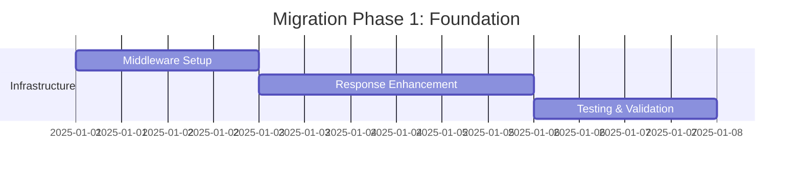
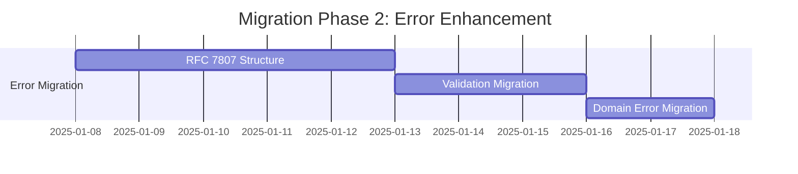
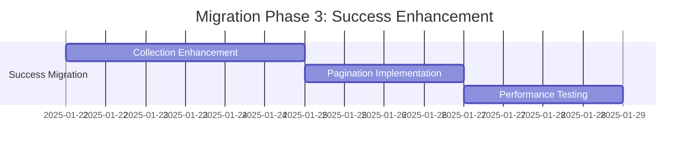
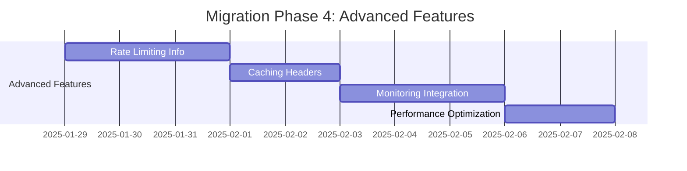

# Migration Strategy

## 🎯 Strategic Migration Overview

This document outlines a comprehensive, risk-minimized approach to migrating your current HTTP API response format to industry-standard best practices while maintaining system stability and backward compatibility.

## 📊 Migration Principles

### Core Migration Philosophy
1. **Backward Compatibility First**: All changes maintain existing API contracts
2. **Incremental Enhancement**: Small, testable changes over large rewrites
3. **Risk Minimization**: Each phase can be independently rolled back
4. **Operational Continuity**: Zero downtime deployment strategy
5. **Client Impact Minimization**: Existing clients continue working unchanged

## 🚦 Migration Phases

### Phase 1: Foundation Layer (Week 1)
**Objective**: Add basic infrastructure without changing existing response structure
**Risk Level**: ⚠️ Low  
**Rollback Complexity**: ⚠️ Low

#### 1.1 Infrastructure Setup (Days 1-2)
```typescript
// Step 1: Add request tracking middleware
app.use((req, res, next) => {
  req.requestId = req.headers['x-request-id'] || generateId();
  req.startTime = Date.now();
  res.setHeader('X-Request-ID', req.requestId);
  next();
});

// Step 2: Add response timing
app.use((req, res, next) => {
  const originalJson = res.json;
  res.json = function(data) {
    // Add timing header (non-breaking)
    res.setHeader('X-Response-Time', Date.now() - req.startTime);
    return originalJson.call(this, data);
  };
  next();
});
```

#### 1.2 Response Enhancement (Days 3-5)
```typescript
// Enhance existing responses with optional metadata
interface EnhancedResponse {
  // Existing structure (unchanged)
  success: boolean;
  data?: any;
  error?: string;
  code?: string;
  message?: string;
  details?: any;
  
  // New optional metadata (backward compatible)
  meta?: {
    timestamp: string;
    requestId: string;
    version: string;
  };
}

// Implementation: Enhance without breaking
const enhanceResponse = (originalResponse: any, req: any) => ({
  ...originalResponse,
  meta: {
    timestamp: new Date().toISOString(),
    requestId: req.requestId,
    version: '1.0'
  }
});
```

#### 1.3 Testing & Validation (Days 6-7)
- Unit tests for new middleware
- Integration tests for enhanced responses
- Performance impact assessment
- Client compatibility verification

### Phase 2: Error Structure Enhancement (Weeks 2-3)
**Objective**: Implement RFC 7807 Problem Details while maintaining current structure
**Risk Level**: ⚠️⚠️ Medium  
**Rollback Complexity**: ⚠️⚠️ Medium

#### 2.1 Dual Error Structure (Week 2)
```typescript
// Enhanced error response maintaining backward compatibility
interface BackwardCompatibleErrorResponse {
  success: false;
  
  // New RFC 7807 structure
  error: {
    type: string;
    title: string;
    status: number;
    detail?: string;
    instance?: string;
    violations?: ValidationViolation[];
    
    // Backward compatibility fields
    code?: string;          // Your current codes
    fieldErrors?: Record<string, string[]>; // Your current field errors
  };
  
  meta: ResponseMetadata;
  
  // Legacy fields (deprecated but maintained)
  code?: string;          // Maps to error.code
  details?: any;          // Maps to error for complex cases
}
```

#### 2.2 Gradual Error Migration
```typescript
class BackwardCompatibleErrorBuilder {
  static buildError(
    type: string,
    title: string,
    status: number,
    detail: string,
    requestId: string,
    legacyCode?: string,
    violations?: ValidationViolation[]
  ) {
    const response = {
      success: false,
      error: {
        type,
        title,
        status,
        detail,
        instance: requestId,
        ...(violations && { violations }),
        ...(legacyCode && { code: legacyCode }),
        ...(violations && { 
          fieldErrors: this.createFieldErrorsMap(violations) 
        })
      },
      meta: this.buildMeta(requestId),
      
      // Legacy support (will be deprecated)
      ...(legacyCode && { code: legacyCode }),
      ...(violations && { 
        details: {
          issues: violations.map(v => ({
            code: v.code,
            path: v.field.split('.'),
            message: v.message
          })),
          fieldErrors: this.createFieldErrorsMap(violations)
        }
      })
    };
    
    return response;
  }
}
```

#### 2.3 Validation Error Migration
```typescript
// Migrate your current Zod error handling
const migrateValidationError = (zodError: ZodError, requestId: string) => {
  const violations = zodError.issues.map(issue => ({
    field: issue.path.join('.'),
    code: issue.code,
    message: issue.message,
    ...(issue.expected && { expected: issue.expected })
  }));

  return BackwardCompatibleErrorBuilder.buildError(
    '/errors/validation-failed',
    'Validation Failed',
    400,
    `${violations.length} field(s) failed validation`,
    requestId,
    'VALIDATION_ERROR', // Your current code
    violations
  );
};
```

### Phase 3: Success Response Enhancement (Week 4)
**Objective**: Add metadata and pagination to success responses
**Risk Level**: ⚠️ Low  
**Rollback Complexity**: ⚠️ Low

#### 3.1 Collection Enhancement
```typescript
// Enhance collection responses with pagination metadata
const enhanceCollectionResponse = (
  data: any[],
  total: number,
  page: number,
  limit: number,
  baseUrl: string,
  requestId: string
) => ({
  success: true,
  data, // Unchanged data structure
  meta: {
    timestamp: new Date().toISOString(),
    requestId,
    version: '1.0',
    collection: {
      total,
      count: data.length,
      hasMore: page * limit < total
    },
    pagination: {
      page,
      limit,
      total,
      pages: Math.ceil(total / limit),
      hasNext: page * limit < total,
      hasPrev: page > 1,
      links: {
        first: `${baseUrl}?page=1&limit=${limit}`,
        ...(page > 1 && { prev: `${baseUrl}?page=${page - 1}&limit=${limit}` }),
        ...(page * limit < total && { next: `${baseUrl}?page=${page + 1}&limit=${limit}` }),
        last: `${baseUrl}?page=${Math.ceil(total / limit)}&limit=${limit}`
      }
    }
  }
});
```

### Phase 4: Advanced Features (Weeks 5-6)
**Objective**: Add operational features and monitoring
**Risk Level**: ⚠️ Low  
**Rollback Complexity**: ⚠️ Low

#### 4.1 Rate Limiting and Caching
```typescript
// Add rate limiting information to responses
const addRateLimitInfo = (response: any, req: any, res: any) => ({
  ...response,
  meta: {
    ...response.meta,
    rateLimit: {
      remaining: parseInt(res.getHeader('X-RateLimit-Remaining') || '0'),
      limit: parseInt(res.getHeader('X-RateLimit-Limit') || '0'),
      resetTime: new Date(
        Date.now() + parseInt(res.getHeader('X-RateLimit-Reset') || '0') * 1000
      ).toISOString()
    }
  }
});
```

## 📅 Detailed Migration Timeline

### Week 1: Foundation (Low Risk)


**Day 1-2: Middleware Infrastructure**
- [ ] Implement request ID middleware
- [ ] Add response timing headers
- [ ] Create basic metadata structure
- [ ] Deploy with feature flag (disabled)

**Day 3-5: Response Enhancement**
- [ ] Add optional meta field to responses
- [ ] Test backward compatibility
- [ ] Update response builder utilities
- [ ] Enable feature flag for internal testing

**Day 6-7: Testing & Validation**
- [ ] Comprehensive unit testing
- [ ] Integration test updates
- [ ] Client compatibility verification
- [ ] Performance impact assessment

### Week 2-3: Error Structure Enhancement (Medium Risk)


**Day 8-12: RFC 7807 Implementation**
- [ ] Create problem details interfaces
- [ ] Implement backward-compatible error builder
- [ ] Migrate validation error handling
- [ ] Deploy with A/B testing

**Day 13-15: Validation Error Migration**
- [ ] Update Zod error handling
- [ ] Maintain fieldErrors compatibility
- [ ] Test field-level error reporting
- [ ] Validate client error handling

**Day 16-17: Domain Error Migration**
- [ ] Migrate authentication errors
- [ ] Migrate business logic errors
- [ ] Update error codes mapping
- [ ] Full error handling testing

### Week 4: Success Response Enhancement (Low Risk)


**Day 22-24: Collection Enhancement**
- [ ] Add collection metadata
- [ ] Implement pagination structure
- [ ] Update collection endpoints
- [ ] Test pagination accuracy

### Week 5-6: Advanced Features (Low Risk)


## 🔄 Rollback Strategies

### Phase 1 Rollback (Simple)
```typescript
// Feature flag approach
const ENABLE_ENHANCED_RESPONSES = process.env.ENABLE_ENHANCED_RESPONSES === 'true';

const buildResponse = (data: any, req: any) => {
  const baseResponse = { success: true, data };
  
  if (ENABLE_ENHANCED_RESPONSES) {
    return {
      ...baseResponse,
      meta: buildMetadata(req)
    };
  }
  
  return baseResponse; // Original format
};
```

### Phase 2 Rollback (Moderate)
```typescript
// Error format rollback
const buildErrorResponse = (error: any, req: any) => {
  if (process.env.USE_RFC7807_ERRORS === 'true') {
    return buildRFC7807Response(error, req);
  }
  
  // Fallback to original format
  return {
    success: false,
    error: error.message,
    code: error.code,
    details: error.details
  };
};
```

### Emergency Rollback Plan
```bash
# Emergency rollback script
#!/bin/bash
echo "Executing emergency rollback..."

# Disable all enhanced features
export ENABLE_ENHANCED_RESPONSES=false
export USE_RFC7807_ERRORS=false
export ENABLE_PAGINATION=false

# Restart application
pm2 restart api-server

# Verify rollback
curl -f http://localhost:3000/health || exit 1

echo "Rollback completed successfully"
```

## 📊 Migration Monitoring

### Success Metrics
```typescript
interface MigrationMetrics {
  phase: string;
  startDate: string;
  endDate?: string;
  successRate: number;
  errorRate: number;
  performanceImpact: number;
  clientCompatibility: number;
  rollbacksTriggered: number;
}

// Track migration progress
const trackMigrationMetrics = {
  phase1: {
    responseTimeImpact: '<5ms',
    errorRateIncrease: '<0.1%',
    clientBreaking: 0,
    rollbacks: 0
  }
};
```

### Alert Thresholds
```typescript
const MIGRATION_ALERTS = {
  ERROR_RATE_THRESHOLD: 1.0, // 1% error rate increase
  RESPONSE_TIME_THRESHOLD: 100, // 100ms response time increase
  CLIENT_ERROR_THRESHOLD: 5, // 5% client error increase
  ROLLBACK_THRESHOLD: 1 // Any rollback triggers alert
};
```

## 🧪 Testing Strategy

### Regression Testing
```typescript
// Automated compatibility tests
describe('Migration Compatibility Tests', () => {
  describe('Phase 1: Foundation', () => {
    it('should maintain existing response structure', async () => {
      const response = await request(app).get('/api/todos');
      
      // Original structure must be present
      expect(response.body).toHaveProperty('success');
      expect(response.body).toHaveProperty('data');
      
      // New structure is optional and additive
      if (response.body.meta) {
        expect(response.body.meta).toHaveProperty('timestamp');
        expect(response.body.meta).toHaveProperty('requestId');
      }
    });
  });
  
  describe('Phase 2: Error Enhancement', () => {
    it('should maintain backward compatible error format', async () => {
      const response = await request(app)
        .post('/api/todos')
        .send({}) // Invalid data
        .expect(400);
      
      // Original error fields must be present
      expect(response.body).toHaveProperty('success', false);
      expect(response.body).toHaveProperty('error');
      
      // Enhanced structure should be present
      if (typeof response.body.error === 'object') {
        expect(response.body.error).toHaveProperty('type');
        expect(response.body.error).toHaveProperty('title');
        expect(response.body.error).toHaveProperty('status');
      }
    });
  });
});
```

### Client Compatibility Testing
```typescript
// Test existing client expectations
const testClientCompatibility = async () => {
  const testCases = [
    {
      name: 'Mobile App v1.0',
      expectations: ['success', 'data', 'fieldErrors'],
      endpoint: '/api/auth/login'
    },
    {
      name: 'Web App v2.1', 
      expectations: ['success', 'error', 'code'],
      endpoint: '/api/todos'
    }
  ];
  
  for (const testCase of testCases) {
    const response = await makeTestRequest(testCase.endpoint);
    
    for (const expectation of testCase.expectations) {
      expect(response.body).toHaveProperty(expectation);
    }
  }
};
```

## 📋 Migration Checklist

### Pre-Migration Preparation
- [ ] Current API response format documentation
- [ ] Client compatibility assessment
- [ ] Performance baseline measurements
- [ ] Rollback procedures tested
- [ ] Monitoring and alerting configured
- [ ] Feature flags implemented
- [ ] A/B testing framework ready

### Phase 1 Execution Checklist
- [ ] Request ID middleware deployed
- [ ] Response timing headers active
- [ ] Basic metadata structure implemented
- [ ] Backward compatibility verified
- [ ] Performance impact measured (<5ms)
- [ ] Error rate monitored (<0.1% increase)
- [ ] Client compatibility confirmed (100%)

### Phase 2 Execution Checklist
- [ ] RFC 7807 error structure implemented
- [ ] Backward compatible error fields maintained
- [ ] Validation error migration completed
- [ ] Domain error migration completed
- [ ] Error handling middleware updated
- [ ] Client error handling verified
- [ ] Legacy error codes preserved

### Phase 3 Execution Checklist
- [ ] Collection metadata implemented
- [ ] Pagination structure added
- [ ] Success response enhancements deployed
- [ ] Collection endpoints updated
- [ ] Pagination accuracy verified
- [ ] Client collection handling tested

### Phase 4 Execution Checklist
- [ ] Rate limiting information added
- [ ] Caching headers implemented
- [ ] Monitoring integration completed
- [ ] Performance optimization applied
- [ ] Advanced features tested
- [ ] Full system integration verified

### Post-Migration Validation
- [ ] All clients functioning normally
- [ ] Response times within acceptable range
- [ ] Error rates at baseline levels
- [ ] New features providing expected value
- [ ] Documentation updated
- [ ] Team training completed
- [ ] Monitoring dashboards updated

## 🎯 Success Criteria

### Technical Success Metrics
- **Zero Breaking Changes**: Existing clients continue working
- **Performance Maintained**: <5ms response time increase
- **Error Rate Stable**: <0.1% error rate increase
- **Feature Adoption**: New metadata available in 100% of responses
- **Standards Compliance**: RFC 7807 error responses implemented

### Business Success Metrics
- **Developer Productivity**: 30% reduction in API debugging time
- **Client Integration Speed**: 50% faster new client onboarding
- **Support Tickets**: 40% reduction in API-related support requests
- **API Documentation**: Auto-generated from standardized responses
- **Monitoring Coverage**: 90% observability improvement

---

### Navigation
- **Previous**: [Implementation Guide](./implementation-guide.md)
- **Next**: [Template Examples](./template-examples.md)

---

*This migration strategy ensures a smooth transition to industry-standard HTTP API response formats while maintaining system stability and client compatibility. Each phase builds upon the previous one with minimal risk and maximum value delivery.*