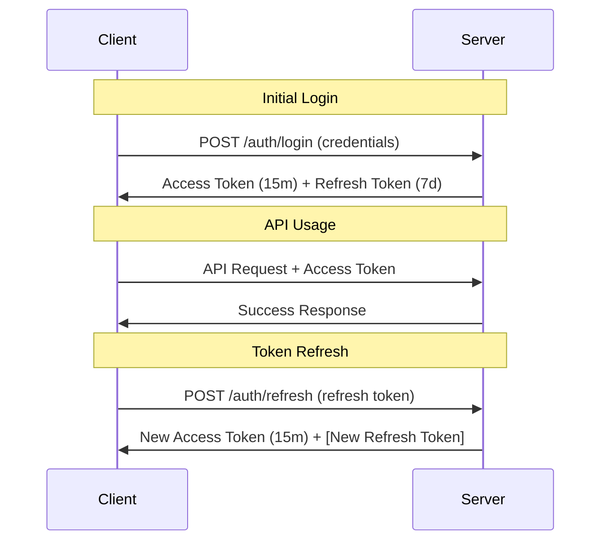

# Refresh Token Strategies

## 🔄 Long-term Authentication Management

Refresh tokens enable long-term authentication without requiring users to repeatedly enter credentials. This document covers secure refresh token implementation patterns, rotation strategies, and session management.

## 🎯 Refresh Token Fundamentals

### Purpose and Benefits

**Access Tokens** (Short-lived, 15 minutes)
- Contain user context and permissions
- Used for API authentication
- Minimal server-side storage requirements
- Quick expiration limits exposure risk

**Refresh Tokens** (Long-lived, 7-30 days)
- Used only to obtain new access tokens
- Stored securely on server side
- Can be revoked immediately
- Enable seamless user experience

### Basic Refresh Flow



## 🔒 Secure Refresh Token Implementation

### 1. Refresh Token Service

```typescript
interface RefreshTokenData {
  id: string;
  userId: string;
  sessionId: string;
  tokenHash: string;
  createdAt: Date;
  expiresAt: Date;
  lastUsedAt: Date;
  deviceInfo: {
    userAgent: string;
    ipAddress: string;
    deviceId?: string;
  };
  isActive: boolean;
  rotationCount: number;
}

export class RefreshTokenService {
  private readonly TOKEN_LENGTH = 64;
  private readonly DEFAULT_EXPIRY_DAYS = 7;
  private readonly MAX_ROTATION_COUNT = 100;
  
  async generateRefreshToken(
    userId: string,
    sessionId: string,
    deviceInfo: {
      userAgent: string;
      ipAddress: string;
      deviceId?: string;
    },
    expiryDays: number = this.DEFAULT_EXPIRY_DAYS
  ): Promise<{ token: string; tokenData: RefreshTokenData }> {
    
    // Generate cryptographically secure random token
    const token = crypto.randomBytes(this.TOKEN_LENGTH).toString('hex');
    const tokenHash = await bcrypt.hash(token, 12);
    
    const expiresAt = new Date();
    expiresAt.setDate(expiresAt.getDate() + expiryDays);
    
    const tokenData: RefreshTokenData = {
      id: uuidv4(),
      userId,
      sessionId,
      tokenHash,
      createdAt: new Date(),
      expiresAt,
      lastUsedAt: new Date(),
      deviceInfo,
      isActive: true,
      rotationCount: 0
    };
    
    // Store in database
    await this.storeRefreshToken(tokenData);
    
    return { token, tokenData };
  }
  
  async validateRefreshToken(token: string): Promise<RefreshTokenData | null> {
    try {
      // Find all active refresh tokens (we'll need to check hash)
      const candidates = await this.getActiveRefreshTokens();
      
      // Check token against stored hashes
      for (const candidate of candidates) {
        const isValid = await bcrypt.compare(token, candidate.tokenHash);
        
        if (isValid) {
          // Check expiration
          if (candidate.expiresAt < new Date()) {
            await this.revokeRefreshToken(candidate.id);
            return null;
          }
          
          // Update last used timestamp
          candidate.lastUsedAt = new Date();
          await this.updateRefreshToken(candidate);
          
          return candidate;
        }
      }
      
      return null;
      
    } catch (error) {
      logger.error('Refresh token validation error', error);
      return null;
    }
  }
  
  async revokeRefreshToken(tokenId: string): Promise<void> {
    await this.database.query(
      'UPDATE refresh_tokens SET is_active = false WHERE id = ?',
      [tokenId]
    );
  }
  
  async revokeAllUserTokens(userId: string): Promise<void> {
    await this.database.query(
      'UPDATE refresh_tokens SET is_active = false WHERE user_id = ?',
      [userId]
    );
  }
  
  async revokeSessionTokens(sessionId: string): Promise<void> {
    await this.database.query(
      'UPDATE refresh_tokens SET is_active = false WHERE session_id = ?',
      [sessionId]
    );
  }
  
  async cleanupExpiredTokens(): Promise<number> {
    const result = await this.database.query(
      'DELETE FROM refresh_tokens WHERE expires_at < NOW() OR is_active = false'
    );
    
    return result.affectedRows;
  }
  
  private async storeRefreshToken(tokenData: RefreshTokenData): Promise<void> {
    await this.database.query(`
      INSERT INTO refresh_tokens (
        id, user_id, session_id, token_hash, created_at, expires_at, 
        last_used_at, user_agent, ip_address, device_id, is_active, rotation_count
      ) VALUES (?, ?, ?, ?, ?, ?, ?, ?, ?, ?, ?, ?)
    `, [
      tokenData.id,
      tokenData.userId,
      tokenData.sessionId,
      tokenData.tokenHash,
      tokenData.createdAt,
      tokenData.expiresAt,
      tokenData.lastUsedAt,
      tokenData.deviceInfo.userAgent,
      tokenData.deviceInfo.ipAddress,
      tokenData.deviceInfo.deviceId,
      tokenData.isActive,
      tokenData.rotationCount
    ]);
  }
}
```

### 2. Token Rotation Strategies

#### Strategy 1: Automatic Rotation (Most Secure)

```typescript
class AutoRotationRefreshService extends RefreshTokenService {
  async refreshAccessToken(
    refreshToken: string,
    deviceInfo: {
      userAgent: string;
      ipAddress: string;
      deviceId?: string;
    }
  ): Promise<{
    accessToken: string;
    refreshToken: string;
    expiresIn: number;
  } | null> {
    
    // Validate current refresh token
    const tokenData = await this.validateRefreshToken(refreshToken);
    if (!tokenData) {
      return null;
    }
    
    try {
      // Start transaction for atomic rotation
      await this.database.beginTransaction();
      
      // Revoke current refresh token
      await this.revokeRefreshToken(tokenData.id);
      
      // Generate new refresh token
      const newRefreshToken = await this.generateRefreshToken(
        tokenData.userId,
        tokenData.sessionId,
        deviceInfo,
        this.calculateExpiryDays(tokenData)
      );
      
      // Generate new access token
      const user = await this.userService.findById(tokenData.userId);
      const accessToken = await this.jwtService.generateAccessToken(
        user,
        tokenData.sessionId
      );
      
      await this.database.commit();
      
      return {
        accessToken,
        refreshToken: newRefreshToken.token,
        expiresIn: this.jwtService.getTokenExpiration()
      };
      
    } catch (error) {
      await this.database.rollback();
      logger.error('Token rotation failed', error);
      return null;
    }
  }
  
  private calculateExpiryDays(tokenData: RefreshTokenData): number {
    // Sliding expiration: extend if used recently
    const hoursSinceLastUse = (Date.now() - tokenData.lastUsedAt.getTime()) / (1000 * 60 * 60);
    
    if (hoursSinceLastUse < 24) {
      return 7; // Extend to 7 days if used within last day
    } else if (hoursSinceLastUse < 72) {
      return 3; // 3 days if used within last 3 days
    } else {
      return 1; // Only 1 day if not used recently
    }
  }
}
```

#### Strategy 2: Conditional Rotation

```typescript
class ConditionalRotationService extends RefreshTokenService {
  private readonly ROTATION_THRESHOLD_HOURS = 24;
  private readonly ROTATION_USAGE_THRESHOLD = 10;
  
  async refreshAccessToken(refreshToken: string): Promise<any> {
    const tokenData = await this.validateRefreshToken(refreshToken);
    if (!tokenData) return null;
    
    const shouldRotate = this.shouldRotateToken(tokenData);
    
    if (shouldRotate) {
      return this.rotateRefreshToken(tokenData);
    } else {
      return this.renewAccessTokenOnly(tokenData);
    }
  }
  
  private shouldRotateToken(tokenData: RefreshTokenData): boolean {
    // Rotate if token is old
    const ageHours = (Date.now() - tokenData.createdAt.getTime()) / (1000 * 60 * 60);
    if (ageHours > this.ROTATION_THRESHOLD_HOURS) {
      return true;
    }
    
    // Rotate if used frequently
    if (tokenData.rotationCount > this.ROTATION_USAGE_THRESHOLD) {
      return true;
    }
    
    // Rotate on security events
    if (this.detectSecurityEvent(tokenData)) {
      return true;
    }
    
    return false;
  }
  
  private detectSecurityEvent(tokenData: RefreshTokenData): boolean {
    // Check for IP address changes
    const currentIP = this.getCurrentRequestIP();
    if (tokenData.deviceInfo.ipAddress !== currentIP) {
      return true;
    }
    
    // Check for unusual usage patterns
    const recentUsage = this.getRecentTokenUsage(tokenData.id);
    if (this.isUnusualUsagePattern(recentUsage)) {
      return true;
    }
    
    return false;
  }
}
```

### 3. Token Family Strategy (Refresh Token Chaining)

```typescript
interface TokenFamily {
  familyId: string;
  userId: string;
  sessionId: string;
  currentTokenId: string;
  tokenChain: string[];
  createdAt: Date;
  lastRotatedAt: Date;
  isCompromised: boolean;
}

class TokenFamilyService {
  async createTokenFamily(userId: string, sessionId: string): Promise<TokenFamily> {
    const familyId = uuidv4();
    const initialToken = await this.generateRefreshToken(userId, sessionId);
    
    const family: TokenFamily = {
      familyId,
      userId,
      sessionId,
      currentTokenId: initialToken.tokenData.id,
      tokenChain: [initialToken.tokenData.id],
      createdAt: new Date(),
      lastRotatedAt: new Date(),
      isCompromised: false
    };
    
    await this.storeTokenFamily(family);
    return family;
  }
  
  async rotateTokenInFamily(
    currentToken: string,
    familyId: string
  ): Promise<{ accessToken: string; refreshToken: string } | null> {
    
    const family = await this.getTokenFamily(familyId);
    if (!family || family.isCompromised) {
      return null;
    }
    
    // Validate that the current token belongs to this family
    const tokenData = await this.validateRefreshToken(currentToken);
    if (!tokenData || !family.tokenChain.includes(tokenData.id)) {
      // Possible token theft - mark family as compromised
      await this.compromiseTokenFamily(familyId);
      return null;
    }
    
    // Generate new token in the family
    const newToken = await this.generateRefreshToken(
      family.userId,
      family.sessionId
    );
    
    // Update family chain
    family.tokenChain.push(newToken.tokenData.id);
    family.currentTokenId = newToken.tokenData.id;
    family.lastRotatedAt = new Date();
    
    // Keep only recent tokens in chain (limit memory usage)
    if (family.tokenChain.length > 5) {
      const oldTokenId = family.tokenChain.shift()!;
      await this.revokeRefreshToken(oldTokenId);
    }
    
    await this.updateTokenFamily(family);
    
    // Generate access token
    const user = await this.userService.findById(family.userId);
    const accessToken = await this.jwtService.generateAccessToken(user, family.sessionId);
    
    return {
      accessToken,
      refreshToken: newToken.token
    };
  }
  
  async compromiseTokenFamily(familyId: string): Promise<void> {
    const family = await this.getTokenFamily(familyId);
    if (!family) return;
    
    // Mark family as compromised
    family.isCompromised = true;
    await this.updateTokenFamily(family);
    
    // Revoke all tokens in family
    for (const tokenId of family.tokenChain) {
      await this.revokeRefreshToken(tokenId);
    }
    
    // Log security event
    logger.warn('Token family compromised', {
      familyId,
      userId: family.userId,
      sessionId: family.sessionId,
      tokenCount: family.tokenChain.length
    });
    
    // Notify user of potential security breach
    await this.notificationService.sendSecurityAlert(family.userId, {
      type: 'TOKEN_COMPROMISE',
      timestamp: new Date(),
      action: 'Please log in again and change your password'
    });
  }
}
```

## 🔍 Refresh Token Security Patterns

### 1. Refresh Token Binding

```typescript
// Bind refresh tokens to specific client characteristics
interface TokenBinding {
  userAgent: string;
  ipAddress: string;
  deviceFingerprint: string;
  tlsFingerprint?: string;
}

class BoundRefreshTokenService {
  async generateBoundToken(
    userId: string,
    binding: TokenBinding,
    bindingStrength: 'strict' | 'moderate' | 'loose' = 'moderate'
  ): Promise<string> {
    
    const tokenData = {
      userId,
      binding,
      bindingStrength,
      createdAt: new Date()
    };
    
    const token = this.encryptTokenData(tokenData);
    return token;
  }
  
  async validateBoundToken(
    token: string,
    currentBinding: TokenBinding
  ): Promise<boolean> {
    
    const tokenData = this.decryptTokenData(token);
    if (!tokenData) return false;
    
    switch (tokenData.bindingStrength) {
      case 'strict':
        return this.validateStrictBinding(tokenData.binding, currentBinding);
      case 'moderate':
        return this.validateModerateBinding(tokenData.binding, currentBinding);
      case 'loose':
        return this.validateLooseBinding(tokenData.binding, currentBinding);
    }
  }
  
  private validateStrictBinding(
    original: TokenBinding,
    current: TokenBinding
  ): boolean {
    return (
      original.userAgent === current.userAgent &&
      original.ipAddress === current.ipAddress &&
      original.deviceFingerprint === current.deviceFingerprint
    );
  }
  
  private validateModerateBinding(
    original: TokenBinding,
    current: TokenBinding
  ): boolean {
    // Allow IP address changes (mobile networks)
    return (
      original.userAgent === current.userAgent &&
      original.deviceFingerprint === current.deviceFingerprint
    );
  }
  
  private validateLooseBinding(
    original: TokenBinding,
    current: TokenBinding
  ): boolean {
    // Only require device fingerprint match
    return original.deviceFingerprint === current.deviceFingerprint;
  }
}
```

### 2. Refresh Token Rate Limiting

```typescript
class RefreshTokenRateLimit {
  private attempts = new Map<string, { count: number; resetAt: number }>();
  
  private readonly MAX_ATTEMPTS = 5;
  private readonly WINDOW_MINUTES = 15;
  
  async checkRateLimit(userId: string): Promise<boolean> {
    const key = `refresh:${userId}`;
    const now = Date.now();
    const windowMs = this.WINDOW_MINUTES * 60 * 1000;
    
    let record = this.attempts.get(key);
    
    if (!record || now > record.resetAt) {
      // Reset window
      record = { count: 0, resetAt: now + windowMs };
      this.attempts.set(key, record);
    }
    
    record.count++;
    
    if (record.count > this.MAX_ATTEMPTS) {
      // Log suspicious activity
      logger.warn('Refresh token rate limit exceeded', {
        userId,
        attempts: record.count,
        windowMinutes: this.WINDOW_MINUTES
      });
      
      return false;
    }
    
    return true;
  }
  
  async recordSuccessfulRefresh(userId: string): Promise<void> {
    // Reset count on successful refresh
    const key = `refresh:${userId}`;
    this.attempts.delete(key);
  }
}
```

## 📱 Client-Side Refresh Implementation

### 1. Automatic Token Refresh (React)

```typescript
// React hook for automatic token management
import { useEffect, useRef, useState } from 'react';

interface TokenState {
  accessToken: string | null;
  isAuthenticated: boolean;
  isRefreshing: boolean;
}

export const useAuthTokens = () => {
  const [tokenState, setTokenState] = useState<TokenState>({
    accessToken: null,
    isAuthenticated: false,
    isRefreshing: false
  });
  
  const refreshTimeoutRef = useRef<NodeJS.Timeout>();
  const refreshPromiseRef = useRef<Promise<void> | null>(null);
  
  // Schedule token refresh before expiration
  const scheduleRefresh = (expiresIn: number) => {
    // Refresh when 80% of token lifetime has passed
    const refreshIn = (expiresIn * 1000) * 0.8;
    
    if (refreshTimeoutRef.current) {
      clearTimeout(refreshTimeoutRef.current);
    }
    
    refreshTimeoutRef.current = setTimeout(() => {
      refreshToken();
    }, refreshIn);
  };
  
  // Refresh token with deduplication
  const refreshToken = async (): Promise<void> => {
    // Prevent multiple concurrent refresh requests
    if (refreshPromiseRef.current) {
      return refreshPromiseRef.current;
    }
    
    setTokenState(prev => ({ ...prev, isRefreshing: true }));
    
    refreshPromiseRef.current = (async () => {
      try {
        const response = await fetch('/api/auth/refresh', {
          method: 'POST',
          credentials: 'include',
          headers: {
            'Content-Type': 'application/json'
          }
        });
        
        if (response.ok) {
          const data = await response.json();
          
          setTokenState({
            accessToken: data.accessToken,
            isAuthenticated: true,
            isRefreshing: false
          });
          
          // Schedule next refresh
          scheduleRefresh(data.expiresIn);
          
        } else {
          // Refresh failed - user needs to log in again
          setTokenState({
            accessToken: null,
            isAuthenticated: false,
            isRefreshing: false
          });
        }
        
      } catch (error) {
        console.error('Token refresh error:', error);
        setTokenState({
          accessToken: null,
          isAuthenticated: false,
          isRefreshing: false
        });
      } finally {
        refreshPromiseRef.current = null;
      }
    })();
    
    return refreshPromiseRef.current;
  };
  
  // API request wrapper with automatic refresh
  const authenticatedFetch = async (
    url: string,
    options: RequestInit = {}
  ): Promise<Response> => {
    
    // Ensure we have a valid token
    if (!tokenState.accessToken && !tokenState.isRefreshing) {
      await refreshToken();
    }
    
    // Wait for any ongoing refresh
    if (refreshPromiseRef.current) {
      await refreshPromiseRef.current;
    }
    
    // Make the request
    let response = await fetch(url, {
      ...options,
      credentials: 'include',
      headers: {
        ...options.headers,
        'Authorization': `Bearer ${tokenState.accessToken}`
      }
    });
    
    // If unauthorized, try refreshing once
    if (response.status === 401 && !tokenState.isRefreshing) {
      await refreshToken();
      
      // Retry the original request
      response = await fetch(url, {
        ...options,
        credentials: 'include',
        headers: {
          ...options.headers,
          'Authorization': `Bearer ${tokenState.accessToken}`
        }
      });
    }
    
    return response;
  };
  
  // Initialize token state on mount
  useEffect(() => {
    refreshToken();
    
    return () => {
      if (refreshTimeoutRef.current) {
        clearTimeout(refreshTimeoutRef.current);
      }
    };
  }, []);
  
  return {
    ...tokenState,
    refreshToken,
    authenticatedFetch
  };
};
```

### 2. Axios Interceptor Implementation

```typescript
// Axios interceptor for automatic token refresh
import axios, { AxiosInstance, AxiosRequestConfig, AxiosResponse } from 'axios';

class AuthenticatedAPIClient {
  private axiosInstance: AxiosInstance;
  private refreshPromise: Promise<void> | null = null;
  
  constructor(baseURL: string) {
    this.axiosInstance = axios.create({
      baseURL,
      withCredentials: true
    });
    
    this.setupInterceptors();
  }
  
  private setupInterceptors(): void {
    // Request interceptor
    this.axiosInstance.interceptors.request.use(
      (config: AxiosRequestConfig) => {
        // Add any auth headers if needed
        return config;
      },
      (error) => Promise.reject(error)
    );
    
    // Response interceptor
    this.axiosInstance.interceptors.response.use(
      (response: AxiosResponse) => response,
      async (error) => {
        const originalRequest = error.config;
        
        if (error.response?.status === 401 && !originalRequest._retry) {
          originalRequest._retry = true;
          
          try {
            await this.refreshTokens();
            return this.axiosInstance(originalRequest);
          } catch (refreshError) {
            // Redirect to login
            window.location.href = '/login';
            return Promise.reject(refreshError);
          }
        }
        
        return Promise.reject(error);
      }
    );
  }
  
  private async refreshTokens(): Promise<void> {
    // Prevent multiple concurrent refresh requests
    if (this.refreshPromise) {
      return this.refreshPromise;
    }
    
    this.refreshPromise = (async () => {
      const response = await this.axiosInstance.post('/auth/refresh');
      
      if (response.status !== 200) {
        throw new Error('Token refresh failed');
      }
    })();
    
    try {
      await this.refreshPromise;
    } finally {
      this.refreshPromise = null;
    }
  }
  
  // Public API methods
  get(url: string, config?: AxiosRequestConfig) {
    return this.axiosInstance.get(url, config);
  }
  
  post(url: string, data?: any, config?: AxiosRequestConfig) {
    return this.axiosInstance.post(url, data, config);
  }
  
  put(url: string, data?: any, config?: AxiosRequestConfig) {
    return this.axiosInstance.put(url, data, config);
  }
  
  delete(url: string, config?: AxiosRequestConfig) {
    return this.axiosInstance.delete(url, config);
  }
}
```

## 📊 Refresh Token Strategy Comparison

| Strategy | Security Level | Complexity | Performance | Use Case |
|----------|---------------|------------|-------------|----------|
| **No Rotation** | 🟡 Medium | 🟢 Low | 🟢 High | Simple applications |
| **Automatic Rotation** | 🟢 High | 🟡 Medium | 🟡 Medium | **Recommended** |
| **Conditional Rotation** | 🟢 High | 🔴 High | 🟢 High | High-security applications |
| **Token Family** | 🟢 Very High | 🔴 Very High | 🟡 Medium | Financial applications |

## 📈 Monitoring and Analytics

### Refresh Token Metrics

```typescript
class RefreshTokenMetrics {
  private metrics = {
    refreshRequests: 0,
    successfulRefreshes: 0,
    failedRefreshes: 0,
    rotationsPerformed: 0,
    suspiciousActivity: 0,
    averageRefreshInterval: 0
  };
  
  recordRefreshAttempt(success: boolean): void {
    this.metrics.refreshRequests++;
    
    if (success) {
      this.metrics.successfulRefreshes++;
    } else {
      this.metrics.failedRefreshes++;
    }
  }
  
  recordTokenRotation(): void {
    this.metrics.rotationsPerformed++;
  }
  
  recordSuspiciousActivity(type: string): void {
    this.metrics.suspiciousActivity++;
    
    logger.warn('Suspicious refresh token activity', {
      type,
      timestamp: new Date(),
      totalSuspiciousEvents: this.metrics.suspiciousActivity
    });
  }
  
  getMetrics() {
    return {
      ...this.metrics,
      successRate: this.metrics.refreshRequests > 0 
        ? (this.metrics.successfulRefreshes / this.metrics.refreshRequests) * 100 
        : 0
    };
  }
}
```

---

**Navigation**
- ← Back to: [Token Storage and Security](./token-storage-security.md)
- → Next: [Authentication Middleware Patterns](./authentication-middleware-patterns.md)
- ↑ Back to: [JWT Authentication Research](./README.md)