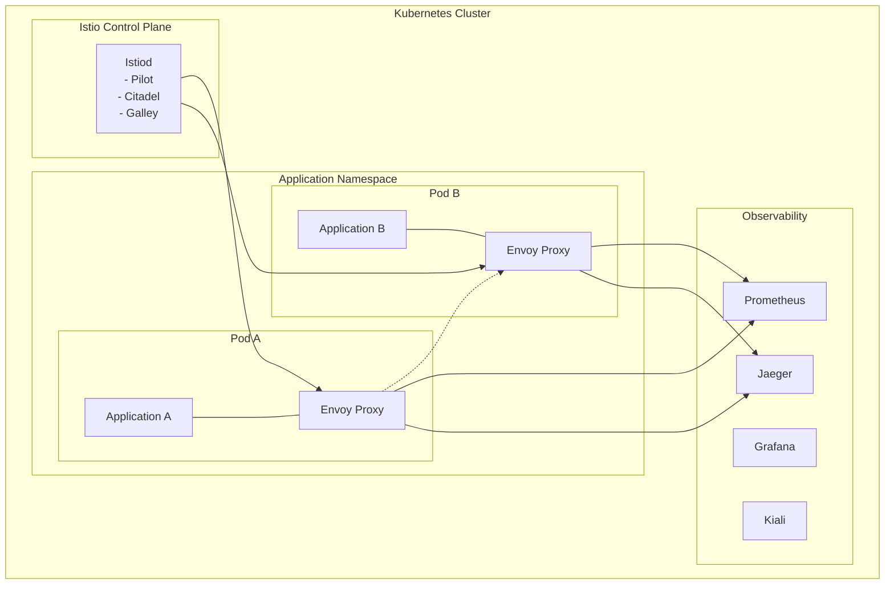

# Istio Deep Dive: Architecture, Features & Implementation

## 🏗️ Architecture Overview

Istio is a comprehensive service mesh platform that provides a uniform way to secure, connect, and monitor microservices. It uses a control plane to manage the configuration and a data plane consisting of Envoy proxies deployed as sidecars alongside each service.

### Core Components

```yaml
# Istio Control Plane Architecture
control_plane:
  istiod:
    components:
      - "Pilot: Service discovery and traffic management"
      - "Citadel: Certificate and key management"
      - "Galley: Configuration validation and distribution"
    
  functions:
    - "Configuration distribution to Envoy proxies"
    - "Service discovery and endpoint management"
    - "Certificate provisioning and rotation"
    - "Policy enforcement and telemetry collection"

data_plane:
  envoy_proxy:
    deployment: "Sidecar container in each pod"
    responsibilities:
      - "Intercept all network traffic"
      - "Apply traffic management rules"
      - "Enforce security policies"
      - "Collect telemetry data"
```

### Istio Service Mesh Architecture



## 🚀 Installation & Setup

### Prerequisites

```yaml
requirements:
  kubernetes: "v1.24+"
  resources:
    cpu: "4+ cores"
    memory: "8GB+"
    storage: "50GB+"
  
  networking:
    cni: "Calico, Flannel, or Weave"
    load_balancer: "MetalLB, AWS ALB, or similar"
```

### Installation Methods

#### 1. Istioctl Installation (Recommended)

```bash
# Download and install istioctl
curl -L https://istio.io/downloadIstio | sh -
cd istio-1.20.0
export PATH=$PWD/bin:$PATH

# Verify installation
istioctl version

# Install Istio with default configuration
istioctl install --set values.defaultRevision=default

# Enable automatic sidecar injection
kubectl label namespace default istio-injection=enabled
```

#### 2. Helm Installation

```bash
# Add Istio Helm repository
helm repo add istio https://istio-release.storage.googleapis.com/charts
helm repo update

# Install Istio base components
helm install istio-base istio/base -n istio-system --create-namespace

# Install Istiod
helm install istiod istio/istiod -n istio-system --wait

# Install Istio gateway
helm install istio-gateway istio/gateway -n istio-system
```

#### 3. Custom Installation Profile

```yaml
# istio-production.yaml
apiVersion: install.istio.io/v1alpha1
kind: IstioOperator
metadata:
  name: control-plane
spec:
  values:
    defaultRevision: stable
    pilot:
      resources:
        requests:
          cpu: 500m
          memory: 2048Mi
        limits:
          cpu: 1000m
          memory: 4096Mi
    
  components:
    pilot:
      k8s:
        replicaCount: 3
        hpaSpec:
          minReplicas: 3
          maxReplicas: 10
          metrics:
          - type: Resource
            resource:
              name: cpu
              targetAverageUtilization: 80
    
    ingressGateways:
    - name: istio-ingressgateway
      enabled: true
      k8s:
        replicaCount: 2
        hpaSpec:
          minReplicas: 2
          maxReplicas: 8
```

```bash
# Apply custom configuration
istioctl install -f istio-production.yaml
```

## 🌐 Traffic Management

### Virtual Services

Virtual Services define routing rules for how requests are routed to services within the mesh.

```yaml
# Basic Virtual Service Example
apiVersion: networking.istio.io/v1beta1
kind: VirtualService
metadata:
  name: edtech-platform
spec:
  hosts:
  - exam-platform.com
  gateways:
  - edtech-gateway
  http:
  - match:
    - headers:
        user-type:
          exact: premium
    route:
    - destination:
        host: premium-service
        subset: v2
      weight: 100
  - match:
    - uri:
        prefix: /api/v1/
    route:
    - destination:
        host: api-service
        subset: stable
      weight: 90
    - destination:
        host: api-service
        subset: canary
      weight: 10
  - route:
    - destination:
        host: web-frontend
```

### Destination Rules

Destination Rules configure what happens to traffic after routing decisions are made.

```yaml
# Advanced Destination Rule for EdTech Platform
apiVersion: networking.istio.io/v1beta1
kind: DestinationRule
metadata:
  name: exam-service-dr
spec:
  host: exam-service
  trafficPolicy:
    connectionPool:
      tcp:
        maxConnections: 100
      http:
        http1MaxPendingRequests: 50
        http2MaxRequests: 100
        maxRequestsPerConnection: 10
        maxRetries: 3
        consecutiveGatewayErrors: 5
        interval: 30s
        baseEjectionTime: 30s
        maxEjectionPercent: 50
    
    loadBalancer:
      simple: LEAST_CONN
    
    outlierDetection:
      consecutiveGatewayErrors: 3
      interval: 30s
      baseEjectionTime: 30s
      maxEjectionPercent: 50
      minHealthPercent: 30
  
  subsets:
  - name: v1
    labels:
      version: v1
    trafficPolicy:
      portLevelSettings:
      - port:
          number: 8080
        loadBalancer:
          simple: ROUND_ROBIN
  
  - name: v2
    labels:
      version: v2
    trafficPolicy:
      portLevelSettings:
      - port:
          number: 8080
        connectionPool:
          tcp:
            maxConnections: 200
```

### Gateway Configuration

```yaml
# Production Gateway for EdTech Platform
apiVersion: networking.istio.io/v1beta1
kind: Gateway
metadata:
  name: edtech-gateway
spec:
  selector:
    istio: ingressgateway
  servers:
  - port:
      number: 443
      name: https
      protocol: HTTPS
    tls:
      mode: SIMPLE
      credentialName: edtech-tls-secret
    hosts:
    - exam-platform.com
    - api.exam-platform.com
  
  - port:
      number: 80
      name: http
      protocol: HTTP
    hosts:
    - exam-platform.com
    - api.exam-platform.com
    tls:
      httpsRedirect: true
```

### Canary Deployments

```yaml
# Canary Deployment Strategy
apiVersion: networking.istio.io/v1beta1
kind: VirtualService
metadata:
  name: exam-engine-canary
spec:
  hosts:
  - exam-engine
  http:
  - match:
    - headers:
        canary-user:
          exact: "true"
    route:
    - destination:
        host: exam-engine
        subset: v2
  
  - match:
    - uri:
        prefix: /api/v2/
    route:
    - destination:
        host: exam-engine
        subset: v2
      weight: 10
    - destination:
        host: exam-engine
        subset: v1
      weight: 90
  
  - route:
    - destination:
        host: exam-engine
        subset: v1
```

## 🔒 Security Features

### Automatic mTLS

Istio automatically configures mutual TLS between services in the mesh.

```yaml
# PeerAuthentication for strict mTLS
apiVersion: security.istio.io/v1beta1
kind: PeerAuthentication
metadata:
  name: default
  namespace: production
spec:
  mtls:
    mode: STRICT

---
# Allow plain text for specific services (e.g., health checks)
apiVersion: security.istio.io/v1beta1
kind: PeerAuthentication
metadata:
  name: health-check-plain
spec:
  selector:
    matchLabels:
      app: health-service
  mtls:
    mode: PERMISSIVE
```

### Authorization Policies

```yaml
# JWT Authentication for EdTech API
apiVersion: security.istio.io/v1beta1
kind: RequestAuthentication
metadata:
  name: jwt-auth
spec:
  selector:
    matchLabels:
      app: api-service
  jwtRules:
  - issuer: "https://auth.exam-platform.com"
    jwksUri: "https://auth.exam-platform.com/.well-known/jwks.json"
    audiences:
    - "exam-platform-api"

---
# Authorization policy for protected resources
apiVersion: security.istio.io/v1beta1
kind: AuthorizationPolicy
metadata:
  name: require-jwt
spec:
  selector:
    matchLabels:
      app: api-service
  rules:
  - from:
    - source:
        requestPrincipals: ["*"]
  - to:
    - operation:
        methods: ["GET"]
        paths: ["/health", "/metrics"]

---
# Role-based access control
apiVersion: security.istio.io/v1beta1
kind: AuthorizationPolicy
metadata:
  name: admin-only
spec:
  selector:
    matchLabels:
      app: admin-service
  rules:
  - from:
    - source:
        requestPrincipals: ["https://auth.exam-platform.com/admin"]
  - to:
    - operation:
        methods: ["GET", "POST", "PUT", "DELETE"]
```

### Security Best Practices

```yaml
# Network Security Policies
security_configuration:
  peer_authentication:
    mode: "STRICT"  # Enforce mTLS for all services
    
  authorization_policies:
    default_deny: true  # Deny all by default
    explicit_allow: true  # Require explicit permission
    
  request_authentication:
    jwt_validation: true
    jwks_caching: "5m"
    
  certificate_management:
    auto_rotation: true
    rotation_period: "24h"
    ca_certificate: "custom-ca"
```

## 📊 Observability & Monitoring

### Telemetry Configuration

```yaml
# Custom Telemetry for EdTech Metrics
apiVersion: telemetry.istio.io/v1alpha1
kind: Telemetry
metadata:
  name: edtech-metrics
spec:
  metrics:
  - providers:
    - name: prometheus
  - overrides:
    - match:
        metric: ALL_METRICS
      tagOverrides:
        request_protocol:
          operation: UPSERT
          value: |
            has(request.protocol) ? request.protocol : "unknown"
        
        user_type:
          operation: UPSERT
          value: |
            has(request.headers["user-type"]) ? request.headers["user-type"] : "anonymous"
        
        exam_session:
          operation: UPSERT
          value: |
            has(request.headers["exam-session-id"]) ? request.headers["exam-session-id"] : "none"

---
# Distributed Tracing Configuration
apiVersion: telemetry.istio.io/v1alpha1
kind: Telemetry
metadata:
  name: tracing-config
spec:
  tracing:
  - providers:
    - name: jaeger
  - customTags:
      user_id:
        header:
          name: "x-user-id"
      exam_type:
        header:
          name: "x-exam-type"
      geographic_region:
        header:
          name: "x-region"
```

### Monitoring Dashboard Configuration

```yaml
# Grafana Dashboard for EdTech Platform
edtech_dashboard_metrics:
  exam_performance:
    - "istio_request_duration_milliseconds"
    - "istio_request_total"
    - "istio_requests_per_second"
  
  user_experience:
    - "response_time_p99"
    - "error_rate_percentage"
    - "concurrent_exam_takers"
  
  infrastructure:
    - "envoy_memory_usage"
    - "control_plane_cpu_usage"
    - "mesh_configuration_updates"
  
  business_metrics:
    - "successful_exam_completions"
    - "payment_transaction_success_rate"
    - "user_session_duration"
```

## 🎯 Performance Optimization

### Resource Configuration

```yaml
# Production-Ready Resource Limits
resources:
  control_plane:
    istiod:
      requests:
        cpu: 500m
        memory: 2Gi
      limits:
        cpu: 1000m
        memory: 4Gi
    
  data_plane:
    envoy_proxy:
      requests:
        cpu: 100m
        memory: 128Mi
      limits:
        cpu: 200m
        memory: 256Mi

# Horizontal Pod Autoscaler
hpa_configuration:
  istiod:
    min_replicas: 3
    max_replicas: 10
    target_cpu: 70
  
  gateways:
    min_replicas: 2
    max_replicas: 8
    target_cpu: 80
```

### Performance Tuning

```yaml
# Envoy Proxy Optimization
envoy_config:
  access_log:
    disabled: true  # Disable in production for performance
  
  circuit_breaker:
    max_connections: 1024
    max_pending_requests: 256
    max_requests: 1024
    max_retries: 3
  
  buffer_limits:
    max_request_bytes: 1048576  # 1MB
    max_response_bytes: 1048576  # 1MB
  
  connection_pool:
    tcp:
      max_connections: 100
      connect_timeout: 10s
    http:
      http1_max_pending_requests: 50
      max_requests_per_connection: 2
      max_retries: 3
      idle_timeout: 60s
      h2_upgrade_policy: UPGRADE

# Control Plane Optimization
pilot_config:
  env:
    PILOT_ENABLE_CONFIG_DISTRIBUTION_TRACKING: false
    PILOT_PUSH_THROTTLE: 100
    PILOT_MAX_WORKLOAD_ENTRIES: 10000
```

## 🔧 Advanced Configuration

### Multi-Cluster Setup

```yaml
# Primary Cluster Configuration
apiVersion: install.istio.io/v1alpha1
kind: IstioOperator
metadata:
  name: primary
spec:
  values:
    pilot:
      env:
        EXTERNAL_ISTIOD: true
        MULTI_CLUSTER_SECRET_NAME: "cacerts"
  
  components:
    pilot:
      k8s:
        env:
        - name: PILOT_ENABLE_CROSS_CLUSTER_WORKLOAD_ENTRY
          value: true

---
# Remote Cluster Configuration
apiVersion: install.istio.io/v1alpha1
kind: IstioOperator
metadata:
  name: remote
spec:
  values:
    istiodRemote:
      enabled: true
    pilot:
      env:
        EXTERNAL_ISTIOD: true
    global:
      meshID: mesh1
      remotePilotAddress: ${DISCOVERY_ADDRESS}
```

### Custom Extensions

```yaml
# WebAssembly Filter for Custom Logic
apiVersion: extensions.istio.io/v1alpha1
kind: WasmPlugin
metadata:
  name: exam-integrity-filter
spec:
  selector:
    matchLabels:
      app: exam-service
  url: oci://registry.com/exam-integrity:latest
  configuration:
    suspicious_behavior_threshold: 5
    lockdown_duration: "300s"
    notification_webhook: "https://alerts.exam-platform.com/webhook"

---
# EnvoyFilter for Advanced Traffic Management
apiVersion: networking.istio.io/v1alpha3
kind: EnvoyFilter
metadata:
  name: rate-limit-filter
spec:
  workloadSelector:
    labels:
      app: api-service
  configPatches:
  - applyTo: HTTP_FILTER
    match:
      context: SIDECAR_INBOUND
      listener:
        filterChain:
          filter:
            name: "envoy.filters.network.http_connection_manager"
    patch:
      operation: INSERT_BEFORE
      value:
        name: envoy.filters.http.local_ratelimit
        typed_config:
          "@type": type.googleapis.com/udpa.type.v1.TypedStruct
          type_url: type.googleapis.com/envoy.extensions.filters.http.local_ratelimit.v3.LocalRateLimit
          value:
            stat_prefix: rate_limiter
            token_bucket:
              max_tokens: 100
              tokens_per_fill: 100
              fill_interval: 60s
```

## 📈 Production Deployment Strategy

### Blue-Green Deployment

```yaml
# Blue-Green Deployment Configuration
apiVersion: v1
kind: Service
metadata:
  name: exam-service-blue
spec:
  selector:
    app: exam-service
    version: blue
  ports:
  - port: 80
    targetPort: 8080

---
apiVersion: v1
kind: Service
metadata:
  name: exam-service-green
spec:
  selector:
    app: exam-service
    version: green
  ports:
  - port: 80
    targetPort: 8080

---
apiVersion: networking.istio.io/v1beta1
kind: VirtualService
metadata:
  name: exam-service-bg
spec:
  hosts:
  - exam-service
  http:
  - match:
    - headers:
        deployment-type:
          exact: green
    route:
    - destination:
        host: exam-service-green
  - route:
    - destination:
        host: exam-service-blue
```

### Disaster Recovery

```yaml
# Multi-Region Failover Configuration
apiVersion: networking.istio.io/v1beta1
kind: DestinationRule
metadata:
  name: exam-service-dr-failover
spec:
  host: exam-service
  trafficPolicy:
    connectionPool:
      tcp:
        maxConnections: 100
    loadBalancer:
      localityLbSetting:
        enabled: true
        distribute:
        - from: region1/*
          to:
            "region1/*": 80
            "region2/*": 20
        - from: region2/*
          to:
            "region2/*": 80
            "region1/*": 20
        failover:
        - from: region1
          to: region2
        - from: region2
          to: region1
    
    outlierDetection:
      consecutiveGatewayErrors: 3
      interval: 30s
      baseEjectionTime: 30s
      maxEjectionPercent: 50
```

## 🚨 Common Issues & Troubleshooting

### Debugging Commands

```bash
# Check Istio configuration status
istioctl proxy-status

# Verify configuration for specific workload
istioctl proxy-config cluster <pod-name>.<namespace>

# Analyze configuration conflicts
istioctl analyze

# Check certificate status
istioctl proxy-config secret <pod-name>.<namespace>

# Verify routing configuration
istioctl proxy-config routes <pod-name>.<namespace>

# Debug traffic flow
istioctl proxy-config listeners <pod-name>.<namespace>
```

### Performance Issues

```yaml
# Common Performance Problems and Solutions
performance_issues:
  high_latency:
    symptoms: "P99 latency > 1000ms"
    causes:
      - "Inefficient routing configuration"
      - "Circuit breaker false positives"
      - "Resource constraints"
    solutions:
      - "Optimize destination rules"
      - "Tune circuit breaker thresholds"
      - "Increase resource limits"
  
  memory_leaks:
    symptoms: "Continuous memory growth"
    causes:
      - "Telemetry data accumulation"
      - "Configuration cache growth"
    solutions:
      - "Configure telemetry sampling"
      - "Implement memory limits"
      - "Regular proxy restarts"
  
  certificate_issues:
    symptoms: "mTLS handshake failures"
    causes:
      - "Clock skew between nodes"
      - "Certificate expiration"
    solutions:
      - "Synchronize node clocks"
      - "Monitor certificate rotation"
```

---

**Navigation**
- ← Previous: [Executive Summary](./executive-summary.md)
- → Next: [Linkerd Analysis](./linkerd-analysis.md)
- ↑ Back to: [Service Mesh Implementation](./README.md)