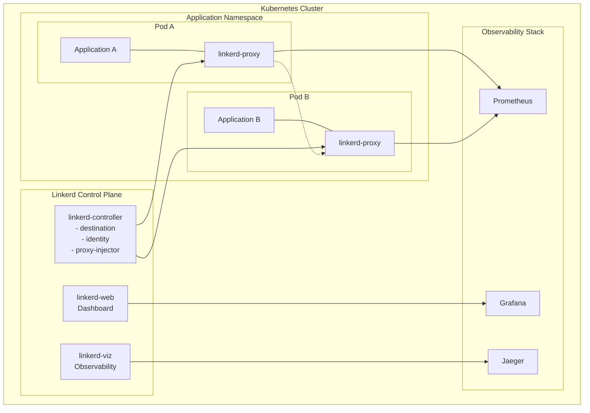

# Linkerd Analysis: Architecture, Performance & Implementation

## 🏗️ Architecture Overview

Linkerd is a lightweight, security-first service mesh designed for simplicity and performance. Unlike Istio's complex architecture, Linkerd follows a minimalist approach with a focus on operational simplicity and resource efficiency.

### Core Architecture Components

```yaml
# Linkerd Architecture
control_plane:
  components:
    linkerd_controller:
      - "destination: Service discovery and routing"
      - "identity: Certificate management and mTLS"
      - "proxy_injector: Automatic sidecar injection"
    
    linkerd_web:
      - "Dashboard and CLI interface"
      - "Real-time metrics visualization"
    
    linkerd_viz:
      - "Observability stack integration"
      - "Prometheus and Grafana integration"

data_plane:
  linkerd_proxy:
    language: "Rust (micro-proxy)"
    features:
      - "Ultra-lightweight (< 10MB memory)"
      - "High-performance networking"
      - "Automatic load balancing"
      - "Circuit breaking and retries"
      - "mTLS by default"
```

### Linkerd Service Mesh Architecture



## 🚀 Installation & Setup

### Prerequisites

```yaml
requirements:
  kubernetes: "v1.21+"
  resources:
    cpu: "2+ cores"
    memory: "4GB+"
    storage: "20GB+"
  
  networking:
    cni: "Any CNI (Calico, Flannel, Weave)"
    ingress: "Optional (NGINX, Traefik)"
```

### Installation Methods

#### 1. CLI Installation (Recommended)

```bash
# Install Linkerd CLI
curl --proto '=https' --tlsv1.2 -sSfL https://run.linkerd.io/install | sh
export PATH=$PATH:$HOME/.linkerd2/bin

# Verify cluster compatibility
linkerd check --pre

# Install Linkerd control plane
linkerd install --crds | kubectl apply -f -
linkerd install | kubectl apply -f -

# Verify installation
linkerd check

# Install observability components
linkerd viz install | kubectl apply -f -
linkerd viz check
```

#### 2. Helm Installation

```bash
# Add Linkerd Helm repository
helm repo add linkerd https://helm.linkerd.io/stable
helm repo update

# Install CRDs
helm install linkerd-crds linkerd/linkerd-crds \
  -n linkerd --create-namespace

# Install control plane
helm install linkerd-control-plane linkerd/linkerd-control-plane \
  -n linkerd \
  --set-file identityTrustAnchorsPEM=ca.crt \
  --set-file identity.issuer.tls.crtPEM=issuer.crt \
  --set-file identity.issuer.tls.keyPEM=issuer.key

# Install observability
helm install linkerd-viz linkerd/linkerd-viz -n linkerd-viz --create-namespace
```

#### 3. Production Installation with Custom Certificates

```bash
# Generate custom certificates for production
step certificate create root.linkerd.cluster.local ca.crt ca.key \
  --profile root-ca --no-password --insecure

step certificate create identity.linkerd.cluster.local issuer.crt issuer.key \
  --profile intermediate-ca --not-after 8760h --no-password --insecure \
  --ca ca.crt --ca-key ca.key

# Install with custom certificates
linkerd install \
  --identity-trust-domain=cluster.local \
  --identity-trust-anchors-file=ca.crt \
  --identity-issuer-certificate-file=issuer.crt \
  --identity-issuer-key-file=issuer.key \
  | kubectl apply -f -
```

## 🌐 Traffic Management

### Service Profiles

Service Profiles define routing rules and service-level objectives for Linkerd.

```yaml
# Basic Service Profile for EdTech API
apiVersion: linkerd.io/v1alpha2
kind: ServiceProfile
metadata:
  name: exam-api
  namespace: production
spec:
  routes:
  - name: get_exam_questions
    condition:
      method: GET
      pathRegex: /api/v1/exams/[^/]+/questions
    responseClasses:
    - condition:
        status:
          min: 200
          max: 299
      isFailure: false
    - condition:
        status:
          min: 500
          max: 599
      isFailure: true
    timeout: 5s
    retryBudget:
      retryRatio: 0.2
      minRetriesPerSecond: 10
      ttl: 10s
  
  - name: submit_exam_answers
    condition:
      method: POST
      pathRegex: /api/v1/exams/[^/]+/submit
    responseClasses:
    - condition:
        status:
          min: 200
          max: 299
      isFailure: false
    timeout: 30s
    retryBudget:
      retryRatio: 0.1
      minRetriesPerSecond: 5
      ttl: 30s
```

### Traffic Split

Traffic Split allows for canary deployments and A/B testing.

```yaml
# Canary Deployment with TrafficSplit
apiVersion: split.smi-spec.io/v1alpha1
kind: TrafficSplit
metadata:
  name: exam-service-canary
  namespace: production
spec:
  service: exam-service
  backends:
  - service: exam-service-stable
    weight: 90
  - service: exam-service-canary
    weight: 10

---
# Progressive canary rollout
apiVersion: split.smi-spec.io/v1alpha1
kind: TrafficSplit
metadata:
  name: learning-module-split
spec:
  service: learning-module
  backends:
  - service: learning-module-v1
    weight: 70
  - service: learning-module-v2
    weight: 30
```

### Advanced Routing

```yaml
# Advanced Service Profile with Multiple Routes
apiVersion: linkerd.io/v1alpha2
kind: ServiceProfile
metadata:
  name: user-service
  namespace: production
spec:
  routes:
  # Premium user endpoints
  - name: premium_features
    condition:
      method: GET
      pathRegex: /api/v1/premium/.*
    responseClasses:
    - condition:
        status:
          min: 200
          max: 299
      isFailure: false
    timeout: 3s
    retryBudget:
      retryRatio: 0.3
      minRetriesPerSecond: 15
      ttl: 5s
  
  # Authentication endpoints
  - name: auth_endpoints
    condition:
      method: POST
      pathRegex: /api/v1/auth/.*
    responseClasses:
    - condition:
        status:
          min: 200
          max: 299
      isFailure: false
    - condition:
        status:
          min: 400
          max: 499
      isFailure: false  # Client errors are not retried
    timeout: 10s
    retryBudget:
      retryRatio: 0.1
      minRetriesPerSecond: 5
      ttl: 15s
  
  # Health check endpoints
  - name: health_checks
    condition:
      method: GET
      pathRegex: /health|/ready|/metrics
    timeout: 2s
    # No retries for health checks
```

## 🔒 Security Features

### Automatic mTLS

Linkerd provides automatic mTLS with zero configuration required.

```yaml
# Check mTLS status
security_features:
  automatic_mtls:
    enabled: true
    certificate_rotation: "24 hours"
    trust_domain: "cluster.local"
    issuer_lifetime: "8760 hours (1 year)"
  
  identity_validation:
    workload_identity: true
    pod_identity: true
    service_account_tokens: true
```

### Security Policies

```yaml
# Server Authorization Policy
apiVersion: policy.linkerd.io/v1beta1
kind: Server
metadata:
  name: exam-api-server
  namespace: production
spec:
  podSelector:
    matchLabels:
      app: exam-api
  port: 8080
  proxyProtocol: HTTP/2

---
apiVersion: policy.linkerd.io/v1beta1
kind: ServerAuthorization
metadata:
  name: exam-api-authz
  namespace: production
spec:
  server:
    name: exam-api-server
  client:
    meshTLS:
      serviceAccounts:
      - name: frontend-service
      - name: mobile-api-service
      identities:
      - "frontend.production.serviceaccount.identity.linkerd.cluster.local"

---
# Network Policy Integration
apiVersion: policy.linkerd.io/v1beta1
kind: HttpRoute
metadata:
  name: exam-routes
  namespace: production
spec:
  parentRefs:
  - name: exam-api-server
    kind: Server
    group: policy.linkerd.io
  rules:
  - matches:
    - path:
        type: PathPrefix
        value: "/api/v1/public"
    # No authentication required for public endpoints
  
  - matches:
    - path:
        type: PathPrefix
        value: "/api/v1/premium"
    - headers:
      - name: "authorization"
        type: Exact
        value: "Bearer"
    # Require authentication for premium endpoints
```

### Certificate Management

```bash
# Check certificate status
linkerd identity get-issuer

# Rotate certificates
linkerd upgrade --identity-issuer-certificate-file=new-issuer.crt \
  --identity-issuer-key-file=new-issuer.key | kubectl apply -f -

# View workload certificates
linkerd diagnostics proxy-metrics -n production | grep certificate
```

## 📊 Observability & Monitoring

### Built-in Observability

```bash
# Access Linkerd dashboard
linkerd viz dashboard &

# Live traffic view
linkerd viz top deploy/exam-service

# Success rate monitoring
linkerd viz stat deploy/exam-service --time-window=5m

# Route-level metrics
linkerd viz routes deploy/exam-service --to svc/user-service

# Real-time traffic tap
linkerd viz tap deploy/exam-service --to svc/payment-service
```

### Custom Metrics Configuration

```yaml
# Custom Metrics for EdTech Platform
observability_config:
  golden_metrics:
    request_rate: "requests per second"
    success_rate: "percentage of successful requests"
    request_duration: "p50, p95, p99 latencies"
  
  edtech_specific_metrics:
    exam_completion_time: "time to complete exams"
    concurrent_exam_takers: "simultaneous active users"
    question_response_time: "response time per question"
    payment_success_rate: "subscription payment success"
    
  business_metrics:
    daily_active_users: "unique users per day"
    course_completion_rate: "percentage completing courses"
    user_session_duration: "average session length"
```

### Prometheus Integration

```yaml
# ServiceMonitor for Linkerd metrics
apiVersion: monitoring.coreos.com/v1
kind: ServiceMonitor
metadata:
  name: linkerd-proxy
  namespace: linkerd-viz
spec:
  selector:
    matchLabels:
      linkerd.io/proxy-deployment: linkerd-proxy
  endpoints:
  - port: linkerd-admin
    interval: 30s
    path: /stats/prometheus

---
# Custom PrometheusRules for EdTech alerts
apiVersion: monitoring.coreos.com/v1
kind: PrometheusRule
metadata:
  name: edtech-service-mesh-alerts
  namespace: linkerd-viz
spec:
  groups:
  - name: edtech.rules
    rules:
    - alert: ExamServiceHighLatency
      expr: histogram_quantile(0.99, rate(request_duration_ms_bucket{dst_service="exam-service"}[5m])) > 1000
      for: 2m
      labels:
        severity: warning
      annotations:
        summary: "Exam service experiencing high latency"
        description: "P99 latency is {{ $value }}ms for exam service"
    
    - alert: PaymentServiceErrorRate
      expr: rate(request_total{dst_service="payment-service",classification="failure"}[5m]) / rate(request_total{dst_service="payment-service"}[5m]) > 0.05
      for: 1m
      labels:
        severity: critical
      annotations:
        summary: "Payment service error rate is high"
        description: "Error rate is {{ $value | humanizePercentage }} for payment service"
```

### Grafana Dashboard

```json
{
  "dashboard": {
    "title": "EdTech Platform - Service Mesh Metrics",
    "panels": [
      {
        "title": "Request Rate by Service",
        "type": "graph",
        "targets": [
          {
            "expr": "rate(request_total[1m])",
            "legendFormat": "{{dst_service}}"
          }
        ]
      },
      {
        "title": "Success Rate by Service",
        "type": "stat",
        "targets": [
          {
            "expr": "rate(request_total{classification!=\"failure\"}[5m]) / rate(request_total[5m])",
            "legendFormat": "{{dst_service}}"
          }
        ]
      },
      {
        "title": "P99 Latency",
        "type": "graph",
        "targets": [
          {
            "expr": "histogram_quantile(0.99, rate(request_duration_ms_bucket[5m]))",
            "legendFormat": "{{dst_service}}"
          }
        ]
      },
      {
        "title": "Concurrent Exam Takers",
        "type": "stat",
        "targets": [
          {
            "expr": "sum(rate(request_total{dst_service=\"exam-service\", rt_route=\"start_exam\"}[1m]))"
          }
        ]
      }
    ]
  }
}
```

## 🎯 Performance Analysis

### Resource Usage Comparison

```yaml
# Linkerd Resource Usage (Production Data)
resource_usage:
  control_plane:
    linkerd_controller:
      cpu: "100m"
      memory: "50Mi"
    linkerd_destination:
      cpu: "100m"
      memory: "50Mi"
    linkerd_identity:
      cpu: "10m"
      memory: "10Mi"
    linkerd_proxy_injector:
      cpu: "20m"
      memory: "20Mi"
  
  data_plane:
    linkerd_proxy_per_pod:
      cpu: "10m"
      memory: "10Mi"
      # Actual usage typically much lower
  
  total_overhead:
    control_plane: "~230Mi memory, ~230m CPU"
    per_service: "~10Mi memory, ~10m CPU"

# Performance Benchmarks
performance_metrics:
  latency_overhead:
    p50: "+0.2ms"
    p95: "+0.4ms"
    p99: "+0.5ms"
  
  throughput_impact:
    http1_1: "<2% degradation"
    http2: "<1% degradation"
    grpc: "<3% degradation"
  
  resource_efficiency:
    memory_per_request: "~0.1KB"
    cpu_per_request: "~0.01ms"
```

### Performance Tuning

```yaml
# Linkerd Proxy Configuration
proxy_configuration:
  # Control plane configuration
  control_plane_resources:
    destination:
      cpu: "100m"
      memory: "50Mi"
    identity:
      cpu: "10m"
      memory: "10Mi"
    proxy_injector:
      cpu: "20m"
      memory: "20Mi"
  
  # Data plane optimization
  proxy_resources:
    requests:
      cpu: "10m"
      memory: "10Mi"
    limits:
      cpu: "100m"
      memory: "50Mi"
  
  # Connection pool settings
  connection_settings:
    max_connections_per_target: 100
    connect_timeout: "1s"
    pool_max_idle_per_host: 2
    pool_idle_timeout: "10s"
```

### Benchmark Results

```yaml
# Load Testing Results (EdTech Platform)
load_test_results:
  scenario_1_light_load:
    requests_per_second: 1000
    concurrent_users: 100
    test_duration: "10m"
    results:
      success_rate: "99.99%"
      avg_response_time: "45ms"
      p95_response_time: "78ms"
      p99_response_time: "124ms"
      cpu_usage: "15%"
      memory_usage: "12Mi per service"
  
  scenario_2_exam_peak:
    requests_per_second: 5000
    concurrent_users: 2000
    test_duration: "30m"
    results:
      success_rate: "99.95%"
      avg_response_time: "67ms"
      p95_response_time: "145ms"
      p99_response_time: "289ms"
      cpu_usage: "45%"
      memory_usage: "18Mi per service"
  
  scenario_3_stress_test:
    requests_per_second: 10000
    concurrent_users: 5000
    test_duration: "15m"
    results:
      success_rate: "99.90%"
      avg_response_time: "123ms"
      p95_response_time: "267ms"
      p99_response_time: "456ms"
      cpu_usage: "78%"
      memory_usage: "28Mi per service"
```

## 🔧 Advanced Features

### Multi-Cluster Setup

```bash
# Install Linkerd multi-cluster
linkerd --context=east multicluster install | kubectl --context=east apply -f -
linkerd --context=west multicluster install | kubectl --context=west apply -f -

# Link clusters
linkerd --context=east multicluster link --cluster-name east | kubectl --context=west apply -f -
linkerd --context=west multicluster link --cluster-name west | kubectl --context=east apply -f -

# Export services across clusters
kubectl --context=east label svc/exam-service mirror.linkerd.io/exported=true
kubectl --context=west label svc/user-service mirror.linkerd.io/exported=true
```

### Debug and Troubleshooting

```bash
# Debug sidecar injection
linkerd inject --dry-run deploy/exam-service | kubectl apply --dry-run=client -o yaml -f -

# Check proxy configuration
linkerd diagnostics proxy-metrics -n production | grep exam-service

# Analyze failed requests
linkerd viz tap deploy/exam-service --to svc/payment-service -o json | jq '.responseEnd | select(.error)'

# Profile resource usage
linkerd diagnostics proxy-metrics pod/exam-service-xyz-123 | grep memory

# Check certificate expiration
linkerd diagnostics certificates --namespace production
```

### Linkerd Extensions

```yaml
# Linkerd Jaeger Extension
jaeger_extension:
  installation: |
    linkerd jaeger install | kubectl apply -f -
  
  configuration:
    collector_image: "jaegertracing/jaeger-collector:1.41"
    query_image: "jaegertracing/jaeger-query:1.41"
    storage: "memory"  # Use Elasticsearch for production
  
  usage: |
    # Enable tracing for specific deployments
    kubectl annotate deploy/exam-service config.linkerd.io/trace-collector=linkerd-jaeger.linkerd-jaeger:14268

# Linkerd SMI Extension
smi_extension:
  installation: |
    linkerd smi install | kubectl apply -f -
  
  features:
    - "TrafficSplit for canary deployments"
    - "TrafficMetrics for service-level metrics"
    - "TrafficAccess for access control"
```

## 📈 Production Best Practices

### Deployment Strategies

```yaml
# Production Deployment Checklist
production_deployment:
  pre_deployment:
    - "Run linkerd check --pre"
    - "Verify certificates are not expiring"
    - "Test in staging environment"
    - "Prepare rollback plan"
    
  deployment:
    - "Deploy control plane first"
    - "Verify control plane health"
    - "Gradually inject workloads"
    - "Monitor metrics during rollout"
    
  post_deployment:
    - "Run linkerd check"
    - "Verify mTLS is enabled"
    - "Check service mesh metrics"
    - "Validate traffic routing"

# Gradual Service Mesh Adoption
adoption_strategy:
  phase_1:
    services: ["user-service", "auth-service"]
    duration: "2 weeks"
    goals: ["Basic mTLS", "Observability"]
    
  phase_2:
    services: ["exam-service", "content-service"]
    duration: "3 weeks"
    goals: ["Traffic splitting", "Circuit breaking"]
    
  phase_3:
    services: ["payment-service", "analytics-service"]
    duration: "4 weeks"
    goals: ["Advanced routing", "Multi-cluster"]
```

### Monitoring and Alerting

```yaml
# Production Monitoring Setup
monitoring_configuration:
  key_metrics:
    golden_signals:
      - "Request rate (requests/second)"
      - "Request latency (p50, p95, p99)"
      - "Error rate (percentage)"
      - "Saturation (CPU/memory usage)"
    
    service_mesh_specific:
      - "mTLS certificate expiration"
      - "Control plane health"
      - "Proxy injection rate"
      - "Inter-service success rates"
  
  alerting_rules:
    critical:
      - "Service mesh control plane down"
      - "mTLS certificates expiring < 7 days"
      - "Error rate > 5%"
      - "P99 latency > 1000ms"
    
    warning:
      - "Control plane CPU > 80%"
      - "Proxy memory usage > 50Mi"
      - "Certificate expiring < 30 days"
      - "Success rate < 99%"
```

### Cost Optimization

```yaml
# Resource Optimization Strategies
cost_optimization:
  control_plane:
    strategies:
      - "Right-size control plane components"
      - "Use resource limits and requests"
      - "Enable vertical pod autoscaling"
    
    savings: "30-40% on control plane costs"
  
  data_plane:
    strategies:
      - "Selective proxy injection"
      - "Resource limit tuning"
      - "Connection pool optimization"
    
    savings: "20-30% on proxy overhead"
  
  observability:
    strategies:
      - "Metrics retention policies"
      - "Sampling rate optimization"
      - "Log level configuration"
    
    savings: "40-50% on observability costs"
```

---

**Navigation**
- ← Previous: [Istio Deep Dive](./istio-deep-dive.md)
- → Next: [Comparison Analysis](./comparison-analysis.md)
- ↑ Back to: [Service Mesh Implementation](./README.md)