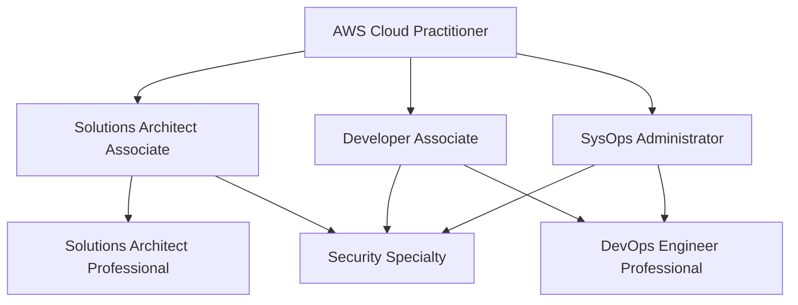

# Professional Development Resources

## Essential Tools, Websites, and Learning Platforms for Software Engineers

This comprehensive resource guide provides curated tools, websites, and platforms essential for software engineers seeking professional growth, especially those transitioning from enterprise environments to startups or modern development practices.

## Learning Platforms and Educational Resources

### Cloud Computing and AWS

**Official AWS Resources:**
- **[AWS Training and Certification](https://aws.amazon.com/training/)** - Free and paid official AWS training courses
- **[AWS Free Tier](https://aws.amazon.com/free/)** - Hands-on practice with 12-month free tier
- **[AWS Well-Architected Framework](https://aws.amazon.com/architecture/well-architected/)** - Best practices for cloud architecture
- **[AWS Whitepapers](https://aws.amazon.com/whitepapers/)** - Technical documentation and case studies
- **[AWS re:Invent Videos](https://reinvent.awsevents.com/)** - Annual conference sessions and technical deep-dives

**Premium Learning Platforms:**
- **[A Cloud Guru](https://acloudguru.com/)** - Comprehensive cloud training with hands-on labs
  - AWS, Azure, GCP certification paths
  - Practical labs and sandbox environments
  - Progress tracking and career guidance
  - Price: $39-49/month

- **[Linux Academy](https://linuxacademy.com/)** - Cloud and DevOps training
  - Advanced Linux, Docker, Kubernetes training
  - Cloud platform specializations
  - Interactive learning paths
  - Price: $49/month

- **[Cloud Academy](https://cloudacademy.com/)** - Cloud skills development
  - Hands-on labs and real-world scenarios
  - Skill assessments and learning paths
  - Team management features
  - Price: $39-59/month

### Programming and Development Skills

**Comprehensive Programming Platforms:**
- **[FreeCodeCamp](https://www.freecodecamp.org/)** - Free programming curriculum
  - Full-stack web development
  - Data science and machine learning
  - Information security
  - Quality assurance
  - **Cost**: Free

- **[Pluralsight](https://www.pluralsight.com/)** - Technology skills development
  - Skill assessments and personalized learning paths
  - Hands-on labs and practice exercises
  - Analytics and progress tracking
  - Price: $29-45/month

- **[Udemy](https://www.udemy.com/)** - Individual course marketplace
  - Wide variety of technology topics
  - Lifetime access to purchased courses
  - Regular sales and discounts
  - Price: $10-200 per course

**Specialized Development Platforms:**
- **[egghead.io](https://egghead.io/)** - Concise programming tutorials
  - React, Angular, Vue.js specialization
  - Short, focused video lessons
  - Expert instructor content
  - Price: $20/month

- **[Frontend Masters](https://frontendmasters.com/)** - Advanced frontend development
  - In-depth workshops by industry experts
  - Modern JavaScript, React, Vue, Angular
  - Computer science fundamentals
  - Price: $39/month

### Machine Learning and Data Science

**Foundational Courses:**
- **[Coursera Machine Learning (Andrew Ng)](https://www.coursera.org/learn/machine-learning)** - Industry-standard ML introduction
  - Mathematical foundations
  - Practical implementation in Octave/MATLAB
  - Real-world applications
  - Price: Free audit, $39-79/month for certificate

- **[Fast.ai](https://www.fast.ai/)** - Practical deep learning approach
  - Top-down learning methodology
  - Focus on practical applications
  - Free online courses
  - **Cost**: Free

**Advanced ML and MLOps:**
- **[Kaggle Learn](https://www.kaggle.com/learn)** - Free micro-courses
  - Python, pandas, machine learning
  - Data visualization and SQL
  - Competition-based learning
  - **Cost**: Free

- **[DataCamp](https://www.datacamp.com/)** - Data science skills
  - Interactive coding challenges
  - R and Python specialization
  - Career tracks and skill assessments
  - Price: $25-35/month

### Professional Certifications

**AWS Certification Path:**


**Other Valuable Certifications:**
- **[Google Cloud Professional Certifications](https://cloud.google.com/certification)**
- **[Microsoft Azure Certifications](https://docs.microsoft.com/en-us/learn/certifications/)**
- **[Kubernetes Certifications (CKA, CKAD, CKS)](https://www.cncf.io/certification/)**
- **[Docker Certified Associate](https://www.docker.com/certification)**

## Development Tools and Productivity

### Code Editors and IDEs

**Visual Studio Code Extensions:**
```json
{
  "recommendations": [
    "ms-vscode.vscode-typescript-next",
    "bradlc.vscode-tailwindcss",
    "ms-python.python",
    "ms-vscode.vscode-json",
    "esbenp.prettier-vscode",
    "ms-vscode.vscode-yaml",
    "redhat.vscode-xml",
    "ms-kubernetes-tools.vscode-kubernetes-tools",
    "ms-vscode-remote.remote-containers",
    "github.copilot",
    "github.copilot-chat"
  ]
}
```

**JetBrains IDEs:**
- **IntelliJ IDEA** - Java, Kotlin, Scala development
- **WebStorm** - JavaScript, TypeScript, React development
- **PyCharm** - Python and data science development
- **DataGrip** - Database management and SQL development

### Version Control and Collaboration

**Git Learning Resources:**
- **[Pro Git Book](https://git-scm.com/book)** - Comprehensive Git documentation
- **[Learn Git Branching](https://learngitbranching.js.org/)** - Interactive Git tutorial
- **[Git Flow Cheatsheet](https://danielkummer.github.io/git-flow-cheatsheet/)** - Git workflow reference

**Advanced Git Tools:**
```bash
# Essential Git aliases for productivity
git config --global alias.co checkout
git config --global alias.br branch
git config --global alias.ci commit
git config --global alias.st status
git config --global alias.unstage 'reset HEAD --'
git config --global alias.last 'log -1 HEAD'
git config --global alias.visual '!gitk'
git config --global alias.lg "log --color --graph --pretty=format:'%Cred%h%Creset -%C(yellow)%d%Creset %s %Cgreen(%cr) %C(bold blue)<%an>%Creset' --abbrev-commit"
```

**GitHub Advanced Features:**
- **GitHub Actions** - CI/CD automation
- **GitHub Codespaces** - Cloud development environments
- **GitHub Copilot** - AI-powered code completion
- **GitHub Security** - Vulnerability scanning and secrets management

### API Development and Testing

**API Development Tools:**
- **[Postman](https://www.postman.com/)** - API development and testing platform
- **[Insomnia](https://insomnia.rest/)** - Simple API client
- **[Thunder Client](https://www.thunderclient.com/)** - VS Code API testing extension
- **[HTTPie](https://httpie.io/)** - Command-line HTTP client

**API Documentation:**
- **[Swagger/OpenAPI](https://swagger.io/)** - API specification and documentation
- **[Postman Documentation](https://learning.postman.com/docs/)** - Collaborative API documentation
- **[Redoc](https://github.com/Redocly/redoc)** - OpenAPI documentation generator

### Database Tools

**Database Management:**
- **[DBeaver](https://dbeaver.io/)** - Universal database tool
- **[TablePlus](https://tableplus.com/)** - Modern database management (macOS/Windows)
- **[pgAdmin](https://www.pgadmin.org/)** - PostgreSQL administration
- **[MongoDB Compass](https://www.mongodb.com/products/compass)** - MongoDB GUI

**Database Learning:**
- **[PostgreSQL Tutorial](https://www.postgresqltutorial.com/)** - Comprehensive PostgreSQL guide
- **[SQL Bolt](https://sqlbolt.com/)** - Interactive SQL tutorial
- **[MongoDB University](https://university.mongodb.com/)** - Free MongoDB courses

## Communication and Collaboration Tools

### Team Communication

**Messaging and Video Conferencing:**
- **[Slack](https://slack.com/)** - Team messaging and integration platform
- **[Discord](https://discord.com/)** - Community and team communication
- **[Microsoft Teams](https://www.microsoft.com/en-us/microsoft-teams/)** - Enterprise collaboration platform
- **[Zoom](https://zoom.us/)** - Video conferencing and webinars

**Productivity and Organization:**
- **[Notion](https://www.notion.so/)** - All-in-one workspace for notes, docs, and project management
- **[Obsidian](https://obsidian.md/)** - Knowledge management and note-taking
- **[Linear](https://linear.app/)** - Modern issue tracking and project management
- **[Jira](https://www.atlassian.com/software/jira)** - Agile project management

### Documentation and Writing

**Technical Writing Tools:**
- **[GitBook](https://www.gitbook.com/)** - Documentation platform with Git integration
- **[Confluence](https://www.atlassian.com/software/confluence)** - Team collaboration and documentation
- **[Markdown Editors](https://typora.io/)** - WYSIWYG markdown editor
- **[Mermaid](https://mermaid-js.github.io/mermaid/)** - Diagram and flowchart generation

**Content Creation:**
```markdown
# Technical Writing Template

## Problem Statement
Clear description of the problem being solved.

## Solution Overview
High-level approach and key decisions.

## Implementation Details
Step-by-step technical implementation.

## Code Examples
```typescript
// Clear, well-commented code examples
interface UserProfile {
  id: string;
  email: string;
  preferences: UserPreferences;
}
```

## Testing Strategy
How to validate the solution works correctly.

## Deployment Guide
Instructions for deploying to production.

## Monitoring and Maintenance
How to monitor and maintain the solution.
```

## Professional Networking and Community

### Developer Communities

**Platform-Specific Communities:**
- **[Stack Overflow](https://stackoverflow.com/)** - Programming Q&A platform
- **[Reddit](https://www.reddit.com/)** - Technology-focused subreddits
  - r/programming - General programming discussions
  - r/webdev - Web development community
  - r/aws - AWS-specific discussions
  - r/MachineLearning - ML and AI community
  - r/startups - Startup advice and networking

**Professional Networks:**
- **[LinkedIn](https://www.linkedin.com/)** - Professional networking and content sharing
- **[Twitter](https://twitter.com/)** - Real-time industry discussions and thought leadership
- **[Dev.to](https://dev.to/)** - Developer community and technical writing platform
- **[Hashnode](https://hashnode.com/)** - Blogging platform for developers

### Conferences and Events

**Major Technology Conferences:**
- **[AWS re:Invent](https://reinvent.awsevents.com/)** - Premier cloud computing conference
- **[Google I/O](https://events.google.com/io/)** - Google's annual developer conference
- **[Microsoft Build](https://mybuild.microsoft.com/)** - Microsoft's annual developer event
- **[KubeCon + CloudNativeCon](https://www.cncf.io/kubecon-cloudnativecon-events/)** - Cloud native technologies

**Startup and Business Conferences:**
- **[TechCrunch Disrupt](https://techcrunch.com/events/)** - Startup and technology innovation
- **[Y Combinator Demo Day](https://www.ycombinator.com/)** - Startup showcases and networking
- **[Product Hunt Maker Festival](https://www.producthunt.com/)** - Product development and entrepreneurship

**Local Meetups and Events:**
- **[Meetup.com](https://www.meetup.com/)** - Local technology meetups and networking
- **[Eventbrite](https://www.eventbrite.com/)** - Technology events and workshops
- **[Facebook Events](https://www.facebook.com/events/)** - Local developer gatherings

## Practice and Skill Validation

### Coding Practice Platforms

**Algorithm and Data Structure Practice:**
- **[LeetCode](https://leetcode.com/)** - Technical interview preparation
  - Coding challenges by difficulty and topic
  - Mock interview sessions
  - Company-specific question sets
  - Price: Free tier available, Premium $35/month

- **[HackerRank](https://www.hackerrank.com/)** - Programming challenges and assessments
  - Skills certification tests
  - Company coding challenges
  - Interview preparation kits
  - **Cost**: Free for basic features

- **[Codewars](https://www.codewars.com/)** - Code challenges and kata
  - Community-driven challenges
  - Multiple programming languages
  - Ranking and progression system
  - **Cost**: Free

**Project-Based Learning:**
- **[Frontend Mentor](https://www.frontendmentor.io/)** - Real-world frontend challenges
- **[Kaggle Competitions](https://www.kaggle.com/competitions)** - Data science and ML competitions
- **[Advent of Code](https://adventofcode.com/)** - Annual programming puzzles

### Portfolio Development

**Portfolio Hosting Platforms:**
- **[Vercel](https://vercel.com/)** - Frontend deployment platform
- **[Netlify](https://www.netlify.com/)** - JAMstack deployment and hosting
- **[GitHub Pages](https://pages.github.com/)** - Free static site hosting
- **[AWS Amplify](https://aws.amazon.com/amplify/)** - Full-stack application deployment

**Portfolio Project Ideas:**
```typescript
// Example portfolio project structure
interface PortfolioProject {
  name: string;
  description: string;
  technologies: Technology[];
  liveUrl: string;
  githubUrl: string;
  challenges: Challenge[];
  learnings: Learning[];
}

const portfolioProjects: PortfolioProject[] = [
  {
    name: "E-commerce Platform",
    description: "Full-stack e-commerce with payment integration",
    technologies: ["React", "Node.js", "PostgreSQL", "Stripe", "AWS"],
    liveUrl: "https://ecommerce-demo.vercel.app",
    githubUrl: "https://github.com/username/ecommerce-platform",
    challenges: ["Payment processing", "Inventory management", "User authentication"],
    learnings: ["State management", "Database design", "Security best practices"]
  },
  {
    name: "MLOps Pipeline",
    description: "End-to-end machine learning deployment pipeline",
    technologies: ["Python", "Docker", "Kubernetes", "MLflow", "AWS SageMaker"],
    liveUrl: "https://ml-pipeline-demo.com",
    githubUrl: "https://github.com/username/mlops-pipeline",
    challenges: ["Model versioning", "Automated retraining", "Production monitoring"],
    learnings: ["MLOps best practices", "Container orchestration", "Model deployment"]
  }
];
```

## Industry News and Trend Tracking

### Technology News Sources

**Daily Tech News:**
- **[Hacker News](https://news.ycombinator.com/)** - Startup and technology discussions
- **[TechCrunch](https://techcrunch.com/)** - Startup news and funding announcements
- **[The Verge](https://www.theverge.com/)** - Technology and culture coverage
- **[Ars Technica](https://arstechnica.com/)** - In-depth technology analysis

**Developer-Focused News:**
- **[InfoQ](https://www.infoq.com/)** - Software development news and trends
- **[DZone](https://dzone.com/)** - Developer tutorials and articles
- **[Smashing Magazine](https://www.smashingmagazine.com/)** - Web development and design
- **[CSS-Tricks](https://css-tricks.com/)** - Frontend development techniques

### Podcasts for Professional Development

**Technology and Programming:**
- **[Software Engineering Daily](https://softwareengineeringdaily.com/)** - Daily tech interviews
- **[The Changelog](https://changelog.com/podcast)** - Open source and software development
- **[Syntax](https://syntax.fm/)** - Web development with Wes Bos and Scott Tolinski
- **[React Podcast](https://reactpodcast.com/)** - React ecosystem discussions

**Career and Leadership:**
- **[Manager Tools](https://www.manager-tools.com/)** - Management and leadership skills
- **[The Tim Ferriss Show](https://tim.blog/podcast/)** - High-performance habits and strategies
- **[Masters of Scale](https://mastersofscale.com/)** - Startup scaling stories and strategies

### Newsletter Subscriptions

**Technical Newsletters:**
- **[JavaScript Weekly](https://javascriptweekly.com/)** - JavaScript news and tutorials
- **[Python Weekly](https://www.pythonweekly.com/)** - Python ecosystem updates
- **[AWS Weekly](https://awsweekly.com/)** - AWS news and resources
- **[Kubernetes Weekly](https://kubeweekly.io/)** - Kubernetes ecosystem updates

**Industry and Career:**
- **[Morning Brew](https://www.morningbrew.com/)** - Business and technology news
- **[First Round Review](https://review.firstround.com/)** - Startup advice and insights
- **[Stratechery](https://stratechery.com/)** - Technology analysis and strategy

## Learning Path Organization

### Time Management for Continuous Learning

**Daily Learning Schedule (1-2 hours):**
```typescript
interface DailyLearningPlan {
  morning: {
    duration: '30 minutes';
    activity: 'Industry news and trend reading';
    sources: ['Hacker News', 'dev.to', 'LinkedIn feed'];
  };
  
  lunch: {
    duration: '30 minutes';
    activity: 'Technical tutorial or documentation';
    focus: 'Specific skill development';
  };
  
  evening: {
    duration: '60 minutes';
    activity: 'Hands-on practice or project work';
    projects: ['Portfolio development', 'Open source contribution'];
  };
}
```

**Weekly Learning Goals:**
- **Monday**: New technology exploration and research
- **Tuesday**: Hands-on coding practice and challenges
- **Wednesday**: Professional development and networking
- **Thursday**: Documentation and technical writing
- **Friday**: Portfolio project development
- **Weekend**: Open source contributions and community engagement

### Progress Tracking Tools

**Learning Management:**
- **[Notion Templates](https://www.notion.so/templates)** - Learning dashboard and progress tracking
- **[Obsidian](https://obsidian.md/)** - Knowledge graph and note connections
- **[Anki](https://apps.ankiweb.net/)** - Spaced repetition for technical concepts
- **[Forest](https://www.forestapp.cc/)** - Focus and productivity tracking

**Goal Setting Framework:**
```yaml
Quarter_Goals:
  Technical_Skills:
    - Complete AWS Solutions Architect Associate
    - Build MLOps pipeline project
    - Contribute to 3 open source projects
  
  Professional_Development:
    - Publish 4 technical blog posts
    - Speak at 1 local meetup
    - Expand network by 25 connections
  
  Career_Advancement:
    - Update portfolio with 2 new projects
    - Complete 10 technical interviews
    - Research 20 target companies
```

---

## Navigation

← [Back to Startup Transition Guide](./startup-transition-guide.md)  
→ [Next: Soft Skills & Workplace Behavior](./soft-skills-workplace-behavior.md)

**Related Resource Guides:**
- [AWS Certification Resources](../aws-certification-fullstack-devops/implementation-guide.md)
- [Technical Interview Resources](../technical-interview-questions/README.md)
- [Portfolio Development Resources](../portfolio-driven-open-source-strategy/README.md)