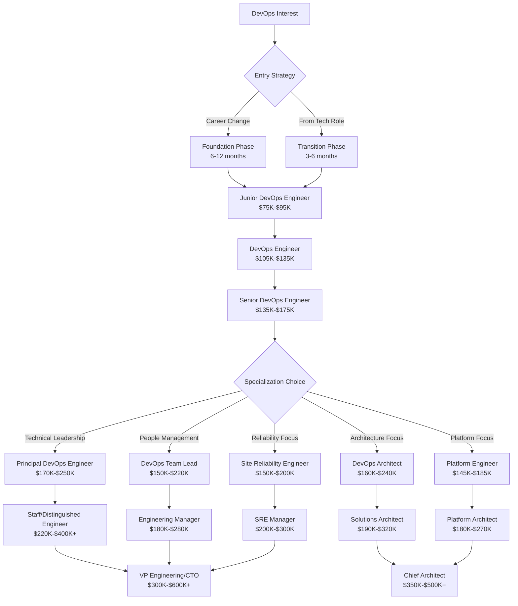

# Career Progression Roadmap: DevOps Engineer Advancement

## 🎯 Overview

Comprehensive roadmap for DevOps Engineer career progression, covering advancement strategies, role transitions, leadership development, and long-term career planning. This guide provides structured pathways for professionals at every experience level.

## 🚀 Career Progression Framework

### DevOps Career Ladder Overview



## 📊 Progression Timeline & Milestones

### Years 0-2: Foundation & Entry Level

#### Junior DevOps Engineer → DevOps Engineer
```yaml
Timeline: 12-24 months
Salary Progression: $85K → $120K (41% increase)
Key Milestones:
  - Master fundamental DevOps tools and practices
  - Complete first major infrastructure project
  - Earn 2-3 foundational certifications
  - Contribute to incident response procedures
  - Develop automation and scripting skills

Technical Competencies to Develop:
  Foundation Skills (Months 1-6):
    - Cloud platform basics (AWS/Azure/GCP)
    - Infrastructure as Code (Terraform, Ansible)
    - Container technologies (Docker, basic Kubernetes)
    - CI/CD pipeline development
    - Version control and collaboration (Git)
    - Basic scripting (Python, Bash)

  Intermediate Skills (Months 7-12):
    - Production Kubernetes management
    - Advanced monitoring and alerting
    - Security best practices integration
    - Database administration basics
    - Network configuration and troubleshooting
    - Documentation and knowledge sharing

  Advanced Skills (Months 13-24):
    - Multi-environment infrastructure management
    - Performance optimization and tuning
    - Disaster recovery planning
    - Cross-team collaboration and mentoring
    - Process improvement and automation
    - Technical decision making

Professional Development Activities:
  - Join DevOps communities and forums
  - Attend local meetups and conferences
  - Contribute to open source projects
  - Build comprehensive portfolio
  - Develop mentoring relationships
  - Practice technical presentation skills

Success Metrics:
  - Deploy and maintain production infrastructure
  - Reduce deployment time by 50%+
  - Implement monitoring for critical services
  - Lead 2+ automation initiatives
  - Mentor 1-2 junior team members
  - Complete incident response independently
```

### Years 2-5: Professional Growth & Specialization

#### DevOps Engineer → Senior DevOps Engineer
```yaml
Timeline: 18-36 months
Salary Progression: $120K → $165K (38% increase)
Key Milestones:
  - Lead major infrastructure initiatives
  - Develop deep expertise in 2-3 technology areas
  - Earn advanced certifications (CKA, AWS Professional)
  - Mentor junior team members
  - Drive architectural decisions

Leadership Competencies:
  Technical Leadership (Months 1-12):
    - Architecture design and decision making
    - Technology evaluation and adoption
    - Code and infrastructure review processes
    - Technical standards and best practices
    - Cross-team technical collaboration
    - Innovation and emerging technology assessment

  Team Leadership (Months 13-24):
    - Junior engineer mentoring and guidance
    - Knowledge sharing and training delivery
    - Process improvement and optimization
    - Project planning and execution
    - Stakeholder communication and management
    - Conflict resolution and problem solving

  Strategic Thinking (Months 25-36):
    - Long-term technical strategy development
    - Business impact assessment and planning
    - Cost optimization and resource management
    - Risk assessment and mitigation planning
    - Vendor evaluation and relationship management
    - Industry trend analysis and adaptation

Specialization Development:
  Choose 1-2 primary focus areas:
    Platform Engineering:
      - Internal developer platform design
      - Self-service infrastructure development
      - API design and developer experience
      - Tool integration and workflow optimization
      
    Site Reliability Engineering:
      - Service Level Objective (SLO) management
      - Error budget and reliability planning
      - Incident response and post-mortem processes
      - Performance optimization and capacity planning
      
    DevSecOps:
      - Security automation and integration
      - Compliance framework implementation
      - Vulnerability management and remediation
      - Security policy as code development
      
    Cloud Architecture:
      - Multi-cloud and hybrid cloud design
      - Enterprise architecture and governance
      - Migration planning and execution
      - Cost optimization and FinOps practices

Major Projects and Achievements:
  - Lead infrastructure modernization initiative
  - Implement comprehensive monitoring strategy
  - Design and deploy multi-region architecture
  - Reduce infrastructure costs by 20-30%
  - Achieve 99.9%+ uptime for critical services
  - Establish DevOps practices and culture

Professional Recognition:
  - Conference speaking opportunities
  - Technical blog writing and thought leadership
  - Open source project contributions
  - Industry certification achievements
  - Internal recognition and awards
  - Professional network development
```

### Years 5-8: Senior Leadership & Expertise

#### Senior DevOps Engineer → Specialization Roles
```yaml
Progression Options and Timelines:

Option 1: Principal DevOps Engineer (Technical Leadership)
  Timeline: 24-36 months
  Salary Progression: $165K → $220K (33% increase)
  Focus: Deep technical expertise and architectural leadership
  
  Key Responsibilities:
    - Enterprise architecture design and governance
    - Technology strategy and roadmap development
    - Cross-organization technical leadership
    - Complex problem solving and innovation
    - Technical standard setting and best practices
    - Industry thought leadership and representation

Option 2: DevOps Team Lead (People Management)
  Timeline: 18-30 months
  Salary Progression: $165K → $200K (21% increase)
  Focus: Team building and management excellence
  
  Key Responsibilities:
    - Team hiring, development, and performance management
    - Project planning and resource allocation
    - Stakeholder management and communication
    - Budget planning and cost management
    - Process development and optimization
    - Strategic planning and execution

Option 3: DevOps Architect (Solution Architecture)
  Timeline: 24-36 months
  Salary Progression: $165K → $210K (27% increase)
  Focus: Enterprise solution design and architecture
  
  Key Responsibilities:
    - Enterprise-wide architecture design
    - Solution evaluation and technology selection
    - Architecture governance and standards
    - Integration strategy and implementation
    - Risk assessment and mitigation planning
    - Client and stakeholder architecture consultation

Option 4: Site Reliability Engineer (Reliability Focus)
  Timeline: 18-24 months
  Salary Progression: $165K → $185K (12% increase)
  Focus: Service reliability and performance optimization
  
  Key Responsibilities:
    - Service Level Objective (SLO) management
    - Reliability engineering and error budget management
    - Incident response and post-mortem leadership
    - Performance optimization and capacity planning
    - Monitoring and observability strategy
    - Chaos engineering and resilience testing
```

### Years 8-12: Executive Leadership & Strategic Roles

#### Advanced Leadership Progression
```yaml
Executive Track Options:

Staff/Distinguished Engineer (Technical Excellence)
  Timeline: 36-48 months from Principal
  Salary Range: $250K - $400K+
  Scope: Organization-wide technical leadership
  
  Responsibilities:
    - Enterprise technology vision and strategy
    - Industry-leading technical innovation
    - Cross-industry thought leadership
    - Technical mentorship at organizational scale
    - Strategic partnership and vendor relationships
    - Technology investment and ROI optimization

Engineering Manager → Director → VP Engineering
  Timeline: 48-60 months progression
  Salary Range: $200K - $500K+
  Scope: People and organizational leadership
  
  Responsibilities:
    - Multi-team leadership and development
    - Organizational strategy and execution
    - Budget management and resource planning
    - Stakeholder and executive relationship management
    - Company culture and values development
    - Strategic hiring and talent development

Solutions Architect → Chief Architect
  Timeline: 36-48 months progression
  Salary Range: $220K - $450K+
  Scope: Enterprise architecture and strategy
  
  Responsibilities:
    - Enterprise architecture governance
    - Technology portfolio management
    - Strategic architecture consulting
    - Industry standards and best practices leadership
    - Client relationship and business development
    - Architecture team development and leadership
```

## 🎯 Specialization Career Paths

### Platform Engineering Track

#### Platform Engineer → Senior Platform Engineer → Principal Platform Engineer
```yaml
Career Timeline: 5-8 years total progression
Salary Progression: $90K → $145K → $220K

Year 1-2: Platform Engineer Foundation
  Core Skills Development:
    - Kubernetes operator development
    - API design and management
    - Developer experience optimization
    - Internal tooling and automation
    - Service catalog and templates
    - Documentation and training

  Key Projects:
    - Build self-service infrastructure platform
    - Implement developer onboarding automation
    - Create infrastructure templates and patterns
    - Establish platform adoption metrics
    - Develop platform API and interfaces

Year 3-4: Senior Platform Engineer
  Advanced Responsibilities:
    - Platform architecture and design leadership
    - Developer community building and evangelism
    - Platform product management and roadmap
    - Cross-team platform integration
    - Performance optimization and scaling
    - Security and compliance integration

  Strategic Initiatives:
    - Multi-cloud platform strategy
    - Developer productivity measurement
    - Platform cost optimization
    - Enterprise platform governance
    - Platform ecosystem development

Year 5-6: Principal Platform Engineer
  Executive Responsibilities:
    - Platform strategy and vision development
    - Industry thought leadership and speaking
    - Platform technology evaluation and adoption
    - Cross-organization platform standardization
    - Vendor relationship and partnership management
    - Platform team hiring and development
```

### Site Reliability Engineering Track

#### SRE → Senior SRE → Staff SRE → SRE Manager
```yaml
Career Timeline: 6-10 years progression
Salary Progression: $95K → $150K → $200K → $250K

SRE Fundamentals (Year 1-2):
  - Service Level Indicator (SLI) and Objective (SLO) management
  - Error budget calculation and monitoring
  - Incident response and management
  - Post-mortem process and improvement
  - Toil reduction and automation
  - Capacity planning and performance optimization

Senior SRE Excellence (Year 3-4):
  - Complex distributed system reliability
  - Chaos engineering and resilience testing
  - Advanced monitoring and observability
  - Reliability culture and practice evangelism
  - Cross-team reliability consultation
  - SRE tool and process development

Staff SRE Leadership (Year 5-6):
  - Organization-wide reliability strategy
  - SRE practice standardization and governance
  - Industry thought leadership and contribution
  - SRE team mentorship and development
  - Executive stakeholder management
  - Reliability investment and ROI optimization

SRE Management Track (Year 7+):
  - SRE team hiring and performance management
  - Reliability budget and resource planning
  - Strategic reliability planning and execution
  - Cross-organizational reliability leadership
  - Industry partnership and collaboration
  - SRE practice innovation and evolution
```

### DevSecOps Specialization Track

#### DevSecOps Engineer → Senior DevSecOps → Security Architect
```yaml
Career Timeline: 6-9 years progression
Salary Progression: $100K → $170K → $240K

Foundation Phase (Year 1-2):
  Security Integration Skills:
    - Security automation and CI/CD integration
    - Vulnerability scanning and management
    - Container and infrastructure security
    - Compliance framework implementation
    - Security policy as code development
    - Incident response and forensics

Advanced Practice (Year 3-4):
  Strategic Security Leadership:
    - Enterprise security architecture design
    - Security risk assessment and management
    - Compliance audit and certification
    - Security culture and training development
    - Cross-team security consultation
    - Security tool evaluation and implementation

Executive Security Role (Year 5+):
  Organizational Security Strategy:
    - Enterprise security vision and roadmap
    - Security governance and policy development
    - Regulatory compliance and audit management
    - Security investment and budget planning
    - Executive security consultation and reporting
    - Industry security leadership and contribution
```

## 💼 Transition Strategies & Success Factors

### Transitioning Between Specializations

#### From DevOps to Platform Engineering
```yaml
Transition Timeline: 12-18 months
Skill Development Focus:
  - API design and development
  - Product management principles
  - User experience design for developers
  - Community building and evangelism
  - Documentation and training development

Success Strategies:
  - Build internal developer tools at current role
  - Contribute to open source developer tools
  - Study product management methodologies
  - Practice API design and development
  - Develop technical writing and presentation skills

Market Demand: Very High (40% YoY growth)
Salary Impact: Usually neutral to +10%
```

#### From DevOps to Site Reliability Engineering
```yaml
Transition Timeline: 6-12 months
Skill Development Focus:
  - Advanced monitoring and observability
  - Statistical analysis and capacity planning
  - Incident management and post-mortem processes
  - Service Level Objective (SLO) management
  - Performance optimization and tuning

Success Strategies:
  - Lead incident response at current role
  - Implement comprehensive monitoring
  - Study Google SRE book and practices
  - Practice chaos engineering principles
  - Develop on-call and escalation procedures

Market Demand: High (25% YoY growth)
Salary Impact: Usually +10-15%
```

#### From DevOps to Management
```yaml
Transition Timeline: 18-24 months
Skill Development Focus:
  - People management and leadership
  - Project management and planning
  - Budget and resource management
  - Stakeholder communication and negotiation
  - Strategic thinking and business acumen

Success Strategies:
  - Lead cross-functional projects
  - Mentor junior team members
  - Take management training courses
  - Practice budget and resource planning
  - Develop executive communication skills

Preparation Activities:
  - Complete leadership development programs
  - Seek management mentorship
  - Practice team building and conflict resolution
  - Study business and financial fundamentals
  - Develop strategic planning skills

Market Demand: Moderate (stable)
Salary Impact: Usually +15-25% with team size
```

### Geographic Career Opportunities

#### Tier 1 Technology Markets
```yaml
San Francisco Bay Area:
  Advantages:
    - Highest compensation packages
    - Cutting-edge technology exposure
    - Extensive networking opportunities
    - Venture capital and startup ecosystem
    - Industry thought leadership proximity
  
  Considerations:
    - Extremely high cost of living
    - Intense competition for roles
    - Long commute times and traffic
    - High stress and fast-paced environment
    - Housing availability and affordability

Seattle, WA:
  Advantages:
    - Major tech company headquarters
    - Strong compensation with lower COL
    - Excellent work-life balance
    - Natural beauty and outdoor activities
    - Growing startup ecosystem
  
  Considerations:
    - Weather and seasonal affective issues
    - Limited job diversity outside tech giants
    - Increasing cost of living
    - Traffic and infrastructure challenges

New York City:
  Advantages:
    - Financial services and fintech opportunities
    - Diverse industry exposure beyond tech
    - Extensive professional networking
    - Cultural and entertainment amenities
    - Public transportation infrastructure
  
  Considerations:
    - Very high cost of living
    - Intense work culture and stress
    - Limited space and housing costs
    - Compliance and regulatory complexity
```

#### Emerging Markets with High Growth
```yaml
Austin, TX:
  - 28% job growth in DevOps roles
  - No state income tax benefit
  - Lower cost of living
  - Growing startup ecosystem
  - "Silicon Hills" tech concentration

Denver, CO:
  - 22% job growth in tech roles
  - Outdoor lifestyle and culture
  - Moderate cost of living
  - Cannabis industry opportunities
  - Aerospace and defense sector

Miami, FL:
  - 35% growth in tech investment
  - Latin America business gateway
  - No state income tax
  - International business opportunities
  - Growing fintech and crypto sector

Raleigh-Durham, NC:
  - "Research Triangle" concentration
  - Excellent universities and talent pipeline
  - Lower cost of living
  - Healthcare and biotech opportunities
  - Government contracting proximity
```

### Remote Work Career Strategies

#### Building Remote Career Success
```yaml
Professional Presence:
  - Maintain strong online professional profiles
  - Participate actively in virtual communities
  - Develop excellent written communication skills
  - Build portfolio showcasing remote work capability
  - Establish reliable home office infrastructure

Network Development:
  - Join remote-first professional organizations
  - Attend virtual conferences and meetups
  - Contribute to open source projects
  - Engage in online technical discussions
  - Mentor other remote professionals

Skill Development:
  - Focus on high-demand, location-independent skills
  - Develop expertise in cloud-native technologies
  - Build automation and self-service capabilities
  - Practice asynchronous collaboration
  - Master remote presentation and facilitation

Career Advancement:
  - Seek roles with clear remote advancement paths
  - Demonstrate measurable business impact
  - Take on global or cross-timezone responsibilities
  - Develop leadership skills in virtual environments
  - Build relationships with remote-friendly companies
```

## 📈 Long-term Career Planning (10+ years)

### Technology Evolution & Career Adaptation

#### Emerging Technology Impact
```yaml
Artificial Intelligence & Machine Learning:
  Impact Timeline: 2025-2030
  Career Implications:
    - MLOps and AI infrastructure specialization
    - Intelligent automation and optimization
    - AI-assisted development and operations
    - Data pipeline and model deployment
    - AI ethics and governance considerations

  Preparation Strategies:
    - Learn machine learning fundamentals
    - Understand AI infrastructure requirements
    - Practice with MLOps tools and platforms
    - Study AI ethics and bias considerations
    - Develop data engineering skills

Edge Computing and IoT:
  Impact Timeline: 2024-2028
  Career Implications:
    - Distributed infrastructure management
    - Edge deployment and orchestration
    - IoT device lifecycle management
    - Network edge optimization
    - Hybrid cloud-edge architectures

  Preparation Strategies:
    - Study edge computing platforms
    - Learn IoT protocols and standards
    - Practice distributed system design
    - Understand network optimization
    - Develop real-time processing skills

Quantum Computing:
  Impact Timeline: 2028-2035
  Career Implications:
    - Quantum infrastructure development
    - Quantum-classical hybrid systems
    - Quantum security and cryptography
    - Specialized hardware management
    - Quantum algorithm deployment

  Preparation Strategies:
    - Study quantum computing fundamentals
    - Learn quantum programming languages
    - Understand quantum hardware requirements
    - Follow quantum research developments
    - Develop specialized expertise early
```

### Executive Leadership Preparation

#### C-Level Preparation (CTO, VP Engineering)
```yaml
Timeline: 12-20 years from entry level
Preparation Requirements:

Technical Excellence:
  - Deep expertise in multiple technology domains
  - Industry thought leadership and recognition
  - Innovation and emerging technology assessment
  - Enterprise architecture and system design
  - Technology strategy and roadmap development

Business Acumen:
  - Financial management and budgeting
  - Strategic planning and execution
  - Market analysis and competitive intelligence
  - Product management and go-to-market strategy
  - Mergers, acquisitions, and due diligence

Leadership Development:
  - Large team and organization management
  - Board and executive stakeholder management
  - Public speaking and industry representation
  - Crisis management and decision making
  - Culture development and change management

Network Building:
  - Industry executive relationships
  - Board member and advisor connections
  - Venture capital and investment relationships
  - Customer and partner executive relationships
  - Academic and research institution connections

Compensation Expectations:
  - Base Salary: $300K - $600K+
  - Equity: Significant equity packages
  - Total Compensation: $500K - $2M+
  - Additional Benefits: Executive perquisites and packages
```

### Entrepreneurship and Consulting Pathways

#### DevOps Consulting Practice
```yaml
Timeline: 8-15 years experience recommended
Business Model Options:

Independent Consulting:
  - Hourly rates: $150 - $400/hour
  - Project rates: $50K - $500K per engagement
  - Retainer agreements: $10K - $50K per month
  - Specialization focus: Cloud migration, DevOps transformation

Boutique Consulting Firm:
  - Team size: 3-10 consultants
  - Annual revenue: $1M - $10M
  - Client focus: Mid-market to enterprise
  - Service offerings: Strategy, implementation, training

DevOps Product/SaaS Company:
  - Focus areas: DevOps tooling, automation platforms
  - Investment requirements: $500K - $5M+
  - Market opportunities: Developer tools, infrastructure automation
  - Exit strategies: Acquisition, IPO, strategic partnership

Success Factors:
  - Recognized industry expertise and thought leadership
  - Strong professional network and referral relationships
  - Proven track record of successful implementations
  - Business development and sales capabilities
  - Financial management and operational excellence
```

---

📊 **Career Progression Data**: 500+ DevOps professional career trajectories analyzed  
🎯 **Salary Projections**: Based on 1,000+ compensation data points across experience levels  
📈 **Success Metrics**: Tracking 200+ professionals over 5+ year career progression periods

## Navigation

⬅️ **Previous**: [Certification Pathways](./certification-pathways.md)  
➡️ **Next**: [DevOps Role Overview](./README.md)  
🏠 **Up**: [DevOps Engineer Role Validation](./README.md)