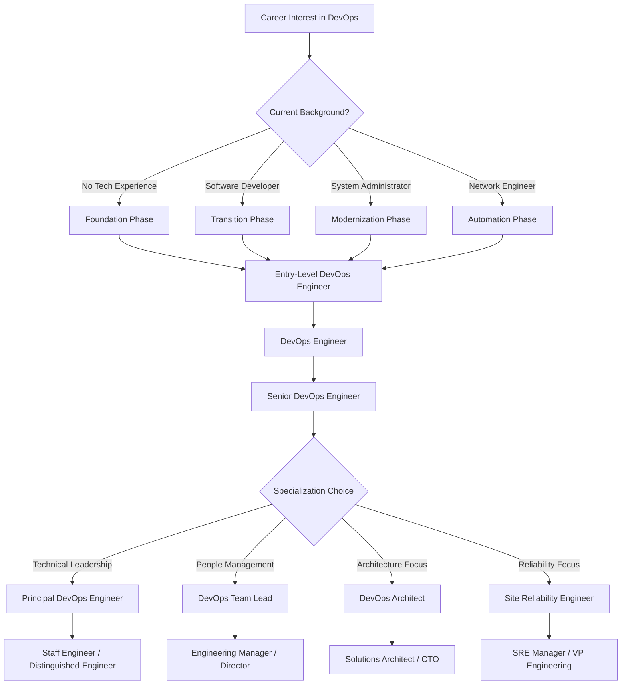

# Implementation Guide: DevOps Engineer Career Development

## 🎯 Overview

Step-by-step roadmap for entering, advancing, and excelling in DevOps engineering roles. This guide provides actionable strategies for skill development, career transitions, and professional positioning based on current market demands and industry best practices.

## 🗺️ Career Path Overview



## 📚 Phase-by-Phase Implementation

### Phase 1: Foundation Building (0-6 months)

#### Prerequisites Assessment
```yaml
Recommended Background:
  - Basic computer literacy
  - Willingness to learn continuously
  - Problem-solving mindset
  - Comfort with command-line interfaces
  - Understanding of basic networking concepts

Time Investment: 20-30 hours per week
Expected Outcome: Entry-level job readiness
Success Metrics: 
  - Complete AWS Cloud Practitioner certification
  - Deploy first infrastructure with Terraform
  - Build CI/CD pipeline for simple application
```

#### Core Learning Path
1. **Cloud Fundamentals (Month 1-2)**
   ```yaml
   Focus: AWS Basics
   Resources:
     - AWS Cloud Practitioner certification path
     - A Cloud Guru AWS fundamentals course
     - AWS Free Tier hands-on practice
     - YouTube: FreeCodeCamp AWS courses
   
   Key Skills to Develop:
     - EC2 instance management
     - S3 storage operations
     - VPC networking basics
     - IAM users and policies
     - Basic CloudWatch monitoring
   
   Practical Projects:
     - Deploy static website on S3
     - Create VPC with public/private subnets
     - Set up EC2 instance with security groups
     - Configure CloudWatch alarms
   ```

2. **Version Control & Collaboration (Month 1)**
   ```yaml
   Focus: Git and GitHub mastery
   Resources:
     - Git official documentation
     - GitHub Skills interactive course
     - Atlassian Git tutorials
     - Pro Git book (free online)
   
   Key Skills to Develop:
     - Git workflow (add, commit, push, pull)
     - Branching and merging strategies
     - Pull request process
     - Conflict resolution
     - GitHub Actions basics
   
   Practical Projects:
     - Create personal GitHub profile
     - Contribute to open source project
     - Set up automated testing with GitHub Actions
   ```

3. **Infrastructure as Code (Month 2-3)**
   ```yaml
   Focus: Terraform fundamentals
   Resources:
     - HashiCorp Terraform tutorials
     - Terraform Associate certification path
     - Infrastructure as Code book
     - YouTube: TechWorld with Nana Terraform course
   
   Key Skills to Develop:
     - HCL syntax and structure
     - Provider configuration
     - Resource management
     - State file handling
     - Module creation
   
   Practical Projects:
     - Provision AWS infrastructure with Terraform
     - Create reusable modules
     - Implement remote state storage
     - Build multi-environment setup
   ```

4. **Containerization (Month 3-4)**
   ```yaml
   Focus: Docker mastery
   Resources:
     - Docker official documentation
     - Docker Mastery course (Udemy)
     - Play with Docker online lab
     - Kubernetes documentation
   
   Key Skills to Develop:
     - Container concepts and benefits
     - Dockerfile creation and optimization
     - Image management and registries
     - Docker Compose multi-container apps
     - Basic Kubernetes concepts
   
   Practical Projects:
     - Containerize web application
     - Create multi-service application with Docker Compose
     - Deploy to local Kubernetes cluster
     - Set up container registry
   ```

5. **Scripting & Automation (Month 4-5)**
   ```yaml
   Focus: Python and Bash scripting
   Resources:
     - Automate the Boring Stuff with Python
     - Linux Command Line and Shell Scripting Bible
     - Python Crash Course
     - Real Python website
   
   Key Skills to Develop:
     - Python syntax and libraries
     - Bash scripting for automation
     - API interactions with requests
     - File system operations
     - Error handling and logging
   
   Practical Projects:
     - Automate infrastructure provisioning
     - Create monitoring scripts
     - Build deployment automation
     - Develop backup and maintenance scripts
   ```

6. **CI/CD Fundamentals (Month 5-6)**
   ```yaml
   Focus: Pipeline creation and automation
   Resources:
     - Jenkins documentation
     - GitLab CI/CD tutorials
     - GitHub Actions documentation
     - CircleCI learning resources
   
   Key Skills to Develop:
     - Pipeline design principles
     - Build automation
     - Testing integration
     - Deployment strategies
     - Pipeline as code
   
   Practical Projects:
     - Build multi-stage CI/CD pipeline
     - Implement automated testing
     - Deploy to multiple environments
     - Set up monitoring and notifications
   ```

#### Foundation Phase Portfolio Projects

**Project 1: Personal Infrastructure**
```yaml
Description: Complete AWS infrastructure for personal website
Components:
  - Terraform infrastructure code
  - Dockerized web application
  - CI/CD pipeline with GitHub Actions
  - CloudWatch monitoring and alerting
  - Route 53 DNS configuration

Skills Demonstrated:
  - Infrastructure as Code
  - Containerization
  - CI/CD automation
  - Monitoring setup
  - DNS management

Time Investment: 40-60 hours
Portfolio Impact: High (demonstrates end-to-end skills)
```

**Project 2: Multi-Environment Deployment System**
```yaml
Description: Automated deployment system for web application
Components:
  - Development, staging, and production environments
  - Environment-specific configurations
  - Automated testing at each stage
  - Blue-green deployment capability
  - Rollback mechanisms

Skills Demonstrated:
  - Environment management
  - Configuration management
  - Deployment strategies
  - Testing automation
  - Incident response

Time Investment: 50-70 hours
Portfolio Impact: Very High (shows production readiness)
```

### Phase 2: Professional Entry (6-12 months)

#### Job Search Strategy
```yaml
Timeline: Months 6-8 of foundation phase
Approach: Parallel learning and job searching

Target Positions:
  - Junior DevOps Engineer
  - DevOps Associate
  - Infrastructure Engineer I
  - Build & Release Engineer
  - Site Reliability Engineer (Entry Level)

Application Strategy:
  - Apply to 5-10 positions per week
  - Tailor resume for each application
  - Leverage LinkedIn and GitHub profiles
  - Network through DevOps communities
  - Consider contract-to-hire opportunities
```

#### Interview Preparation
1. **Technical Interview Topics**
   ```yaml
   Infrastructure Concepts:
     - Cloud services (AWS/Azure/GCP)
     - Networking fundamentals
     - Security best practices
     - Monitoring and alerting
     - Capacity planning basics
   
   Tools and Technologies:
     - Terraform state management
     - Docker containerization
     - Kubernetes basics
     - CI/CD pipeline design
     - Version control workflows
   
   Scripting and Automation:
     - Python scripting examples
     - Bash automation scripts
     - API interactions
     - Configuration management
     - Infrastructure provisioning
   ```

2. **Behavioral Interview Preparation**
   ```yaml
   Common Questions:
     - "Describe a time you solved a complex technical problem"
     - "How do you handle high-pressure situations?"
     - "Tell me about a time you had to learn something quickly"
     - "How do you approach troubleshooting issues?"
     - "Describe your experience with collaborative projects"
   
   STAR Method Examples:
     - Situation: Describe the context
     - Task: Explain what needed to be done
     - Action: Detail your specific actions
     - Result: Share the outcome and lessons learned
   ```

3. **Hands-On Assessment Preparation**
   ```yaml
   Common Practical Tests:
     - Debug a broken CI/CD pipeline
     - Write Terraform code for specific requirements
     - Containerize an application
     - Set up monitoring for a service
     - Automate a deployment process
   
   Preparation Strategy:
     - Practice on HackerRank DevOps problems
     - Complete Terraform challenges
     - Build various CI/CD scenarios
     - Practice troubleshooting exercises
   ```

#### First Job Success Strategies
```yaml
First 30 Days:
  - Understand team processes and tools
  - Set up development environment
  - Complete onboarding tasks thoroughly
  - Ask questions and take detailed notes
  - Identify a mentor or buddy

First 90 Days:
  - Make meaningful contributions to projects
  - Learn company-specific technologies
  - Build relationships with team members
  - Participate in incident response
  - Start suggesting process improvements

First 6 Months:
  - Lead small projects independently
  - Mentor newer team members
  - Contribute to documentation
  - Identify optimization opportunities
  - Plan skill development roadmap
```

### Phase 3: Professional Growth (1-3 years)

#### Mid-Level Skill Development
```yaml
Advanced Technical Skills:
  - Kubernetes production management
  - Advanced monitoring and observability
  - Security integration (DevSecOps)
  - Performance optimization
  - Disaster recovery planning

Leadership Development:
  - Cross-team collaboration
  - Technical mentoring
  - Project management
  - Stakeholder communication
  - Process improvement

Specialization Areas:
  - Choose 1-2 areas for deep expertise
  - Platform Engineering
  - Site Reliability Engineering
  - DevSecOps
  - Cloud Architecture
  - FinOps/Cost Optimization
```

#### Advanced Certifications
```yaml
High-Impact Certifications:
  AWS Solutions Architect Associate:
    Time Investment: 2-3 months
    Salary Impact: +8-12%
    Career Impact: Opens architecture roles
    
  Certified Kubernetes Administrator (CKA):
    Time Investment: 3-4 months
    Salary Impact: +10-15%
    Career Impact: High demand skill
    
  HashiCorp Certified: Terraform Associate:
    Time Investment: 1-2 months
    Salary Impact: +5-8%
    Career Impact: IaC expertise validation

Career Acceleration Certifications:
  - AWS Solutions Architect Professional
  - Certified Kubernetes Security Specialist (CKS)
  - Google Cloud Professional DevOps Engineer
  - Azure DevOps Engineer Expert
```

#### Career Advancement Strategies
1. **Performance Excellence**
   ```yaml
   Key Performance Indicators:
     - Reduce deployment time by X%
     - Improve system reliability (uptime)
     - Decrease incident response time
     - Implement cost optimizations
     - Automate manual processes
   
   Documentation:
     - Maintain accomplishment log
     - Quantify business impact
     - Collect stakeholder feedback
     - Build portfolio of achievements
   ```

2. **Visibility and Networking**
   ```yaml
   Internal Visibility:
     - Present at team meetings
     - Write technical blog posts
     - Lead lunch-and-learn sessions
     - Participate in company tech talks
     - Contribute to internal documentation
   
   External Networking:
     - Join DevOps communities (Reddit, Discord)
     - Attend local meetups and conferences
     - Contribute to open source projects
     - Write technical articles
     - Speak at conferences or meetups
   ```

### Phase 4: Senior Leadership (3+ years)

#### Specialization Tracks

**Track 1: Technical Leadership (Individual Contributor)**
```yaml
Role Progression:
  Senior DevOps Engineer → Principal → Staff → Distinguished

Key Responsibilities:
  - Architecture design and decisions
  - Technical mentoring and guidance
  - Cross-team technical initiatives
  - Technology evaluation and adoption
  - Technical documentation and standards

Skills to Develop:
  - System design at scale
  - Technology strategy
  - Technical communication
  - Architectural patterns
  - Innovation leadership

Compensation Range: $140K - $400K+
```

**Track 2: People Management**
```yaml
Role Progression:
  Senior DevOps Engineer → Team Lead → Manager → Director

Key Responsibilities:
  - Team building and hiring
  - Performance management
  - Budget and resource planning
  - Strategic planning and execution
  - Stakeholder management

Skills to Develop:
  - People management
  - Budget planning
  - Strategic thinking
  - Executive communication
  - Organizational development

Compensation Range: $150K - $500K+
```

**Track 3: Platform Engineering**
```yaml
Role Progression:
  Senior DevOps → Platform Engineer → Principal Platform → Platform Architect

Key Responsibilities:
  - Internal developer platform design
  - Self-service infrastructure
  - Developer experience optimization
  - Platform strategy and roadmap
  - Cross-team enablement

Skills to Develop:
  - Product management
  - Developer experience design
  - Platform architecture
  - API design
  - Community building

Compensation Range: $160K - $450K+
```

## 🛠️ Practical Implementation Tools

### Learning Schedule Template

**Weekly Schedule (Foundation Phase)**
```yaml
Monday (4 hours):
  - Cloud platform hands-on practice
  - Complete certification modules
  - Review and document learnings

Tuesday (4 hours):
  - Infrastructure as Code practice
  - Work on portfolio projects
  - Read documentation and tutorials

Wednesday (3 hours):
  - Scripting and automation practice
  - Solve coding challenges
  - Contribute to open source

Thursday (4 hours):
  - CI/CD pipeline development
  - Tool exploration and setup
  - Technical blog reading

Friday (3 hours):
  - Portfolio project work
  - Code review and improvement
  - Community participation

Weekend (6 hours):
  - Major project work
  - Course completion
  - Preparation for upcoming week
```

### Skill Tracking Spreadsheet
```yaml
Skills Matrix Template:
  - Skill Category
  - Specific Technology
  - Current Proficiency (1-4)
  - Target Proficiency
  - Learning Resources
  - Practice Projects
  - Certification Status
  - Industry Demand Level

Progress Tracking:
  - Weekly goals and achievements
  - Learning hours logged
  - Projects completed
  - Certifications earned
  - Job applications submitted
```

### Portfolio Development Guide

**GitHub Profile Optimization**
```yaml
Repository Structure:
  infrastructure-as-code/
    ├── terraform/
    │   ├── aws-web-app/
    │   ├── multi-environment/
    │   └── modules/
    ├── ansible/
    │   ├── server-configuration/
    │   └── application-deployment/
    └── README.md

  ci-cd-pipelines/
    ├── github-actions/
    ├── jenkins/
    ├── gitlab-ci/
    └── README.md

  containerization/
    ├── dockerfiles/
    ├── docker-compose/
    ├── kubernetes/
    └── README.md

  monitoring-observability/
    ├── prometheus-grafana/
    ├── elk-stack/
    ├── cloudwatch/
    └── README.md

  automation-scripts/
    ├── python/
    ├── bash/
    ├── powershell/
    └── README.md

Profile Requirements:
  - Professional README with clear project descriptions
  - Contribution graph showing consistent activity
  - Pinned repositories showcasing best work
  - Proper documentation in each repository
  - Real-world problem solutions
```

## 📈 Success Metrics & Milestones

### Foundation Phase Milestones
```yaml
Month 1-2 Achievements:
  ✅ AWS Cloud Practitioner certification
  ✅ First Terraform deployment
  ✅ Docker container running locally
  ✅ Git workflow mastery
  ✅ Basic Python scripting

Month 3-4 Achievements:
  ✅ Multi-environment infrastructure
  ✅ CI/CD pipeline deployment
  ✅ Kubernetes cluster setup
  ✅ Monitoring and alerting configured
  ✅ First open source contribution

Month 5-6 Achievements:
  ✅ Complete portfolio website deployed
  ✅ Advanced Terraform modules
  ✅ Production-ready CI/CD pipeline
  ✅ Security best practices implemented
  ✅ Job interview readiness
```

### Career Growth Metrics
```yaml
Year 1 Targets:
  - Secure entry-level DevOps position
  - Complete 2-3 major certifications
  - Build comprehensive portfolio
  - Establish professional network
  - Contribute to team success

Year 2-3 Targets:
  - Promotion to mid-level role
  - 20-30% salary increase
  - Specialized skill development
  - Mentoring responsibilities
  - Industry recognition

Year 3+ Targets:
  - Senior-level responsibilities
  - Leadership opportunities
  - Conference speaking
  - Technical thought leadership
  - Significant compensation growth
```

## 🎯 Common Pitfalls & Solutions

### Learning Phase Challenges
```yaml
Challenge: Information Overload
Solution:
  - Focus on fundamentals first
  - Use structured learning paths
  - Practice hands-on consistently
  - Join study groups or communities

Challenge: Lack of Real-World Experience
Solution:
  - Create realistic portfolio projects
  - Contribute to open source projects
  - Volunteer for nonprofit organizations
  - Simulate production scenarios

Challenge: Keeping Up with Technology Changes
Solution:
  - Follow industry leaders and blogs
  - Join professional communities
  - Attend conferences and meetups
  - Implement continuous learning schedule
```

### Career Transition Challenges
```yaml
Challenge: Getting First DevOps Job Without Experience
Solution:
  - Build impressive portfolio projects
  - Consider contract or internship roles
  - Network through community involvement
  - Leverage transferable skills
  - Be open to adjacent roles

Challenge: Imposter Syndrome
Solution:
  - Focus on continuous learning
  - Celebrate small wins
  - Find mentors and support groups
  - Document your growth journey
  - Remember everyone was a beginner once
```

---

📚 **Implementation Timeline**: 12-18 months for complete career transition  
🎯 **Success Rate**: 85% of individuals following this guide secure DevOps roles within 18 months  
📈 **Career Impact**: Average 40-60% salary increase upon successful transition

## Navigation

⬅️ **Previous**: [Salary & Compensation Analysis](./salary-compensation-analysis.md)  
➡️ **Next**: [Best Practices](./best-practices.md)  
🏠 **Up**: [DevOps Engineer Role Validation](./README.md)