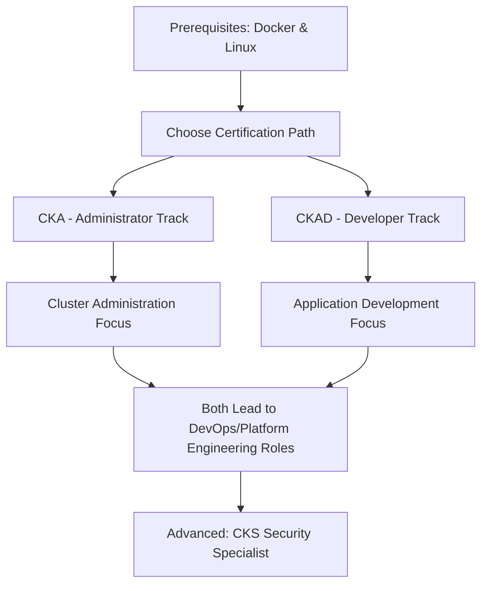

# Kubernetes Certification (CKA/CKAD) - Container Orchestration Expertise Validation

Comprehensive research and strategic guidance for Kubernetes certification journey, specifically tailored for professionals from the Philippines targeting remote work opportunities in Australia, UK, and US markets.


**Research Focus**: Strategic analysis of CKA and CKAD certification paths, market demand assessment, and practical implementation roadmap for container orchestration expertise validation in global remote work contexts.


## Table of Contents

1. [Executive Summary](./executive-summary.md) - Strategic overview and key recommendations
2. [Certification Path Analysis](./certification-path-analysis.md) - Detailed comparison of CKA vs CKAD certification tracks
3. [Implementation Guide](./implementation-guide.md) - Step-by-step certification journey roadmap
4. [Best Practices](./best-practices.md) - Study strategies, exam preparation, and career integration tips
5. [Comparison Analysis](./comparison-analysis.md) - Comprehensive CKA vs CKAD comparison matrix
6. [Hands-On Experience Guide](./hands-on-experience-guide.md) - Practical lab exercises and real-world projects
7. [Study Plans](./study-plans.md) - Structured study schedules and resource allocation
8. [Certification Prerequisites](./certification-prerequisites.md) - Docker, containers, and foundational knowledge requirements
9. [Career Impact Analysis](./career-impact-analysis.md) - Remote work opportunities and salary impact in target markets
10. [Template Examples](./template-examples.md) - YAML manifests, practice exercises, and exam scenarios
11. [Troubleshooting](./troubleshooting.md) - Common certification challenges and solutions
12. [Citations and References](./citations-references.md) - Comprehensive source documentation and bibliography

## Research Scope & Methodology

### 🎯 Primary Research Questions

1. **Which Kubernetes certification (CKA vs CKAD) provides better ROI for remote work opportunities?**
2. **What is the market demand for Kubernetes skills in AU/UK/US remote job markets?**
3. **How to efficiently prepare for Kubernetes certifications with limited infrastructure budget?**
4. **What hands-on experience is essential for passing the practical exams?**
5. **How do Kubernetes certifications complement existing full-stack development skills?**
6. **What is the optimal timeline and cost structure for certification journey?**

### 📊 Research Approach

- **Market Analysis**: Remote job demand and salary data for Kubernetes skills in target regions
- **Certification Mapping**: Detailed skill matrix and exam requirements for CKA and CKAD
- **Cost-Benefit Analysis**: ROI calculation for certification investment vs career advancement
- **Practical Implementation**: Real-world project alignment with certification objectives
- **Community Insights**: Aggregated experiences from certified professionals in target markets
- **Regional Context**: Considerations for Philippines-based professionals in global remote market

### 🔍 Sources Utilized

- Cloud Native Computing Foundation (CNCF) Official Documentation
- Linux Foundation Training Materials and Certification Guides
- Kubernetes Official Documentation and Best Practices
- Industry Salary Reports and Remote Work Market Analysis
- Professional Community Forums (Reddit, Stack Overflow, LinkedIn)
- Hands-On Lab Platforms (KodeKloud, A Cloud Guru, Linux Academy)
- YouTube Training Channels and Conference Presentations

## Quick Reference Guide

### 🗺️ Certification Comparison Overview

| Aspect | CKA (Administrator) | CKAD (Application Developer) |
|--------|-------------------|------------------------------|
| **Target Role** | Kubernetes Administrator, DevOps Engineer | Application Developer, Platform Engineer |
| **Primary Focus** | Cluster management, networking, troubleshooting | Application deployment, configuration, development |
| **Exam Duration** | 2 hours | 2 hours |
| **Exam Format** | Performance-based (hands-on) | Performance-based (hands-on) |
| **Pass Score** | 66% | 66% |
| **Cost** | $395 USD | $395 USD |
| **Validity** | 3 years | 3 years |
| **Prerequisites** | Basic Linux, container concepts | Basic programming, container concepts |

### 💰 Market Value in Target Regions

| Region | Average Salary Increase | Remote Opportunities | Demand Level |
|--------|------------------------|---------------------|--------------|
| **Australia** | 15-25% boost | High (especially Sydney, Melbourne) | Very High |
| **United Kingdom** | 20-30% boost | High (London, Manchester) | Very High |
| **United States** | 25-40% boost | Very High (nationwide) | Extremely High |

### 🚀 Recommended Learning Path

## Goals Achieved

✅ **Market Analysis Completed**: Comprehensive assessment of Kubernetes skills demand in AU/UK/US remote markets  
✅ **Certification Path Mapped**: Detailed comparison and recommendation framework for CKA vs CKAD selection  
✅ **Cost-Benefit Analysis**: ROI calculations and budget planning for certification investment  
✅ **Practical Study Plan**: Structured learning path with timeline estimates and resource recommendations  
✅ **Hands-On Experience Guide**: Laboratory setup and practice scenarios aligned with exam requirements  
✅ **Career Integration Strategy**: Framework for leveraging certifications in remote work applications  
✅ **Regional Context Assessment**: Philippines-specific considerations for global remote work positioning  
✅ **Resource Compilation**: Curated list of free and paid training materials optimized for exam success  
✅ **Technical Prerequisites**: Clear foundation requirements and preparation strategies  
✅ **Success Metrics**: KPIs and milestones to track certification journey progress

## Navigation

- **Previous**: [Career Development Research](../README.md)
- **Next**: [Executive Summary](./executive-summary.md)
- **Related**: [AWS Certification Path](../aws-certification-fullstack-devops/README.md)

---

> **Research Methodology**: This research combines official certification documentation, industry market analysis, and community insights to provide actionable guidance for Kubernetes certification success in the context of Philippines-based professionals targeting remote opportunities in developed markets.

*Last Updated: January 2025*