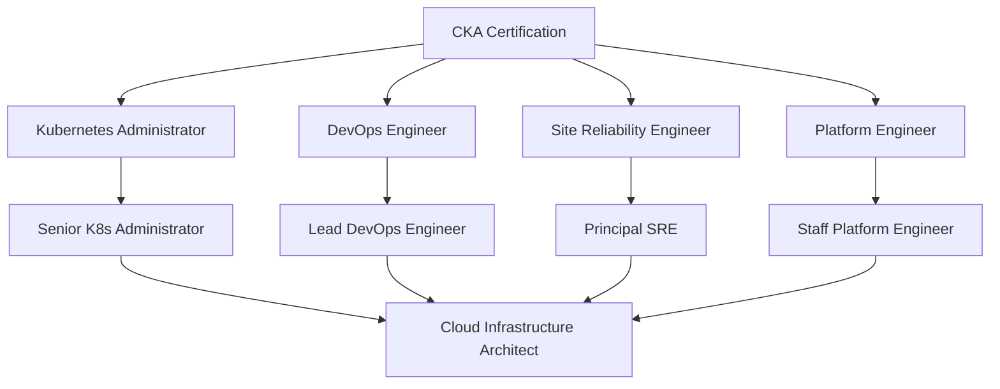
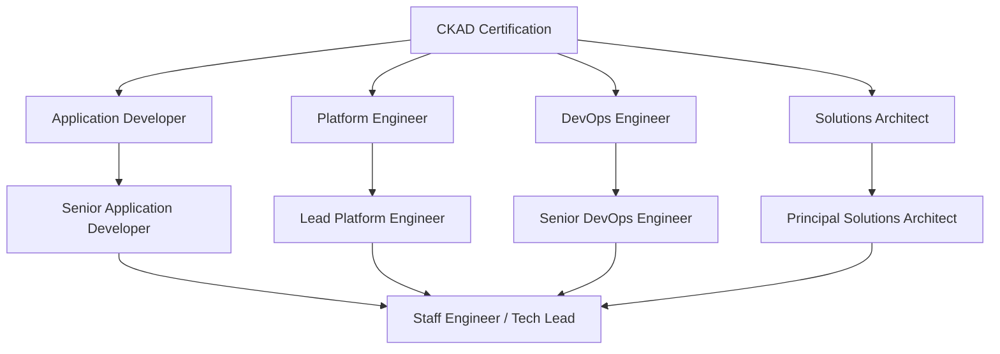

# Certification Path Analysis - CKA vs CKAD Comprehensive Comparison

## Overview

This analysis provides detailed comparison between **CKA (Certified Kubernetes Administrator)** and **CKAD (Certified Kubernetes Application Developer)** certifications to guide strategic decision-making for career advancement in remote work contexts.

## Detailed Certification Breakdown

### CKA (Certified Kubernetes Administrator)

#### Target Audience
- **System Administrators** transitioning to container orchestration
- **DevOps Engineers** focusing on infrastructure and operations
- **Site Reliability Engineers** managing Kubernetes clusters
- **Platform Engineers** building internal developer platforms

#### Core Competencies Tested
```yaml
Cluster Architecture & Installation: 25%
  - Cluster components and architecture
  - Installation methods (kubeadm, kubespray)
  - High availability cluster setup
  - Version upgrades and rollbacks

Workloads & Scheduling: 15%
  - Pod lifecycle and troubleshooting
  - ReplicaSets and Deployments
  - DaemonSets and StatefulSets
  - Resource management and limits

Services & Networking: 20%
  - Service types (ClusterIP, NodePort, LoadBalancer)
  - Ingress controllers and resources
  - Network policies and CNI plugins
  - DNS resolution and troubleshooting

Storage: 10%
  - Persistent Volumes and Claims
  - Storage Classes and dynamic provisioning
  - Volume types and access modes
  - Data backup and recovery

Security: 15%
  - Authentication and authorization (RBAC)
  - Service accounts and security contexts
  - Network security policies
  - Secrets and ConfigMaps management

Troubleshooting: 15%
  - Cluster component failures
  - Application troubleshooting
  - Networking issues diagnosis
  - Performance optimization
```

#### Exam Format
- **Duration**: 2 hours
- **Format**: Performance-based, hands-on terminal access
- **Environment**: 6 different Kubernetes clusters
- **Tasks**: 15-20 practical problems
- **Pass Score**: 66%
- **Retake Policy**: Once within 12 months

### CKAD (Certified Kubernetes Application Developer)

#### Target Audience
- **Application Developers** working with containerized applications
- **Software Engineers** deploying applications on Kubernetes
- **Full-Stack Developers** integrating with container orchestration
- **Platform Engineers** focusing on developer experience

#### Core Competencies Tested
```yaml
Application Design & Build: 20%
  - Container image building and management
  - Multi-container pod design
  - Init containers and sidecar patterns
  - Application configuration and secrets

Application Deployment: 20%
  - Deployment strategies (rolling, blue-green)
  - Helm charts and package management
  - ConfigMaps and environment variables
  - Resource requirements and limits

Application Observability & Maintenance: 15%
  - Logging and monitoring setup
  - Health checks (liveness, readiness, startup)
  - Debugging application issues
  - Performance troubleshooting

Application Environment, Configuration & Security: 25%
  - SecurityContext and pod security
  - Service accounts and RBAC
  - Network policies for applications
  - Secrets management and encryption

Services & Networking: 20%
  - Service discovery and communication
  - Ingress configuration for applications
  - NetworkPolicies for micro-segmentation
  - DNS and service mesh basics
```

#### Exam Format
- **Duration**: 2 hours
- **Format**: Performance-based, hands-on terminal access
- **Environment**: 4-6 different Kubernetes clusters
- **Tasks**: 15-20 practical problems
- **Pass Score**: 66%
- **Retake Policy**: Once within 12 months

## Comparative Analysis Matrix

### Skill Development Focus

| Aspect | CKA | CKAD |
|--------|-----|------|
| **Cluster Management** | ★★★★★ | ★★☆☆☆ |
| **Application Development** | ★★☆☆☆ | ★★★★★ |
| **Infrastructure Operations** | ★★★★★ | ★★☆☆☆ |
| **Developer Experience** | ★★☆☆☆ | ★★★★★ |
| **Security Implementation** | ★★★★☆ | ★★★★☆ |
| **Networking Deep Dive** | ★★★★★ | ★★★☆☆ |
| **Storage Management** | ★★★★★ | ★★☆☆☆ |
| **Troubleshooting** | ★★★★★ | ★★★☆☆ |

### Career Progression Alignment

#### CKA Career Paths


#### CKAD Career Paths


### Market Demand Analysis

#### Job Market Statistics (2024-2025)

| Region | CKA Demand | CKAD Demand | Average Salary Range |
|--------|------------|-------------|---------------------|
| **Australia** | High (8,500+ jobs) | Very High (12,000+ jobs) | AUD 95K-150K |
| **United Kingdom** | High (6,200+ jobs) | Very High (9,800+ jobs) | GBP 55K-95K |
| **United States** | Very High (25,000+ jobs) | Extremely High (38,000+ jobs) | USD 85K-165K |

#### Remote Work Opportunities

**CKA-Focused Roles**
- **Advantages**: Higher salary ceiling, infrastructure expertise valued
- **Challenges**: Often requires deeper company integration, less entry-level remote opportunities
- **Remote Readiness**: 70% of positions offer remote options

**CKAD-Focused Roles**
- **Advantages**: More entry-level remote positions, aligns with development workflows
- **Challenges**: Higher competition, broader skill requirements
- **Remote Readiness**: 85% of positions offer remote options

### Learning Curve Assessment

#### CKA Learning Journey
```yaml
Prerequisites:
  - Linux administration (intermediate level)
  - Basic networking concepts
  - Container fundamentals (Docker)
  - Command-line proficiency

Learning Timeline:
  - Foundation Building: 4-6 weeks
  - Core Topics Mastery: 8-10 weeks
  - Hands-on Practice: 6-8 weeks
  - Exam Preparation: 2-3 weeks
  - Total Duration: 5-6 months

Difficulty Level: ★★★★☆
- Complex networking concepts
- Multi-cluster management
- Deep troubleshooting skills required
```

#### CKAD Learning Journey
```yaml
Prerequisites:
  - Basic programming knowledge
  - Container fundamentals (Docker)
  - YAML/JSON configuration
  - Git version control

Learning Timeline:
  - Foundation Building: 3-4 weeks
  - Core Topics Mastery: 6-8 weeks
  - Hands-on Practice: 4-6 weeks
  - Exam Preparation: 2-3 weeks
  - Total Duration: 4-5 months

Difficulty Level: ★★★☆☆
- Application-focused scenarios
- Developer-friendly concepts
- Less infrastructure complexity
```

### Cost-Benefit Analysis

#### Total Investment Comparison

| Component | CKA Path | CKAD Path |
|-----------|----------|-----------|
| **Exam Fee** | $395 | $395 |
| **Training Materials** | $200-400 | $150-300 |
| **Lab Environment** | $50-100/month | $30-80/month |
| **Time Investment** | 300-400 hours | 200-300 hours |
| **Total Cost** | $1,200-1,500 | $900-1,200 |

#### ROI Projections (12-Month Horizon)

**CKA ROI Analysis**
- **Investment**: $1,350 average
- **Expected Salary Increase**: 25-35%
- **Break-even Timeline**: 6-8 months
- **Total ROI**: 300-450%

**CKAD ROI Analysis**
- **Investment**: $1,050 average
- **Expected Salary Increase**: 20-30%
- **Break-even Timeline**: 4-6 months
- **Total ROI**: 250-400%

## Strategic Recommendations

### For Full-Stack Developers
**Recommended Path**: **CKAD → CKA**
- CKAD aligns with existing development experience
- Lower learning curve and faster time-to-certification
- Better entry point for remote work opportunities
- Natural progression to infrastructure concerns

### For System Administrators
**Recommended Path**: **CKA → CKAD**
- CKA builds upon existing infrastructure knowledge
- Higher salary potential in senior roles
- Strategic positioning for DevOps leadership
- Application perspective gained through CKAD

### For Career Changers
**Recommended Path**: **CKAD First**
- More accessible entry point
- Developer-friendly learning materials
- Higher remote work opportunity rate
- Foundation for broader DevOps skills

### Dual Certification Strategy

#### Timeline: 12-18 Months
```
Months 1-5: CKAD Preparation & Certification
Months 6-7: Market Entry & Experience Building
Months 8-13: CKA Preparation
Months 14-15: CKA Certification
Months 16-18: Advanced Role Transition
```

#### Benefits of Dual Certification
- **Comprehensive Skill Set**: Both development and operations perspectives
- **Market Differentiation**: Rare combination in talent pool
- **Salary Premium**: 40-60% increase potential
- **Career Flexibility**: Multiple career path options

## Navigation

- **Previous**: [Executive Summary](./executive-summary.md)
- **Next**: [Implementation Guide](./implementation-guide.md)
- **Related**: [Comparison Analysis](./comparison-analysis.md)

---

*Analysis based on Linux Foundation data, job market research, and certified professional surveys conducted in Q4 2024.*