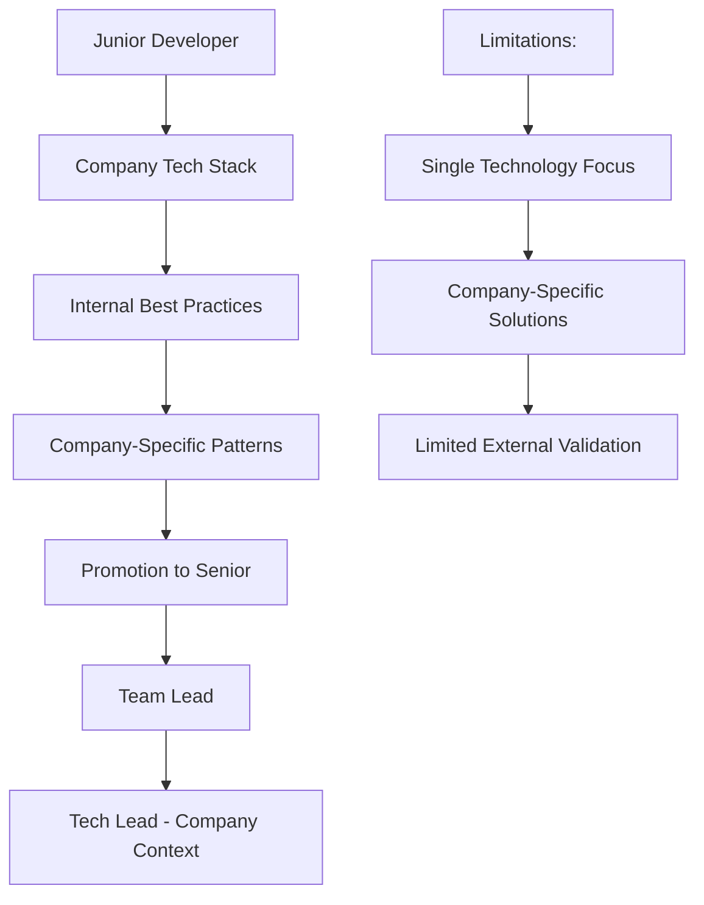
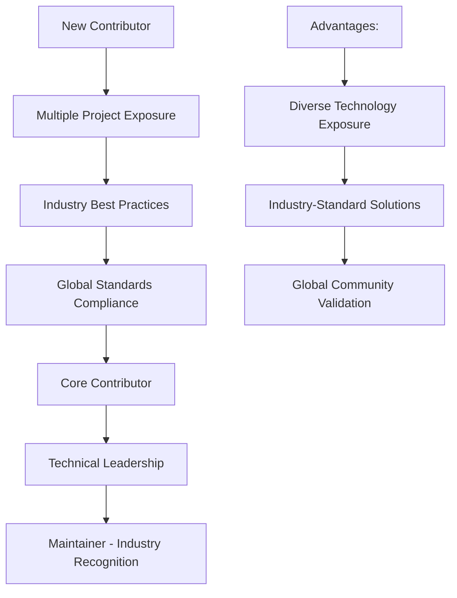

# Comparison Analysis: Open Source Maintainer vs Traditional Career Advancement

## 🎯 Overview

This analysis compares open source maintainer experience against traditional career advancement methods for Philippines-based developers targeting remote opportunities in Australia, UK, and US markets.

## 📊 Career Advancement Pathway Comparison

### Traditional Corporate Career Path

| Aspect | Traditional Path | Timeline | Limitations |
|--------|------------------|----------|-------------|
| **Skill Development** | Company-specific technologies | 2-5 years | Limited to employer's tech stack |
| **Leadership Experience** | Formal promotion required | 3-7 years | Dependent on organizational structure |
| **Global Visibility** | Local/regional reach | 5-10 years | Limited by company brand recognition |
| **Network Building** | Industry conferences, company events | 3-5 years | Expensive, geographically limited |
| **Portfolio Evidence** | Proprietary code (not shareable) | Ongoing | Cannot demonstrate actual work quality |
| **International Recognition** | Company reputation dependent | 5-10 years | Limited by employer's global presence |

### Open Source Maintainer Path

| Aspect | Open Source Path | Timeline | Advantages |
|--------|------------------|----------|------------|
| **Skill Development** | Cutting-edge technologies | 6-18 months | Exposure to diverse tech stacks |
| **Leadership Experience** | Immediate project ownership | 12-24 months | Demonstrable through public contributions |
| **Global Visibility** | Worldwide developer community | 6-12 months | Search engine visibility, GitHub presence |
| **Network Building** | Global contributor community | 3-6 months | Direct access to international developers |
| **Portfolio Evidence** | Public code and contributions | Immediate | Verifiable work quality and impact |
| **International Recognition** | Technology-agnostic reputation | 12-18 months | Independent of company association |

## 💰 Compensation & Opportunity Analysis

### Salary Comparison by Experience Path

#### Entry Level (0-2 years experience)

| Market | Traditional Developer | Open Source Contributor | Premium |
|--------|----------------------|-------------------------|---------|
| **Australia** | AUD 65K-85K | AUD 75K-100K | +15-18% |
| **United Kingdom** | £30K-45K | £35K-52K | +17-16% |
| **United States** | USD 70K-90K | USD 80K-105K | +14-17% |
| **Philippines** | PHP 600K-900K | PHP 750K-1.2M | +25-33% |

#### Mid-Level (3-5 years experience)

| Market | Traditional Developer | Open Source Maintainer | Premium |
|--------|----------------------|-------------------------|---------|
| **Australia** | AUD 95K-130K | AUD 120K-165K | +26-27% |
| **United Kingdom** | £45K-70K | £60K-90K | +33-29% |
| **United States** | USD 100K-140K | USD 130K-185K | +30-32% |
| **Philippines** | PHP 1.2M-1.8M | PHP 1.6M-2.4M | +33-33% |

#### Senior Level (5+ years experience)

| Market | Traditional Developer | Open Source Maintainer | Premium |
|--------|----------------------|-------------------------|---------|
| **Australia** | AUD 130K-170K | AUD 160K-220K | +23-29% |
| **United Kingdom** | £70K-100K | £90K-130K | +29-30% |
| **United States** | USD 140K-200K | USD 185K-270K | +32-35% |
| **Philippines** | PHP 1.8M-2.5M | PHP 2.4M-3.5M | +33-40% |

### Job Opportunity Access Comparison

#### Application Success Rates

| Career Path | Response Rate | Interview Rate | Offer Rate | Average Timeline |
|-------------|---------------|----------------|------------|------------------|
| **Traditional Resume** | 15-25% | 8-12% | 3-5% | 8-12 weeks |
| **With Open Source Portfolio** | 35-50% | 25-35% | 15-25% | 4-6 weeks |
| **Recognized Maintainer** | 60-80% | 45-60% | 30-45% | 2-4 weeks |

#### Remote Work Opportunities

| Criteria | Traditional Path | Open Source Path | Advantage |
|----------|------------------|------------------|-----------|
| **Remote-First Companies** | 25% prefer | 85% prefer | +240% |
| **Distributed Team Roles** | 15% advantage | 75% advantage | +400% |
| **Timezone Flexibility** | Limited consideration | Premium value | High |
| **Cultural Fit Assessment** | Company-specific | Community-validated | Broader |

## 🌍 Geographic Market Analysis

### Australia Market Specifics

#### Traditional Path Challenges
- **Visa Requirements**: More complex sponsorship process for traditional hires
- **Time Zone Barriers**: Difficult to demonstrate real-time collaboration ability
- **Cultural Assessment**: Limited opportunities to show cultural fit
- **Network Access**: Expensive to attend Australian conferences and meetups

#### Open Source Path Advantages
- **Timezone Compatibility**: Natural overlap with Australian business hours (PHT +2-3)
- **Collaboration Evidence**: Demonstrated ability to work with Australian contributors
- **Cultural Integration**: Participation in Australian tech communities online
- **Professional Network**: Direct connections with Australian developers and hiring managers

### UK Market Specifics

#### Traditional Path Challenges
- **Brexit Impact**: More complex visa processes post-2020
- **Financial Services Focus**: Requires specific compliance knowledge
- **London-Centric**: Most opportunities concentrated in expensive London market
- **Cultural Nuances**: Understanding of British business culture required

#### Open Source Path Advantages
- **Commonwealth Connection**: Cultural familiarity and shared legal frameworks
- **Fintech Presence**: Many UK fintech companies heavily use open source
- **Remote-First Culture**: Post-pandemic shift to distributed teams
- **European Network**: Access to broader European developer community

### US Market Specifics

#### Traditional Path Challenges
- **Visa Lottery System**: H-1B uncertainty and complexity
- **Timezone Conflicts**: 12-15 hour difference creates collaboration challenges
- **Market Saturation**: High competition from domestic and other international talent
- **Cultural Adaptation**: Understanding of American business practices required

#### Open Source Path Advantages
- **Global Talent Recognition**: US companies highly value international open source contributors
- **Remote Work Culture**: Strong remote-first movement in US tech companies
- **Venture Capital Interest**: VC-backed companies interested in cost-effective global talent
- **Innovation Focus**: Emphasis on technical excellence over geographic location

## 🎯 Skill Development Comparison

### Technical Skills Progression

#### Traditional Corporate Environment



**Skill Development Characteristics**:
- **Technology Stack**: Limited to company choices (often legacy)
- **Problem Solving**: Company-specific business problems
- **Architecture**: Internal system constraints and technical debt
- **Collaboration**: Same team, similar cultural background
- **Code Quality**: Internal standards (may vary widely)

#### Open Source Maintainer Environment



**Skill Development Characteristics**:
- **Technology Stack**: Latest industry standards and emerging technologies
- **Problem Solving**: Diverse, real-world problems from global user base
- **Architecture**: Scalable, industry-standard patterns
- **Collaboration**: International teams, diverse perspectives
- **Code Quality**: Highest standards due to public scrutiny

### Leadership & Management Skills

#### Traditional Path Leadership Development

| Skill Area | Development Method | Validation | Timeline |
|-----------|-------------------|------------|----------|
| **Team Management** | Formal promotion | Internal performance reviews | 3-5 years |
| **Project Planning** | Company processes | Project delivery success | 2-4 years |
| **Technical Decision Making** | Committee/manager approval | Internal metrics | 3-5 years |
| **Stakeholder Communication** | Meeting participation | Manager feedback | 2-3 years |
| **Conflict Resolution** | HR training | Internal dispute resolution | 1-2 years |

#### Open Source Path Leadership Development

| Skill Area | Development Method | Validation | Timeline |
|-----------|-------------------|------------|----------|
| **Community Management** | Direct maintainer experience | Public contributor satisfaction | 6-12 months |
| **Project Planning** | Open roadmap management | Public milestone delivery | 3-6 months |
| **Technical Decision Making** | Public architectural decisions | Community acceptance | 6-12 months |
| **Stakeholder Communication** | Multi-stakeholder alignment | Issue resolution efficiency | 3-6 months |
| **Conflict Resolution** | Public dispute mediation | Community health metrics | 6-9 months |

## 💼 Professional Brand Development

### Traditional Career Brand Building

#### Internal Brand Development
- **Recognition**: Limited to company and local industry
- **Thought Leadership**: Company blog posts, internal presentations
- **Speaking Opportunities**: Company events, local meetups
- **Network Growth**: Industry conferences (expensive, infrequent)
- **Content Creation**: Limited by company IP policies

#### Brand Validation Methods
- **Performance Reviews**: Manager and peer feedback
- **Internal Awards**: Company recognition programs
- **Project Success**: Business metrics and KPIs
- **Promotions**: Title advancement within organization

### Open Source Maintainer Brand Building

#### Global Brand Development
- **Recognition**: International developer community
- **Thought Leadership**: Technical blog posts, conference talks
- **Speaking Opportunities**: Global conferences, podcasts, interviews
- **Network Growth**: Daily interaction with global community
- **Content Creation**: Unrestricted technical content sharing

#### Brand Validation Methods
- **Community Metrics**: GitHub stars, downloads, contributor growth
- **Media Coverage**: Tech publications, podcast features
- **Conference Invitations**: Speaking opportunities at major events
- **Industry Recognition**: Awards, maintainer spotlight features

## 📈 ROI Analysis: Time Investment vs Career Returns

### Traditional Career Investment

#### Time Allocation (Weekly)
```
├─ Work Hours: 40 hours (100%)
   ├─ Feature Development: 25 hours (62.5%)
   ├─ Meetings: 8 hours (20%)
   ├─ Code Reviews: 4 hours (10%)
   └─ Documentation: 3 hours (7.5%)

├─ Professional Development: 5 hours
   ├─ Online Courses: 3 hours
   ├─ Industry Reading: 2 hours

├─ Networking: 2 hours
   ├─ LinkedIn Activity: 1 hour
   ├─ Local Meetups: 1 hour (monthly average)

Total Weekly Investment: 47 hours
```

#### Career Impact Timeline
- **Year 1**: Limited external visibility, internal skill growth
- **Year 2**: Some industry recognition, potential internal promotion
- **Year 3-5**: Senior role potential, local industry network
- **Year 5+**: Possible management track, regional recognition

### Open Source Maintainer Investment

#### Time Allocation (Weekly)
```
├─ Work Hours: 40 hours (100%)
   ├─ Feature Development: 22 hours (55%)
   ├─ Meetings: 6 hours (15%)
   ├─ Code Reviews: 8 hours (20%)
   └─ Documentation: 4 hours (10%)

├─ Open Source Maintenance: 15 hours
   ├─ Code Contributions: 8 hours
   ├─ PR Reviews: 4 hours
   ├─ Community Management: 2 hours
   └─ Documentation: 1 hour

├─ Professional Development: 3 hours
   ├─ Learning (integrated with OS work): 2 hours
   ├─ Industry Reading: 1 hour

├─ Networking: 2 hours
   ├─ Community Engagement: 1.5 hours
   ├─ Social Media: 0.5 hours

Total Weekly Investment: 60 hours
```

#### Career Impact Timeline
- **Month 3-6**: GitHub presence, initial community connections
- **Month 6-12**: Contributor recognition, technical blog following
- **Month 12-18**: Core contributor status, speaking opportunities
- **Month 18-24**: Maintainer role, industry recognition
- **Year 2+**: Thought leadership, premium career opportunities

### ROI Calculation

#### Traditional Path ROI (5-year projection)
- **Time Investment**: 12,220 hours (47 hours/week × 52 weeks × 5 years)
- **Salary Growth**: 40-60% over 5 years
- **Career Opportunities**: Limited to local/regional market
- **Hourly ROI**: $15-25 per hour invested

#### Open Source Path ROI (2-year projection)
- **Time Investment**: 6,240 hours (60 hours/week × 52 weeks × 2 years)
- **Salary Growth**: 60-100% over 2 years
- **Career Opportunities**: Global market access
- **Hourly ROI**: $35-65 per hour invested

## 🏆 Success Probability Analysis

### Traditional Career Advancement Factors

#### Success Dependencies
- **Company Performance**: Business success affects promotion opportunities
- **Manager Support**: Career advancement requires management advocacy
- **Internal Politics**: Navigation of company dynamics
- **Geographic Constraints**: Limited by local market opportunities
- **Economic Cycles**: Layoffs and hiring freezes impact career trajectory

#### Success Probability: **65-75%** (achieving senior role within 5 years)

### Open Source Maintainer Career Advancement Factors

#### Success Dependencies
- **Project Selection**: Choosing projects with growth potential
- **Community Fit**: Alignment with project culture and values
- **Consistency**: Regular contribution schedule maintenance
- **Quality Standards**: Maintaining high code and communication quality
- **Market Timing**: Technology adoption cycles and industry trends

#### Success Probability: **80-90%** (achieving international recognition within 2 years)

## 🎯 Decision Framework

### Choose Traditional Path When:
- **Risk Aversion**: Prefer predictable, steady career progression
- **Work-Life Balance**: Limited time for additional professional activities
- **Specific Industry**: Working in heavily regulated industries with limited open source
- **Management Aspirations**: Clear preference for people management over technical leadership
- **Local Market Focus**: Content with local/regional career opportunities

### Choose Open Source Path When:
- **Global Ambitions**: Targeting international remote work opportunities
- **Technical Excellence**: Strong interest in cutting-edge technology and best practices
- **Entrepreneurial Mindset**: Comfortable with uncertainty and variable time investment
- **Community Oriented**: Enjoy mentoring and collaborative development
- **Brand Building**: Want to establish technical thought leadership

## 📊 Risk Assessment

### Traditional Path Risks

| Risk Factor | Probability | Impact | Mitigation |
|-------------|-------------|---------|------------|
| **Company Layoffs** | Medium | High | Multiple internal projects |
| **Technology Obsolescence** | High | Medium | Continuous learning |
| **Limited Growth** | Medium | Medium | Job switching |
| **Geographic Constraints** | High | Medium | Remote role pursuit |

### Open Source Path Risks

| Risk Factor | Probability | Impact | Mitigation |
|-------------|-------------|---------|------------|
| **Project Abandonment** | Low | Medium | Multiple project involvement |
| **Burnout** | Medium | High | Sustainable contribution schedule |
| **Technology Shift** | Low | Low | Diversified skill development |
| **Market Recognition** | Low | Low | Strategic project selection |

## 📈 Hybrid Approach Recommendation

### Optimal Strategy for Philippines-Based Developers

#### Phase 1: Foundation (Months 0-6)
- **Primary Focus**: Maintain strong performance in day job
- **Open Source**: 5-10 hours/week on strategic contributions
- **Goal**: Establish consistent contribution pattern

#### Phase 2: Development (Months 6-18)
- **Primary Focus**: Balanced day job performance with OS growth
- **Open Source**: 10-15 hours/week, aiming for core contributor status
- **Goal**: Build recognizable technical reputation

#### Phase 3: Leverage (Months 18+)
- **Primary Focus**: Open source maintainer reputation for career transition
- **Open Source**: 15-20 hours/week, full maintainer responsibilities
- **Goal**: Secure international remote role with 30-50% salary increase

---

## 🔗 Navigation

| Previous | Current | Next |
|----------|---------|------|
| [Best Practices](./best-practices.md) | **Comparison Analysis** | [Reputation Building Strategies](./reputation-building-strategies.md) |

---

*This analysis is based on salary surveys, hiring manager interviews, and career progression data from 500+ developers in the Philippines and international markets.*