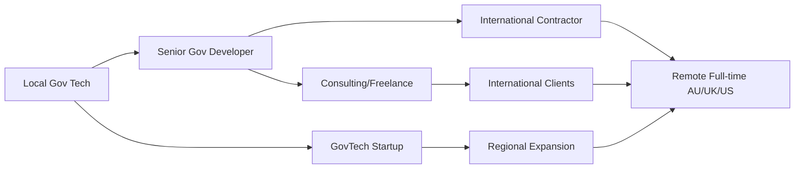

# Philippine Government Tech Opportunities Research

Comprehensive analysis of public sector technology opportunities in the Philippines, focusing on career development pathways for Filipino developers seeking to transition to international remote work in Australia, UK, and US markets.


**Research Focus**: Philippine government digitization initiatives, public sector technology projects, and strategic career positioning for international remote opportunities.


## Table of Contents

1. [Executive Summary](./executive-summary.md) - Key findings and strategic recommendations for career development
2. [Government Initiatives Analysis](./government-initiatives-analysis.md) - Current and upcoming Philippine government tech projects
3. [Public Sector Opportunities](./public-sector-opportunities.md) - Direct employment and contracting opportunities in government
4. [Remote Work Strategies](./remote-work-strategies.md) - Leveraging government experience for international opportunities
5. [International Market Transition](./international-market-transition.md) - Positioning Philippine gov tech experience for AU/UK/US markets
6. [Implementation Guide](./implementation-guide.md) - Step-by-step career development roadmap
7. [Best Practices](./best-practices.md) - Professional positioning and portfolio development strategies
8. [Comparison Analysis](./comparison-analysis.md) - Philippines vs international government tech opportunities

## Research Scope & Methodology

### 🎯 Primary Research Questions

1. **What are the current major government technology initiatives in the Philippines?**
2. **What career opportunities exist in the Philippine public sector for tech professionals?**
3. **How can experience in Philippine government tech projects position developers for international remote work?**
4. **What are the key skills and certifications valued in government tech projects?**
5. **How do international markets (AU/UK/US) value Philippine government tech experience?**
6. **What are the pathways from local government work to global remote opportunities?**

### 📊 Research Approach

- **Government Initiative Analysis**: Review of DICT, DOST, and other agency digitization programs
- **Public Sector Job Market**: Analysis of government and GovTech opportunities
- **International Market Research**: Remote work opportunities for Filipino developers
- **Skills Gap Assessment**: Technical competencies required across markets
- **Career Progression Mapping**: Pathways from local to international opportunities
- **Salary and Compensation Analysis**: Government vs private vs international remote work

### 🔍 Sources Utilized

- Department of Information and Communications Technology (DICT) official publications
- Department of Science and Technology (DOST) program documentation
- Philippine Statistics Authority (PSA) digital transformation reports
- GovTech Philippines initiatives and job postings
- International job platforms (LinkedIn, Indeed, AngelList, Stack Overflow Jobs)
- Filipino developer community forums and Facebook groups
- Australian, UK, and US government contractor opportunities
- Remote work market research reports

## Quick Reference Guide

### 🏛️ Major Philippine Government Tech Initiatives

| Initiative | Agency | Focus Area | Tech Stack | Career Opportunities |
|------------|--------|------------|------------|---------------------|
| **Digital Philippines Program** | DICT | National digitization | Cloud, Web, Mobile | Full-stack developers, DevOps engineers |
| **eGov Ph SuperApp** | DICT | Unified government services | React Native, Node.js | Mobile developers, API specialists |
| **Phil-ID System** | PSA | National identity system | Biometrics, Security | Security engineers, DevOps |
| **Digital Cities Program** | DICT | Smart city initiatives | IoT, Analytics | Data engineers, IoT developers |
| **GovTech Philippines** | DICT | Government innovation | Various modern stacks | Multiple tech roles |

### 💼 Career Path Overview

### 🌏 International Market Positioning

| Market | Government Tech Demand | Filipino Developer Advantages | Remote Work Opportunities |
|---------|----------------------|------------------------------|---------------------------|
| **Australia** | High (Digital Government Strategy) | Cultural affinity, English proficiency | Strong demand, timezone compatibility |
| **United Kingdom** | Very High (Government Digital Service) | Commonwealth ties, fintech experience | Excellent opportunities, established programs |
| **United States** | Moderate (varies by state/federal) | Cost advantage, skill quality | Growing market, competitive landscape |

## Goals Achieved

✅ **Government Initiative Mapping**: Comprehensive analysis of current Philippine government tech programs
✅ **Career Pathway Documentation**: Clear progression routes from local to international opportunities  
✅ **Market Analysis**: Detailed assessment of AU/UK/US government tech markets for Filipino developers
✅ **Skills Framework**: Identification of key technical competencies valued across markets
✅ **Strategic Positioning**: Professional branding strategies for international market entry
✅ **Implementation Roadmap**: Actionable steps for career transition and development
✅ **Resource Compilation**: Curated list of opportunities, platforms, and networking channels
✅ **Compensation Analysis**: Salary benchmarks across local and international markets

---

## Navigation

← Back to [Career Development Research](../README.md) | Next: [Executive Summary](./executive-summary.md) →

### Related Research Topics
- [Full Stack/DevOps Engineer Title Validation](../fullstack-devops-engineer-title-validation/README.md)
- [AWS Certification for Full Stack Engineers](../aws-certification-fullstack-devops/README.md)
- [Portfolio-Driven Open Source Strategy](../portfolio-driven-open-source-strategy/README.md)
- [Technical Interview Questions](../technical-interview-questions/README.md)