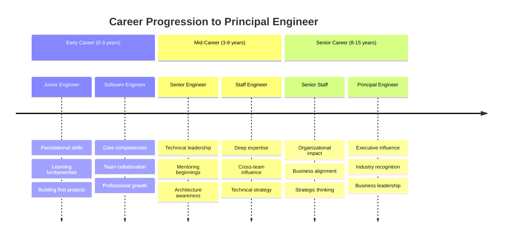

# Career Progression Roadmap: Path to Principal Engineer

## Overview

This roadmap provides a detailed career progression path for software engineers aspiring to reach Principal Engineer level, with specific milestones, skill development phases, and strategic positioning for international remote opportunities, particularly focusing on AU, UK, and US markets.

## Career Progression Timeline

### 🎯 Progression Overview (15-20 Year Journey)



### 📊 Detailed Progression Framework

| Career Stage | Years | Technical Focus | Leadership Scope | Business Impact | Typical Compensation |
|--------------|-------|-----------------|------------------|-----------------|---------------------|
| **Junior Engineer** | 0-2 | Learning fundamentals | Individual contributor | Minimal | $60-90k |
| **Software Engineer** | 2-4 | Competent individual contributor | Team collaboration | Small | $80-120k |
| **Senior Engineer** | 4-8 | Technical excellence + mentoring | Team technical leadership | Medium | $120-200k |
| **Staff Engineer** | 8-12 | Deep expertise + cross-team influence | Multi-team technical leadership | High | $180-350k |
| **Principal Engineer** | 12+ | Strategic technical leadership | Organization-wide influence | Very High | $250-550k+ |

## Phase-by-Phase Development Guide

### 🚀 Phase 1: Foundation Building (Years 0-4)

**Junior to Software Engineer Transition**

*Key Development Areas:*
- **Technical Proficiency**: Master fundamental programming concepts and best practices
- **Problem-Solving**: Develop systematic approach to debugging and issue resolution
- **Code Quality**: Learn testing, documentation, and code review practices
- **Team Collaboration**: Understand software development lifecycle and team dynamics

*Milestone Checklist:*
```markdown
## Years 0-2: Junior Engineer Milestones
- [ ] Complete computer science fundamentals (data structures, algorithms)
- [ ] Become proficient in at least one programming language
- [ ] Learn version control (Git) and basic DevOps concepts
- [ ] Complete first major project with minimal supervision
- [ ] Understand database fundamentals and API design
- [ ] Participate effectively in code reviews
- [ ] Write basic unit tests and documentation

## Years 2-4: Software Engineer Milestones
- [ ] Lead small projects or features end-to-end
- [ ] Mentor junior developers and interns
- [ ] Contribute to technical discussions and decisions
- [ ] Understand business context of technical work
- [ ] Learn additional programming languages and frameworks
- [ ] Participate in on-call rotations and incident response
- [ ] Begin contributing to open source or side projects
```

*Strategic Focus for International Markets:*
- Build strong English communication skills (written and verbal)
- Understand international software development practices
- Learn about remote work tools and collaboration techniques
- Start building professional online presence (LinkedIn, GitHub)

### 🎯 Phase 2: Technical Leadership Development (Years 4-8)

**Software Engineer to Senior Engineer Transition**

*Key Development Areas:*
- **Technical Depth**: Develop deep expertise in specific domains
- **System Thinking**: Understand distributed systems and architecture patterns
- **Mentorship**: Guide junior and mid-level engineers effectively
- **Cross-functional Collaboration**: Work effectively with product, design, and business teams

*Advanced Skills Development:*
```python
# Senior Engineer Technical Competency Framework
senior_engineer_skills = {
    "technical_expertise": {
        "system_design": "Design scalable distributed systems",
        "performance_optimization": "Identify and resolve performance bottlenecks",
        "security_practices": "Implement security best practices",
        "testing_strategies": "Design comprehensive testing approaches"
    },
    "leadership_skills": {
        "technical_mentoring": "Guide career development of junior engineers",
        "code_review_excellence": "Provide constructive, educational feedback",
        "technical_communication": "Explain complex concepts to diverse audiences",
        "project_leadership": "Lead technical projects from concept to delivery"
    },
    "business_awareness": {
        "requirements_analysis": "Understand and clarify business requirements",
        "technical_tradeoffs": "Balance technical quality with business needs",
        "stakeholder_management": "Communicate effectively with non-technical stakeholders",
        "cost_consciousness": "Consider cost implications of technical decisions"
    }
}
```

*Milestone Checklist:*
```markdown
## Years 4-6: Senior Engineer Development
- [ ] Lead architecture decisions for major features or services
- [ ] Mentor 2-3 junior/mid-level engineers successfully
- [ ] Deliver complex projects on time with high quality
- [ ] Establish technical standards and best practices for team
- [ ] Participate in hiring and interview processes
- [ ] Present technical topics to broader engineering organization
- [ ] Contribute to technical blog or speak at meetups

## Years 6-8: Senior Engineer Mastery
- [ ] Design and implement systems handling significant scale
- [ ] Influence technical decisions across multiple teams
- [ ] Successfully navigate and resolve technical conflicts
- [ ] Drive adoption of new technologies or practices
- [ ] Build relationships with senior engineers and staff engineers
- [ ] Contribute to engineering culture and practices
- [ ] Begin building external technical reputation
```

### 🏆 Phase 3: Strategic Technical Leadership (Years 8-12)

**Senior Engineer to Staff Engineer Transition**

*Key Development Areas:*
- **Architectural Leadership**: Drive technical strategy across multiple teams
- **Cross-team Influence**: Impact technical decisions beyond immediate team
- **Strategic Thinking**: Align technical work with long-term business goals
- **Industry Expertise**: Develop recognized expertise in specific technical domains

*Staff Engineer Competency Development:*
```markdown
## Staff Engineer Skill Development Framework

### Technical Strategy
- Study system architecture patterns and design principles
- Learn about technology evaluation and selection processes
- Understand scalability challenges and solutions
- Develop expertise in performance optimization and cost management

### Cross-team Leadership
- Practice facilitating technical discussions across teams
- Learn consensus building and conflict resolution techniques
- Develop skills in technical project management
- Build relationships with engineers across the organization

### Business and Strategic Skills
- Study business fundamentals and financial metrics
- Learn about product development and market dynamics
- Understand competitive landscape and industry trends
- Develop ability to translate technical concepts into business value
```

*Milestone Checklist:*
```markdown
## Years 8-10: Staff Engineer Development
- [ ] Lead cross-team technical initiatives successfully
- [ ] Drive architectural decisions affecting multiple services
- [ ] Establish and evangelize technical standards across organization
- [ ] Mentor other senior engineers and support their career growth
- [ ] Participate in technical strategy and roadmap planning
- [ ] Build reputation as go-to expert in specific technical domain
- [ ] Contribute to engineering hiring and culture initiatives

## Years 10-12: Staff Engineer Mastery
- [ ] Influence technical direction at organizational level
- [ ] Successfully lead major technical migrations or transformations
- [ ] Build consensus on complex technical decisions across stakeholders
- [ ] Develop other engineers into technical leaders
- [ ] Represent company at industry conferences or technical forums
- [ ] Contribute to open source projects with significant impact
- [ ] Begin building relationships with principal engineers and senior leadership
```

### 🌟 Phase 4: Executive Technical Leadership (Years 12+)

**Staff Engineer to Principal Engineer Transition**

*Key Development Areas:*
- **Executive Influence**: Shape technical strategy at highest organizational levels
- **Business Leadership**: Drive technical decisions with clear business impact
- **Industry Recognition**: Become recognized expert and thought leader
- **Organizational Impact**: Influence engineering culture and practices across company

*Principal Engineer Preparation:*
```python
class PrincipalEngineerReadiness:
    def __init__(self):
        self.competency_areas = {
            "technical_vision": self._assess_technical_vision(),
            "business_acumen": self._assess_business_skills(),
            "leadership_influence": self._assess_leadership_capability(),
            "external_presence": self._assess_industry_recognition()
        }
    
    def _assess_technical_vision(self):
        return {
            "strategic_thinking": "Can you develop 3-5 year technical roadmaps?",
            "technology_evaluation": "Do you lead technology selection processes?",
            "architectural_influence": "Do your architectural decisions affect multiple products?",
            "innovation_leadership": "Do you drive adoption of new technologies?"
        }
    
    def _assess_business_skills(self):
        return {
            "financial_impact": "Can you quantify business impact of technical decisions?",
            "stakeholder_management": "Do you regularly interact with senior leadership?",
            "market_understanding": "Do you understand competitive and market dynamics?",
            "strategic_alignment": "Can you align technical roadmap with business strategy?"
        }
    
    def _assess_leadership_capability(self):
        return {
            "influence_without_authority": "Can you drive decisions without management role?",
            "cross_functional_leadership": "Do you lead initiatives across engineering and other functions?",
            "talent_development": "Have you developed other engineers into leadership roles?",
            "cultural_impact": "Do you shape engineering culture and practices?"
        }
```

*Principal Engineer Milestone Checklist:*
```markdown
## Years 12-15: Principal Engineer Preparation
- [ ] Lead organization-wide technical initiatives with measurable business impact
- [ ] Develop and communicate technical vision aligned with business strategy
- [ ] Build strong relationships with senior leadership (VP, CTO, CEO)
- [ ] Drive technical decisions that significantly impact company performance
- [ ] Mentor staff engineers and support their advancement to principal level
- [ ] Establish thought leadership through speaking, writing, or open source contributions
- [ ] Successfully navigate complex technical and political challenges

## Years 15+: Principal Engineer Excellence
- [ ] Shape technical strategy at industry level through thought leadership
- [ ] Drive technical decisions that create competitive advantage
- [ ] Influence hiring and development of senior technical talent
- [ ] Represent company technical excellence to customers, partners, and industry
- [ ] Create technical innovations that generate significant business value
- [ ] Build and maintain network of technical leaders across industry
- [ ] Contribute to technical community through mentoring, speaking, and open source
```

## Geographic and Remote Work Progression

### 🌍 International Market Preparation

**Years 1-5: Foundation for International Remote Work**
- Develop excellent English communication skills
- Build understanding of international business practices
- Create strong online professional presence
- Gain experience with remote collaboration tools
- Build portfolio showcasing technical capabilities

**Years 5-10: Building International Network**
- Participate in international conferences and events (virtual/in-person)
- Contribute to global open source projects
- Build relationships with engineers in target markets (AU, UK, US)
- Develop understanding of different technical cultures
- Create thought leadership content for international audiences

**Years 10+: Strategic International Positioning**
- Build reputation as technical expert in international markets
- Develop relationships with international recruiters and hiring managers
- Understand visa and immigration requirements for target countries
- Build financial and legal structures for international remote work
- Position for senior technical leadership roles in international companies

### 🎯 Market-Specific Preparation Strategies

**Australia Market Focus:**
```markdown
## Australia Remote Work Preparation

### Market Understanding
- Study Australian tech ecosystem and major companies
- Understand Australian business culture and communication styles
- Learn about visa requirements (subclass 482, 186, 189)
- Research salary expectations and cost of living

### Network Building
- Connect with Australian tech leaders on LinkedIn
- Participate in Australian tech conferences (YOW!, NDC Sydney)
- Join Australian tech communities and forums
- Follow Australian tech blogs and publications

### Cultural Preparation
- Understand work-life balance expectations
- Learn about Australian business etiquette
- Understand time zone considerations for collaboration
- Research Australian employment laws and practices
```

**United Kingdom Market Focus:**
```markdown
## UK Remote Work Preparation

### Market Understanding
- Study UK fintech, healthtech, and enterprise software markets
- Understand British business culture and professional norms
- Learn about visa requirements (Skilled Worker, Global Talent)
- Research compensation expectations and tax implications

### Professional Development
- Build expertise in areas valued by UK companies (fintech, compliance, security)
- Understand GDPR and UK data protection requirements
- Learn about UK employment laws and remote work practices
- Study UK startup ecosystem and scale-up culture

### Network Building
- Connect with UK technical leaders and engineering managers
- Participate in UK tech conferences (QCon London, Lead Dev)
- Contribute to UK tech communities and forums
- Build relationships with UK-based recruiters
```

**United States Market Focus:**
```markdown
## US Remote Work Preparation

### Market Segmentation
- West Coast (Silicon Valley): Focus on high-growth tech companies
- East Coast (NYC): Focus on fintech and enterprise software
- Austin/Denver: Focus on remote-first companies and startups
- Distributed: Focus on fully remote companies with global teams

### Technical Positioning
- Build expertise in technologies valued by US companies (cloud-native, AI/ML, security)
- Understand US compliance requirements (SOX, HIPAA, etc.)
- Learn about US startup culture and venture capital ecosystem
- Study US business practices and communication styles

### Legal and Financial Preparation
- Understand visa requirements and limitations
- Research US tax implications for remote workers
- Learn about US employment law and contractor vs. employee status
- Build relationships with immigration lawyers and tax professionals
```

## Acceleration Strategies

### 🚀 Fast-Track Development Approaches

**Accelerated Learning Techniques:**
1. **Deliberate Practice**: Focus on specific skills with immediate feedback
2. **Mentorship**: Find senior engineers willing to provide guidance and opportunities
3. **Stretch Assignments**: Volunteer for challenging projects beyond current level
4. **Cross-functional Exposure**: Work closely with product, business, and design teams
5. **External Learning**: Conferences, courses, certifications, and industry connections

**High-Impact Experience Building:**
```python
# High-Impact Experience Framework
def build_principal_engineer_experience():
    return {
        "technical_leadership": [
            "Lead migration of legacy system to modern architecture",
            "Drive adoption of new technology stack across organization",
            "Design and implement platform used by multiple teams",
            "Lead technical response to major production incident",
            "Architect solution for 10x scale increase"
        ],
        "business_impact": [
            "Technical decision resulting in significant cost savings",
            "Performance optimization increasing user conversion",
            "Security improvement preventing major business risk",
            "Platform that enables new revenue stream",
            "Technical innovation creating competitive advantage"
        ],
        "leadership_development": [
            "Mentor engineers to promotion and success",
            "Lead cross-functional project with business stakeholders",
            "Drive consensus on controversial technical decision",
            "Represent technical perspective in executive planning",
            "Build and lead technical community of practice"
        ]
    }
```

### ⚡ Common Acceleration Mistakes to Avoid

**Technical Depth vs. Breadth Balance:**
- **Mistake**: Spreading too thin across many technologies
- **Solution**: Develop deep expertise in 1-2 areas while maintaining broad awareness

**Leadership Readiness:**
- **Mistake**: Focusing only on technical skills without developing influence
- **Solution**: Practice leadership through mentoring, consensus building, and communication

**Business Understanding:**
- **Mistake**: Ignoring business context and impact of technical work
- **Solution**: Study business fundamentals and participate in strategic planning

**Network Development:**
- **Mistake**: Working in isolation without building professional relationships
- **Solution**: Invest time in internal and external networking and relationship building

## Success Measurement and Milestone Tracking

### 📊 Career Progression Metrics

**Technical Growth Indicators:**
```python
# Career Progression Tracking Dashboard
progression_metrics = {
    "technical_competency": {
        "complexity_of_problems": "From individual features to organizational systems",
        "scope_of_influence": "From team to organization to industry",
        "technology_depth": "From user to expert to industry thought leader",
        "architecture_responsibility": "From implementation to design to strategy"
    },
    "leadership_development": {
        "people_influence": "From self to team to organization",
        "decision_authority": "From recommendations to decisions to strategy",
        "conflict_resolution": "From avoidance to mediation to prevention",
        "change_leadership": "From follower to contributor to driver"
    },
    "business_impact": {
        "scope_of_impact": "From features to products to business outcomes",
        "financial_responsibility": "From cost awareness to optimization to strategic investment",
        "risk_management": "From identification to mitigation to prevention",
        "strategic_contribution": "From execution to planning to vision"
    }
}
```

**Annual Review Framework:**
- **Technical Achievement**: Major projects led and technical contributions
- **Leadership Growth**: People developed and influence expanded
- **Business Impact**: Quantifiable business outcomes from technical work
- **Market Position**: Industry recognition and professional network growth

This comprehensive career progression roadmap provides a structured approach to advancing from any engineering level to Principal Engineer, with specific considerations for international remote work opportunities. The key is consistent development across technical, leadership, and business dimensions while building the relationships and reputation necessary for senior technical leadership roles.

## Navigation

- ← Previous: [Responsibilities & Impact Analysis](./responsibilities-impact-analysis.md)
- → Next: [Remote Work Considerations](./remote-work-considerations.md)
- ↑ Back to: [Principal Engineer Role Analysis](./README.md)

---

**Document Type**: Career Progression Roadmap  
**Last Updated**: January 2025  
**Progression Timeline**: 15-20 Year Career Development Plan