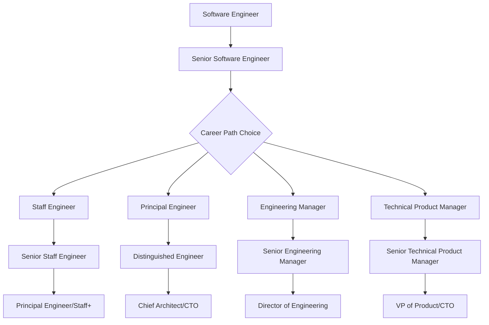

# Comparison Analysis: Principal Engineer vs Other Senior Technical Roles

## Overview

This comprehensive comparison analyzes the Principal Engineer role against other senior technical positions, helping professionals understand the unique characteristics, responsibilities, and career implications of each path. The analysis covers role definitions, compensation, career progression, and strategic positioning.

## Technical Leadership Role Hierarchy

### 🏗️ Engineering Career Ladder Comparison



### 📊 Role Comparison Matrix

| Role | Technical Depth | Leadership Scope | Business Impact | Management Responsibility | Compensation Range (USD) |
|------|----------------|------------------|-----------------|-------------------------|---------------------------|
| **Senior Engineer** | High | Team-level | Medium | Individual contributor | $120-200k |
| **Staff Engineer** | Very High | Multi-team | Medium-High | Informal leadership | $180-300k |
| **Principal Engineer** | Very High | Organization-wide | High | Technical leadership | $250-450k |
| **Senior Staff Engineer** | Expert | Multi-organization | High | Senior technical leader | $300-500k |
| **Distinguished Engineer** | Industry expert | Industry-wide | Very High | Technical visionary | $400-700k+ |
| **Engineering Manager** | Medium-High | Team management | Medium-High | People management | $150-350k |
| **Senior Engineering Manager** | Medium | Department management | High | Multi-team management | $200-450k |
| **Director of Engineering** | Medium | Division management | Very High | Organizational leadership | $300-600k |

## Detailed Role Comparisons

### 🎯 Principal Engineer vs Staff Engineer

**Principal Engineer Characteristics:**
- **Scope**: Organization-wide technical influence and decision-making authority
- **Focus**: Strategic technical leadership with strong business alignment
- **Impact**: Drives technical decisions that significantly affect business outcomes
- **Responsibility**: Technical strategy, architecture decisions, cross-functional leadership
- **Time Horizon**: Long-term planning (1-3 years) with strategic thinking
- **Stakeholders**: Senior leadership, multiple engineering teams, business stakeholders

**Staff Engineer Characteristics:**
- **Scope**: Multi-team technical influence within engineering organization
- **Focus**: Deep technical expertise with team-level leadership
- **Impact**: Solves complex technical problems and mentors senior engineers
- **Responsibility**: Technical execution, code quality, team technical leadership
- **Time Horizon**: Medium-term planning (3-12 months) with tactical focus
- **Stakeholders**: Engineering teams, technical leads, engineering management

**Key Differences:**

| Aspect | Principal Engineer | Staff Engineer |
|--------|-------------------|----------------|
| **Strategic vs Tactical** | Strategic focus on business-aligned technical decisions | Tactical focus on technical execution and quality |
| **Business Engagement** | High engagement with business stakeholders and strategy | Limited business engagement, primarily technical focus |
| **Organizational Impact** | Organization-wide influence and decision-making | Multi-team influence within engineering |
| **Leadership Style** | Cross-functional leadership and influence | Technical mentorship and team leadership |
| **Career Trajectory** | Path toward Distinguished Engineer or CTO roles | Can advance to Principal or move to management |

### 🏆 Principal Engineer vs Engineering Manager

**Principal Engineer Path:**
- **Leadership Through Expertise**: Influence based on technical credibility and knowledge
- **Technical Focus**: Maintains hands-on technical involvement and coding
- **Scope of Influence**: Technical strategy, architecture, and engineering practices
- **Team Interaction**: Mentors and guides through technical expertise
- **Business Value**: Creates value through technical innovation and optimization
- **Growth Path**: Advances through increased technical scope and business impact

**Engineering Manager Path:**
- **Leadership Through People**: Influence based on formal authority and people management
- **Management Focus**: Shifts away from hands-on coding to team management
- **Scope of Responsibility**: Team productivity, hiring, performance management, delivery
- **Team Interaction**: Manages direct reports through goal setting and performance reviews
- **Business Value**: Creates value through team efficiency and execution
- **Growth Path**: Advances through larger teams and organizational responsibility

**Comparison Framework:**

| Dimension | Principal Engineer | Engineering Manager |
|-----------|-------------------|---------------------|
| **Authority Source** | Technical expertise and credibility | Formal organizational authority |
| **Primary Focus** | Technical strategy and architecture | Team management and delivery |
| **Day-to-Day Activities** | Architecture design, code review, technical mentoring | 1:1s, hiring, performance management, planning |
| **Success Metrics** | Technical impact, system performance, innovation | Team productivity, retention, delivery metrics |
| **Stress Factors** | Technical complexity, cross-team alignment | People issues, performance management, hiring |
| **Skills Required** | Deep technical + communication + business acumen | Management + communication + technical background |

### 🎓 Principal Engineer vs Senior Staff Engineer

**Principal Engineer (Mid-Senior IC Track):**
- **Experience Level**: 10-15 years of software engineering experience
- **Organizational Scope**: Single organization or large division
- **Technical Influence**: Drives technical strategy within organization
- **Business Alignment**: Strong connection between technical and business strategy
- **External Recognition**: Industry recognition within specialized domain

**Senior Staff Engineer (Senior IC Track):**
- **Experience Level**: 15+ years of software engineering experience
- **Organizational Scope**: Multi-organization or industry-wide influence
- **Technical Influence**: Sets technical direction across multiple organizations
- **Business Alignment**: Shapes industry standards and best practices
- **External Recognition**: Widely recognized industry expert and thought leader

**Progression Pathway:**
```
Senior Engineer (5-8 years)
    ↓
Staff Engineer (8-12 years)
    ↓
Principal Engineer (10-15 years)
    ↓
Senior Staff Engineer (15+ years)
    ↓
Distinguished Engineer (20+ years)
```

### 🚀 Principal Engineer vs Technical Product Manager

**Principal Engineer Strengths:**
- **Technical Depth**: Deep understanding of system architecture and implementation
- **Engineering Credibility**: Respected by engineering teams for technical expertise
- **Technical Risk Assessment**: Excellent at evaluating technical feasibility and risks
- **System Thinking**: Understands technical dependencies and constraints
- **Innovation Focus**: Drives technical innovation and engineering excellence

**Technical Product Manager Strengths:**
- **Market Understanding**: Deep knowledge of customer needs and market dynamics
- **Product Strategy**: Excels at product roadmap and feature prioritization
- **Cross-Functional Collaboration**: Strong relationships with business stakeholders
- **User Focus**: Prioritizes user experience and customer value
- **Business Acumen**: Understanding of business models and revenue drivers

**Hybrid Opportunities:**
Some organizations create hybrid roles that combine aspects of both:
- **Principal Product Engineer**: Technical leadership with product strategy focus
- **Technical Product Lead**: Product management with strong technical background
- **Product Architect**: Product strategy with architectural design responsibility

## Compensation Analysis

### 💰 Salary Progression Comparison

**United States Market (2024):**

| Role Level | Base Salary | Total Compensation | Equity Value | Career Progression |
|------------|-------------|-------------------|--------------|-------------------|
| **Senior Engineer** | $140-180k | $180-250k | $40-70k | High growth potential |
| **Staff Engineer** | $180-250k | $250-400k | $70-150k | Moderate growth |
| **Principal Engineer** | $250-350k | $350-550k | $100-200k | High growth potential |
| **Senior Staff** | $300-450k | $450-700k | $150-250k | Limited positions |
| **Distinguished** | $400-600k | $600-1M+ | $200-400k+ | Very limited positions |

**Geographic Variations:**

| Market | Principal Engineer Range | Cost of Living Multiplier | Remote Work Availability |
|--------|-------------------------|--------------------------|-------------------------|
| **San Francisco Bay Area** | $400-650k | 1.6x | Limited (3-4 days in office) |
| **Seattle** | $350-550k | 1.3x | Moderate (hybrid options) |
| **New York City** | $350-500k | 1.4x | Moderate (hybrid options) |
| **Austin** | $300-450k | 1.1x | High (remote-friendly) |
| **Denver** | $280-420k | 1.0x | High (remote-friendly) |
| **Remote (US)** | $250-400k | 0.9x | Very High |

**International Markets:**

| Country | Currency | Salary Range | USD Equivalent | Remote Opportunities |
|---------|----------|--------------|---------------|---------------------|
| **United Kingdom** | GBP | £120-200k | $150-250k | Very High |
| **Australia** | AUD | $250-400k | $170-270k | High |
| **Canada** | CAD | $200-320k | $150-240k | High |
| **Germany** | EUR | €120-180k | $130-195k | Moderate |
| **Netherlands** | EUR | €130-200k | $140-215k | High |

### 📈 Career Trajectory Analysis

**Principal Engineer Career Paths:**

1. **Technical Leadership Track:**
   - Principal → Senior Principal → Distinguished Engineer
   - Focus on increasing technical scope and industry influence
   - Timeline: 15-20 year career progression

2. **Management Transition:**
   - Principal → Senior Engineering Manager → Director
   - Leverage technical credibility for management effectiveness
   - Timeline: 5-10 years to senior management

3. **Executive Track:**
   - Principal → VP of Engineering → CTO
   - Combine technical expertise with business leadership
   - Timeline: 10-15 years to executive level

4. **Entrepreneurship Path:**
   - Principal → Technical Co-founder → CTO/CEO
   - Apply technical and business skills to startup environment
   - Timeline: Variable based on opportunity and success

**Success Factors for Each Path:**

| Career Path | Key Success Factors | Required Skills | Potential Challenges |
|-------------|--------------------|-----------------|--------------------|
| **Technical Leadership** | Technical excellence, industry recognition | Deep expertise, communication, innovation | Limited positions, high competition |
| **Management** | People skills, business acumen | Leadership, strategy, operations | Learning curve, different skill set |
| **Executive** | Strategic thinking, vision | Business strategy, leadership, communication | High pressure, broad responsibility |
| **Entrepreneurship** | Risk tolerance, market understanding | Technical + business + leadership | High failure rate, financial risk |

## Market Demand Analysis

### 📊 Job Market Trends

**Demand Growth by Role (2021-2024):**

| Role | Growth Rate | Market Saturation | Future Outlook |
|------|-------------|------------------|----------------|
| **Principal Engineer** | +35% | Low | Very Strong |
| **Staff Engineer** | +28% | Moderate | Strong |
| **Senior Staff Engineer** | +15% | High | Moderate |
| **Engineering Manager** | +20% | Moderate | Strong |
| **Technical Product Manager** | +40% | Low | Very Strong |

**Industry Distribution:**

| Industry | Principal Engineer Demand | Average Compensation | Remote Work Availability |
|----------|--------------------------|---------------------|-------------------------|
| **Technology/Software** | Very High | $350-550k | High |
| **Financial Services** | High | $400-600k | Moderate |
| **Healthcare/Biotech** | Moderate | $300-450k | Low |
| **E-commerce/Retail** | High | $320-500k | High |
| **Gaming/Entertainment** | Moderate | $350-500k | Moderate |
| **Aerospace/Defense** | Low | $280-400k | Very Low |

### 🌍 Geographic Opportunities

**Remote Work Trends:**
- 70% of Principal Engineer positions offer remote or hybrid options
- 45% increase in fully remote Principal Engineer positions since 2020
- Geographic salary equalization trend for senior technical roles

**Best Markets for Remote Principal Engineers:**

1. **United Kingdom**
   - Strong remote work culture
   - Competitive compensation
   - Favorable time zone for Asia-Pacific collaboration

2. **Australia**
   - Growing tech ecosystem
   - Good work-life balance culture
   - Asia-Pacific business hours alignment

3. **United States**
   - Highest compensation levels
   - Largest market opportunity
   - Diverse industry options

## Role Selection Framework

### 🎯 Decision Criteria Matrix

**Choose Principal Engineer if you:**
- Prefer technical leadership over people management
- Want to maintain hands-on technical involvement
- Enjoy solving complex technical problems with business impact
- Have strong communication skills for cross-functional collaboration
- Want to influence technical strategy without management overhead

**Choose Staff Engineer if you:**
- Want deep technical specialization within engineering
- Prefer focused technical problem-solving
- Enjoy mentoring other engineers
- Want technical influence without broad business responsibility
- Prefer working within engineering organization primarily

**Choose Engineering Manager if you:**
- Enjoy developing and managing people
- Want formal organizational authority
- Prefer business and operational focus over deep technical work
- Have strong interpersonal and leadership skills
- Want clear advancement path through management hierarchy

**Choose Technical Product Manager if you:**
- Enjoy customer-facing problem solving
- Want to influence product strategy and roadmap
- Have strong market and user research skills
- Prefer cross-functional collaboration with business focus
- Want to balance technical knowledge with business strategy

### 🚀 Assessment Questions

**Technical Interest and Capability:**

1. **Do you want to remain hands-on with code and architecture?**
   - Yes → Principal Engineer or Staff Engineer
   - No → Engineering Manager or Technical Product Manager

2. **Do you prefer deep specialization or broad technical influence?**
   - Deep → Staff Engineer
   - Broad → Principal Engineer

3. **How important is business strategy and market understanding?**
   - Very Important → Principal Engineer or Technical Product Manager
   - Less Important → Staff Engineer or Engineering Manager

**Leadership and Influence Preferences:**

1. **How do you prefer to exercise leadership?**
   - Through technical expertise → Principal Engineer
   - Through people management → Engineering Manager
   - Through product strategy → Technical Product Manager

2. **What type of problems energize you most?**
   - Complex technical challenges → Staff Engineer
   - Business-technical alignment → Principal Engineer
   - People and team challenges → Engineering Manager
   - Customer and market problems → Technical Product Manager

**Career and Compensation Priorities:**

1. **What is your primary career goal?**
   - Technical excellence and recognition → Staff/Principal Engineer
   - Organizational leadership → Engineering Manager
   - Product and business impact → Technical Product Manager

2. **How important is compensation maximization?**
   - Critical → Focus on Principal Engineer in high-paying markets
   - Important but not primary → Consider all options based on interests
   - Less important → Choose based on passion and interests

## Strategic Recommendations

### 🎯 For Current Senior Engineers

**Immediate Actions (0-6 months):**
1. **Shadow Current Principal Engineers**: Understand their daily responsibilities and challenges
2. **Assess Your Interests**: Complete the role selection framework assessment
3. **Identify Skill Gaps**: Compare your current capabilities with target role requirements
4. **Seek Stretch Assignments**: Take on projects that demonstrate target role capabilities

**Medium-term Development (6-18 months):**
1. **Build Cross-functional Relationships**: Develop relationships with product, business, and design teams
2. **Practice Technical Communication**: Present technical concepts to diverse audiences
3. **Lead Technical Initiatives**: Take ownership of technical projects with business impact
4. **Develop Business Acumen**: Study your industry and understand business fundamentals

**Long-term Positioning (18+ months):**
1. **Demonstrate Principal Engineer Capabilities**: Show ability to handle role responsibilities
2. **Build External Recognition**: Contribute to technical communities and thought leadership
3. **Network Strategically**: Connect with current Principal Engineers and hiring managers
4. **Apply Strategically**: Target roles that align with your interests and capabilities

### 📈 Career Transition Strategies

**From Staff to Principal Engineer:**
- Focus on developing business acumen and cross-functional collaboration
- Seek opportunities to influence technical strategy beyond engineering
- Build relationships with senior leadership and business stakeholders
- Demonstrate ability to align technical decisions with business outcomes

**From Engineering Manager to Principal Engineer:**
- Maintain and update technical skills while in management role
- Seek opportunities for technical leadership and architecture decisions
- Demonstrate continued technical credibility with engineering teams
- Show ability to influence without formal management authority

**From Technical Product Manager to Principal Engineer:**
- Deepen technical skills and maintain technical credibility
- Seek opportunities for technical leadership and system design
- Leverage product and business knowledge for technical strategy
- Build relationships within engineering organization

This comprehensive comparison provides a framework for understanding the Principal Engineer role in context and making informed career decisions based on individual interests, capabilities, and goals.

## Navigation

- ← Previous: [Best Practices](./best-practices.md)
- → Next: [Responsibilities & Impact Analysis](./responsibilities-impact-analysis.md)
- ↑ Back to: [Principal Engineer Role Analysis](./README.md)

---

**Document Type**: Comparison Analysis  
**Last Updated**: January 2025  
**Analysis Scope**: Senior Technical Role Comparison