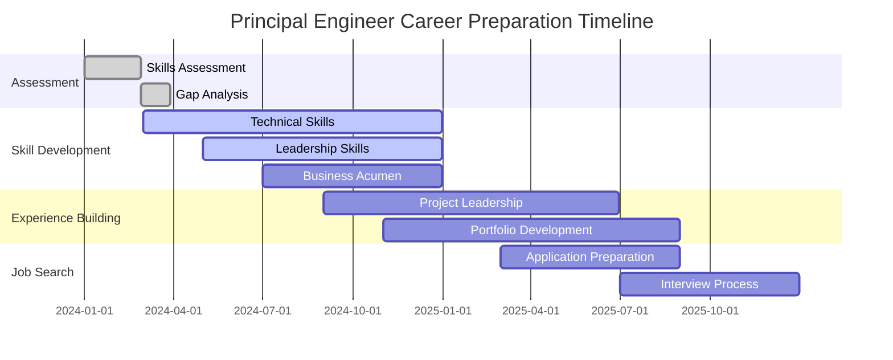

# Implementation Guide: Principal Engineer Career Preparation

## Overview

This implementation guide provides a structured, actionable roadmap for software engineers aspiring to advance to Principal Engineer roles. The guide includes specific milestones, skill development strategies, and practical steps for building technical leadership capabilities while preparing for remote opportunities in international markets.

## Career Preparation Framework

### 🎯 Assessment Phase (Months 1-2)

#### Current State Evaluation

**Technical Skills Audit:**
```markdown
## Technical Competency Checklist

### Core Engineering Skills
- [ ] 8+ years of software development experience
- [ ] Deep expertise in at least 2 programming languages
- [ ] Experience with distributed systems and microservices
- [ ] Understanding of system design and architecture principles
- [ ] Performance optimization and debugging experience
- [ ] Security best practices and implementation

### Leadership and Communication
- [ ] 3+ years of mentoring or technical leadership experience
- [ ] Experience presenting technical concepts to non-technical audiences
- [ ] Documentation and knowledge sharing experience
- [ ] Cross-functional collaboration skills
- [ ] Project management and planning capabilities

### Business and Strategic Thinking
- [ ] Understanding of business metrics and KPIs
- [ ] Experience aligning technical decisions with business goals
- [ ] Cost-benefit analysis of technical solutions
- [ ] Risk assessment and mitigation experience
- [ ] Industry and market knowledge
```

**Gap Analysis Framework:**
1. **Technical Gaps**: Identify missing technical competencies
2. **Leadership Gaps**: Assess communication and influence skills
3. **Business Gaps**: Evaluate understanding of business context
4. **Experience Gaps**: Determine missing types of project experience

#### Target Market Research

**Geographic Focus Selection:**
```python
# Market Evaluation Framework
markets = {
    "Australia": {
        "opportunity_score": 8,
        "timezone_compatibility": 9,
        "remote_culture": 8,
        "compensation_range": "AUD 180-350k",
        "visa_complexity": 6
    },
    "United Kingdom": {
        "opportunity_score": 9,
        "timezone_compatibility": 6,
        "remote_culture": 9,
        "compensation_range": "£90-180k",
        "visa_complexity": 5
    },
    "United States": {
        "opportunity_score": 7,
        "timezone_compatibility": 4,
        "remote_culture": 7,
        "compensation_range": "$200-400k",
        "visa_complexity": 8
    }
}
```

### 🛠️ Skill Development Phase (Months 3-12)

#### Technical Excellence Roadmap

**Quarter 1: Foundation Strengthening**

*System Architecture and Design:*
- Study distributed systems patterns (Circuit Breaker, Saga, CQRS)
- Complete system design courses (Grokking System Design, Educative.io)
- Practice designing systems at scale (10M+ users)
- Build and document a microservices architecture project

*Performance and Scalability:*
- Learn performance optimization techniques
- Study database optimization and query tuning
- Understand caching strategies (Redis, CDN, application-level)
- Practice capacity planning and load testing

*Technology Breadth:*
- Gain proficiency in cloud platforms (AWS/GCP/Azure)
- Learn Infrastructure as Code (Terraform, CloudFormation)
- Understand containerization and orchestration (Docker, Kubernetes)
- Study monitoring and observability tools (Prometheus, Grafana, Jaeger)

**Quarter 2: Leadership and Communication**

*Technical Mentoring:*
- Mentor 2-3 junior/mid-level engineers
- Conduct technical interviews
- Lead code reviews and establish review standards
- Create and deliver technical training sessions

*Documentation and Knowledge Sharing:*
- Write technical blog posts or internal documentation
- Create architecture decision records (ADRs)
- Develop technical onboarding materials
- Present at team meetings or local meetups

*Cross-Functional Collaboration:*
- Work closely with product managers on technical requirements
- Collaborate with designers on technical feasibility
- Participate in business planning and roadmap discussions
- Lead post-mortem discussions and improvement initiatives

**Quarter 3: Strategic and Business Skills**

*Business Acumen Development:*
- Study your company's business model and revenue streams
- Learn about your industry's competitive landscape
- Understand customer needs and market dynamics
- Analyze the financial impact of technical decisions

*Strategic Planning:*
- Participate in technical roadmap planning
- Conduct technology evaluations and recommendations
- Lead migration planning and execution
- Develop disaster recovery and business continuity plans

**Quarter 4: External Visibility and Network Building**

*Community Contribution:*
- Contribute to open source projects
- Speak at conferences or meetups
- Write technical articles for publication
- Participate in technical communities and forums

*Professional Network:*
- Connect with Principal Engineers on LinkedIn
- Join relevant professional groups and associations
- Attend industry conferences and networking events
- Build relationships with recruiters specializing in senior roles

#### Leadership Development Program

**Month 3-4: Foundational Leadership Skills**
- Complete leadership assessment (StrengthsFinder, DISC)
- Read foundational leadership books:
  - "The Staff Engineer's Path" by Tanya Reilly
  - "Staff Engineer: Leadership Beyond the Management Track" by Will Larson
  - "The Phoenix Project" by Gene Kim
  - "Accelerate" by Nicole Forsgren

**Month 5-6: Communication and Influence**
- Practice technical presentations to diverse audiences
- Develop skills in facilitating technical discussions
- Learn conflict resolution and consensus building
- Study change management and adoption strategies

**Month 7-8: Strategic Thinking**
- Learn about OKRs and strategic planning frameworks
- Practice long-term technical planning and roadmapping
- Study risk management and decision-making frameworks
- Develop skills in technology evaluation and selection

**Month 9-12: Advanced Leadership**
- Practice coaching and developing other engineers
- Learn about organizational design and team structures
- Study innovation management and R&D processes
- Develop skills in stakeholder management and executive communication

### 🎯 Experience Building Phase (Months 13-24)

#### Project Leadership Opportunities

**High-Impact Technical Projects:**
1. **System Migration**: Lead migration of legacy systems to modern architecture
2. **Performance Optimization**: Drive organization-wide performance improvement initiative
3. **Technology Evaluation**: Lead evaluation and adoption of new technology stack
4. **Platform Development**: Build internal tools or platforms used by multiple teams
5. **Disaster Recovery**: Design and implement business continuity and disaster recovery plans

**Cross-Functional Initiatives:**
1. **Technical Standards**: Establish engineering best practices and coding standards
2. **Developer Experience**: Improve internal developer tools and workflows
3. **Security Enhancement**: Lead security assessment and improvement initiatives
4. **Cost Optimization**: Drive infrastructure cost reduction and optimization
5. **Knowledge Management**: Create technical documentation and training programs

#### Portfolio Development

**Technical Portfolio Components:**
```markdown
## Principal Engineer Portfolio Structure

### 1. System Architecture Projects
- Large-scale distributed system designs
- Database architecture and optimization
- Microservices decomposition strategies
- API design and integration patterns

### 2. Leadership and Mentoring
- Team mentoring and development programs
- Technical training and knowledge sharing
- Code review and quality improvement initiatives
- Cross-functional collaboration examples

### 3. Business Impact Projects
- Cost optimization and efficiency improvements
- Performance enhancements with measurable results
- Risk mitigation and security improvements
- Customer experience and reliability improvements

### 4. Innovation and Research
- Technology evaluation and adoption
- Proof of concept and prototype development
- Research and development initiatives
- Industry trend analysis and recommendations
```

### 🌐 Remote Work Preparation (Months 6-18)

#### Remote Work Skill Development

**Communication Excellence:**
- Master asynchronous communication tools (Slack, Discord, email)
- Develop strong technical writing skills
- Practice video conferencing and remote presentation
- Learn documentation-first communication practices

**Cultural Adaptability:**
- Study business cultures in target markets (AU, UK, US)
- Understand time zone management and coordination
- Learn about remote work best practices and etiquette
- Develop skills in virtual team leadership and collaboration

**Technical Infrastructure:**
- Set up professional home office environment
- Invest in high-quality audio/video equipment
- Ensure reliable internet connectivity and backup options
- Master remote development tools and workflows

#### International Market Positioning

**Professional Branding:**
```markdown
## Personal Brand Development Checklist

### Online Presence
- [ ] Professional LinkedIn profile optimized for target markets
- [ ] Technical blog or personal website
- [ ] GitHub profile with high-quality project showcases
- [ ] Speaker profile on conference websites
- [ ] Contributions to technical publications

### Thought Leadership
- [ ] Regular technical content creation
- [ ] Speaking at conferences or meetups
- [ ] Open source project contributions
- [ ] Industry newsletter or podcast participation
- [ ] Technical mentoring and community involvement
```

**Network Development Strategy:**
1. **LinkedIn Optimization**: Connect with Principal Engineers in target companies and markets
2. **Conference Participation**: Attend virtual conferences in target geographic regions
3. **Community Engagement**: Join technical communities focused on your expertise areas
4. **Content Creation**: Share insights and expertise through blogs, talks, and social media
5. **Recruiter Relationships**: Build relationships with executive recruiters specializing in senior technical roles

### 🎯 Job Search and Application Phase (Months 18-24)

#### Job Search Strategy

**Target Company Research:**
```python
# Company Evaluation Framework
target_companies = {
    "criteria": {
        "remote_policy": "Remote-first or hybrid",
        "engineering_culture": "Strong technical leadership track",
        "growth_stage": "Scale-up to enterprise",
        "market_presence": "AU/UK/US operations",
        "compensation": "Competitive for Principal Engineer level"
    },
    "research_areas": [
        "Engineering blog and technical content",
        "Open source contributions and community involvement", 
        "Glassdoor reviews from engineers",
        "LinkedIn employee profiles and career paths",
        "Conference talks and technical presentations"
    ]
}
```

**Application Materials:**
1. **Resume Optimization**: Tailor for Principal Engineer roles with emphasis on technical leadership
2. **Cover Letter Strategy**: Highlight business impact and cross-functional collaboration
3. **Portfolio Preparation**: Prepare detailed case studies of technical leadership examples
4. **Reference Preparation**: Secure references from current/former colleagues and managers

#### Interview Preparation

**Technical Interview Preparation:**
- System design problems at Principal Engineer level
- Architecture and scalability discussions
- Technology evaluation and decision-making scenarios
- Code review and quality assessment exercises

**Behavioral Interview Preparation:**
- Leadership and influence examples (STAR method)
- Cross-functional collaboration stories
- Conflict resolution and consensus building
- Change management and adoption examples

**Executive Interview Preparation:**
- Business impact and strategic thinking examples
- Communication with senior leadership scenarios
- Long-term planning and vision discussions
- Risk assessment and mitigation strategies

### 📊 Progress Tracking and Milestones

#### Quarterly Milestones

**Quarter 1 (Months 1-3):**
- [ ] Complete skills assessment and gap analysis
- [ ] Begin technical skill development program
- [ ] Start mentoring junior engineers
- [ ] Establish baseline metrics for current performance

**Quarter 2 (Months 4-6):**
- [ ] Complete first major technical leadership project
- [ ] Begin contributing to technical community
- [ ] Develop professional online presence
- [ ] Complete leadership skills assessment

**Quarter 3 (Months 7-9):**
- [ ] Lead cross-functional initiative
- [ ] Speak at conference or meetup
- [ ] Complete system architecture project
- [ ] Begin building international network

**Quarter 4 (Months 10-12):**
- [ ] Complete business impact project with measurable results
- [ ] Establish thought leadership through content creation
- [ ] Mentor other engineers successfully to promotion
- [ ] Begin preparation for Principal Engineer interviews

**Year 2 Milestones:**
- [ ] Successfully interview for Principal Engineer roles
- [ ] Secure offer from target market company
- [ ] Negotiate compensation and remote work arrangements
- [ ] Transition to Principal Engineer role

#### Success Metrics

**Technical Leadership Metrics:**
- Number of engineers mentored and developed
- Technical projects led and delivered successfully
- System performance improvements achieved
- Cost optimizations and efficiency gains

**Business Impact Metrics:**
- Revenue impact of technical decisions
- Customer satisfaction improvements
- Risk mitigation and incident reduction
- Process improvements and automation

**Professional Development Metrics:**
- Conference talks and presentations delivered
- Technical articles published
- Open source contributions made
- Professional network growth

## Common Implementation Challenges

### 🚨 Potential Obstacles

**Technical Challenges:**
- Balancing depth vs. breadth in skill development
- Staying current with rapidly evolving technology landscape
- Managing technical debt while delivering business value
- Scaling architectural knowledge across multiple domains

**Leadership Challenges:**
- Transitioning from individual contributor to influencer
- Managing competing priorities and stakeholder expectations
- Building consensus without formal authority
- Balancing technical excellence with business pragmatism

**Career Transition Challenges:**
- Demonstrating readiness for Principal Engineer level responsibility
- Building credibility with senior leadership and stakeholders
- Managing increased visibility and accountability
- Balancing current role responsibilities with career development

### 🛠️ Solutions and Strategies

**Technical Skill Development:**
- Focus on fundamental principles that transcend specific technologies
- Build learning networks with other senior engineers
- Allocate 20% time for exploration and skill development
- Create technical learning plans with specific goals and timelines

**Leadership Development:**
- Seek feedback regularly from peers, managers, and direct reports
- Practice influence and communication skills in low-risk environments
- Find mentors who have successfully made the transition
- Join leadership development programs or coaching

**Career Positioning:**
- Document and quantify all achievements and business impact
- Seek stretch assignments that demonstrate Principal Engineer capabilities
- Build relationships with senior leadership and key stakeholders
- Create visibility through internal and external technical contributions

## Resource Recommendations

### 📚 Essential Reading

**Technical Leadership:**
- "The Staff Engineer's Path" by Tanya Reilly
- "Staff Engineer: Leadership Beyond the Management Track" by Will Larson
- "The Architecture of Open Source Applications" by Amy Brown and Greg Wilson
- "Designing Data-Intensive Applications" by Martin Kleppmann

**Business and Strategy:**
- "Good Strategy Bad Strategy" by Richard Rumelt
- "The Lean Startup" by Eric Ries
- "Crossing the Chasm" by Geoffrey Moore
- "The Innovator's Dilemma" by Clayton Christensen

**Communication and Leadership:**
- "Made to Stick" by Chip Heath and Dan Heath
- "The Pyramid Principle" by Barbara Minto
- "Crucial Conversations" by Kerry Patterson
- "Getting to Yes" by Roger Fisher and William Ury

### 🎓 Learning Platforms

**Technical Skills:**
- System Design Interview courses (Educative.io, Grokking the System Design)
- Cloud architecture certifications (AWS Solutions Architect, Google Cloud Professional)
- Platform-specific training (Kubernetes, microservices, DevOps)
- University courses (MIT OpenCourseWare, Stanford CS courses)

**Leadership and Business:**
- Executive education programs (Harvard Business School Online, Stanford Graduate School of Business)
- Leadership development courses (Coursera, LinkedIn Learning)
- Business fundamentals (Khan Academy, edX)
- Communication and presentation skills (Toastmasters, Dale Carnegie)

### 🌐 Professional Communities

**Technical Communities:**
- IEEE Computer Society
- ACM (Association for Computing Machinery)
- Local meetups and user groups
- Industry-specific communities (FinTech, HealthTech, etc.)

**Leadership Communities:**
- Chief Technology Officer (CTO) forums
- Engineering leadership communities
- Remote work professional groups
- Industry-specific leadership networks

## Implementation Timeline Summary



This implementation guide provides a comprehensive roadmap for advancing to Principal Engineer roles. The key to success is consistent execution of the plan while remaining adaptable to opportunities and feedback along the way.

## Navigation

- ← Previous: [Executive Summary](./executive-summary.md)
- → Next: [Best Practices](./best-practices.md)
- ↑ Back to: [Principal Engineer Role Analysis](./README.md)

---

**Document Type**: Implementation Guide  
**Last Updated**: January 2025  
**Implementation Timeframe**: 18-24 months