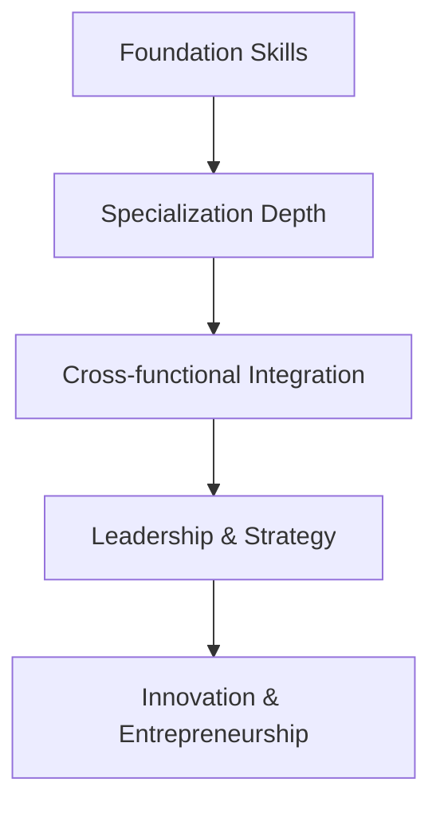

# Implementation Guide - Using the Research Topics Catalog

Comprehensive guide for effectively utilizing the Research Topics Catalog to accelerate career growth, technical expertise, and business development. This implementation framework ensures maximum value from research investments and systematic skill development.

## 🎯 Research Planning Framework

### Strategic Topic Selection Process

**Step 1: Current State Assessment**
1. **Skill Inventory Analysis**
   - List current technical skills and expertise levels (1-10 scale)
   - Identify complementary business and soft skills
   - Assess market demand for existing skills
   - Note skill gaps in target roles or opportunities

2. **Career Goal Definition**
   - Define 6-month, 1-year, and 3-year career objectives
   - Identify target roles, companies, or business opportunities
   - Set measurable success criteria (salary, responsibilities, impact)
   - Align goals with personal interests and market trends

3. **Resource Assessment**
   - Available time for research (hours per week)
   - Learning preferences (hands-on, theoretical, mixed)
   - Budget for tools, courses, and certifications
   - Access to mentors, communities, and networking opportunities

**Step 2: Priority Matrix Development**

Use this framework to prioritize research topics:

| Impact Level | Time to Value | Resource Requirements | Priority Score |
|--------------|---------------|---------------------|----------------|
| **High Impact + Quick Value + Low Resources** = Priority 1 | Immediate (0-3 months) | Minimal investment | 🔥 Critical |
| **High Impact + Medium Value + Medium Resources** = Priority 2 | Short-term (3-6 months) | Moderate investment | 🚀 High |
| **Medium Impact + Quick Value + Low Resources** = Priority 3 | Quick wins (0-1 month) | Low investment | ✅ Medium |
| **High Impact + Long Value + High Resources** = Priority 4 | Long-term (6+ months) | Significant investment | 📈 Strategic |

**Step 3: Learning Path Design**

Create integrated learning sequences that build upon each other:

## 📚 Research Session Optimization

### Effective Research Methodology

**Pre-Research Preparation (30 minutes)**
1. **Objective Setting**
   - Define specific learning outcomes and success criteria
   - Identify practical applications for new knowledge
   - Set time boundaries and scope limitations
   - Prepare note-taking and documentation systems

2. **Context Building**
   - Review existing knowledge and related experience
   - Identify key questions and knowledge gaps
   - Research background information and terminology
   - Connect to current projects or opportunities

**Deep Research Phase (4-8 hours)**

**Hour 1-2: Foundation and Context**
- Research fundamental concepts and terminology
- Understand historical context and evolution
- Identify key players, tools, and frameworks
- Review academic and industry sources

**Hour 3-5: Practical Implementation**
- Analyze real-world implementations and case studies
- Explore tools, frameworks, and best practices
- Create hands-on experiments or proof-of-concepts
- Document code examples and configuration samples

**Hour 6-8: Strategic Application**
- Evaluate business implications and market opportunities
- Assess integration with existing skills and projects
- Plan implementation roadmap and next steps
- Create summary documentation and action items

**Post-Research Consolidation (1 hour)**
1. **Knowledge Synthesis**
   - Create comprehensive summary and key takeaways
   - Develop implementation checklist and timeline
   - Identify additional resources and follow-up research
   - Connect insights to career goals and current projects

2. **Action Planning**
   - Schedule practical application and experimentation
   - Plan skill development and practice sessions
   - Identify networking and community engagement opportunities
   - Set follow-up research and review schedules

### Research Quality Standards

**Technical Research Excellence:**
- ✅ **Hands-on Implementation** - Build working examples and prototypes
- ✅ **Performance Analysis** - Benchmark and optimize implementations
- ✅ **Security Considerations** - Understand and implement security best practices
- ✅ **Scalability Assessment** - Evaluate enterprise-level requirements and solutions
- ✅ **Integration Planning** - Plan compatibility with existing systems and workflows

**Business Research Depth:**
- ✅ **Market Analysis** - Understand industry trends and competitive landscape
- ✅ **Financial Modeling** - Calculate costs, ROI, and business impact
- ✅ **Risk Assessment** - Identify and plan mitigation for implementation risks
- ✅ **Stakeholder Analysis** - Understand impact on different user groups and decision makers
- ✅ **Implementation Timeline** - Create realistic project planning and resource allocation

## 🚀 Research-to-Action Pipeline

### Knowledge Application Framework

**Week 1: Immediate Application**
- Implement learned concepts in current projects or experiments
- Share insights with team members or professional network
- Update resume, portfolio, or professional profiles with new skills
- Begin practical exercises and skill development activities

**Week 2-4: Integration and Practice**
- Integrate new knowledge into daily work and processes
- Seek opportunities to apply skills in real scenarios
- Connect with communities and experts in the research area
- Continue hands-on practice and skill refinement

**Month 2-3: Expertise Development**
- Lead projects or initiatives using researched technologies
- Mentor others or create content about learned topics
- Contribute to open source projects or community discussions
- Develop case studies and portfolio examples

**Month 4-6: Strategic Implementation**
- Propose strategic initiatives based on research insights
- Pursue certifications or formal recognition in research areas
- Explore business opportunities or career advancement options
- Plan next-level research topics building on established expertise

### Career Integration Strategies

**Portfolio Enhancement:**
- Document research outcomes in professional portfolio
- Create case studies and implementation examples
- Develop thought leadership content (blog posts, talks)
- Build GitHub repositories showcasing new skills

**Professional Networking:**
- Join communities and forums related to research topics
- Attend conferences and meetups in specialized areas
- Engage with thought leaders and practitioners online
- Seek mentorship and advisory relationships

**Career Positioning:**
- Update LinkedIn and professional profiles with new expertise
- Seek roles and projects that utilize researched skills
- Position for promotion or role advancement opportunities
- Explore consulting or freelancing in specialized areas

## 📊 Progress Tracking and Measurement

### Research ROI Assessment

**Skill Development Metrics:**
- **Technical Proficiency**: Self-assessment scores (1-10) before and after research
- **Implementation Capability**: Ability to build production-ready solutions
- **Problem-Solving Speed**: Time reduction for solving related challenges
- **Knowledge Retention**: Accuracy of recall and application after 30/90 days

**Career Impact Indicators:**
- **Role Advancement**: Promotions, title changes, responsibility increases
- **Compensation Growth**: Salary increases, bonus improvements, equity gains
- **Opportunity Access**: Interview requests, project leadership, speaking invitations
- **Professional Recognition**: Industry acknowledgment, community leadership, thought leadership

**Business Value Creation:**
- **Project Impact**: Measurable improvements in project outcomes
- **Revenue Contribution**: Direct business value from applied research
- **Cost Optimization**: Efficiency gains and resource savings
- **Innovation Leadership**: New initiatives and competitive advantages

### Continuous Improvement Process

**Monthly Research Review:**
1. Assess progress toward research goals and career objectives
2. Evaluate effectiveness of research methodology and time allocation
3. Identify successful knowledge application and areas for improvement
4. Plan adjustments to research priorities and learning strategies

**Quarterly Skills Assessment:**
1. Conduct comprehensive skill inventory and gap analysis
2. Review market demand and compensation trends for developed skills
3. Assess career advancement progress and opportunity pipeline
4. Update learning priorities and resource allocation

**Annual Strategic Planning:**
1. Review overall career growth and research investment outcomes
2. Analyze market trends and emerging technology opportunities
3. Plan strategic research initiatives for the following year
4. Set ambitious but achievable career and business development goals

## 🛠️ Research Tools and Resources

### Essential Research Infrastructure

**Documentation and Knowledge Management:**
- **Notion/Obsidian**: Interconnected note-taking and knowledge graphs
- **GitHub**: Code examples, implementations, and version control
- **Portfolio Website**: Professional showcase and thought leadership platform
- **LinkedIn**: Professional networking and content sharing

**Hands-on Development Environment:**
- **Cloud Platforms**: AWS/Azure/GCP free tiers for experimentation
- **Development Tools**: Modern IDEs, containerization, and CI/CD
- **Learning Platforms**: Pluralsight, Udemy, Coursera for structured learning
- **Community Access**: Discord, Slack, forums for peer learning and support

**Market Research and Analysis:**
- **Industry Reports**: Gartner, Forrester, McKinsey for market intelligence
- **Salary Data**: Glassdoor, levels.fyi, Stack Overflow surveys
- **Technology Trends**: GitHub trending, Stack Overflow insights, developer surveys
- **Business Intelligence**: Crunchbase, AngelList, company financials

### Research Accelerators

**AI-Powered Research Assistance:**
- **ChatGPT/Claude**: Concept explanation, code generation, analysis support
- **GitHub Copilot**: Code implementation and best practice suggestions
- **Perplexity**: Research synthesis and citation management
- **Notion AI**: Documentation and knowledge organization

**Community and Expert Access:**
- **Professional Networks**: LinkedIn groups, industry associations
- **Developer Communities**: Stack Overflow, Reddit, Discord servers
- **Open Source Projects**: GitHub contributions and maintainer connections
- **Conference Access**: Virtual events, recorded sessions, speaker networks

## 🗺️ Navigation

| Previous | Current | Next |
|----------|---------|------|
| [EdTech Business Research Topics](./edtech-business-research-topics.md) | **Implementation Guide** | [Best Practices](./best-practices.md) |

---

*Effective research implementation requires consistent application, continuous measurement, and strategic alignment with career goals for maximum professional development impact.*