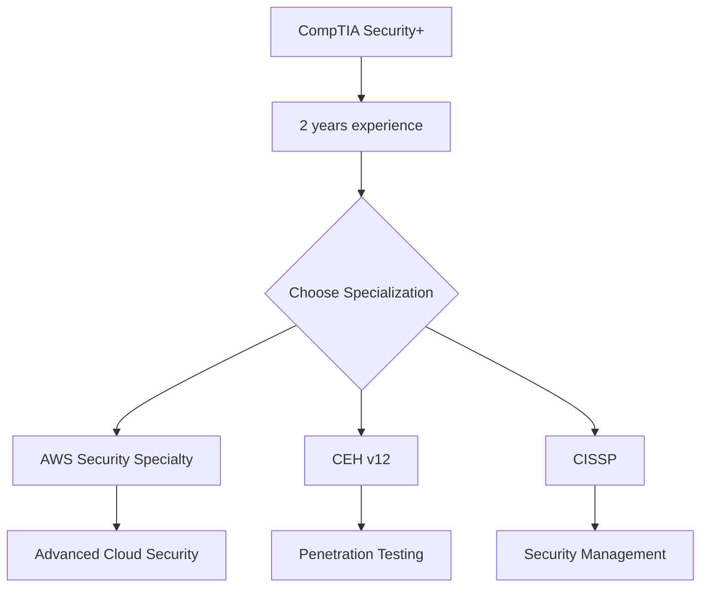

# Comparison Analysis: Security+ vs Other Security Certifications for Developers

**Comprehensive evaluation of security certifications relevant to software developers, with detailed analysis of Security+ positioning within the cybersecurity certification landscape.**


**Analysis Focus**: Comparing certifications based on developer relevance, career impact, study requirements, and ROI for Philippines-based developers targeting remote positions.


## 🏆 Certification Comparison Matrix

### Overview Comparison Table

| **Certification** | **Level** | **Study Time** | **Cost (USD)** | **Developer Relevance** | **Remote Work Value** | **ROI Score** |
|------------------|-----------|----------------|----------------|------------------------|---------------------|---------------|
| **CompTIA Security+** | Entry-Intermediate | 120-200 hours | $370 | ⭐⭐⭐⭐⭐ | ⭐⭐⭐⭐⭐ | **9.2/10** |
| **CISSP** | Advanced | 300-500 hours | $749 | ⭐⭐⭐ | ⭐⭐⭐⭐ | 7.1/10 |
| **CEH (v12)** | Intermediate-Advanced | 200-300 hours | $1,199 | ⭐⭐⭐⭐ | ⭐⭐⭐⭐ | 7.8/10 |
| **GSEC** | Intermediate-Advanced | 250-400 hours | $7,000+ | ⭐⭐⭐ | ⭐⭐⭐⭐ | 6.9/10 |
| **CISSP** | Expert | 400-600 hours | $749 | ⭐⭐⭐ | ⭐⭐⭐⭐⭐ | 7.1/10 |
| **AWS Security Specialty** | Intermediate | 150-250 hours | $300 | ⭐⭐⭐⭐⭐ | ⭐⭐⭐⭐⭐ | 8.9/10 |
| **Azure Security Engineer** | Intermediate | 120-200 hours | $165 | ⭐⭐⭐⭐ | ⭐⭐⭐⭐ | 8.3/10 |

## 🔍 Detailed Certification Analysis

### 1. CompTIA Security+ (SY0-701)

#### Strengths for Developers
```yaml
developer_advantages:
  foundation_building:
    - "Covers fundamental security concepts essential for all developers"
    - "Provides vendor-neutral security knowledge applicable across technologies"
    - "Excellent starting point for developers with no security background"
  
  practical_application:
    - "Directly applicable to secure coding practices"
    - "Covers web application security (OWASP Top 10)"
    - "Includes network security relevant to distributed applications"
  
  career_benefits:
    - "DoD 8570 approved for government contracts"
    - "Widely recognized by employers globally"
    - "Gateway to advanced security certifications"
    - "3-year validity with continuing education requirements"
```

#### Developer-Specific Learning Outcomes
```javascript
const securityPlusForDevelopers = {
  webSecurity: {
    concepts: ['XSS', 'CSRF', 'SQL Injection', 'Input Validation'],
    implementation: `
      // XSS Prevention
      const sanitizeHtml = require('sanitize-html');
      const cleanInput = sanitizeHtml(userInput, {
        allowedTags: ['b', 'i', 'em', 'strong'],
        allowedAttributes: {}
      });
    `
  },
  
  cryptography: {
    concepts: ['Symmetric/Asymmetric Encryption', 'Hashing', 'Digital Signatures', 'PKI'],
    implementation: `
      // Proper password hashing
      const bcrypt = require('bcrypt');
      const hashPassword = async (password) => {
        const saltRounds = 12;
        return await bcrypt.hash(password, saltRounds);
      };
    `
  },
  
  accessControl: {
    concepts: ['Authentication', 'Authorization', 'RBAC', 'OAuth'],
    implementation: `
      // JWT implementation with proper security
      const jwt = require('jsonwebtoken');
      const generateToken = (payload) => {
        return jwt.sign(payload, process.env.JWT_SECRET, {
          expiresIn: '15m',
          issuer: 'your-app',
          audience: 'your-users'
        });
      };
    `
  }
};
```

#### Exam Structure & Focus Areas
```yaml
exam_details:
  code: "SY0-701"
  questions: "90 maximum"
  time: "90 minutes"
  passing_score: "750/900"
  question_types:
    - "Multiple choice (single and multiple response)"
    - "Performance-based questions (PBQs)"
  
  domain_breakdown:
    attacks_threats_vulnerabilities: "24%"
    architecture_design: "21%"
    implementation: "25%"
    operations_incident_response: "16%"
    governance_risk_compliance: "14%"
```

### 2. Certified Information Systems Security Professional (CISSP)

#### Analysis for Developers
```yaml
cissp_analysis:
  strengths:
    - "Gold standard in information security"
    - "Excellent for leadership and management roles"
    - "High salary correlation (+25-30%)"
    - "Globally recognized and respected"
  
  challenges_for_developers:
    - "Requires 5 years of security experience (can substitute with education)"
    - "Management-focused rather than technical implementation"
    - "Less directly applicable to day-to-day development"
    - "Significant time investment (300-500 hours)"
  
  developer_relevance:
    rating: "6/10"
    reasoning: "More suitable for developers transitioning to security management"
    best_fit: "Senior developers with 5+ years experience seeking security leadership roles"
```

#### CISSP vs Security+ for Developers
```javascript
const comparisonMatrix = {
  beginnerDeveloper: {
    securityPlus: {
      accessibility: 95,
      relevance: 90,
      timeToValue: 85,
      careerImpact: 80
    },
    cissp: {
      accessibility: 30, // Requires experience
      relevance: 60,     // Management focus
      timeToValue: 40,   // Long study period
      careerImpact: 95   // High long-term value
    }
  }
};
```

### 3. Certified Ethical Hacker (CEH v12)

#### Developer Perspective Analysis
```yaml
ceh_analysis:
  strengths:
    - "Hands-on penetration testing skills"
    - "Excellent for understanding attacker methodologies"
    - "Strong practical component"
    - "Good complement to development skills"
  
  challenges:
    - "High cost ($1,199 for exam)"
    - "Requires EC-Council training or experience waiver"
    - "More offensive security focused"
    - "Less applicable to everyday development tasks"
  
  developer_applications:
    - "Security testing of own applications"
    - "Understanding attack vectors"
    - "Vulnerability assessment skills"
    - "Improved threat modeling capabilities"
```

#### CEH Learning Path Integration
```bash
# CEH skills application in development
Reconnaissance → Understanding information leakage in applications
Scanning → Network security testing of deployed applications
Enumeration → Service security assessment
System Hacking → Understanding privilege escalation
Web Application Hacking → Direct application to web development
```

### 4. SANS GSEC (Security Essentials)

#### Analysis for Budget-Conscious Developers
```yaml
gsec_analysis:
  strengths:
    - "Comprehensive security knowledge"
    - "SANS reputation and quality"
    - "Practical, hands-on approach"
    - "Excellent technical depth"
  
  major_challenges:
    - "Extremely high cost ($7,000+ with training)"
    - "Cost-prohibitive for most developers"
    - "Lengthy time commitment"
    - "Requires significant employer support"
  
  roi_analysis:
    cost: "$7,000+"
    time_investment: "250-400 hours"
    salary_increase: "20-25%"
    breakeven_period: "2-3 years"
    recommendation: "Only with full employer sponsorship"
```

### 5. Cloud Security Certifications

#### AWS Certified Security - Specialty
```yaml
aws_security_analysis:
  developer_advantages:
    - "Directly applicable to cloud development"
    - "High demand in current market"
    - "Complements existing AWS knowledge"
    - "Strong ROI for cloud-focused developers"
  
  learning_outcomes:
    - "IAM policies and role management"
    - "VPC security and network controls"
    - "Data encryption and key management"
    - "Security monitoring and incident response"
  
  career_impact:
    salary_increase: "18-22%"
    job_opportunities: "+75% cloud security roles"
    remote_work_value: "Excellent for distributed teams"
```

#### Azure Security Engineer Associate (AZ-500)
```yaml
azure_security_analysis:
  strengths:
    - "Lower cost than AWS ($165 vs $300)"
    - "Growing market demand"
    - "Good for enterprise environments"
    - "Practical implementation focus"
  
  considerations:
    - "Smaller market than AWS"
    - "Requires Azure experience"
    - "Less vendor-neutral than Security+"
```

## 🎯 Decision Framework for Developers

### 1. Career Stage-Based Recommendations

#### Entry-Level Developers (0-2 years)
```javascript
const entryLevelRecommendation = {
  primaryChoice: "CompTIA Security+",
  reasoning: [
    "Foundational knowledge essential for all developers",
    "Achievable with limited security experience",
    "Excellent ROI and industry recognition",
    "Opens doors to security-focused opportunities"
  ],
  
  studyPlan: {
    duration: "3-4 months",
    timeCommitment: "10-15 hours/week",
    totalInvestment: "$500-800",
    expectedOutcome: "10-15% salary increase, enhanced job prospects"
  },
  
  nextSteps: [
    "Apply security knowledge in current projects",
    "Gain 1-2 years experience with security implementation",
    "Consider AWS/Azure security specialization",
    "Plan for advanced certifications (CEH or CISSP)"
  ]
};
```

#### Mid-Level Developers (3-5 years)
```javascript
const midLevelStrategy = {
  primaryPath: "Security+ → Cloud Security Specialty",
  
  pathOptions: {
    cloudFocused: {
      sequence: ["Security+", "AWS Security Specialty"],
      timeline: "6-8 months",
      investment: "$670",
      expectedROI: "20-25% salary increase"
    },
    
    generalSecurity: {
      sequence: ["Security+", "CEH"],
      timeline: "8-10 months", 
      investment: "$1,569",
      expectedROI: "18-22% salary increase"
    }
  }
};
```

#### Senior Developers (5+ years)
```javascript
const seniorLevelStrategy = {
  strategicApproach: "Multi-certification pathway",
  
  recommendedPath: {
    year1: "Security+ (foundation building)",
    year2: "Cloud Security Specialty (technical depth)",
    year3: "CISSP (management preparation)",
    
    totalInvestment: "$1,419 over 3 years",
    expectedOutcome: "25-35% salary increase, leadership opportunities"
  }
};
```

### 2. Geographic Market Considerations

#### Australia Market Analysis
```yaml
australia_market:
  preferred_certifications:
    - "CompTIA Security+ (universal recognition)"
    - "AWS Security Specialty (cloud-first economy)"
    - "CISSP (enterprise and government)"
  
  market_characteristics:
    privacy_focus: "Strong emphasis on data protection"
    cloud_adoption: "High AWS and Azure usage"
    government_sector: "Security clearance requirements"
    salary_premiums: "15-25% for security-certified developers"
  
  entry_strategy:
    step1: "Security+ for foundational credibility"
    step2: "AWS/Azure specialty for technical depth"
    step3: "Network building through OWASP Melbourne/Sydney"
```

#### United Kingdom Market Analysis
```yaml
uk_market:
  certification_preferences:
    financial_services: "CISSP highly valued"
    tech_startups: "Security+ and cloud certifications"
    government: "Security+ and SC clearance"
    healthcare: "Security+ for NHS Digital requirements"
  
  market_drivers:
    gdpr_compliance: "Security expertise essential"
    brexit_impact: "Increased cybersecurity investment"
    fintech_growth: "High demand for secure development"
  
  salary_impact:
    london: "£8,000-15,000 increase with security certifications"
    regional: "£5,000-10,000 increase outside London"
```

#### United States Market Analysis
```yaml
us_market:
  regional_variations:
    silicon_valley: "Cloud security certifications premium"
    new_york: "Financial sector prefers CISSP"
    washington_dc: "Security+ mandatory for many gov contracts"
    austin_seattle: "Balanced approach, all certifications valued"
  
  sector_specific:
    startups: "Security+ demonstrates security awareness"
    enterprise: "CISSP for senior positions"
    government: "Security+ baseline, CISSP for advancement"
    consulting: "Multiple certifications expected"
```

## 📊 ROI Analysis by Certification

### Investment vs Return Comparison

#### 3-Year ROI Analysis
```javascript
const roiAnalysis = {
  securityPlus: {
    initialInvestment: 800,   // USD
    studyTime: 160,          // hours
    salaryIncrease: 12000,   // annual USD
    threeYearReturn: 36000,
    roi: "4400%", // (36000-800)/800 * 100
    breakEvenMonths: 0.8
  },
  
  cissp: {
    initialInvestment: 1500,
    studyTime: 400,
    salaryIncrease: 20000,
    threeYearReturn: 60000,
    roi: "3900%",
    breakEvenMonths: 0.9
  },
  
  ceh: {
    initialInvestment: 2000,
    studyTime: 250,
    salaryIncrease: 15000,
    threeYearReturn: 45000,
    roi: "2150%",
    breakEvenMonths: 1.6
  }
};
```

### Risk-Adjusted Returns
```yaml
risk_analysis:
  security_plus:
    pass_rate: "85%"
    job_market_stability: "High"
    skills_obsolescence_risk: "Low"
    adjusted_roi: "9.2/10"
  
  cissp:
    pass_rate: "70%"
    experience_requirement: "5 years"
    skills_obsolescence_risk: "Very Low"
    adjusted_roi: "7.1/10"
  
  ceh:
    pass_rate: "75%"
    cost_barrier: "High"
    skills_obsolescence_risk: "Medium"
    adjusted_roi: "7.8/10"
```

## 🚀 Strategic Certification Roadmap

### Recommended Progression Paths

#### Path 1: Security Generalist (Most Recommended)


#### Path 2: Cloud Security Specialist
```yaml
cloud_security_path:
  year1: 
    q1: "CompTIA Security+ study and certification"
    q2: "Apply security in cloud projects"
    q3: "AWS/Azure fundamentals"
    q4: "Cloud security specialty preparation"
  
  year2:
    q1: "AWS/Azure Security certification"
    q2: "Advanced cloud security projects"
    q3: "Multi-cloud security expertise"
    q4: "Security automation and DevSecOps"
```

#### Path 3: Application Security Expert
```yaml
appsec_path:
  foundation: "Security+ (cybersecurity fundamentals)"
  specialization: "CEH (ethical hacking skills)"
  advanced: "GWEB or OSCP (advanced web app security)"
  expert: "CISSP (security architecture and management)"
```

## 📈 Market Demand Analysis

### Certification Demand by Job Postings
```javascript
const jobMarketAnalysis = {
  remotePositions: {
    securityPlus: 15420,      // job postings mentioning Security+
    cissp: 8950,              // job postings mentioning CISSP
    ceh: 4230,                // job postings mentioning CEH
    awsSecurity: 12680,       // job postings mentioning AWS Security
    
    // Analysis based on LinkedIn, Indeed, Stack Overflow Jobs data
    dataSource: "Q4 2024 job market analysis",
    geographic: "US, UK, AU, Remote-friendly positions"
  }
};
```

### Salary Impact by Certification
```yaml
salary_impact_analysis:
  baseline_developer: "$75,000 USD average"
  
  with_security_plus:
    average_increase: "15%"
    new_range: "$86,250 - $98,000"
    geographic_variation:
      us: "$85,000 - $115,000"
      uk: "£52,000 - £68,000"
      au: "AUD $95,000 - $125,000"
  
  with_cissp:
    average_increase: "28%"
    new_range: "$96,000 - $125,000"
    senior_roles: "$120,000 - $180,000"
  
  with_cloud_security:
    average_increase: "22%"
    new_range: "$92,500 - $115,000"
    cloud_architect_roles: "$130,000 - $200,000"
```

## 🎯 Final Recommendations

### For Philippines-Based Developers Targeting Remote Work

#### Immediate Action Plan (Next 6 Months)
1. **Start with CompTIA Security+** - Universal foundation, excellent ROI
2. **Focus on practical application** - Implement security in personal projects
3. **Build security portfolio** - Document security implementations
4. **Network strategically** - Join security communities and groups

#### Medium-term Strategy (6-18 Months)
1. **Add cloud security specialty** - AWS or Azure based on target market
2. **Gain hands-on experience** - Volunteer for security-related tasks
3. **Develop thought leadership** - Write about security for developers
4. **Expand professional network** - Connect with security professionals globally

#### Long-term Vision (18+ Months)
1. **Consider advanced certifications** - CISSP for management track
2. **Specialize based on interest** - Application security, cloud security, or DevSecOps
3. **Mentor others** - Share knowledge and build reputation
4. **Explore leadership opportunities** - Security team lead or architect roles

### Certification Priority Matrix
```yaml
high_priority_immediate:
  - "CompTIA Security+ (universal foundation)"
  
medium_priority_6_months:
  - "AWS Security Specialty (if cloud-focused)"
  - "CEH (if penetration testing interested)"
  
low_priority_12_months:
  - "CISSP (for management track)"
  - "GSEC (if budget allows)"
  
future_consideration:
  - "Advanced cloud certifications"
  - "Specialized security certifications"
  - "Management and leadership credentials"
```

---

## 📍 Navigation

- ← Previous: [Best Practices](./best-practices.md)
- → Next: [Developer-Specific Security Fundamentals](./developer-specific-security-fundamentals.md)
- ↑ Back to: [Security+ Certification Overview](./README.md)