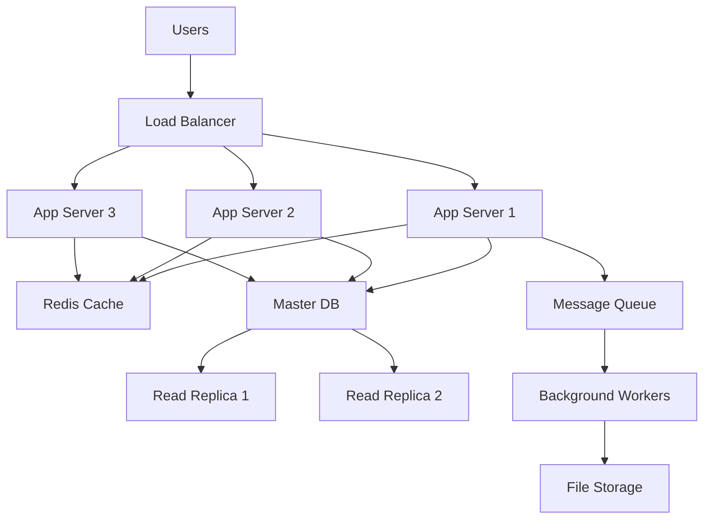

# Best Practices

## Proven Strategies for Senior Technical Interview Success

This document compiles the most effective practices and methodologies for senior-level technical interview preparation, based on successful outcomes from Philippines-based developers who secured senior roles in AU, UK, and US companies.

## 🎯 System Design Interview Best Practices

### The 5-Phase System Design Approach

#### Phase 1: Requirements Clarification (10 minutes)
**Best Practice Framework**:
```typescript
interface RequirementsFramework {
  functionalRequirements: {
    coreFeatures: string[];
    userActions: string[];
    businessLogic: string[];
  };
  nonFunctionalRequirements: {
    scale: { users: number; requests: number; data: string };
    performance: { latency: string; throughput: string };
    availability: string;
    consistency: "strong" | "eventual" | "weak";
  };
  constraints: {
    budget: string;
    timeline: string;
    team: string;
    technology: string[];
  };
}
```

**✅ Do**:
- Ask specific questions about scale: "How many users? Daily/monthly active?"
- Clarify performance requirements: "What's acceptable latency?"
- Understand business context: "Is this internal tool or customer-facing?"
- Define success metrics: "How do we measure system success?"

**❌ Don't**:
- Start designing without clarification
- Assume requirements without asking
- Skip non-functional requirements discussion
- Forget to discuss constraints and trade-offs

#### Phase 2: Capacity Estimation (10 minutes)
**Best Practice Calculations**:
```typescript
// Example: Social Media Feed Capacity Planning
const capacityEstimation = {
  // User metrics
  totalUsers: 100_000_000,
  dailyActiveUsers: 20_000_000, // 20% of total
  postsPerUserPerDay: 2,
  feedViewsPerUserPerDay: 50,
  
  // Traffic calculations
  dailyPosts: 40_000_000,
  postsPerSecond: 463, // daily / (24 * 60 * 60)
  peakMultiplier: 3,
  peakPostsPerSecond: 1389,
  
  dailyReads: 1_000_000_000,
  readsPerSecond: 11574,
  peakReadsPerSecond: 34722,
  
  // Storage calculations
  averagePostSize: 500, // bytes (text + metadata)
  imageSize: 2_000_000, // 2MB average
  postsWithImages: 0.3, // 30% have images
  
  dailyStorageNeeded: "28 GB", // text + images
  yearlyStorageNeeded: "10 TB"
};
```

**✅ Pro Tips**:
- Use round numbers for easier calculation (100M users, not 99.7M)
- Show your work clearly: "100M users × 20% active = 20M DAU"
- Consider peak traffic (3-5x normal)
- Include both read and write patterns
- Account for data growth over time

#### Phase 3: High-Level Design (15 minutes)
**Component Design Best Practices**:


**✅ Design Principles**:
- Start simple, then add complexity
- Clearly label all components
- Show data flow with arrows
- Separate read and write paths
- Include monitoring and logging components

#### Phase 4: Detailed Design (20 minutes)
**Database Schema Design**:
```sql
-- Users table with sharding consideration
CREATE TABLE users (
    user_id BIGSERIAL PRIMARY KEY,
    username VARCHAR(50) UNIQUE NOT NULL,
    email VARCHAR(255) UNIQUE NOT NULL,
    password_hash VARCHAR(255) NOT NULL,
    created_at TIMESTAMP DEFAULT NOW(),
    -- Sharding key for horizontal scaling
    shard_key INTEGER NOT NULL DEFAULT (user_id % 1000)
);

-- Posts table optimized for timeline queries
CREATE TABLE posts (
    post_id BIGSERIAL PRIMARY KEY,
    user_id BIGINT NOT NULL REFERENCES users(user_id),
    content TEXT NOT NULL,
    image_url VARCHAR(500),
    created_at TIMESTAMP DEFAULT NOW(),
    -- Composite index for timeline queries
    INDEX idx_user_created (user_id, created_at DESC)
);

-- Followers table for social graph
CREATE TABLE followers (
    follower_id BIGINT NOT NULL REFERENCES users(user_id),
    following_id BIGINT NOT NULL REFERENCES users(user_id),
    created_at TIMESTAMP DEFAULT NOW(),
    PRIMARY KEY (follower_id, following_id),
    INDEX idx_following (following_id, created_at)
);
```

**API Design Best Practices**:
```typescript
// RESTful API design with proper versioning
interface PostAPI {
  // Get user timeline
  GET: "/api/v1/users/:userId/timeline?limit=20&cursor=abc123";
  
  // Create new post
  POST: "/api/v1/posts";
  body: {
    content: string;
    imageUrl?: string;
    visibility: "public" | "private" | "friends";
  };
  
  // Get post details
  GET: "/api/v1/posts/:postId";
  
  // Update post
  PUT: "/api/v1/posts/:postId";
  
  // Delete post
  DELETE: "/api/v1/posts/:postId";
}

// Response format consistency
interface APIResponse<T> {
  success: boolean;
  data?: T;
  error?: {
    code: string;
    message: string;
    details?: any;
  };
  pagination?: {
    cursor: string;
    hasMore: boolean;
    limit: number;
  };
}
```

#### Phase 5: Scale the Design (10 minutes)
**Scaling Strategies Framework**:
```typescript
interface ScalingStrategy {
  bottleneck: string;
  solution: string;
  tradeoffs: string[];
  cost: "low" | "medium" | "high";
  complexity: "low" | "medium" | "high";
}

const scalingStrategies: ScalingStrategy[] = [
  {
    bottleneck: "Database read performance",
    solution: "Read replicas + caching layer",
    tradeoffs: ["Eventual consistency", "Cache invalidation complexity"],
    cost: "medium",
    complexity: "medium"
  },
  {
    bottleneck: "Database write performance", 
    solution: "Database sharding by user_id",
    tradeoffs: ["Cross-shard queries complexity", "Rebalancing difficulty"],
    cost: "high",
    complexity: "high"
  },
  {
    bottleneck: "Application server capacity",
    solution: "Horizontal scaling + load balancing",
    tradeoffs: ["Session management complexity", "Deployment complexity"],
    cost: "low",
    complexity: "low"
  }
];
```

### Advanced System Design Patterns

#### Microservices Architecture Best Practices
```typescript
// Service decomposition by business domain
interface MicroservicesArchitecture {
  userService: {
    responsibilities: ["Authentication", "Profile management", "User preferences"];
    database: "PostgreSQL";
    caching: "Redis";
    communication: "REST + Events";
  };
  
  postService: {
    responsibilities: ["Post creation", "Post storage", "Content moderation"];
    database: "PostgreSQL + ElasticSearch";
    caching: "Redis";
    communication: "REST + Events";
  };
  
  timelineService: {
    responsibilities: ["Feed generation", "Timeline caching", "Recommendation"];
    database: "Redis + Cassandra";
    caching: "In-memory";
    communication: "GraphQL + Events";
  };
  
  notificationService: {
    responsibilities: ["Push notifications", "Email notifications", "SMS"];
    database: "MongoDB";
    caching: "Redis";
    communication: "Events only";
  };
}
```

**Service Communication Patterns**:
```typescript
// Event-driven communication for loose coupling
interface EventBus {
  // User events
  "user.created": {
    userId: string;
    email: string;
    createdAt: string;
  };
  
  "user.updated": {
    userId: string;
    changes: Partial<User>;
    updatedAt: string;
  };
  
  // Post events
  "post.created": {
    postId: string;
    userId: string;
    content: string;
    createdAt: string;
  };
  
  "post.liked": {
    postId: string;
    userId: string;
    likedAt: string;
  };
}

// Saga pattern for distributed transactions
class PostCreationSaga {
  async execute(command: CreatePostCommand) {
    try {
      // Step 1: Create post
      const post = await this.postService.createPost(command);
      
      // Step 2: Update user stats
      await this.userService.incrementPostCount(command.userId);
      
      // Step 3: Trigger timeline updates
      await this.timelineService.addToFollowersTimelines(post);
      
      // Step 4: Send notifications
      await this.notificationService.notifyFollowers(post);
      
      return post;
    } catch (error) {
      // Compensation actions
      await this.compensate(command, error);
      throw error;
    }
  }
}
```

## 🤝 Leadership Interview Best Practices

### STAR Method Mastery

#### Enhanced STAR Framework
```typescript
interface EnhancedSTAR {
  situation: {
    context: string;
    stakeholders: string[];
    timeline: string;
    constraints: string[];
  };
  task: {
    objective: string;
    success_criteria: string[];
    your_role: string;
    responsibilities: string[];
  };
  action: {
    steps: ActionStep[];
    decision_rationale: string;
    stakeholder_management: string;
    risk_mitigation: string;
  };
  result: {
    quantifiable_outcomes: string[];
    qualitative_impact: string[];
    stakeholder_feedback: string;
    lessons_learned: string[];
  };
}

interface ActionStep {
  step: string;
  timeline: string;
  stakeholders_involved: string[];
  challenges_faced: string;
  mitigation_strategies: string;
}
```

#### Technical Leadership STAR Examples

**Example 1: Architecture Migration Leadership**
```markdown
## Situation
Our e-commerce platform (monolithic PHP application) was experiencing:
- 60% increase in response times during peak traffic
- 3-day deployment cycles causing delayed feature releases
- Team of 12 developers blocked by conflicting code changes
- Customer complaints about checkout timeouts (15% cart abandonment)

## Task
Lead the migration to microservices architecture while:
- Maintaining 99.9% uptime during transition
- Reducing deployment time to under 1 hour
- Improving team productivity and reducing conflicts
- Delivering new features throughout migration process

## Actions
**Week 1-2: Assessment & Planning**
- Conducted code analysis using static analysis tools
- Mapped business domains (user, product, order, payment)
- Created migration roadmap with 6-month timeline
- Built stakeholder alignment with business impact analysis

**Week 3-4: Team Preparation**
- Conducted microservices architecture training sessions
- Established coding standards and API contracts
- Set up CI/CD pipeline for new services
- Created monitoring and logging infrastructure

**Week 5-12: Incremental Migration**
- Started with least-coupled service (user authentication)
- Implemented API gateway for routing traffic
- Used strangler pattern to gradually replace functionality
- Maintained 100% backward compatibility during transition

**Week 13-20: Service Extraction**
- Migrated product catalog service (reduced response time by 40%)
- Extracted order management service (improved deployment frequency)
- Separated payment processing (enhanced security compliance)
- Maintained comprehensive test coverage throughout

**Stakeholder Management**:
- Weekly executive updates with metrics and progress
- Daily team standups with technical challenge discussions
- Monthly customer feedback analysis to ensure quality
- Quarterly architecture review with external consultants

## Results
**Technical Outcomes**:
- Reduced average response time from 800ms to 200ms
- Deployment time decreased from 3 days to 45 minutes
- Zero downtime during 6-month migration period
- Test coverage increased from 45% to 85%

**Team Impact**:
- Developer satisfaction increased from 3.2/5 to 4.6/5
- Feature delivery velocity improved by 60%
- Cross-team code conflicts reduced by 90%
- Knowledge sharing sessions established (weekly)

**Business Results**:
- Cart abandonment reduced from 15% to 8%
- Customer satisfaction scores improved by 25%
- Infrastructure costs reduced by 30% through better resource utilization
- Time-to-market for new features reduced by 50%

## Lessons Learned
- Importance of gradual migration vs. big-bang approach
- Value of comprehensive monitoring during architectural changes
- Need for strong communication with non-technical stakeholders
- Critical role of automated testing in confidence-building
```

### Cross-Functional Collaboration Best Practices

#### Stakeholder Management Framework
```typescript
interface StakeholderManagementStrategy {
  stakeholder: string;
  influence: "high" | "medium" | "low";
  interest: "high" | "medium" | "low";
  communication_frequency: string;
  preferred_channel: string;
  key_concerns: string[];
  engagement_strategy: string;
}

const stakeholderMap: StakeholderManagementStrategy[] = [
  {
    stakeholder: "Product Manager",
    influence: "high",
    interest: "high", 
    communication_frequency: "Daily",
    preferred_channel: "Slack + Weekly 1:1",
    key_concerns: ["Feature delivery timeline", "User impact", "Business metrics"],
    engagement_strategy: "Proactive updates with business impact analysis"
  },
  {
    stakeholder: "Engineering Manager",
    influence: "high",
    interest: "high",
    communication_frequency: "Daily",
    preferred_channel: "Standup + Weekly 1:1",
    key_concerns: ["Team capacity", "Technical debt", "Career development"],
    engagement_strategy: "Data-driven discussions with team health metrics"
  },
  {
    stakeholder: "QA Team",
    influence: "medium",
    interest: "high",
    communication_frequency: "Weekly",
    preferred_channel: "Team meetings + Documentation",
    key_concerns: ["Test coverage", "Quality standards", "Release stability"],
    engagement_strategy: "Collaborative test planning and automation strategy"
  }
];
```

#### Conflict Resolution Framework
```typescript
interface ConflictResolutionApproach {
  conflict_type: string;
  stakeholders: string[];
  resolution_strategy: string;
  timeline: string;
  success_metrics: string[];
}

// Example: Technical vs. Business Priority Conflict
const technicalBusinessConflict: ConflictResolutionApproach = {
  conflict_type: "Technical debt vs. new feature prioritization",
  stakeholders: ["Product Manager", "Engineering Team", "CTO"],
  resolution_strategy: "Data-driven negotiation with technical debt impact analysis",
  timeline: "2 weeks for analysis, 1 week for decision",
  success_metrics: [
    "Agreement on technical debt budget (20% of sprint capacity)",
    "Clear prioritization framework established",
    "Stakeholder satisfaction with process (>4/5)"
  ]
};
```

## 🌏 Remote Work & Cultural Best Practices

### Cross-Cultural Communication Excellence

#### Australia - Collaborative Culture Adaptation
```typescript
interface AustraliaCommunicationStyle {
  directness: "High - but diplomatic";
  hierarchy: "Flat - everyone's voice matters";
  meeting_style: "Collaborative discussion with consensus building";
  feedback_culture: "Regular, constructive, and development-focused";
  work_life_balance: "Highly valued - respect personal time";
}

// Communication templates for Australian teams
const australianCommunicationTemplates = {
  disagreement: "I see your point, and I'd like to offer a different perspective...",
  feedback: "Here's what's working well... and here's where I see opportunity for improvement...",
  meeting_contribution: "Building on what Sarah mentioned, I think we could also consider...",
  work_boundaries: "I'll be offline after 6 PM Perth time, but I'll respond first thing tomorrow morning"
};
```

#### UK - Process-Oriented Adaptation
```typescript
interface UKCommunicationStyle {
  formality: "Professional but friendly";
  documentation: "Comprehensive and detailed";
  decision_making: "Committee-based with clear rationale";
  change_management: "Structured approach with risk assessment";
  punctuality: "Extremely important - arrive 5 minutes early";
}

// UK team communication examples
const ukCommunicationExamples = {
  project_update: "Following our discussion in yesterday's sprint review, I've documented the three options we discussed. Option 2 appears most viable based on our risk assessment framework...",
  meeting_request: "I'd like to schedule a 30-minute discussion to review the technical approach for the user authentication feature. I've prepared an agenda and supporting documentation.",
  status_report: "Weekly Progress Summary: Completed items (with links), In Progress (with blockers identified), Upcoming (with dependencies mapped)"
};
```

#### US - Results-Driven Adaptation
```typescript
interface USCommunicationStyle {
  pace: "Fast-moving with quick decision making";
  metrics: "Data-driven with clear ROI focus";
  innovation: "Encouraged experimentation and 'fail fast' mentality";
  ownership: "Individual accountability with clear deliverables";
  networking: "Relationship building through shared achievements";
}

// US team communication patterns
const usCommunicationPatterns = {
  project_kickoff: "Here's our goal, here's how we'll measure success, here's the timeline, and here's what I need from each team member...",
  problem_solving: "Here's the issue, here are three solutions, I recommend option 2 because it delivers 40% better ROI, and we can implement it in half the time...",
  performance_discussion: "Your technical leadership on the API redesign resulted in 25% performance improvement and saved us $50K annually in infrastructure costs..."
};
```

### Time Zone Management Mastery

#### Asynchronous Workflow Optimization
```typescript
interface AsyncWorkflowDesign {
  handoff_process: {
    documentation_requirements: string[];
    communication_channels: string[];
    escalation_procedures: string[];
  };
  
  meeting_strategies: {
    synchronous_requirements: string[];
    recording_policies: string[];
    timezone_rotation: string[];
  };
  
  collaboration_tools: {
    primary_communication: string;
    project_management: string;
    code_collaboration: string;
    knowledge_sharing: string;
  };
}

// Philippines → Australia workflow example
const philippinesAustraliaWorkflow: AsyncWorkflowDesign = {
  handoff_process: {
    documentation_requirements: [
      "Daily progress summary with specific accomplishments",
      "Blockers identified with context and attempts made",
      "Tomorrow's priorities with time estimates",
      "Questions requiring Australian team input"
    ],
    communication_channels: [
      "Slack for immediate updates",
      "Confluence for detailed documentation", 
      "Jira for task status and dependencies",
      "GitHub for code review comments"
    ],
    escalation_procedures: [
      "Critical issues: WhatsApp to team lead within 2 hours",
      "Blocker requiring immediate input: Slack @channel with context",
      "Customer-impacting issues: Phone call to on-call person"
    ]
  },
  
  meeting_strategies: {
    synchronous_requirements: [
      "Sprint planning and retrospectives",
      "Architecture decision discussions",
      "Complex problem-solving sessions",
      "Team building and culture activities"
    ],
    recording_policies: [
      "All meetings recorded and shared within 2 hours",
      "Action items documented with owners and deadlines",
      "Decision rationale captured for future reference"
    ],
    timezone_rotation: [
      "Monthly rotation of meeting times to share inconvenience",
      "Quarterly timezone-friendly social events",
      "Annual team meetup for relationship building"
    ]
  }
};
```

#### Communication Rhythm Framework
```typescript
// Daily rhythm for Philippines-based remote worker
interface DailyCommunicationRhythm {
  philippinesTime: string;
  activity: string;
  purpose: string;
  duration: string;
  stakeholders: string[];
}

const dailyRhythm: DailyCommunicationRhythm[] = [
  {
    philippinesTime: "8:00 AM",
    activity: "Review overnight updates and messages",
    purpose: "Understand team context and priorities",
    duration: "30 minutes",
    stakeholders: ["All team members"]
  },
  {
    philippinesTime: "9:00 AM - 12:00 PM",
    activity: "Deep work - complex technical tasks",
    purpose: "Maximize productivity during quiet hours",
    duration: "3 hours",
    stakeholders: ["Individual contributor work"]
  },
  {
    philippinesTime: "1:00 PM - 3:00 PM",
    activity: "Async collaboration and documentation",
    purpose: "Prepare handoffs and share progress",
    duration: "2 hours",  
    stakeholders: ["Future shift team members"]
  },
  {
    philippinesTime: "6:00 PM - 8:00 PM",
    activity: "Live collaboration window (AU/UK overlap)",
    purpose: "Real-time discussions and decisions",
    duration: "2 hours",
    stakeholders: ["Australian/UK team members"]
  },
  {
    philippinesTime: "8:30 PM",
    activity: "Daily handoff documentation",
    purpose: "Set up next shift for success",
    duration: "30 minutes",
    stakeholders: ["Next shift team members"]
  }
];
```

## 🎨 Interview Performance Optimization

### Whiteboard/Virtual Drawing Best Practices

#### System Architecture Visualization
```typescript
// Visual design principles for system diagrams
interface VisualizationBestPractices {
  layout: {
    flow: "Left to right for data flow";
    hierarchy: "Top to bottom for system layers";
    grouping: "Related components in boxes/circles";
    spacing: "Adequate white space for clarity";
  };
  
  labeling: {
    components: "Clear, concise names";
    connections: "Label data types and protocols";
    annotations: "Include capacity/performance notes";
    legends: "Define symbols and abbreviations";
  };
  
  colors: {
    data_flow: "Blue arrows for data movement";
    critical_path: "Red for high-priority components";
    optional: "Gray for nice-to-have features";
    external: "Different color for third-party services";
  };
}
```

#### Drawing Sequence for Complex Systems
```markdown
## System Design Drawing Sequence

### Step 1: User/Client Layer (2 minutes)
- Draw users on the left side
- Show different user types if relevant
- Indicate mobile/web/API clients

### Step 2: Entry Points (3 minutes)
- Add load balancer
- Show CDN if relevant
- Include API gateway if microservices

### Step 3: Core Application Layer (5 minutes)
- Draw application servers
- Show horizontal scaling capability
- Include session management if needed

### Step 4: Data Layer (5 minutes)
- Add primary database
- Show read replicas if needed
- Include caching layer (Redis/Memcached)

### Step 5: Supporting Services (3 minutes)
- Message queues
- Background workers
- File storage/CDN
- Monitoring systems

### Step 6: Connections & Flow (2 minutes)
- Draw arrows showing data flow
- Label protocols (HTTP, TCP, WebSocket)
- Indicate synchronous vs asynchronous calls
```

### Technical Communication Best Practices

#### Explaining Complex Technical Concepts
```typescript
interface TechnicalExplanationFramework {
  concept: string;
  audience_context: string;
  explanation_levels: ExplanationLevel[];
}

interface ExplanationLevel {
  level: "high-level" | "detailed" | "implementation";
  explanation: string;
  analogy?: string;
  technical_details?: string;
}

// Example: Explaining Database Sharding
const shardingExplanation: TechnicalExplanationFramework = {
  concept: "Database Sharding",
  audience_context: "Senior engineering interview",
  explanation_levels: [
    {
      level: "high-level",
      explanation: "Database sharding is like organizing a massive library by splitting books across multiple buildings, where each building specializes in certain subjects.",
      analogy: "Library distributed across multiple locations"
    },
    {
      level: "detailed", 
      explanation: "We partition data across multiple database instances based on a shard key, distributing both storage and query load. Each shard contains a subset of the total data.",
      technical_details: "Horizontal partitioning strategy for scalability"
    },
    {
      level: "implementation",
      explanation: "We can shard by user_id using modulo operation: shard = user_id % num_shards. This ensures even distribution but makes cross-shard queries complex.",
      technical_details: "Hash-based partitioning with trade-offs in query complexity"
    }
  ]
};
```

#### Handling Technical Pushback
```typescript
interface TechnicalPushbackResponse {
  scenario: string;
  interviewer_challenge: string;
  response_strategy: string;
  example_response: string;
}

const pushbackScenarios: TechnicalPushbackResponse[] = [
  {
    scenario: "Overengineering concern",
    interviewer_challenge: "This seems like overkill for the scale we discussed",
    response_strategy: "Acknowledge concern, explain reasoning, offer simpler alternative",
    example_response: "You're absolutely right to question complexity. For 100K users, we could start with a single database and add sharding later. Here's a simpler approach that would work initially..."
  },
  {
    scenario: "Cost optimization challenge",
    interviewer_challenge: "This architecture would be very expensive to operate",
    response_strategy: "Discuss cost-benefit trade-offs, suggest phased approach",
    example_response: "Great point on cost. We could implement this in phases: start with basic setup, add caching when we hit performance issues, then scale storage as needed. Here's the cost evolution..."
  },
  {
    scenario: "Alternative technology suggestion",
    interviewer_challenge: "Why not use NoSQL instead of relational database?",
    response_strategy: "Compare trade-offs, acknowledge validity, explain choice rationale",
    example_response: "NoSQL is definitely a valid option. The trade-off is: NoSQL gives us better scalability, but we lose ACID guarantees which are important for our payment system. For this use case, I prioritized consistency..."
  }
];
```

## 📈 Continuous Improvement Framework

### Interview Performance Analysis

#### Post-Interview Reflection Template
```typescript
interface InterviewReflection {
  interview_details: {
    company: string;
    position: string;
    interview_type: string;
    duration: number;
    interviewer_background: string;
  };
  
  performance_assessment: {
    technical_accuracy: number; // 1-10 scale
    communication_clarity: number;
    confidence_level: number;
    time_management: number;
    cultural_fit_demonstration: number;
  };
  
  strengths_demonstrated: string[];
  areas_for_improvement: string[];
  specific_feedback_received: string[];
  
  lessons_learned: {
    technical_insights: string[];
    communication_improvements: string[];
    preparation_gaps: string[];
  };
  
  action_items: {
    immediate: string[]; // This week
    short_term: string[]; // Next 2 weeks  
    long_term: string[]; // Next month
  };
}
```

#### Performance Tracking Metrics
```typescript
interface PerformanceMetrics {
  system_design_interviews: {
    completed_count: number;
    average_score: number;
    completion_rate: number; // % of design completed in time
    areas_of_strength: string[];
    improvement_areas: string[];
  };
  
  behavioral_interviews: {
    star_response_quality: number; // 1-10 average
    leadership_scenario_handling: number;
    cultural_adaptation_demonstrated: number;
    stakeholder_management_examples: number;
  };
  
  technical_discussions: {
    architecture_explanation_clarity: number;
    trade_off_analysis_depth: number;
    problem_solving_approach: number;
    technical_depth_demonstrated: number;
  };
  
  overall_trajectory: {
    interview_to_offer_ratio: number;
    confidence_trend: "improving" | "stable" | "declining";
    feedback_consistency: string[];
    skill_development_focus: string[];
  };
}
```

### Knowledge Gap Identification

#### Technical Skills Assessment Matrix
```typescript
interface SkillAssessmentMatrix {
  skill_category: string;
  current_level: 1 | 2 | 3 | 4 | 5; // 1=Beginner, 5=Expert
  target_level: 1 | 2 | 3 | 4 | 5;
  interview_importance: "critical" | "important" | "nice-to-have";
  learning_resources: string[];
  practice_opportunities: string[];
  validation_methods: string[];
}

const skillsMatrix: SkillAssessmentMatrix[] = [
  {
    skill_category: "Distributed Systems Design",
    current_level: 3,
    target_level: 4,
    interview_importance: "critical",
    learning_resources: [
      "Designing Data-Intensive Applications book",
      "System Design Interview course by Alex Xu",
      "AWS Architecture Center case studies"
    ],
    practice_opportunities: [
      "Design 3 systems per week with different patterns",
      "Analyze real-world architectures (Netflix, Uber)",
      "Join system design discussion groups"
    ],
    validation_methods: [
      "Mock interviews with experienced engineers",
      "Peer review of system design documents",
      "Technical blog post writing and feedback"
    ]
  },
  {
    skill_category: "Technical Leadership Communication",
    current_level: 2,
    target_level: 4,
    interview_importance: "critical",
    learning_resources: [
      "The Manager's Path by Camille Fournier",
      "Technical leadership workshops",
      "Communication skills courses (Toastmasters)"
    ],
    practice_opportunities: [
      "Lead technical discussions in current role",
      "Mentor junior developers",
      "Present at tech meetups or internal talks"
    ],
    validation_methods: [
      "360-degree feedback from team members",
      "Recording and reviewing technical presentations",
      "Behavioral interview practice with leadership scenarios"
    ]
  }
];
```

This comprehensive best practices guide provides proven strategies and methodologies for senior-level technical interview success, with specific emphasis on the cultural and communication adaptations necessary for Philippines-based developers entering international remote work markets.

---

**Next**: [System Design Scenarios](./system-design-scenarios.md) - Real-world architecture challenges and solutions