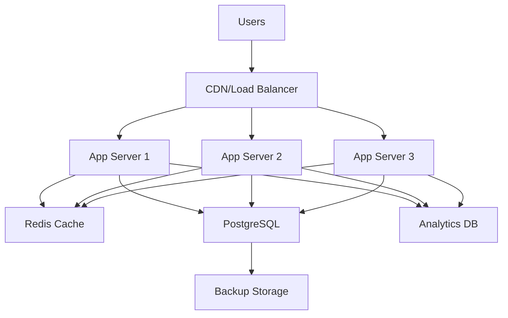
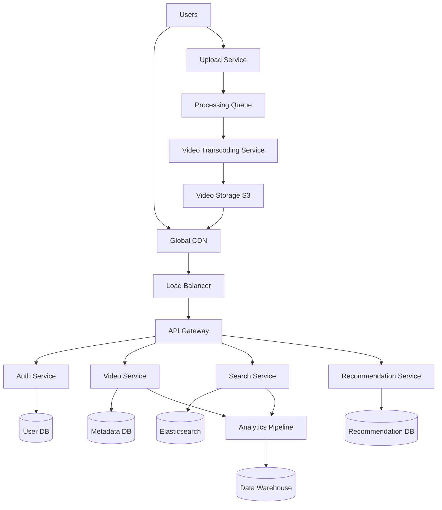

# System Design Scenarios

## Real-World Architecture Challenges and Solutions

This document provides comprehensive system design scenarios commonly encountered in senior-level technical interviews, with detailed solutions and architectural considerations specifically relevant to distributed systems and scalable applications.

## 🏗️ System Design Interview Framework

### Scenario Complexity Levels

#### Level 1: Foundational Systems
- **Scale**: 10K-100K daily active users
- **Complexity**: Single-region, moderate traffic
- **Examples**: URL shortener, chat application, basic social media
- **Time**: 45 minutes
- **Focus**: Core design patterns and basic scaling

#### Level 2: Intermediate Systems  
- **Scale**: 100K-10M daily active users
- **Complexity**: Multi-region, high traffic patterns
- **Examples**: Video streaming, ride-sharing, e-commerce platform
- **Time**: 60 minutes
- **Focus**: Advanced scaling, performance optimization

#### Level 3: Advanced Systems
- **Scale**: 10M+ daily active users
- **Complexity**: Global scale, complex business logic
- **Examples**: Global social network, distributed payment system, real-time collaboration
- **Time**: 90 minutes
- **Focus**: Distributed systems expertise, architectural trade-offs

## 📱 Level 1 Scenarios

### Scenario 1: URL Shortening Service (TinyURL/bit.ly)

#### Requirements Clarification
```typescript
interface URLShortenerRequirements {
  functional: {
    shortenURL: "Convert long URL to short URL";
    expandURL: "Redirect short URL to original URL";
    customAliases: "Allow custom short URLs (optional)";
    analytics: "Basic click tracking";
    expiration: "URL expiration support";
  };
  
  nonFunctional: {
    scale: {
      urls_created_daily: 1_000_000;
      redirect_requests_daily: 10_000_000;
      read_write_ratio: "10:1";
    };
    performance: {
      redirect_latency: "<100ms";
      creation_latency: "<500ms";
    };
    availability: "99.9%";
    data_retention: "10 years";
  };
}
```

#### Capacity Estimation
```typescript
const capacityCalculation = {
  // Traffic estimates
  daily_url_creation: 1_000_000,
  daily_redirects: 10_000_000,
  
  // Per second calculations
  urls_per_second: 12, // 1M / (24 * 60 * 60)
  redirects_per_second: 116,
  peak_multiplier: 3,
  peak_redirects_per_second: 348,
  
  // Storage calculations
  url_record_size: 500, // bytes (original URL + metadata)
  daily_storage: 500_000_000, // bytes = 500MB
  yearly_storage: 182_500_000_000, // bytes = 182.5GB
  ten_year_storage: 1_825_000_000_000, // bytes = 1.8TB
  
  // Caching requirements
  cache_hit_ratio: 0.8, // 80% of requests from cache
  cache_size_for_daily_active: 4_000_000_000, // 4GB for hot URLs
};
```

#### System Architecture


#### Database Design
```sql
-- URLs table with efficient indexing
CREATE TABLE urls (
    id BIGSERIAL PRIMARY KEY,
    short_code VARCHAR(7) UNIQUE NOT NULL,
    original_url TEXT NOT NULL,
    user_id BIGINT,
    created_at TIMESTAMP DEFAULT NOW(),
    expires_at TIMESTAMP,
    click_count BIGINT DEFAULT 0,
    
    -- Indexes for performance
    INDEX idx_short_code (short_code),
    INDEX idx_user_created (user_id, created_at DESC),
    INDEX idx_expiration (expires_at) WHERE expires_at IS NOT NULL
);

-- Analytics table for click tracking
CREATE TABLE url_clicks (
    id BIGSERIAL PRIMARY KEY,
    short_code VARCHAR(7) NOT NULL,
    clicked_at TIMESTAMP DEFAULT NOW(),
    user_agent TEXT,
    ip_address INET,
    referer TEXT,
    
    -- Partitioned by date for efficient querying
    PARTITION BY RANGE (clicked_at)
);
```

#### URL Encoding Algorithm
```typescript
class URLShortener {
  private static readonly BASE62_CHARS = 
    'abcdefghijklmnopqrstuvwxyzABCDEFGHIJKLMNOPQRSTUVWXYZ0123456789';
  
  // Convert unique ID to base62 short code
  static encodeBase62(id: number): string {
    if (id === 0) return this.BASE62_CHARS[0];
    
    let result = '';
    while (id > 0) {
      result = this.BASE62_CHARS[id % 62] + result;
      id = Math.floor(id / 62);
    }
    return result;
  }
  
  // Convert short code back to ID
  static decodeBase62(shortCode: string): number {
    let result = 0;
    for (let i = 0; i < shortCode.length; i++) {
      const char = shortCode[i];
      const value = this.BASE62_CHARS.indexOf(char);
      result = result * 62 + value;
    }
    return result;
  }
  
  // Generate short URL
  async shortenURL(originalURL: string, userID?: number): Promise<string> {
    // Validate URL format
    if (!this.isValidURL(originalURL)) {
      throw new Error('Invalid URL format');
    }
    
    // Check if URL already exists (optional deduplication)
    const existing = await this.findExistingURL(originalURL, userID);
    if (existing) return existing.short_code;
    
    // Generate new short code
    const id = await this.getNextID();
    const shortCode = URLShortener.encodeBase62(id);
    
    // Store in database
    await this.storeURL({
      short_code: shortCode,
      original_url: originalURL,
      user_id: userID,
    });
    
    return shortCode;
  }
}
```

#### Caching Strategy
```typescript
class URLCache {
  private redis: Redis;
  
  // Cache frequently accessed URLs
  async getOriginalURL(shortCode: string): Promise<string | null> {
    // Try cache first
    const cached = await this.redis.get(`url:${shortCode}`);
    if (cached) {
      // Update access count asynchronously
      this.incrementClickCount(shortCode);
      return cached;
    }
    
    // Cache miss - query database
    const url = await this.database.query(
      'SELECT original_url FROM urls WHERE short_code = ? AND (expires_at IS NULL OR expires_at > NOW())',
      [shortCode]
    );
    
    if (url) {
      // Cache for 24 hours
      await this.redis.setex(`url:${shortCode}`, 86400, url.original_url);
      this.incrementClickCount(shortCode);
      return url.original_url;
    }
    
    return null;
  }
  
  // Cache popular URLs proactively
  async warmCache(): Promise<void> {
    const popularURLs = await this.database.query(`
      SELECT short_code, original_url 
      FROM urls 
      WHERE click_count > 100 
      AND created_at > NOW() - INTERVAL '7 days'
      ORDER BY click_count DESC 
      LIMIT 10000
    `);
    
    for (const url of popularURLs) {
      await this.redis.setex(`url:${url.short_code}`, 86400, url.original_url);
    }
  }
}
```

#### Scaling Considerations
```typescript
interface ScalingStrategy {
  bottleneck: string;
  solution: string;
  implementation: string;
  trade_offs: string[];
}

const scalingStrategies: ScalingStrategy[] = [
  {
    bottleneck: "Database read performance for redirects",
    solution: "Read replicas + aggressive caching",
    implementation: "3 read replicas, Redis cache with 24h TTL",
    trade_offs: ["Eventual consistency", "Cache invalidation complexity"]
  },
  {
    bottleneck: "Database write performance for URL creation",
    solution: "Write sharding by user_id or time-based partitioning",
    implementation: "Hash user_id % num_shards or monthly partitions",
    trade_offs: ["Cross-shard analytics complexity", "Rebalancing effort"]
  },
  {
    bottleneck: "Global latency for redirects",
    solution: "Geographic caching with CDN",
    implementation: "CloudFront with custom cache behaviors",
    trade_offs: ["Cache coherency challenges", "Increased infrastructure cost"]
  }
];
```

### Scenario 2: Real-Time Chat Application

#### Requirements Analysis
```typescript
interface ChatApplicationRequirements {
  functional: {
    one_on_one_messaging: "Direct messages between users";
    group_messaging: "Group chats with multiple participants";
    real_time_delivery: "Instant message delivery";
    message_history: "Persistent message storage and retrieval";
    online_status: "User presence indication";
    file_sharing: "Image and document sharing";
    push_notifications: "Mobile push notifications";
  };
  
  non_functional: {
    scale: {
      concurrent_users: 1_000_000;
      messages_per_day: 100_000_000;
      average_message_size: 100; // bytes
    };
    performance: {
      message_delivery_latency: "<200ms";
      message_history_load: "<500ms";
      connection_establishment: "<1s";
    };
    availability: "99.95%";
    data_retention: "Unlimited";
  };
}
```

#### WebSocket Architecture
```typescript
// WebSocket connection management
class ChatConnectionManager {
  private connections = new Map<string, WebSocket>();
  private userSessions = new Map<string, Set<string>>(); // userId -> sessionIds
  
  async handleConnection(ws: WebSocket, userId: string, sessionId: string) {
    // Store connection
    this.connections.set(sessionId, ws);
    
    // Track user sessions (multiple devices)
    if (!this.userSessions.has(userId)) {
      this.userSessions.set(userId, new Set());
    }
    this.userSessions.get(userId)!.add(sessionId);
    
    // Notify user online status
    await this.broadcastPresenceUpdate(userId, 'online');
    
    // Handle message routing
    ws.on('message', (data) => this.handleMessage(userId, sessionId, data));
    ws.on('close', () => this.handleDisconnection(userId, sessionId));
  }
  
  async deliverMessage(targetUserId: string, message: Message) {
    const sessions = this.userSessions.get(targetUserId);
    if (!sessions) {
      // User offline - store for later delivery
      await this.storeOfflineMessage(targetUserId, message);
      return;
    }
    
    // Deliver to all user sessions
    for (const sessionId of sessions) {
      const connection = this.connections.get(sessionId);
      if (connection && connection.readyState === WebSocket.OPEN) {
        connection.send(JSON.stringify(message));
      }
    }
  }
}
```

#### Message Storage Schema
```sql
-- Users table
CREATE TABLE users (
    user_id BIGSERIAL PRIMARY KEY,
    username VARCHAR(50) UNIQUE NOT NULL,
    email VARCHAR(255) UNIQUE NOT NULL,
    last_seen TIMESTAMP DEFAULT NOW(),
    status VARCHAR(20) DEFAULT 'offline'
);

-- Conversations table (supports both 1:1 and group chats)
CREATE TABLE conversations (
    conversation_id BIGSERIAL PRIMARY KEY,
    type VARCHAR(20) NOT NULL, -- 'direct' or 'group'
    name VARCHAR(100), -- null for direct messages
    created_at TIMESTAMP DEFAULT NOW(),
    created_by BIGINT REFERENCES users(user_id)
);

-- Conversation participants
CREATE TABLE conversation_participants (
    conversation_id BIGINT REFERENCES conversations(conversation_id),
    user_id BIGINT REFERENCES users(user_id),
    joined_at TIMESTAMP DEFAULT NOW(),
    role VARCHAR(20) DEFAULT 'member', -- 'admin', 'member'
    last_read_message_id BIGINT,
    
    PRIMARY KEY (conversation_id, user_id)
);

-- Messages table with partitioning
CREATE TABLE messages (
    message_id BIGSERIAL PRIMARY KEY,
    conversation_id BIGINT NOT NULL REFERENCES conversations(conversation_id),
    sender_id BIGINT NOT NULL REFERENCES users(user_id),
    content TEXT NOT NULL,
    message_type VARCHAR(20) DEFAULT 'text', -- 'text', 'image', 'file'
    file_url VARCHAR(500),
    created_at TIMESTAMP DEFAULT NOW(),
    edited_at TIMESTAMP,
    
    -- Indexes for efficient querying
    INDEX idx_conversation_time (conversation_id, created_at DESC),
    INDEX idx_sender_time (sender_id, created_at DESC)
) PARTITION BY RANGE (created_at);

-- Monthly partitions for message scaling
CREATE TABLE messages_2024_01 PARTITION OF messages
    FOR VALUES FROM ('2024-01-01') TO ('2024-02-01');
```

#### Real-Time Message Processing
```typescript
interface MessageProcessor {
  async processMessage(message: IncomingMessage): Promise<void> {
    // 1. Validate message
    const validatedMessage = await this.validateMessage(message);
    
    // 2. Store message in database
    const storedMessage = await this.storeMessage(validatedMessage);
    
    // 3. Deliver to online participants
    const participants = await this.getConversationParticipants(
      validatedMessage.conversation_id
    );
    
    await Promise.all(
      participants.map(participant => 
        this.deliverMessage(participant.user_id, storedMessage)
      )
    );
    
    // 4. Send push notifications to offline users
    const offlineParticipants = participants.filter(p => !p.is_online);
    await this.sendPushNotifications(offlineParticipants, storedMessage);
    
    // 5. Update conversation metadata
    await this.updateConversationMetadata(
      validatedMessage.conversation_id, 
      storedMessage
    );
  }
  
  async loadMessageHistory(
    conversationId: string, 
    userId: string, 
    limit: number = 50,
    cursor?: string
  ): Promise<Message[]> {
    // Verify user has access to conversation
    await this.verifyUserAccess(conversationId, userId);
    
    // Build query with cursor-based pagination
    const query = `
      SELECT message_id, sender_id, content, message_type, 
             file_url, created_at, edited_at
      FROM messages 
      WHERE conversation_id = $1 
      ${cursor ? 'AND created_at < $3' : ''}
      ORDER BY created_at DESC 
      LIMIT $2
    `;
    
    const params = cursor 
      ? [conversationId, limit, cursor]
      : [conversationId, limit];
    
    const messages = await this.database.query(query, params);
    
    // Update user's last read message
    await this.updateLastReadMessage(conversationId, userId, messages[0]?.message_id);
    
    return messages.reverse(); // Return in chronological order
  }
}
```

## 🌐 Level 2 Scenarios

### Scenario 3: Video Streaming Platform (YouTube-like)

#### System Requirements
```typescript
interface VideoStreamingRequirements {
  functional: {
    video_upload: "Users can upload videos in various formats";
    video_streaming: "Adaptive bitrate streaming";
    video_processing: "Transcoding to multiple resolutions";
    user_management: "Authentication, profiles, subscriptions";
    content_discovery: "Search, recommendations, trending";
    engagement: "Likes, comments, shares, playlists";
    analytics: "View counts, engagement metrics";
  };
  
  non_functional: {
    scale: {
      registered_users: 50_000_000;
      daily_active_users: 10_000_000;
      videos_uploaded_daily: 100_000;
      hours_watched_daily: 100_000_000;
    };
    performance: {
      video_start_time: "<2s";
      search_response_time: "<300ms";
      upload_processing_time: "<30min for 1080p";
    };
    availability: "99.99%";
    global_reach: "Sub-200ms latency worldwide";
  };
}
```

#### High-Level Architecture


#### Video Processing Pipeline
```typescript
class VideoProcessingPipeline {
  async processUploadedVideo(videoId: string, originalFilePath: string) {
    try {
      // 1. Validate video file
      const videoMetadata = await this.extractVideoMetadata(originalFilePath);
      await this.validateVideo(videoMetadata);
      
      // 2. Generate thumbnail
      const thumbnailPath = await this.generateThumbnail(originalFilePath);
      
      // 3. Transcode to multiple resolutions
      const transcodingJobs = [
        { resolution: '360p', bitrate: '1000k' },
        { resolution: '720p', bitrate: '2500k' },
        { resolution: '1080p', bitrate: '5000k' },
        { resolution: '1440p', bitrate: '8000k' }, // if source allows
      ];
      
      const transcodedVideos = await Promise.all(
        transcodingJobs.map(job => 
          this.transcodeVideo(originalFilePath, job)
        )
      );
      
      // 4. Upload to storage with CDN distribution
      const uploadTasks = [
        this.uploadToStorage(thumbnailPath, `thumbnails/${videoId}.jpg`),
        ...transcodedVideos.map(video => 
          this.uploadToStorage(video.path, `videos/${videoId}/${video.resolution}.mp4`)
        )
      ];
      
      await Promise.all(uploadTasks);
      
      // 5. Update video metadata in database
      await this.updateVideoStatus(videoId, {
        status: 'ready',
        duration: videoMetadata.duration,
        resolutions: transcodedVideos.map(v => v.resolution),
        thumbnail_url: `${CDN_BASE_URL}/thumbnails/${videoId}.jpg`,
        processed_at: new Date()
      });
      
      // 6. Trigger search indexing and recommendation updates
      await this.indexVideoForSearch(videoId);
      await this.updateRecommendationModel(videoId);
      
    } catch (error) {
      await this.handleProcessingError(videoId, error);
    }
  }
  
  async transcodeVideo(inputPath: string, options: TranscodingOptions): Promise<TranscodedVideo> {
    const outputPath = `${TEMP_DIR}/${uuidv4()}_${options.resolution}.mp4`;
    
    const ffmpegCommand = `
      ffmpeg -i "${inputPath}" 
      -c:v libx264 -crf 23 
      -preset medium 
      -vf scale=-2:${options.resolution.replace('p', '')} 
      -b:v ${options.bitrate} 
      -c:a aac -b:a 128k 
      "${outputPath}"
    `;
    
    await this.executeCommand(ffmpegCommand);
    
    return {
      resolution: options.resolution,
      path: outputPath,
      fileSize: await this.getFileSize(outputPath)
    };
  }
}
```

#### Adaptive Streaming Implementation
```typescript
// HLS (HTTP Live Streaming) manifest generation
class StreamingService {
  async generateHLSManifest(videoId: string): Promise<string> {
    const video = await this.getVideoMetadata(videoId);
    const availableResolutions = video.resolutions;
    
    // Master playlist
    let manifest = '#EXTM3U\n#EXT-X-VERSION:3\n\n';
    
    for (const resolution of availableResolutions) {
      const bandwidth = this.getBandwidthForResolution(resolution);
      const playlistUrl = `${CDN_BASE_URL}/videos/${videoId}/${resolution}/playlist.m3u8`;
      
      manifest += `#EXT-X-STREAM-INF:BANDWIDTH=${bandwidth},RESOLUTION=${this.getResolutionDimensions(resolution)}\n`;
      manifest += `${playlistUrl}\n`;
    }
    
    return manifest;
  }
  
  async generateResolutionPlaylist(videoId: string, resolution: string): Promise<string> {
    // Individual resolution playlist with segments
    let playlist = '#EXTM3U\n#EXT-X-VERSION:3\n#EXT-X-TARGETDURATION:10\n\n';
    
    const segmentCount = await this.getSegmentCount(videoId, resolution);
    
    for (let i = 0; i < segmentCount; i++) {
      playlist += '#EXTINF:10.0,\n';
      playlist += `${CDN_BASE_URL}/videos/${videoId}/${resolution}/segment_${i.toString().padStart(4, '0')}.ts\n`;
    }
    
    playlist += '#EXT-X-ENDLIST\n';
    return playlist;
  }
  
  // Adaptive bitrate logic for client
  async getOptimalResolution(clientBandwidth: number, deviceCapability: string): Promise<string> {
    const resolutionBandwidths = {
      '360p': 1000000,   // 1 Mbps
      '720p': 2500000,   // 2.5 Mbps
      '1080p': 5000000,  // 5 Mbps
      '1440p': 8000000,  // 8 Mbps
    };
    
    // Find highest resolution that fits bandwidth with 25% buffer
    const availableBandwidth = clientBandwidth * 0.75;
    
    for (const resolution of ['1440p', '1080p', '720p', '360p']) {
      if (resolutionBandwidths[resolution] <= availableBandwidth) {
        // Also check device capability
        if (this.deviceSupportsResolution(deviceCapability, resolution)) {
          return resolution;
        }
      }
    }
    
    return '360p'; // Fallback
  }
}
```

#### Content Discovery & Search
```typescript
// Elasticsearch-based video search
class VideoSearchService {
  async indexVideo(video: Video): Promise<void> {
    const document = {
      video_id: video.id,
      title: video.title,
      description: video.description,
      tags: video.tags,
      category: video.category,
      duration: video.duration,
      upload_date: video.created_at,
      view_count: video.view_count,
      like_count: video.like_count,
      creator: {
        id: video.creator_id,
        name: video.creator_name,
        subscriber_count: video.creator_subscribers
      },
      // Text analysis for better search
      title_analyzed: video.title,
      description_analyzed: video.description,
      // Aggregated engagement score for ranking
      engagement_score: this.calculateEngagementScore(video)
    };
    
    await this.elasticsearch.index({
      index: 'videos',
      id: video.id,
      body: document
    });
  }
  
  async searchVideos(query: SearchQuery): Promise<SearchResults> {
    const searchBody = {
      query: {
        bool: {
          must: [
            {
              multi_match: {
                query: query.text,
                fields: [
                  'title^3',           // Title boost
                  'description^2',     // Description boost
                  'tags^2',           // Tags boost
                  'creator.name'      // Creator name
                ],
                type: 'best_fields',
                fuzziness: 'AUTO'
              }
            }
          ],
          filter: [
            ...(query.category ? [{ term: { category: query.category } }] : []),
            ...(query.duration_range ? [{ 
              range: { 
                duration: { 
                  gte: query.duration_range.min, 
                  lte: query.duration_range.max 
                } 
              } 
            }] : []),
            {
              range: {
                upload_date: {
                  gte: query.date_range?.start || 'now-10y'
                }
              }
            }
          ]
        }
      },
      sort: [
        // Relevance + engagement hybrid scoring
        {
          '_score': { order: 'desc' }
        },
        {
          'engagement_score': { order: 'desc' }
        }
      ],
      size: query.limit || 20,
      from: query.offset || 0,
      highlight: {
        fields: {
          title: {},
          description: {}
        }
      }
    };
    
    const response = await this.elasticsearch.search({
      index: 'videos',
      body: searchBody
    });
    
    return this.formatSearchResults(response);
  }
  
  calculateEngagementScore(video: Video): number {
    const ageInDays = (Date.now() - video.created_at.getTime()) / (1000 * 60 * 60 * 24);
    const viewVelocity = video.view_count / Math.max(ageInDays, 1);
    const likeRatio = video.like_count / Math.max(video.view_count, 1);
    const commentRatio = video.comment_count / Math.max(video.view_count, 1);
    
    // Weighted engagement formula
    return (
      viewVelocity * 0.4 +
      likeRatio * 1000 * 0.3 +
      commentRatio * 2000 * 0.2 +
      (video.creator_subscribers / 1000) * 0.1
    );
  }
}
```

### Scenario 4: Ride-Sharing System (Uber-like)

#### Requirements & Scale
```typescript
interface RideSharingRequirements {
  functional: {
    user_registration: "Riders and drivers can register";
    ride_matching: "Match riders with nearby drivers";
    real_time_tracking: "Live location tracking during rides";
    pricing: "Dynamic pricing based on demand/supply";
    payments: "Integrated payment processing";
    ratings: "Mutual rating system";
    trip_history: "Complete trip records";
    notifications: "Real-time status updates";
  };
  
  non_functional: {
    scale: {
      registered_users: 100_000_000; // 80% riders, 20% drivers
      daily_active_users: 10_000_000;
      daily_rides: 5_000_000;
      peak_concurrent_users: 1_000_000;
    };
    performance: {
      driver_matching: "<5s";
      location_update_frequency: "every 5s during ride";
      eta_calculation: "<2s";
      payment_processing: "<10s";
    };
    availability: "99.99%";
    data_consistency: "Strong for payments, eventual for location";
  };
}
```

#### Geospatial Architecture
```typescript
// Location-based matching service
class LocationMatchingService {
  // Use geohashing for efficient spatial queries
  async findNearbyDrivers(
    riderLocation: Location, 
    radiusKm: number = 5
  ): Promise<Driver[]> {
    
    // Calculate geohash precision based on radius
    const geohashPrecision = this.calculateGeohashPrecision(radiusKm);
    const riderGeohash = this.generateGeohash(riderLocation, geohashPrecision);
    
    // Get adjacent geohash areas to avoid edge cases
    const searchGeohashes = this.getAdjacentGeohashes(riderGeohash);
    
    // Query drivers in these geohash areas
    const nearbyDrivers = await this.database.query(`
      SELECT driver_id, latitude, longitude, status, 
             rating, vehicle_type, estimated_arrival
      FROM driver_locations 
      WHERE geohash_prefix IN (${searchGeohashes.map(() => '?').join(',')})
      AND status = 'available'
      AND last_updated > NOW() - INTERVAL '30 seconds'
    `, searchGeohashes);
    
    // Calculate exact distances and filter
    const driversWithDistance = nearbyDrivers
      .map(driver => ({
        ...driver,
        distance: this.calculateDistance(riderLocation, {
          latitude: driver.latitude,
          longitude: driver.longitude
        })
      }))
      .filter(driver => driver.distance <= radiusKm)
      .sort((a, b) => a.distance - b.distance);
    
    return driversWithDistance.slice(0, 10); // Top 10 closest
  }
  
  async updateDriverLocation(driverId: string, location: Location): Promise<void> {
    const geohash = this.generateGeohash(location, 8); // 8 chars = ~150m precision
    
    await this.database.query(`
      INSERT INTO driver_locations (driver_id, latitude, longitude, geohash_prefix, last_updated)
      VALUES (?, ?, ?, ?, NOW())
      ON DUPLICATE KEY UPDATE
        latitude = VALUES(latitude),
        longitude = VALUES(longitude),
        geohash_prefix = VALUES(geohash_prefix),
        last_updated = VALUES(last_updated)
    `, [driverId, location.latitude, location.longitude, geohash]);
    
    // Update Redis for real-time queries
    await this.redis.hset(`driver:${driverId}:location`, {
      lat: location.latitude,
      lng: location.longitude,
      geohash: geohash,
      timestamp: Date.now()
    });
    
    // Set expiration for cleanup
    await this.redis.expire(`driver:${driverId}:location`, 300); // 5 minutes
  }
}
```

#### Ride Matching Algorithm
```typescript
class RideMatchingService {
  async requestRide(rideRequest: RideRequest): Promise<MatchResult> {
    // 1. Find available drivers
    const nearbyDrivers = await this.locationService.findNearbyDrivers(
      rideRequest.pickup_location,
      rideRequest.max_search_radius || 5
    );
    
    if (nearbyDrivers.length === 0) {
      return { success: false, reason: 'no_drivers_available' };
    }
    
    // 2. Score and rank drivers
    const rankedDrivers = await this.rankDrivers(nearbyDrivers, rideRequest);
    
    // 3. Send requests to top drivers (parallel)
    const matchPromises = rankedDrivers.slice(0, 5).map(driver => 
      this.sendDriverRequest(driver, rideRequest)
    );
    
    // 4. Return first acceptance (race condition)
    try {
      const match = await Promise.any(matchPromises);
      
      // Cancel other pending requests
      matchPromises.forEach(promise => this.cancelRequest(promise));
      
      return { success: true, driver: match.driver, eta: match.eta };
    } catch (error) {
      return { success: false, reason: 'no_driver_accepted' };
    }
  }
  
  private async rankDrivers(drivers: Driver[], request: RideRequest): Promise<RankedDriver[]> {
    return drivers.map(driver => {
      const score = this.calculateDriverScore(driver, request);
      return { ...driver, score };
    }).sort((a, b) => b.score - a.score);
  }
  
  private calculateDriverScore(driver: Driver, request: RideRequest): number {
    // Multi-factor scoring algorithm
    const distanceScore = Math.max(0, 100 - (driver.distance * 10)); // Closer = better
    const ratingScore = (driver.rating / 5) * 50; // Rating out of 50 points
    const acceptanceScore = (driver.acceptance_rate || 0.8) * 30; // Acceptance rate
    const completionScore = (driver.completion_rate || 0.95) * 20; // Completion rate
    
    // Vehicle type matching
    const vehicleMatchScore = this.getVehicleMatchScore(
      driver.vehicle_type, 
      request.preferred_vehicle_type
    );
    
    return distanceScore + ratingScore + acceptanceScore + completionScore + vehicleMatchScore;
  }
  
  private async sendDriverRequest(
    driver: Driver, 
    request: RideRequest,
    timeoutMs: number = 15000
  ): Promise<MatchResult> {
    
    return new Promise((resolve, reject) => {
      const requestId = uuidv4();
      
      // Store request in cache for driver response
      this.redis.setex(`ride_request:${requestId}`, 30, JSON.stringify({
        request_id: requestId,
        rider_id: request.rider_id,
        pickup_location: request.pickup_location,
        destination: request.destination,
        driver_id: driver.driver_id
      }));
      
      // Send push notification to driver
      this.notificationService.sendToDriver(driver.driver_id, {
        type: 'ride_request',
        request_id: requestId,
        pickup_location: request.pickup_location,
        destination: request.destination,
        estimated_earnings: this.calculateEstimatedEarnings(request),
        expires_at: Date.now() + timeoutMs
      });
      
      // Set up response listener
      const responseKey = `ride_response:${requestId}`;
      const subscriber = this.redis.duplicate();
      
      subscriber.subscribe(responseKey);
      subscriber.on('message', (channel, message) => {
        const response = JSON.parse(message);
        subscriber.unsubscribe();
        subscriber.quit();
        
        if (response.accepted) {
          resolve({
            success: true,
            driver: driver,
            eta: response.eta
          });
        } else {
          reject(new Error('Driver declined'));
        }
      });
      
      // Timeout handling
      setTimeout(() => {
        subscriber.unsubscribe();
        subscriber.quit();
        reject(new Error('Driver response timeout'));
      }, timeoutMs);
    });
  }
}
```

#### Dynamic Pricing Engine
```typescript
class DynamicPricingService {
  async calculateRidePrice(request: RideRequest): Promise<PriceCalculation> {
    // Base price calculation
    const distance = await this.calculateRouteDistance(
      request.pickup_location, 
      request.destination
    );
    const estimatedDuration = await this.calculateRouteDuration(
      request.pickup_location,
      request.destination
    );
    
    const baseFare = this.getBaseFare(request.vehicle_type);
    const distanceRate = this.getDistanceRate(request.vehicle_type);
    const timeRate = this.getTimeRate(request.vehicle_type);
    
    const basePrice = baseFare + (distance * distanceRate) + (estimatedDuration * timeRate);
    
    // Dynamic pricing multiplier
    const demandMultiplier = await this.calculateDemandMultiplier(
      request.pickup_location,
      request.requested_at
    );
    
    const surgeMultiplier = await this.calculateSurgeMultiplier(
      request.pickup_location,
      request.requested_at
    );
    
    // Weather and event-based adjustments
    const weatherMultiplier = await this.getWeatherMultiplier(
      request.pickup_location,
      request.requested_at
    );
    
    const eventMultiplier = await this.getEventMultiplier(
      request.pickup_location,
      request.requested_at
    );
    
    // Calculate final price
    const totalMultiplier = Math.max(1.0, 
      demandMultiplier * surgeMultiplier * weatherMultiplier * eventMultiplier
    );
    
    const finalPrice = Math.round(basePrice * totalMultiplier * 100) / 100;
    
    return {
      base_price: basePrice,
      surge_multiplier: totalMultiplier,
      final_price: finalPrice,
      distance_km: distance,
      estimated_duration_minutes: estimatedDuration,
      breakdown: {
        base_fare: baseFare,
        distance_cost: distance * distanceRate,
        time_cost: estimatedDuration * timeRate,
        surge_amount: (finalPrice - basePrice)
      }
    };
  }
  
  private async calculateDemandMultiplier(
    location: Location, 
    timestamp: Date
  ): Promise<number> {
    
    // Get demand data for the area in the last hour
    const geohash = this.generateGeohash(location, 6); // ~1km precision
    const hourAgo = new Date(timestamp.getTime() - 60 * 60 * 1000);
    
    const demandData = await this.redis.hgetall(`demand:${geohash}:${this.getHourKey(timestamp)}`);
    
    const rideRequests = parseInt(demandData.requests || '0');
    const availableDrivers = parseInt(demandData.available_drivers || '0');
    
    // Supply-demand ratio calculation
    const demandSupplyRatio = availableDrivers > 0 ? rideRequests / availableDrivers : 10;
    
    // Convert ratio to multiplier (1.0 - 3.0x)
    const multiplier = Math.min(3.0, Math.max(1.0, 1 + (demandSupplyRatio - 1) * 0.2));
    
    return multiplier;
  }
  
  private async updateDemandMetrics(location: Location, event: 'ride_request' | 'driver_available'): Promise<void> {
    const geohash = this.generateGeohash(location, 6);
    const hourKey = this.getHourKey(new Date());
    const demandKey = `demand:${geohash}:${hourKey}`;
    
    if (event === 'ride_request') {
      await this.redis.hincrby(demandKey, 'requests', 1);
    } else if (event === 'driver_available') {
      await this.redis.hincrby(demandKey, 'available_drivers', 1);
    }
    
    // Set expiration for cleanup
    await this.redis.expire(demandKey, 7200); // 2 hours
  }
}
```

This comprehensive system design scenarios document provides detailed, real-world examples that senior engineers commonly encounter in technical interviews, with specific focus on scalability, performance, and distributed systems challenges.

---

**Next**: [Leadership Behavioral Questions](./leadership-behavioral-questions.md) - Senior role expectations and scenario-based questions