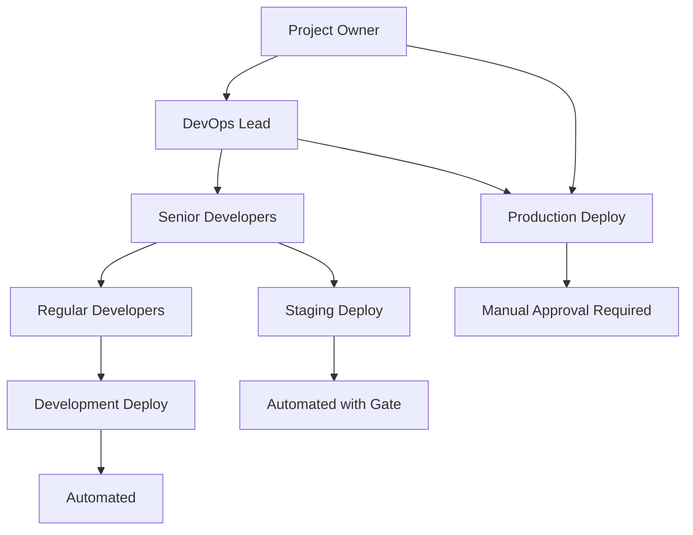

# Best Practices: GitLab CI Manual Deployment Access

## 🎯 Overview

Comprehensive best practices for implementing secure, maintainable, and efficient manual deployment workflows in GitLab CI/CD pipelines, focusing on access control, security, and operational excellence.

## 🏗️ Architecture Best Practices

### 1. Permission Strategy Design

#### Choose the Right Permission Model
```yaml
# ✅ Recommended: Hybrid Approach
environments:
  development:
    access_model: role-based    # More permissive for dev
    roles: [developer, maintainer]
    
  staging:
    access_model: role-based    # Moderate control
    roles: [maintainer]
    
  production:
    access_model: user-specific # Strict control
    users: [devops.lead, senior.dev1, senior.dev2]
    required_approvals: 2
```

#### Access Control Hierarchy


### 2. Environment Strategy

#### Tiered Environment Access
| Environment | Access Model | Required Role | Additional Rules |
|-------------|--------------|---------------|------------------|
| **Development** | Role-based | Developer+ | Auto-deploy |
| **Staging** | Role-based | Maintainer+ | Manual trigger |
| **Pre-production** | User-specific | Senior only | Approval required |
| **Production** | User-specific | DevOps + PO | 2 approvals |

## 🔐 Security Best Practices

### 1. Defense in Depth

#### Multi-layer Security Model
```yaml
# Layer 1: GitLab Project Permissions
project_roles:
  - maintainer_access: limited_users
  - developer_access: team_members

# Layer 2: Protected Environment Rules  
protected_environments:
  production:
    deploy_access: [devops.lead, senior.dev]
    required_approvals: 2
    prevent_auto_deploy: true

# Layer 3: Pipeline Security Rules
deploy_production:
  rules:
    - if: $CI_COMMIT_BRANCH == "main"
      when: manual
      variables:
        DEPLOYMENT_ENV: "production"
        REQUIRE_SECURITY_SCAN: "true"
```

#### Security Validation Pipeline
```yaml
security_checks:
  stage: security
  script:
    - echo "Security validation for $GITLAB_USER_LOGIN"
    - ./validate-deployer-permissions.sh
    - ./run-security-scans.sh
    - ./check-compliance-requirements.sh
  rules:
    - if: $CI_PIPELINE_SOURCE == "web" && $DEPLOYMENT_ENV == "production"

deploy_production:
  stage: deploy
  needs:
    - job: security_checks
  when: manual
  environment: production
```

### 2. Audit and Compliance

#### Deployment Audit Trail
```yaml
deploy_production:
  stage: deploy
  script:
    - |
      # Audit logging
      cat << EOF > deployment-audit.json
      {
        "timestamp": "$(date -Iseconds)",
        "deployer": "$GITLAB_USER_LOGIN",
        "deployer_name": "$GITLAB_USER_NAME",
        "commit_sha": "$CI_COMMIT_SHA",
        "commit_author": "$CI_COMMIT_AUTHOR",
        "pipeline_id": "$CI_PIPELINE_ID",
        "environment": "production",
        "approval_status": "manual_approved"
      }
      EOF
      
      # Send audit log to external system
      ./send-audit-log.sh deployment-audit.json
      
      # Proceed with deployment
      ./deploy-production.sh
  artifacts:
    reports:
      audit: deployment-audit.json
  environment: production
  when: manual
```

#### Compliance Reporting
```yaml
# Weekly deployment report generation
generate_compliance_report:
  stage: report
  script:
    - ./generate-deployment-report.sh
    - ./validate-sox-compliance.sh
  artifacts:
    paths:
      - compliance-report.pdf
    expire_in: 1 year
  rules:
    - if: $CI_PIPELINE_SCHEDULE && $REPORT_TYPE == "compliance"
```

## 🚀 Operational Excellence

### 1. Deployment Workflow Patterns

#### Progressive Deployment Pattern
```yaml
stages:
  - test
  - build
  - deploy-dev
  - deploy-staging
  - approve-prod
  - deploy-prod
  - verify-prod

# Automated progression with manual gates
deploy_development:
  stage: deploy-dev
  script: ./deploy.sh development
  environment: development
  rules:
    - if: $CI_COMMIT_BRANCH != "main"
      when: on_success

deploy_staging:
  stage: deploy-staging
  script: ./deploy.sh staging
  environment: staging
  when: manual
  rules:
    - if: $CI_COMMIT_BRANCH == "main"

approve_production:
  stage: approve-prod
  script:
    - echo "Approving production deployment"
    - ./validate-staging-health.sh
  when: manual
  environment:
    name: production-approval
  needs:
    - deploy_staging

deploy_production:
  stage: deploy-prod
  script: ./deploy.sh production
  environment: production
  needs:
    - approve_production
  when: manual

verify_production:
  stage: verify-prod
  script:
    - ./health-check.sh
    - ./smoke-tests.sh
  environment: production
  needs:
    - deploy_production
  when: on_success
```

### 2. Error Handling and Rollback

#### Automatic Rollback on Failure
```yaml
deploy_production:
  stage: deploy
  script:
    - |
      # Store current version
      PREVIOUS_VERSION=$(./get-current-version.sh)
      echo "Previous version: $PREVIOUS_VERSION"
      
      # Deploy new version
      if ! ./deploy-production.sh; then
        echo "Deployment failed, initiating rollback"
        ./rollback-to-version.sh $PREVIOUS_VERSION
        ./notify-team.sh "Production deployment failed and rolled back"
        exit 1
      fi
      
      # Verify deployment
      if ! ./verify-deployment.sh; then
        echo "Deployment verification failed, rolling back"
        ./rollback-to-version.sh $PREVIOUS_VERSION
        exit 1
      fi
  environment: production
  when: manual
```

#### Manual Rollback Job
```yaml
rollback_production:
  stage: deploy
  script:
    - echo "Rolling back production to previous version"
    - ./rollback-production.sh
    - ./notify-team.sh "Production rolled back by $GITLAB_USER_NAME"
  environment: production
  when: manual
  rules:
    - if: $CI_COMMIT_BRANCH == "main"
      when: manual
      allow_failure: false
```

## 👥 Team Management Best Practices

### 1. Role-Based Access Control

#### Team Structure Mapping
```yaml
# Define clear team responsibilities
teams:
  platform_team:
    members: [devops.lead, sre.engineer]
    permissions: [all_environments]
    responsibilities: [infrastructure, security, compliance]
    
  product_team:
    members: [product.lead, senior.dev1, senior.dev2]
    permissions: [staging, development]
    responsibilities: [feature_development, staging_validation]
    
  junior_developers:
    members: [junior.dev1, junior.dev2]
    permissions: [development]
    responsibilities: [feature_development, testing]
```

#### Permission Escalation Process
```yaml
# Clear escalation path for production access
escalation_process:
  level_1: # Emergency hotfix
    required_approvers: 1
    approved_by: [devops.lead]
    conditions: [critical_bug, security_issue]
    
  level_2: # Regular release
    required_approvers: 2
    approved_by: [devops.lead, product.lead]
    conditions: [planned_release, feature_rollout]
    
  level_3: # Major release
    required_approvers: 3
    approved_by: [devops.lead, product.lead, tech.lead]
    conditions: [major_version, breaking_changes]
```

### 2. Documentation and Training

#### Access Documentation Template
```markdown
# Production Deployment Access Guide

## Current Access List
| User | Role | Access Level | Last Review |
|------|------|-------------|-------------|
| devops.lead | DevOps Lead | Full | 2024-01-15 |
| senior.dev1 | Senior Dev | Staging+ | 2024-01-15 |

## Access Request Process
1. Submit access request via [GitLab Issue Template]
2. Get approval from team lead
3. DevOps lead adds to protected environment
4. Complete mandatory training
5. Test access in staging environment

## Emergency Procedures
- Contact: devops.lead@company.com
- Escalation: Call +1-xxx-xxx-xxxx
- Backup contacts: [emergency-contacts]
```

## 📊 Monitoring and Observability

### 1. Deployment Metrics

#### Key Metrics to Track
```yaml
# Deployment success tracking
deployment_metrics:
  - deployment_frequency
  - lead_time_for_changes
  - mean_time_to_recovery
  - change_failure_rate
  - manual_approval_time
  - deployment_success_rate

# Implementation in pipeline
track_deployment_metrics:
  stage: metrics
  script:
    - |
      # Track deployment metrics
      ./track-metric.sh "deployment_start" "$CI_PIPELINE_ID"
      ./track-metric.sh "deployer" "$GITLAB_USER_LOGIN"
      ./track-metric.sh "environment" "$DEPLOYMENT_ENV"
  after_script:
    - ./track-metric.sh "deployment_end" "$CI_PIPELINE_ID"
```

### 2. Alerting and Notifications

#### Smart Notification System
```yaml
notify_deployment:
  stage: notify
  script:
    - |
      # Context-aware notifications
      if [ "$DEPLOYMENT_ENV" = "production" ]; then
        ./notify-slack.sh "🚀 Production deployed by $GITLAB_USER_NAME"
        ./notify-email.sh "stakeholders@company.com"
      fi
      
      if [ "$CI_JOB_STATUS" = "failed" ]; then
        ./notify-oncall.sh "Production deployment failed"
      fi
  rules:
    - when: always
```

## 🔧 Maintenance Best Practices

### 1. Regular Access Reviews

#### Quarterly Access Audit
```yaml
# Automated access review pipeline
access_audit:
  stage: audit
  script:
    - ./generate-access-report.sh
    - ./check-inactive-users.sh
    - ./validate-role-mappings.sh
  artifacts:
    reports:
      access_audit: access-audit-report.json
  rules:
    - if: $CI_PIPELINE_SCHEDULE && $AUDIT_TYPE == "access"
```

#### Access Review Checklist
- [ ] Review all users with production deployment access
- [ ] Verify role assignments align with current responsibilities  
- [ ] Check for inactive users who should be removed
- [ ] Validate emergency access procedures
- [ ] Update documentation with any changes
- [ ] Test access for all critical users

### 2. Continuous Improvement

#### Feedback Collection
```yaml
# Post-deployment survey
post_deployment_feedback:
  stage: feedback
  script:
    - |
      # Collect deployment experience metrics
      echo "Deployment completed by: $GITLAB_USER_NAME"
      echo "Duration: $(( $CI_JOB_FINISHED_AT - $CI_JOB_STARTED_AT )) seconds"
      
      # Optional: Send survey link for manual deployments
      if [ "$CI_JOB_MANUAL" = "true" ]; then
        ./send-feedback-survey.sh "$GITLAB_USER_LOGIN"
      fi
```

## 🎯 Performance Optimization

### 1. Pipeline Efficiency

#### Optimized Manual Job Pattern
```yaml
# Fast manual deployment with proper caching
deploy_production:
  stage: deploy
  image: deployment-image:latest
  cache:
    paths:
      - deployment-cache/
  script:
    - ./fast-deploy.sh
  environment: production
  when: manual
  timeout: 10 minutes  # Prevent hanging deployments
```

### 2. Resource Management

#### Resource-Aware Deployments
```yaml
deploy_production:
  stage: deploy
  resource_group: production  # Prevent parallel production deployments
  script:
    - ./deploy-with-resource-check.sh
  environment: production
  when: manual
```

---

## 📚 References

- GitLab CI/CD Best Practices Documentation
- DevOps Security Guidelines
- Deployment Automation Patterns
- Incident Response Procedures
- Compliance and Audit Requirements

---

## 🧭 Navigation

← [Back to Implementation Guide](./implementation-guide.md) | [Next: Permission Models Analysis](./permission-models-analysis.md) →