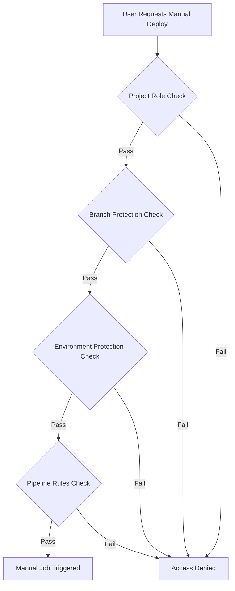

# Executive Summary: GitLab CI Manual Deployment Access

## 🎯 Key Findings

### The Permission Confusion Explained

**Problem**: Having maintainer role doesn't automatically grant access to manual production deployment jobs.

**Root Cause**: GitLab uses a **layered permission system** where manual deployment access is controlled by multiple overlapping rules, not just project roles.

### Critical Discovery



## 🔑 Core Insights

### 1. Manual Deployment ≠ Merge Access
- **Merge permissions** are controlled by branch protection rules
- **Deployment permissions** are controlled by environment protection rules
- These can have **completely different user lists**

### 2. Three Permission Layers
1. **Project Roles** (Guest, Reporter, Developer, Maintainer, Owner)
2. **Protected Branch Rules** (who can push/merge to specific branches)
3. **Protected Environment Rules** (who can deploy to specific environments)

### 3. User-Specific vs Role-Based
- **Default**: Role-based permissions
- **Override**: User-specific allowlists in protected branches/environments
- **Reality**: Most production environments use user-specific rules

## 📊 Impact Analysis

### Current State Assessment
| Permission Type | Default Behavior | Common Override | Access Control |
|----------------|------------------|-----------------|----------------|
| **Merge Access** | Role-based | User-specific list | Branch protection |
| **Manual Deploy** | Role-based | User-specific list | Environment protection |
| **Pipeline Trigger** | Role-based | Pipeline conditions | Job rules |

### Risk Factors
- 🔴 **High**: Assuming role equals deployment access
- 🟡 **Medium**: Mixed user/role permission models
- 🟢 **Low**: Well-documented team access patterns

## 💡 Strategic Recommendations

### Immediate Actions
1. **Audit Current Setup**: Review protected environment configurations
2. **Document Access Model**: Clarify which permissions use roles vs users
3. **Standardize Approach**: Choose consistent permission strategy

### Long-term Strategy
1. **Role-Based Preferred**: Use roles where possible for maintainability
2. **User-Specific for Critical**: Use user lists only for high-risk environments
3. **Regular Access Reviews**: Quarterly permission audits

## 🎯 Quick Win Solutions

### For Team Leads
```yaml
# Option A: Add user to protected environment
protected_environments:
  production:
    deploy_access_levels:
      - user: "your-username"
      - access_level: maintainer
```

### For DevOps Engineers
```yaml
# Option B: Use role-based with clear rules
protected_environments:
  production:
    deploy_access_levels:
      - access_level: maintainer
    approval_rules:
      - required_approvals: 2
```

## 📈 Success Metrics

### Immediate (1-2 weeks)
- ✅ Manual deployment access restored for authorized users
- ✅ Clear documentation of current permission model
- ✅ Team understanding of role vs user-specific permissions

### Medium-term (1-2 months)
- ✅ Standardized permission strategy across projects
- ✅ Automated access reviews implemented
- ✅ Security compliance documentation updated

## 🚨 Critical Actions Required

### Priority 1: Immediate Access Fix
1. Check protected environment settings
2. Add required users to deployment allowlist
3. Test manual deployment functionality

### Priority 2: Documentation & Process
1. Document current access model
2. Create team permission guidelines
3. Establish regular review process

### Priority 3: Long-term Optimization
1. Evaluate role-based vs user-specific trade-offs
2. Implement security best practices
3. Automate permission management where possible

## 🔍 Next Steps

1. **Review Implementation Guide** for step-by-step configuration
2. **Check Best Practices** for security recommendations
3. **Use Troubleshooting Guide** for common issues
4. **Apply Pipeline Examples** for specific use cases

---

## 📚 References

- GitLab Documentation: User Permissions and Access Controls
- DevOps Security: Production Deployment Best Practices
- CI/CD Patterns: Manual Approval Workflows

---

## 🧭 Navigation

← [Back to Main README](./README.md) | [Next: Implementation Guide](./implementation-guide.md) →