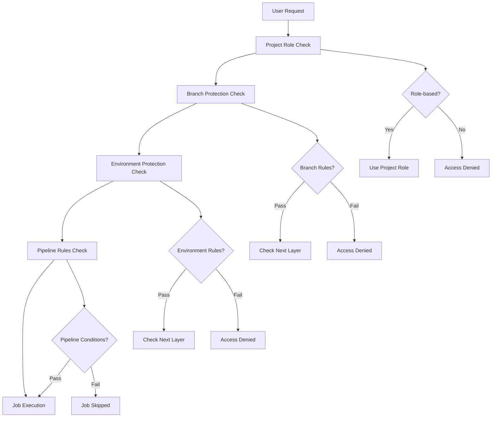
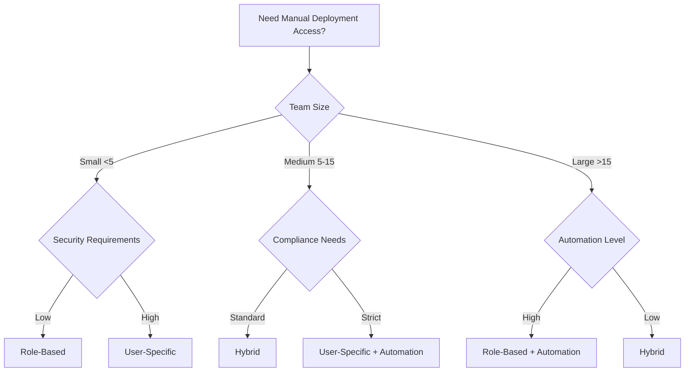

# Permission Models Analysis: GitLab CI Manual Deployment Access

## 🎯 Overview

Deep analysis of GitLab's permission models for manual deployment access, comparing role-based vs user-specific approaches, and understanding how different permission layers interact to control manual job execution.

## 📊 GitLab Permission Architecture

### Core Permission Layers



## 🔍 Permission Model Comparison

### 1. Role-Based Access Control (RBAC)

#### Definition
Access is granted based on predefined project roles (Guest, Reporter, Developer, Maintainer, Owner).

#### Advantages
```yaml
# ✅ Advantages of Role-Based Access
maintainability: 
  - Easy to manage at scale
  - Clear role hierarchy
  - Automatic inheritance
  
consistency:
  - Predictable permissions across projects
  - Standard role definitions
  - Reduced configuration complexity

scalability:
  - New team members get appropriate access automatically
  - Role changes apply universally
  - Less individual permission management
```

#### Disadvantages
```yaml
# ❌ Disadvantages of Role-Based Access
granularity:
  - Limited fine-grained control
  - May grant too many permissions
  - Hard to create custom access levels

flexibility:
  - Difficult to handle special cases
  - Cannot easily restrict specific users
  - Role changes affect all permissions
```

#### Implementation Example
```yaml
# GitLab Protected Environment - Role-based
protected_environments:
  production:
    deploy_access_levels:
      - access_level: maintainer      # All maintainers can deploy
      - access_level: developer       # All developers can deploy
    required_approvals: 0
    prevent_deployments: false

# Pipeline configuration
deploy_production:
  stage: deploy
  script: ./deploy.sh
  environment: production
  when: manual
  rules:
    - if: $CI_COMMIT_BRANCH == "main"
      when: manual
```

### 2. User-Specific Access Control (USAC)

#### Definition
Access is granted to explicitly named users, regardless of their project role.

#### Advantages
```yaml
# ✅ Advantages of User-Specific Access
precision:
  - Exact control over who has access
  - Can restrict high-privilege users
  - Fine-grained permission management

security:
  - Principle of least privilege
  - Explicit authorization required
  - Easy to audit and track

flexibility:
  - Handle special requirements
  - Temporary access grants
  - Role-independent permissions
```

#### Disadvantages
```yaml
# ❌ Disadvantages of User-Specific Access
maintenance:
  - Manual user list management
  - Requires regular updates
  - Potential for stale permissions

scalability:
  - Doesn't scale well with team growth
  - Individual configuration per user
  - High administrative overhead

complexity:
  - Non-standard permission model
  - Harder to understand access patterns
  - Increased configuration complexity
```

#### Implementation Example
```yaml
# GitLab Protected Environment - User-specific
protected_environments:
  production:
    deploy_access_levels:
      - user: devops.lead           # Specific users only
      - user: senior.developer.1
      - user: senior.developer.2
      - user: product.owner
    required_approvals: 2
    prevent_deployments: false

# Pipeline configuration with user validation
deploy_production:
  stage: deploy
  script: 
    - ./validate-user.sh $GITLAB_USER_LOGIN
    - ./deploy.sh
  environment: production
  when: manual
  rules:
    - if: $CI_COMMIT_BRANCH == "main" && $GITLAB_USER_LOGIN =~ /^(devops\.lead|senior\.developer\.[12]|product\.owner)$/
      when: manual
    - when: never
```

### 3. Hybrid Access Control (HAC)

#### Definition
Combines role-based and user-specific access, allowing both roles and individual users to have access.

#### Implementation Example
```yaml
# Hybrid approach
protected_environments:
  production:
    deploy_access_levels:
      - access_level: owner          # Role-based for owners
      - user: devops.lead           # User-specific for DevOps
      - user: senior.developer.1    # User-specific for senior dev
    required_approvals: 1
    prevent_deployments: false
```

## 📈 Permission Model Analysis Matrix

### Comparison Table

| Aspect | Role-Based | User-Specific | Hybrid |
|--------|------------|---------------|--------|
| **Maintainability** | ⭐⭐⭐⭐⭐ | ⭐⭐ | ⭐⭐⭐ |
| **Security** | ⭐⭐⭐ | ⭐⭐⭐⭐⭐ | ⭐⭐⭐⭐ |
| **Scalability** | ⭐⭐⭐⭐⭐ | ⭐⭐ | ⭐⭐⭐ |
| **Flexibility** | ⭐⭐ | ⭐⭐⭐⭐⭐ | ⭐⭐⭐⭐ |
| **Auditability** | ⭐⭐⭐ | ⭐⭐⭐⭐⭐ | ⭐⭐⭐⭐ |
| **Implementation Complexity** | ⭐⭐⭐⭐⭐ | ⭐⭐ | ⭐⭐⭐ |
| **Team Understanding** | ⭐⭐⭐⭐⭐ | ⭐⭐⭐ | ⭐⭐⭐ |

### Use Case Recommendations

| Team Size | Environment | Complexity | Recommended Model | Rationale |
|-----------|-------------|------------|------------------|-----------|
| **Small (2-5)** | Development | Low | Role-based | Simple, predictable |
| **Small (2-5)** | Production | Medium | User-specific | Better security control |
| **Medium (6-15)** | Development | Low | Role-based | Easy management |
| **Medium (6-15)** | Production | High | Hybrid | Balance of control and scale |
| **Large (16+)** | Development | Medium | Role-based | Scales well |
| **Large (16+)** | Production | High | Hybrid with automation | Automated user management |

## 🔧 Permission Layer Interactions

### Layer 1: Project Role Permissions

```yaml
# Base project permissions
project_roles:
  owner:
    can_edit_project: true
    can_manage_members: true
    can_manage_pipelines: true
    can_deploy_to_protected: true
    
  maintainer:
    can_push_to_protected: true
    can_manage_pipelines: true
    can_deploy_to_protected: true  # ⚠️ Subject to environment rules
    
  developer:
    can_push_to_branch: true
    can_create_merge_request: true
    can_deploy_to_protected: false  # ⚠️ Subject to environment rules
```

### Layer 2: Branch Protection Rules

```yaml
# Branch protection overrides project roles
protected_branches:
  main:
    push_access_level: maintainer    # Overrides project role
    merge_access_level: developer    # More permissive than push
    code_owner_approval: required
    
    # User-specific overrides
    allowed_to_push:
      - user: emergency.hotfix.user  # Special access
    allowed_to_merge:
      - user: junior.developer.1     # Exception for junior dev
```

### Layer 3: Environment Protection Rules

```yaml
# Environment protection is independent of branch protection
protected_environments:
  production:
    deploy_access_level: maintainer  # Different from branch rules
    
    # Can completely override project/branch permissions
    allowed_to_deploy:
      - user: devops.specialist      # Even if only Developer role
      - user: product.owner         # Even if only Reporter role
    
    required_approvals: 2
    prevent_deployments_to_protected: false
```

### Layer 4: Pipeline Rules

```yaml
# Pipeline rules add additional conditions
deploy_production:
  rules:
    # Time-based restrictions
    - if: $CI_COMMIT_BRANCH == "main" && $CI_PIPELINE_SOURCE == "schedule"
      when: never  # No automated deployments
      
    # User-based restrictions  
    - if: $CI_COMMIT_BRANCH == "main" && $GITLAB_USER_LOGIN == "contractor.user"
      when: never  # Block contractor access
      
    # Condition-based access
    - if: $CI_COMMIT_BRANCH == "main" && $CI_COMMIT_MESSAGE =~ /\[hotfix\]/
      when: manual
      allow_failure: false
      
    - if: $CI_COMMIT_BRANCH == "main"
      when: manual
```

## 🧪 Permission Testing Matrix

### Test Scenarios

| User Role | Branch Access | Environment Access | Pipeline Rules | Expected Result |
|-----------|---------------|-------------------|----------------|-----------------|
| **Owner** | ✅ | ✅ | ✅ | ✅ Can deploy |
| **Maintainer** | ✅ | ✅ | ✅ | ✅ Can deploy |
| **Maintainer** | ✅ | ❌ | ✅ | ❌ Cannot deploy |
| **Developer** | ❌ | ✅ | ✅ | ❌ Cannot deploy |
| **User-specific** | ❌ | ✅ | ✅ | ✅ Can deploy |
| **Blocked User** | ✅ | ✅ | ❌ | ❌ Cannot deploy |

### Testing Commands

```bash
# Test permission layers
# 1. Check project role
curl -H "PRIVATE-TOKEN: $API_TOKEN" \
     "https://gitlab.example.com/api/v4/projects/$PROJECT_ID/members/$USER_ID"

# 2. Check branch protection  
curl -H "PRIVATE-TOKEN: $API_TOKEN" \
     "https://gitlab.example.com/api/v4/projects/$PROJECT_ID/protected_branches/main"

# 3. Check environment protection
curl -H "PRIVATE-TOKEN: $API_TOKEN" \
     "https://gitlab.example.com/api/v4/projects/$PROJECT_ID/protected_environments"

# 4. Test pipeline execution
git push origin main  # Trigger pipeline and check manual job visibility
```

## 📋 Permission Decision Framework

### Decision Tree



### Implementation Recommendations

#### For Small Teams (2-5 people)
```yaml
# Recommended: Simple role-based for non-production
development:
  access_model: role-based
  roles: [developer, maintainer]
  
# User-specific for production
production:
  access_model: user-specific
  users: [team.lead, senior.dev]
  approvals: 1
```

#### For Medium Teams (6-15 people)
```yaml
# Recommended: Hybrid approach
staging:
  access_model: role-based
  roles: [maintainer]
  
production:
  access_model: hybrid
  roles: [owner]
  users: [devops.lead, senior.dev1, senior.dev2]
  approvals: 2
```

#### For Large Teams (16+ people)
```yaml
# Recommended: Role-based with automation
all_environments:
  access_model: role-based
  automation: user-sync-script
  roles: [maintainer]
  exceptions: automated-via-ldap
  approvals: environment-dependent
```

## 🔍 Common Permission Anti-Patterns

### Anti-Pattern 1: Role Confusion
```yaml
# ❌ Wrong assumption
# "Maintainer role should automatically grant production deploy access"

# ✅ Correct approach
# Check actual environment protection rules, not just project role
```

### Anti-Pattern 2: Inconsistent Models
```yaml
# ❌ Mixing models without clear rationale
production:
  access_model: user-specific
  users: [user1, user2]
  roles: [maintainer]  # Confusing mixed model

# ✅ Clear separation
production:
  access_model: user-specific
  users: [devops.lead, senior.dev]
  # OR
  access_model: role-based
  roles: [maintainer]
```

### Anti-Pattern 3: Over-Permission
```yaml
# ❌ Too permissive
production:
  access_level: developer  # Too broad

# ✅ Principle of least privilege
production:
  users: [specific.authorized.users]
  approvals: 2
```

## 📊 Metrics and KPIs

### Permission Model Health Metrics

| Metric | Role-Based | User-Specific | Hybrid |
|--------|------------|---------------|--------|
| **Access Request Time** | Low | High | Medium |
| **Permission Errors** | Medium | Low | Low |
| **Maintenance Overhead** | Low | High | Medium |
| **Security Incidents** | Medium | Low | Low |
| **User Satisfaction** | High | Medium | High |

### Monitoring Implementation
```yaml
# Permission model monitoring
monitor_permissions:
  stage: monitor
  script:
    - ./track-permission-metrics.sh
    - ./validate-access-patterns.sh
    - ./report-permission-anomalies.sh
  rules:
    - if: $CI_PIPELINE_SCHEDULE && $MONITOR_TYPE == "permissions"
```

---

## 📚 References

- GitLab User Permissions Documentation
- Access Control Best Practices
- DevOps Security Patterns
- Compliance Framework Guidelines
- Team Management Strategies

---

## 🧭 Navigation

← [Back to Best Practices](./best-practices.md) | [Next: Pipeline Configuration Examples](./pipeline-configuration-examples.md) →