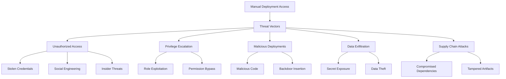

# Security Considerations: GitLab CI Manual Deployment Access

## 🔒 Overview

Comprehensive security guidelines for implementing and maintaining secure manual deployment access in GitLab CI/CD pipelines, covering threat models, security controls, compliance requirements, and incident response procedures.

## 🎯 Security Threat Model

### Potential Security Threats



### Risk Assessment Matrix

| Threat | Likelihood | Impact | Risk Level | Mitigation Priority |
|--------|------------|--------|------------|-------------------|
| **Unauthorized Access** | High | High | 🔴 Critical | ⭐⭐⭐⭐⭐ |
| **Privilege Escalation** | Medium | High | 🔴 High | ⭐⭐⭐⭐ |
| **Malicious Deployment** | Low | Critical | 🔴 High | ⭐⭐⭐⭐⭐ |
| **Credential Theft** | Medium | High | 🔴 High | ⭐⭐⭐⭐ |
| **Supply Chain Attack** | Low | Critical | 🔴 High | ⭐⭐⭐⭐ |
| **Insider Threat** | Low | High | 🟡 Medium | ⭐⭐⭐ |

## 🛡️ Security Controls Framework

### 1. Authentication and Authorization

#### Multi-Factor Authentication (MFA)
```yaml
# Security requirement: All users with deployment access must enable MFA
security_policy:
  mfa_requirement:
    enforced: true
    grace_period: 7 days
    exceptions: none
    
  deployment_access:
    requires_mfa: true
    session_timeout: 2 hours
    re_authentication: required_for_prod
```

#### Strong Authentication Pipeline Check
```yaml
# .gitlab-ci.yml - MFA validation
validate_authentication:
  stage: security
  script:
    - |
      # Check if user has MFA enabled
      MFA_STATUS=$(curl -s -H "PRIVATE-TOKEN: $API_TOKEN" \
        "$CI_API_V4_URL/user" | jq -r '.two_factor_enabled')
      
      if [ "$MFA_STATUS" != "true" ]; then
        echo "❌ MFA not enabled for $GITLAB_USER_LOGIN"
        echo "Production deployment requires MFA"
        exit 1
      fi
      
      echo "✅ MFA verified for $GITLAB_USER_LOGIN"
  rules:
    - if: $CI_COMMIT_BRANCH == "main" && $DEPLOYMENT_ENV == "production"
```

### 2. Access Control Security

#### Principle of Least Privilege
```yaml
# Example secure access configuration
access_control:
  production:
    model: user-specific  # Most restrictive
    users:
      - devops.lead        # Infrastructure specialist
      - security.lead      # Security approval
    required_approvals: 2   # Dual control
    approval_separation: true  # Different approvers
    
  staging:
    model: role-based
    roles: [maintainer]
    required_approvals: 1
    
  development:
    model: role-based
    roles: [developer, maintainer]
    required_approvals: 0
```

#### Time-Based Access Controls
```yaml
# .gitlab-ci.yml - Business hours restriction
deploy_production:
  stage: deploy
  script:
    - |
      # Security control: Production deployments only during business hours
      # except for emergency users
      
      CURRENT_HOUR=$(date -u +%H)
      CURRENT_DAY=$(date -u +%u)  # 1=Monday, 7=Sunday
      EMERGENCY_USERS="devops.oncall security.incident"
      
      # Check if emergency user
      if echo "$EMERGENCY_USERS" | grep -q "$GITLAB_USER_LOGIN"; then
        echo "✅ Emergency user - deployment allowed anytime"
        BYPASS_HOURS=true
      else
        BYPASS_HOURS=false
      fi
      
      # Business hours: Mon-Fri 9AM-5PM UTC
      if [ "$BYPASS_HOURS" = "false" ]; then
        if [ "$CURRENT_DAY" -gt 5 ] || [ "$CURRENT_HOUR" -lt 9 ] || [ "$CURRENT_HOUR" -ge 17 ]; then
          echo "❌ Production deployments outside business hours require emergency access"
          echo "Current time: $(date -u)"
          echo "Business hours: Mon-Fri 9AM-5PM UTC"
          exit 1
        fi
      fi
      
      ./deploy-production.sh
  environment:
    name: production
  when: manual
```

### 3. Deployment Security

#### Secure Deployment Pipeline
```yaml
# .gitlab-ci.yml - Security-hardened deployment
stages:
  - security-scan
  - compliance-check
  - approval
  - secure-deploy
  - verify

security_scan:
  stage: security-scan
  script:
    - echo "Running comprehensive security scans..."
    - ./sast-scan.sh              # Static Application Security Testing
    - ./dast-scan.sh              # Dynamic Application Security Testing  
    - ./dependency-scan.sh        # Dependency vulnerability scan
    - ./secret-detection.sh       # Secret detection scan
    - ./container-scan.sh         # Container image security scan
  artifacts:
    reports:
      sast: security-report.json
      dependency_scanning: dependency-report.json
      container_scanning: container-report.json
  rules:
    - if: $CI_COMMIT_BRANCH == "main"

compliance_check:
  stage: compliance-check
  script:
    - echo "Validating compliance requirements..."
    - ./sox-compliance-check.sh   # Sarbanes-Oxley compliance
    - ./gdpr-compliance-check.sh  # GDPR compliance
    - ./security-policy-check.sh # Internal security policies
  artifacts:
    reports:
      compliance: compliance-report.json
  rules:
    - if: $CI_COMMIT_BRANCH == "main"

security_approval:
  stage: approval
  script:
    - |
      echo "Security approval required for production deployment"
      echo "Approver: $GITLAB_USER_NAME ($GITLAB_USER_LOGIN)"
      
      # Validate approver has security clearance
      SECURITY_APPROVERS="security.lead compliance.officer devops.lead"
      if ! echo "$SECURITY_APPROVERS" | grep -q "$GITLAB_USER_LOGIN"; then
        echo "❌ User not authorized to approve security-sensitive deployments"
        exit 1
      fi
      
      # Log approval
      echo "Security approved by $GITLAB_USER_LOGIN at $(date -Iseconds)" > security-approval.log
  artifacts:
    paths:
      - security-approval.log
  environment:
    name: security-approval
  when: manual
  needs:
    - security_scan
    - compliance_check

secure_deploy:
  stage: secure-deploy
  script:
    - |
      echo "Executing secure production deployment..."
      
      # Pre-deployment security validation
      ./validate-deployment-integrity.sh
      
      # Create security audit trail
      cat << EOF > security-audit.json
      {
        "deployment_id": "$CI_PIPELINE_ID",
        "timestamp": "$(date -Iseconds)",
        "deployer": {
          "username": "$GITLAB_USER_LOGIN",
          "name": "$GITLAB_USER_NAME",
          "mfa_enabled": true
        },
        "security_approval": "$(cat security-approval.log)",
        "security_scans": {
          "sast": "passed",
          "dependency": "passed", 
          "container": "passed"
        },
        "compliance_checks": {
          "sox": "passed",
          "gdpr": "passed",
          "security_policy": "passed"
        }
      }
      EOF
      
      # Send to SIEM system
      ./send-to-siem.sh security-audit.json
      
      # Execute deployment with security monitoring
      ./deploy-with-security-monitoring.sh
  environment:
    name: production
    url: https://prod.example.com
  artifacts:
    reports:
      security_audit: security-audit.json
  needs:
    - security_approval
  when: on_success

security_verification:
  stage: verify
  script:
    - echo "Post-deployment security verification..."
    - ./verify-deployment-security.sh
    - ./runtime-security-check.sh
    - ./configuration-compliance-check.sh
  needs:
    - secure_deploy
  when: on_success
```

## 🔍 Secret Management Security

### 1. Secure Secret Handling

#### GitLab CI Variables Security
```yaml
# Secure variable configuration guidelines
variables:
  # ✅ Secure approach
  DATABASE_URL:
    value: "$SECURE_DATABASE_URL"   # From protected variables
    protected: true                  # Only available on protected branches
    masked: true                    # Masked in job logs
    
  API_KEY:
    value: "$PRODUCTION_API_KEY"
    protected: true
    masked: true
    environment_scope: "production"  # Environment-specific
    
  # ❌ Insecure approach  
  # PASSWORD: "hardcoded-password"  # Never hardcode secrets
  # TOKEN: "$CI_JOB_TOKEN"         # Don't expose job tokens unnecessarily
```

#### Secret Detection Pipeline
```yaml
secret_detection:
  stage: security
  script:
    - |
      echo "Scanning for secrets in codebase..."
      
      # Use multiple secret detection tools
      gitleaks detect --report-format json --report-path gitleaks-report.json
      truffleHog filesystem . --json > trufflehog-report.json
      
      # Custom secret patterns
      ./custom-secret-scanner.sh
      
      # Check for secrets in environment variables
      ./check-env-secrets.sh
      
      # Fail if secrets found
      if [ -s gitleaks-report.json ] || [ -s trufflehog-report.json ]; then
        echo "❌ Secrets detected in codebase"
        exit 1
      fi
  artifacts:
    reports:
      secret_detection: gitleaks-report.json
  rules:
    - if: $CI_COMMIT_BRANCH == "main"
```

### 2. Credential Rotation

#### Automated Credential Rotation
```yaml
rotate_production_secrets:
  stage: maintenance
  script:
    - |
      echo "Rotating production secrets..."
      
      # Generate new secrets
      NEW_API_KEY=$(./generate-secure-key.sh)
      NEW_DB_PASSWORD=$(./generate-secure-password.sh)
      
      # Update external services with new credentials
      ./update-external-service-key.sh "$NEW_API_KEY"
      ./update-database-password.sh "$NEW_DB_PASSWORD"
      
      # Update GitLab CI variables
      ./update-gitlab-variable.sh "PRODUCTION_API_KEY" "$NEW_API_KEY"
      ./update-gitlab-variable.sh "DATABASE_PASSWORD" "$NEW_DB_PASSWORD"
      
      # Verify new credentials work
      ./test-new-credentials.sh
      
      # Invalidate old credentials
      ./invalidate-old-credentials.sh
      
      echo "✅ Credential rotation completed"
  rules:
    - if: $CI_PIPELINE_SCHEDULE && $ROTATION_TYPE == "secrets"
    - if: $CI_COMMIT_MESSAGE =~ /\[rotate-secrets\]/i
      when: manual
```

## 🚨 Incident Response

### 1. Security Incident Detection

#### Automated Threat Detection
```yaml
security_monitoring:
  stage: monitor
  script:
    - |
      echo "Monitoring for security anomalies..."
      
      # Check for suspicious deployment patterns
      ./detect-anomalous-deployments.sh
      
      # Monitor for unauthorized access attempts
      ./check-failed-authentication.sh
      
      # Detect privilege escalation attempts
      ./detect-privilege-escalation.sh
      
      # Check for data exfiltration indicators
      ./monitor-data-access-patterns.sh
      
      # Alert on security policy violations
      ./check-policy-violations.sh
      
      if [ -f "security-alert.json" ]; then
        echo "🚨 Security incident detected"
        ./trigger-incident-response.sh
      fi
  rules:
    - if: $CI_PIPELINE_SCHEDULE && $MONITOR_TYPE == "security"
```

### 2. Incident Response Procedures

#### Emergency Response Pipeline
```yaml
# Emergency incident response
security_incident_response:
  stage: incident-response
  script:
    - |
      echo "🚨 SECURITY INCIDENT RESPONSE ACTIVATED 🚨"
      
      # Immediate containment actions
      ./disable-compromised-accounts.sh
      ./revoke-active-sessions.sh
      ./block-suspicious-ips.sh
      
      # Preserve evidence
      ./collect-audit-logs.sh
      ./snapshot-current-state.sh
      
      # Notify security team
      ./alert-security-team.sh
      ./create-incident-ticket.sh
      
      # Initiate recovery procedures
      ./start-incident-playbook.sh
      
      echo "Initial containment measures activated"
  rules:
    - if: $SECURITY_INCIDENT == "true"
      when: manual
  timeout: 1 hour
```

## 📊 Security Monitoring and Auditing

### 1. Comprehensive Audit Logging

#### Audit Trail Implementation
```yaml
deployment_audit:
  stage: audit
  script:
    - |
      # Create comprehensive audit record
      cat << EOF > deployment-audit.json
      {
        "event_type": "production_deployment",
        "timestamp": "$(date -Iseconds)",
        "event_id": "$CI_PIPELINE_ID-$CI_JOB_ID",
        "user": {
          "username": "$GITLAB_USER_LOGIN",
          "name": "$GITLAB_USER_NAME",
          "email": "$GITLAB_USER_EMAIL",
          "mfa_status": "verified",
          "session_id": "$CI_PIPELINE_ID"
        },
        "deployment": {
          "environment": "$DEPLOYMENT_ENV",
          "commit_sha": "$CI_COMMIT_SHA",
          "commit_author": "$CI_COMMIT_AUTHOR",
          "commit_message": "$CI_COMMIT_MESSAGE",
          "branch": "$CI_COMMIT_BRANCH"
        },
        "security": {
          "approvals_required": 2,
          "approvals_received": 2,
          "security_scan_status": "passed",
          "compliance_check_status": "passed"
        },
        "system": {
          "runner_id": "$CI_RUNNER_ID",
          "runner_description": "$CI_RUNNER_DESCRIPTION",
          "pipeline_source": "$CI_PIPELINE_SOURCE"
        }
      }
      EOF
      
      # Send to multiple audit systems
      ./send-to-audit-log.sh deployment-audit.json
      ./send-to-siem.sh deployment-audit.json
      ./send-to-compliance-system.sh deployment-audit.json
  artifacts:
    reports:
      audit: deployment-audit.json
    expire_in: 7 years  # Long retention for compliance
  rules:
    - if: $DEPLOYMENT_ENV == "production"
```

### 2. Security Metrics and KPIs

#### Security Dashboard Metrics
```yaml
security_metrics:
  stage: metrics
  script:
    - |
      # Collect security metrics
      echo "Collecting security metrics..."
      
      # Authentication metrics
      MFA_COVERAGE=$(./calculate-mfa-coverage.sh)
      FAILED_AUTHS=$(./count-failed-authentications.sh)
      
      # Access control metrics
      UNAUTHORIZED_ATTEMPTS=$(./count-unauthorized-access.sh)
      PRIVILEGE_VIOLATIONS=$(./count-privilege-violations.sh)
      
      # Deployment security metrics
      SECURE_DEPLOYMENTS=$(./count-secure-deployments.sh)
      SECURITY_SCAN_FAILURES=$(./count-security-scan-failures.sh)
      
      # Send to monitoring system
      ./send-metric.sh "security.mfa_coverage" "$MFA_COVERAGE"
      ./send-metric.sh "security.failed_auths" "$FAILED_AUTHS"
      ./send-metric.sh "security.unauthorized_attempts" "$UNAUTHORIZED_ATTEMPTS"
      ./send-metric.sh "security.secure_deployments" "$SECURE_DEPLOYMENTS"
  rules:
    - if: $CI_PIPELINE_SCHEDULE && $METRICS_TYPE == "security"
```

## ✅ Security Checklist

### Pre-Deployment Security Checklist
- [ ] **Authentication**: MFA enabled for all deployment users
- [ ] **Authorization**: Proper role/user-specific access configured
- [ ] **Secrets**: No hardcoded secrets in code or configuration
- [ ] **Scanning**: All security scans passed (SAST, DAST, dependency, container)
- [ ] **Compliance**: All regulatory requirements met
- [ ] **Approval**: Required approvals obtained from authorized personnel
- [ ] **Audit**: Comprehensive audit logging configured
- [ ] **Monitoring**: Security monitoring and alerting active

### Post-Deployment Security Checklist
- [ ] **Verification**: Deployment integrity verified
- [ ] **Configuration**: Security configuration validated
- [ ] **Monitoring**: Runtime security monitoring active
- [ ] **Incident Response**: IR procedures tested and ready
- [ ] **Documentation**: Security documentation updated
- [ ] **Training**: Team trained on security procedures

## 🔧 Security Tools Integration

### Recommended Security Tools
```yaml
security_tools:
  static_analysis:
    - SonarQube
    - Semgrep
    - CodeQL
    
  dependency_scanning:
    - Snyk
    - OWASP Dependency-Check
    - GitHub Advisory Database
    
  secret_detection:
    - GitLeaks
    - TruffleHog
    - detect-secrets
    
  container_security:
    - Trivy
    - Clair
    - Anchore
    
  runtime_security:
    - Falco
    - Sysdig
    - Aqua Security
```

---

## 📚 Security References

- OWASP CI/CD Security Top 10
- NIST Cybersecurity Framework
- CIS Controls for Secure Deployments
- GitLab Security Best Practices
- SOC 2 Compliance Requirements
- ISO 27001 Security Standards

---

## 🧭 Navigation

← [Back to Pipeline Configuration Examples](./pipeline-configuration-examples.md) | [Next: Troubleshooting Guide](./troubleshooting-guide.md) →