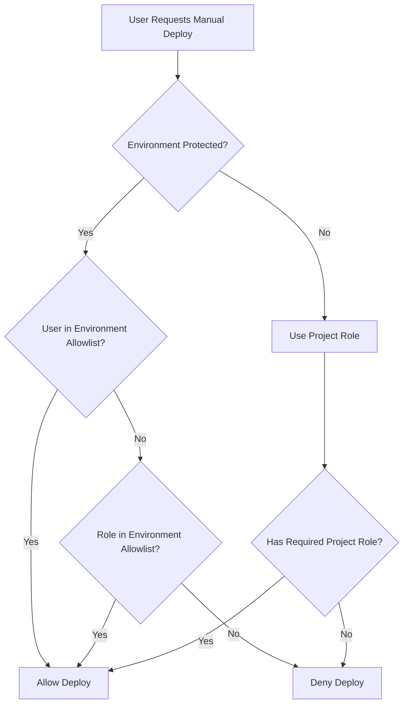

# Troubleshooting Guide: GitLab CI Manual Deployment Access

## 🎯 Overview

Comprehensive troubleshooting guide for common issues encountered with GitLab CI manual deployment access, including diagnostic procedures, solutions, and preventive measures.

## 🚨 Common Issues and Solutions

### 1. Manual Job Not Visible to User

#### Problem Description
User with maintainer role cannot see manual deployment jobs in the pipeline.

#### Symptoms
- User has maintainer role on project
- Pipeline runs successfully through automated stages
- Manual deployment job is not visible in GitLab UI
- No manual job button appears in pipeline view

#### Root Cause Analysis
```bash
# Diagnostic checklist
1. Project role permissions ✓ (Maintainer)
2. Branch protection rules ? (Check this)
3. Environment protection rules ? (Check this)
4. Pipeline job rules ? (Check this)
```

#### Solution Steps
```yaml
# Step 1: Check environment protection rules
# Navigate to: Settings → CI/CD → Protected Environments
# Look for your environment (e.g., "production")

# Step 2: Verify deployment access
protected_environments:
  production:
    deploy_access_levels:
      - user: your-username  # Add this line
      - access_level: maintainer  # Or ensure this exists

# Step 3: Update pipeline rules if needed
deploy_production:
  rules:
    - if: $CI_COMMIT_BRANCH == "main"
      when: manual  # Ensure this is set
    # Remove any restrictive user conditions
```

#### Prevention
```yaml
# Use hybrid approach for future-proofing
protected_environments:
  production:
    deploy_access_levels:
      - access_level: maintainer  # Role-based fallback
      - user: specific.user       # User-specific additions
```

### 2. "Manual job can't be triggered" Error

#### Problem Description
Manual job is visible but clicking "Play" button results in error or job fails immediately.

#### Symptoms
- Manual job button is visible
- Clicking button shows error message
- Job may start but fail immediately
- Error messages like "insufficient permissions" or "environment protected"

#### Diagnostic Commands
```bash
# Check user permissions via API
curl -H "PRIVATE-TOKEN: $TOKEN" \
  "$GITLAB_URL/api/v4/projects/$PROJECT_ID/members/$USER_ID"

# Check protected environment rules
curl -H "PRIVATE-TOKEN: $TOKEN" \
  "$GITLAB_URL/api/v4/projects/$PROJECT_ID/protected_environments"

# Check pipeline permissions
curl -H "PRIVATE-TOKEN: $TOKEN" \
  "$GITLAB_URL/api/v4/projects/$PROJECT_ID/pipelines/$PIPELINE_ID"
```

#### Solution Matrix

| Error Type | Cause | Solution |
|------------|-------|----------|
| **"Environment protected"** | User not in environment allowlist | Add user to protected environment |
| **"Insufficient permissions"** | Pipeline rules restrict access | Update pipeline rules or user permissions |
| **"Branch not allowed"** | Branch protection rules | Update branch protection or trigger from correct branch |
| **"Job conditions not met"** | Pipeline conditions failed | Check `rules` section in job definition |

#### Example Fixes
```yaml
# Fix 1: Update environment access
# GitLab UI: Settings → CI/CD → Protected Environments → production
deploy_access_levels:
  - user: failing-username

# Fix 2: Update pipeline rules
deploy_production:
  rules:
    - if: $CI_COMMIT_BRANCH == "main"  # Ensure branch matches
      when: manual
      allow_failure: false  # Don't allow skipping

# Fix 3: Check job dependencies
deploy_production:
  needs:
    - job: build_app
      artifacts: true  # Ensure artifacts are available
  when: manual
```

### 3. Role vs User Permission Confusion

#### Problem Description
Understanding when roles apply vs when user-specific rules override.

#### Common Confusion Points
```yaml
# ❓ "I'm a maintainer but can't deploy"
# This happens when environment uses user-specific rules

# Current configuration:
protected_environment:
  deploy_access_levels:
    - user: devops.lead
    - user: senior.dev
    # No role-based access = maintainers can't deploy

# ✅ Solution: Add role-based access
protected_environment:
  deploy_access_levels:
    - user: devops.lead
    - user: senior.dev
    - access_level: maintainer  # Now maintainers can deploy
```

#### Permission Hierarchy Flowchart


### 4. Manual Jobs Disappearing After Pipeline Update

#### Problem Description
Manual jobs were working but disappeared after updating `.gitlab-ci.yml`.

#### Common Causes and Fixes

#### Cause 1: Changed Branch Rules
```yaml
# ❌ Before (working)
deploy_production:
  when: manual
  only:
    - master  # Old default branch name

# ✅ After (fixed)
deploy_production:
  when: manual
  rules:
    - if: $CI_COMMIT_BRANCH == "main"  # New default branch name
      when: manual
```

#### Cause 2: Added Restrictive Rules
```yaml
# ❌ New restrictive rule
deploy_production:
  when: manual
  rules:
    - if: $CI_COMMIT_BRANCH == "main" && $GITLAB_USER_LOGIN == "specific.user"
      when: manual
    # This hides job from other users

# ✅ More inclusive rule
deploy_production:
  when: manual
  rules:
    - if: $CI_COMMIT_BRANCH == "main"
      when: manual  # Available to all authorized users
```

#### Cause 3: Environment Name Changes
```yaml
# ❌ Changed environment name
deploy_production:
  environment: production-new  # Environment not protected

# ✅ Use consistent environment names
deploy_production:
  environment: production  # Keep same name as protected environment
```

### 5. Multiple Manual Jobs for Same Environment

#### Problem Description
Multiple manual jobs for the same environment cause confusion or conflicts.

#### Example Problem
```yaml
# ❌ Confusing setup
deploy_prod_quick:
  environment: production
  when: manual
  script: ./quick-deploy.sh

deploy_prod_full:
  environment: production  
  when: manual
  script: ./full-deploy.sh
```

#### Solution Approaches

#### Approach 1: Different Environment Names
```yaml
# ✅ Separate environments
deploy_prod_hotfix:
  environment: production-hotfix
  when: manual
  script: ./hotfix-deploy.sh

deploy_prod_release:
  environment: production-release
  when: manual
  script: ./release-deploy.sh
```

#### Approach 2: Conditional Jobs
```yaml
# ✅ Conditional deployment types
deploy_production:
  environment: production
  script:
    - |
      if [ "$DEPLOYMENT_TYPE" = "hotfix" ]; then
        ./hotfix-deploy.sh
      else
        ./release-deploy.sh
      fi
  when: manual
  rules:
    - if: $CI_COMMIT_BRANCH == "main"
      when: manual
      variables:
        DEPLOYMENT_TYPE: "release"
    - if: $CI_COMMIT_MESSAGE =~ /\[hotfix\]/
      when: manual
      variables:
        DEPLOYMENT_TYPE: "hotfix"
```

### 6. Manual Job Timeout Issues

#### Problem Description
Manual deployment jobs timeout before completion.

#### Symptoms
- Job starts successfully
- Runs for extended period
- Times out with "job exceeded maximum timeout"
- Deployment may be partially completed

#### Solutions

#### Solution 1: Increase Job Timeout
```yaml
deploy_production:
  script: ./long-running-deploy.sh
  when: manual
  timeout: 2 hours  # Increase from default 1 hour
  environment: production
```

#### Solution 2: Optimize Deployment Script
```bash
#!/bin/bash
# optimized-deploy.sh
set -e

# Show progress to prevent timeout
echo "Starting deployment at $(date)"

# Break deployment into phases with progress indicators
echo "Phase 1: Preparing deployment..."
./prepare-deployment.sh

echo "Phase 2: Uploading artifacts..."  
./upload-artifacts.sh

echo "Phase 3: Updating services..."
./update-services.sh

echo "Phase 4: Running health checks..."
./health-check.sh

echo "Deployment completed at $(date)"
```

#### Solution 3: Asynchronous Deployment Pattern
```yaml
trigger_deployment:
  stage: deploy
  script:
    - |
      # Trigger deployment asynchronously
      DEPLOY_ID=$(./trigger-async-deploy.sh production)
      echo "Deployment triggered: $DEPLOY_ID"
      echo "DEPLOY_ID=$DEPLOY_ID" > deploy.env
  artifacts:
    reports:
      dotenv: deploy.env
  when: manual
  timeout: 5 minutes

monitor_deployment:
  stage: verify
  script:
    - |
      echo "Monitoring deployment: $DEPLOY_ID"
      ./wait-for-deployment.sh $DEPLOY_ID
  needs:
    - job: trigger_deployment
      artifacts: true
  when: on_success
```

### 7. Permission Issues After User Changes

#### Problem Description
User permissions stop working after role changes or team restructuring.

#### Common Scenarios

#### Scenario 1: User Role Downgraded
```yaml
# User was Owner, now Developer
# Environment still expects Owner level

# ✅ Solution: Update environment protection
protected_environments:
  production:
    deploy_access_levels:
      - access_level: developer  # Lower requirement
      # OR add user specifically
      - user: downgraded.username
```

#### Scenario 2: User Left Team
```yaml
# Old user-specific rules prevent deployments
# ❌ Current config
protected_environments:
  production:
    deploy_access_levels:
      - user: former.employee  # No longer exists

# ✅ Updated config
protected_environments:
  production:
    deploy_access_levels:
      - user: new.team.lead
      - access_level: maintainer  # Role-based fallback
```

#### Scenario 3: Team Reorganization
```bash
#!/bin/bash
# update-team-permissions.sh
# Script to update permissions after team changes

PROJECT_ID="$1"
OLD_USER="$2"
NEW_USER="$3"

# Update protected environments
curl --request PUT \
     --header "PRIVATE-TOKEN: $GITLAB_TOKEN" \
     --data "deploy_access_levels[][user]=$NEW_USER" \
     "$GITLAB_URL/api/v4/projects/$PROJECT_ID/protected_environments/production"

# Remove old user
curl --request DELETE \
     --header "PRIVATE-TOKEN: $GITLAB_TOKEN" \
     "$GITLAB_URL/api/v4/projects/$PROJECT_ID/protected_environments/production/deploy_access_levels/$OLD_USER_ID"
```

## 🔧 Diagnostic Tools and Scripts

### 1. Permission Diagnostic Script

```bash
#!/bin/bash
# diagnose-permissions.sh - Comprehensive permission analysis

PROJECT_ID="$1"
USERNAME="$2"
ENVIRONMENT="$3"

echo "=== GitLab Permission Diagnostics ==="
echo "Project: $PROJECT_ID"
echo "User: $USERNAME"
echo "Environment: $ENVIRONMENT"
echo "Time: $(date -Iseconds)"
echo

# 1. Check user project membership
echo "1. PROJECT MEMBERSHIP:"
USER_INFO=$(curl -s -H "PRIVATE-TOKEN: $GITLAB_TOKEN" \
  "$GITLAB_URL/api/v4/projects/$PROJECT_ID/members/all" | \
  jq -r ".[] | select(.username == \"$USERNAME\")")

if [ -n "$USER_INFO" ]; then
  ACCESS_LEVEL=$(echo "$USER_INFO" | jq -r '.access_level')
  echo "   ✅ User found with access level: $ACCESS_LEVEL"
  case $ACCESS_LEVEL in
    10) echo "      Role: Guest" ;;
    20) echo "      Role: Reporter" ;;
    30) echo "      Role: Developer" ;;
    40) echo "      Role: Maintainer" ;;
    50) echo "      Role: Owner" ;;
  esac
else
  echo "   ❌ User not found in project members"
fi

echo

# 2. Check protected branches
echo "2. PROTECTED BRANCHES:"
PROTECTED_BRANCHES=$(curl -s -H "PRIVATE-TOKEN: $GITLAB_TOKEN" \
  "$GITLAB_URL/api/v4/projects/$PROJECT_ID/protected_branches")

echo "$PROTECTED_BRANCHES" | jq -r '.[] | "   Branch: \(.name) | Push: \(.push_access_levels) | Merge: \(.merge_access_levels)"'

echo

# 3. Check protected environments
echo "3. PROTECTED ENVIRONMENTS:"
PROTECTED_ENVS=$(curl -s -H "PRIVATE-TOKEN: $GITLAB_TOKEN" \
  "$GITLAB_URL/api/v4/projects/$PROJECT_ID/protected_environments")

if [ "$PROTECTED_ENVS" != "[]" ]; then
  echo "$PROTECTED_ENVS" | jq -r ".[] | select(.name == \"$ENVIRONMENT\") | \"   Environment: \(.name) | Deploy Access: \(.deploy_access_levels)\""
else
  echo "   ℹ️ No protected environments configured"
fi

echo

# 4. Check recent pipelines
echo "4. RECENT PIPELINE ACCESS:"
RECENT_PIPELINES=$(curl -s -H "PRIVATE-TOKEN: $GITLAB_TOKEN" \
  "$GITLAB_URL/api/v4/projects/$PROJECT_ID/pipelines?per_page=5")

echo "$RECENT_PIPELINES" | jq -r '.[] | "   Pipeline: \(.id) | User: \(.user.username) | Status: \(.status) | Branch: \(.ref)"'

echo
echo "=== DIAGNOSTIC COMPLETE ==="
```

### 2. Quick Permission Fix Script

```bash
#!/bin/bash
# quick-fix-permissions.sh - Common permission fixes

PROJECT_ID="$1"
USERNAME="$2"
ENVIRONMENT="$3"
ACTION="$4"

case $ACTION in
  "add-user")
    echo "Adding user $USERNAME to environment $ENVIRONMENT..."
    curl --request POST \
         --header "PRIVATE-TOKEN: $GITLAB_TOKEN" \
         --data "name=$ENVIRONMENT" \
         --data "deploy_access_levels[][user]=$USERNAME" \
         "$GITLAB_URL/api/v4/projects/$PROJECT_ID/protected_environments"
    ;;
    
  "add-role")
    echo "Adding maintainer role to environment $ENVIRONMENT..."
    curl --request POST \
         --header "PRIVATE-TOKEN: $GITLAB_TOKEN" \
         --data "name=$ENVIRONMENT" \
         --data "deploy_access_levels[][access_level]=40" \
         "$GITLAB_URL/api/v4/projects/$PROJECT_ID/protected_environments"
    ;;
    
  "list-permissions")
    echo "Current permissions for $ENVIRONMENT:"
    curl -s -H "PRIVATE-TOKEN: $GITLAB_TOKEN" \
         "$GITLAB_URL/api/v4/projects/$PROJECT_ID/protected_environments" | \
         jq ".[] | select(.name == \"$ENVIRONMENT\")"
    ;;
esac
```

## 📋 Troubleshooting Checklist

### Manual Job Not Appearing Checklist
- [ ] User has appropriate project role (Developer+ typically)
- [ ] Environment is properly configured as protected environment
- [ ] User is in environment deployment allowlist OR role is allowed
- [ ] Pipeline rules don't exclude the user
- [ ] Branch matches the conditions in job rules
- [ ] Job dependencies are satisfied
- [ ] GitLab CI/CD is enabled for the project

### Manual Job Failing Checklist
- [ ] All job dependencies completed successfully
- [ ] Required artifacts are available
- [ ] Environment variables are properly set
- [ ] Secrets/tokens are not expired
- [ ] Runner has necessary permissions
- [ ] Deployment script is executable
- [ ] Target environment is accessible
- [ ] Job timeout is sufficient

### Permission Troubleshooting Checklist
- [ ] Check project member list and roles
- [ ] Review protected branch settings
- [ ] Verify protected environment configuration
- [ ] Examine pipeline job rules
- [ ] Test with different user accounts
- [ ] Check audit logs for permission denials
- [ ] Validate API token permissions (if using API)

## 🚨 Emergency Procedures

### Emergency Access Restoration

```yaml
# emergency-access.yml - Emergency pipeline for access restoration
emergency_restore_access:
  stage: emergency
  script:
    - |
      echo "🚨 EMERGENCY ACCESS RESTORATION 🚨"
      echo "Initiated by: $GITLAB_USER_LOGIN"
      echo "Time: $(date -Iseconds)"
      
      # Temporary access grant (to be reviewed)
      ./grant-emergency-access.sh "$EMERGENCY_USER" "production"
      
      # Create incident ticket
      ./create-emergency-ticket.sh "Access restoration for $EMERGENCY_USER"
      
      # Notify security team
      ./notify-security-team.sh "Emergency access granted"
      
      echo "Emergency access granted - REVIEW WITHIN 24 HOURS"
  rules:
    - if: $EMERGENCY_ACCESS == "true"
      when: manual
  timeout: 10 minutes
```

### Recovery Procedures

```bash
#!/bin/bash
# recover-deployment-access.sh
# Script to recover from deployment access issues

echo "GitLab Deployment Access Recovery"
echo "================================"

# 1. Backup current configuration
echo "Backing up current configuration..."
mkdir -p backup/$(date +%Y%m%d-%H%M%S)
./export-project-config.sh > backup/$(date +%Y%m%d-%H%M%S)/project-config.json

# 2. Reset to known good configuration
echo "Applying known good configuration..."
./apply-baseline-permissions.sh

# 3. Test access
echo "Testing access restoration..."
./test-deployment-access.sh

# 4. Create recovery report
echo "Creating recovery report..."
./generate-recovery-report.sh
```

## 📊 Monitoring and Prevention

### Proactive Monitoring Setup

```yaml
# monitor-deployment-access.yml
monitor_access_health:
  stage: monitor
  script:
    - |
      echo "Monitoring deployment access health..."
      
      # Check for users losing access
      ./check-access-changes.sh
      
      # Validate environment configurations
      ./validate-environment-config.sh
      
      # Test critical user access
      ./test-critical-access.sh
      
      # Report access anomalies
      ./report-access-anomalies.sh
  rules:
    - if: $CI_PIPELINE_SCHEDULE && $SCHEDULE_TYPE == "access-monitoring"
```

### Preventive Measures

1. **Regular Access Reviews**: Monthly review of all deployment permissions
2. **Documentation**: Keep permission model documented and current  
3. **Testing**: Regular testing of deployment access for critical users
4. **Automation**: Use scripts to manage permissions consistently
5. **Monitoring**: Set up alerts for permission changes
6. **Training**: Ensure team understands permission model

---

## 📚 Additional Resources

- [GitLab CI/CD Permissions Documentation](https://docs.gitlab.com/ee/user/permissions.html)
- [Protected Environments Guide](https://docs.gitlab.com/ee/ci/environments/protected_environments.html)
- [GitLab API Reference](https://docs.gitlab.com/ee/api/)
- [CI/CD Troubleshooting Guide](https://docs.gitlab.com/ee/ci/troubleshooting.html)

---

## 🧭 Navigation

← [Back to Security Considerations](./security-considerations.md) | [Back to Main README](./README.md) →