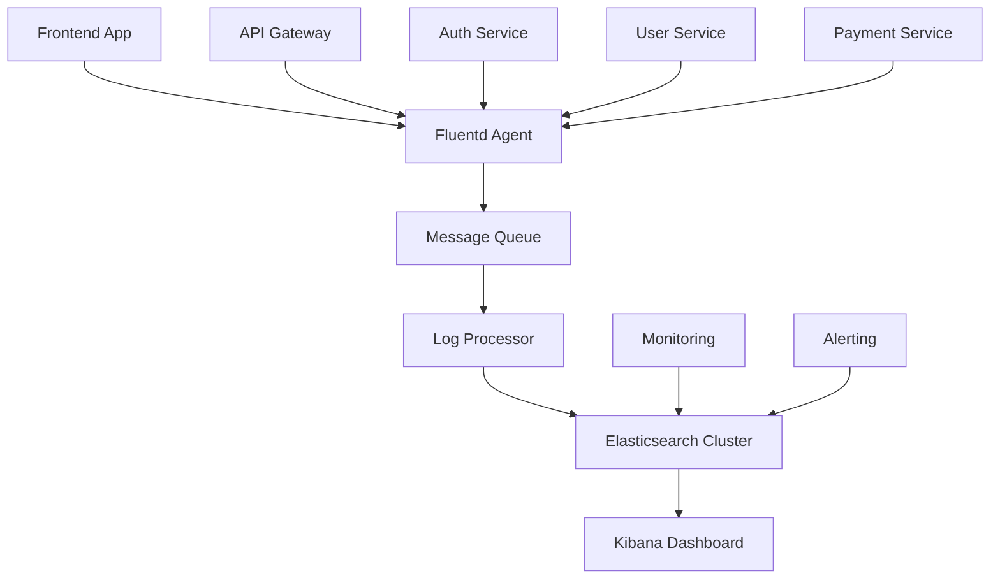

# Best Practices: Log Management & Analysis

## 🎯 Executive Overview

This document outlines industry-proven best practices for implementing log management solutions in EdTech environments, with specific focus on scalability, security, compliance, and cost optimization for organizations targeting AU, UK, and US markets.

## 📋 Core Principles

### 1. Structured Logging
**Principle**: Use consistent, machine-readable log formats across all applications and services.

**Implementation**:
```json
{
  "@timestamp": "2025-01-01T10:00:00.000Z",
  "level": "INFO",
  "service": "edtech-api",
  "environment": "production",
  "version": "1.2.3",
  "request_id": "req_abc123",
  "user_id": "user_456",
  "session_id": "sess_789",
  "event": "user_login",
  "message": "User successfully authenticated",
  "metadata": {
    "ip_address": "192.168.1.100",
    "user_agent": "Mozilla/5.0...",
    "login_method": "email"
  },
  "performance": {
    "response_time_ms": 150,
    "db_query_time_ms": 45
  }
}
```

**Benefits**:
- Enables powerful search and analytics
- Reduces parsing overhead
- Improves correlation across services
- Simplifies automated alerting

### 2. Centralized Logging Architecture
**Principle**: Aggregate all logs into a centralized system for unified analysis and monitoring.

**Architecture Pattern**:
```
Applications → Log Agents → Message Queue → Processing → Storage → Visualization
     ↓             ↓            ↓            ↓         ↓          ↓
  (Apps)      (Fluentd)     (Kafka)    (Logstash)   (ES)    (Kibana)
```

### 3. Data Lifecycle Management
**Principle**: Implement automated policies for log retention, archival, and deletion based on business and compliance requirements.

**Lifecycle Stages**:
- **Hot Data** (0-7 days): High-performance storage, real-time analysis
- **Warm Data** (7-90 days): Standard storage, slower queries acceptable
- **Cold Data** (90-365 days): Low-cost storage, rare access
- **Archived** (1-7 years): Compliance storage, backup only

## 🏗️ Architecture Best Practices

### Microservices Logging Pattern



### High Availability Configuration

#### Elasticsearch Cluster Setup
```yaml
# Production cluster configuration
cluster.name: edtech-production
node.name: ${HOSTNAME}
node.roles: [master, data, ingest]

# Network settings
network.host: 0.0.0.0
http.port: 9200
transport.port: 9300

# Discovery settings
discovery.seed_hosts: 
  - es-node-1.internal
  - es-node-2.internal
  - es-node-3.internal
cluster.initial_master_nodes:
  - es-node-1
  - es-node-2
  - es-node-3

# Memory settings
bootstrap.memory_lock: true
indices.memory.index_buffer_size: 30%

# Data paths
path.data: /var/lib/elasticsearch
path.logs: /var/log/elasticsearch

# Security
xpack.security.enabled: true
xpack.security.transport.ssl.enabled: true
xpack.security.http.ssl.enabled: true
```

#### Load Balancing Strategy
```nginx
# Nginx configuration for Elasticsearch
upstream elasticsearch {
    least_conn;
    server es-node-1.internal:9200 max_fails=3 fail_timeout=30s;
    server es-node-2.internal:9200 max_fails=3 fail_timeout=30s;
    server es-node-3.internal:9200 max_fails=3 fail_timeout=30s;
}

server {
    listen 443 ssl;
    server_name logs.edtech.com;
    
    ssl_certificate /path/to/cert.pem;
    ssl_certificate_key /path/to/key.pem;
    
    location / {
        proxy_pass http://elasticsearch;
        proxy_set_header Host $host;
        proxy_set_header X-Real-IP $remote_addr;
        proxy_set_header X-Forwarded-For $proxy_add_x_forwarded_for;
        proxy_connect_timeout 30s;
        proxy_send_timeout 30s;
        proxy_read_timeout 30s;
    }
}
```

### Data Partitioning Strategy

#### Index Template for Time-based Partitioning
```json
{
  "index_patterns": ["edtech-logs-*"],
  "template": {
    "settings": {
      "number_of_shards": 3,
      "number_of_replicas": 1,
      "index.lifecycle.name": "edtech-policy",
      "index.lifecycle.rollover_alias": "edtech-logs-write",
      "refresh_interval": "5s"
    },
    "mappings": {
      "properties": {
        "@timestamp": {
          "type": "date",
          "format": "strict_date_optional_time||epoch_millis"
        },
        "level": {
          "type": "keyword"
        },
        "service": {
          "type": "keyword"
        },
        "environment": {
          "type": "keyword"
        },
        "message": {
          "type": "text",
          "analyzer": "standard"
        },
        "user_id": {
          "type": "keyword"
        },
        "request_id": {
          "type": "keyword"
        },
        "response_time_ms": {
          "type": "float"
        },
        "status_code": {
          "type": "short"
        },
        "ip_address": {
          "type": "ip"
        }
      }
    }
  }
}
```

#### Index Lifecycle Management (ILM) Policy
```json
{
  "policy": {
    "phases": {
      "hot": {
        "actions": {
          "rollover": {
            "max_size": "10GB",
            "max_age": "1d"
          },
          "set_priority": {
            "priority": 100
          }
        }
      },
      "warm": {
        "min_age": "7d",
        "actions": {
          "allocate": {
            "number_of_replicas": 0
          },
          "forcemerge": {
            "max_num_segments": 1
          },
          "set_priority": {
            "priority": 50
          }
        }
      },
      "cold": {
        "min_age": "90d",
        "actions": {
          "allocate": {
            "number_of_replicas": 0,
            "require": {
              "data_tier": "cold"
            }
          },
          "set_priority": {
            "priority": 0
          }
        }
      },
      "delete": {
        "min_age": "365d"
      }
    }
  }
}
```

## 🔒 Security Best Practices

### Authentication and Authorization

#### Role-Based Access Control (RBAC)
```json
{
  "edtech_developer": {
    "cluster": ["monitor"],
    "indices": [
      {
        "names": ["edtech-logs-*", "edtech-metrics-*"],
        "privileges": ["read", "view_index_metadata"],
        "field_security": {
          "except": ["user_email", "payment_info", "personal_data"]
        }
      }
    ]
  },
  "edtech_admin": {
    "cluster": ["all"],
    "indices": [
      {
        "names": ["edtech-*"],
        "privileges": ["all"]
      }
    ]
  },
  "edtech_analyst": {
    "cluster": ["monitor"],
    "indices": [
      {
        "names": ["edtech-analytics-*"],
        "privileges": ["read"],
        "query": {
          "bool": {
            "must_not": {
              "exists": {
                "field": "pii_data"
              }
            }
          }
        }
      }
    ]
  }
}
```

### Data Encryption

#### Encryption at Rest
```yaml
# Elasticsearch encryption settings
xpack.security.encryptionKey.length: 32
xpack.encryptedSavedObjects.encryptionKey: "your-32-character-encryption-key"

# File system encryption (Linux)
# Use LUKS for disk encryption
cryptsetup luksFormat /dev/sdb
cryptsetup luksOpen /dev/sdb elasticsearch-data
mkfs.ext4 /dev/mapper/elasticsearch-data
```

#### Encryption in Transit
```bash
# Generate CA certificate
openssl genrsa -out ca-key.pem 4096
openssl req -new -x509 -days 365 -key ca-key.pem -out ca-cert.pem

# Generate node certificates
openssl genrsa -out node-key.pem 4096
openssl req -new -key node-key.pem -out node-csr.pem
openssl x509 -req -in node-csr.pem -CA ca-cert.pem -CAkey ca-key.pem -out node-cert.pem -days 365
```

### Audit Logging Configuration
```yaml
# Elasticsearch audit logging
xpack.security.audit.enabled: true
xpack.security.audit.outputs: [index, logfile]
xpack.security.audit.logfile.events.emit_request_body: true
xpack.security.audit.index.events.emit_request_body: false

# Audit events to capture
xpack.security.audit.logfile.events.include:
  - access_granted
  - access_denied
  - anonymous_access_denied
  - authentication_failed
  - connection_granted
  - connection_denied
  - tampered_request
  - run_as_granted
  - run_as_denied
```

## 📊 Performance Optimization

### Query Optimization

#### Efficient Search Patterns
```json
{
  "query": {
    "bool": {
      "filter": [
        {
          "range": {
            "@timestamp": {
              "gte": "now-1h",
              "lte": "now"
            }
          }
        },
        {
          "term": {
            "service.keyword": "edtech-api"
          }
        },
        {
          "term": {
            "environment.keyword": "production"
          }
        }
      ],
      "must": [
        {
          "match": {
            "message": "error"
          }
        }
      ]
    }
  },
  "sort": [
    {
      "@timestamp": {
        "order": "desc"
      }
    }
  ],
  "size": 100
}
```

#### Aggregation Best Practices
```json
{
  "size": 0,
  "aggs": {
    "errors_by_service": {
      "terms": {
        "field": "service.keyword",
        "size": 10
      },
      "aggs": {
        "error_count": {
          "filter": {
            "term": {
              "level.keyword": "ERROR"
            }
          }
        },
        "avg_response_time": {
          "avg": {
            "field": "response_time_ms"
          }
        }
      }
    },
    "errors_over_time": {
      "date_histogram": {
        "field": "@timestamp",
        "calendar_interval": "1h"
      },
      "aggs": {
        "error_count": {
          "filter": {
            "term": {
              "level.keyword": "ERROR"
            }
          }
        }
      }
    }
  }
}
```

### Resource Management

#### Memory Configuration
```yaml
# JVM heap sizing (Elasticsearch)
-Xms4g    # Initial heap size
-Xmx4g    # Maximum heap size (same as initial)

# OS-level optimizations
vm.max_map_count=262144
vm.swappiness=1
fs.file-max=65536

# Container resource limits
resources:
  limits:
    memory: "8Gi"
    cpu: "4"
  requests:
    memory: "4Gi"
    cpu: "2"
```

#### Storage Optimization
```yaml
# SSD-optimized settings
index.store.type: hybridfs
index.compound_format: false
index.merge.policy.max_merged_segment: 5gb

# Compression settings
index.codec: best_compression
index.mapping.total_fields.limit: 2000
```

## 🚨 Monitoring and Alerting

### Key Performance Indicators (KPIs)

#### System Health Metrics
```yaml
# Elasticsearch cluster health
- metric: cluster_health_status
  threshold: yellow
  severity: warning
  
- metric: cluster_health_status
  threshold: red
  severity: critical

# Node performance
- metric: jvm_heap_used_percent
  threshold: 85
  severity: warning
  
- metric: jvm_heap_used_percent
  threshold: 95
  severity: critical

# Index performance
- metric: indexing_rate_per_second
  baseline: auto
  deviation: 50%
  severity: warning

# Search performance
- metric: search_query_time_in_millis
  threshold: 1000
  severity: warning
```

#### Application-Specific Metrics
```yaml
# Error rate monitoring
- metric: error_rate_5min
  query: 'level:ERROR'
  threshold: 5%
  severity: warning
  
- metric: error_rate_5min
  query: 'level:ERROR'
  threshold: 10%
  severity: critical

# User activity monitoring
- metric: login_failures_5min
  query: 'event:login_failed'
  threshold: 100
  severity: warning

# Performance monitoring
- metric: api_response_time_p95
  field: response_time_ms
  threshold: 2000
  severity: warning
```

### Alerting Configuration

#### Watcher Configuration (Elasticsearch)
```json
{
  "trigger": {
    "schedule": {
      "interval": "5m"
    }
  },
  "input": {
    "search": {
      "request": {
        "search_type": "query_then_fetch",
        "indices": ["edtech-logs-*"],
        "body": {
          "query": {
            "bool": {
              "must": [
                {
                  "range": {
                    "@timestamp": {
                      "gte": "now-5m"
                    }
                  }
                },
                {
                  "term": {
                    "level.keyword": "ERROR"
                  }
                }
              ]
            }
          },
          "aggs": {
            "error_count": {
              "cardinality": {
                "field": "request_id.keyword"
              }
            }
          }
        }
      }
    }
  },
  "condition": {
    "compare": {
      "ctx.payload.aggregations.error_count.value": {
        "gt": 10
      }
    }
  },
  "actions": {
    "send_slack": {
      "slack": {
        "account": "monitoring",
        "message": {
          "to": ["#alerts"],
          "text": "High error rate detected: {{ctx.payload.aggregations.error_count.value}} errors in the last 5 minutes"
        }
      }
    },
    "send_email": {
      "email": {
        "to": ["devops@edtech.com"],
        "subject": "Critical: High Error Rate Alert",
        "body": "Error count: {{ctx.payload.aggregations.error_count.value}}"
      }
    }
  }
}
```

## 💰 Cost Optimization

### Resource Right-Sizing

#### Dynamic Scaling Strategy
```yaml
# Kubernetes HPA for Elasticsearch
apiVersion: autoscaling/v2
kind: HorizontalPodAutoscaler
metadata:
  name: elasticsearch-hpa
spec:
  scaleTargetRef:
    apiVersion: apps/v1
    kind: StatefulSet
    name: elasticsearch
  minReplicas: 3
  maxReplicas: 10
  metrics:
  - type: Resource
    resource:
      name: cpu
      target:
        type: Utilization
        averageUtilization: 70
  - type: Resource
    resource:
      name: memory
      target:
        type: Utilization
        averageUtilization: 80
```

#### Cost Monitoring Dashboard
```json
{
  "dashboard": {
    "title": "Log Management Cost Dashboard",
    "panels": [
      {
        "title": "Daily Ingestion Cost",
        "type": "graph",
        "targets": [
          {
            "expr": "elasticsearch_indices_store_size_bytes / 1024 / 1024 / 1024 * 0.023",
            "legendFormat": "Storage Cost ($)"
          }
        ]
      },
      {
        "title": "Compute Cost",
        "type": "graph",
        "targets": [
          {
            "expr": "elasticsearch_nodes_count * 24 * 0.096",
            "legendFormat": "Daily Compute Cost ($)"
          }
        ]
      }
    ]
  }
}
```

### Data Lifecycle Optimization

#### Tiered Storage Strategy
```yaml
# Hot tier (SSD, high IOPS)
hot_nodes:
  instance_type: r5.xlarge
  storage_type: gp3
  storage_size: 100GB
  cost_per_hour: $0.252

# Warm tier (SSD, standard IOPS) 
warm_nodes:
  instance_type: r5.large
  storage_type: gp2
  storage_size: 200GB
  cost_per_hour: $0.126

# Cold tier (HDD, low IOPS)
cold_nodes:
  instance_type: r5.medium
  storage_type: st1
  storage_size: 500GB
  cost_per_hour: $0.063
```

## 🌍 Compliance and Governance

### GDPR Compliance (EU/UK)

#### Data Subject Rights Implementation
```json
{
  "data_subject_request_handler": {
    "search_template": {
      "template": {
        "query": {
          "bool": {
            "should": [
              {
                "term": {
                  "user_id.keyword": "{{user_id}}"
                }
              },
              {
                "term": {
                  "user_email.keyword": "{{user_email}}"
                }
              },
              {
                "match": {
                  "message": "{{user_identifier}}"
                }
              }
            ]
          }
        }
      }
    },
    "data_deletion": {
      "query": {
        "term": {
          "user_id.keyword": "{{user_id}}"
        }
      },
      "script": {
        "source": """
          ctx._source.user_id = 'DELETED';
          ctx._source.user_email = 'DELETED';
          ctx._source.personal_data = 'DELETED';
          ctx._source.gdpr_deleted = true;
        """
      }
    }
  }
}
```

### FERPA Compliance (US)

#### Educational Records Protection
```yaml
# Field-level security for educational records
educational_records_access:
  roles:
    - name: teacher
      indices: ["student-activity-*"]
      field_security:
        grant: ["student_id", "activity_type", "timestamp", "score"]
        except: ["personal_info", "parent_contact"]
    
    - name: administrator
      indices: ["student-activity-*", "system-logs-*"]
      field_security:
        grant: ["*"]
    
    - name: parent
      indices: ["student-activity-*"]
      field_security:
        grant: ["activity_type", "timestamp", "score"]
      document_level_security:
        query: |
          {
            "term": {
              "student_id": "{{user.student_children}}"
            }
          }
```

### Australian Privacy Act Compliance

#### Data Localization Requirements
```yaml
# Australian data residency configuration
australia_cluster:
  region: ap-southeast-2
  availability_zones:
    - ap-southeast-2a
    - ap-southeast-2b
    - ap-southeast-2c
  
  data_classification:
    personal_information:
      retention_period: "7 years"
      encryption: "AES-256"
      access_logs: true
    
    sensitive_information:
      retention_period: "7 years"
      encryption: "AES-256"
      access_logs: true
      approval_required: true
```

## 🔄 Backup and Disaster Recovery

### Backup Strategy

#### Automated Snapshot Configuration
```json
{
  "type": "s3",
  "settings": {
    "bucket": "edtech-elasticsearch-backups",
    "region": "us-east-1",
    "base_path": "snapshots",
    "compress": true,
    "server_side_encryption": true,
    "storage_class": "standard_ia"
  }
}
```

#### Backup Schedule
```json
{
  "schedule": "0 2 * * *",
  "name": "daily-snapshot-{now/d}",
  "repository": "s3-backup",
  "config": {
    "indices": "edtech-*",
    "ignore_unavailable": true,
    "include_global_state": false,
    "metadata": {
      "taken_by": "automated-backup",
      "taken_because": "daily backup"
    }
  },
  "retention": {
    "expire_after": "30d",
    "min_count": 5,
    "max_count": 50
  }
}
```

### Disaster Recovery Plan

#### Recovery Time Objectives (RTO)
- **Tier 1 (Critical)**: 1 hour
- **Tier 2 (Important)**: 4 hours  
- **Tier 3 (Standard)**: 24 hours

#### Recovery Point Objectives (RPO)
- **Real-time data**: 5 minutes
- **Batch data**: 1 hour
- **Historical data**: 24 hours

## 🔗 Navigation

**← Previous**: [Implementation Guide](./implementation-guide.md)  
**→ Next**: [ELK Stack Guide](./elk-stack-guide.md)

---

*Best Practices | Log Management & Analysis Research | January 2025*