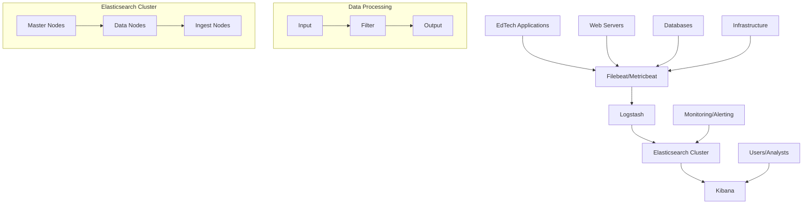

# ELK Stack Implementation Guide

## 📖 Overview

The ELK Stack (Elasticsearch, Logstash, Kibana) + Beats is a powerful open-source platform for searching, analyzing, and visualizing log data in real-time. This guide provides comprehensive implementation instructions specifically tailored for EdTech platforms targeting international markets.

## 🏗️ Architecture Overview



## 🚀 Quick Start Deployment Options

### Option 1: Docker Compose (Development)

#### Complete Docker Setup

```yaml
# docker-compose.yml
version: '3.8'

services:
  # Elasticsearch cluster
  es01:
    image: docker.elastic.co/elasticsearch/elasticsearch:8.11.0
    container_name: es01
    environment:
      - node.name=es01
      - cluster.name=edtech-cluster
      - cluster.initial_master_nodes=es01,es02,es03
      - discovery.seed_hosts=es02,es03
      - bootstrap.memory_lock=true
      - "ES_JAVA_OPTS=-Xms1g -Xmx1g"
      - xpack.security.enabled=true
      - xpack.security.transport.ssl.enabled=true
      - xpack.security.transport.ssl.verification_mode=certificate
      - xpack.security.transport.ssl.client_authentication=required
      - xpack.security.transport.ssl.keystore.path=elastic-certificates.p12
      - xpack.security.transport.ssl.truststore.path=elastic-certificates.p12
      - xpack.security.http.ssl.enabled=true
      - xpack.security.http.ssl.keystore.path=elastic-certificates.p12
      - xpack.license.self_generated.type=basic
    ulimits:
      memlock:
        soft: -1
        hard: -1
    volumes:
      - es01-data:/usr/share/elasticsearch/data
      - ./certs:/usr/share/elasticsearch/config/certs:ro
    ports:
      - "9200:9200"
    networks:
      - elastic
    healthcheck:
      test: ["CMD-SHELL", "curl -s --cacert config/certs/ca/ca.crt https://localhost:9200 >/dev/null || exit 1"]
      interval: 30s
      timeout: 10s
      retries: 5

  es02:
    depends_on:
      - es01
    image: docker.elastic.co/elasticsearch/elasticsearch:8.11.0
    container_name: es02
    environment:
      - node.name=es02
      - cluster.name=edtech-cluster
      - cluster.initial_master_nodes=es01,es02,es03
      - discovery.seed_hosts=es01,es03
      - bootstrap.memory_lock=true
      - "ES_JAVA_OPTS=-Xms1g -Xmx1g"
      - xpack.security.enabled=true
      - xpack.security.transport.ssl.enabled=true
      - xpack.security.transport.ssl.verification_mode=certificate
      - xpack.security.transport.ssl.client_authentication=required
      - xpack.security.transport.ssl.keystore.path=elastic-certificates.p12
      - xpack.security.transport.ssl.truststore.path=elastic-certificates.p12
      - xpack.security.http.ssl.enabled=true
      - xpack.security.http.ssl.keystore.path=elastic-certificates.p12
      - xpack.license.self_generated.type=basic
    ulimits:
      memlock:
        soft: -1
        hard: -1
    volumes:
      - es02-data:/usr/share/elasticsearch/data
      - ./certs:/usr/share/elasticsearch/config/certs:ro
    networks:
      - elastic

  es03:
    depends_on:
      - es01
    image: docker.elastic.co/elasticsearch/elasticsearch:8.11.0
    container_name: es03
    environment:
      - node.name=es03
      - cluster.name=edtech-cluster
      - cluster.initial_master_nodes=es01,es02,es03
      - discovery.seed_hosts=es01,es02
      - bootstrap.memory_lock=true
      - "ES_JAVA_OPTS=-Xms1g -Xmx1g"
      - xpack.security.enabled=true
      - xpack.security.transport.ssl.enabled=true
      - xpack.security.transport.ssl.verification_mode=certificate
      - xpack.security.transport.ssl.client_authentication=required
      - xpack.security.transport.ssl.keystore.path=elastic-certificates.p12
      - xpack.security.transport.ssl.truststore.path=elastic-certificates.p12
      - xpack.security.http.ssl.enabled=true
      - xpack.security.http.ssl.keystore.path=elastic-certificates.p12
      - xpack.license.self_generated.type=basic
    ulimits:
      memlock:
        soft: -1
        hard: -1
    volumes:
      - es03-data:/usr/share/elasticsearch/data
      - ./certs:/usr/share/elasticsearch/config/certs:ro
    networks:
      - elastic

  # Logstash
  logstash:
    depends_on:
      - es01
    image: docker.elastic.co/logstash/logstash:8.11.0
    container_name: logstash
    environment:
      - "LS_JAVA_OPTS=-Xms512m -Xmx512m"
      - ELASTICSEARCH_HOSTS=https://es01:9200
      - ELASTICSEARCH_USERNAME=logstash_internal
      - ELASTICSEARCH_PASSWORD=changeme
    volumes:
      - ./logstash/config:/usr/share/logstash/config:ro
      - ./logstash/pipeline:/usr/share/logstash/pipeline:ro
      - ./certs:/usr/share/logstash/config/certs:ro
    ports:
      - "5044:5044"
      - "5000:5000/tcp"
      - "5000:5000/udp"
      - "9600:9600"
    networks:
      - elastic
    command: logstash -f /usr/share/logstash/pipeline/logstash.conf

  # Kibana
  kibana:
    depends_on:
      - es01
    image: docker.elastic.co/kibana/kibana:8.11.0
    container_name: kibana
    environment:
      - SERVERNAME=kibana
      - ELASTICSEARCH_HOSTS=https://es01:9200
      - ELASTICSEARCH_USERNAME=kibana_system
      - ELASTICSEARCH_PASSWORD=changeme
      - ELASTICSEARCH_SSL_CERTIFICATEAUTHORITIES=config/certs/ca/ca.crt
      - SERVER_SSL_ENABLED=true
      - SERVER_SSL_CERTIFICATE=config/certs/kibana/kibana.crt
      - SERVER_SSL_KEY=config/certs/kibana/kibana.key
    volumes:
      - ./certs:/usr/share/kibana/config/certs:ro
    ports:
      - "5601:5601"
    networks:
      - elastic
    healthcheck:
      test: ["CMD-SHELL", "curl -s -I --cacert config/certs/ca/ca.crt https://localhost:5601 >/dev/null || exit 1"]
      interval: 30s
      timeout: 10s
      retries: 5

  # Filebeat
  filebeat:
    depends_on:
      - es01
      - logstash
    image: docker.elastic.co/beats/filebeat:8.11.0
    container_name: filebeat
    user: root
    environment:
      - ELASTICSEARCH_HOSTS=https://es01:9200
      - ELASTICSEARCH_USERNAME=beats_system
      - ELASTICSEARCH_PASSWORD=changeme
      - KIBANA_HOST=https://kibana:5601
    volumes:
      - ./filebeat/filebeat.yml:/usr/share/filebeat/filebeat.yml:ro
      - ./certs:/usr/share/filebeat/config/certs:ro
      - /var/lib/docker/containers:/var/lib/docker/containers:ro
      - /var/run/docker.sock:/var/run/docker.sock:ro
      - /var/log:/var/log:ro
    networks:
      - elastic
    command: filebeat -e -strict.perms=false

volumes:
  es01-data:
  es02-data:
  es03-data:

networks:
  elastic:
    driver: bridge
```

#### Security Setup Script

```bash
#!/bin/bash
# setup-certificates.sh

# Create certificate authority
docker run --rm -v $(pwd)/certs:/certs \
  docker.elastic.co/elasticsearch/elasticsearch:8.11.0 \
  bin/elasticsearch-certutil ca --out /certs/ca.zip --pass ""

# Extract CA
cd certs && unzip ca.zip && cd ..

# Create certificates for nodes
docker run --rm -v $(pwd)/certs:/certs \
  docker.elastic.co/elasticsearch/elasticsearch:8.11.0 \
  bin/elasticsearch-certutil cert --ca-cert /certs/ca/ca.crt --ca-key /certs/ca/ca.key \
  --out /certs/elastic-certificates.p12 --pass ""

# Set permissions
chmod 644 certs/elastic-certificates.p12
chmod 644 certs/ca/ca.crt

# Setup passwords
docker-compose exec es01 bin/elasticsearch-setup-passwords auto --batch --url https://localhost:9200
```

#### Logstash Configuration

```ruby
# logstash/pipeline/logstash.conf
input {
  beats {
    port => 5044
    ssl => true
    ssl_certificate_authorities => ["/usr/share/logstash/config/certs/ca/ca.crt"]
    ssl_certificate => "/usr/share/logstash/config/certs/logstash/logstash.crt"
    ssl_key => "/usr/share/logstash/config/certs/logstash/logstash.key"
  }
  
  http {
    port => 5000
    ssl => true
    ssl_certificate => "/usr/share/logstash/config/certs/logstash/logstash.crt"
    ssl_key => "/usr/share/logstash/config/certs/logstash/logstash.key"
  }
}

filter {
  # Parse EdTech API logs
  if [fields][service] == "edtech-api" {
    grok {
      match => { 
        "message" => "%{TIMESTAMP_ISO8601:timestamp} \[%{DATA:thread}\] %{LOGLEVEL:level} %{DATA:logger} - %{GREEDYDATA:log_message}" 
      }
    }
    
    date {
      match => [ "timestamp", "ISO8601" ]
      target => "@timestamp"
    }
    
    # Extract request ID from message
    grok {
      match => { 
        "log_message" => ".*request_id=(?<request_id>[a-zA-Z0-9-]+).*" 
      }
      tag_on_failure => ["_no_request_id"]
    }
    
    # Extract user ID
    grok {
      match => { 
        "log_message" => ".*user_id=(?<user_id>[0-9]+).*" 
      }
      tag_on_failure => ["_no_user_id"]
    }
    
    # Add performance metrics
    if [log_message] =~ /response_time/ {
      grok {
        match => { 
          "log_message" => ".*response_time=(?<response_time>[0-9.]+).*" 
        }
      }
      mutate {
        convert => { "response_time" => "float" }
      }
    }
    
    # Tag errors for alerting
    if [level] == "ERROR" {
      mutate {
        add_tag => [ "error", "alert_required" ]
      }
    }
    
    # Tag slow requests
    if [response_time] and [response_time] > 2.0 {
      mutate {
        add_tag => [ "slow_request", "performance_issue" ]
      }
    }
  }
  
  # Parse student activity logs
  if [fields][service] == "student-activity" {
    json {
      source => "message"
      target => "activity"
    }
    
    # Validate required fields
    if ![activity][student_id] or ![activity][activity_type] {
      mutate {
        add_tag => [ "invalid_activity_log" ]
      }
    } else {
      mutate {
        add_field => { "event_type" => "student_activity" }
        add_field => { "student_id" => "%{[activity][student_id]}" }
        add_field => { "activity_type" => "%{[activity][activity_type]}" }
      }
      
      # Calculate session duration for completed activities
      if [activity][status] == "completed" and [activity][start_time] and [activity][end_time] {
        ruby {
          code => "
            start_time = Time.parse(event.get('[activity][start_time]'))
            end_time = Time.parse(event.get('[activity][end_time]'))
            duration = end_time - start_time
            event.set('session_duration_seconds', duration.to_i)
          "
        }
      }
    }
  }
  
  # Parse payment logs
  if [fields][service] == "payment-service" {
    json {
      source => "message"
      target => "payment"
    }
    
    # Mask sensitive payment information
    mutate {
      gsub => [
        "[payment][card_number]", "[0-9]", "X",
        "[payment][cvv]", "[0-9]", "X"
      ]
    }
    
    # Tag failed payments
    if [payment][status] == "failed" {
      mutate {
        add_tag => [ "payment_failed", "business_critical" ]
      }
    }
  }
  
  # Add geolocation for IP addresses
  if [client_ip] {
    geoip {
      source => "client_ip"
      target => "geoip"
    }
  }
  
  # Clean up temporary fields
  mutate {
    remove_field => [ "message", "host", "agent" ]
  }
}

output {
  # Route to different indices based on service
  if [fields][service] == "edtech-api" {
    elasticsearch {
      hosts => ["https://es01:9200"]
      ssl => true
      cacert => "/usr/share/logstash/config/certs/ca/ca.crt"
      user => "logstash_internal"
      password => "${ELASTICSEARCH_PASSWORD}"
      index => "edtech-api-%{+YYYY.MM.dd}"
      template_name => "edtech-api"
      template_pattern => "edtech-api-*"
      template => "/usr/share/logstash/config/templates/edtech-api-template.json"
    }
  } else if [fields][service] == "student-activity" {
    elasticsearch {
      hosts => ["https://es01:9200"]
      ssl => true
      cacert => "/usr/share/logstash/config/certs/ca/ca.crt"
      user => "logstash_internal"
      password => "${ELASTICSEARCH_PASSWORD}"
      index => "student-activity-%{+YYYY.MM.dd}"
      template_name => "student-activity"
      template_pattern => "student-activity-*"
      template => "/usr/share/logstash/config/templates/student-activity-template.json"
    }
  } else {
    elasticsearch {
      hosts => ["https://es01:9200"]
      ssl => true
      cacert => "/usr/share/logstash/config/certs/ca/ca.crt"
      user => "logstash_internal"
      password => "${ELASTICSEARCH_PASSWORD}"
      index => "general-logs-%{+YYYY.MM.dd}"
    }
  }
  
  # Debug output (disable in production)
  # stdout { 
  #   codec => rubydebug 
  # }
}
```

#### Filebeat Configuration

```yaml
# filebeat/filebeat.yml
filebeat.inputs:
- type: log
  enabled: true
  paths:
    - /var/log/edtech/api/*.log
  fields:
    service: edtech-api
    environment: production
  fields_under_root: false
  multiline.pattern: '^\d{4}-\d{2}-\d{2}'
  multiline.negate: true
  multiline.match: after

- type: log
  enabled: true
  paths:
    - /var/log/edtech/student-activity/*.log
  fields:
    service: student-activity
    environment: production
  fields_under_root: false

- type: docker
  containers.ids:
    - "*"
  processors:
  - add_docker_metadata: ~

output.logstash:
  hosts: ["logstash:5044"]
  ssl.enabled: true
  ssl.certificate_authorities: ["/usr/share/filebeat/config/certs/ca/ca.crt"]
  ssl.certificate: "/usr/share/filebeat/config/certs/filebeat/filebeat.crt"
  ssl.key: "/usr/share/filebeat/config/certs/filebeat/filebeat.key"

processors:
- add_host_metadata:
    when.not.contains.tags: forwarded
- add_docker_metadata: ~
- add_kubernetes_metadata: ~

logging.level: info
logging.to_files: true
logging.files:
  path: /var/log/filebeat
  name: filebeat
  keepfiles: 7
  permissions: 0644

setup.kibana:
  host: "https://kibana:5601"
  ssl.enabled: true
  ssl.certificate_authorities: ["/usr/share/filebeat/config/certs/ca/ca.crt"]

setup.dashboards.enabled: true
setup.template.enabled: true
setup.template.settings:
  index.number_of_shards: 1
  index.number_of_replicas: 1
```

### Option 2: Kubernetes Deployment

#### ElasticSearch StatefulSet

```yaml
# elasticsearch-statefulset.yaml
apiVersion: apps/v1
kind: StatefulSet
metadata:
  name: elasticsearch
  namespace: logging
spec:
  serviceName: elasticsearch
  replicas: 3
  selector:
    matchLabels:
      app: elasticsearch
  template:
    metadata:
      labels:
        app: elasticsearch
    spec:
      securityContext:
        fsGroup: 1000
      initContainers:
      - name: configure-sysctl
        image: docker.elastic.co/elasticsearch/elasticsearch:8.11.0
        command: ["sh", "-c", "sysctl -w vm.max_map_count=262144"]
        securityContext:
          privileged: true
      containers:
      - name: elasticsearch
        image: docker.elastic.co/elasticsearch/elasticsearch:8.11.0
        resources:
          limits:
            memory: 4Gi
            cpu: 2
          requests:
            memory: 2Gi
            cpu: 1
        ports:
        - containerPort: 9200
          name: rest
        - containerPort: 9300
          name: inter-node
        volumeMounts:
        - name: data
          mountPath: /usr/share/elasticsearch/data
        - name: config
          mountPath: /usr/share/elasticsearch/config/elasticsearch.yml
          subPath: elasticsearch.yml
        env:
        - name: cluster.name
          value: edtech-k8s-cluster
        - name: node.name
          valueFrom:
            fieldRef:
              fieldPath: metadata.name
        - name: discovery.seed_hosts
          value: "elasticsearch-0.elasticsearch,elasticsearch-1.elasticsearch,elasticsearch-2.elasticsearch"
        - name: cluster.initial_master_nodes
          value: "elasticsearch-0,elasticsearch-1,elasticsearch-2"
        - name: ES_JAVA_OPTS
          value: "-Xms2g -Xmx2g"
        - name: xpack.security.enabled
          value: "true"
        - name: xpack.security.transport.ssl.enabled
          value: "true"
        - name: xpack.security.http.ssl.enabled
          value: "true"
      volumes:
      - name: config
        configMap:
          name: elasticsearch-config
  volumeClaimTemplates:
  - metadata:
      name: data
    spec:
      accessModes: [ "ReadWriteOnce" ]
      storageClassName: ssd
      resources:
        requests:
          storage: 100Gi
```

#### Elasticsearch Configuration

```yaml
# elasticsearch-config.yaml
apiVersion: v1
kind: ConfigMap
metadata:
  name: elasticsearch-config
  namespace: logging
data:
  elasticsearch.yml: |
    cluster.name: edtech-k8s-cluster
    network.host: 0.0.0.0
    
    # Memory
    bootstrap.memory_lock: true
    
    # Security
    xpack.security.enabled: true
    xpack.security.transport.ssl.enabled: true
    xpack.security.http.ssl.enabled: true
    
    # Monitoring
    xpack.monitoring.collection.enabled: true
    
    # Index settings
    index.number_of_shards: 1
    index.number_of_replicas: 1
    
    # Performance tuning
    indices.memory.index_buffer_size: 30%
    indices.queries.cache.size: 20%
    indices.fielddata.cache.size: 30%
```

#### Kibana Deployment

```yaml
# kibana-deployment.yaml
apiVersion: apps/v1
kind: Deployment
metadata:
  name: kibana
  namespace: logging
spec:
  replicas: 2
  selector:
    matchLabels:
      app: kibana
  template:
    metadata:
      labels:
        app: kibana
    spec:
      containers:
      - name: kibana
        image: docker.elastic.co/kibana/kibana:8.11.0
        resources:
          limits:
            memory: 2Gi
            cpu: 1
          requests:
            memory: 1Gi
            cpu: 500m
        env:
        - name: ELASTICSEARCH_HOSTS
          value: "https://elasticsearch:9200"
        - name: SERVER_NAME
          value: kibana
        - name: SERVER_BASEPATH
          value: /kibana
        - name: ELASTICSEARCH_USERNAME
          value: kibana_system
        - name: ELASTICSEARCH_PASSWORD
          valueFrom:
            secretKeyRef:
              name: elasticsearch-credentials
              key: kibana-password
        ports:
        - containerPort: 5601
        volumeMounts:
        - name: config
          mountPath: /usr/share/kibana/config/kibana.yml
          subPath: kibana.yml
      volumes:
      - name: config
        configMap:
          name: kibana-config
```

### Option 3: AWS OpenSearch Service

#### Terraform Configuration

```hcl
# opensearch.tf
resource "aws_opensearch_domain" "edtech_logs" {
  domain_name    = "edtech-logs-${var.environment}"
  engine_version = "OpenSearch_2.3"

  cluster_config {
    instance_type            = var.opensearch_instance_type
    instance_count           = var.opensearch_instance_count
    dedicated_master_enabled = var.opensearch_instance_count >= 3
    master_instance_type     = var.opensearch_master_instance_type
    master_instance_count    = 3
    zone_awareness_enabled   = true

    zone_awareness_config {
      availability_zone_count = 3
    }
  }

  ebs_options {
    ebs_enabled = true
    volume_type = "gp3"
    volume_size = var.opensearch_volume_size
    iops        = var.opensearch_iops
    throughput  = var.opensearch_throughput
  }

  vpc_options {
    subnet_ids         = var.private_subnet_ids
    security_group_ids = [aws_security_group.opensearch.id]
  }

  domain_endpoint_options {
    enforce_https       = true
    tls_security_policy = "Policy-Min-TLS-1-2-2019-07"
  }

  encrypt_at_rest {
    enabled = true
  }

  node_to_node_encryption {
    enabled = true
  }

  advanced_security_options {
    enabled                        = true
    anonymous_auth_enabled         = false
    internal_user_database_enabled = false
    
    saml_options {
      enabled = true
      idp {
        metadata_content = file("${path.module}/saml_metadata.xml")
        entity_id        = var.saml_entity_id
      }
      master_user_name     = var.saml_master_username
      master_backend_role  = var.saml_master_backend_role
    }
  }

  log_publishing_options {
    enabled                  = true
    log_type                = "INDEX_SLOW_LOGS"
    cloudwatch_log_group_arn = aws_cloudwatch_log_group.opensearch_index_slow_logs.arn
  }

  log_publishing_options {
    enabled                  = true
    log_type                = "SEARCH_SLOW_LOGS"
    cloudwatch_log_group_arn = aws_cloudwatch_log_group.opensearch_search_slow_logs.arn
  }

  log_publishing_options {
    enabled                  = true
    log_type                = "ES_APPLICATION_LOGS"
    cloudwatch_log_group_arn = aws_cloudwatch_log_group.opensearch_application_logs.arn
  }

  tags = merge(var.common_tags, {
    Name        = "edtech-opensearch-${var.environment}"
    Environment = var.environment
    Service     = "logging"
  })
}

# Security Group
resource "aws_security_group" "opensearch" {
  name_prefix = "opensearch-${var.environment}-"
  vpc_id      = var.vpc_id

  ingress {
    description = "HTTPS from VPC"
    from_port   = 443
    to_port     = 443
    protocol    = "tcp"
    cidr_blocks = [var.vpc_cidr]
  }

  egress {
    from_port   = 0
    to_port     = 0
    protocol    = "-1"
    cidr_blocks = ["0.0.0.0/0"]
  }

  tags = merge(var.common_tags, {
    Name = "opensearch-sg-${var.environment}"
  })
}

# CloudWatch Log Groups
resource "aws_cloudwatch_log_group" "opensearch_index_slow_logs" {
  name              = "/aws/opensearch/domains/${aws_opensearch_domain.edtech_logs.domain_name}/index-slow-logs"
  retention_in_days = 14
}

resource "aws_cloudwatch_log_group" "opensearch_search_slow_logs" {
  name              = "/aws/opensearch/domains/${aws_opensearch_domain.edtech_logs.domain_name}/search-slow-logs"
  retention_in_days = 14
}

resource "aws_cloudwatch_log_group" "opensearch_application_logs" {
  name              = "/aws/opensearch/domains/${aws_opensearch_domain.edtech_logs.domain_name}/application-logs"
  retention_in_days = 30
}

# Index Templates
resource "aws_opensearch_domain_policy" "edtech_logs_policy" {
  domain_name = aws_opensearch_domain.edtech_logs.domain_name

  access_policies = jsonencode({
    Version = "2012-10-17"
    Statement = [
      {
        Effect = "Allow"
        Principal = {
          AWS = [
            "arn:aws:iam::${data.aws_caller_identity.current.account_id}:role/edtech-logstash-role",
            "arn:aws:iam::${data.aws_caller_identity.current.account_id}:role/edtech-application-role"
          ]
        }
        Action   = "es:*"
        Resource = "${aws_opensearch_domain.edtech_logs.arn}/*"
      }
    ]
  })
}

# Outputs
output "opensearch_endpoint" {
  description = "OpenSearch domain endpoint"
  value       = aws_opensearch_domain.edtech_logs.endpoint
}

output "opensearch_kibana_endpoint" {
  description = "OpenSearch Kibana endpoint"
  value       = aws_opensearch_domain.edtech_logs.kibana_endpoint
}

output "opensearch_domain_arn" {
  description = "OpenSearch domain ARN"
  value       = aws_opensearch_domain.edtech_logs.arn
}
```

## 🔧 Application Integration

### Node.js Integration

```javascript
// logger.js - Winston + Elasticsearch integration
const winston = require('winston');
const { ElasticsearchTransport } = require('winston-elasticsearch');

class EdTechLogger {
  constructor(options = {}) {
    this.environment = options.environment || process.env.NODE_ENV || 'development';
    this.service = options.service || 'unknown-service';
    this.version = options.version || '1.0.0';
    
    this.esTransport = new ElasticsearchTransport({
      level: 'info',
      clientOpts: {
        node: process.env.ELASTICSEARCH_URL || 'https://localhost:9200',
        auth: {
          username: process.env.ELASTICSEARCH_USERNAME || 'elastic',
          password: process.env.ELASTICSEARCH_PASSWORD || 'changeme'
        },
        ssl: {
          ca: process.env.ELASTICSEARCH_CA_CERT,
          rejectUnauthorized: process.env.NODE_ENV === 'production'
        }
      },
      index: `edtech-${this.service}`,
      indexPrefix: `edtech-${this.service}`,
      indexSuffixPattern: 'YYYY.MM.DD',
      messageType: '_doc',
      ensureMappingTemplate: true,
      mappingTemplate: this.getMappingTemplate(),
      flushInterval: 2000
    });

    this.logger = winston.createLogger({
      level: 'info',
      format: winston.format.combine(
        winston.format.timestamp(),
        winston.format.errors({ stack: true }),
        winston.format.json(),
        winston.format.metadata({ fillExcept: ['message', 'level', 'timestamp'] })
      ),
      defaultMeta: {
        service: this.service,
        environment: this.environment,
        version: this.version
      },
      transports: [
        new winston.transports.Console({
          format: winston.format.combine(
            winston.format.colorize(),
            winston.format.simple()
          )
        }),
        this.esTransport
      ]
    });
  }

  getMappingTemplate() {
    return {
      index_patterns: [`edtech-${this.service}-*`],
      template: {
        settings: {
          number_of_shards: 1,
          number_of_replicas: 1,
          'index.lifecycle.name': 'edtech-policy'
        },
        mappings: {
          properties: {
            '@timestamp': { type: 'date' },
            level: { type: 'keyword' },
            message: { type: 'text' },
            service: { type: 'keyword' },
            environment: { type: 'keyword' },
            version: { type: 'keyword' },
            user_id: { type: 'keyword' },
            session_id: { type: 'keyword' },
            request_id: { type: 'keyword' },
            ip_address: { type: 'ip' },
            user_agent: { type: 'text', analyzer: 'keyword' },
            response_time: { type: 'float' },
            status_code: { type: 'short' },
            method: { type: 'keyword' },
            url: { type: 'keyword' },
            error: {
              type: 'object',
              properties: {
                name: { type: 'keyword' },
                message: { type: 'text' },
                stack: { type: 'text' }
              }
            }
          }
        }
      }
    };
  }

  // Convenience methods
  info(message, meta = {}) {
    this.logger.info(message, meta);
  }

  error(message, error = null, meta = {}) {
    const logData = { ...meta };
    if (error) {
      logData.error = {
        name: error.name,
        message: error.message,
        stack: error.stack
      };
    }
    this.logger.error(message, logData);
  }

  warn(message, meta = {}) {
    this.logger.warn(message, meta);
  }

  debug(message, meta = {}) {
    this.logger.debug(message, meta);
  }

  // API request logging
  logApiRequest(req, res, responseTime) {
    this.info('API Request', {
      method: req.method,
      url: req.originalUrl,
      status_code: res.statusCode,
      response_time: responseTime,
      user_id: req.user?.id,
      session_id: req.sessionID,
      request_id: req.id,
      ip_address: req.ip,
      user_agent: req.get('User-Agent'),
      content_length: res.get('Content-Length')
    });
  }

  // Student activity logging
  logStudentActivity(activity) {
    this.info('Student Activity', {
      event_type: 'student_activity',
      student_id: activity.student_id,
      activity_type: activity.type,
      subject: activity.subject,
      duration: activity.duration,
      score: activity.score,
      completed: activity.completed,
      difficulty: activity.difficulty
    });
  }

  // Payment logging
  logPaymentEvent(payment) {
    this.info('Payment Event', {
      event_type: 'payment',
      user_id: payment.user_id,
      amount: payment.amount,
      currency: payment.currency,
      status: payment.status,
      payment_method: payment.method,
      transaction_id: payment.transaction_id,
      // Sensitive data should be masked
      masked_card: payment.card_number?.replace(/\d(?=\d{4})/g, '*')
    });
  }
}

// Express.js middleware
function createLoggingMiddleware(logger) {
  return (req, res, next) => {
    const startTime = Date.now();
    
    // Generate request ID
    req.id = require('crypto').randomUUID();
    
    // Log request start
    logger.debug('Request Started', {
      method: req.method,
      url: req.originalUrl,
      request_id: req.id,
      ip_address: req.ip
    });

    // Override res.end to capture response
    const originalEnd = res.end;
    res.end = function(...args) {
      const responseTime = Date.now() - startTime;
      logger.logApiRequest(req, res, responseTime);
      originalEnd.apply(this, args);
    };

    next();
  };
}

module.exports = { EdTechLogger, createLoggingMiddleware };
```

### Express.js Application Example

```javascript
// app.js
const express = require('express');
const { EdTechLogger, createLoggingMiddleware } = require('./logger');

const app = express();
const logger = new EdTechLogger({
  service: 'edtech-api',
  version: process.env.npm_package_version
});

// Middleware
app.use(express.json());
app.use(createLoggingMiddleware(logger));

// Routes
app.post('/api/auth/login', async (req, res) => {
  try {
    const { email, password } = req.body;
    
    logger.info('Login attempt', {
      email,
      ip_address: req.ip,
      user_agent: req.get('User-Agent')
    });

    // Authentication logic here
    const user = await authenticateUser(email, password);
    
    if (user) {
      logger.info('Login successful', {
        user_id: user.id,
        email: user.email
      });
      
      res.json({ success: true, user: { id: user.id, email: user.email } });
    } else {
      logger.warn('Login failed', {
        email,
        reason: 'invalid_credentials'
      });
      
      res.status(401).json({ error: 'Invalid credentials' });
    }
  } catch (error) {
    logger.error('Login error', error, {
      email: req.body.email
    });
    
    res.status(500).json({ error: 'Internal server error' });
  }
});

app.post('/api/student/activity', async (req, res) => {
  try {
    const activity = req.body;
    activity.student_id = req.user.id;
    
    // Save activity
    const savedActivity = await saveStudentActivity(activity);
    
    // Log activity
    logger.logStudentActivity(savedActivity);
    
    res.json({ success: true, activity: savedActivity });
  } catch (error) {
    logger.error('Failed to save student activity', error, {
      user_id: req.user.id,
      activity_type: req.body.type
    });
    
    res.status(500).json({ error: 'Failed to save activity' });
  }
});

// Error handling middleware
app.use((error, req, res, next) => {
  logger.error('Unhandled error', error, {
    method: req.method,
    url: req.originalUrl,
    user_id: req.user?.id,
    request_id: req.id
  });
  
  res.status(500).json({ error: 'Internal server error' });
});

const PORT = process.env.PORT || 3000;
app.listen(PORT, () => {
  logger.info('Server started', {
    port: PORT,
    environment: process.env.NODE_ENV
  });
});
```

## 📊 Kibana Dashboard Configuration

### Index Patterns and Field Mappings

```bash
# Create index patterns via API
curl -X POST "https://kibana:5601/api/saved_objects/index-pattern" \
  -H "Content-Type: application/json" \
  -H "kbn-xsrf: true" \
  -u "elastic:changeme" \
  -d '{
    "attributes": {
      "title": "edtech-api-*",
      "timeFieldName": "@timestamp"
    }
  }'

curl -X POST "https://kibana:5601/api/saved_objects/index-pattern" \
  -H "Content-Type: application/json" \
  -H "kbn-xsrf: true" \
  -u "elastic:changeme" \
  -d '{
    "attributes": {
      "title": "student-activity-*",
      "timeFieldName": "@timestamp"
    }
  }'
```

### Dashboard Configuration

```json
{
  "dashboard": {
    "title": "EdTech Platform Overview",
    "panels": [
      {
        "title": "API Response Times",
        "type": "line",
        "query": {
          "query": "service:edtech-api AND response_time:*",
          "filters": []
        },
        "aggs": {
          "date_histogram": {
            "field": "@timestamp",
            "interval": "1m"
          },
          "avg_response_time": {
            "field": "response_time"
          }
        }
      },
      {
        "title": "Error Rate by Service",
        "type": "bar",
        "query": {
          "query": "level:ERROR",
          "filters": []
        },
        "aggs": {
          "terms": {
            "field": "service.keyword",
            "size": 10
          }
        }
      },
      {
        "title": "Student Activity Heatmap",
        "type": "heatmap",
        "query": {
          "query": "event_type:student_activity",
          "filters": []
        },
        "aggs": {
          "date_histogram": {
            "field": "@timestamp",
            "interval": "1h"
          },
          "terms": {
            "field": "activity_type.keyword"
          }
        }
      },
      {
        "title": "Geographic Distribution",
        "type": "map",
        "query": {
          "query": "*",
          "filters": []
        },
        "aggs": {
          "geohash_grid": {
            "field": "geoip.location",
            "precision": 5
          }
        }
      }
    ]
  }
}
```

## 🔗 Navigation

**← Previous**: [Best Practices](./best-practices.md)  
**→ Next**: [Splunk Implementation](./splunk-implementation.md)

---

*ELK Stack Guide | Log Management & Analysis Research | January 2025*