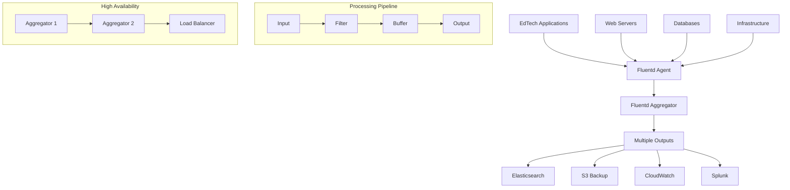

# Fluentd Configuration Guide

## 📖 Overview

Fluentd is an open-source data collector designed for unified logging layer. It allows you to unify data collection and consumption for better use and understanding of data. This guide provides comprehensive configuration instructions for EdTech platforms, focusing on efficient log collection, transformation, and routing.

## 🏗️ Architecture Overview



## 🚀 Installation Options

### Option 1: Native Installation

#### Ubuntu/Debian Installation

```bash
# Install Fluentd via td-agent (recommended)
curl -L https://toolbelt.treasuredata.com/sh/install-ubuntu-bionic-td-agent4.sh | sh

# Start and enable service
sudo systemctl start td-agent
sudo systemctl enable td-agent

# Install required plugins
sudo td-agent-gem install fluent-plugin-elasticsearch
sudo td-agent-gem install fluent-plugin-s3
sudo td-agent-gem install fluent-plugin-cloudwatch-logs
sudo td-agent-gem install fluent-plugin-splunk-enterprise
sudo td-agent-gem install fluent-plugin-prometheus
sudo td-agent-gem install fluent-plugin-mongo
sudo td-agent-gem install fluent-plugin-redis
sudo td-agent-gem install fluent-plugin-kubernetes_metadata_filter
```

#### CentOS/RHEL Installation

```bash
# Install td-agent
curl -L https://toolbelt.treasuredata.com/sh/install-redhat-td-agent4.sh | sh

# Configure and start
sudo systemctl start td-agent
sudo systemctl enable td-agent

# Install plugins (same as Ubuntu)
sudo td-agent-gem install fluent-plugin-elasticsearch
sudo td-agent-gem install fluent-plugin-s3
sudo td-agent-gem install fluent-plugin-cloudwatch-logs
```

### Option 2: Docker Deployment

#### Basic Docker Setup

```yaml
# docker-compose.yml
version: '3.8'

services:
  fluentd:
    build: ./fluentd
    container_name: fluentd
    ports:
      - "24224:24224"    # Forward input
      - "24224:24224/udp" # Forward input UDP
      - "9880:9880"      # HTTP input
    volumes:
      - ./fluentd/conf:/fluentd/etc:ro
      - ./logs:/var/log:ro
      - fluentd-buffer:/var/log/td-agent/buffer
    environment:
      - FLUENTD_CONF=fluent.conf
      - ELASTICSEARCH_HOST=elasticsearch
      - ELASTICSEARCH_PORT=9200
      - AWS_REGION=us-east-1
    networks:
      - logging
    restart: unless-stopped
    depends_on:
      - elasticsearch

  elasticsearch:
    image: docker.elastic.co/elasticsearch/elasticsearch:8.11.0
    container_name: elasticsearch
    environment:
      - discovery.type=single-node
      - "ES_JAVA_OPTS=-Xms1g -Xmx1g"
      - xpack.security.enabled=false
    ports:
      - "9200:9200"
    volumes:
      - es-data:/usr/share/elasticsearch/data
    networks:
      - logging

volumes:
  fluentd-buffer:
  es-data:

networks:
  logging:
    driver: bridge
```

#### Custom Fluentd Docker Image

```dockerfile
# fluentd/Dockerfile
FROM fluent/fluentd:v1.16-debian-1

# Use root account to install plugins
USER root

# Install plugins
RUN fluent-gem install fluent-plugin-elasticsearch \
    fluent-plugin-s3 \
    fluent-plugin-cloudwatch-logs \
    fluent-plugin-splunk-enterprise \
    fluent-plugin-prometheus \
    fluent-plugin-mongo \
    fluent-plugin-redis \
    fluent-plugin-kubernetes_metadata_filter \
    fluent-plugin-geoip \
    fluent-plugin-parser-cri

# Copy configuration files
COPY conf/ /fluentd/etc/

# Switch back to fluent user
USER fluent
```

### Option 3: Kubernetes Deployment

#### Fluentd DaemonSet

```yaml
# fluentd-daemonset.yaml
apiVersion: apps/v1
kind: DaemonSet
metadata:
  name: fluentd
  namespace: logging
  labels:
    app: fluentd
spec:
  selector:
    matchLabels:
      app: fluentd
  template:
    metadata:
      labels:
        app: fluentd
    spec:
      serviceAccount: fluentd
      serviceAccountName: fluentd
      tolerations:
      - key: node-role.kubernetes.io/master
        effect: NoSchedule
      containers:
      - name: fluentd
        image: fluent/fluentd-kubernetes-daemonset:v1.16-debian-elasticsearch7-1
        env:
        - name: FLUENT_ELASTICSEARCH_HOST
          value: "elasticsearch.logging.svc.cluster.local"
        - name: FLUENT_ELASTICSEARCH_PORT
          value: "9200"
        - name: FLUENT_ELASTICSEARCH_SCHEME
          value: "http"
        - name: FLUENTD_SYSTEMD_CONF
          value: disable
        - name: FLUENT_CONTAINER_TAIL_EXCLUDE_PATH
          value: /var/log/containers/fluent*
        - name: FLUENT_CONTAINER_TAIL_PARSER_TYPE
          value: /^(?<time>.+) (?<stream>stdout|stderr) [^ ]* (?<log>.*)$/
        resources:
          limits:
            memory: 512Mi
            cpu: 500m
          requests:
            cpu: 100m
            memory: 200Mi
        volumeMounts:
        - name: varlog
          mountPath: /var/log
        - name: varlibdockercontainers
          mountPath: /var/lib/docker/containers
          readOnly: true
        - name: config-volume
          mountPath: /fluentd/etc
        - name: buffer-volume
          mountPath: /var/log/td-agent/buffer
      terminationGracePeriodSeconds: 30
      volumes:
      - name: varlog
        hostPath:
          path: /var/log
      - name: varlibdockercontainers
        hostPath:
          path: /var/lib/docker/containers
      - name: config-volume
        configMap:
          name: fluentd-config
      - name: buffer-volume
        hostPath:
          path: /var/log/td-agent/buffer
          type: DirectoryOrCreate
```

#### Fluentd Configuration ConfigMap

```yaml
# fluentd-configmap.yaml
apiVersion: v1
kind: ConfigMap
metadata:
  name: fluentd-config
  namespace: logging
data:
  fluent.conf: |
    @include kubernetes.conf
    @include edtech.conf
    @include output.conf
  
  kubernetes.conf: |
    <source>
      @type tail
      @id in_tail_container_logs
      path /var/log/containers/*.log
      pos_file /var/log/fluentd-containers.log.pos
      tag kubernetes.*
      read_from_head true
      <parse>
        @type json
        time_format %Y-%m-%dT%H:%M:%S.%NZ
      </parse>
    </source>

    <filter kubernetes.**>
      @type kubernetes_metadata
      @id filter_kube_metadata
    </filter>
  
  edtech.conf: |
    # EdTech API logs
    <source>
      @type http
      @id http_input
      port 9880
      bind 0.0.0.0
      body_size_limit 32m
      keepalive_timeout 10s
      add_http_headers true
      <parse>
        @type json
      </parse>
    </source>

    # File-based inputs
    <source>
      @type tail
      @id edtech_api_logs
      path /var/log/edtech/api/*.log
      pos_file /var/log/td-agent/edtech-api.log.pos
      tag edtech.api
      <parse>
        @type json
        time_key timestamp
        time_format %Y-%m-%dT%H:%M:%S.%NZ
      </parse>
    </source>

    <source>
      @type tail
      @id edtech_activity_logs
      path /var/log/edtech/activity/*.log
      pos_file /var/log/td-agent/edtech-activity.log.pos
      tag edtech.activity
      <parse>
        @type json
        time_key timestamp
        time_format %Y-%m-%dT%H:%M:%S.%NZ
      </parse>
    </source>

    # Filters for EdTech data
    <filter edtech.**>
      @type record_transformer
      <record>
        hostname ${hostname}
        environment ${ENV["ENVIRONMENT"] || "development"}
        datacenter ${ENV["DATACENTER"] || "us-east-1"}
        cluster_name ${ENV["CLUSTER_NAME"] || "default"}
      </record>
    </filter>

    # Parse and enrich API logs
    <filter edtech.api>
      @type parser
      key_name message
      reserve_data true
      <parse>
        @type grok
        grok_pattern %{TIMESTAMP_ISO8601:timestamp} \[%{DATA:thread}\] %{LOGLEVEL:level} %{DATA:logger} - %{GREEDYDATA:log_message}
      </parse>
    </filter>

    # Extract structured data from log messages
    <filter edtech.api>
      @type parser
      key_name log_message
      reserve_data true
      <parse>
        @type grok
        grok_pattern .*user_id=(?<user_id>[0-9]+).*
      </parse>
    </filter>

    <filter edtech.api>
      @type parser
      key_name log_message
      reserve_data true
      <parse>
        @type grok
        grok_pattern .*request_id=(?<request_id>[a-zA-Z0-9-]+).*
      </parse>
    </filter>

    <filter edtech.api>
      @type parser
      key_name log_message
      reserve_data true
      <parse>
        @type grok
        grok_pattern .*response_time=(?<response_time>[0-9.]+).*
      </parse>
    </filter>

    # GeoIP enrichment
    <filter edtech.**>
      @type geoip
      geoip_lookup_keys client_ip
      <record>
        geoip_country ${country_name["client_ip"]}
        geoip_city ${city_name["client_ip"]}
        geoip_region ${region_name["client_ip"]}
        geoip_lat ${latitude["client_ip"]}
        geoip_lon ${longitude["client_ip"]}
      </record>
    </filter>

    # Add tags for alerting
    <filter edtech.**>
      @type grep
      <regexp>
        key level
        pattern ERROR
      </regexp>
      add_tag_prefix error
    </filter>

    <filter edtech.**>
      @type numeric_monitor
      <monitor>
        key response_time
        greater_equal 2000
        tag slow_response
      </monitor>
    </filter>
  
  output.conf: |
    # Route to Elasticsearch
    <match edtech.api>
      @type elasticsearch
      @id out_es_edtech_api
      host "#{ENV['FLUENT_ELASTICSEARCH_HOST']}"
      port "#{ENV['FLUENT_ELASTICSEARCH_PORT']}"
      scheme "#{ENV['FLUENT_ELASTICSEARCH_SCHEME'] || 'http'}"
      ssl_verify "#{ENV['FLUENT_ELASTICSEARCH_SSL_VERIFY'] || 'false'}"
      index_name edtech-api
      type_name _doc
      include_timestamp true
      logstash_format true
      logstash_prefix edtech-api
      logstash_dateformat %Y.%m.%d
      
      <buffer>
        @type file
        path /var/log/td-agent/buffer/elasticsearch/edtech-api
        flush_mode interval
        retry_type exponential_backoff
        flush_thread_count 2
        flush_interval 5s
        retry_forever true
        retry_max_interval 30
        chunk_limit_size 2M
        queue_limit_length 8
        overflow_action block
      </buffer>
    </match>

    <match edtech.activity>
      @type elasticsearch
      @id out_es_edtech_activity
      host "#{ENV['FLUENT_ELASTICSEARCH_HOST']}"
      port "#{ENV['FLUENT_ELASTICSEARCH_PORT']}"
      scheme "#{ENV['FLUENT_ELASTICSEARCH_SCHEME'] || 'http'}"
      index_name edtech-activity
      type_name _doc
      include_timestamp true
      logstash_format true
      logstash_prefix edtech-activity
      logstash_dateformat %Y.%m.%d
      
      <buffer>
        @type file
        path /var/log/td-agent/buffer/elasticsearch/edtech-activity
        flush_mode interval
        flush_interval 5s
        chunk_limit_size 2M
        queue_limit_length 8
      </buffer>
    </match>

    # Backup to S3
    <match edtech.**>
      @type copy
      <store>
        @type s3
        @id out_s3_backup
        aws_key_id "#{ENV['AWS_ACCESS_KEY_ID']}"
        aws_sec_key "#{ENV['AWS_SECRET_ACCESS_KEY']}"
        s3_bucket edtech-logs-backup
        s3_region "#{ENV['AWS_REGION'] || 'us-east-1'}"
        path logs/
        s3_object_key_format %{path}%{time_slice}_%{index}.%{file_extension}
        time_slice_format %Y/%m/%d/%H
        buffer_path /var/log/td-agent/buffer/s3
        time_slice_wait 10m
        utc
        
        <buffer>
          @type file
          path /var/log/td-agent/buffer/s3
          timekey 3600
          timekey_wait 10m
          chunk_limit_size 256m
        </buffer>
      </store>
    </match>

    # Forward to Splunk (optional)
    <match error.edtech.**>
      @type splunk_hec
      @id out_splunk_errors
      host splunk.internal
      port 8088
      token "#{ENV['SPLUNK_HEC_TOKEN']}"
      index edtech_errors
      sourcetype fluentd
      use_ssl true
      ssl_verify false
      
      <buffer>
        @type memory
        flush_interval 5s
        chunk_limit_size 1m
      </buffer>
    </match>

    # CloudWatch Logs (for AWS environments)
    <match edtech.**>
      @type cloudwatch_logs
      @id out_cloudwatch
      region "#{ENV['AWS_REGION'] || 'us-east-1'}"
      log_group_name /fluentd/edtech
      log_stream_name_key hostname
      auto_create_stream true
      retention_in_days 14
      
      <buffer>
        @type file
        path /var/log/td-agent/buffer/cloudwatch
        flush_interval 60s
        chunk_limit_size 2m
      </buffer>
    </match>

    # Kubernetes logs routing
    <match kubernetes.var.log.containers.**edtech**.log>
      @type elasticsearch
      host "#{ENV['FLUENT_ELASTICSEARCH_HOST']}"
      port "#{ENV['FLUENT_ELASTICSEARCH_PORT']}"
      index_name k8s-edtech
      type_name _doc
      include_timestamp true
      logstash_format true
      logstash_prefix k8s-edtech
      
      <buffer>
        @type file
        path /var/log/td-agent/buffer/k8s-edtech
        flush_interval 5s
        chunk_limit_size 2M
      </buffer>
    </match>

    # Catch-all for other logs
    <match **>
      @type elasticsearch
      host "#{ENV['FLUENT_ELASTICSEARCH_HOST']}"
      port "#{ENV['FLUENT_ELASTICSEARCH_PORT']}"
      index_name fluentd-misc
      type_name _doc
      include_timestamp true
      logstash_format true
      logstash_prefix fluentd-misc
    </match>
```

## 🔧 Advanced Configuration Patterns

### Multi-Environment Configuration

```ruby
# /etc/td-agent/td-agent.conf
<system>
  log_level info
  process_name td-agent
  workers 4
  root_dir /var/log/td-agent
</system>

# Environment-specific configuration
<source>
  @type exec
  command echo '{"environment":"'${ENVIRONMENT:-development}'","datacenter":"'${DATACENTER:-local}'","timestamp":"'$(date -u +%Y-%m-%dT%H:%M:%S.%3NZ)'"}'
  format json
  tag heartbeat
  run_interval 60s
</source>

# Development environment
<filter **>
  @type record_transformer
  enable_ruby true
  <record>
    environment "#{ENV['ENVIRONMENT'] || 'development'}"
    version "#{ENV['APP_VERSION'] || '1.0.0'}"
    build_number "#{ENV['BUILD_NUMBER'] || 'local'}"
  </record>
</filter>

# Production-specific filters
@if ENV['ENVIRONMENT'] == 'production'
<filter edtech.**>
  @type grep
  <exclude>
    key level
    pattern DEBUG
  </exclude>
</filter>

<filter edtech.**>
  @type record_transformer
  remove_keys password,token,secret,key
</filter>
@endif

# Staging-specific routing
@if ENV['ENVIRONMENT'] == 'staging'
<match edtech.**>
  @type copy
  <store>
    @type elasticsearch
    host elasticsearch-staging.internal
    port 9200
    index_name edtech-staging
  </store>
  <store>
    @type file
    path /var/log/td-agent/staging-%Y%m%d.log
    append true
  </store>
</match>
@endif
```

### Performance Optimization Configuration

```ruby
# High-throughput configuration
<system>
  workers 8
  root_dir /var/log/td-agent
  log_level warn
  suppress_repeated_stacktrace true
  emit_error_log_interval 30s
  suppress_config_dump true
</system>

# Optimized source configuration
<source>
  @type forward
  @id input_forward
  bind 0.0.0.0
  port 24224
  
  # Performance tuning
  linger_timeout 5
  resolve_hostname false
  deny_keepalive false
  
  # Security
  <security>
    self_hostname ${hostname}
    shared_key secure_shared_key_here
  </security>
  
  # Buffer optimization
  <transport tls>
    ca_path /path/to/ca.pem
    cert_path /path/to/cert.pem
    private_key_path /path/to/key.pem
    client_cert_auth true
  </transport>
</source>

# High-performance buffer configuration
<match edtech.**>
  @type elasticsearch
  host elasticsearch-cluster.internal
  port 9200
  reload_connections false
  reconnect_on_error true
  reload_on_failure true
  request_timeout 5s
  
  # Bulk indexing optimization
  bulk_message_request_threshold 1024
  bulk_message_flush_threshold 2048
  
  <buffer>
    @type file
    path /var/log/td-agent/buffer/elasticsearch
    
    # Performance settings
    flush_mode interval
    retry_type exponential_backoff
    flush_thread_count 8
    flush_interval 5s
    retry_forever true
    retry_max_interval 30
    chunk_limit_size 10M
    queue_limit_length 512
    overflow_action throw_exception
    
    # Memory optimization
    compress gzip
    flush_at_shutdown true
  </buffer>
</match>
```

### Data Transformation Patterns

```ruby
# JSON parsing and transformation
<filter edtech.api>
  @type parser
  key_name message
  reserve_data true
  inject_key_prefix parsed_
  <parse>
    @type json
    time_key timestamp
    time_format %Y-%m-%dT%H:%M:%S.%NZ
  </parse>
</filter>

# Conditional transformation
<filter edtech.**>
  @type record_transformer
  enable_ruby true
  auto_typecast true
  <record>
    # Calculate session duration
    session_duration ${record["end_time"] && record["start_time"] ? Time.parse(record["end_time"]) - Time.parse(record["start_time"]) : nil}
    
    # Categorize response times
    response_category ${
      rt = record["response_time"].to_f
      if rt < 100
        "fast"
      elsif rt < 500
        "normal"
      elsif rt < 2000
        "slow"
      else
        "very_slow"
      end
    }
    
    # Extract domain from URL
    domain ${record["url"] ? URI.parse(record["url"]).host : nil}
    
    # Normalize user agent
    browser_family ${record["user_agent"] ? record["user_agent"].match(/(?:Chrome|Firefox|Safari|Edge|Opera)/)[0] : "Unknown"}
  </record>
</filter>

# Data masking for sensitive information
<filter edtech.payments>
  @type record_transformer
  enable_ruby true
  <record>
    # Mask credit card numbers
    card_number ${record["card_number"] ? record["card_number"].gsub(/\d(?=\d{4})/, '*') : nil}
    
    # Mask email addresses (keep domain for analytics)
    email ${record["email"] ? record["email"].gsub(/^[^@]+/, '****') : nil}
    
    # Hash sensitive IDs for analytics while preserving uniqueness
    user_id_hash ${record["user_id"] ? Digest::SHA256.hexdigest(record["user_id"].to_s)[0..7] : nil}
  </record>
  remove_keys cvv,ssn,bank_account
</filter>

# Geographic data enrichment
<filter edtech.**>
  @type geoip
  geoip_lookup_keys client_ip
  geoip_database /opt/GeoLite2-City.mmdb
  <record>
    location_country ${country_name["client_ip"]}
    location_city ${city_name["client_ip"]}
    location_lat ${latitude["client_ip"]}
    location_lon ${longitude["client_ip"]}
    location_timezone ${time_zone["client_ip"]}
  </record>
  skip_adding_null_record true
</filter>
```

### Error Handling and Monitoring

```ruby
# Error handling configuration
<label @ERROR>
  <match **>
    @type file
    path /var/log/td-agent/error.log
    append true
    <format>
      @type single_value
      message_key message
    </format>
  </match>
</label>

# Dead letter queue for failed records
<match edtech.**>
  @type elasticsearch
  host elasticsearch.internal
  port 9200
  
  <buffer>
    @type file
    path /var/log/td-agent/buffer/elasticsearch
    retry_max_times 3
    retry_wait 10s
  </buffer>
  
  # Send failed records to dead letter queue
  <secondary>
    @type file
    path /var/log/td-agent/failed-records.log
    <format>
      @type json
    </format>
  </secondary>
</match>

# Monitoring and metrics
<source>
  @type monitor_agent
  bind 0.0.0.0
  port 24220
  tag fluentd.monitor
</source>

<match fluentd.monitor>
  @type prometheus
  <metric>
    name fluentd_input_status_num_records_total
    type counter
    desc The total number of incoming records
    <labels>
      tag ${tag}
      hostname ${hostname}
    </labels>
  </metric>
  
  <metric>
    name fluentd_output_status_num_records_total
    type counter
    desc The total number of outgoing records
    <labels>
      tag ${tag}
      hostname ${hostname}
    </labels>
  </metric>
</match>

# Health check endpoint
<source>
  @type http
  port 9881
  bind 0.0.0.0
  add_http_headers true
  <parse>
    @type none
  </parse>
</source>

<match health.**>
  @type null
</match>
```

## 🔌 Integration Examples

### Node.js Application Integration

```javascript
// fluentd-logger.js
const FluentLogger = require('fluent-logger');

class EdTechFluentLogger {
  constructor(options = {}) {
    this.tag = options.tag || 'edtech.api';
    this.options = {
      host: options.host || 'localhost',
      port: options.port || 24224,
      timeout: options.timeout || 3.0,
      reconnectInterval: options.reconnectInterval || 600000,
      requireAckResponse: options.requireAckResponse || false,
      ackResponseTimeout: options.ackResponseTimeout || 190000
    };
    
    this.logger = FluentLogger.createFluentSender(this.tag, this.options);
    this.setupErrorHandling();
  }

  setupErrorHandling() {
    this.logger.on('error', (error) => {
      console.error('Fluentd logging error:', error);
    });

    this.logger.on('connect', () => {
      console.log('Connected to Fluentd');
    });

    this.logger.on('disconnect', () => {
      console.warn('Disconnected from Fluentd');
    });
  }

  // Generic logging method
  log(level, message, metadata = {}) {
    const logEntry = {
      level,
      message,
      timestamp: new Date().toISOString(),
      service: 'edtech-api',
      environment: process.env.NODE_ENV || 'development',
      version: process.env.npm_package_version || '1.0.0',
      hostname: require('os').hostname(),
      pid: process.pid,
      ...metadata
    };

    this.logger.emit('log', logEntry);
  }

  // Convenience methods
  info(message, metadata = {}) {
    this.log('INFO', message, metadata);
  }

  error(message, error = null, metadata = {}) {
    const errorData = { ...metadata };
    if (error) {
      errorData.error = {
        name: error.name,
        message: error.message,
        stack: error.stack
      };
    }
    this.log('ERROR', message, errorData);
  }

  warn(message, metadata = {}) {
    this.log('WARN', message, metadata);
  }

  debug(message, metadata = {}) {
    this.log('DEBUG', message, metadata);
  }

  // Structured logging methods
  logApiRequest(req, res, responseTime) {
    this.log('INFO', 'API Request', {
      event_type: 'api_request',
      method: req.method,
      url: req.originalUrl,
      status_code: res.statusCode,
      response_time: responseTime,
      user_id: req.user?.id,
      session_id: req.sessionID,
      request_id: req.id,
      client_ip: req.ip,
      user_agent: req.get('User-Agent'),
      content_length: res.get('Content-Length'),
      referrer: req.get('Referrer')
    });
  }

  logStudentActivity(activity) {
    this.log('INFO', 'Student Activity', {
      event_type: 'student_activity',
      student_id: activity.student_id,
      activity_type: activity.type,
      subject: activity.subject,
      lesson_id: activity.lesson_id,
      start_time: activity.start_time,
      end_time: activity.end_time,
      duration_seconds: activity.duration,
      score: activity.score,
      max_score: activity.max_score,
      completion_percentage: activity.completion_percentage,
      attempts: activity.attempts,
      difficulty_level: activity.difficulty,
      learning_path: activity.learning_path,
      device_info: {
        type: activity.device_type,
        os: activity.os,
        browser: activity.browser
      }
    });
  }

  logBusinessEvent(event, data = {}) {
    this.log('INFO', `Business Event: ${event}`, {
      event_type: 'business',
      business_event: event,
      timestamp: new Date().toISOString(),
      ...data
    });
  }

  // Batch logging for high-volume events
  logBatch(events) {
    events.forEach(event => {
      this.logger.emit('batch', event);
    });
  }

  // Graceful shutdown
  close() {
    return new Promise((resolve) => {
      this.logger.end('end', {}, () => {
        resolve();
      });
    });
  }
}

// Express.js middleware
function createFluentdMiddleware(logger) {
  return (req, res, next) => {
    const startTime = Date.now();
    req.id = require('crypto').randomUUID();

    // Override res.end to capture response
    const originalEnd = res.end;
    res.end = function(...args) {
      const responseTime = Date.now() - startTime;
      logger.logApiRequest(req, res, responseTime);
      originalEnd.apply(this, args);
    };

    next();
  };
}

module.exports = { EdTechFluentLogger, createFluentdMiddleware };
```

### Python Application Integration

```python
# fluentd_logger.py
import json
import time
import socket
from fluent import sender
from contextlib import contextmanager

class EdTechFluentLogger:
    def __init__(self, tag='edtech.api', host='localhost', port=24224):
        self.tag = tag
        self.sender = sender.FluentSender(tag, host=host, port=port)
        self.hostname = socket.gethostname()
        
    def _base_record(self):
        return {
            'timestamp': time.time(),
            'hostname': self.hostname,
            'service': 'edtech-api',
            'environment': os.getenv('ENVIRONMENT', 'development'),
            'version': os.getenv('APP_VERSION', '1.0.0')
        }
    
    def log(self, level, message, **kwargs):
        record = self._base_record()
        record.update({
            'level': level,
            'message': message,
            **kwargs
        })
        self.sender.emit('log', record)
    
    def info(self, message, **kwargs):
        self.log('INFO', message, **kwargs)
    
    def error(self, message, exc_info=None, **kwargs):
        if exc_info:
            kwargs['error'] = {
                'type': type(exc_info).__name__,
                'message': str(exc_info),
                'traceback': traceback.format_exc()
            }
        self.log('ERROR', message, **kwargs)
    
    def warn(self, message, **kwargs):
        self.log('WARN', message, **kwargs)
    
    def debug(self, message, **kwargs):
        self.log('DEBUG', message, **kwargs)
    
    def log_api_request(self, request, response, response_time):
        self.info('API Request', 
                  event_type='api_request',
                  method=request.method,
                  url=request.url,
                  status_code=response.status_code,
                  response_time=response_time,
                  user_id=getattr(request, 'user_id', None),
                  client_ip=request.remote_addr,
                  user_agent=request.headers.get('User-Agent'))
    
    def log_student_activity(self, activity):
        self.info('Student Activity',
                  event_type='student_activity',
                  **activity)
    
    @contextmanager
    def time_operation(self, operation_name, **metadata):
        start_time = time.time()
        try:
            yield
            duration = time.time() - start_time
            self.info(f'Operation completed: {operation_name}',
                      event_type='performance',
                      operation=operation_name,
                      duration=duration,
                      success=True,
                      **metadata)
        except Exception as e:
            duration = time.time() - start_time
            self.error(f'Operation failed: {operation_name}',
                       exc_info=e,
                       event_type='performance',
                       operation=operation_name,
                       duration=duration,
                       success=False,
                       **metadata)
            raise
    
    def close(self):
        self.sender.close()

# Flask integration
from flask import Flask, request, g
import time

app = Flask(__name__)
logger = EdTechFluentLogger()

@app.before_request
def before_request():
    g.start_time = time.time()

@app.after_request
def after_request(response):
    duration = time.time() - g.start_time
    logger.log_api_request(request, response, duration)
    return response

# Django integration
import logging
from django.utils.deprecation import MiddlewareMixin

class FluentdLoggingMiddleware(MiddlewareMixin):
    def __init__(self, get_response):
        self.get_response = get_response
        self.logger = EdTechFluentLogger()
        super().__init__(get_response)
    
    def process_request(self, request):
        request._start_time = time.time()
    
    def process_response(self, request, response):
        if hasattr(request, '_start_time'):
            duration = time.time() - request._start_time
            self.logger.log_api_request(request, response, duration)
        return response
```

## 📊 Monitoring and Troubleshooting

### Monitoring Configuration

```ruby
# Prometheus metrics
<source>
  @type prometheus
  bind 0.0.0.0
  port 24231
  metrics_path /metrics
</source>

<source>
  @type prometheus_monitor
  <labels>
    hostname ${hostname}
  </labels>
</source>

<source>
  @type prometheus_output_monitor
  <labels>
    hostname ${hostname}
  </labels>
</source>

# Custom metrics
<filter edtech.**>
  @type prometheus
  <metric>
    name edtech_log_events_total
    type counter
    desc Total number of log events
    <labels>
      service ${service}
      level ${level}
      environment ${environment}
    </labels>
  </metric>
  
  <metric>
    name edtech_response_time_seconds
    type histogram
    desc Response time distribution
    buckets 0.1,0.5,1.0,2.0,5.0,10.0
    <labels>
      service ${service}
      endpoint ${endpoint}
    </labels>
  </metric>
</filter>
```

### Log Rotation and Cleanup

```bash
#!/bin/bash
# log-cleanup.sh

# Fluentd buffer cleanup
find /var/log/td-agent/buffer -name "*.log" -mtime +7 -delete
find /var/log/td-agent/buffer -name "*.pos" -mtime +7 -delete

# Archive old logs
tar -czf /backup/fluentd-logs-$(date +%Y%m%d).tar.gz /var/log/td-agent/*.log
find /var/log/td-agent -name "*.log" -mtime +30 -delete

# Rotate position files
cp /var/log/td-agent/*.pos /backup/pos-files/
find /backup/pos-files -name "*.pos" -mtime +90 -delete

# Clean up failed records
if [ -f /var/log/td-agent/failed-records.log ]; then
    mv /var/log/td-agent/failed-records.log /var/log/td-agent/failed-records-$(date +%Y%m%d).log
    touch /var/log/td-agent/failed-records.log
    chown td-agent:td-agent /var/log/td-agent/failed-records.log
fi
```

### Performance Tuning

```ruby
# System-level optimizations
<system>
  workers 4
  root_dir /var/log/td-agent
  log_level info
  suppress_repeated_stacktrace true
  emit_error_log_interval 30s
  suppress_config_dump true
  without_source true
  enable_msgpack_time_support true
  <log>
    format json
    time_format %Y-%m-%d %H:%M:%S %z
  </log>
</system>

# Memory optimization
<match **>
  @type elasticsearch
  
  <buffer>
    @type file
    path /var/log/td-agent/buffer/elasticsearch
    
    # Memory settings
    total_limit_size 2GB
    chunk_limit_size 8MB
    chunk_limit_records 1000
    queue_limit_length 256
    
    # Flush settings
    flush_mode interval
    flush_interval 5s
    flush_thread_count 4
    
    # Retry settings
    retry_type exponential_backoff
    retry_max_interval 30
    retry_forever true
    retry_exponential_backoff_base 2
    retry_max_times 17
    
    # Compression
    compress gzip
    
    # Performance
    flush_at_shutdown true
    disable_chunk_backup true
  </buffer>
</match>
```

## 🔗 Navigation

**← Previous**: [Splunk Implementation](./splunk-implementation.md)  
**→ Next**: [Deployment Guide](./deployment-guide.md)

---

*Fluentd Configuration Guide | Log Management & Analysis Research | January 2025*