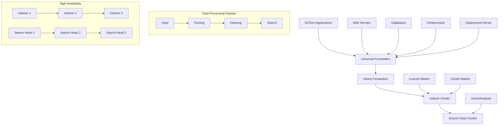

# Splunk Implementation Guide

## 📖 Overview

Splunk is a powerful enterprise platform for searching, monitoring, and analyzing machine-generated data. This guide provides comprehensive implementation instructions for EdTech platforms, focusing on log analysis, security monitoring, and business intelligence for organizations targeting AU, UK, and US markets.

## 🏗️ Architecture Overview



## 🚀 Deployment Options

### Option 1: Splunk Cloud

#### Getting Started with Splunk Cloud

```bash
# Sign up for Splunk Cloud
# Visit: https://www.splunk.com/en_us/download/splunk-cloud.html

# Configure your cloud instance
SPLUNK_CLOUD_STACK="your-stack-name"
SPLUNK_CLOUD_URL="https://${SPLUNK_CLOUD_STACK}.splunkcloud.com"
HEC_TOKEN="your-hec-token"
```

#### Universal Forwarder Installation

```bash
# Download and install Universal Forwarder
wget -O splunkforwarder-9.1.2-linux-2.6-x64.tgz \
  "https://download.splunk.com/products/universalforwarder/releases/9.1.2/linux/splunkforwarder-9.1.2-linux-2.6-x64.tgz"

tar -xzf splunkforwarder-9.1.2-linux-2.6-x64.tgz
sudo mv splunkforwarder /opt/
sudo chown -R splunk:splunk /opt/splunkforwarder

# Start and configure
sudo /opt/splunkforwarder/bin/splunk start --accept-license --answer-yes --no-prompt --seed-passwd changeme
sudo /opt/splunkforwarder/bin/splunk enable boot-start -user splunk
```

#### Universal Forwarder Configuration

```bash
# /opt/splunkforwarder/etc/system/local/inputs.conf
[default]
host = edtech-api-server-01

# API Server Logs
[monitor:///var/log/edtech/api/*.log]
index = edtech_api
sourcetype = edtech_api_logs
disabled = false

# Student Activity Logs
[monitor:///var/log/edtech/student-activity/*.log]
index = edtech_activity
sourcetype = student_activity_json
disabled = false

# Payment Logs (sensitive data)
[monitor:///var/log/edtech/payments/*.log]
index = edtech_payments
sourcetype = payment_logs
disabled = false

# System Logs
[monitor:///var/log/nginx/access.log]
index = edtech_web
sourcetype = nginx_access
disabled = false

[monitor:///var/log/nginx/error.log]
index = edtech_web
sourcetype = nginx_error
disabled = false

# Database Logs
[monitor:///var/log/postgresql/*.log]
index = edtech_database
sourcetype = postgresql
disabled = false

# HTTP Event Collector for real-time data
[http]
port = 8088
enableSSL = 1
dedicatedIoThreads = 2
maxSockets = 1024
maxThreads = 0
keepAliveIdleTimeout = 7200
busyKeepAliveIdleTimeout = 12
maxRequestLength = 838860800

[http://edtech_realtime]
token = ${HEC_TOKEN}
index = edtech_realtime
sourcetype = json_auto
disabled = false
```

```bash
# /opt/splunkforwarder/etc/system/local/outputs.conf
[tcpout]
defaultGroup = cloud_servers
maxQueueSize = 1MB
compressed = true

[tcpout:cloud_servers]
server = inputs1.${SPLUNK_CLOUD_STACK}.splunkcloud.com:9997
sslPassword = your-ssl-password
useSSL = true
sslVerifyServerCert = true
sslRootCAPath = $SPLUNK_HOME/etc/auth/cacert.pem
```

#### Application Integration (Node.js)

```javascript
// splunk-logger.js
const SplunkLogger = require('splunk-logging').Logger;

class EdTechSplunkLogger {
  constructor(options = {}) {
    this.config = {
      token: options.token || process.env.SPLUNK_HEC_TOKEN,
      url: options.url || process.env.SPLUNK_URL,
      index: options.index || 'edtech_api',
      sourcetype: options.sourcetype || 'edtech_app',
      source: options.source || 'nodejs_app',
      maxBatchCount: 10,
      maxBatchSize: 1024 * 1024, // 1MB
      requestOptions: {
        timeout: 5000,
        strictSSL: process.env.NODE_ENV === 'production'
      }
    };

    this.logger = new SplunkLogger(this.config);
    this.setupErrorHandling();
  }

  setupErrorHandling() {
    this.logger.on('error', (error) => {
      console.error('Splunk logging error:', error);
    });

    this.logger.on('connect', () => {
      console.log('Connected to Splunk');
    });
  }

  // Generic logging method
  log(level, message, metadata = {}) {
    const logEntry = {
      time: Date.now(),
      severity: level,
      source: this.config.source,
      sourcetype: this.config.sourcetype,
      index: this.config.index,
      event: {
        level,
        message,
        timestamp: new Date().toISOString(),
        service: 'edtech-api',
        environment: process.env.NODE_ENV || 'development',
        version: process.env.npm_package_version || '1.0.0',
        ...metadata
      }
    };

    this.logger.send(logEntry, (err, resp, body) => {
      if (err) {
        console.error('Error sending to Splunk:', err);
      }
    });
  }

  // Convenience methods
  info(message, metadata = {}) {
    this.log('INFO', message, metadata);
  }

  error(message, error = null, metadata = {}) {
    const errorData = { ...metadata };
    if (error) {
      errorData.error = {
        name: error.name,
        message: error.message,
        stack: error.stack
      };
    }
    this.log('ERROR', message, errorData);
  }

  warn(message, metadata = {}) {
    this.log('WARN', message, metadata);
  }

  debug(message, metadata = {}) {
    this.log('DEBUG', message, metadata);
  }

  // API request logging
  logApiRequest(req, res, responseTime) {
    this.log('INFO', 'API Request', {
      event_type: 'api_request',
      method: req.method,
      url: req.originalUrl,
      status_code: res.statusCode,
      response_time_ms: responseTime,
      user_id: req.user?.id,
      session_id: req.sessionID,
      request_id: req.id,
      ip_address: req.ip,
      user_agent: req.get('User-Agent'),
      content_length: res.get('Content-Length'),
      referrer: req.get('Referrer')
    });
  }

  // Student activity logging
  logStudentActivity(activity) {
    this.log('INFO', 'Student Activity', {
      event_type: 'student_activity',
      student_id: activity.student_id,
      activity_type: activity.type,
      subject: activity.subject,
      lesson_id: activity.lesson_id,
      duration_seconds: activity.duration,
      score: activity.score,
      max_score: activity.max_score,
      completion_percentage: activity.completion_percentage,
      attempts: activity.attempts,
      difficulty_level: activity.difficulty,
      learning_path: activity.learning_path,
      device_type: activity.device_type,
      browser: activity.browser
    });
  }

  // Payment transaction logging
  logPaymentEvent(payment) {
    // Mask sensitive data
    const maskedPayment = {
      ...payment,
      card_number: payment.card_number?.replace(/\d(?=\d{4})/g, '*'),
      cvv: '***',
      bank_account: payment.bank_account?.replace(/\d/g, '*')
    };

    this.log('INFO', 'Payment Event', {
      event_type: 'payment',
      user_id: payment.user_id,
      transaction_id: payment.transaction_id,
      amount: payment.amount,
      currency: payment.currency,
      status: payment.status,
      payment_method: payment.method,
      processor: payment.processor,
      subscription_plan: payment.subscription_plan,
      promo_code: payment.promo_code,
      ...maskedPayment
    });
  }

  // Security event logging
  logSecurityEvent(event, details = {}) {
    this.log('WARN', `Security Event: ${event}`, {
      event_type: 'security',
      security_event: event,
      severity: details.severity || 'medium',
      user_id: details.user_id,
      ip_address: details.ip_address,
      user_agent: details.user_agent,
      action_taken: details.action_taken,
      ...details
    });
  }

  // Performance monitoring
  logPerformanceMetric(metric) {
    this.log('INFO', 'Performance Metric', {
      event_type: 'performance',
      metric_name: metric.name,
      metric_value: metric.value,
      metric_unit: metric.unit,
      service: metric.service,
      endpoint: metric.endpoint,
      threshold_breached: metric.threshold_breached,
      ...metric.metadata
    });
  }

  // Business event logging
  logBusinessEvent(event, data = {}) {
    this.log('INFO', `Business Event: ${event}`, {
      event_type: 'business',
      business_event: event,
      revenue_impact: data.revenue_impact,
      user_segment: data.user_segment,
      conversion_funnel_step: data.funnel_step,
      ...data
    });
  }
}

// Express.js middleware
function createSplunkMiddleware(logger) {
  return (req, res, next) => {
    const startTime = Date.now();
    req.id = require('crypto').randomUUID();

    // Override res.end to capture response
    const originalEnd = res.end;
    res.end = function(...args) {
      const responseTime = Date.now() - startTime;
      logger.logApiRequest(req, res, responseTime);
      originalEnd.apply(this, args);
    };

    // Log security events
    if (req.url.includes('admin') && !req.user?.isAdmin) {
      logger.logSecurityEvent('unauthorized_admin_access', {
        user_id: req.user?.id,
        ip_address: req.ip,
        attempted_url: req.url
      });
    }

    next();
  };
}

module.exports = { EdTechSplunkLogger, createSplunkMiddleware };
```

### Option 2: Self-Hosted Splunk Enterprise

#### Docker Compose Setup

```yaml
# docker-compose.yml
version: '3.8'

services:
  # Splunk Enterprise - Single Instance
  splunk:
    image: splunk/splunk:latest
    container_name: splunk-enterprise
    environment:
      - SPLUNK_START_ARGS=--accept-license
      - SPLUNK_PASSWORD=changeme123!
      - SPLUNK_HEC_TOKEN=your-hec-token-here
      - SPLUNK_APPS_URL=https://github.com/splunk/docker-splunk/releases/download/8.2.0/splunk_app_ml.tgz
    ports:
      - "8000:8000"   # Web UI
      - "8088:8088"   # HTTP Event Collector
      - "8089:8089"   # Splunk Management Port
      - "9997:9997"   # Splunk-to-Splunk
      - "514:514/udp" # Syslog
    volumes:
      - splunk-data:/opt/splunk/var
      - splunk-etc:/opt/splunk/etc
      - ./splunk/apps:/opt/splunk/etc/apps:rw
    networks:
      - splunk
    restart: unless-stopped
    healthcheck:
      test: ["CMD", "curl", "-f", "http://localhost:8000/en-US/account/login"]
      interval: 30s
      timeout: 10s
      retries: 5

  # Universal Forwarder
  splunk-forwarder:
    image: splunk/universalforwarder:latest
    container_name: splunk-forwarder
    environment:
      - SPLUNK_START_ARGS=--accept-license
      - SPLUNK_PASSWORD=changeme123!
      - SPLUNK_FORWARD_SERVER=splunk:9997
    volumes:
      - /var/log:/host/var/log:ro
      - /var/lib/docker/containers:/host/var/lib/docker/containers:ro
      - ./forwarder/inputs.conf:/opt/splunkforwarder/etc/system/local/inputs.conf:ro
    networks:
      - splunk
    depends_on:
      - splunk
    restart: unless-stopped

volumes:
  splunk-data:
  splunk-etc:

networks:
  splunk:
    driver: bridge
```

#### Splunk App Development

```bash
# Create custom EdTech app structure
mkdir -p ./splunk/apps/edtech_monitoring/{default,local,metadata,static}
```

```ini
# ./splunk/apps/edtech_monitoring/default/app.conf
[install]
is_configured = 0

[ui]
is_visible = 1
label = EdTech Monitoring

[launcher]
author = EdTech Team
description = EdTech platform monitoring and analytics
version = 1.0.0

[package]
id = edtech_monitoring
```

```xml
<!-- ./splunk/apps/edtech_monitoring/metadata/default.meta -->
<meta type="views">
  <view name="student_dashboard">
    <displayname>Student Activity Dashboard</displayname>
  </view>
  <view name="api_performance">
    <displayname>API Performance</displayname>
  </view>
  <view name="security_monitoring">
    <displayname>Security Monitoring</displayname>
  </view>
</meta>
```

#### Custom Searches and Reports

```bash
# ./splunk/apps/edtech_monitoring/default/savedsearches.conf
[Student Login Patterns]
search = index=edtech_api event_type=api_request url="/api/auth/login" status_code=200 | timechart span=1h count by user_id | head 20

[API Error Rate]
search = index=edtech_api event_type=api_request | eval error=if(status_code>=400,1,0) | timechart span=5m avg(error) as error_rate

[Slow API Endpoints]
search = index=edtech_api event_type=api_request | where response_time_ms > 2000 | stats avg(response_time_ms) as avg_response_time, count as slow_requests by url | sort -avg_response_time

[Student Activity Heatmap]
search = index=edtech_activity event_type=student_activity | eval hour=strftime(_time, "%H") | stats count by hour, activity_type | xyseries hour activity_type count

[Payment Success Rate]
search = index=edtech_payments event_type=payment | eval success=if(status="completed",1,0) | timechart span=1h avg(success) as success_rate

[Security Anomalies]
search = index=edtech_api | rare user_id, ip_address | where count < 5 AND _time > relative_time(now(), "-24h@h")

[Geographic User Distribution]
search = index=edtech_api event_type=api_request | iplocation ip_address | geostats count by Country

[Learning Path Analysis]
search = index=edtech_activity event_type=student_activity | stats count as activities, dc(lesson_id) as unique_lessons, avg(score) as avg_score by learning_path | sort -activities
```

### Option 3: Kubernetes Deployment

#### Splunk Enterprise on Kubernetes

```yaml
# splunk-operator.yaml
apiVersion: v1
kind: Namespace
metadata:
  name: splunk-operator

---
apiVersion: apps/v1
kind: Deployment
metadata:
  name: splunk-operator
  namespace: splunk-operator
spec:
  replicas: 1
  selector:
    matchLabels:
      name: splunk-operator
  template:
    metadata:
      labels:
        name: splunk-operator
    spec:
      serviceAccountName: splunk-operator
      containers:
      - name: splunk-operator
        image: splunk/splunk-operator:2.2.0
        ports:
        - containerPort: 60000
          name: metrics
        - containerPort: 8443
          name: webhook
        command:
        - splunk-operator
        env:
        - name: WATCH_NAMESPACE
          value: ""
        - name: POD_NAME
          valueFrom:
            fieldRef:
              fieldPath: metadata.name
        - name: OPERATOR_NAME
          value: "splunk-operator"
        - name: RELATED_IMAGE_SPLUNK_ENTERPRISE
          value: "splunk/splunk:9.1.2"
        resources:
          limits:
            cpu: 1000m
            memory: 512Mi
          requests:
            cpu: 100m
            memory: 128Mi

---
apiVersion: v1
kind: ServiceAccount
metadata:
  name: splunk-operator
  namespace: splunk-operator

---
apiVersion: rbac.authorization.k8s.io/v1
kind: ClusterRole
metadata:
  name: splunk-operator
rules:
- apiGroups:
  - ""
  resources:
  - pods
  - services
  - endpoints
  - persistentvolumeclaims
  - events
  - configmaps
  - secrets
  verbs:
  - "*"
- apiGroups:
  - apps
  resources:
  - deployments
  - daemonsets
  - replicasets
  - statefulsets
  verbs:
  - "*"
- apiGroups:
  - enterprise.splunk.com
  resources:
  - "*"
  verbs:
  - "*"

---
apiVersion: rbac.authorization.k8s.io/v1
kind: ClusterRoleBinding
metadata:
  name: splunk-operator
roleRef:
  apiGroup: rbac.authorization.k8s.io
  kind: ClusterRole
  name: splunk-operator
subjects:
- kind: ServiceAccount
  name: splunk-operator
  namespace: splunk-operator
```

#### Splunk Standalone Instance

```yaml
# splunk-standalone.yaml
apiVersion: enterprise.splunk.com/v4
kind: Standalone
metadata:
  name: edtech-splunk
  namespace: splunk-enterprise
spec:
  replicas: 1
  image: splunk/splunk:9.1.2
  imagePullPolicy: Always
  
  # Resource allocation
  resources:
    requests:
      memory: "4Gi"
      cpu: "2"
    limits:
      memory: "8Gi"
      cpu: "4"
  
  # Storage
  storageCapacity: 100Gi
  storageClassName: fast-ssd
  
  # Splunk configuration
  splunkDefaults: |-
    [general]
    serverName = edtech-splunk
    pass4SymmKey = changeme123!
    
    [clustering]
    mode = searchhead
    
    [httpServer]
    max_content_length = 838860800
    
    [indexing]
    maxDataSize = auto_high_volume
    maxHotBuckets = 10
    maxWarmDBCount = 300
  
  # License
  licenseUrl: /licenses/splunk.license
  
  # Apps and configurations
  defaults: |-
    splunk:
      apps:
        - name: edtech_monitoring
          url: https://github.com/your-org/splunk-edtech-app/releases/download/v1.0.0/edtech_monitoring.tgz
      
      conf:
        inputs:
          http:
            port: 8088
            enableSSL: 1
            dedicatedIoThreads: 2
          
          http://edtech_hec:
            token: your-hec-token
            index: edtech_main
            sourcetype: json_auto
            
        indexes:
          edtech_api:
            homePath: $SPLUNK_DB/edtech_api/db
            coldPath: $SPLUNK_DB/edtech_api/colddb
            thawedPath: $SPLUNK_DB/edtech_api/thaweddb
            maxDataSize: auto_high_volume
            maxHotBuckets: 10
            maxWarmDBCount: 300
            
          edtech_activity:
            homePath: $SPLUNK_DB/edtech_activity/db
            coldPath: $SPLUNK_DB/edtech_activity/colddb
            thawedPath: $SPLUNK_DB/edtech_activity/thaweddb
            maxDataSize: auto_high_volume
            
          edtech_payments:
            homePath: $SPLUNK_DB/edtech_payments/db
            coldPath: $SPLUNK_DB/edtech_payments/colddb
            thawedPath: $SPLUNK_DB/edtech_payments/thaweddb
            maxDataSize: auto
```

## 📊 Advanced Analytics and Machine Learning

### Splunk ML Toolkit Configuration

```spl
# Anomaly Detection for API Response Times
| inputlookup response_time_data.csv
| fit DensityFunction response_time_ms by endpoint into response_time_model
| apply response_time_model
| where "IsOutlier(DensityFunction_response_time_ms)" = "True"
| eval anomaly_score = round('DensityFunction_response_time_ms', 3)
| table _time, endpoint, response_time_ms, anomaly_score
| sort -anomaly_score
```

```spl
# Predict Student Churn
| search index=edtech_activity event_type=student_activity
| stats count as activity_count, 
        avg(score) as avg_score, 
        dc(lesson_id) as unique_lessons,
        max(_time) as last_activity
        by student_id
| eval days_since_last_activity = round((now() - last_activity) / 86400, 0)
| eval churn_risk = case(
    days_since_last_activity > 30 AND avg_score < 60, "High",
    days_since_last_activity > 14 AND avg_score < 70, "Medium",
    1=1, "Low"
  )
| fit LinearRegression churn_risk from activity_count, avg_score, unique_lessons, days_since_last_activity into student_churn_model
```

```spl
# Clustering Students by Learning Behavior
| search index=edtech_activity event_type=student_activity
| stats count as total_activities,
        avg(duration_seconds) as avg_session_duration,
        avg(score) as avg_score,
        dc(subject) as subjects_studied,
        dc(date_hour) as active_hours
        by student_id
| fit KMeans total_activities, avg_session_duration, avg_score, subjects_studied, active_hours k=5 into student_behavior_clusters
| eval cluster_name = case(
    'KMeans_total_activities' = 0, "Casual Learners",
    'KMeans_total_activities' = 1, "Intensive Studiers", 
    'KMeans_total_activities' = 2, "Subject Specialists",
    'KMeans_total_activities' = 3, "Struggling Students",
    'KMeans_total_activities' = 4, "High Achievers"
  )
```

### Custom Visualizations

```spl
# Learning Progress Funnel
index=edtech_activity event_type=student_activity
| eval stage = case(
    completion_percentage < 25, "Started",
    completion_percentage < 50, "Quarter Complete", 
    completion_percentage < 75, "Half Complete",
    completion_percentage < 100, "Nearly Complete",
    completion_percentage = 100, "Completed"
  )
| stats dc(student_id) as students by stage
| sort stage
```

```spl
# Revenue Attribution Analysis
index=edtech_payments event_type=payment status=completed
| join user_id [
    search index=edtech_activity event_type=student_activity
    | stats min(_time) as first_activity by student_id
    | rename student_id as user_id
  ]
| eval days_to_conversion = round((_time - first_activity) / 86400, 0)
| stats sum(amount) as revenue, avg(days_to_conversion) as avg_days_to_convert by subscription_plan
| eval revenue_per_day = round(revenue / avg_days_to_convert, 2)
```

## 🔒 Security and Compliance

### RBAC Configuration

```bash
# roles.conf
[edtech_student_analyst]
importRoles = user
srchIndexesAllowed = edtech_activity
srchIndexesDefault = edtech_activity
srchJobsQuota = 10
srchDiskQuota = 1000
rtSrchJobsQuota = 5

[edtech_admin]
importRoles = admin
srchIndexesAllowed = *
srchJobsQuota = 50
srchDiskQuota = 10000
rtSrchJobsQuota = 20

[edtech_security_analyst]
importRoles = user
srchIndexesAllowed = edtech_api;edtech_web;_audit
srchIndexesDefault = edtech_api
srchJobsQuota = 25
srchDiskQuota = 5000
rtSrchJobsQuota = 10
```

### Data Masking Configuration

```spl
# transforms.conf
[mask_credit_cards]
REGEX = \b(?:\d[ -]*?){13,16}\b
FORMAT = XXXX-XXXX-XXXX-XXXX
DEST_KEY = _raw

[mask_emails]
REGEX = [a-zA-Z0-9._%+-]+@[a-zA-Z0-9.-]+\.[a-zA-Z]{2,}
FORMAT = user@domain.com
DEST_KEY = _raw

[mask_phone_numbers]
REGEX = \b\d{3}[-.]?\d{3}[-.]?\d{4}\b
FORMAT = XXX-XXX-XXXX
DEST_KEY = _raw
```

```spl
# props.conf
[edtech_payments]
TRANSFORMS-mask_cc = mask_credit_cards
TRANSFORMS-mask_email = mask_emails
TRANSFORMS-mask_phone = mask_phone_numbers

[edtech_api]
TRANSFORMS-mask_email = mask_emails
TRANSFORMS-mask_phone = mask_phone_numbers
```

### Audit Logging

```spl
# Audit trail for sensitive data access
index=_audit action=search
| rex field=search "index=(?<searched_index>\w+)"
| where searched_index="edtech_payments" OR searched_index="edtech_pii"
| stats count by user, searched_index, _time
| sort -_time
```

## 📈 Performance Optimization

### Index Optimization

```bash
# indexes.conf
[edtech_api]
homePath = $SPLUNK_DB/edtech_api/db
coldPath = $SPLUNK_DB/edtech_api/colddb
thawedPath = $SPLUNK_DB/edtech_api/thaweddb
maxDataSize = auto_high_volume
maxHotBuckets = 10
maxWarmDBCount = 300
frozenTimePeriodInSecs = 31536000
# Retention: 1 year

[edtech_activity] 
homePath = $SPLUNK_DB/edtech_activity/db
coldPath = $SPLUNK_DB/edtech_activity/colddb
thawedPath = $SPLUNK_DB/edtech_activity/thaweddb
maxDataSize = auto_high_volume
maxHotBuckets = 15
maxWarmDBCount = 500
frozenTimePeriodInSecs = 63072000
# Retention: 2 years

[edtech_payments]
homePath = $SPLUNK_DB/edtech_payments/db
coldPath = $SPLUNK_DB/edtech_payments/colddb
thawedPath = $SPLUNK_DB/edtech_payments/thaweddb
maxDataSize = auto
maxHotBuckets = 5
maxWarmDBCount = 100
frozenTimePeriodInSecs = 220752000
# Retention: 7 years (compliance)
```

### Search Optimization

```spl
# Optimized search patterns

# GOOD: Use index and sourcetype filters early
index=edtech_api sourcetype=api_logs status_code>=400
| stats count by endpoint

# AVOID: Generic searches
*error* | where index="edtech_api"

# GOOD: Use summary indexing for frequently accessed data
| search index=edtech_activity
| stats count as activities, avg(score) as avg_score by student_id, date_hour
| collect index=edtech_summary source=student_hourly_stats

# GOOD: Use data models for repeated analysis
| pivot Student_Activity_Data Student_Performance splitrow student_id splitcol activity_type values(score) as "Average Score"
```

## 🚨 Monitoring and Alerting

### Real-time Alerts

```spl
# High Error Rate Alert
search index=edtech_api earliest=-5m@m latest=now
| eval error = if(status_code >= 400, 1, 0)
| stats sum(error) as error_count, count as total_requests
| eval error_rate = round((error_count / total_requests) * 100, 2)
| where error_rate > 5
| eval message = "API error rate is " + error_rate + "% over the last 5 minutes"
```

```spl
# Failed Payment Alert
search index=edtech_payments status=failed earliest=-10m@m
| stats count as failed_payments by payment_method
| where failed_payments > 5
| eval message = "High payment failure rate detected: " + failed_payments + " failures for " + payment_method
```

```spl
# Unusual Login Activity
search index=edtech_api event_type=api_request url="/api/auth/login" status_code=200 earliest=-1h@h
| stats dc(ip_address) as unique_ips by user_id
| where unique_ips > 5
| eval message = "Potential account sharing detected for user_id: " + user_id + " (" + unique_ips + " unique IPs)"
```

### Custom Alert Actions

```python
# custom_alert_action.py
import sys
import json
import requests
from splunklib.searchcommands import dispatch, EventingCommand, Configuration

@Configuration()
class SlackAlertCommand(EventingCommand):
    
    def __init__(self):
        super(SlackAlertCommand, self).__init__()
        self.webhook_url = "https://hooks.slack.com/services/YOUR/SLACK/WEBHOOK"
    
    def transform(self, events):
        for event in events:
            # Extract alert data
            alert_data = {
                'text': event.get('message', 'Alert triggered'),
                'channel': '#alerts',
                'username': 'Splunk',
                'icon_emoji': ':warning:'
            }
            
            # Send to Slack
            response = requests.post(self.webhook_url, json=alert_data)
            
            if response.status_code == 200:
                event['slack_sent'] = 'true'
            else:
                event['slack_sent'] = 'false'
                event['slack_error'] = response.text
            
            yield event

dispatch(SlackAlertCommand, sys.argv, sys.stdin, sys.stdout, __name__)
```

## 🔗 Navigation

**← Previous**: [ELK Stack Guide](./elk-stack-guide.md)  
**→ Next**: [Fluentd Configuration](./fluentd-configuration.md)

---

*Splunk Implementation Guide | Log Management & Analysis Research | January 2025*