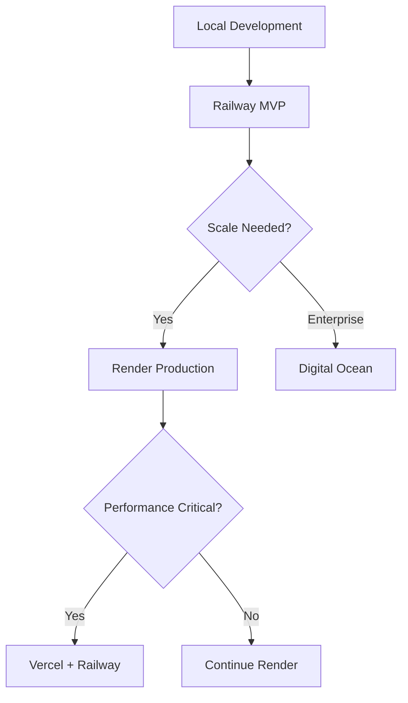

# Comparison Analysis: Managed App Deployment Platforms

## 🎯 Overview

This comprehensive comparison analyzes managed cloud platforms for deploying full-stack Nx projects, focusing on cost, features, ease of use, and suitability for client handovers.

## 📊 Platform Comparison Matrix

| Feature | Railway | Render | Digital Ocean | Vercel | Netlify |
|---------|---------|--------|---------------|---------|---------|
| **Nx Support** | ⭐⭐⭐⭐⭐ | ⭐⭐⭐⭐ | ⭐⭐⭐⭐ | ⭐⭐⭐ | ⭐⭐⭐ |
| **Setup Difficulty** | ⭐⭐ | ⭐⭐⭐ | ⭐⭐⭐⭐ | ⭐⭐ | ⭐⭐ |
| **Cost (Small)** | $5-15 | $7-25 | $12-35 | $20-40 | $15-30 |
| **Database Included** | ✅ MySQL | ✅ PostgreSQL | ✅ MySQL | ❌ External | ❌ External |
| **Auto-scaling** | ❌ | ✅ | ✅ | ✅ | ✅ Static |
| **Custom Domains** | ✅ | ✅ | ✅ | ✅ | ✅ |
| **SSL Certificate** | ✅ Free | ✅ Free | ✅ Free | ✅ Free | ✅ Free |
| **Git Integration** | ✅ | ✅ | ✅ | ✅ | ✅ |
| **Preview Deploys** | ❌ | ✅ | ✅ | ✅ | ✅ |
| **Client-Friendly** | ⭐⭐⭐⭐⭐ | ⭐⭐⭐⭐ | ⭐⭐⭐ | ⭐⭐⭐⭐ | ⭐⭐⭐⭐ |

## 🚂 Railway - Most Cost-Effective

### ✅ Strengths
- **Lowest cost**: $5/month includes frontend, backend, and database
- **Excellent Nx support**: Built-in monorepo detection
- **Simple setup**: One-click deployments from GitHub
- **Integrated database**: MySQL plugin with automatic connection
- **Developer-friendly**: Clean dashboard, clear pricing
- **Fast deployments**: Average build time 2-5 minutes

### ❌ Weaknesses
- **No preview deployments**: Limited branch deployment options
- **Basic monitoring**: Fewer observability features
- **No auto-scaling**: Fixed resource allocation
- **Smaller community**: Less documentation compared to others

### 💰 Pricing Breakdown
```
Starter Plan ($5/month):
- 512MB RAM, 1GB storage
- Unlimited bandwidth
- MySQL database included
- Custom domains
- SSL certificates

Pro Plan ($20/month):
- 8GB RAM, 100GB storage
- Priority support
- Advanced metrics
```

### 🎯 Best For
- Budget-conscious projects
- Client handovers requiring minimal cost
- MVP and prototype deployments
- Teams new to deployment

### 📋 Implementation Example
```yaml
# railway.toml
[build]
builder = "nixpacks"

[deploy]
startCommand = "nx serve backend --prod"

[[services]]
[services.backend]
buildCommand = "nx build backend --prod"
startCommand = "node dist/apps/backend/main.js"

[services.frontend]
buildCommand = "nx build frontend --prod"
staticPublishPath = "dist/apps/frontend"
```

## 🎨 Render - Production-Ready Platform

### ✅ Strengths
- **Excellent reliability**: 99.9% uptime SLA
- **Strong Nx support**: Good monorepo handling
- **Auto-scaling**: Automatic resource scaling
- **Preview deployments**: Branch-based preview environments
- **Comprehensive monitoring**: Built-in logging and metrics
- **PostgreSQL included**: Managed database service

### ❌ Weaknesses
- **Higher cost**: More expensive than Railway
- **MySQL not native**: Requires external MySQL provider
- **Complex pricing**: Multiple service tiers
- **Build time**: Slower builds compared to Railway

### 💰 Pricing Breakdown
```
Web Service ($7/month):
- 512MB RAM, 1GB storage
- Custom domains, SSL
- Auto-scaling available

PostgreSQL ($7/month):
- 1GB RAM, 1GB storage
- Automated backups
- Connection pooling

Total: ~$14-25/month
```

### 🎯 Best For
- Production applications
- Teams requiring high reliability
- Applications needing auto-scaling
- Projects with complex deployment needs

### 📋 Implementation Example
```yaml
# render.yaml
services:
  - type: web
    name: nx-backend
    buildCommand: nx build backend --prod
    startCommand: node dist/apps/backend/main.js
    
  - type: web
    name: nx-frontend
    buildCommand: nx build frontend --prod
    staticPublishPath: ./dist/apps/frontend
```

## 🌊 Digital Ocean App Platform - Enterprise Features

### ✅ Strengths
- **Enterprise-grade**: Advanced security and compliance features
- **Excellent documentation**: Comprehensive guides and tutorials
- **Managed databases**: Native MySQL support
- **VPC networking**: Advanced networking options
- **Team collaboration**: Multi-user management
- **Professional support**: 24/7 enterprise support available

### ❌ Weaknesses
- **Higher cost**: Most expensive option
- **Complex setup**: Steeper learning curve
- **Over-engineered**: Too many features for simple projects
- **Slower iteration**: More formal deployment process

### 💰 Pricing Breakdown
```
Basic App ($12/month):
- 512MB RAM, 1GB storage
- 1 container instance
- Custom domains, SSL

Managed MySQL ($15/month):
- 1GB RAM, 10GB storage
- Automated backups
- High availability

Total: ~$27-40/month
```

### 🎯 Best For
- Enterprise clients
- Applications requiring compliance
- Teams needing advanced networking
- Long-term production deployments

### 📋 Implementation Example
```yaml
# .do/app.yaml
name: nx-fullstack
services:
- name: backend
  build_command: nx build backend --prod
  run_command: node dist/apps/backend/main.js
  
- name: frontend
  build_command: nx build frontend --prod
  
databases:
- name: nx-mysql
  engine: MYSQL
  size: db-s-1vcpu-1gb
```

## ⚡ Vercel - Frontend-Optimized

### ✅ Strengths
- **Excellent frontend performance**: Global CDN, edge optimization
- **Perfect for React**: Optimized for React/Next.js projects
- **Amazing developer experience**: Intuitive dashboard
- **Preview deployments**: Automatic branch previews
- **Edge functions**: Serverless backend capabilities
- **Fast builds**: Optimized build pipeline

### ❌ Weaknesses
- **Backend limitations**: Not ideal for Express.js servers
- **No database**: Requires external database providers
- **Higher cost**: Expensive for full-stack applications
- **Vendor lock-in**: Tight integration with Vercel ecosystem

### 💰 Pricing Breakdown
```
Pro Plan ($20/month):
- Unlimited deployments
- Custom domains
- Analytics included

External Database (PlanetScale):
- $10/month for small database
- Additional costs for scaling

Total: ~$30-50/month
```

### 🎯 Best For
- Frontend-heavy applications
- Jamstack architectures
- Teams prioritizing performance
- Projects with minimal backend needs

## 🔷 Netlify - Static Site Excellence

### ✅ Strengths
- **Best static hosting**: Optimized for static sites
- **Excellent CI/CD**: Advanced build pipeline
- **Form handling**: Built-in form processing
- **Identity management**: User authentication features
- **Edge functions**: Serverless capabilities
- **Great free tier**: Generous free allowances

### ❌ Weaknesses
- **Limited backend**: Not suitable for Express.js apps
- **No database**: Requires external database
- **Complex pricing**: Various add-on costs
- **Static focus**: Not ideal for dynamic applications

### 💰 Pricing Breakdown
```
Pro Plan ($19/month):
- 100GB bandwidth
- Build minutes included
- Form submissions

External Backend (Railway):
- $5/month for API server
- Additional database costs

Total: ~$24-35/month
```

### 🎯 Best For
- Static websites with APIs
- Documentation sites
- Marketing websites
- JAMstack applications

## 🔍 Detailed Feature Comparison

### Database Support

| Platform | Native Database | External Options | Cost Impact |
|----------|----------------|------------------|-------------|
| **Railway** | ✅ MySQL, PostgreSQL | ✅ PlanetScale, Supabase | $0-5 extra |
| **Render** | ✅ PostgreSQL | ✅ AWS RDS, PlanetScale | $5-15 extra |
| **Digital Ocean** | ✅ MySQL, PostgreSQL | ✅ AWS RDS | $10-20 extra |
| **Vercel** | ❌ None | ✅ PlanetScale, Supabase | $10-20 extra |
| **Netlify** | ❌ None | ✅ FaunaDB, Supabase | $10-20 extra |

### Monitoring & Observability

| Platform | Logs | Metrics | Alerts | APM |
|----------|------|---------|--------|-----|
| **Railway** | ✅ Basic | ✅ Basic | ❌ | ❌ |
| **Render** | ✅ Advanced | ✅ Advanced | ✅ | ✅ Limited |
| **Digital Ocean** | ✅ Advanced | ✅ Advanced | ✅ | ✅ Full |
| **Vercel** | ✅ Advanced | ✅ Advanced | ✅ | ✅ Analytics |
| **Netlify** | ✅ Advanced | ✅ Advanced | ✅ | ✅ Limited |

### Deployment Features

| Platform | Auto Deploy | Preview | Rollback | Blue/Green |
|----------|-------------|---------|----------|------------|
| **Railway** | ✅ | ❌ | ✅ Manual | ❌ |
| **Render** | ✅ | ✅ | ✅ Automatic | ✅ |
| **Digital Ocean** | ✅ | ✅ | ✅ Automatic | ✅ |
| **Vercel** | ✅ | ✅ | ✅ Automatic | ✅ |
| **Netlify** | ✅ | ✅ | ✅ Automatic | ✅ |

## 🎯 Use Case Recommendations

### Minimum Viable Product (MVP)
**Recommendation**: Railway
- Lowest cost: $5-10/month total
- Quick setup: < 30 minutes
- All features needed for basic deployment

### Client Handover Projects
**Recommendation**: Railway or Render
- **Railway**: For cost-conscious clients
- **Render**: For clients needing reliability

### Production Applications
**Recommendation**: Render or Digital Ocean
- **Render**: Balanced cost and features
- **Digital Ocean**: Enterprise-grade features

### High-Performance Applications
**Recommendation**: Vercel + Railway
- **Vercel**: Frontend optimization
- **Railway**: Cost-effective backend

### Enterprise Deployments
**Recommendation**: Digital Ocean App Platform
- Advanced security features
- Compliance capabilities
- Professional support

## 📈 Migration Paths

### From Development to Production



### Cost Evolution

| Stage | Platform | Monthly Cost | Features |
|-------|----------|--------------|----------|
| **MVP** | Railway | $5-10 | Basic deployment |
| **Beta** | Railway Pro | $15-25 | Better resources |
| **Production** | Render | $20-35 | Reliability features |
| **Scale** | Digital Ocean | $40-60 | Enterprise features |

## 🔗 Decision Matrix

### For Budget Projects (< $15/month)
1. **Railway** - Best overall value
2. **Render Free + External DB** - Good reliability
3. **Netlify + External API** - Static-focused

### For Professional Projects ($15-40/month)
1. **Render** - Best balance of features and cost
2. **Digital Ocean** - Enterprise features
3. **Vercel + PlanetScale** - Performance-focused

### For Enterprise Projects ($40+/month)
1. **Digital Ocean App Platform** - Full enterprise suite
2. **AWS/GCP with managed services** - Maximum control
3. **Render with premium features** - Managed simplicity

---

**💡 Quick Decision Guide**: 
- **Tight budget** → Railway
- **Need reliability** → Render  
- **Enterprise client** → Digital Ocean
- **Performance critical** → Vercel + Railway

---

*Comparison Analysis | Nx Managed Deployment | Platform feature analysis*