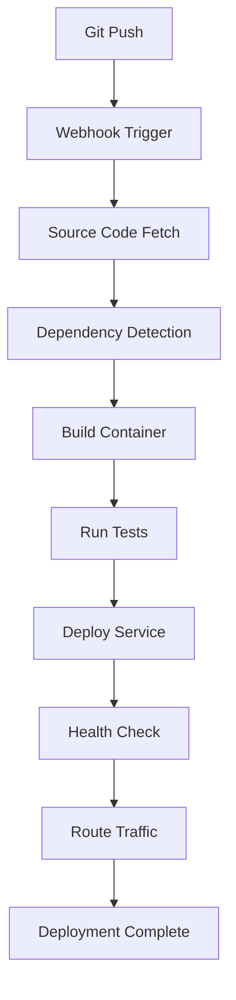

# Platform Overview and Architecture

## Overview

Railway.com is a modern Platform-as-a-Service (PaaS) that provides developers with infrastructure automation, deployment pipelines, and managed services for building and deploying applications. This document provides an in-depth analysis of Railway's platform architecture, core features, and technical capabilities.

## Platform Architecture

### Core Infrastructure

**Railway's Infrastructure Stack**:
```
┌─────────────────────────────────────────────────────┐
│                   Developer Layer                   │
├─────────────────────────────────────────────────────┤
│  CLI Tools  │  Web Dashboard  │  GitHub Integration │
├─────────────────────────────────────────────────────┤
│                 Railway Platform                    │
├─────────────────────────────────────────────────────┤
│  Build System  │  Container Runtime  │  Networking  │
├─────────────────────────────────────────────────────┤
│               Infrastructure Layer                  │
├─────────────────────────────────────────────────────┤
│     GCP/AWS     │    Kubernetes    │   Load Balancers │
└─────────────────────────────────────────────────────┘
```

### Deployment Architecture

**Service-Based Architecture**:
- **Services**: Independent deployable units (web apps, APIs, databases)
- **Projects**: Collections of related services
- **Environments**: Isolated deployment contexts (production, staging)
- **Private Networking**: Secure service-to-service communication

### Container Runtime

**Nixpacks Build System**:
- **Language Detection**: Automatic detection of runtime requirements
- **Dependency Management**: Automatic package installation and caching
- **Build Optimization**: Efficient layer caching and incremental builds
- **Multi-language Support**: Node.js, Python, Go, Rust, PHP, Ruby, etc.

```dockerfile
# Example generated Nixpacks build
FROM nixpkgs/nix:latest
COPY . /app
WORKDIR /app
RUN nix-env -i nodejs-18_x npm
RUN npm ci
RUN npm run build
CMD ["npm", "start"]
```

## Core Features and Capabilities

### 1. Git-Based Deployment

**Workflow**:
```
Developer Push → GitHub Webhook → Railway Build → Container Deploy → Live Service
```

**Configuration**:
- **Automatic deployments** on git push
- **Branch-based deployments** for feature testing
- **Rollback capabilities** to previous deployments
- **Build logs** and deployment status tracking

### 2. Service Management

**Service Types**:

| Service Type | Description | Use Cases |
|-------------|-------------|-----------|
| **Web Service** | HTTP-accessible applications | Frontend apps, APIs, web servers |
| **Worker Service** | Background processing | Queues, scheduled tasks, data processing |
| **Database Service** | Managed databases | PostgreSQL, MySQL, MongoDB, Redis |
| **Cron Job** | Scheduled tasks | Backups, reports, maintenance tasks |

### 3. Database Services

**Supported Databases**:
- **PostgreSQL**: Full-featured relational database
- **MySQL**: Popular relational database
- **MongoDB**: Document-based NoSQL database
- **Redis**: In-memory key-value store

**Database Features**:
- **Automatic backups** (7-day retention)
- **Point-in-time recovery**
- **Connection pooling**
- **SSL/TLS encryption**
- **Private networking**

### 4. Networking and Security

**Private Networking**:
```
┌─────────────────┐    Private Network    ┌──────────────────┐
│   Frontend      │ ←─────────────────→   │   Backend API    │
│   Service       │                       │   Service        │
└─────────────────┘                       └──────────────────┘
         │                                          │
         └─────────────── Private Network ─────────┘
                              │
                    ┌──────────────────┐
                    │   Database       │
                    │   Service        │
                    └──────────────────┘
```

**Security Features**:
- **Automatic SSL/TLS** certificates
- **Environment variable encryption**
- **Private service networking**
- **IP whitelisting** (Team plan)
- **SOC 2 Type II compliance**

### 5. Monitoring and Observability

**Built-in Metrics**:
- **Resource utilization** (CPU, memory, disk)
- **HTTP request metrics** (response times, status codes)
- **Database performance** (query times, connections)
- **Custom application metrics**

**Logging System**:
- **Real-time logs** via dashboard and CLI
- **Structured logging** support
- **Log aggregation** across services
- **Log retention** (varies by plan)

## Deployment Workflow

### 1. Project Setup

```bash
# Initialize Railway project
railway new my-clinic-app
railway link

# Add services
railway service create web
railway service create api
railway service create mysql
```

### 2. Service Configuration

**Railway.toml Configuration**:
```toml
[build]
builder = "NIXPACKS"

[environments.production.services.web]
buildCommand = "npm run build:web"
startCommand = "npm run start:web"
variables = { NODE_ENV = "production" }

[environments.production.services.api]
buildCommand = "npm run build:api"
startCommand = "npm run start:api"
variables = { NODE_ENV = "production" }

[environments.production.services.database]
image = "mysql:8.0"
variables = { MYSQL_ROOT_PASSWORD = "${{MYSQL_ROOT_PASSWORD}}" }
```

### 3. Environment Variables

**Variable Management**:
- **Shared variables** across services
- **Service-specific variables**
- **Secret management** with encryption
- **Environment inheritance** (production inherits from staging)

```bash
# Set environment variables
railway variables set DATABASE_URL=mysql://...
railway variables set API_URL=https://api.railway.app
railway variables set --sensitive JWT_SECRET=secret123
```

### 4. Deployment Process



## Scaling and Performance

### Auto-Scaling

**Horizontal Scaling**:
- **Automatic scaling** based on CPU/memory usage
- **Traffic-based scaling** for web services
- **Custom scaling rules** (Pro plan)

**Vertical Scaling**:
- **Dynamic resource allocation**
- **Memory and CPU limits** per service
- **Burst capacity** for traffic spikes

### Performance Optimization

**Build Performance**:
- **Layer caching** for faster builds
- **Incremental builds** for unchanged dependencies
- **Parallel builds** for multiple services

**Runtime Performance**:
- **CDN integration** for static assets
- **HTTP/2 support** for faster loading
- **Gzip compression** automatic
- **Connection pooling** for databases

## Regional Deployment

### Available Regions

| Region | Location | Latency Considerations |
|--------|----------|----------------------|
| **US West** | Oregon | West Coast users |
| **US East** | Virginia | East Coast users |
| **Europe** | Frankfurt | European users |
| **Asia** | Singapore | Asian users |

### Multi-Region Strategy

**Pro Plan Features**:
- **Concurrent deployments** in multiple regions
- **Global load balancing**
- **Region-specific databases**
- **Cross-region replication**

## Integration Ecosystem

### Source Control Integration

**Supported Platforms**:
- **GitHub**: Full integration with webhooks
- **GitLab**: Repository and pipeline integration
- **Bitbucket**: Basic integration support

**Integration Features**:
- **Automatic deployments** on push
- **Pull request deployments** for testing
- **Branch-based environments**
- **Deployment status updates**

### Third-Party Integrations

**Monitoring and Analytics**:
- **Sentry**: Error tracking and monitoring
- **Datadog**: Application performance monitoring
- **New Relic**: Full-stack observability
- **LogDNA**: Log management and analysis

**Development Tools**:
- **Docker**: Custom container support
- **Terraform**: Infrastructure as code
- **GitHub Actions**: CI/CD pipeline integration
- **Slack**: Deployment notifications

## API and CLI

### Railway CLI

**Installation and Usage**:
```bash
# Install Railway CLI
npm install -g @railway/cli

# Authentication
railway login

# Project management
railway init
railway link
railway deploy
railway logs

# Service management
railway service create
railway service delete
railway variables set
```

### Railway API

**GraphQL API**:
```graphql
query GetProject($projectId: String!) {
  project(id: $projectId) {
    id
    name
    services {
      id
      name
      deployments {
        id
        status
        createdAt
      }
    }
  }
}
```

**REST API**:
```bash
# Get project information
curl -H "Authorization: Bearer $TOKEN" \
  https://backboard.railway.app/graphql/v2

# Trigger deployment
curl -X POST \
  -H "Authorization: Bearer $TOKEN" \
  -H "Content-Type: application/json" \
  https://backboard.railway.app/deploy
```

## Technical Limitations

### Platform Constraints

**Resource Limits**:
- **CPU**: Up to 32 vCPU per service (Pro plan)
- **Memory**: Up to 32GB RAM per service (Pro plan)
- **Storage**: Ephemeral file system (use databases for persistence)
- **Network**: 100GB bandwidth included (then $0.10/GB)

**Service Limitations**:
- **Cold starts**: Services may have startup delays
- **File system**: No persistent file storage (use databases)
- **Background jobs**: Require separate worker services
- **WebSocket**: Limited long-running connection support

### Technical Considerations

**Build Constraints**:
- **Build time**: 15-minute maximum build time
- **Build size**: Container size limits
- **Dependencies**: Some native dependencies may not be supported

**Runtime Constraints**:
- **Request timeout**: 300 seconds maximum
- **Memory usage**: Hard limits enforced
- **Process count**: Single process per service

## Security Architecture

### Infrastructure Security

**Platform Security**:
- **SOC 2 Type II** compliance
- **ISO 27001** certification
- **Encrypted data at rest** and in transit
- **Network isolation** between projects
- **Regular security audits**

### Application Security

**Built-in Security Features**:
- **Automatic SSL/TLS** certificate provisioning
- **Environment variable encryption**
- **Private networking** between services
- **Secret management** system
- **Access controls** and team permissions

### Compliance and Governance

**Data Protection**:
- **GDPR compliance** for European users
- **Data residency** options
- **Backup encryption**
- **Audit logging** for administrative actions

## Monitoring and Alerting

### Built-in Monitoring

**Service Metrics**:
- **CPU utilization** and memory usage
- **HTTP request** metrics and response times
- **Database performance** and connection counts
- **Error rates** and status codes

**Custom Metrics**:
```javascript
// Application metrics collection
app.get('/metrics', (req, res) => {
  const metrics = {
    uptime: process.uptime(),
    memory: process.memoryUsage(),
    connections: activeConnections.length,
    requests: requestCounter
  };
  res.json(metrics);
});
```

### Alerting System

**Alert Types**:
- **Resource threshold** alerts
- **Service health** monitoring
- **Deployment status** notifications
- **Custom metric** alerts

**Notification Channels**:
- **Email** notifications
- **Slack** integration
- **Webhook** endpoints
- **Discord** notifications

## Development Workflow

### Local Development

**Railway Development Tools**:
```bash
# Run services locally with Railway environment
railway run node server.js

# Connect to Railway database locally
railway connect mysql

# Sync environment variables
railway variables --json > .env.json
```

### Testing and Staging

**Environment Management**:
- **Multiple environments** per project
- **Branch-based deployments** for feature testing
- **Environment variable inheritance**
- **Database seeding** and migration tools

### Production Deployment

**Deployment Strategies**:
- **Blue-green deployments** for zero downtime
- **Canary releases** for gradual rollouts
- **Rollback capabilities** for quick recovery
- **Health checks** and readiness probes

---

## Next Steps

1. **[Deploy Nx Application](./nx-deployment-guide.md)** - Step-by-step implementation
2. **[Analyze Costs](./pricing-credits-analysis.md)** - Detailed pricing breakdown
3. **[Set Up Database](./mysql-database-deployment.md)** - MySQL configuration

---

*Platform Overview and Architecture | Railway.com Analysis | January 2025*