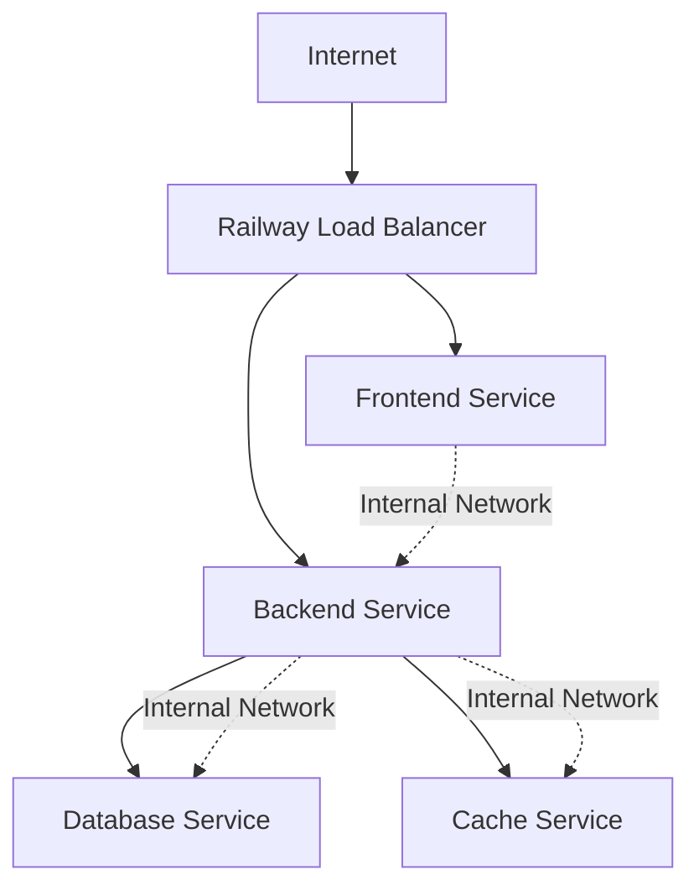

# Resource Management: How Railway Shares and Allocates Resources

## 🔧 Resource Allocation Architecture

Railway uses a **container-based resource allocation system** where each service runs in its own isolated container with dedicated compute resources. Unlike shared hosting, your services have guaranteed access to their allocated RAM and CPU.

## 💾 Memory (RAM) Management

### Allocation Model
- **Dedicated per service**: Each service gets its own RAM allocation
- **Guaranteed resources**: No sharing with other customers' applications
- **Elastic scaling**: Automatic scaling within service limits
- **Memory limits**: Hard limits prevent one service from affecting others

### Memory Sizing Guidelines
```yaml
Service Recommendations:
Frontend (React/Vite):
  Minimum: 512 MB
  Recommended: 1 GB
  Maximum needed: 2 GB

Backend (Express.js):
  Minimum: 1 GB
  Recommended: 2 GB  
  Maximum needed: 4 GB

Database (MySQL):
  Minimum: 1 GB
  Recommended: 2-4 GB
  Maximum needed: 8+ GB
```

### Memory Usage Patterns
Railway monitors memory usage and provides real-time metrics:
- **Peak usage tracking**: Identifies memory spikes
- **Average utilization**: Shows consistent memory needs
- **OOM prevention**: Automatic restarts if memory limits exceeded
- **Optimization recommendations**: Suggests right-sizing based on usage

## ⚡ CPU (Compute) Management

### vCPU Allocation
- **Fractional CPU**: Allocations as low as 0.1 vCPU
- **Burst capacity**: Temporary CPU spikes allowed
- **Multi-core support**: Services can use multiple vCPUs
- **Fair scheduling**: CPU time fairly distributed among services

### CPU Sizing for Clinic Management System
```yaml
Typical CPU Requirements:
Frontend Build:
  Build time: 2 vCPU (temporary)
  Runtime: 0.5 vCPU (serving static files)

Backend API:
  Build time: 1 vCPU (npm install, compile)
  Runtime: 1 vCPU (handling requests, business logic)

Database:
  Runtime: 0.5-1 vCPU (queries, indexing)
  Backup operations: 1-2 vCPU (temporary)
```

### CPU Usage Optimization
```typescript
// Express.js optimization for Railway
const express = require('express');
const cluster = require('cluster');
const numCPUs = require('os').cpus().length;

if (cluster.isMaster) {
  // Fork workers equal to CPU count
  for (let i = 0; i < numCPUs; i++) {
    cluster.fork();
  }
} else {
  // Worker processes
  const app = express();
  // Your app logic here
}
```

## 💿 Storage Management

### Storage Types
Railway provides multiple storage options:

#### 1. Ephemeral Storage (Included)
- **Container filesystem**: Temporary storage for each service
- **Build cache**: Automatically managed
- **Logs**: Temporary log storage
- **Cost**: Included in compute costs

#### 2. Persistent Volumes
- **Database storage**: Persistent data for database services
- **File uploads**: Permanent file storage
- **Cost**: $0.25 per GB per month
- **Backup included**: Automatic daily backups

#### 3. External Storage Integration
- **AWS S3**: File uploads and media storage
- **Cloudinary**: Image and video management
- **CDN**: Static asset delivery

### Storage Allocation for Clinic System
```yaml
Recommended Storage Strategy:
Database Storage:
  Initial: 5 GB
  Growth rate: ~1 GB per year
  Backup storage: Included

File Storage (Patient Documents):
  Strategy: External S3 bucket
  Estimated: 10-50 GB over 5 years
  Cost: ~$0.25-1.25/month (S3 pricing)

Application Storage:
  Logs: Ephemeral (auto-managed)
  Cache: Ephemeral (Redis if needed)
  Static assets: CDN cache
```

## 🌐 Network Resource Sharing

### Bandwidth Allocation
- **Ingress**: Unlimited inbound traffic (free)
- **Egress**: Outbound traffic charged at $0.10/GB
- **Inter-service**: Free communication between services in same project
- **CDN**: Automatic global content delivery

### Network Architecture


### Traffic Patterns for Clinic System
```yaml
Expected Monthly Traffic:
Frontend:
  Page views: ~1,000-5,000
  Static assets: ~100 MB egress
  API calls: ~10,000 requests

Backend:
  API responses: ~200 MB egress  
  Database queries: Internal (free)
  External API calls: ~50 MB egress

Total Egress: ~350 MB/month = ~$0.035
```

## 🔄 Auto-Scaling Behavior

### Horizontal Scaling
Railway automatically creates multiple instances when needed:
```yaml
Scaling Triggers:
- CPU usage > 80% for 5 minutes
- Memory usage > 90% for 2 minutes  
- Request queue length > 100
- Response time > 2 seconds

Scaling Limits:
- Hobby: 1 instance max
- Pro: Up to 10 instances per service
- Custom limits available
```

### Vertical Scaling
Resources can be adjusted based on demand:
```yaml
Dynamic Resource Adjustment:
Memory:
  Start: 1 GB
  Scale up: +512 MB increments
  Scale down: 15 minutes after load decreases

CPU:
  Start: 1 vCPU
  Scale up: +0.5 vCPU increments
  Burst: Temporary spikes allowed
```

## 📊 Resource Monitoring & Alerts

### Built-in Metrics
Railway provides comprehensive monitoring:
- **CPU utilization**: Real-time and historical
- **Memory usage**: Current and peak usage
- **Network traffic**: Inbound and outbound
- **Response times**: API performance metrics
- **Error rates**: Failed requests and exceptions

### Setting Up Monitoring
```typescript
// Health check endpoint for Railway
app.get('/health', (req, res) => {
  const healthcheck = {
    uptime: process.uptime(),
    message: 'OK',
    timestamp: Date.now(),
    memory: process.memoryUsage(),
    cpuUsage: process.cpuUsage()
  };
  
  res.status(200).send(healthcheck);
});
```

### Alert Configuration
```yaml
Recommended Alerts:
Memory Usage:
  Warning: > 70%
  Critical: > 85%

CPU Usage:
  Warning: > 80% for 5 minutes
  Critical: > 95% for 2 minutes

Response Time:
  Warning: > 1 second
  Critical: > 3 seconds

Error Rate:
  Warning: > 1%
  Critical: > 5%
```

## 🛡️ Resource Isolation & Security

### Container Isolation
Each service runs in complete isolation:
- **Process isolation**: Services cannot access each other's processes
- **Filesystem isolation**: Separate container filesystems
- **Network isolation**: Private internal networking
- **Resource limits**: Hard limits prevent resource starvation

### Security Model
```yaml
Resource Security Features:
- Encrypted storage at rest
- TLS encryption in transit
- Network-level firewalls
- Runtime security scanning
- Audit logging of resource access
```

## 💡 Resource Optimization Strategies

### 1. Right-Sizing Services
Start small and scale based on actual usage:
```yaml
# Initial configuration
services:
  frontend:
    memory: 512MB
    cpu: 0.5
    
  backend:
    memory: 1GB
    cpu: 1
    
  database:
    memory: 1GB
    cpu: 0.5
```

### 2. Database Optimization
```sql
-- Optimize MySQL for Railway deployment
-- Reduce memory usage with efficient queries
CREATE INDEX idx_patient_id ON appointments(patient_id);
CREATE INDEX idx_appointment_date ON appointments(appointment_date);

-- Regular maintenance
OPTIMIZE TABLE appointments;
ANALYZE TABLE patients;
```

### 3. Application-Level Caching
```typescript
// Redis caching for API responses
const redis = require('redis');
const client = redis.createClient(process.env.REDIS_URL);

app.get('/api/patients/:id', async (req, res) => {
  const cacheKey = `patient:${req.params.id}`;
  
  // Check cache first
  const cached = await client.get(cacheKey);
  if (cached) {
    return res.json(JSON.parse(cached));
  }
  
  // Fetch from database
  const patient = await Patient.findById(req.params.id);
  
  // Cache for 5 minutes
  await client.setex(cacheKey, 300, JSON.stringify(patient));
  
  res.json(patient);
});
```

### 4. Static Asset Optimization
```javascript
// Vite configuration for Railway
export default defineConfig({
  build: {
    target: 'es2020',
    minify: 'terser',
    rollupOptions: {
      output: {
        manualChunks: {
          vendor: ['react', 'react-dom'],
          router: ['react-router-dom']
        }
      }
    }
  }
});
```

## 📈 Resource Usage Analytics

### Cost Attribution
Track resource usage by service to understand costs:
```yaml
Monthly Resource Breakdown:
Frontend Service:
  CPU: 365 vCPU-hours × $0.000231 = $0.084
  Memory: 365 GB-hours × $0.000231 = $0.084
  Network: 1 GB × $0.10 = $0.10
  Total: $0.268

Backend Service:  
  CPU: 730 vCPU-hours × $0.000231 = $0.169
  Memory: 730 GB-hours × $0.000231 = $0.169
  Network: 2 GB × $0.10 = $0.20
  Total: $0.538

Database Service:
  CPU: 365 vCPU-hours × $0.000231 = $0.084
  Memory: 730 GB-hours × $0.000231 = $0.169
  Storage: 5 GB × $0.25 = $1.25
  Total: $1.503
```

### Growth Planning
Use historical data to plan resource scaling:
```yaml
Resource Growth Projections:
Month 1-3: Baseline usage
Month 4-6: 50% increase (more patients)
Month 7-12: 100% increase (full practice)
Year 2+: 200% increase (multiple providers)
```

---

## 🔗 Navigation

← [Previous: Pricing Analysis](./pricing-analysis.md) | [Next: Nx Deployment Guide](./nx-deployment-guide.md) →