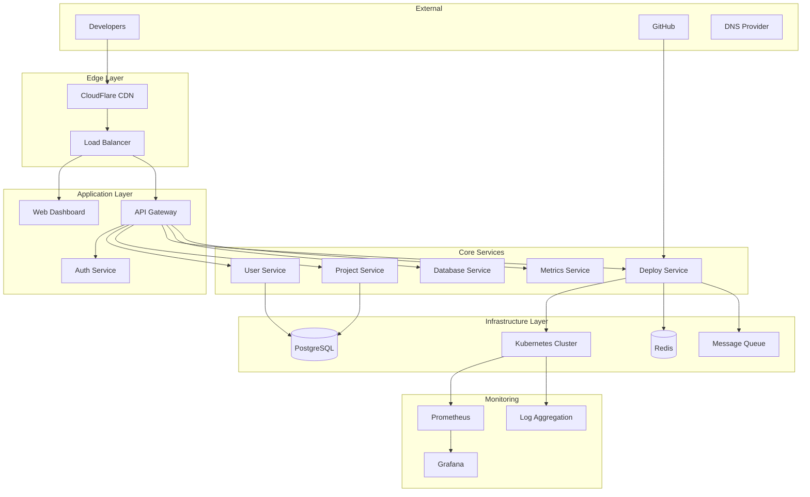

# Architecture Design: Railway.com-Like Platform

## 🏗️ System Architecture Overview

This document outlines the comprehensive system architecture for building a modern Platform-as-a-Service (PaaS) that provides seamless application deployment and management, similar to Railway.com.

## 🎯 Architectural Principles

### Design Philosophy
- **Developer Experience First**: Minimize complexity and maximize productivity
- **Cloud-Native**: Built for scalability, resilience, and modern infrastructure
- **Microservices Architecture**: Loosely coupled, independently deployable services
- **Event-Driven**: Asynchronous communication for better performance
- **Infrastructure as Code**: Everything automated and version-controlled

### Quality Attributes
- **Scalability**: Handle 10,000+ concurrent users and applications
- **Reliability**: 99.9% uptime with automatic failover
- **Security**: Enterprise-grade security with compliance standards
- **Performance**: Sub-second API responses and deployment times under 2 minutes
- **Maintainability**: Clean code, comprehensive testing, and documentation

## 🌐 High-Level Architecture



## 🔧 Detailed Component Architecture

### 1. Frontend Architecture (Web Dashboard)

#### Component Structure
```typescript
// Frontend Architecture - Next.js Application
src/
├── app/                    # Next.js 14+ App Router
│   ├── dashboard/          # Main dashboard pages
│   ├── projects/           # Project management
│   ├── deployments/        # Deployment history
│   └── settings/           # User settings
├── components/             # Reusable UI components
│   ├── ui/                 # Base UI components
│   ├── dashboard/          # Dashboard-specific components
│   └── deployments/        # Deployment-related components
├── hooks/                  # Custom React hooks
├── lib/                    # Utility functions
│   ├── api.ts             # API client configuration
│   ├── auth.ts            # Authentication logic
│   └── websocket.ts       # Real-time connections
└── stores/                # State management (Zustand)
    ├── user.ts
    ├── projects.ts
    └── deployments.ts
```

#### Real-Time Communication
```typescript
// WebSocket Implementation for Live Updates
class DeploymentSocket {
  private ws: WebSocket;
  
  constructor(projectId: string) {
    this.ws = new WebSocket(`wss://api.platform.com/ws/deployments/${projectId}`);
    this.setupEventHandlers();
  }
  
  private setupEventHandlers() {
    this.ws.onmessage = (event) => {
      const data = JSON.parse(event.data);
      switch (data.type) {
        case 'deployment_status':
          this.updateDeploymentStatus(data.payload);
          break;
        case 'build_logs':
          this.appendBuildLogs(data.payload);
          break;
        case 'metrics_update':
          this.updateMetrics(data.payload);
          break;
      }
    };
  }
}
```

### 2. API Gateway Architecture

#### Gateway Configuration
```yaml
# Kong API Gateway Configuration
services:
  - name: user-service
    url: http://user-service:8080
    routes:
      - name: user-routes
        paths: ["/api/v1/users"]
        
  - name: project-service
    url: http://project-service:8080
    routes:
      - name: project-routes
        paths: ["/api/v1/projects"]

plugins:
  - name: jwt
    config:
      key_claim_name: kid
      secret_is_base64: false
  - name: rate-limiting
    config:
      minute: 100
      hour: 1000
```

#### Authentication & Authorization
```go
// JWT Middleware Implementation
package middleware

import (
    "github.com/gin-gonic/gin"
    "github.com/golang-jwt/jwt/v5"
)

type AuthClaims struct {
    UserID string `json:"user_id"`
    Role   string `json:"role"`
    jwt.RegisteredClaims
}

func AuthMiddleware() gin.HandlerFunc {
    return func(c *gin.Context) {
        token := c.GetHeader("Authorization")
        if token == "" {
            c.JSON(401, gin.H{"error": "Authorization header required"})
            c.Abort()
            return
        }
        
        claims, err := validateJWT(token)
        if err != nil {
            c.JSON(401, gin.H{"error": "Invalid token"})
            c.Abort()
            return
        }
        
        c.Set("user_id", claims.UserID)
        c.Set("role", claims.Role)
        c.Next()
    }
}
```

### 3. Microservices Architecture

#### Service Breakdown
```yaml
microservices:
  user-service:
    responsibility: User management, authentication, profiles
    database: PostgreSQL (users table)
    external-apis: GitHub OAuth, Stripe
    
  project-service:
    responsibility: Project creation, configuration, repository management
    database: PostgreSQL (projects, environments tables)
    external-apis: GitHub API
    
  deployment-service:
    responsibility: Build orchestration, container management, deployments
    database: PostgreSQL (deployments table)
    external-apis: Kubernetes API, Docker Registry
    
  database-service:
    responsibility: Database provisioning, backups, monitoring
    database: PostgreSQL (database_instances table)
    external-apis: Cloud provider APIs
    
  metrics-service:
    responsibility: Application monitoring, resource usage, alerting
    database: InfluxDB (metrics), PostgreSQL (configurations)
    external-apis: Prometheus, Grafana
    
  billing-service:
    responsibility: Usage tracking, invoicing, subscription management
    database: PostgreSQL (billing, usage tables)
    external-apis: Stripe, tax services
```

#### Inter-Service Communication
```go
// Event-Driven Communication with NATS
package events

type DeploymentEvent struct {
    ProjectID    string    `json:"project_id"`
    DeploymentID string    `json:"deployment_id"`
    Status       string    `json:"status"`
    Timestamp    time.Time `json:"timestamp"`
}

func PublishDeploymentEvent(nc *nats.Conn, event DeploymentEvent) error {
    data, err := json.Marshal(event)
    if err != nil {
        return err
    }
    
    return nc.Publish("deployments.status", data)
}

func SubscribeToDeploymentEvents(nc *nats.Conn, handler func(DeploymentEvent)) error {
    _, err := nc.Subscribe("deployments.status", func(msg *nats.Msg) {
        var event DeploymentEvent
        if err := json.Unmarshal(msg.Data, &event); err == nil {
            handler(event)
        }
    })
    return err
}
```

### 4. Container Orchestration Architecture

#### Kubernetes Cluster Design
```yaml
# Cluster Architecture
cluster-configuration:
  control-plane:
    nodes: 3 (high availability)
    instance-type: t3.medium
    
  system-node-pool:
    purpose: Platform services (API, databases, monitoring)
    nodes: 3-5 (auto-scaling)
    instance-type: t3.large
    taints: [system=true:NoSchedule]
    
  user-app-node-pool:
    purpose: User applications
    nodes: 5-50 (auto-scaling)
    instance-type: t3.large
    labels: [workload-type=user-apps]
    
  storage:
    persistent-volumes: EBS CSI driver
    backup-strategy: Velero + S3
```

#### User Application Deployment
```yaml
# Dynamic Application Deployment Template
apiVersion: apps/v1
kind: Deployment
metadata:
  name: "{{.ProjectID}}-{{.Environment}}"
  namespace: "user-apps"
  labels:
    app: "{{.ProjectID}}"
    environment: "{{.Environment}}"
    managed-by: railway-platform
spec:
  replicas: {{.Replicas}}
  selector:
    matchLabels:
      app: "{{.ProjectID}}"
      environment: "{{.Environment}}"
  template:
    metadata:
      labels:
        app: "{{.ProjectID}}"
        environment: "{{.Environment}}"
    spec:
      containers:
      - name: app
        image: "{{.ImageRepository}}:{{.ImageTag}}"
        ports:
        - containerPort: {{.Port}}
        env:
        {{- range .EnvironmentVariables}}
        - name: "{{.Key}}"
          value: "{{.Value}}"
        {{- end}}
        resources:
          requests:
            memory: "{{.MemoryRequest}}"
            cpu: "{{.CPURequest}}"
          limits:
            memory: "{{.MemoryLimit}}"
            cpu: "{{.CPULimit}}"
```

#### Network Architecture
```yaml
# Network Policies and Ingress
apiVersion: networking.k8s.io/v1
kind: NetworkPolicy
metadata:
  name: user-app-isolation
  namespace: user-apps
spec:
  podSelector: {}
  policyTypes:
  - Ingress
  - Egress
  ingress:
  - from:
    - namespaceSelector:
        matchLabels:
          name: ingress-nginx
  egress:
  - to: []
    ports:
    - protocol: TCP
      port: 53
    - protocol: UDP
      port: 53
  - to:
    - namespaceSelector:
        matchLabels:
          name: platform-services
    ports:
    - protocol: TCP
      port: 5432  # PostgreSQL
    - protocol: TCP
      port: 6379  # Redis
```

### 5. Database Architecture

#### Data Model Design
```sql
-- Core Data Model
-- Users and Authentication
CREATE TABLE users (
    id UUID PRIMARY KEY DEFAULT gen_random_uuid(),
    email VARCHAR(255) UNIQUE NOT NULL,
    username VARCHAR(100) UNIQUE,
    github_id VARCHAR(255),
    avatar_url TEXT,
    subscription_tier VARCHAR(50) DEFAULT 'free',
    created_at TIMESTAMP DEFAULT NOW(),
    updated_at TIMESTAMP DEFAULT NOW()
);

-- Projects and Applications
CREATE TABLE projects (
    id UUID PRIMARY KEY DEFAULT gen_random_uuid(),
    user_id UUID REFERENCES users(id) ON DELETE CASCADE,
    name VARCHAR(255) NOT NULL,
    description TEXT,
    github_repo VARCHAR(500),
    github_branch VARCHAR(255) DEFAULT 'main',
    framework VARCHAR(100),
    build_command TEXT,
    start_command TEXT,
    environment_variables JSONB DEFAULT '{}',
    custom_domain VARCHAR(255),
    status VARCHAR(50) DEFAULT 'active',
    created_at TIMESTAMP DEFAULT NOW(),
    updated_at TIMESTAMP DEFAULT NOW()
);

-- Deployment History
CREATE TABLE deployments (
    id UUID PRIMARY KEY DEFAULT gen_random_uuid(),
    project_id UUID REFERENCES projects(id) ON DELETE CASCADE,
    commit_sha VARCHAR(40),
    commit_message TEXT,
    status VARCHAR(50) NOT NULL, -- pending, building, deploying, success, failed
    build_logs TEXT,
    deployment_url TEXT,
    build_duration INTEGER, -- seconds
    deploy_duration INTEGER, -- seconds
    created_at TIMESTAMP DEFAULT NOW(),
    completed_at TIMESTAMP
);

-- Database Instances (Provisioned databases)
CREATE TABLE database_instances (
    id UUID PRIMARY KEY DEFAULT gen_random_uuid(),
    project_id UUID REFERENCES projects(id) ON DELETE CASCADE,
    name VARCHAR(255) NOT NULL,
    engine VARCHAR(50) NOT NULL, -- postgresql, mysql, mongodb, redis
    version VARCHAR(20),
    connection_string TEXT,
    status VARCHAR(50) DEFAULT 'provisioning',
    storage_size_gb INTEGER DEFAULT 1,
    created_at TIMESTAMP DEFAULT NOW()
);

-- Resource Usage Tracking
CREATE TABLE resource_usage (
    id UUID PRIMARY KEY DEFAULT gen_random_uuid(),
    project_id UUID REFERENCES projects(id) ON DELETE CASCADE,
    measurement_time TIMESTAMP DEFAULT NOW(),
    cpu_usage_millicores INTEGER,
    memory_usage_bytes BIGINT,
    network_ingress_bytes BIGINT,
    network_egress_bytes BIGINT,
    storage_usage_bytes BIGINT,
    build_minutes INTEGER DEFAULT 0
);
```

#### Database Scaling Strategy
```yaml
database-scaling:
  read-replicas:
    - purpose: Analytics and reporting queries
    - lag-tolerance: 5 seconds
    - instance-count: 2-3
    
  connection-pooling:
    - tool: PgBouncer
    - max-connections: 100 per service
    - pool-mode: transaction
    
  backup-strategy:
    - frequency: Continuous WAL archiving
    - point-in-time-recovery: 30 days
    - cross-region-backup: Daily snapshots
    
  monitoring:
    - slow-query-log: Enabled (>1s queries)
    - connection-monitoring: Real-time
    - performance-insights: Enabled
```

### 6. CI/CD Pipeline Architecture

#### Build Pipeline Design
```yaml
# GitHub Actions Workflow for User Applications
name: Deploy to Railway Platform
on:
  push:
    branches: [main, develop]
  pull_request:
    branches: [main]

jobs:
  build-and-deploy:
    runs-on: ubuntu-latest
    steps:
    - name: Checkout code
      uses: actions/checkout@v4
      
    - name: Detect framework
      id: framework
      run: |
        if [ -f "package.json" ]; then
          echo "framework=nodejs" >> $GITHUB_OUTPUT
        elif [ -f "requirements.txt" ]; then
          echo "framework=python" >> $GITHUB_OUTPUT
        elif [ -f "go.mod" ]; then
          echo "framework=golang" >> $GITHUB_OUTPUT
        fi
        
    - name: Build Docker image
      run: |
        docker build -t ${{ secrets.REGISTRY_URL }}/${{ github.repository }}:${{ github.sha }} .
        
    - name: Push to registry
      run: |
        echo ${{ secrets.REGISTRY_TOKEN }} | docker login ${{ secrets.REGISTRY_URL }} -u ${{ secrets.REGISTRY_USER }} --password-stdin
        docker push ${{ secrets.REGISTRY_URL }}/${{ github.repository }}:${{ github.sha }}
        
    - name: Deploy to platform
      run: |
        curl -X POST ${{ secrets.PLATFORM_API_URL }}/deployments \
          -H "Authorization: Bearer ${{ secrets.PLATFORM_TOKEN }}" \
          -H "Content-Type: application/json" \
          -d '{
            "project_id": "${{ secrets.PROJECT_ID }}",
            "image": "${{ secrets.REGISTRY_URL }}/${{ github.repository }}:${{ github.sha }}",
            "commit_sha": "${{ github.sha }}"
          }'
```

#### Deployment Orchestration
```go
// Deployment Service Implementation
package deployment

type DeploymentOrchestrator struct {
    kubeClient     kubernetes.Interface
    registryClient RegistryClient
    gitClient      GitClient
    eventBus       EventBus
}

func (d *DeploymentOrchestrator) DeployApplication(ctx context.Context, req DeploymentRequest) error {
    // 1. Clone repository
    repo, err := d.gitClient.Clone(req.GitRepository, req.CommitSHA)
    if err != nil {
        return fmt.Errorf("failed to clone repository: %w", err)
    }
    
    // 2. Detect framework and create Dockerfile if needed
    dockerfile, err := d.generateDockerfile(repo)
    if err != nil {
        return fmt.Errorf("failed to generate Dockerfile: %w", err)
    }
    
    // 3. Build container image
    imageTag, err := d.buildImage(repo, dockerfile, req.ProjectID, req.CommitSHA)
    if err != nil {
        return fmt.Errorf("failed to build image: %w", err)
    }
    
    // 4. Push to registry
    if err := d.registryClient.Push(imageTag); err != nil {
        return fmt.Errorf("failed to push image: %w", err)
    }
    
    // 5. Deploy to Kubernetes
    deployment := d.generateDeploymentManifest(req, imageTag)
    if err := d.kubeClient.Apply(deployment); err != nil {
        return fmt.Errorf("failed to deploy to Kubernetes: %w", err)
    }
    
    // 6. Wait for rollout
    if err := d.waitForRollout(req.ProjectID); err != nil {
        return fmt.Errorf("deployment failed: %w", err)
    }
    
    // 7. Publish success event
    d.eventBus.Publish(DeploymentSuccessEvent{
        ProjectID:    req.ProjectID,
        DeploymentID: req.DeploymentID,
        ImageTag:     imageTag,
        Timestamp:    time.Now(),
    })
    
    return nil
}
```

### 7. Monitoring and Observability Architecture

#### Metrics Collection
```yaml
# Prometheus Configuration
global:
  scrape_interval: 15s
  evaluation_interval: 15s

scrape_configs:
  - job_name: 'kubernetes-pods'
    kubernetes_sd_configs:
    - role: pod
    relabel_configs:
    - source_labels: [__meta_kubernetes_pod_annotation_prometheus_io_scrape]
      action: keep
      regex: true
      
  - job_name: 'user-applications'
    kubernetes_sd_configs:
    - role: pod
      namespaces:
        names: ['user-apps']
    relabel_configs:
    - source_labels: [__meta_kubernetes_pod_label_managed_by]
      action: keep
      regex: railway-platform
```

#### Custom Metrics
```go
// Application Metrics
package metrics

import "github.com/prometheus/client_golang/prometheus"

var (
    DeploymentsTotal = prometheus.NewCounterVec(
        prometheus.CounterOpts{
            Name: "railway_deployments_total",
            Help: "Total number of deployments",
        },
        []string{"project_id", "status", "framework"},
    )
    
    DeploymentDuration = prometheus.NewHistogramVec(
        prometheus.HistogramOpts{
            Name:    "railway_deployment_duration_seconds",
            Help:    "Deployment duration in seconds",
            Buckets: prometheus.DefBuckets,
        },
        []string{"project_id", "stage"},
    )
    
    ActiveApplications = prometheus.NewGaugeVec(
        prometheus.GaugeOpts{
            Name: "railway_active_applications",
            Help: "Number of active applications",
        },
        []string{"user_tier"},
    )
)
```

## 🔒 Security Architecture

### Security Layers
```yaml
security-architecture:
  network-security:
    - vpc-isolation: Private subnets for databases
    - network-policies: Kubernetes NetworkPolicies
    - ingress-filtering: WAF and DDoS protection
    
  application-security:
    - authentication: OAuth2 + JWT
    - authorization: RBAC with fine-grained permissions
    - api-security: Rate limiting, input validation
    - secrets-management: Kubernetes Secrets + Vault
    
  container-security:
    - image-scanning: Trivy in CI/CD pipeline
    - runtime-security: Falco for threat detection
    - security-policies: Pod Security Standards
    
  data-security:
    - encryption-at-rest: Database and storage encryption
    - encryption-in-transit: TLS 1.3 everywhere
    - backup-encryption: Encrypted backups
```

### Compliance Framework
```yaml
compliance-requirements:
  soc2-type2:
    - access-controls: Multi-factor authentication
    - audit-logging: Comprehensive audit trails
    - incident-response: 24/7 monitoring and response
    
  gdpr:
    - data-protection: Encryption and pseudonymization
    - user-rights: Data export and deletion capabilities
    - privacy-by-design: Minimal data collection
    
  iso27001:
    - risk-management: Regular security assessments
    - business-continuity: Disaster recovery procedures
    - security-awareness: Team training programs
```

## 📈 Scalability Patterns

### Horizontal Scaling Strategy
```yaml
auto-scaling-configuration:
  application-pods:
    metric: CPU utilization
    target: 70%
    min-replicas: 2
    max-replicas: 50
    
  cluster-nodes:
    metric: Resource requests
    target: 80% node utilization
    min-nodes: 3
    max-nodes: 100
    scale-up-time: 2 minutes
    scale-down-time: 10 minutes
```

### Performance Optimization
```yaml
performance-strategies:
  caching:
    - api-responses: Redis with 5-minute TTL
    - database-queries: Application-level caching
    - static-assets: CDN with global edge locations
    
  database-optimization:
    - connection-pooling: PgBouncer
    - read-replicas: 3 read-only instances
    - query-optimization: Regular EXPLAIN analysis
    
  container-optimization:
    - image-size: Multi-stage builds, Alpine base
    - startup-time: Health check optimization
    - resource-limits: Right-sizing based on metrics
```

## 🔄 Navigation

**Previous**: [Technology Stack Analysis](./technology-stack-analysis.md) | **Next**: [Implementation Guide](./implementation-guide.md)

---

*Architecture Design | Research completed: January 2025*