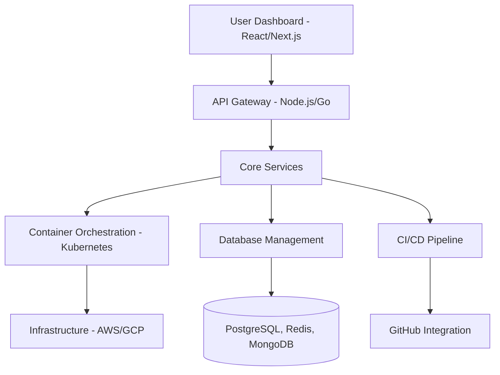

# Executive Summary: Building a Railway.com-Like Platform

## 🎯 Overview

Building a Platform-as-a-Service (PaaS) like Railway.com requires mastering a comprehensive technology stack spanning **Full Stack Web Development**, **DevOps**, **Cloud Infrastructure**, **Networking**, and **Security**. This research confirms that creating such a platform is an excellent vehicle for learning these interconnected disciplines while building a valuable product.

## 🔍 Key Findings

### 1. Multi-Disciplinary Requirements Confirmed ✅

**Yes, you will need to learn all mentioned areas:**

- **Full Stack Development** (40% of effort) - Critical for user-facing dashboard and APIs
- **DevOps & Cloud** (35% of effort) - Core platform functionality and infrastructure
- **Security & Networking** (15% of effort) - Essential for production readiness
- **Business & Operations** (10% of effort) - Sustainability and growth

### 2. Railway.com's Success Factors

Railway.com has gained traction by solving key developer pain points:

- **Developer Experience First**: Intuitive interface with minimal configuration
- **Modern Architecture**: Kubernetes-based infrastructure with automatic scaling
- **Comprehensive Database Support**: PostgreSQL, MySQL, MongoDB, Redis out-of-the-box
- **GitHub Integration**: Seamless CI/CD from repository to production
- **Transparent Pricing**: Usage-based billing without hidden costs

### 3. Technical Architecture Requirements



### 4. Minimum Viable Platform (MVP) Scope

**Core Features for MVP (6-12 months)**:
- GitHub repository deployment
- Container-based application hosting
- PostgreSQL database provisioning
- Basic monitoring and logging
- User authentication and project management
- Custom domain support

**Advanced Features (12-24 months)**:
- Auto-scaling and load balancing
- Multi-region deployments
- Advanced database options
- Team collaboration features
- Enterprise security compliance

## 📊 Technology Stack Recommendations

### Frontend Dashboard
```typescript
// Recommended Stack
- Framework: Next.js 14+ with TypeScript
- UI Library: Tailwind CSS + Headless UI
- State Management: Zustand or Redux Toolkit
- Charts/Metrics: Recharts or Chart.js
- Testing: Jest + React Testing Library
```

### Backend Services
```go
// Recommended Stack
- API Framework: Go (Gin/Fiber) or Node.js (Express/Fastify)
- Database: PostgreSQL + Redis
- Queue System: BullMQ or Celery
- Container Runtime: Docker + Kubernetes
- Message Broker: NATS or RabbitMQ
```

### Infrastructure & DevOps
```yaml
# Recommended Stack
Cloud Provider: AWS or Google Cloud Platform
Container Orchestration: Kubernetes (EKS/GKE)
CI/CD: GitHub Actions + ArgoCD
Infrastructure as Code: Terraform + Helm
Monitoring: Prometheus + Grafana + Jaeger
Logging: ELK Stack or Loki
```

## 🎓 Learning Path Priority

### Phase 1: Foundation (3-4 months)
1. **Full Stack Fundamentals**
   - React/Next.js for frontend development
   - Node.js/Express for backend APIs
   - PostgreSQL database design
   - Docker containerization basics

2. **Basic DevOps**
   - Git workflows and CI/CD concepts
   - Linux command line and shell scripting
   - Cloud platforms basics (AWS/GCP)

### Phase 2: Platform Development (6-8 months)
1. **Advanced Backend Development**
   - Microservices architecture
   - API design and GraphQL
   - Authentication and authorization
   - Database optimization and scaling

2. **Infrastructure & Deployment**
   - Kubernetes fundamentals
   - Infrastructure as Code (Terraform)
   - Container orchestration
   - Load balancing and networking

### Phase 3: Production & Scaling (4-6 months)
1. **Advanced DevOps & Security**
   - Monitoring and observability
   - Security best practices
   - Compliance and auditing
   - Disaster recovery

2. **Business & Operations**
   - Product management
   - Customer support systems
   - Billing and payment processing
   - Marketing and growth strategies

## 💰 Business Model Analysis

### Revenue Strategies
1. **Usage-Based Pricing** (Primary)
   - Compute resources (CPU/Memory)
   - Network bandwidth
   - Storage usage
   - Database connections

2. **Subscription Tiers** (Secondary)
   - Free tier: Limited resources for hobbyists
   - Pro tier: Enhanced features for professionals
   - Team tier: Collaboration features
   - Enterprise tier: Advanced security and compliance

### Market Opportunity
- **Addressable Market**: $32B cloud infrastructure market
- **Target Segment**: Individual developers and small-medium teams
- **Competitive Advantage**: Modern UX and developer-first approach

## ⚠️ Critical Success Factors

### Technical Excellence
- **Performance**: Sub-second deployment times
- **Reliability**: 99.9% uptime SLA
- **Security**: SOC 2 compliance and data encryption
- **Scalability**: Auto-scaling to handle traffic spikes

### Business Execution
- **Developer Community**: Active engagement and feedback loops
- **Documentation**: Comprehensive guides and tutorials
- **Support**: Responsive customer service
- **Pricing**: Competitive and transparent cost structure

## 🚀 Recommended Next Steps

### Immediate Actions (Next 30 days)
1. **Set up development environment**
   - Install Docker, Kubernetes (minikube), and cloud CLI tools
   - Create accounts on AWS/GCP and GitHub
   - Set up monitoring tools (Prometheus/Grafana)

2. **Build proof of concept**
   - Simple containerized application deployment
   - Basic database provisioning
   - Minimal web dashboard

3. **Study existing platforms**
   - Deploy applications on Railway, Heroku, and Vercel
   - Analyze their user experience and technical architecture
   - Identify improvement opportunities

### Medium-term Goals (3-6 months)
1. **Develop MVP features**
2. **Implement basic security measures**
3. **Create user documentation**
4. **Gather early user feedback**

### Long-term Vision (12-24 months)
1. **Scale infrastructure to support multiple users**
2. **Implement advanced features and integrations**
3. **Build sustainable business model**
4. **Consider enterprise features and compliance**

## 📈 Expected Outcomes

By completing this project, you will gain:

- **Technical Mastery**: Full stack development and modern DevOps practices
- **Product Experience**: End-to-end platform development and operations
- **Business Acumen**: SaaS business model and customer development
- **Portfolio Value**: Impressive project demonstrating comprehensive skills
- **Career Opportunities**: Qualification for senior developer and DevOps roles

---

**Conclusion**: Building a Railway.com-like platform is an ambitious but achievable goal that will provide comprehensive learning across all desired technical domains. The key to success is starting with a focused MVP and iteratively adding features while maintaining excellent developer experience.

## 🔄 Navigation

**Previous**: [Research Overview](./README.md) | **Next**: [Technology Stack Analysis](./technology-stack-analysis.md)

---

*Executive Summary | Research completed: January 2025*