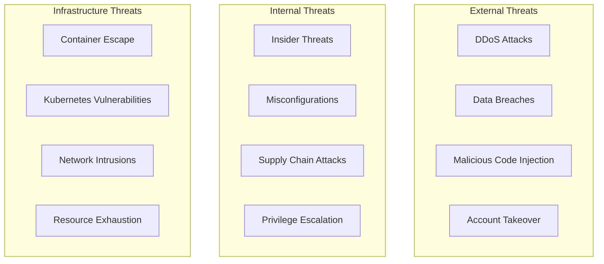

# Security Considerations: Railway.com-Like Platform

## 🔒 Security Overview

Building a Platform-as-a-Service requires implementing comprehensive security measures to protect user data, applications, and infrastructure. This document outlines essential security considerations, best practices, and implementation strategies for a Railway.com-like platform.

## 🎯 Security Principles

### Core Security Tenets
1. **Defense in Depth**: Multiple layers of security controls
2. **Principle of Least Privilege**: Minimal access rights for users and systems
3. **Zero Trust Architecture**: Never trust, always verify
4. **Security by Design**: Security considerations in every development phase
5. **Compliance First**: Built-in compliance with industry standards

### Threat Model


## 🔐 Authentication & Authorization

### OAuth 2.0 Implementation with PKCE
```typescript
// Secure OAuth 2.0 implementation
class SecureOAuthService {
  private readonly CLIENT_ID: string;
  private readonly REDIRECT_URI: string;
  private readonly SCOPES = ['read:user', 'user:email', 'repo'];

  constructor() {
    this.CLIENT_ID = process.env.GITHUB_CLIENT_ID!;
    this.REDIRECT_URI = process.env.OAUTH_REDIRECT_URI!;
  }

  // Generate cryptographically secure PKCE challenge
  private generatePKCEChallenge(): { verifier: string; challenge: string } {
    const verifier = crypto
      .randomBytes(32)
      .toString('base64url');
    
    const challenge = crypto
      .createHash('sha256')
      .update(verifier)
      .digest('base64url');
    
    return { verifier, challenge };
  }

  initiateAuthFlow(state?: string): { authUrl: string; state: string } {
    const { verifier, challenge } = this.generatePKCEChallenge();
    const secureState = state || crypto.randomUUID();
    
    // Store PKCE verifier securely (Redis with expiration)
    this.storeTemporaryData('code_verifier', verifier, 600); // 10 minutes
    this.storeTemporaryData('oauth_state', secureState, 600);
    
    const params = new URLSearchParams({
      response_type: 'code',
      client_id: this.CLIENT_ID,
      redirect_uri: this.REDIRECT_URI,
      scope: this.SCOPES.join(' '),
      state: secureState,
      code_challenge: challenge,
      code_challenge_method: 'S256'
    });

    return {
      authUrl: `https://github.com/login/oauth/authorize?${params}`,
      state: secureState
    };
  }

  async exchangeCodeForToken(code: string, state: string): Promise<TokenResponse> {
    // Validate state parameter
    const storedState = await this.getTemporaryData('oauth_state');
    if (storedState !== state) {
      throw new SecurityError('Invalid state parameter - possible CSRF attack');
    }

    const verifier = await this.getTemporaryData('code_verifier');
    if (!verifier) {
      throw new SecurityError('PKCE verifier not found');
    }

    // Exchange code for access token
    const tokenResponse = await fetch('https://github.com/login/oauth/access_token', {
      method: 'POST',
      headers: {
        'Accept': 'application/json',
        'Content-Type': 'application/json',
        'User-Agent': 'Railway-Platform/1.0'
      },
      body: JSON.stringify({
        client_id: this.CLIENT_ID,
        client_secret: process.env.GITHUB_CLIENT_SECRET,
        code,
        redirect_uri: this.REDIRECT_URI,
        code_verifier: verifier
      })
    });

    if (!tokenResponse.ok) {
      throw new SecurityError('Token exchange failed');
    }

    // Clean up temporary data
    await this.deleteTemporaryData('code_verifier');
    await this.deleteTemporaryData('oauth_state');

    return await tokenResponse.json();
  }
}
```

### JWT Token Security
```typescript
// Secure JWT implementation
interface JWTPayload {
  sub: string; // User ID
  email: string;
  role: string;
  iat: number;
  exp: number;
  aud: string; // Audience
  iss: string; // Issuer
  jti: string; // JWT ID for revocation
}

class JWTService {
  private readonly SECRET: string;
  private readonly ALGORITHM = 'HS256';
  private readonly ISSUER = 'railway-platform';
  private readonly AUDIENCE = 'railway-api';

  constructor() {
    this.SECRET = process.env.JWT_SECRET!;
    if (this.SECRET.length < 32) {
      throw new Error('JWT secret must be at least 32 characters');
    }
  }

  generateToken(user: User): string {
    const payload: JWTPayload = {
      sub: user.id,
      email: user.email,
      role: user.role,
      iat: Math.floor(Date.now() / 1000),
      exp: Math.floor(Date.now() / 1000) + (7 * 24 * 60 * 60), // 7 days
      aud: this.AUDIENCE,
      iss: this.ISSUER,
      jti: crypto.randomUUID()
    };

    return jwt.sign(payload, this.SECRET, { algorithm: this.ALGORITHM });
  }

  async validateToken(token: string): Promise<JWTPayload> {
    try {
      const payload = jwt.verify(token, this.SECRET, {
        algorithms: [this.ALGORITHM],
        audience: this.AUDIENCE,
        issuer: this.ISSUER
      }) as JWTPayload;

      // Check if token is revoked
      const isRevoked = await this.isTokenRevoked(payload.jti);
      if (isRevoked) {
        throw new SecurityError('Token has been revoked');
      }

      return payload;
    } catch (error) {
      if (error instanceof jwt.JsonWebTokenError) {
        throw new SecurityError('Invalid token');
      }
      throw error;
    }
  }

  async revokeToken(jti: string): Promise<void> {
    // Store revoked token ID in Redis with expiration
    await redis.setex(`revoked_token:${jti}`, 7 * 24 * 60 * 60, '1');
  }

  private async isTokenRevoked(jti: string): Promise<boolean> {
    const result = await redis.get(`revoked_token:${jti}`);
    return result === '1';
  }
}
```

### Role-Based Access Control (RBAC)
```typescript
// RBAC implementation
interface Permission {
  resource: string;
  action: string;
  conditions?: Record<string, any>;
}

interface Role {
  id: string;
  name: string;
  permissions: Permission[];
}

const ROLES: Record<string, Role> = {
  admin: {
    id: 'admin',
    name: 'Administrator',
    permissions: [
      { resource: '*', action: '*' }
    ]
  },
  user: {
    id: 'user',
    name: 'User',
    permissions: [
      { resource: 'project', action: 'create' },
      { resource: 'project', action: 'read', conditions: { owner: true } },
      { resource: 'project', action: 'update', conditions: { owner: true } },
      { resource: 'project', action: 'delete', conditions: { owner: true } },
      { resource: 'deployment', action: 'create', conditions: { project_owner: true } },
      { resource: 'deployment', action: 'read', conditions: { project_owner: true } }
    ]
  },
  readonly: {
    id: 'readonly',
    name: 'Read Only',
    permissions: [
      { resource: 'project', action: 'read', conditions: { shared: true } },
      { resource: 'deployment', action: 'read', conditions: { shared: true } }
    ]
  }
};

class AuthorizationService {
  async checkPermission(
    userId: string,
    resource: string,
    action: string,
    context: Record<string, any> = {}
  ): Promise<boolean> {
    const user = await this.getUser(userId);
    const role = ROLES[user.role];

    if (!role) return false;

    for (const permission of role.permissions) {
      if (this.matchesPermission(permission, resource, action, context, user)) {
        return true;
      }
    }

    return false;
  }

  private matchesPermission(
    permission: Permission,
    resource: string,
    action: string,
    context: Record<string, any>,
    user: User
  ): boolean {
    // Check resource match
    if (permission.resource !== '*' && permission.resource !== resource) {
      return false;
    }

    // Check action match
    if (permission.action !== '*' && permission.action !== action) {
      return false;
    }

    // Check conditions
    if (permission.conditions) {
      return this.evaluateConditions(permission.conditions, context, user);
    }

    return true;
  }

  private evaluateConditions(
    conditions: Record<string, any>,
    context: Record<string, any>,
    user: User
  ): boolean {
    for (const [key, value] of Object.entries(conditions)) {
      switch (key) {
        case 'owner':
          if (value && context.userId !== user.id) return false;
          break;
        case 'project_owner':
          if (value && !this.isProjectOwner(context.projectId, user.id)) return false;
          break;
        case 'shared':
          if (value && !this.isProjectShared(context.projectId, user.id)) return false;
          break;
        default:
          if (context[key] !== value) return false;
      }
    }
    return true;
  }
}
```

## 🔒 Infrastructure Security

### Container Security
```yaml
# Secure Pod Security Standards
apiVersion: v1
kind: Namespace
metadata:
  name: user-apps
  labels:
    pod-security.kubernetes.io/enforce: restricted
    pod-security.kubernetes.io/audit: restricted
    pod-security.kubernetes.io/warn: restricted

---
# Security Context for user applications
apiVersion: apps/v1
kind: Deployment
metadata:
  name: user-app-template
spec:
  template:
    spec:
      securityContext:
        runAsNonRoot: true
        runAsUser: 1001
        runAsGroup: 1001
        fsGroup: 1001
        seccompProfile:
          type: RuntimeDefault
      containers:
      - name: app
        securityContext:
          allowPrivilegeEscalation: false
          capabilities:
            drop:
            - ALL
          readOnlyRootFilesystem: true
          runAsNonRoot: true
          runAsUser: 1001
        resources:
          requests:
            memory: "64Mi"
            cpu: "50m"
          limits:
            memory: "512Mi"
            cpu: "500m"
        volumeMounts:
        - name: tmp-volume
          mountPath: /tmp
        - name: cache-volume
          mountPath: /app/.cache
      volumes:
      - name: tmp-volume
        emptyDir: {}
      - name: cache-volume
        emptyDir: {}
```

### Network Security Policies
```yaml
# Default deny all network policy
apiVersion: networking.k8s.io/v1
kind: NetworkPolicy
metadata:
  name: default-deny-all
  namespace: user-apps
spec:
  podSelector: {}
  policyTypes:
  - Ingress
  - Egress

---
# Allow ingress from load balancer
apiVersion: networking.k8s.io/v1
kind: NetworkPolicy
metadata:
  name: allow-ingress
  namespace: user-apps
spec:
  podSelector:
    matchLabels:
      app-type: user-application
  policyTypes:
  - Ingress
  ingress:
  - from:
    - namespaceSelector:
        matchLabels:
          name: ingress-nginx
    ports:
    - protocol: TCP
      port: 8080

---
# Allow egress to platform services
apiVersion: networking.k8s.io/v1
kind: NetworkPolicy
metadata:
  name: allow-platform-egress
  namespace: user-apps
spec:
  podSelector:
    matchLabels:
      app-type: user-application
  policyTypes:
  - Egress
  egress:
  # DNS resolution
  - to: []
    ports:
    - protocol: UDP
      port: 53
    - protocol: TCP
      port: 53
  # Platform database access
  - to:
    - namespaceSelector:
        matchLabels:
          name: platform-system
    ports:
    - protocol: TCP
      port: 5432
  # External HTTPS
  - to: []
    ports:
    - protocol: TCP
      port: 443
    - protocol: TCP
      port: 80
```

### Image Security Scanning
```yaml
# Trivy security scanning in CI/CD
name: Security Scan
on:
  push:
    branches: [main]
  pull_request:
    branches: [main]

jobs:
  security-scan:
    runs-on: ubuntu-latest
    steps:
    - uses: actions/checkout@v4
    
    - name: Build Docker image
      run: docker build -t test-image:${{ github.sha }} .
    
    - name: Run Trivy vulnerability scanner
      uses: aquasecurity/trivy-action@master
      with:
        image-ref: 'test-image:${{ github.sha }}'
        format: 'sarif'
        output: 'trivy-results.sarif'
        severity: 'CRITICAL,HIGH'
        exit-code: '1'
    
    - name: Upload Trivy scan results
      uses: github/codeql-action/upload-sarif@v2
      if: always()
      with:
        sarif_file: 'trivy-results.sarif'
    
    - name: Run Hadolint Dockerfile linter
      uses: hadolint/hadolint-action@v3.1.0
      with:
        dockerfile: Dockerfile
        failure-threshold: error
```

## 🔐 Data Protection & Privacy

### Encryption at Rest
```typescript
// Database encryption implementation
import crypto from 'crypto';

class EncryptionService {
  private readonly algorithm = 'aes-256-gcm';
  private readonly keyLength = 32;
  private readonly ivLength = 16;
  private readonly tagLength = 16;

  constructor(private readonly masterKey: string) {
    if (Buffer.from(masterKey, 'hex').length !== this.keyLength) {
      throw new Error('Master key must be 32 bytes (64 hex characters)');
    }
  }

  encrypt(plaintext: string): string {
    const iv = crypto.randomBytes(this.ivLength);
    const cipher = crypto.createCipher(this.algorithm, Buffer.from(this.masterKey, 'hex'));
    cipher.setAAD(Buffer.from('railway-platform'));

    let encrypted = cipher.update(plaintext, 'utf8');
    encrypted = Buffer.concat([encrypted, cipher.final()]);
    
    const tag = cipher.getAuthTag();
    
    // Combine IV + encrypted data + auth tag
    const combined = Buffer.concat([iv, encrypted, tag]);
    return combined.toString('base64');
  }

  decrypt(encryptedData: string): string {
    const combined = Buffer.from(encryptedData, 'base64');
    
    const iv = combined.subarray(0, this.ivLength);
    const encrypted = combined.subarray(this.ivLength, -this.tagLength);
    const tag = combined.subarray(-this.tagLength);
    
    const decipher = crypto.createDecipher(this.algorithm, Buffer.from(this.masterKey, 'hex'));
    decipher.setAAD(Buffer.from('railway-platform'));
    decipher.setAuthTag(tag);
    
    let decrypted = decipher.update(encrypted);
    decrypted = Buffer.concat([decrypted, decipher.final()]);
    
    return decrypted.toString('utf8');
  }
}

// Database model with field-level encryption
class SecureProjectModel {
  constructor(private encryption: EncryptionService) {}

  async create(projectData: ProjectData): Promise<Project> {
    const encrypted = {
      ...projectData,
      // Encrypt sensitive fields
      envVars: this.encryption.encrypt(JSON.stringify(projectData.envVars)),
      githubToken: projectData.githubToken ? 
        this.encryption.encrypt(projectData.githubToken) : null
    };

    return await prisma.project.create({ data: encrypted });
  }

  async findById(id: string): Promise<Project | null> {
    const project = await prisma.project.findUnique({ where: { id } });
    
    if (!project) return null;

    // Decrypt sensitive fields
    return {
      ...project,
      envVars: JSON.parse(this.encryption.decrypt(project.envVars)),
      githubToken: project.githubToken ? 
        this.encryption.decrypt(project.githubToken) : null
    };
  }
}
```

### GDPR Compliance Implementation
```typescript
// GDPR data management
interface GDPRDataRequest {
  userId: string;
  requestType: 'export' | 'delete' | 'rectify';
  requestedAt: Date;
  completedAt?: Date;
  status: 'pending' | 'processing' | 'completed' | 'failed';
}

class GDPRService {
  async handleDataExportRequest(userId: string): Promise<string> {
    const request = await this.createDataRequest(userId, 'export');
    
    try {
      // Collect all user data
      const userData = await this.collectUserData(userId);
      
      // Generate export file
      const exportData = {
        user: userData.user,
        projects: userData.projects,
        deployments: userData.deployments,
        usage: userData.usage,
        exportedAt: new Date().toISOString(),
        dataRetentionPolicy: 'Data will be retained for 90 days after account deletion'
      };
      
      const exportFile = JSON.stringify(exportData, null, 2);
      const filePath = await this.saveExportFile(userId, exportFile);
      
      await this.markRequestCompleted(request.id);
      
      return filePath;
    } catch (error) {
      await this.markRequestFailed(request.id, error.message);
      throw error;
    }
  }

  async handleDataDeletionRequest(userId: string): Promise<void> {
    const request = await this.createDataRequest(userId, 'delete');
    
    try {
      // Delete user data in correct order to maintain referential integrity
      await prisma.$transaction(async (tx) => {
        // Delete deployments first
        await tx.deployment.deleteMany({
          where: { project: { userId } }
        });
        
        // Delete projects
        await tx.project.deleteMany({
          where: { userId }
        });
        
        // Delete usage data
        await tx.resourceUsage.deleteMany({
          where: { userId }
        });
        
        // Anonymize audit logs (keep for compliance but remove PII)
        await tx.auditLog.updateMany({
          where: { userId },
          data: {
            userId: 'DELETED_USER',
            userEmail: 'deleted@privacy.local'
          }
        });
        
        // Finally delete user account
        await tx.user.delete({
          where: { id: userId }
        });
      });

      await this.markRequestCompleted(request.id);
    } catch (error) {
      await this.markRequestFailed(request.id, error.message);
      throw error;
    }
  }

  private async collectUserData(userId: string) {
    return {
      user: await prisma.user.findUnique({
        where: { id: userId },
        select: {
          id: true,
          email: true,
          username: true,
          createdAt: true,
          updatedAt: true,
          tier: true
        }
      }),
      projects: await prisma.project.findMany({
        where: { userId },
        include: {
          deployments: {
            select: {
              id: true,
              status: true,
              createdAt: true,
              completedAt: true
            }
          }
        }
      }),
      usage: await prisma.resourceUsage.findMany({
        where: { userId },
        orderBy: { measurementTime: 'desc' },
        take: 1000 // Last 1000 measurements
      })
    };
  }
}
```

## 🛡️ Application Security

### Input Validation & Sanitization
```typescript
// Comprehensive input validation
import { z } from 'zod';
import DOMPurify from 'isomorphic-dompurify';

// Validation schemas
const CreateProjectSchema = z.object({
  name: z.string()
    .min(1, 'Project name is required')
    .max(100, 'Project name must be less than 100 characters')
    .regex(/^[a-zA-Z0-9-_\s]+$/, 'Project name contains invalid characters'),
  
  description: z.string()
    .max(500, 'Description must be less than 500 characters')
    .optional(),
  
  githubRepo: z.string()
    .url('Invalid GitHub repository URL')
    .regex(/^https:\/\/github\.com\/[\w\-\.]+\/[\w\-\.]+$/, 'Invalid GitHub repository format')
    .optional(),
  
  framework: z.enum(['nodejs', 'python', 'golang', 'rust', 'php'])
    .optional(),
  
  envVars: z.record(z.string(), z.string())
    .refine(
      (vars) => Object.keys(vars).every(key => /^[A-Z_][A-Z0-9_]*$/.test(key)),
      'Environment variable names must be uppercase with underscores'
    )
    .optional()
});

class InputValidationService {
  static validateAndSanitize<T>(data: unknown, schema: z.ZodSchema<T>): T {
    // First, sanitize string inputs
    const sanitized = this.sanitizeObject(data);
    
    // Then validate against schema
    const result = schema.safeParse(sanitized);
    
    if (!result.success) {
      throw new ValidationError('Invalid input data', result.error.issues);
    }
    
    return result.data;
  }

  private static sanitizeObject(obj: any): any {
    if (typeof obj === 'string') {
      return DOMPurify.sanitize(obj.trim());
    }
    
    if (Array.isArray(obj)) {
      return obj.map(item => this.sanitizeObject(item));
    }
    
    if (obj && typeof obj === 'object') {
      const sanitized: any = {};
      for (const [key, value] of Object.entries(obj)) {
        sanitized[key] = this.sanitizeObject(value);
      }
      return sanitized;
    }
    
    return obj;
  }

  // SQL injection prevention (with Prisma this is mostly handled, but good to have)
  static sanitizeForSQL(input: string): string {
    return input.replace(/['";\\]/g, '');
  }

  // Command injection prevention
  static sanitizeForShell(input: string): string {
    return input.replace(/[;&|`$()]/g, '');
  }
}

// Usage in API routes
app.post('/api/projects', authMiddleware, async (req, res) => {
  try {
    const validatedData = InputValidationService.validateAndSanitize(
      req.body,
      CreateProjectSchema
    );
    
    const project = await projectService.create(req.user.id, validatedData);
    res.status(201).json(project);
  } catch (error) {
    if (error instanceof ValidationError) {
      res.status(400).json({ error: error.message, details: error.details });
    } else {
      res.status(500).json({ error: 'Internal server error' });
    }
  }
});
```

### API Rate Limiting & DDoS Protection
```typescript
// Advanced rate limiting
import rateLimit from 'express-rate-limit';
import slowDown from 'express-slow-down';
import { createClient } from 'redis';

const redisClient = createClient({
  url: process.env.REDIS_URL
});

// Tiered rate limiting based on user tier
const createRateLimiter = (tier: string) => {
  const configs = {
    free: { windowMs: 15 * 60 * 1000, max: 100 },
    pro: { windowMs: 15 * 60 * 1000, max: 1000 },
    enterprise: { windowMs: 15 * 60 * 1000, max: 10000 }
  };

  const config = configs[tier] || configs.free;

  return rateLimit({
    windowMs: config.windowMs,
    max: config.max,
    message: `Too many requests for ${tier} tier`,
    standardHeaders: true,
    legacyHeaders: false,
    store: new RedisStore({
      client: redisClient,
      prefix: `rl:${tier}:`
    }),
    keyGenerator: (req) => {
      // Use user ID if authenticated, otherwise IP
      return req.user?.id || req.ip;
    }
  });
};

// Progressive delay for repeated requests
const speedLimiter = slowDown({
  windowMs: 15 * 60 * 1000,
  delayAfter: 50,
  delayMs: 500,
  maxDelayMs: 10000
});

// Deployment-specific rate limiting (expensive operations)
const deploymentLimiter = rateLimit({
  windowMs: 60 * 60 * 1000, // 1 hour
  max: (req) => {
    const tier = req.user?.tier || 'free';
    const limits = { free: 10, pro: 100, enterprise: 1000 };
    return limits[tier] || limits.free;
  },
  message: 'Deployment limit exceeded for your tier',
  skipSuccessfulRequests: true
});

// Apply rate limiting middleware
app.use('/api/', (req, res, next) => {
  const tier = req.user?.tier || 'free';
  const limiter = createRateLimiter(tier);
  limiter(req, res, next);
});

app.use('/api/', speedLimiter);
app.use('/api/deployments', deploymentLimiter);
```

### Security Headers & CORS
```typescript
// Security headers middleware
import helmet from 'helmet';

app.use(helmet({
  contentSecurityPolicy: {
    directives: {
      defaultSrc: ["'self'"],
      styleSrc: ["'self'", "'unsafe-inline'", "https://fonts.googleapis.com"],
      fontSrc: ["'self'", "https://fonts.gstatic.com"],
      imgSrc: ["'self'", "data:", "https:", "blob:"],
      scriptSrc: ["'self'"],
      connectSrc: ["'self'", "wss:", "https://api.github.com"],
      frameSrc: ["'none'"],
      objectSrc: ["'none'"],
      upgradeInsecureRequests: []
    }
  },
  crossOriginEmbedderPolicy: false, // Allow iframe embedding for dashboard
  hsts: {
    maxAge: 31536000,
    includeSubDomains: true,
    preload: true
  }
}));

// CORS configuration
const corsOptions = {
  origin: (origin: string, callback: Function) => {
    const allowedOrigins = [
      process.env.FRONTEND_URL,
      'https://railway-platform.com',
      'https://app.railway-platform.com'
    ];
    
    if (!origin || allowedOrigins.includes(origin)) {
      callback(null, true);
    } else {
      callback(new Error('Not allowed by CORS'));
    }
  },
  credentials: true,
  methods: ['GET', 'POST', 'PUT', 'DELETE', 'OPTIONS'],
  allowedHeaders: ['Content-Type', 'Authorization', 'X-Requested-With'],
  maxAge: 86400 // 24 hours
};

app.use(cors(corsOptions));
```

## 🔍 Security Monitoring & Incident Response

### Security Event Logging
```typescript
// Comprehensive security logging
interface SecurityEvent {
  id: string;
  type: SecurityEventType;
  severity: 'low' | 'medium' | 'high' | 'critical';
  userId?: string;
  ip: string;
  userAgent: string;
  details: Record<string, any>;
  timestamp: Date;
}

enum SecurityEventType {
  LOGIN_SUCCESS = 'login_success',
  LOGIN_FAILURE = 'login_failure',
  TOKEN_REFRESH = 'token_refresh',
  PASSWORD_CHANGE = 'password_change',
  PERMISSION_DENIED = 'permission_denied',
  SUSPICIOUS_ACTIVITY = 'suspicious_activity',
  DATA_ACCESS = 'data_access',
  CONFIGURATION_CHANGE = 'configuration_change'
}

class SecurityLogger {
  async logEvent(event: Omit<SecurityEvent, 'id' | 'timestamp'>): Promise<void> {
    const securityEvent: SecurityEvent = {
      ...event,
      id: crypto.randomUUID(),
      timestamp: new Date()
    };

    // Store in database
    await prisma.securityEvent.create({ data: securityEvent });

    // Send to SIEM system
    await this.sendToSIEM(securityEvent);

    // Alert on critical events
    if (securityEvent.severity === 'critical') {
      await this.sendSecurityAlert(securityEvent);
    }
  }

  private async sendToSIEM(event: SecurityEvent): Promise<void> {
    // Send to external SIEM (Splunk, ELK, etc.)
    await fetch(process.env.SIEM_WEBHOOK_URL!, {
      method: 'POST',
      headers: { 'Content-Type': 'application/json' },
      body: JSON.stringify(event)
    });
  }

  private async sendSecurityAlert(event: SecurityEvent): Promise<void> {
    // Send to incident response team
    await this.notificationService.sendAlert({
      channel: 'security',
      severity: event.severity,
      title: `Security Event: ${event.type}`,
      description: JSON.stringify(event.details, null, 2),
      metadata: {
        userId: event.userId,
        ip: event.ip,
        timestamp: event.timestamp
      }
    });
  }
}

// Security middleware for request logging
const securityLoggingMiddleware = (logger: SecurityLogger) => {
  return async (req: Request, res: Response, next: NextFunction) => {
    const startTime = Date.now();

    res.on('finish', async () => {
      const duration = Date.now() - startTime;
      
      // Log suspicious patterns
      if (res.statusCode === 401 || res.statusCode === 403) {
        await logger.logEvent({
          type: SecurityEventType.PERMISSION_DENIED,
          severity: 'medium',
          userId: req.user?.id,
          ip: req.ip,
          userAgent: req.get('User-Agent') || '',
          details: {
            method: req.method,
            path: req.path,
            statusCode: res.statusCode,
            duration
          }
        });
      }

      // Log data access
      if (req.method === 'GET' && req.path.includes('/api/projects')) {
        await logger.logEvent({
          type: SecurityEventType.DATA_ACCESS,
          severity: 'low',
          userId: req.user?.id,
          ip: req.ip,
          userAgent: req.get('User-Agent') || '',
          details: {
            resource: 'projects',
            action: 'read'
          }
        });
      }
    });

    next();
  };
};
```

### Vulnerability Scanning & Compliance
```yaml
# Automated security scanning pipeline
name: Security Compliance
on:
  schedule:
    - cron: '0 2 * * *' # Daily at 2 AM
  push:
    branches: [main]

jobs:
  vulnerability-scan:
    runs-on: ubuntu-latest
    steps:
    - uses: actions/checkout@v4
    
    - name: OWASP ZAP Baseline Scan
      uses: zaproxy/action-baseline@v0.7.0
      with:
        target: 'https://api.railway-platform.com'
        rules_file_name: '.zap/rules.tsv'
        cmd_options: '-a'
    
    - name: Run Bandit Security Linter (Python)
      run: |
        pip install bandit
        bandit -r . -f json -o bandit-report.json
    
    - name: Run Semgrep SAST
      uses: returntocorp/semgrep-action@v1
      with:
        config: auto
        generateSarif: "1"
    
    - name: Upload SARIF file
      uses: github/codeql-action/upload-sarif@v2
      with:
        sarif_file: semgrep.sarif

  compliance-check:
    runs-on: ubuntu-latest
    steps:
    - uses: actions/checkout@v4
    
    - name: SOC 2 Compliance Check
      run: |
        # Check for required security controls
        echo "Checking encryption at rest..."
        grep -r "encrypt" config/ || echo "Warning: Encryption not configured"
        
        echo "Checking access controls..."
        grep -r "rbac\|role" src/ || echo "Warning: RBAC not implemented"
        
        echo "Checking audit logging..."
        grep -r "audit\|log" src/ || echo "Warning: Audit logging not found"
    
    - name: GDPR Compliance Check
      run: |
        echo "Checking data retention policies..."
        find . -name "*.md" -exec grep -l "retention\|gdpr" {} \;
        
        echo "Checking privacy controls..."
        grep -r "consent\|privacy" src/ || echo "Warning: Privacy controls not found"
```

## 🚨 Incident Response Plan

### Security Incident Classification
```yaml
# Incident severity levels
P1_CRITICAL:
  description: "Active security breach, data compromise, or complete service outage"
  response_time: "15 minutes"
  escalation: "Immediate - CEO, CTO, Security Team"
  
P2_HIGH:
  description: "Suspected security incident, partial service disruption"
  response_time: "1 hour"
  escalation: "Security Team, Engineering Manager"
  
P3_MEDIUM:
  description: "Security vulnerability discovered, minor service impact"
  response_time: "4 hours"
  escalation: "Security Team"
  
P4_LOW:
  description: "Security improvement needed, no immediate threat"
  response_time: "24 hours"
  escalation: "Security Team (next business day)"
```

### Incident Response Playbook
```typescript
// Automated incident response
interface SecurityIncident {
  id: string;
  severity: 'P1' | 'P2' | 'P3' | 'P4';
  type: string;
  description: string;
  affectedSystems: string[];
  detectedAt: Date;
  status: 'detected' | 'investigating' | 'contained' | 'resolved';
}

class IncidentResponseService {
  async handleSecurityIncident(incident: SecurityIncident): Promise<void> {
    // Log incident
    await this.logIncident(incident);
    
    // Immediate response based on severity
    switch (incident.severity) {
      case 'P1':
        await this.handleCriticalIncident(incident);
        break;
      case 'P2':
        await this.handleHighIncident(incident);
        break;
      default:
        await this.handleStandardIncident(incident);
    }
  }

  private async handleCriticalIncident(incident: SecurityIncident): Promise<void> {
    // 1. Immediate containment
    await this.enableMaintenanceMode();
    await this.revokeAllActiveSessions();
    
    // 2. Alert incident response team
    await this.alertIncidentTeam(incident, ['ceo', 'cto', 'security-team']);
    
    // 3. Preserve evidence
    await this.captureSystemState();
    
    // 4. Begin investigation
    await this.startInvestigation(incident);
  }

  private async enableMaintenanceMode(): Promise<void> {
    // Temporarily disable all API endpoints except health checks
    await redis.set('maintenance_mode', 'true', 'EX', 3600); // 1 hour
  }

  private async revokeAllActiveSessions(): Promise<void> {
    // Add all current JWT tokens to revocation list
    const activeTokens = await this.getActiveTokens();
    for (const token of activeTokens) {
      await this.jwtService.revokeToken(token.jti);
    }
  }

  private async captureSystemState(): Promise<void> {
    // Capture logs, metrics, and system state for forensics
    const timestamp = new Date().toISOString();
    
    // Export recent logs
    await this.exportLogs(`incident-logs-${timestamp}.json`);
    
    // Capture database state
    await this.createDatabaseSnapshot(`incident-db-${timestamp}`);
    
    // Export Kubernetes state
    await this.exportKubernetesState(`incident-k8s-${timestamp}.yaml`);
  }
}
```

## 📊 Compliance & Certifications

### SOC 2 Type II Preparation
```typescript
// SOC 2 control implementation
interface SOC2Control {
  id: string;
  category: 'CC' | 'A' | 'PI' | 'C' | 'P'; // Common Criteria, Availability, Processing Integrity, Confidentiality, Privacy
  description: string;
  implemented: boolean;
  evidence: string[];
  lastReviewed: Date;
}

const SOC2_CONTROLS: SOC2Control[] = [
  {
    id: 'CC1.1',
    category: 'CC',
    description: 'The entity demonstrates a commitment to integrity and ethical values',
    implemented: true,
    evidence: ['code-of-conduct.pdf', 'ethics-training-records.xlsx'],
    lastReviewed: new Date('2024-01-15')
  },
  {
    id: 'CC6.1',
    category: 'CC',
    description: 'The entity implements logical access security software',
    implemented: true,
    evidence: ['rbac-implementation.md', 'access-control-tests.json'],
    lastReviewed: new Date('2024-01-20')
  },
  {
    id: 'A1.1',
    category: 'A',
    description: 'The entity maintains defined system availability and related commitments',
    implemented: true,
    evidence: ['sla-documentation.pdf', 'uptime-reports.json'],
    lastReviewed: new Date('2024-01-18')
  }
];

class ComplianceService {
  async generateSOC2Report(): Promise<ComplianceReport> {
    const report: ComplianceReport = {
      generatedAt: new Date(),
      period: {
        start: new Date('2024-01-01'),
        end: new Date('2024-12-31')
      },
      controls: [],
      overallStatus: 'compliant'
    };

    for (const control of SOC2_CONTROLS) {
      const status = await this.assessControl(control);
      report.controls.push(status);
      
      if (!status.compliant) {
        report.overallStatus = 'non-compliant';
      }
    }

    return report;
  }

  private async assessControl(control: SOC2Control): Promise<ControlAssessment> {
    // Automated compliance checking
    const tests = await this.runComplianceTests(control.id);
    const manualReview = await this.getManualReviewStatus(control.id);

    return {
      controlId: control.id,
      compliant: control.implemented && tests.passed && manualReview.approved,
      testResults: tests,
      evidence: control.evidence,
      recommendations: tests.passed ? [] : tests.failures.map(f => f.recommendation)
    };
  }
}
```

## 🔄 Security Best Practices Checklist

### Development Security
- [ ] **Secure coding practices** implemented
- [ ] **Static Application Security Testing (SAST)** in CI/CD
- [ ] **Dynamic Application Security Testing (DAST)** automated
- [ ] **Dependency vulnerability scanning** enabled
- [ ] **Security code reviews** mandatory
- [ ] **Secrets management** with rotation policies
- [ ] **Input validation and sanitization** comprehensive

### Infrastructure Security
- [ ] **Network segmentation** with security groups
- [ ] **Encryption at rest** for all data stores
- [ ] **Encryption in transit** (TLS 1.3) everywhere
- [ ] **Container security** scanning and hardening
- [ ] **Kubernetes security** policies enforced
- [ ] **Infrastructure as Code** security scanning
- [ ] **Regular security patching** automated

### Operational Security
- [ ] **Security monitoring** and alerting 24/7
- [ ] **Incident response plan** tested quarterly
- [ ] **Access control reviews** conducted monthly
- [ ] **Vulnerability assessments** performed quarterly
- [ ] **Penetration testing** conducted annually
- [ ] **Security awareness training** for all staff
- [ ] **Backup and disaster recovery** tested regularly

### Compliance & Governance
- [ ] **Privacy policy** and terms of service current
- [ ] **GDPR compliance** measures implemented
- [ ] **SOC 2 Type II** audit in progress/completed
- [ ] **Data retention policies** defined and enforced
- [ ] **Vendor security assessments** completed
- [ ] **Security documentation** maintained and current
- [ ] **Compliance reporting** automated where possible

## 🔄 Navigation

**Previous**: [Learning Roadmap](./learning-roadmap.md) | **Next**: [Best Practices](./best-practices.md)

---

*Security Considerations | Research completed: January 2025*