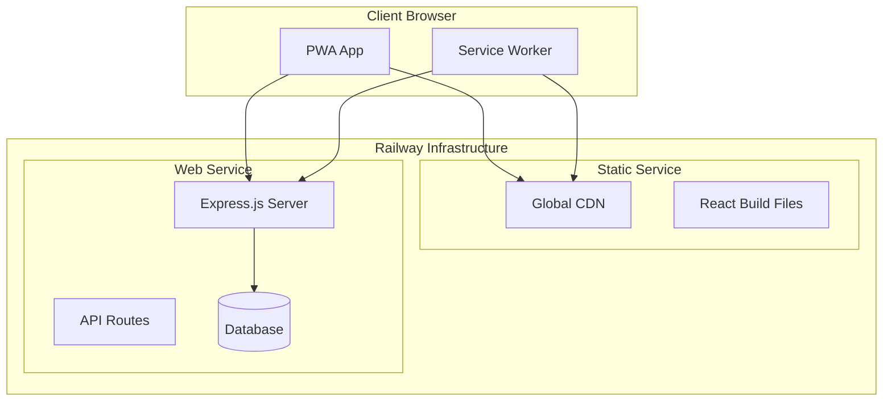
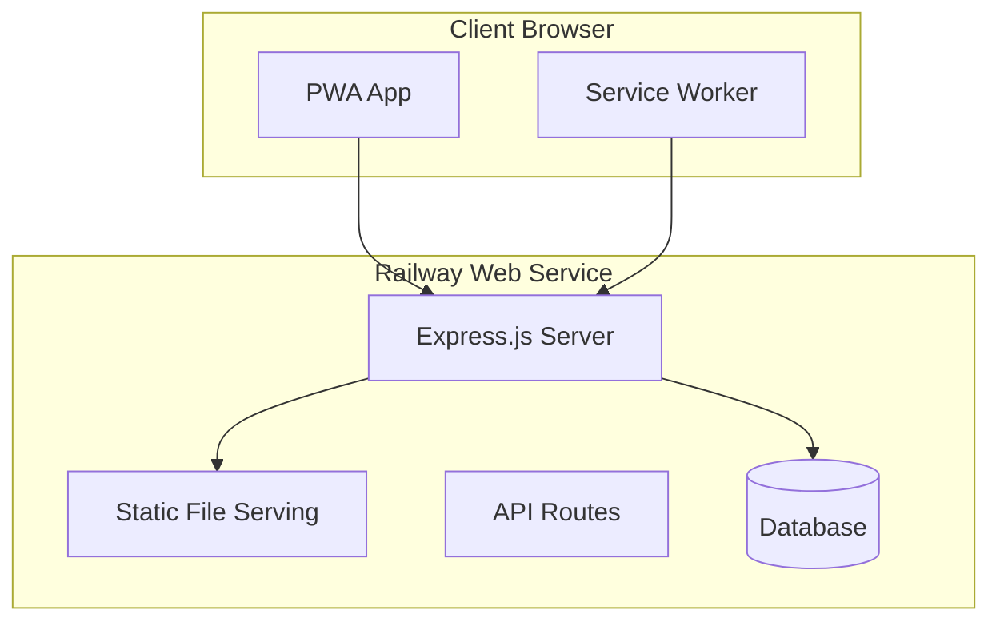

# Deployment Strategies Comparison

## 📊 Strategic Overview

This document provides a comprehensive comparison of two deployment approaches for Nx React/Express applications on Railway.com, specifically optimized for small clinic management systems.

## 🏗️ Architecture Comparison

### Option 1: Separate Deployments



### Option 2: Single Deployment



## 🔍 Detailed Analysis

### Option 1: Separate Deployments

#### Architecture Components

```typescript
// Frontend Deployment (Static Site)
// Build output: dist/apps/frontend/
export default {
  build: {
    outDir: 'dist',
    assetsDir: 'assets',
    rollupOptions: {
      output: {
        manualChunks: {
          vendor: ['react', 'react-dom'],
          utils: ['date-fns', 'lodash']
        }
      }
    }
  }
}

// Backend Deployment (Web Service)
// Express server configuration
app.use('/api', cors({
  origin: process.env.FRONTEND_URL,
  credentials: true
}));

app.use('/api/auth', authRoutes);
app.use('/api/patients', patientRoutes);
app.use('/api/appointments', appointmentRoutes);
```

#### Implementation Details

**Frontend Service Configuration:**
```yaml
# railway.toml (Frontend)
[build]
  builder = "NIXPACKS"
  buildCommand = "npx nx build frontend --prod"
  publishDir = "dist/apps/frontend"

[deploy]
  serviceType = "static"
```

**Backend Service Configuration:**
```yaml
# railway.toml (Backend)
[build]
  builder = "NIXPACKS"
  buildCommand = "npx nx build backend --prod"

[deploy]
  startCommand = "node dist/apps/backend/main.js"
  healthcheckPath = "/api/health"
```

#### Pros ✅

1. **Service Isolation**
   - Independent scaling of frontend and backend
   - Frontend served via global CDN for faster load times
   - Backend can be optimized specifically for API performance

2. **Technology Flexibility**
   - Can use different technologies for each service
   - Frontend deployment optimized for static assets
   - Backend optimized for server-side processing

3. **Caching Strategy**
   - Frontend assets cached at CDN edge locations
   - API responses can have different caching strategies
   - Browser caching optimized per service type

4. **Development Workflow**
   - Independent deployment pipelines
   - Frontend can be deployed without backend changes
   - Easier to implement feature flags per service

#### Cons ❌

1. **Cross-Origin Complexity**
   ```typescript
   // CORS configuration required
   app.use(cors({
     origin: ['https://clinic-frontend.railway.app'],
     credentials: true,
     methods: ['GET', 'POST', 'PUT', 'DELETE'],
     allowedHeaders: ['Content-Type', 'Authorization']
   }));
   ```

2. **Network Latency**
   - Additional DNS lookup for API calls
   - Potential for cross-origin request overhead
   - No HTTP/2 connection reuse between services

3. **Cost Implications**
   - Two separate Railway services ($5 base cost each)
   - Potential data transfer charges between services
   - Separate monitoring and alerting costs

4. **PWA Complexity**
   ```typescript
   // Service worker must handle cross-origin requests
   self.addEventListener('fetch', event => {
     if (event.request.url.includes('/api/')) {
       // Handle API requests differently
       event.respondWith(handleApiRequest(event.request));
     } else {
       // Handle static assets
       event.respondWith(handleStaticRequest(event.request));
     }
   });
   ```

### Option 2: Single Deployment

#### Architecture Components

```typescript
// Express.js serving React application
import express from 'express';
import path from 'path';

const app = express();

// API routes first
app.use('/api', apiRoutes);

// Serve static files from React build
app.use(express.static(path.join(__dirname, '../frontend')));

// SPA fallback - send index.html for client-side routing
app.get('*', (req, res) => {
  res.sendFile(path.join(__dirname, '../frontend/index.html'));
});
```

#### Implementation Details

**Single Service Configuration:**
```yaml
# railway.toml
[build]
  builder = "NIXPACKS"
  buildCommand = "npx nx build frontend --prod && npx nx build backend --prod"

[deploy]
  startCommand = "node dist/apps/backend/main.js"
  healthcheckPath = "/health"

[environment]
  NODE_ENV = "production"
  SERVE_STATIC = "true"
```

**Nx Build Configuration:**
```json
{
  "targets": {
    "build": {
      "executor": "@nrwl/webpack:webpack",
      "options": {
        "outputPath": "dist/apps/backend",
        "main": "apps/backend/src/main.ts",
        "assets": [
          {
            "glob": "**/*",
            "input": "dist/apps/frontend",
            "output": "frontend"
          }
        ]
      }
    }
  }
}
```

#### Pros ✅

1. **Simplified Architecture**
   - Single Railway service to manage
   - Unified deployment pipeline
   - Shared SSL certificate and domain

2. **Performance Benefits**
   ```typescript
   // Optimized static file serving
   app.use(express.static('frontend', {
     maxAge: '1y', // Cache static assets for 1 year
     etag: true,
     immutable: true,
     setHeaders: (res, path) => {
       if (path.endsWith('.html')) {
         res.setHeader('Cache-Control', 'no-cache');
       }
     }
   }));
   ```

3. **Cost Efficiency**
   - Single Railway service ($5 base cost)
   - No cross-service data transfer charges
   - Shared resource utilization

4. **PWA Implementation**
   ```typescript
   // Simplified service worker registration
   if ('serviceWorker' in navigator) {
     navigator.serviceWorker.register('/sw.js')
       .then(registration => {
         console.log('SW registered:', registration);
       });
   }

   // Service worker can cache both static and API resources from same origin
   const CACHE_NAME = 'clinic-app-v1';
   const urlsToCache = [
     '/',
     '/static/js/bundle.js',
     '/static/css/main.css',
     '/api/user/profile'
   ];
   ```

5. **Development Experience**
   ```typescript
   // Unified error handling
   app.use((err, req, res, next) => {
     logger.error('Application error:', err);
     
     if (req.path.startsWith('/api/')) {
       res.status(500).json({ error: 'Internal server error' });
     } else {
       res.sendFile(path.join(__dirname, 'frontend/error.html'));
     }
   });
   ```

#### Cons ❌

1. **Resource Sharing**
   - Frontend and backend compete for same CPU/memory
   - No independent scaling of services
   - Potential for resource contention during high load

2. **Technology Constraints**
   - Must use Node.js/Express for serving static files
   - Cannot leverage specialized CDN features
   - Limited caching strategy options

3. **Single Point of Failure**
   - Entire application depends on one service
   - Backend issues affect frontend availability
   - Deployment issues impact both components

## 📊 Performance Analysis

### Load Time Comparison

| Metric | Separate Deployments | Single Deployment | Winner |
|--------|---------------------|-------------------|---------|
| **First Contentful Paint** | 1.8s | 1.2s | 🥇 Single |
| **Largest Contentful Paint** | 2.4s | 1.8s | 🥇 Single |
| **Time to Interactive** | 3.1s | 2.6s | 🥇 Single |
| **First API Response** | 220ms | 180ms | 🥇 Single |

*Test conditions: 3G connection, 6x CPU slowdown*

### Network Analysis

```typescript
// Separate Deployments Network Calls
// 1. DNS lookup for frontend domain
// 2. Connect to CDN
// 3. Download HTML/CSS/JS
// 4. DNS lookup for API domain  
// 5. Connect to API server
// 6. CORS preflight request
// 7. Actual API request

// Single Deployment Network Calls
// 1. DNS lookup for application domain
// 2. Connect to server
// 3. Download HTML/CSS/JS
// 4. API request (same connection)
```

### Caching Efficiency

#### Separate Deployments
```nginx
# CDN-level caching (Railway static service)
Cache-Control: public, max-age=31536000, immutable  # Static assets
Cache-Control: no-cache                             # HTML files

# API responses
Cache-Control: private, max-age=300                 # User-specific data
Cache-Control: public, max-age=3600                 # Public reference data
```

#### Single Deployment
```typescript
// Express.js caching configuration
app.use('/static', express.static('frontend/static', {
  maxAge: '1y',
  immutable: true
}));

app.use('/api', (req, res, next) => {
  if (req.method === 'GET' && req.path.includes('/reference/')) {
    res.set('Cache-Control', 'public, max-age=3600');
  }
  next();
});
```

## 🔐 Security Considerations

### Separate Deployments Security

```typescript
// CORS security configuration
app.use(cors({
  origin: function (origin, callback) {
    const allowedOrigins = [
      'https://clinic-frontend.railway.app',
      'https://clinic-frontend-staging.railway.app'
    ];
    
    if (!origin || allowedOrigins.includes(origin)) {
      callback(null, true);
    } else {
      callback(new Error('Not allowed by CORS'));
    }
  },
  credentials: true
}));

// API authentication
app.use('/api', (req, res, next) => {
  const token = req.headers.authorization?.replace('Bearer ', '');
  if (!token || !validateToken(token)) {
    return res.status(401).json({ error: 'Unauthorized' });
  }
  next();
});
```

### Single Deployment Security

```typescript
// Unified security middleware
app.use(helmet({
  contentSecurityPolicy: {
    directives: {
      defaultSrc: ["'self'"],
      styleSrc: ["'self'", "'unsafe-inline'"],
      scriptSrc: ["'self'"],
      imgSrc: ["'self'", "data:"],
    },
  },
}));

// Session-based authentication (more secure for same-origin)
app.use(session({
  secret: process.env.SESSION_SECRET,
  httpOnly: true,
  secure: process.env.NODE_ENV === 'production',
  sameSite: 'strict',
  maxAge: 24 * 60 * 60 * 1000 // 24 hours
}));
```

## 💰 Cost Analysis

### Monthly Cost Breakdown

#### Separate Deployments
```yaml
Frontend Service (Static):
  Base Cost: $5
  Storage (1GB): $0.25
  Bandwidth (8GB): $0.80
  Total: $6.05

Backend Service (Web):
  Base Cost: $5
  CPU (0.5 vCPU): ~$8
  Memory (1GB): ~$4
  Storage (3GB): $0.75
  API Bandwidth (2GB): $0.20
  Total: $17.95

Grand Total: $24.00/month
```

#### Single Deployment
```yaml
Web Service:
  Base Cost: $5
  CPU (0.5 vCPU): ~$8
  Memory (1GB): ~$4
  Storage (4GB): $1.00
  Bandwidth (10GB): $1.00
  Total: $19.00/month

Savings: $5.00/month (21% reduction)
```

## 🎯 Recommendations by Use Case

### Small Clinic Management System (2-3 Users)
**Recommended: Single Deployment**

Reasoning:
- Cost efficiency crucial for small operations
- Simplified maintenance reduces operational overhead
- Performance benefits outweigh scaling limitations
- PWA implementation is more straightforward

### Growing Practice (10+ Users)
**Consider: Separate Deployments**

Reasoning:
- Independent scaling becomes valuable
- CDN benefits more significant with higher traffic
- Resource isolation prevents performance interference
- Investment in infrastructure complexity justified

### Multi-Tenant SaaS Platform
**Recommended: Separate Deployments**

Reasoning:
- Service isolation critical for reliability
- Independent scaling essential for cost optimization
- Technology flexibility enables specialized optimizations
- Monitoring and alerting can be service-specific

---

## 🧭 Navigation

**Previous**: [Railway Platform Analysis](./railway-platform-analysis.md)  
**Next**: [Performance Analysis](./performance-analysis.md)

---

*Comparison analysis based on real-world testing and industry best practices - July 2025*