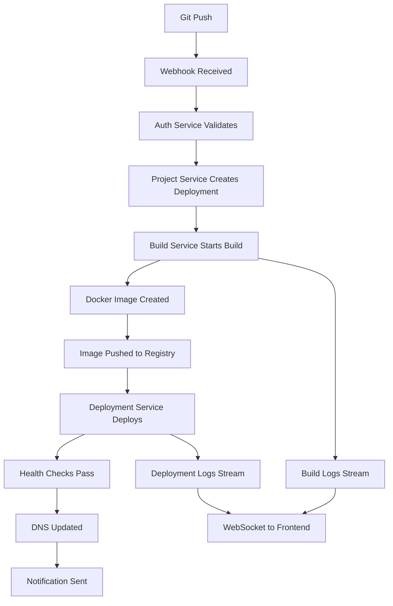
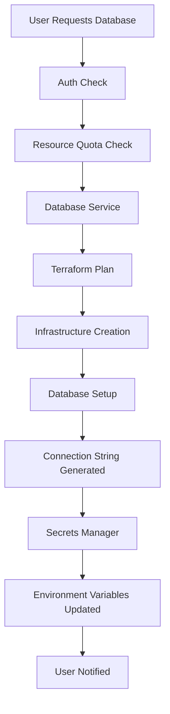

# Architecture Design: Railway.com Platform Creation

## 🏗️ System Architecture Overview

This document outlines the complete system architecture for building a Railway.com-like Platform-as-a-Service (PaaS), designed to handle deployment automation, database provisioning, and developer workflow management.

## 📐 **High-Level Architecture**

```
                                   Internet
                                      │
                            ┌─────────▼─────────┐
                            │   CDN + WAF       │
                            │   (Cloudflare)    │
                            └─────────┬─────────┘
                                      │
                            ┌─────────▼─────────┐
                            │   Load Balancer   │
                            │   (AWS ALB)       │
                            └─────────┬─────────┘
                                      │
                ┌─────────────────────┼─────────────────────┐
                │                     │                     │
        ┌───────▼────────┐   ┌────────▼────────┐   ┌───────▼────────┐
        │   Web App      │   │   API Gateway   │   │   CLI/Mobile   │
        │   (Next.js)    │   │   (Express.js)  │   │   (Go/React)   │
        └────────────────┘   └─────────┬───────┘   └────────────────┘
                                       │
                             ┌─────────▼─────────┐
                             │   Service Mesh    │
                             │   (Istio)         │
                             └─────────┬─────────┘
                                       │
              ┌────────────────────────┼────────────────────────┐
              │                        │                        │
    ┌─────────▼─────────┐    ┌─────────▼─────────┐    ┌─────────▼─────────┐
    │   Auth Service    │    │   Core Services   │    │   Build Service   │
    │   (Node.js)       │    │   (Node.js/Go)    │    │   (Go/Docker)     │
    └───────────────────┘    └─────────┬─────────┘    └─────────┬─────────┘
                                       │                        │
                             ┌─────────▼─────────┐              │
                             │   Data Layer      │              │
                             └─────────┬─────────┘              │
                                       │                        │
              ┌────────────────────────┼────────────────────────┼─────────┐
              │                        │                        │         │
    ┌─────────▼─────────┐    ┌─────────▼─────────┐    ┌─────────▼─────────┐ │
    │   PostgreSQL      │    │   Redis Cache     │    │   File Storage    │ │
    │   (AWS RDS)       │    │   (ElastiCache)   │    │   (AWS S3)        │ │
    └───────────────────┘    └───────────────────┘    └───────────────────┘ │
                                                                             │
                                                      ┌─────────────────────▼┐
                                                      │   Container Runtime  │
                                                      │   (EKS/Kubernetes)   │
                                                      └──────────────────────┘
```

## 🎯 **Core Components Architecture**

### **1. Frontend Layer**

```typescript
// Frontend Architecture Pattern
interface FrontendArchitecture {
  framework: 'Next.js 14+';
  routing: 'App Router';
  stateManagement: 'Zustand';
  styling: 'Tailwind CSS';
  components: 'Radix UI + Shadcn/ui';
  dataFetching: 'TanStack Query';
  forms: 'React Hook Form';
  authentication: 'Auth0 SDK';
}

// Component Structure
components/
├── dashboard/
│   ├── ProjectList.tsx
│   ├── DeploymentStatus.tsx
│   └── EnvironmentManager.tsx
├── deployment/
│   ├── BuildLogs.tsx
│   ├── DeploymentHistory.tsx
│   └── ConfigurationForm.tsx
├── database/
│   ├── DatabaseList.tsx
│   ├── ConnectionInfo.tsx
│   └── BackupManager.tsx
└── ui/
    ├── Button.tsx
    ├── Card.tsx
    └── DataTable.tsx
```

### **2. API Gateway Layer**

```typescript
// API Gateway Architecture
interface APIGatewayConfig {
  framework: 'Express.js + TypeScript';
  apiStyle: 'GraphQL + REST';
  authentication: 'JWT + Auth0';
  rateLimiting: 'Redis-based';
  logging: 'Structured JSON';
  monitoring: 'Prometheus metrics';
}

// Route Structure
routes/
├── graphql/
│   ├── schema/
│   │   ├── project.graphql
│   │   ├── deployment.graphql
│   │   └── user.graphql
│   └── resolvers/
│       ├── projectResolvers.ts
│       ├── deploymentResolvers.ts
│       └── userResolvers.ts
├── rest/
│   ├── auth/
│   ├── webhooks/
│   └── health/
└── middleware/
    ├── authentication.ts
    ├── authorization.ts
    ├── rateLimiting.ts
    └── logging.ts
```

### **3. Microservices Architecture**

```yaml
# Service Breakdown
services:
  auth-service:
    purpose: "User authentication and authorization"
    technology: "Node.js + Auth0"
    database: "PostgreSQL (users, sessions)"
    
  project-service:
    purpose: "Project and environment management"
    technology: "Node.js + TypeScript"
    database: "PostgreSQL (projects, environments)"
    
  build-service:
    purpose: "Build pipeline and container creation"
    technology: "Go + Docker"
    storage: "S3 (build artifacts)"
    
  deployment-service:
    purpose: "Container deployment and scaling"
    technology: "Go + Kubernetes client"
    orchestration: "Kubernetes"
    
  database-service:
    purpose: "Database provisioning and management"
    technology: "Go + Terraform"
    providers: "AWS RDS, ElastiCache"
    
  monitoring-service:
    purpose: "Metrics, logging, and alerting"
    technology: "Go + Prometheus"
    storage: "InfluxDB, Elasticsearch"
    
  notification-service:
    purpose: "Email, Slack, webhook notifications"
    technology: "Node.js + SendGrid"
    queue: "Redis Bull"
```

## 🔄 **Data Flow Architecture**

### **Deployment Flow**


### **Database Provisioning Flow**


## 🛡️ **Security Architecture**

### **Authentication & Authorization**
```typescript
// Security Layer Design
interface SecurityArchitecture {
  authentication: {
    provider: 'Auth0';
    methods: ['OAuth2', 'SAML', 'MFA'];
    tokenType: 'JWT';
    refreshStrategy: 'Sliding expiration';
  };
  authorization: {
    model: 'RBAC + ABAC';
    roles: ['Owner', 'Admin', 'Developer', 'Viewer'];
    permissions: {
      project: ['create', 'read', 'update', 'delete'];
      deployment: ['deploy', 'rollback', 'logs'];
      database: ['create', 'connect', 'backup'];
    };
  };
  networkSecurity: {
    vpc: 'Isolated per tenant';
    encryption: 'TLS 1.3 everywhere';
    firewall: 'WAF + Security Groups';
    secrets: 'AWS Secrets Manager';
  };
}

// Role-Based Access Control
enum Role {
  OWNER = 'owner',
  ADMIN = 'admin', 
  DEVELOPER = 'developer',
  VIEWER = 'viewer'
}

interface Permission {
  resource: string;
  action: string;
  conditions?: Record<string, any>;
}

const rolePermissions: Record<Role, Permission[]> = {
  [Role.OWNER]: [
    { resource: '*', action: '*' }
  ],
  [Role.ADMIN]: [
    { resource: 'project', action: '*' },
    { resource: 'deployment', action: '*' },
    { resource: 'database', action: '*' },
    { resource: 'team', action: 'invite' }
  ],
  [Role.DEVELOPER]: [
    { resource: 'project', action: 'read' },
    { resource: 'deployment', action: '*' },
    { resource: 'database', action: 'connect' }
  ],
  [Role.VIEWER]: [
    { resource: 'project', action: 'read' },
    { resource: 'deployment', action: 'read' }
  ]
};
```

### **Network Security Design**
```yaml
# VPC Configuration
vpc:
  cidr: "10.0.0.0/16"
  
  public_subnets:
    - "10.0.1.0/24"  # Load balancers
    - "10.0.2.0/24"  # NAT gateways
    
  private_subnets:
    - "10.0.11.0/24" # Application services
    - "10.0.12.0/24" # Application services
    
  database_subnets:
    - "10.0.21.0/24" # RDS instances
    - "10.0.22.0/24" # RDS instances

security_groups:
  load_balancer:
    ingress:
      - port: 443
        protocol: tcp
        source: "0.0.0.0/0"
      - port: 80
        protocol: tcp
        source: "0.0.0.0/0"
        
  application:
    ingress:
      - port: 3000-3010
        protocol: tcp
        source: load_balancer_sg
        
  database:
    ingress:
      - port: 5432
        protocol: tcp
        source: application_sg
```

## 📊 **Scaling Architecture**

### **Horizontal Scaling Strategy**
```typescript
// Auto-scaling Configuration
interface ScalingConfig {
  frontend: {
    type: 'Static files + CDN';
    scaling: 'Global edge caching';
    strategy: 'Automatic via Cloudflare';
  };
  
  apiGateway: {
    type: 'Load balanced instances';
    minReplicas: 3;
    maxReplicas: 50;
    scaling: 'CPU + Memory + Request rate';
    strategy: 'Kubernetes HPA';
  };
  
  services: {
    authService: {
      minReplicas: 2;
      maxReplicas: 10;
      scaling: 'Request rate based';
    };
    buildService: {
      minReplicas: 3;
      maxReplicas: 100;
      scaling: 'Queue length based';
    };
    deploymentService: {
      minReplicas: 2;
      maxReplicas: 20;
      scaling: 'Active deployments based';
    };
  };
  
  database: {
    primary: 'Read/write with auto-scaling storage';
    readReplicas: 'Auto-scale 1-5 based on read load';
    caching: 'Redis cluster with auto-scaling';
  };
}
```

### **Performance Optimization**
```yaml
# Caching Strategy
caching:
  levels:
    - name: "CDN Edge Cache"
      type: "Cloudflare"
      ttl: "1 hour"
      content: ["Static assets", "API responses"]
      
    - name: "Application Cache"
      type: "Redis"
      ttl: "15 minutes"
      content: ["Database queries", "API responses"]
      
    - name: "Database Query Cache"
      type: "PostgreSQL"
      ttl: "5 minutes"
      content: ["Frequent queries"]

# Database Optimization
database:
  connections:
    pooling: "PgBouncer"
    max_connections: 100
    pool_size: 20
    
  indexing:
    strategy: "Composite indexes on query patterns"
    monitoring: "pg_stat_statements"
    
  partitioning:
    tables: ["deployments", "logs", "metrics"]
    strategy: "Time-based partitioning"
```

## 🔍 **Monitoring & Observability Architecture**

### **Three Pillars of Observability**
```typescript
interface ObservabilityStack {
  metrics: {
    collection: 'Prometheus';
    visualization: 'Grafana';
    alerting: 'Alertmanager';
    retention: '30 days';
  };
  
  logging: {
    collection: 'Fluentd';
    storage: 'Loki';
    visualization: 'Grafana';
    retention: '7 days';
  };
  
  tracing: {
    collection: 'OpenTelemetry';
    storage: 'Jaeger';
    visualization: 'Jaeger UI';
    retention: '3 days';
  };
}

// Custom Metrics Definition
const customMetrics = {
  business: [
    'deployments_total',
    'users_active_daily',
    'projects_created_total',
    'revenue_monthly'
  ],
  
  technical: [
    'api_request_duration',
    'build_duration_seconds',
    'deployment_success_rate',
    'database_connection_pool_usage'
  ],
  
  infrastructure: [
    'kubernetes_pod_cpu_usage',
    'kubernetes_pod_memory_usage',
    'postgresql_connections_active',
    'redis_memory_usage'
  ]
};
```

### **Alerting Strategy**
```yaml
# Alert Rules Configuration
alerts:
  critical:
    - name: "API Gateway Down"
      condition: "up{job='api-gateway'} == 0"
      duration: "1m"
      channels: ["pagerduty", "slack"]
      
    - name: "Database Connection Failed"
      condition: "postgresql_up == 0"
      duration: "30s"
      channels: ["pagerduty", "slack", "email"]
      
  warning:
    - name: "High API Latency"
      condition: "api_request_duration_seconds > 2"
      duration: "5m"
      channels: ["slack"]
      
    - name: "Build Queue Backed Up"
      condition: "build_queue_length > 50"
      duration: "10m"
      channels: ["slack"]
      
  info:
    - name: "New User Signup"
      condition: "increase(users_total[1h]) > 10"
      channels: ["slack"]
```

## 🚀 **Deployment Architecture**

### **Multi-Environment Strategy**
```typescript
interface EnvironmentConfig {
  development: {
    infrastructure: 'Local Docker Compose';
    database: 'Local PostgreSQL';
    authentication: 'Mock Auth0';
    monitoring: 'Basic logging';
  };
  
  staging: {
    infrastructure: 'Single EKS cluster';
    database: 'AWS RDS (small instance)';
    authentication: 'Auth0 development';
    monitoring: 'Full stack with test data';
  };
  
  production: {
    infrastructure: 'Multi-AZ EKS cluster';
    database: 'AWS RDS Multi-AZ with read replicas';
    authentication: 'Auth0 production';
    monitoring: 'Full observability stack';
  };
}
```

### **Blue-Green Deployment**
```yaml
# Blue-Green Deployment Strategy
deployment:
  strategy: "blue-green"
  
  blue_environment:
    namespace: "railway-blue"
    traffic_weight: 100
    
  green_environment:
    namespace: "railway-green"
    traffic_weight: 0
    
  rollout_process:
    1: "Deploy to green environment"
    2: "Run health checks"
    3: "Run integration tests"
    4: "Gradually shift traffic (10%, 25%, 50%, 100%)"
    5: "Monitor metrics for 15 minutes"
    6: "Complete switch or rollback"
    
  rollback_triggers:
    - "Error rate > 1%"
    - "Latency > 2s"
    - "Health check failures"
    - "Manual trigger"
```

## 📋 **Component Interaction Patterns**

### **Service Communication**
```typescript
// Inter-service Communication Patterns
interface ServiceCommunication {
  synchronous: {
    protocol: 'HTTP/gRPC';
    pattern: 'Request-Response';
    timeout: '30 seconds';
    retries: 3;
    circuitBreaker: true;
  };
  
  asynchronous: {
    protocol: 'Message Queue (Redis)';
    pattern: 'Publish-Subscribe';
    durability: 'Persistent';
    ordering: 'FIFO where needed';
  };
  
  eventSourcing: {
    events: ['UserCreated', 'ProjectDeployed', 'DatabaseProvisioned'];
    store: 'PostgreSQL event store';
    projection: 'Real-time view updates';
  };
}

// Event-Driven Architecture Example
interface DeploymentEvent {
  eventId: string;
  eventType: 'DeploymentStarted' | 'DeploymentCompleted' | 'DeploymentFailed';
  aggregateId: string; // deployment ID
  payload: {
    projectId: string;
    environmentId: string;
    commitSha: string;
    userId: string;
    timestamp: Date;
  };
}
```

---

### 🔄 Navigation

**Previous:** [Technology Stack](./technology-stack.md) | **Next:** [Learning Roadmap](./learning-roadmap.md)

---

## 📖 References

1. [Microservices Architecture Patterns](https://microservices.io/patterns/)
2. [Cloud Native Architecture](https://www.cncf.io/blog/2018/03/02/principles-of-container-app-design/)
3. [Event-Driven Architecture](https://martinfowler.com/articles/201701-event-driven.html)
4. [Kubernetes Architecture](https://kubernetes.io/docs/concepts/architecture/)
5. [GraphQL Best Practices](https://graphql.org/learn/best-practices/)
6. [Security Architecture Patterns](https://owasp.org/www-project-application-security-architecture/)
7. [Observability Engineering](https://www.oreilly.com/library/view/observability-engineering/9781492076438/)
8. [Building Microservices](https://samnewman.io/books/building_microservices/)

*This architecture design provides the blueprint for building a scalable, secure, and maintainable Railway.com-like platform.*